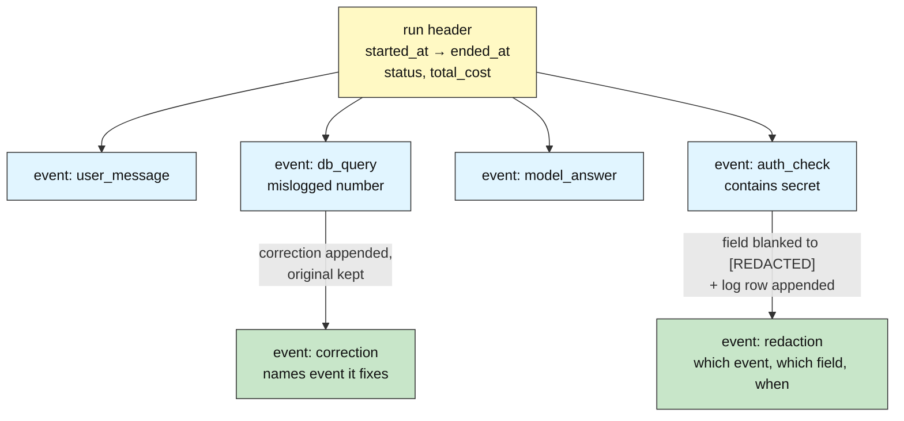
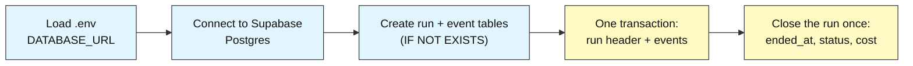
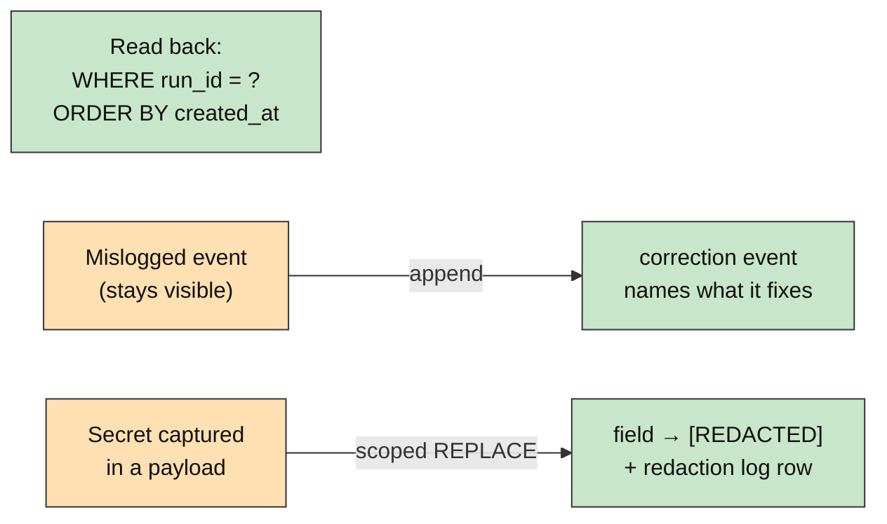

# Audit DB Basics: How to Write Event Data Reliably

## Recording Agent Activity

**Difficulty: Beginner | ~35 min | Requires Supabase setup (see Prerequisites)**

*Lab 1 of 8 in the Audit DB Labs module.*

---

# Problem Statement / Use Case Overview

An AI harness — the scaffolding that runs an agent — does invisible work: it calls tools, queries databases, spends money, and returns answers. When something goes wrong (or a compliance reviewer asks "prove what the agent did"), a harness with no memory of its own actions is a **black box**: you can't debug the bad run, can't prove what happened, can't total the cost, and can't detect misuse.

This lab builds the smallest useful fix: an **audit log** on a real cloud Postgres database (Supabase). You will record one agent *run* and the *events* that happened inside it, close the run out when it finishes, read its history back in order, correct a mislogged row without editing it, and redact a captured secret without deleting anything. The one unusual rule that shapes everything: once written, history is **append-only** — you add new records, you don't quietly rewrite old ones (Audit-DB-Labs README Sections 1.2 and 3).

---

# Underlying Concepts

**Audit vs normal database.** A normal database answers *"what is true right now?"* — the current balance, the current status. An audit database answers *"what happened, when, and in what order?"* — the film reel that produced the photo (README Sections 1–1.2). That single difference explains every rule below.

**Append-only discipline.** Because history is only trustworthy if it can't have been rewritten, event rows are added, never silently edited or deleted (README Section 3). Exactly two exceptions exist, both controlled: the `run` header gets **one** lifecycle write when the run finishes (`ended_at`, `status`, `total_cost` — facts that didn't exist at creation), and a sensitive field may be **redacted**, but only with a new log row recording the act. Corrections work the same spirit: fix mistakes by appending a superseding record, leaving the original visible (README Section 3.1).

The diagram below shows how one run's rows fit together, including both visible-forever patterns:



The key insight: every arrow *adds* a row — nothing points backward into an edit. Yellow is the one header allowed its lifecycle write; blue events are immutable; green rows are how the log repairs or cleans itself while staying honest.

**Transactions.** A transaction groups writes so they all succeed or all fail together (README Section 4.1). Logging a run header plus its events inside one transaction means a crash can never leave a half-recorded run — an audit log's worst artifact.

**Timestamps as backbone.** Every row records when it happened (README Section 2.6); ordering by time — with a deterministic tiebreaker — is what turns rows back into a replay of events.

---

# Input Data

| Item | Detail |
|------|--------|
| **Source** | Synthetic agent activity, written inline in the notebook — no files to download |
| **Scenario** | One `support-agent` run answering "how many orders shipped yesterday?" |
| **Run row** | `agent_name`, `started_at`, `ended_at`, `status`, `total_cost` |
| **Event rows** | `run_id`, `event_type` (`user_message`, `db_query`, `model_answer`, `correction`, `auth_check`, `redaction`), `payload` (the details, as text), `created_at` |
| **Size** | 1 run header + 7–8 event rows per full run-through |

---

# Processing

### Part A — Writing Events Reliably



The notebook loads the connection string from a `.env` file using `python-dotenv`, connects to your real Supabase Postgres through `psycopg2`, creates the two tables idempotently, then writes one `run` header and its `event` rows inside a single transaction — committed together or not at all — and closes the header with its one allowed lifecycle update.

### Part B — Keeping the History Honest



The same history is read back in deterministic time order, a deliberately mislogged number is fixed by appending a correction (the original survives), and a captured secret is redacted in place — with the redaction itself logged as a new event. Every arrow appends; nothing edits silently.

---

# Output

When you run the notebook top-to-bottom, every step prints real output from your own Supabase database. The run id and timestamps differ on every run-through (they're generated live); below is the output captured from an actual validation run so you know exactly what to expect.

**Step 1 — connection succeeds** (your version string may differ slightly):

```
PostgreSQL 17.6 on x86_64-pc-linux-gnu, compiled by gcc (GCC) 15.2.0, 64-bit
```

**Steps 2–4 — tables created, run commits and closes:**

```
Tables ready: run, event
Run 8 committed with 3 events in one transaction.
Run 8 closed: status='completed', total_cost=$0.0042
```

**Step 5 — history read back in time order.** Note all three events share the *identical* timestamp `18:50:35.74599` — they were committed in one transaction, and `now()` returns that transaction's start time. This is exactly why the query adds `, event_id` as a deterministic tiebreaker:

```
(11, 'user_message', 'User asked: how many orders shipped yesterday?', datetime.datetime(2026, 8, 24, 18, 50, 35, 74599, tzinfo=datetime.timezone.utc))
(12, 'db_query', 'Counted shipped orders in the orders table.', datetime.datetime(2026, 8, 24, 18, 50, 35, 74599, tzinfo=datetime.timezone.utc))
(13, 'model_answer', 'Answered: 1284 orders shipped yesterday.', datetime.datetime(2026, 8, 24, 18, 50, 35, 74599, tzinfo=datetime.timezone.utc))
```

**Step 6 — the mistake and its correction, both still present:**

```
(14, 'db_query', 'Order-count query scanned 1500 rows.')
(15, 'correction', 'Correction: event 14 reported 1500 rows scanned; true count was 15000.')
```

**Step 7 — the secret blanked in place, plus the mandatory redaction log row:**

```
(16, 'auth_check', 'Login verified with api_key=[REDACTED].')
(17, 'redaction', "Redacted field 'payload' of event 16 at 2026-08-24 18:50:40.821485+00:00")
```

**Step 8 — recap:**

```
Run 8: opened, logged, closed, corrected, redacted - history intact.
The mislogged row AND the redaction note are both still visible; nothing was silently rewritten.
```

---

# Tech Stack

| Component | Tool |
|-----------|------|
| **Database** | Supabase Postgres (free tier is sufficient; this lab validated against PostgreSQL 17.6) |
| **Python driver** | `psycopg2-binary==2.9.12` — connects Python to Postgres |
| **Credential loader** | `python-dotenv==1.2.3` — loads `DATABASE_URL` from the module-level `.env` |

> **Compute & cost:** Runs fine on any laptop CPU — the entire workload is ~10 tiny SQL statements. Supabase's free tier covers it; nothing in this lab calls a paid API.

> Credentials never appear in the notebook itself: they're read from `.env` at runtime (README Section 7).

---

# Prerequisites

- **Basic Python** — variables, lists, loops, `import` statements. No prior SQL assumed; this lab starts from the beginning (README Section 9).
- **Supabase + `.env` setup completed** — follow Audit-DB-Labs README Section 7 exactly (create account → project → session-pooler connection string → `.env` with `DATABASE_URL` at the module level → run their test script). None of this lab works without it, so do it first.
- **No prior labs required** — this is Lab 1 of the module.

---

# Environment / Dependencies Setup

| Package | Purpose |
|---------|---------|
| `python-dotenv` | Loads `.env` files so credentials stay out of the notebook |
| `psycopg2-binary` | The standard Python driver that connects Python to Postgres |

Create a fresh virtual environment and install the two pinned packages (same versions the notebook's first cell installs):

```bash
python -m venv .venv-lab1
# Windows:
.venv-lab1\Scripts\activate
# macOS/Linux:
source .venv-lab1/bin/activate

pip install python-dotenv==1.2.3 psycopg2-binary==2.9.12
```

Then launch Jupyter from the same environment and open the notebook:

```bash
pip install jupyterlab
jupyter lab
```

The notebook's first code cell repeats the install as a single pinned line, so running it top-to-bottom in a fresh kernel leaves you correctly set up either way.

---

# Step-wise Development Instructions

Every step below matches one cell in `lab-recording-agent-activity.ipynb`. Run them in order — later cells depend on earlier ones.

### Step 0 — Install dependencies

```python
!pip install python-dotenv==1.2.3 psycopg2-binary==2.9.12
```

One pinned line installs everything the lab needs, matching Section 9 exactly.

### Step 1 — Connect to Postgres

```python
import os
from pathlib import Path
from datetime import datetime, timezone

from dotenv import load_dotenv
import psycopg2

env_path = next((p / ".env" for p in [Path.cwd(), *Path.cwd().parents] if (p / ".env").exists()), None)
load_dotenv(env_path)
database_url = os.getenv("DATABASE_URL")
assert database_url, "DATABASE_URL not found - complete README Section 7 setup first."

connection = psycopg2.connect(database_url, connect_timeout=10)
cursor = connection.cursor()
cursor.execute("SELECT version();")
print(cursor.fetchone()[0])
```

`psycopg2` is the standard Python driver for Postgres. The search expression walks upward from the notebook's folder until it finds the module-level `.env` (README Section 7), so credentials stay out of the code no matter which lab folder you run from. Printing Postgres's version string proves the connection really works before anything else happens.

### Step 2 — Create the two tables

```python
create_audit_tables = """
    CREATE TABLE IF NOT EXISTS run (
        run_id      SERIAL PRIMARY KEY,
        agent_name  TEXT,
        started_at  TIMESTAMPTZ DEFAULT now(),
        ended_at    TIMESTAMPTZ,
        status      TEXT,
        total_cost  NUMERIC(10, 6));
    CREATE TABLE IF NOT EXISTS event (
        event_id   SERIAL PRIMARY KEY,
        run_id     INTEGER,
        event_type TEXT,
        payload    TEXT,
        created_at TIMESTAMPTZ DEFAULT now());
"""
cursor.execute(create_audit_tables)
connection.commit()
print("Tables ready: run, event")
```

A `run` row is the header for one agent invocation; an `event` row is one thing that happened during it, pointing at its run through the plain `run_id` column. `IF NOT EXISTS` makes re-runs safe. Deliberately missing: foreign keys, `CHECK`/`NOT NULL` constraints, and indexes — designing those protections is Lab 2's job. Only `SERIAL PRIMARY KEY` remains, because Steps 6–7 must address individual rows by id.

### Step 3 — Record a run and its events in one transaction

```python
cursor.execute(
    "INSERT INTO run (agent_name, status) VALUES (%s, %s) RETURNING run_id",
    ("support-agent", "running"),
)
current_run_id = cursor.fetchone()[0]

events_to_log = [
    ("user_message", "User asked: how many orders shipped yesterday?"),
    ("db_query", "Counted shipped orders in the orders table."),
    ("model_answer", "Answered: 1284 orders shipped yesterday."),
]
for event_type, payload_text in events_to_log:
    cursor.execute(
        "INSERT INTO event (run_id, event_type, payload) VALUES (%s, %s, %s)",
        (current_run_id, event_type, payload_text),
    )

connection.commit()
print(f"Run {current_run_id} committed with {len(events_to_log)} events in one transaction.")
```

A transaction groups writes so they succeed or fail *together* (README Section 4.1) — a harness should never leave a half-logged run behind. `psycopg2` opens one automatically; nothing is saved until `commit()`. The header goes first so `RETURNING run_id` can hand back the id every event needs. Note the `%s` placeholders: parameters are always passed separately, never glued into the SQL string — that's the habit that defeats SQL injection.

### Step 4 — Close the run (the one allowed update)

```python
cursor.execute(
    "UPDATE run SET ended_at = now(), status = 'completed', total_cost = %s WHERE run_id = %s",
    (0.0042, current_run_id),
)
connection.commit()
print(f"Run {current_run_id} closed: status='completed', total_cost=$0.0042")
```

Append-only has exactly one exception for header rows: a run isn't finished when it *starts*, so filling in `ended_at`, `status`, and `total_cost` at the end records reality rather than rewriting it (README Section 3). This cell is the only update to the `run` row in the entire notebook — after it, the header is frozen.

### Step 5 — Read the history back

```python
cursor.execute(
    """SELECT event_id, event_type, payload, created_at
       FROM event
       WHERE run_id = %s
       ORDER BY created_at, event_id""",
    (current_run_id,),
)
for row in cursor.fetchall():
    print(row)
```

The core auditor's query: `WHERE` selects one run's events, `ORDER BY created_at` replays them in time order. The `, event_id` tiebreaker exists because events committed in one transaction share an identical timestamp — `now()` returns the transaction's start time — and tied rows would otherwise come back in arbitrary order.

### Step 6 — Corrections instead of edits

```python
cursor.execute(
    "INSERT INTO event (run_id, event_type, payload) VALUES (%s, %s, %s) RETURNING event_id",
    (current_run_id, "db_query", "Order-count query scanned 1500 rows."),
)
wrong_event_id = cursor.fetchone()[0]

cursor.execute(
    "INSERT INTO event (run_id, event_type, payload) VALUES (%s, %s, %s) RETURNING event_id",
    (current_run_id, "correction",
     f"Correction: event {wrong_event_id} reported 1500 rows scanned; true count was 15000."),
)
correcting_event_id = cursor.fetchone()[0]
connection.commit()

cursor.execute("SELECT event_id, event_type, payload FROM event WHERE event_id IN (%s, %s)",
               (wrong_event_id, correcting_event_id))
for row in cursor.fetchall():
    print(row)
```

We deliberately mislog a number, then fix it the only lawful way: a new `correction` event naming what it fixes (README Section 3.1). The final query proves both rows survive — the mistake stays part of the history instead of being erased from it.

### Step 7 — Redaction instead of deletion

```python
cursor.execute(
    "INSERT INTO event (run_id, event_type, payload) VALUES (%s, %s, %s) RETURNING event_id",
    (current_run_id, "auth_check", "Login verified with api_key=sk-demo-secret-42."),
)
secret_event_id = cursor.fetchone()[0]

cursor.execute(
    "UPDATE event SET payload = REPLACE(payload, %s, %s) WHERE event_id = %s",
    ("sk-demo-secret-42", "[REDACTED]", secret_event_id),
)
# Part 2 logs the redaction: which event, which field, when (UTC).
cursor.execute(
    "INSERT INTO event (run_id, event_type, payload) VALUES (%s, %s, %s) RETURNING event_id",
    (current_run_id, "redaction",
     f"Redacted field 'payload' of event {secret_event_id} at {datetime.now(timezone.utc)}"),
)
redaction_log_id = cursor.fetchone()[0]
connection.commit()

cursor.execute("SELECT event_id, event_type, payload FROM event WHERE event_id IN (%s, %s)",
               (secret_event_id, redaction_log_id))
for row in cursor.fetchall():
    print(row)
```

Sensitive data is the one narrow exception to "event rows never change," and even the exception has a rule (README Section 3.2): replace *just the secret inside that one field* — `REPLACE()` blanks the key value while leaving the rest of the payload intact — *and* append a new event recording which event, which field, and when. A silent overwrite would hide the fact that something was hidden; the log row keeps the cleanup itself on the record.

### Step 8 — Recap

```python
cursor.close()
connection.close()

print(f"Run {current_run_id}: opened, logged, closed, corrected, redacted - history intact.")
print("The mislogged row AND the redaction note are both still visible; nothing was silently rewritten.")
```

Closing the connection is plain good hygiene. The recap states the outcome that matters: a complete, ordered, self-correcting record where nothing was ever quietly edited or deleted.

---

# Optional Exercise

Extend the same run's story: connect again, insert a **second run** for a `billing-agent` with **five events logged inside one transaction**, close that run with its lifecycle update, then **redact two different secrets in two different events** — performing each redaction as the lab does (scoped `REPLACE` on the field *plus* its own `redaction` log row naming which event, which field, and when). Finish by querying the second run's events with `ORDER BY created_at, event_id` and verifying that both original events are still present, both show `[REDACTED]`, and both redaction log rows exist.

---

# What We Learnt

- **An audit database records the film reel, not the photo** — it answers "what happened, when, in what order," not "what is true right now" (README Sections 1–1.2).
- **Append-only discipline makes history trustworthy** — event rows are added, never silently edited or deleted, with exactly two controlled exceptions: the run header's one lifecycle update and self-logging redaction (README Section 3).
- **Corrections replace edits** — a mistake is fixed by appending a new record that supersedes it, leaving the original visible for auditors (README Section 3.1).
- **Redaction is scoped and self-documenting** — blank the sensitive contents of one field, then log the act itself as a new event (README Section 3.2).
- **Transactions make writes all-or-nothing** — a run header and its events commit together, so a crash never leaves a half-recorded run (README Section 4.1).
- **`WHERE` + `ORDER BY` reconstruct a run's timeline** — and a deterministic tiebreaker matters because same-transaction rows share identical timestamps (README Section 2.6).
- **Credentials live in `.env`, parameters in `%s` placeholders** — secrets stay out of code, and user data stays out of SQL strings.
