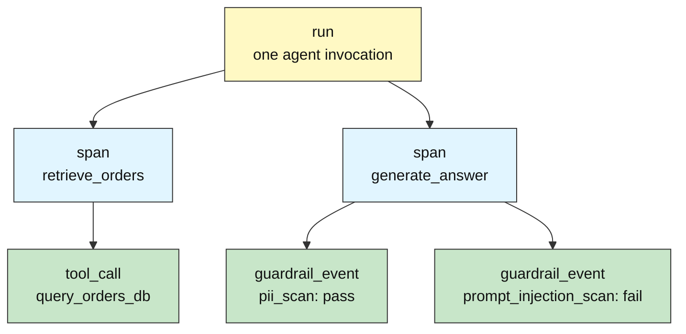
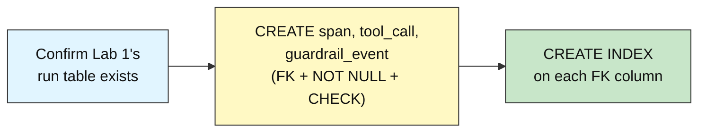
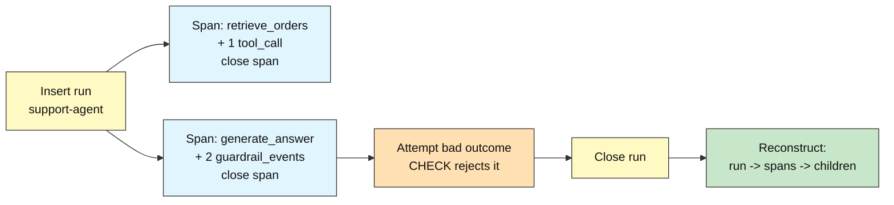

# Audit DB Intermediate: How to Design an Auditable Schema

## Modeling Runs, Spans, and Tool Calls

**Difficulty: Intermediate | ~40 min | Requires Lab 1 (Recording Agent Activity) done in this Supabase project**

*Lab 2 of 5 in the Audit DB Labs module.*

---

# Problem Statement / Use Case Overview

Lab 1 gave the `support-agent` harness a working audit log: one `run` header table and one flat `event` table, with a free-text `event_type` column doing all the work of describing what happened. That was enough to write history reliably, but it doesn't scale as a *schema*. Nothing stops an `event` row from carrying a `run_id` that doesn't exist. Nothing tells you, without parsing strings, whether a row is a tool call, a guardrail check, or something else entirely. And nothing stops a guardrail's `outcome` from being typo'd into a value no downstream report knows how to read.

This lab replaces the flat table with the real relational shape the module's README describes: a **run** contains **spans** (units of work — one retrieval step, one LLM call), and each span can contain **tool_calls** (a specific tool the agent invoked) and **guardrail_events** (a policy or safety check that fired). You will design and build that hierarchy with real `FOREIGN KEY`, `NOT NULL`, and `CHECK` constraints — so the *database itself* refuses to let the pieces come apart — plus the indexes the resulting queries actually need. Lab 1's `run` and `event` tables stay exactly as they are underneath; this lab adds to the schema, it doesn't replace them (Audit-DB-Labs README Section 8.1).

---

# Underlying Concepts

**Why a flat table stops working.** Lab 1's `event.event_type` column could hold `'user_message'`, `'db_query'`, `'redaction'` — anything at all, because it's just text. That flexibility is exactly the problem for a schema meant to be queried and trusted at scale: there's no way to ask "give me every tool call" without string-matching, and no way to stop a bad row from being inserted at all. **Normalization** — splitting one loose table into several narrower, purpose-built tables — trades that flexibility for structure: a `tool_call` row can only be a tool call, and it can only exist attached to a real `span`.

**Foreign keys make the hierarchy physical, not just implied.** The README's Section 2.5 already named the plan: "child rows point back to their parent through a foreign key... Lab 2 builds it directly." A `FOREIGN KEY` is a standing rule Postgres enforces on every write: `span.run_id` must match an existing `run.run_id`, or the insert is rejected outright. Lab 1's plain `run_id` integer column *looked* like a link but enforced nothing — a typo'd id would insert silently. This lab's `span`, `tool_call`, and `guardrail_event` tables cannot make that mistake.



Every arrow above is a foreign key: `span.run_id → run.run_id`, `tool_call.span_id → span.span_id`, `guardrail_event.span_id → span.span_id`. Break any arrow — try to insert a `tool_call` pointing at a `span_id` that was never created — and Postgres refuses the write.

**`NOT NULL` and `CHECK` make the schema self-protecting.** `NOT NULL` says a field can't be meaningfully absent — a `tool_call` with no `tool_name`, or a `guardrail_event` with no `outcome`, isn't useful data no matter how it got there. `CHECK` goes further: it constrains a value to a specific, legal set. This lab's `guardrail_event.outcome` may only be `'pass'`, `'fail'`, or `'warn'` — the schema's own vocabulary, enforced at write time instead of hoped for in application code (README Section 4.2).

**Indexing the lookups you'll actually run.** An **index** lets Postgres jump straight to matching rows instead of scanning an entire table — the same role an index plays at the back of a book (README Section 4.5). This lab's core query pattern is "all spans for a run" and "all tool_calls / guardrail_events for a span" — exactly the query Step 9 (Processing, below) runs to reconstruct history. Indexing `span.run_id`, `tool_call.span_id`, and `guardrail_event.span_id` means that lookup stays fast as the audit log grows into millions of rows, instead of degrading into a full table scan.

---

# Input Data

| Item | Detail |
|------|--------|
| **Source** | Synthetic agent activity, written inline in the notebook — no files to download |
| **Prerequisite data** | Lab 1's `run` table, already present in this Supabase project |
| **Scenario** | The same `support-agent` run, now modeled with real structure instead of a flat event log |
| **Span rows** | `run_id` (FK), `span_name`, `started_at`, `ended_at` |
| **Tool call rows** | `span_id` (FK), `tool_name`, `arguments`, `result`, `success` |
| **Guardrail event rows** | `span_id` (FK), `check_name`, `outcome` (`CHECK`-constrained), `reason` |
| **Size** | 1 run + 2 spans + 1 tool_call + 2 guardrail_events (one `pass`, one `fail`) per full run-through |

---

# Processing

### Part A — Designing the Schema



The notebook first confirms Lab 1's `run` table is present (this lab's Prerequisites require it), then creates the three new tables in one statement — each with its `FOREIGN KEY`, its `NOT NULL` fields, and the `guardrail_event.outcome` `CHECK` constraint — followed by the three indexes those tables' query patterns need.

### Part B — Recording and Reconstructing a Run



One run is opened, then two spans are logged in turn — each following the same open → do the work → close lifecycle Lab 1 used for a run — with a `tool_call` nested in the first and two `guardrail_event`s (one `pass`, one `fail`) nested in the second. An out-of-range guardrail outcome is deliberately attempted and rejected, proving the `CHECK` constraint fires. Finally, the run is closed and its full nested history is reconstructed using the indexes built in Part A.

---

# Output

When you run the notebook top-to-bottom, every step prints real output from your own Supabase database. Run the notebook yourself and your ids/timestamps will differ from any sample shown here — that is expected, since every value is generated live against your database, not fabricated.

Expect output shaped like this (values illustrative — yours will differ):

```
Step 1 (connect):        PostgreSQL 17.6 on x86_64-pc-linux-gnu, ...
Step 2 (prerequisite):   Lab 1's run table found - building the schema on top of it.
Step 3 (schema):         Tables ready: span, tool_call, guardrail_event (with foreign keys, CHECK, and indexes).
Step 4 (run):            Run <id> started for support-agent.
Step 5 (span 1):         Span <id> 'retrieve_orders' recorded with 1 tool_call, then closed.
Step 6 (span 2):         Span <id> 'generate_answer' recorded with 2 guardrail_events (pass, fail), then closed.
Step 7 (CHECK demo):     CHECK constraint rejected the out-of-range outcome, as designed:
                         (followed by the FULL, multi-line psycopg2 CheckViolation message —
                          not truncated to one line — including Postgres's own DETAIL: line
                          naming the actual failing row and the values that violated the constraint)
Step 8 (close run):      Run <id> closed: status='completed', total_cost=$0.0057
Step 9 (reconstruct):    Run <id> has 2 span(s):
                           span <id> - retrieve_orders (<start> -> <end>)
                             tool_call <id>: query_orders_db -> 1284 rows returned (success=True)
                           span <id> - generate_answer (<start> -> <end>)
                             guardrail_event <id>: pii_scan -> pass (no personal data found in the draft answer)
                             guardrail_event <id>: prompt_injection_scan -> fail (retrieved content contained an instruction-override attempt)
Step 10 (recap):         Run <id>: 1 run, 2 spans, 1 tool_call, 2 guardrail_events - schema is now relational.
                         Foreign keys, NOT NULL, CHECK, and indexes make the shape self-protecting, not just documented.
```

> **Note:** this section describes the output shape the notebook is built to produce; fill in your own run's real values after you execute it end to end (Gate 2/3 in `AGENTS.md`).

---

# Tech Stack

| Component | Tool |
|-----------|------|
| **Database** | Supabase Postgres (free tier is sufficient; validated against PostgreSQL 17.6 in Lab 1) |
| **Python driver** | `psycopg2-binary==2.9.12` — connects Python to Postgres, including its `errors.CheckViolation` exception used in Step 7 |
| **Credential loader** | `python-dotenv==1.2.3` — loads `DATABASE_URL` from the module-level `.env` |

> **Compute & cost:** Runs fine on any laptop CPU — the entire workload is a handful of small SQL statements. Supabase's free tier covers it; nothing in this lab calls a paid API.

> Credentials never appear in the notebook itself: they're read from `.env` at runtime (README Section 7), exactly as in Lab 1.

---

# Prerequisites

- **Lab 1 (Recording Agent Activity) completed in this same Supabase project** — this lab's Step 2 explicitly checks for Lab 1's `run` table and fails fast with a clear message if it isn't there. This is a hard requirement, not a suggestion.
- **Comfort with Lab 1's basics** — connecting via `.env`, `INSERT ... RETURNING`, transactions, and the append-only discipline (README Sections 3–4.1). This lab assumes those, and focuses on the new material: constraints and indexing.
- **Supabase + `.env` setup completed** — the same one-time setup from Audit-DB-Labs README Section 7. If you haven't done it, do Lab 1 first; its Prerequisites walk through it in full.

---

# Environment / Dependencies Setup

| Package | Purpose |
|---------|---------|
| `python-dotenv` | Loads `.env` files so credentials stay out of the notebook |
| `psycopg2-binary` | The standard Python driver that connects Python to Postgres, and the source of the `CheckViolation` exception this lab catches |

Install the two pinned packages (same versions the notebook's first cell installs, matching Lab 1 exactly so nothing drifts between labs):

```bash
pip install python-dotenv==1.2.3 psycopg2-binary==2.9.12
```

The notebook's first code cell repeats this exact line, so running it top-to-bottom leaves you correctly set up either way.

---

# Step-wise Development Instructions

Every step below matches one cell in `lab-modeling-runs-spans-tool-calls.ipynb`. Run them in order — later cells depend on earlier ones.

### Step 0 — Install dependencies

```python
!pip install python-dotenv==1.2.3 psycopg2-binary==2.9.12
```

One pinned line installs everything the lab needs, matching Section 9 exactly.

### Step 1 — Connect to Postgres

```python
import os
from pathlib import Path
from datetime import datetime, timezone

from dotenv import load_dotenv
import psycopg2

env_path = next((p / ".env" for p in [Path.cwd(), *Path.cwd().parents] if (p / ".env").exists()), None)
load_dotenv(env_path)
database_url = os.getenv("DATABASE_URL")
assert database_url, "DATABASE_URL not found - complete README Section 7 setup first."

connection = psycopg2.connect(database_url, connect_timeout=10)
cursor = connection.cursor()
cursor.execute("SELECT version();")
print(cursor.fetchone()[0])
```

Identical to Lab 1's Step 1 — same upward `.env` search, same connection, same version-string proof.

### Step 2 — Confirm Lab 1's schema is already here

```python
cursor.execute("SELECT to_regclass('public.run')")
assert cursor.fetchone()[0] is not None, "run table missing - complete Lab 1 in this Supabase project first."
print("Lab 1's run table found - building the schema on top of it.")
```

`to_regclass` returns the table's identifier if it exists, or `NULL` if it doesn't — a clean existence check with no exception to catch. Failing here with a specific message is more useful than a raw "relation does not exist" error three cells later.

### Step 3 — Create span, tool_call, and guardrail_event

```python
create_schema = """
    CREATE TABLE IF NOT EXISTS span (
        span_id     SERIAL PRIMARY KEY,
        run_id      INTEGER NOT NULL REFERENCES run(run_id),
        span_name   TEXT NOT NULL,
        started_at  TIMESTAMPTZ NOT NULL DEFAULT now(),
        ended_at    TIMESTAMPTZ);
    CREATE TABLE IF NOT EXISTS tool_call (
        tool_call_id SERIAL PRIMARY KEY,
        span_id      INTEGER NOT NULL REFERENCES span(span_id),
        tool_name    TEXT NOT NULL,
        arguments    TEXT,
        result       TEXT,
        success      BOOLEAN NOT NULL,
        called_at    TIMESTAMPTZ NOT NULL DEFAULT now());
    CREATE TABLE IF NOT EXISTS guardrail_event (
        guardrail_event_id SERIAL PRIMARY KEY,
        span_id             INTEGER NOT NULL REFERENCES span(span_id),
        check_name          TEXT NOT NULL,
        outcome             TEXT NOT NULL CHECK (outcome IN ('pass', 'fail', 'warn')),
        reason              TEXT,
        checked_at          TIMESTAMPTZ NOT NULL DEFAULT now());
    CREATE INDEX IF NOT EXISTS idx_span_run_id ON span (run_id);
    CREATE INDEX IF NOT EXISTS idx_tool_call_span_id ON tool_call (span_id);
    CREATE INDEX IF NOT EXISTS idx_guardrail_event_span_id ON guardrail_event (span_id);
"""
cursor.execute(create_schema)
connection.commit()
print("Tables ready: span, tool_call, guardrail_event (with foreign keys, CHECK, and indexes).")
```

`REFERENCES run(run_id)` and `REFERENCES span(span_id)` are the foreign keys wiring the hierarchy together (Underlying Concepts, above). `NOT NULL` marks the fields every row needs to be meaningful. The `CHECK (outcome IN (...))` clause is the schema's own vocabulary rule for guardrail outcomes. `IF NOT EXISTS` on both the tables and the indexes makes this cell safe to re-run.

### Step 4 — Start a new run

```python
cursor.execute(
    "INSERT INTO run (agent_name, status) VALUES (%s, %s) RETURNING run_id",
    ("support-agent", "running"),
)
current_run_id = cursor.fetchone()[0]
connection.commit()
print(f"Run {current_run_id} started for support-agent.")
```

Same `run` table, same insert-then-`RETURNING` pattern Lab 1 used — every span below needs this id.

### Step 5 — Log a retrieval span and its tool call

```python
cursor.execute(
    "INSERT INTO span (run_id, span_name) VALUES (%s, %s) RETURNING span_id",
    (current_run_id, "retrieve_orders"),
)
retrieve_span_id = cursor.fetchone()[0]

cursor.execute(
    "INSERT INTO tool_call (span_id, tool_name, arguments, result, success) "
    "VALUES (%s, %s, %s, %s, %s)",
    (retrieve_span_id, "query_orders_db",
     '{"table": "orders", "filter": "shipped_yesterday"}', "1284 rows returned", True),
)

cursor.execute("UPDATE span SET ended_at = now() WHERE span_id = %s", (retrieve_span_id,))
connection.commit()
print(f"Span {retrieve_span_id} 'retrieve_orders' recorded with 1 tool_call, then closed.")
```

The span follows the same lifecycle as a `run`: create it, log the work that happened inside it, then close it with one update to `ended_at`. The `tool_call` row is a real foreign-keyed child of this span, not a loosely-typed `event`.

### Step 6 — Log an answer span with two guardrail checks

```python
cursor.execute(
    "INSERT INTO span (run_id, span_name) VALUES (%s, %s) RETURNING span_id",
    (current_run_id, "generate_answer"),
)
answer_span_id = cursor.fetchone()[0]

cursor.execute(
    "INSERT INTO guardrail_event (span_id, check_name, outcome, reason) VALUES (%s, %s, %s, %s)",
    (answer_span_id, "pii_scan", "pass", "no personal data found in the draft answer"),
)
cursor.execute(
    "INSERT INTO guardrail_event (span_id, check_name, outcome, reason) VALUES (%s, %s, %s, %s)",
    (answer_span_id, "prompt_injection_scan", "fail",
     "retrieved content contained an instruction-override attempt"),
)

cursor.execute("UPDATE span SET ended_at = now() WHERE span_id = %s", (answer_span_id,))
connection.commit()
print(f"Span {answer_span_id} 'generate_answer' recorded with 2 guardrail_events (pass, fail), then closed.")
```

Two guardrail checks fired during this span — one that passed, one that failed. Logging both, not just the failure, is what makes the log a complete audit trail rather than only a blocklist.

### Step 7 — Prove the CHECK constraint fires

```python
try:
    cursor.execute(
        "INSERT INTO guardrail_event (span_id, check_name, outcome, reason) VALUES (%s, %s, %s, %s)",
        (answer_span_id, "bad_test", "maybe", "attempting an out-of-range outcome value"),
    )
except psycopg2.errors.CheckViolation as error:
    connection.rollback()
    print("CHECK constraint rejected the out-of-range outcome, as designed:")
    print(error)
```

`'maybe'` isn't `'pass'`, `'fail'`, or `'warn'`, so Postgres refuses the insert. A failed statement leaves the transaction in an aborted state until `rollback()` runs — that's why it's called immediately in the `except` block, before the connection is used again. `print(error)` shows Postgres's complete message, including its `DETAIL:` line naming the actual failing row — seeing the real, unsanitized database error is the point of a learning lab, not a summarized one-liner.

### Step 8 — Close the run

```python
cursor.execute(
    "UPDATE run SET ended_at = now(), status = 'completed', total_cost = %s WHERE run_id = %s",
    (0.0057, current_run_id),
)
connection.commit()
print(f"Run {current_run_id} closed: status='completed', total_cost=$0.0057")
```

The same one-time lifecycle update Lab 1 used to close a run — now that both of its spans are closed too.

### Step 9 — Reconstruct the run's full nested history

```python
cursor.execute(
    "SELECT span_id, span_name, started_at, ended_at FROM span WHERE run_id = %s ORDER BY started_at",
    (current_run_id,),
)
spans = cursor.fetchall()
print(f"Run {current_run_id} has {len(spans)} span(s):")
for span_id, span_name, started_at, ended_at in spans:
    print(f"  span {span_id} - {span_name} ({started_at} -> {ended_at})")

    cursor.execute(
        "SELECT tool_call_id, tool_name, result, success FROM tool_call WHERE span_id = %s",
        (span_id,),
    )
    for tool_call_id, tool_name, result, success in cursor.fetchall():
        print(f"    tool_call {tool_call_id}: {tool_name} -> {result} (success={success})")

    cursor.execute(
        "SELECT guardrail_event_id, check_name, outcome, reason FROM guardrail_event WHERE span_id = %s",
        (span_id,),
    )
    for guardrail_event_id, check_name, outcome, reason in cursor.fetchall():
        print(f"    guardrail_event {guardrail_event_id}: {check_name} -> {outcome} ({reason})")
```

Each query here hits the index built in Step 3 — `span.run_id` first, then `tool_call.span_id` and `guardrail_event.span_id` per span — instead of scanning the full table. Walking the foreign keys directly, one lookup per level, makes the parent → child relationship itself the thing you're watching work; a single `JOIN` could collapse this into one round trip, and that's exactly what Lab 3 covers next.

### Step 10 — Recap

```python
cursor.close()
connection.close()
print(f"Run {current_run_id}: 1 run, 2 spans, 1 tool_call, 2 guardrail_events - schema is now relational.")
print("Foreign keys, NOT NULL, CHECK, and indexes make the shape self-protecting, not just documented.")
```

Closing the connection is the same good hygiene as Lab 1. The recap names what changed: the story is identical to Lab 1's, but the schema underneath it now refuses to let its own pieces come apart.

---

# Optional Exercise

Extend the same run's story: insert a **third span** named `send_notification` under the same run, log **two tool_calls** inside it (one with `success=True`, one with `success=False`), add **one more guardrail_event** on that span with `outcome='warn'`, close the span with the same lifecycle update Step 5 and Step 6 used, then re-run Step 9's reconstruction query and confirm all three spans and every child row appear correctly nested underneath the right span.

---

# What We Learnt

- **A flat table with a free-text type column doesn't scale as a schema** — it can't stop a bad reference or enforce a vocabulary; normalizing into `span`, `tool_call`, and `guardrail_event` fixes both (Problem Statement, above).
- **Foreign keys make a hierarchy physical, not just implied** — `span.run_id`, `tool_call.span_id`, and `guardrail_event.span_id` are standing rules Postgres enforces on every write, not conventions hoped for in application code (README Section 4.2, Underlying Concepts).
- **`NOT NULL` and `CHECK` make the schema self-protecting** — required fields can't be silently absent, and `guardrail_event.outcome` can only ever be `'pass'`, `'fail'`, or `'warn'` (Underlying Concepts; Step 7 proved it by triggering the rejection).
- **Indexes should target real query patterns** — `span.run_id` and the two `span_id` foreign keys were indexed because Step 9's reconstruction query actually runs those lookups, not as a generic best practice (README Section 4.5).
- **A span mirrors a run's own lifecycle** — created, worked on, closed with one update — the same append-then-close discipline Lab 1 taught, now applied one level deeper in the hierarchy.
- **Walking foreign keys directly reconstructs a hierarchy without a JOIN** — useful for seeing the parent → child relationship work, and the natural lead-in to Lab 3's `JOIN`-based approach to the same problem (README Section 4.3).
