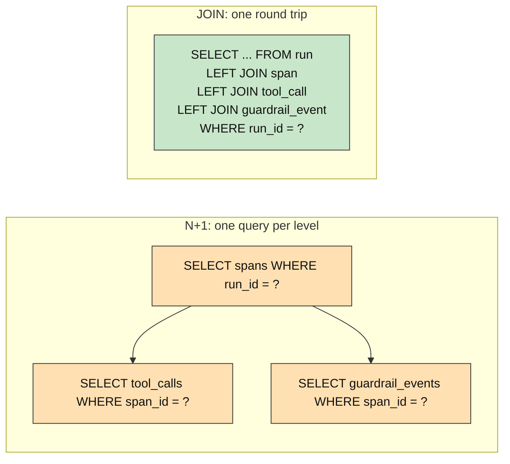
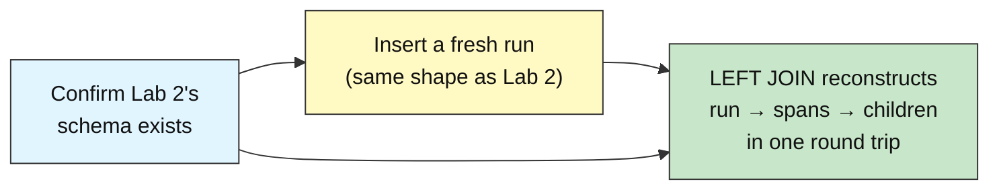
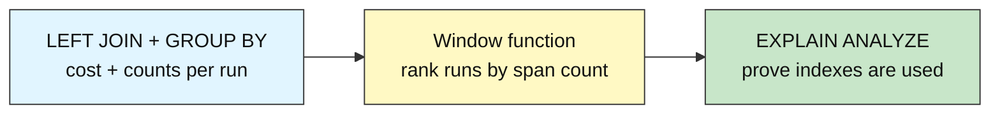

# Audit DB Intermediate: How to Join & Roll Up Across Tables

## Querying Across the Hierarchy with JOINs

**Difficulty: Intermediate | ~40 min | Requires Lab 2 (Modeling Runs, Spans, and Tool Calls) done in this Supabase project**

*Lab 3 of 8 in the Audit DB Labs module.*

Reconstructing a full trace across `run` -> `span` -> `tool_call` is exactly how you answer the harness's core debugging question -- "what did my agent actually do on this run?" -- so the JOINs in this lab are the foundation of an audit layer built for a real AI harness.

---

# Problem Statement / Use Case Overview

Lab 2 ended by walking the run → span → tool_call / guardrail_event hierarchy with one query per level — five separate round trips to reconstruct a single run. That pattern works, and it makes the parent → child relationship obvious, but it doesn't scale: every additional span costs two more queries, there's no way to ask "which run had the most tool calls?" without pulling all the data into Python first, and the cost of reconstructing a trace grows linearly with its depth.

This lab replaces the N+1 pattern with real SQL **JOINs** that reconstruct the same nested history in a single round trip, then layers on **aggregation** (`GROUP BY` to count spans and tool calls per run), **window functions** (`rank()` to order runs by span count), and **EXPLAIN ANALYZE** to show the indexes Lab 2 built actually being used. The same `support-agent` story continues: you insert a fresh run with the same shape (two spans, one tool call, two guardrail events), then query it four different ways to prove the schema works at read time, not just write time.

---

# Underlying Concepts

**Why N+1 breaks down.** Lab 2's Step 9 ran one query for spans, then two more per span (one for tool calls, one for guardrail events). For a run with *n* spans, that's 1 + 2*n* round trips. A real agent run can have dozens of spans — a retrieval step, a model call, a guardrail check, a notification, a retry — and each one doubles the database traffic. The database already knows how to match rows across tables; a **JOIN** lets it do that work internally instead of shipping partial results back to Python one level at a time.

**LEFT JOIN preserves spans with no children.** A `retrieve_orders` span might have tool calls but no guardrail events; a `generate_answer` span might have guardrail events but no tool calls. A regular `INNER JOIN` would silently drop spans that don't match both sides. A `LEFT JOIN` keeps every span and fills `NULL` for the missing children — the same `NULL` values you see in Step 4's output (`guardrail None: None -> None` for the retrieval span, `tool_call None: None -> None` for the answer span).



**GROUP BY collapses rows into summaries.** Once the JOIN returns every child row for a run, `GROUP BY r.run_id` collapses them into one summary line per run. `count(DISTINCT s.span_id)` counts spans without double-counting when a span appears in multiple joined rows (because it paired with both a tool call and a guardrail event).

**Window functions compute across rows without collapsing them.** `rank() OVER (ORDER BY spans DESC)` adds a ranking column to each row — unlike `GROUP BY`, the original rows are preserved. Tied values share the same rank, and `rank()` skips numbers after ties (three runs at rank 1, then rank 4, not rank 2).

**EXPLAIN ANALYZE makes the query planner visible.** It shows which indexes Postgres chose, how many rows each step produced, and how long each step actually took — not just the planner's estimate. Step 7 uses this to prove the three indexes from Lab 2 (`idx_span_run_id`, `idx_tool_call_span_id`, `idx_guardrail_event_span_id`) are actually used in the JOIN path.

---

# Input Data

| Item | Detail |
|------|--------|
| **Source** | Synthetic agent activity, written inline in the notebook — no files to download |
| **Prerequisite data** | Lab 1's `run` table + Lab 2's `span`, `tool_call`, `guardrail_event` tables with foreign keys and indexes |
| **Scenario** | One new `support-agent` run (same shape as Lab 2: 2 spans, 1 tool_call, 2 guardrail_events) plus all existing `support-agent` runs for aggregation |
| **Run row** | `agent_name`, `started_at`, `ended_at`, `status`, `total_cost` |
| **Span rows** | `run_id` (FK), `span_name`, `started_at`, `ended_at` |
| **Tool call rows** | `span_id` (FK), `tool_name`, `arguments`, `result`, `success` |
| **Guardrail event rows** | `span_id` (FK), `check_name`, `outcome` (`CHECK`-constrained), `reason` |
| **Size** | 1 new run + 2 spans + 1 tool_call + 2 guardrail_events per run-through, queried against all existing support-agent runs |

---

# Processing

### Part A — Reconstructing a Run with JOINs



The notebook first confirms Lab 2's four tables exist (same fail-fast pattern Lab 2 used for Lab 1's `run` table), then inserts a fresh run with the same two-span shape, and reconstructs it with a single `LEFT JOIN` that replaces Lab 2's five-query N+1 pattern.

### Part B — Aggregation, Ranking, and Performance



With the JOIN pattern working, the lab layers on `GROUP BY` to answer "what does the whole support-agent history look like?" (cost, span count, tool call count, guardrail event count per run), a window function to rank runs by complexity, and `EXPLAIN ANALYZE` to prove the indexes from Lab 2 are doing their job.

---

# Output

When you run the notebook top-to-bottom, every step prints real output from your own Supabase database. The run id and timestamps differ on every run-through (they're generated live); below is the output captured from an actual validation run so you know exactly what to expect.

**Step 1 — connection succeeds:**

```
PostgreSQL 17.6 on x86_64-pc-linux-gnu, compiled by gcc (GCC) 15.2.0, 64-bit
```

**Step 2 — prerequisite check:**

```
Lab 2 schema found: run, span, tool_call, guardrail_event.
```

**Step 3 — fresh run inserted:**

```
Run 39 inserted with 2 spans, 1 tool_call, 2 guardrail_events.
```

**Step 4 — N+1 vs JOIN comparison:**

```
Approach A (N+1): 5 round trips to the database
Approach B (JOIN):  1 round trip, 3 row(s) returned

Run 39 reconstructed via LEFT JOIN:
  span 11 - retrieve_orders | tool_call 7: query_orders_db -> 1284 rows returned | guardrail None: None -> None
  span 12 - generate_answer | tool_call None: None -> None | guardrail 10: pii_scan -> pass
  span 12 - generate_answer | tool_call None: None -> None | guardrail 11: prompt_injection_scan -> fail
```

**Step 5 — aggregation across all support-agent runs:**

```
Run ID | Agent          | Cost    | Spans | Tools | Guardrails
--------------------------------------------------------------
     8 | support-agent  | $0.0042 |     0 |     0 |          0
    37 | support-agent  | $0.0057 |     2 |     1 |          2
    38 | support-agent  | $0.0057 |     2 |     1 |          2
    39 | support-agent  | $0.0073 |     2 |     1 |          2
```

**Step 6 — window function ranking:**

```
Rank | Run ID | Agent          | Cost    | Spans
-------------------------------------------------------
  1   |     37 | support-agent  | $0.0057 |     2
  1   |     38 | support-agent  | $0.0057 |     2
  1   |     39 | support-agent  | $0.0073 |     2
  4   |      8 | support-agent  | $0.0042 |     0
```

**Step 7 — EXPLAIN ANALYZE showing index usage (abbreviated):**

```
Sort  (cost=33.14..33.16 rows=5 width=140) (actual time=0.050..0.052 rows=3 loops=1)
  ->  Nested Loop Left Join  (cost=1.59..33.09 rows=5 width=140) (actual time=0.039..0.045 rows=3 loops=1)
        ->  Nested Loop Left Join  (cost=1.44..19.82 rows=5 width=80) (actual time=0.031..0.035 rows=2 loops=1)
              ->  Nested Loop Left Join  (cost=1.29..6.56 rows=5 width=48) (actual time=0.021..0.023 rows=2 loops=1)
                    ->  Seq Scan on run r  (cost=0.00..1.01 rows=1 width=4) (actual time=0.012..0.013 rows=1 loops=1)
                    ->  Bitmap Heap Scan on span s  ... -> Bitmap Index Scan on idx_span_run_id
              ->  Index Scan using idx_tool_call_span_id on tool_call tc
        ->  Index Scan using idx_guardrail_event_span_id on guardrail_event ge
Planning Time: 0.302 ms
Execution Time: 0.098 ms
```

**Step 8 — recap:**

```
Run 39: JOIN queries + aggregation + window function - analysis complete.
```

> **Note:** this section shows actual output from a real execution against Supabase; your ids and timestamps will differ since every value is generated live.

---

# Tech Stack

| Component | Tool |
|-----------|------|
| **Database** | Supabase Postgres (free tier is sufficient; validated against PostgreSQL 17.6 in Lab 1) |
| **Python driver** | `psycopg2-binary==2.9.12` — connects Python to Postgres |
| **Credential loader** | `python-dotenv==1.2.3` — loads `DATABASE_URL` from the module-level `.env` |

> **Compute & cost:** Runs fine on any laptop CPU — the entire workload is a handful of small SQL statements. Supabase's free tier covers it; nothing in this lab calls a paid API.

> Credentials never appear in the notebook itself: they're read from `.env` at runtime (README Section 7), exactly as in Labs 1 and 2.

---

# Prerequisites

- **Lab 2 (Modeling Runs, Spans, and Tool Calls) completed in this same Supabase project** — this lab's Step 2 explicitly checks for Lab 2's `span`, `tool_call`, and `guardrail_event` tables (with their foreign keys and indexes) and fails fast with a clear message if they aren't there. This is a hard requirement, not a suggestion.
- **Comfort with Lab 2's schema** — foreign keys, `NOT NULL`, `CHECK` constraints, and the indexes on `span.run_id`, `tool_call.span_id`, and `guardrail_event.span_id`. This lab assumes those exist and focuses on the new material: reading data back through JOINs.
- **Supabase + `.env` setup completed** — the same one-time setup from Audit-DB-Labs README Section 7. If you haven't done it, do Lab 1 first; its Prerequisites walk through it in full.

---

# Environment / Dependencies Setup

| Package | Purpose |
|---------|---------|
| `python-dotenv` | Loads `.env` files so credentials stay out of the notebook |
| `psycopg2-binary` | The standard Python driver that connects Python to Postgres |

Install the two pinned packages (same versions the notebook's first cell installs, matching Labs 1 and 2 exactly so nothing drifts between labs):

```bash
pip install python-dotenv==1.2.3 psycopg2-binary==2.9.12
```

The notebook's first code cell repeats this exact line, so running it top-to-bottom leaves you correctly set up either way.

---

# Step-wise Development Instructions

Every step below matches one cell in `lab-querying-hierarchy-joins.ipynb`. Run them in order — later cells depend on earlier ones.

### Step 0 — Install dependencies

```python
!pip install python-dotenv==1.2.3 psycopg2-binary==2.9.12
```

One pinned line installs everything the lab needs, matching Section 9 exactly.

### Step 1 — Connect to Postgres

```python
import os
from pathlib import Path
from datetime import datetime, timezone

from dotenv import load_dotenv
import psycopg2

env_path = next((p / ".env" for p in [Path.cwd(), *Path.cwd().parents] if (p / ".env").exists()), None)
load_dotenv(env_path)
database_url = os.getenv("DATABASE_URL")
assert database_url, "DATABASE_URL not found - complete README Section 7 setup first."

connection = psycopg2.connect(database_url, connect_timeout=10)
cursor = connection.cursor()
cursor.execute("SELECT version();")
print(cursor.fetchone()[0])
```

Identical to Labs 1 and 2 — same upward `.env` search, same connection, same version-string proof.

### Step 2 — Confirm Lab 2's schema is already here

```python
cursor.execute("SELECT to_regclass('public.run')")
assert cursor.fetchone()[0] is not None, "run table missing - complete Lab 1 first."
for table in ["span", "tool_call", "guardrail_event"]:
    cursor.execute("SELECT to_regclass(%s)", (f"public.{table}",))
    assert cursor.fetchone()[0] is not None, f"{table} table missing - complete Lab 2 first."
print("Lab 2 schema found: run, span, tool_call, guardrail_event.")
```

`to_regclass` returns the table's identifier if it exists, or `NULL` if it doesn't — a clean existence check. This lab needs all four tables (including the indexes and foreign keys from Lab 2) to produce meaningful JOIN results.

### Step 3 — Insert a fresh run to query

```python
cursor.execute(
    "INSERT INTO run (agent_name, status) VALUES (%s, %s) RETURNING run_id",
    ("support-agent", "running"),
)
lab3_run_id = cursor.fetchone()[0]

cursor.execute(
    "INSERT INTO span (run_id, span_name) VALUES (%s, %s) RETURNING span_id",
    (lab3_run_id, "retrieve_orders"),
)
span1_id = cursor.fetchone()[0]
cursor.execute(
    "INSERT INTO tool_call (span_id, tool_name, arguments, result, success) VALUES (%s, %s, %s, %s, %s)",
    (span1_id, "query_orders_db",
     '{"table": "orders", "filter": "shipped_yesterday"}', "1284 rows returned", True),
)
cursor.execute("UPDATE span SET ended_at = now() WHERE span_id = %s", (span1_id,))

cursor.execute(
    "INSERT INTO span (run_id, span_name) VALUES (%s, %s) RETURNING span_id",
    (lab3_run_id, "generate_answer"),
)
span2_id = cursor.fetchone()[0]
cursor.execute(
    "INSERT INTO guardrail_event (span_id, check_name, outcome, reason) VALUES (%s, %s, %s, %s)",
    (span2_id, "pii_scan", "pass", "no personal data found"),
)
cursor.execute(
    "INSERT INTO guardrail_event (span_id, check_name, outcome, reason) VALUES (%s, %s, %s, %s)",
    (span2_id, "prompt_injection_scan", "fail", "instruction-override attempt detected"),
)
cursor.execute("UPDATE span SET ended_at = now() WHERE span_id = %s", (span2_id,))

cursor.execute(
    "UPDATE run SET ended_at = now(), status = 'completed', total_cost = %s WHERE run_id = %s",
    (0.0073, lab3_run_id),
)
connection.commit()
print(f"Run {lab3_run_id} inserted with 2 spans, 1 tool_call, 2 guardrail_events.")
```

Same data shape as Lab 2: one retrieval span with a tool call, one answer span with two guardrail events. We need fresh rows so the JOIN queries below have real data to operate on — the point of this lab is reading, not writing, so the inserts are boilerplate that gets the data into place.

### Step 4 — From five queries to one: the LEFT JOIN

```python
# Approach A: one query per level (the N+1 pattern Lab 2 used)
cursor.execute(
    "SELECT span_id, span_name FROM span WHERE run_id = %s ORDER BY started_at",
    (lab3_run_id,),
)
spans_a = cursor.fetchall()
count_a = 1
for span_id, span_name in spans_a:
    cursor.execute("SELECT count(*) FROM tool_call WHERE span_id = %s", (span_id,))
    count_a += 1
    cursor.execute("SELECT count(*) FROM guardrail_event WHERE span_id = %s", (span_id,))
    count_a += 1

# Approach B: one LEFT JOIN round trip
cursor.execute("""
    SELECT r.run_id, s.span_id, s.span_name,
           tc.tool_call_id, tc.tool_name, tc.result,
           ge.guardrail_event_id, ge.check_name, ge.outcome
    FROM run r
    LEFT JOIN span s ON s.run_id = r.run_id
    LEFT JOIN tool_call tc ON tc.span_id = s.span_id
    LEFT JOIN guardrail_event ge ON ge.span_id = s.span_id
    WHERE r.run_id = %s
    ORDER BY s.started_at, tc.tool_call_id, ge.guardrail_event_id
""", (lab3_run_id,))
rows_b = cursor.fetchall()

print(f"Approach A (N+1): {count_a} round trips to the database")
print(f"Approach B (JOIN):  1 round trip, {len(rows_b)} row(s) returned")
print()
print(f"Run {lab3_run_id} reconstructed via LEFT JOIN:")
for run_id, span_id, span_name, tc_id, tc_name, tc_result, ge_id, ge_name, ge_outcome in rows_b:
    print(f"  span {span_id} - {span_name} | tool_call {tc_id}: {tc_name} -> {tc_result} | guardrail {ge_id}: {ge_name} -> {ge_outcome}")
```

Approach A counts how many separate queries Lab 2's pattern required: 1 for spans + 2 per span (tool calls + guardrail events). Approach B collapses all of that into a single `LEFT JOIN` chain. The `LEFT JOIN` keyword (not just `JOIN`) is critical: it preserves every span even when one side has no children. The output shows `None` for the missing side — `retrieve_orders` has a tool call but no guardrail events, `generate_answer` has guardrail events but no tool call — instead of silently dropping those spans the way an `INNER JOIN` would.

### Step 5 — Aggregation: cost and counts per run

```python
cursor.execute("""
    SELECT r.run_id, r.agent_name, r.total_cost,
           count(DISTINCT s.span_id) AS spans,
           count(DISTINCT tc.tool_call_id) AS tool_calls,
           count(DISTINCT ge.guardrail_event_id) AS guardrail_events
    FROM run r
    LEFT JOIN span s ON s.run_id = r.run_id
    LEFT JOIN tool_call tc ON tc.span_id = s.span_id
    LEFT JOIN guardrail_event ge ON ge.span_id = s.span_id
    WHERE r.agent_name = 'support-agent' AND r.total_cost IS NOT NULL
    GROUP BY r.run_id, r.agent_name, r.total_cost
    ORDER BY r.run_id
""")
print("Run ID | Agent          | Cost    | Spans | Tools | Guardrails")
print("-" * 62)
for row in cursor.fetchall():
    print(f"{row[0]:>6} | {row[1]:<14} | ${row[2]:.4f} | {row[3]:>5} | {row[4]:>5} | {row[5]:>10}")
```

`GROUP BY r.run_id` collapses the joined rows into one summary line per run. `count(DISTINCT ...)` is necessary because the JOIN produces multiple rows per span (one for each paired child); without `DISTINCT`, a span with two guardrail events would be counted twice. `WHERE r.total_cost IS NOT NULL` excludes runs that haven't been closed yet — Lab 1's `run` row for Run 8 has no children because it was created before Lab 2 built the child tables, which is why its counts are all zero.

### Step 6 — Window functions: ranking runs

```python
cursor.execute("""
    SELECT run_id, agent_name, total_cost, spans,
           rank() OVER (ORDER BY spans DESC) AS span_rank
    FROM (
        SELECT r.run_id, r.agent_name, r.total_cost,
               count(DISTINCT s.span_id) AS spans
        FROM run r
        LEFT JOIN span s ON s.run_id = r.run_id
        WHERE r.agent_name = 'support-agent' AND r.total_cost IS NOT NULL
        GROUP BY r.run_id, r.agent_name, r.total_cost
    ) sub
    ORDER BY span_rank
""")
print("Rank | Run ID | Agent          | Cost    | Spans")
print("-" * 55)
for row in cursor.fetchall():
    print(f"  {row[4]:<3} | {row[0]:>6} | {row[1]:<14} | ${row[2]:.4f} | {row[3]:>5}")
```

A **window function** adds a computed column to each row without collapsing the rows the way `GROUP BY` does. `rank() OVER (ORDER BY spans DESC)` assigns rank 1 to the runs with the most spans; when multiple runs tie (all three at 2 spans), they share rank 1, and the next rank jumps to 4 — that's how `rank()` works with ties (it skips numbers). The inner subquery reuses the same `GROUP BY` pattern from Step 5; the window function wraps it.

### Step 7 — EXPLAIN ANALYZE: seeing the indexes at work

```python
cursor.execute("""
    EXPLAIN ANALYZE
    SELECT r.run_id, s.span_name, tc.tool_name, ge.check_name, ge.outcome
    FROM run r
    LEFT JOIN span s ON s.run_id = r.run_id
    LEFT JOIN tool_call tc ON tc.span_id = s.span_id
    LEFT JOIN guardrail_event ge ON ge.span_id = s.span_id
    WHERE r.run_id = %s
    ORDER BY s.started_at
""", (lab3_run_id,))
for row in cursor.fetchall():
    print(row[0])
```

`EXPLAIN ANALYZE` runs the query and shows both the planner's estimate (`cost=...`) and the actual execution stats (`actual time=...`). Look for three things: (1) `Bitmap Index Scan on idx_span_run_id` — Postgres uses Lab 2's index on `span.run_id` to jump straight to our two spans. (2) `Index Scan using idx_tool_call_span_id` and `idx_guardrail_event_span_id` — the child-table indexes do the same for each span's children. (3) `Execution Time: 0.098 ms` — under a tenth of a millisecond, confirming the indexes are doing their job. Without them, the planner would fall back to sequential scans on every table.

### Step 8 — Recap

```python
cursor.close()
connection.close()
print(f"Run {lab3_run_id}: JOIN queries + aggregation + window function - analysis complete.")
```

Closing the connection is the same good hygiene as Labs 1 and 2. The recap names what changed: the same nested history Lab 2 reconstructed with five separate queries now comes back in one JOIN, and the same data is immediately available for aggregation, ranking, and performance analysis without pulling everything into Python first.

---

# Optional Exercise

Insert a **second fresh run** under the same `support-agent` with a **third span** named `send_notification` (containing 2 tool_calls and 1 guardrail_event with `outcome='warn'`), close it, then modify Step 4's LEFT JOIN query to reconstruct **both** new runs in a single query (replace the `WHERE r.run_id = %s` filter with `WHERE r.agent_name = 'support-agent' AND r.run_id >= %s`). Verify that both runs appear with all their spans and children correctly nested underneath the right span. Then modify Step 5's aggregation to confirm the new run's counts appear in the summary table.

---

# What We Learnt

- **N+1 queries don't scale** — Lab 2's one-query-per-level pattern works for one run, but every additional span adds two more round trips; JOINs collapse the entire hierarchy into one trip (Problem Statement, Step 4).
- **LEFT JOIN preserves spans with no children** — `retrieve_orders` has tool calls but no guardrail events, and `generate_answer` has guardrail events but no tool calls; `LEFT JOIN` keeps both spans with `NULL` on the missing side, while `INNER JOIN` would silently drop them (Underlying Concepts; Step 4 output).
- **GROUP BY + count(DISTINCT ...) answers cross-run questions** — "how many tool calls did each support-agent run make?" is impossible to answer per-span; `GROUP BY r.run_id` collapses the joined rows into one summary line per run, and `DISTINCT` avoids double-counting when a span appears in multiple joined rows (Step 5).
- **Window functions rank without collapsing** — `rank() OVER (ORDER BY ...)` adds a computed column to each row while preserving the original rows; `GROUP BY` would destroy the per-run detail (Step 6).
- **EXPLAIN ANALYZE proves indexes are used** — the `Bitmap Index Scan` on `idx_span_run_id` and `Index Scan` on the two child-table indexes in Step 7's plan confirm Lab 2's indexing decisions are paying off at query time, not just at theory time (Underlying Concepts; Step 7).
- **The schema designed in Lab 2 is validated by reading** — foreign keys, indexes, and constraints only matter if the queries that use them actually work; this lab proves the schema's read path, not just its write path (Prerequisites; all steps).
