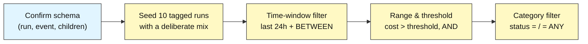
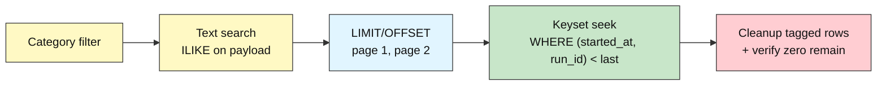

# Audit DB Intermediate: How to Slice an Unbounded Log

## Filtering, Search, and Pagination

**Difficulty: Intermediate | ~40 min | Requires Lab 3 (Querying Across the Hierarchy with JOINs) done in this Supabase project**

*Lab 4 of 8 in the Audit DB Labs module.*

---

# Problem Statement / Use Case Overview

Labs 1-3 proved you can write events, model them into a run → span → tool_call / guardrail_event hierarchy, and read them back with JOINs and aggregation. But every query so far returned the *whole* log. A real audit log grows without bound — thousands of runs, millions of events — and you almost never want all of it. You want a **slice**: only the runs that failed, only the last 24 hours, only the calls that cost more than a threshold, only the payloads that mention a suspicious string, and then only the first page of results, not the entire table.

This lab turns an unbounded log into a readable answer. It adds **filters** (time windows, ranges, categories), **text search** (finding a needle in a payload), and **pagination** (walking a result set one page at a time). None of these alter the schema — this lab is purely about `WHERE` and `LIMIT` clauses over the tables Labs 1 and 2 built. It deliberately uses nothing from Lab 7: no triggers, no roles, no hash chains. Those protect the log's *integrity*; this lab is about *reading* it efficiently.

---

# Underlying Concepts

**Filtering is selecting a subset of rows.** A `WHERE` clause keeps only the rows whose values satisfy the predicate. Filters come in three flavors this lab covers: **time** (`started_at >= now() - interval '24 hours'`, or a bounded `BETWEEN`), **range** (`total_cost > %s`), and **category** (`status = %s`, or a set via `status = ANY(%s)`). They compose with `AND` — "expensive **and** errored" is two predicates narrowing the same set.

**Time is the axis every audit log grows along.** Because events are appended over time, "recent" is the single most common question. A one-sided window (`>= now() - interval`) asks "since when?"; a bounded window (`BETWEEN`) asks "between what two moments?". `now()` is the database's clock, so windows are naturally relative to when the query runs.

**Parameters keep untrusted data as data, never as code.** Every varying value is passed as a `%s` parameter. This is the security heart of the module: interpolating a value into a SQL string invites injection, and an audit log stores exactly the kind of untrusted data an attacker would exploit. Parameterized queries make the value a placeholder the driver binds safely.

**Text search is a different problem from numeric filtering.** `ILIKE '%needle%'` finds a substring, case-insensitively, anywhere in a text column. It is simple and exact, but the leading `%` defeats indexes, so it scans. Postgres **full-text search** (`to_tsvector` / `to_tsquery`) tokenizes text, understands language, and *can* be indexed — the scalable choice for large logs. Trade-off: `ILIKE` is trivial to write; full-text is faster at scale but needs setup.

**Pagination is how you serve a large result set in chunks.** `LIMIT %s OFFSET %s` skips *N* rows and returns the next page — simple, but it degrades as the offset grows and it drifts if rows are inserted mid-paging. **Keyset (seek)** pagination carries the last row's sort key (`WHERE (started_at, run_id) < (%s, %s)`) and asks "what comes after this place?" — stable against inserts and usable with an index.

```mermaid
flowchart LR
    SUB["WHERE started_at >= now() - interval '24 hours'"] --> RNG["AND total_cost > 0.02"]
    RNG --> CAT["AND status = ANY(array)"]
    CAT --> TXT["AND payload ILIKE '%needle%'"]
    TXT --> PAG["ORDER BY ... LIMIT 3 (page)"]
    PAG --> KEY["Keyset: WHERE (started_at, run_id) < last"]
    style SUB fill:#e1f5ff,stroke:#333333,color:#111111
    style RNG fill:#e1f5ff,stroke:#333333,color:#111111
    style CAT fill:#e1f5ff,stroke:#333333,color:#111111
    style TXT fill:#e1f5ff,stroke:#333333,color:#111111
    style PAG fill:#fff9c4,stroke:#333333,color:#111111
    style KEY fill:#c8e6c9,stroke:#333333,color:#111111
```



---

# Input Data

| Item | Detail |
|------|--------|
| **Source** | Synthetic agent activity, written inline in the notebook — no files to download |
| **Prerequisite data** | Lab 1's `run` and `event` tables + Lab 2's `span`, `tool_call`, `guardrail_event` tables with foreign keys and indexes |
| **Scenario** | A seeded testing corpus: 10 tagged runs with a deliberate mix of `status`, `total_cost`, and `started_at`, plus 4 tagged `event` rows |
| **Run row** | `agent_name` (holds the cleanup tag), `status`, `total_cost`, `started_at`, `ended_at` |
| **Event rows** | `run_id` (FK-ish), `event_type`, `payload` (the text column searched) |
| **Seed spread** | `status` success/error/timeout; `total_cost` from ~$0.001 to ~$0.45; `started_at` from 30 minutes ago to 6 days ago; one payload contains the marker `refund_query` |
| **Cleanup tag** | `agent_name` prefixed `pytest-lab4-<hex>-<i>` so teardown can delete exactly this run's rows |
| **Size** | 10 runs + 4 events per run-through, all removed again during cleanup |

---

# Processing

### Part A — Slicing the Log



The notebook confirms the schema, seeds a varied corpus, then runs the three filter families (time, range, category) over it, each time proving the count matches what the seed implies.

### Part B — Search and Pagination



With filters proven, the lab searches payloads for a marker word, pages through the results with `LIMIT/OFFSET`, and demonstrates keyset pagination as the scalable fix — including the `(started_at, run_id)` tiebreaker that keeps the order deterministic.

---

# Output

When you run the notebook top-to-bottom, every step prints real output from your own Supabase database. The run ids and timestamps differ on every run-through (they're generated live); below is the output captured from an actual validation run so you know exactly what to expect. A `pytest-lab4-<hex>-<i>` agent name and page-2 keyset follow-on are shown with a placeholder tag because the hex changes per run.

**Step 1 — connection succeeds:**

```
PostgreSQL 17.6 on x86_64-pc-linux-gnu, compiled by gcc (GCC) 15.2.0, 64-bit
```

**Step 2 — prerequisite check:**

```
Schema found: run, event, span, tool_call, guardrail_event.
```

**Step 3 — seed:**

```
Seeded 10 tagged runs under marker pytest-lab4-<hex>-* (run ids 332..341).
```

**Step 4 — time-window filtering:**

```
Runs started in the last 24 hours: 6
Runs started between 3h and 1h ago (BETWEEN window): 2
```

**Step 5 — range & threshold filtering:**

```
Runs costing more than $0.02: 4
...and also marked error: 1
```

**Step 6 — category filtering:**

```
Runs with status = 'success': 5
Runs with status IN (error, timeout) via = ANY(array): 5
```

**Step 7 — text search:**

```
Events whose payload contains 'refund_query' (ILIKE):
  event 141 [tool_call]: tool=refund_query status=pending customer_id=9912
Events containing 'nonexistent_word': 0
```

**Step 8 — pagination:**

```
Page 1 (LIMIT 3 OFFSET 0):     prominent start times
  run 334 | pytest-lab4-<hex>-2 | success
  run 341 | pytest-lab4-<hex>-9 | error
  run 333 | pytest-lab4-<hex>-1 | error
Page 2 (LIMIT 3 OFFSET 3):
  run 332 | pytest-lab4-<hex>-0 | success
  run 337 | pytest-lab4-<hex>-5 | error
  run 339 | pytest-lab4-<hex>-7 | timeout
Keyset page 2 (seek from run 333):
  run 332 | pytest-lab4-<hex>-0 | success
  run 337 | pytest-lab4-<hex>-5 | error
  run 339 | pytest-lab4-<hex>-7 | timeout
```

Note how page 1 holds the most recently started runs (the `30 minutes` and recent-hour seeds) and page 2 continues from there — the keyset page 2 rows are identical to the OFFSET page 2 rows, which is the point: on a stable dataset the two strategies agree, and keyset stays correct when the dataset isn't stable.

**Step 9 — cleanup and recap:**

```
Cleanup done - 0 tagged runs, 0 tagged events left behind.
Lab 4 complete: time filters, ranges, categories, text search, and pagination.
```

> **Note:** this section shows actual output from a real execution against Supabase; your ids, tags, and window counts will differ since every value is generated live from the current table contents.

---

# Tech Stack

| Component | Tool |
|-----------|------|
| **Database** | Supabase Postgres (free tier is sufficient; validated against PostgreSQL 17.6 in Lab 1) |
| **Python driver** | `psycopg2-binary==2.9.12` — connects Python to Postgres, with `%s` parameter binding |
| **Credential loader** | `python-dotenv==1.2.3` — loads `DATABASE_URL` from the module-level `.env` |
| **Tag source** | Python `secrets.token_hex(4)` — generates the unique cleanup tag for each run-through |

> **Compute & cost:** Runs fine on any laptop CPU — the entire workload is a handful of small SQL statements. Supabase's free tier covers it; nothing in this lab calls a paid API.

> Credentials never appear in the notebook itself: they're read from `.env` at runtime (README Section 7), exactly as in Labs 1-3.

---

# Prerequisites

- **Lab 3 (Querying Across the Hierarchy with JOINs) completed in this same Supabase project** — this lab's Step 2 explicitly checks for the `run`, `event`, `span`, `tool_call`, and `guardrail_event` tables and fails fast with a clear message if any is missing. The Lab 2 `event` table is the source of the text-search payloads; the JOIN to `run` scopes the search. This is a hard requirement.
- **Comfort with Lab 2's schema** — `run` and `event` from Lab 1, plus the child tables and foreign keys from Lab 2. This lab adds no schema; it only queries what already exists.
- **Supabase + `.env` setup completed** — the same one-time setup from Audit-DB-Labs README Section 7. If you haven't done it, do Lab 1 first; its Prerequisites walk through it in full.

---

# Environment / Dependencies Setup

| Package | Purpose |
|---------|---------|
| `python-dotenv` | Loads `.env` files so credentials stay out of the notebook |
| `psycopg2-binary` | The standard Python driver that connects Python to Postgres |

Install the two pinned packages (same versions the notebook's first cell installs, matching Labs 1-3 exactly so nothing drifts between labs):

```bash
pip install python-dotenv==1.2.3 psycopg2-binary==2.9.12
```

No additional packages are needed: filtering, search, and pagination are all SQL, executed through the same `psycopg2` cursor Labs 1-3 already used.

---

# Step-wise Development Instructions

Every step below matches one cell in `lab-filtering-search-pagination.ipynb`. Run them in order — later cells depend on earlier ones.

### Step 0 — Install dependencies

```python
!pip install python-dotenv==1.2.3 psycopg2-binary==2.9.12
```

One pinned line installs everything the lab needs, matching Section 9 exactly.

### Step 1 — Connect to Postgres

```python
import os
from pathlib import Path
from datetime import datetime, timezone

from dotenv import load_dotenv
import psycopg2

env_path = next((p / ".env" for p in [Path.cwd(), *Path.cwd().parents] if (p / ".env").exists()), None)
load_dotenv(env_path)
database_url = os.getenv("DATABASE_URL")
assert database_url, "DATABASE_URL not found - complete README Section 7 setup first."

connection = psycopg2.connect(database_url, connect_timeout=10)
cursor = connection.cursor()
cursor.execute("SELECT version();")
print(cursor.fetchone()[0])
```

Identical to Labs 1-3 — same upward `.env` search, same connection, same version-string proof.

### Step 2 — Confirm the schema is already here

```python
# Fail-fast: confirm all prerequisite tables exist (run + event from Lab 1, the Lab 2 children)
cursor.execute("SELECT to_regclass('public.run')")
assert cursor.fetchone()[0] is not None, "run table missing - complete Lab 1 first."
cursor.execute("SELECT to_regclass('public.event')")
assert cursor.fetchone()[0] is not None, "event table missing - complete Lab 1 first."
for table in ["span", "tool_call", "guardrail_event"]:
    cursor.execute("SELECT to_regclass(%s)", (f"public.{table}",))
    assert cursor.fetchone()[0] is not None, f"{table} table missing - complete Lab 2 first."
print("Schema found: run, event, span, tool_call, guardrail_event.")
```

`to_regclass` returns the table's identifier if it exists, or `NULL` if it doesn't. This lab filters `run` and searches `event`, so both from Lab 1 must be present, as must Lab 2's children (the JOIN to `run` that scopes the search).

### Step 3 — Seed a realistic spread of runs to filter

```python
import secrets

# One tag for this whole run-through, so cleanup can find exactly these rows.
lab4_tag = secrets.token_hex(4)

# (agent_name, status, total_cost, started_a_go) -- a MIX so filtering has something to bite on.
# started_a_go is a PostgreSQL interval string relative to now(): hours = recent, days = old.
seed_runs = [
    ("support-bot",   "success", 0.0210, "2 hours"),
    ("support-bot",   "error",   0.0045, "1 hour"),
    ("billing-agent", "success", 0.0900, "30 minutes"),
    ("billing-agent", "timeout", 0.0120, "3 days"),
    ("support-bot",   "success", 0.0031, "5 days"),
    ("copilot",       "error",   0.1100, "4 hours"),
    ("copilot",       "success", 0.0077, "6 days"),
    ("support-bot",   "timeout", 0.0012, "12 hours"),
    ("billing-agent", "success", 0.4500, "2 days"),
    ("copilot",       "error",   0.0088, "45 minutes"),
]

inserted_run_ids = []
for i, (agent, status, cost, ago) in enumerate(seed_runs):
    marker = f"{lab4_tag}-{i}"
    cursor.execute(
        "INSERT INTO run (agent_name, status, total_cost, started_at, ended_at) "
        "VALUES (%s, %s, %s, now() - interval %s, now()) RETURNING run_id",
        (f"pytest-lab4-{marker}", status, cost, ago),
    )
    inserted_run_ids.append(cursor.fetchone()[0])

# Seed a few events too, so text search has payloads to look through.
event_payloads = [
    "tool=query_orders status=ok",
    "tool=refund_query status=pending customer_id=9912",
    "tool=query_orders status=err",
    "tool=update_ticket status=ok",
]
for i, run_id in enumerate(inserted_run_ids[:4]):
    cursor.execute(
        "INSERT INTO event (run_id, event_type, payload) VALUES (%s, %s, %s)",
        (run_id, "tool_call", event_payloads[i]),
    )

connection.commit()
print(f"Seeded {len(inserted_run_ids)} tagged runs under marker pytest-lab4-{lab4_tag}-* "
      f"(run ids {inserted_run_ids[0]}..{inserted_run_ids[-1]}).")
```

The corpus is deliberately varied so every filter has something to exclude. Each run gets a unique `pytest-lab4-<hex>-<i>` tag in `agent_name`, which is what makes the lab re-runnable: the same tag later lets cleanup delete exactly these rows and nothing else. The `now() - interval %s` trick sets `started_at` relative to the database clock, so "recent" and "old" are computed at insert time, live.

### Step 4 — Time-window filtering: the last 24 hours

```python
# Recent-only: started in the last 24 hours.
cursor.execute(
    """SELECT count(*) FROM run
       WHERE agent_name LIKE %s
         AND started_at >= now() - interval '24 hours'""",
    (f"pytest-lab4-{lab4_tag}-%",),
)
recent_24h = cursor.fetchone()[0]

# A bounded window (a specific start and end) with BETWEEN.
cursor.execute(
    """SELECT count(*) FROM run
       WHERE agent_name LIKE %s
         AND started_at BETWEEN now() - interval '3 hours' AND now() - interval '1 hour'""",
    (f"pytest-lab4-{lab4_tag}-%",),
)
mid_window = cursor.fetchone()[0]

print(f"Runs started in the last 24 hours: {recent_24h}")
print(f"Runs started between 3h and 1h ago (BETWEEN window): {mid_window}")
```

`now() - interval '24 hours'` is computed inside the query so the database clock defines "recent". `BETWEEN` bounds a window between two moments. The `agent_name LIKE %s` scopes the count to this lab's tagged rows so the numbers reflect just this seed. At scale, `started_at` should be indexed, or every time window becomes a full scan.

### Step 5 — Range & threshold filtering: cost and combining

```python
# Threshold: only runs that cost more than $0.02.
expensive_threshold = 0.02
cursor.execute(
    """SELECT count(*) FROM run
       WHERE agent_name LIKE %s AND total_cost > %s""",
    (f"pytest-lab4-{lab4_tag}-%", expensive_threshold),
)
expensive = cursor.fetchone()[0]

# Combine predicates with AND: expensive AND errored.
cursor.execute(
    """SELECT count(*) FROM run
       WHERE agent_name LIKE %s AND total_cost > %s AND status = %s""",
    (f"pytest-lab4-{lab4_tag}-%", expensive_threshold, "error"),
)
expensive_errored = cursor.fetchone()[0]

print(f"Runs costing more than ${expensive_threshold}: {expensive}")
print(f"...and also marked error: {expensive_errored}")
```

`total_cost > %s` is a range filter — anything you can order, you can threshold. The threshold value travels through a `%s` parameter, never into the SQL string. `AND` composes predicates: expensive *and* errored is the shape of a real alert, and it's exactly the kind of composite condition Lab 6 builds on.

### Step 6 — Category filtering: one status or a set

```python
# Exactly one category value.
cursor.execute(
    """SELECT count(*) FROM run
       WHERE agent_name LIKE %s AND status = %s""",
    (f"pytest-lab4-{lab4_tag}-%", "success"),
)
success_count = cursor.fetchone()[0]

# A set of categories: = ANY(array).
want_statuses = ["error", "timeout"]
cursor.execute(
    """SELECT count(*) FROM run
       WHERE agent_name LIKE %s AND status = ANY(%s)""",
    (f"pytest-lab4-{lab4_tag}-%", want_statuses),
)
any_count = cursor.fetchone()[0]

print(f"Runs with status = 'success': {success_count}")
print(f"Runs with status IN (error, timeout) via = ANY(array): {any_count}")
```

`status = %s` matches one discrete value. `status = ANY(%s)` matches a whole list by taking a single array parameter — the idiomatic "in this set" form in Postgres. It keeps exactly one placeholder, so you never have to generate `IN (%s, %s, %s, ...)` from a variable-length Python list.

### Step 7 — Text search in payloads: ILIKE vs full-text

```python
# Find events whose payload mentions a marker word anywhere (case-insensitive substring).
needle = "refund_query"
cursor.execute(
    """SELECT e.event_id, e.event_type, e.payload
       FROM event e
       JOIN run r ON r.run_id = e.run_id
       WHERE r.agent_name LIKE %s AND e.payload ILIKE %s
       ORDER BY e.event_id""",
    (f"pytest-lab4-{lab4_tag}-%", f"%{needle}%"),
)
ilike_hits = cursor.fetchall()

# The scalable alternative is Postgres full-text search (to_tsvector / to_tsquery);
# it needs an index to be fast at scale, but the corpus here is tiny.

# Show that a different marker word finds nothing (proves the filter actually filters).
cursor.execute(
    """SELECT count(*) FROM event e
       JOIN run r ON r.run_id = e.run_id
       WHERE r.agent_name LIKE %s AND e.payload ILIKE %s""",
    (f"pytest-lab4-{lab4_tag}-%", "%nonexistent_word%"),
)
none_hits = cursor.fetchone()[0]

print(f"Events whose payload contains '{needle}' (ILIKE):")
for event_id, event_type, payload in ilike_hits:
    print(f"  event {event_id} [{event_type}]: {payload}")
print(f"Events containing 'nonexistent_word': {none_hits}")
```

`ILIKE '%needle%'` is a case-insensitive substring search — useful, but the leading `%` makes it non-indexable, so big tables scan. Full-text search (`to_tsvector` / `to_tsquery`) is the scalable, language-aware alternative. The second query proves the filter really filters: a marker word that doesn't exist returns zero rows. The `JOIN run` exists purely to scope the search to this lab's tagged runs.

### Step 8 — Pagination: OFFSET vs keyset

```python
PAGE_SIZE = 3

# Page 1 via OFFSET (skip 0). We include started_at so it can double as the keyset key.
cursor.execute(
    """SELECT run_id, agent_name, status, started_at FROM run
       WHERE agent_name LIKE %s
       ORDER BY started_at DESC, run_id DESC
       LIMIT %s OFFSET %s""",
    (f"pytest-lab4-{lab4_tag}-%", PAGE_SIZE, 0),
)
page1 = cursor.fetchall()

cursor.execute(
    """SELECT run_id, agent_name, status, started_at FROM run
       WHERE agent_name LIKE %s
       ORDER BY started_at DESC, run_id DESC
       LIMIT %s OFFSET %s""",
    (f"pytest-lab4-{lab4_tag}-%", PAGE_SIZE, PAGE_SIZE),
)
page2 = cursor.fetchall()

# Keyset (seek) pagination: carry the last row's sort key instead of skipping.
last = page1[-1]
cursor.execute(
    """SELECT run_id, agent_name, status, started_at FROM run
       WHERE agent_name LIKE %s
         AND (started_at, run_id) < (%s, %s)
       ORDER BY started_at DESC, run_id DESC
       LIMIT %s""",
    (f"pytest-lab4-{lab4_tag}-%", last[3], last[0], PAGE_SIZE),
)
keyset_page2 = cursor.fetchall()

print(f"Page 1 (LIMIT {PAGE_SIZE} OFFSET 0):")
for run_id, agent, status, _started in page1:
    print(f"  run {run_id} | {agent} | {status}")
print(f"Page 2 (LIMIT {PAGE_SIZE} OFFSET {PAGE_SIZE}):")
for run_id, agent, status, _started in page2:
    print(f"  run {run_id} | {agent} | {status}")
print(f"Keyset page 2 (seek from run {last[0]}):")
for run_id, agent, status, _started in keyset_page2:
    print(f"  run {run_id} | {agent} | {status}")
```

OFFSET skips and re-scans; keyset seeks by the last row's location. The composite `(started_at, run_id)` key breaks ties when two runs share the exact same `started_at`, keeping the order fully deterministic. Because the "next page" is expressed as a position rather than a count, keyset stays fast and stable even as the log changes between requests — the difference between a paging query that degrades and one that holds steady.

### Step 9 — Cleanup and recap

```python
# Delete only this lab's tagged rows - events first (they reference runs), then the runs.
cursor.execute(
    "DELETE FROM event WHERE run_id IN (SELECT run_id FROM run WHERE agent_name LIKE %s)",
    (f"pytest-lab4-{lab4_tag}-%",),
)
cursor.execute("DELETE FROM run WHERE agent_name LIKE %s", (f"pytest-lab4-{lab4_tag}-%",))
connection.commit()

# Verify cleanup left nothing behind.
cursor.execute("SELECT count(*) FROM run WHERE agent_name LIKE %s", (f"pytest-lab4-{lab4_tag}-%",))
remaining_runs = cursor.fetchone()[0]
cursor.execute(
    "SELECT count(*) FROM event WHERE run_id IN (SELECT run_id FROM run WHERE agent_name LIKE %s)",
    (f"pytest-lab4-{lab4_tag}-%",),
)
remaining_events = cursor.fetchone()[0]

cursor.close()
connection.close()

print(f"Cleanup done - {remaining_runs} tagged runs, {remaining_events} tagged events left behind.")
print("Lab 4 complete: time filters, ranges, categories, text search, and pagination.")
```

Cleanup happens before closing and verifies itself: it deletes events first (they reference runs, so they must go first), then the runs, and finally counts how many tagged rows remain — zero. That self-verifying teardown is what makes the lab safe to re-run end to end.

---

# Optional Exercise

Extend the pagination step to implement **page 3 of both strategies after inserting a new run mid-stream**:

1. Run Step 3's seed, then Step 8 once, capturing the first two pages of each strategy.
2. Now insert a *new* tagged run (reuse the same `lab4_tag` and any status) whose `started_at` lands **between** the first and second pages in the `ORDER BY started_at DESC, run_id DESC` sort — e.g. `now() - interval '5 hours'`.
3. Run the OFFSET `LIMIT 3 OFFSET 6` query and the keyset query (carried forward from the last row of page 2) and compare.
4. Notice how the OFFSET page drifts: the new row has shifted every subsequent page by one, so page 3 now re-shows a row you already saw, or skips one. The keyset query, keyed to a position on the stream, returns the correct next rows regardless of the insert.

Then, add a `where started_at >= now() - interval '24 hours'` filter to the keyset query and confirm it still returns the right windowed, seeked page — demonstrating that keyset and filters compose cleanly.

---

# What We Learnt

- **An unbounded log becomes readable only when you can slice it** — time, range, and category filters turn "everything" into "the answer"; without them a growing log is unanswerable (Problem Statement; Steps 4-6).
- **Time windows are the most common audit filter** — one-sided (`>= now() - interval`) and bounded (`BETWEEN`) capture "since when" and "between what"; both are computed from the database clock, and both reward an index on `started_at` at scale (Step 4).
- **Every varying value goes through a `%s` parameter** — parameters keep untrusted data as data, not as injected SQL, and they also make `status = ANY(%s)` cleanly express a whole set with one placeholder (Underlying Concepts; Steps 5-6).
- **Substring search and full-text search serve different scales** — `ILIKE '%needle%'` is simple and exact but non-indexable; `to_tsvector`/`to_tsquery` is the scalable, language-aware choice for a large log (Step 7).
- **OFFSET pagination drifts; keyset pagination holds steady** — `LIMIT/OFFSET` re-scans and shifts under inserts, while `WHERE (started_at, run_id) < (%s, %s)` seeks by position, stays index-friendly, and breaks ties (Step 8).
- **Filters, search, and pagination compose** — a windowed, searched, seeked page is built from the same `WHERE`/`JOIN`/`LIMIT` vocabulary, so a production audit UI is just these three ideas wired together (all steps).
- **A re-runnable lab is one with a tag and a self-verifying teardown** — the cleanup deletes child rows before parents and counts its own residue, proving the run left nothing behind (Step 9).
