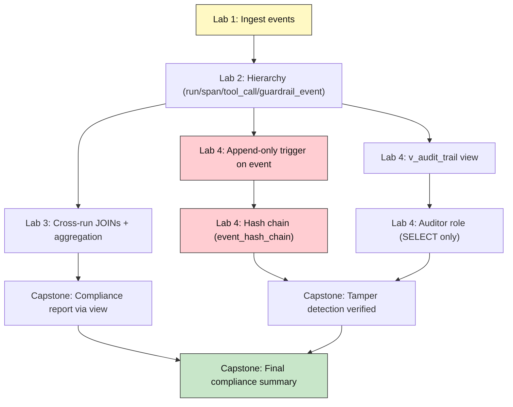
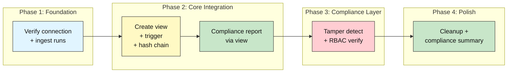
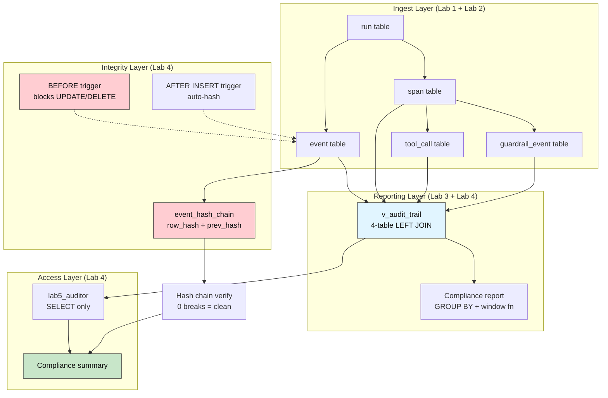

# Audit DB Capstone: Agent Audit and Compliance Platform

## Capstone Project -- Integrating Event Logging, Hierarchy, Reporting, and Tamper Detection

**Difficulty: Capstone (Advanced) | ~60 min per week for 2 weeks | Requires Labs 1-4 completed in this Supabase project**

*Lab 5 of 5 in the Audit DB Labs module.*

---

# Problem Statement / Use Case Overview

An organization running multiple AI agents needs a **compliance platform** that answers one question: *"Can we prove, to an auditor, that every agent action was logged, that the log hasn't been altered, and that only authorized people can read it?"*

Labs 1-4 each solve one piece:

| Lab | What it proved |
|-----|---------------|
| **Lab 1** | Every agent action can be ingested as an append-only event |
| **Lab 2** | Events, spans, tool calls, and guardrail checks form a queryable hierarchy |
| **Lab 3** | Cross-run JOIN queries and window functions produce compliance reports |
| **Lab 4** | Hash chains detect tampering; RBAC gives auditors read-only access |

But each piece is incomplete alone. A hierarchy with no reporting is unqueried data sitting in tables. Reporting on a mutable log is worthless -- an attacker could ALTER the rows before the report runs. A tamper-evident log without an auditor role means anyone with database access can read everything, including sensitive payloads.

This capstone combines all four into one **Agent Audit & Compliance Platform**. Your implementation will ingest agent runs with full hierarchy, produce cross-run compliance reports, guarantee the log is tamper-evident via hash chains, and restrict auditor access to a read-only view. When complete, the notebook walks through every layer and produces a final compliance summary that a real auditor could review.

---

# Underlying Concepts

This lab doesn't re-teach Labs 1-4's individual concepts -- those already exist. Instead, it explains how they **compose**.

**The hash chain must sit on top of the exact same hierarchy.** Lab 4's `event_hash_chain` table references `event(event_id)` directly. The hash chain doesn't protect a separate "audit log" table -- it protects the `event` rows that are part of the run -> span -> event hierarchy from Lab 2. This means tampering with any event in the hierarchy is detectable, because the chain links every event to its predecessor. If the chain sat on a separate table, an attacker could modify the hierarchy tables without breaking the chain.

**Reporting queries must run through the auditor-facing view.** Lab 3's cross-run queries join `run`, `span`, `tool_call`, and `guardrail_event` directly. In the capstone, those same queries should run against `v_audit_trail` -- the view Lab 4 created. This matters because the auditor role only has `SELECT` on the view, not on the base tables. If the compliance report queried base tables directly, the RBAC layer would be bypassed.

**The append-only trigger protects the foundation, not the report.** The `BEFORE UPDATE/DELETE` trigger on `event` fires before any modification reaches the table. The hash chain then detects if someone bypasses the trigger by dropping it. These are complementary layers: the trigger prevents casual modification; the hash chain catches privileged bypass. Neither alone is sufficient.



**Cleanup must respect the full dependency graph.** Your implementation creates triggers, views, hash chain tables, and a Postgres role. Teardown must drop child objects first (triggers before functions, views before roles, hash chain table before event rows), using SAVEPOINT-guarded drops so one failure doesn't roll back earlier successes.

---

# Project Structure

The graded artifact for this lab is your notebook (`lab-capstone-project.ipynb`) plus whatever supporting files you create. If you're extending this into a fuller project, here's a suggested directory layout you may adapt:

```
agent-audit-platform/
├── docs/
│   ├── architecture.md          # System design notes
│   └── compliance-checklist.md  # Appendix A as a standalone doc
├── src/
│   ├── ingest.py                # Event ingestion logic
│   ├── reporting.py             # Cross-run compliance queries
│   ├── integrity.py             # Hash chain build + verify
│   └── rbac.py                  # Role management
├── tests/
│   ├── test_ingest.py
│   ├── test_reporting.py
│   ├── test_integrity.py
│   └── test_rbac.py
├── submission/
│   └── PROJECT_SUMMARY.md       # Submission deliverable
├── lab-capstone-project.ipynb   # <-- your notebook (the main graded artifact)
└── lab-capstone-project-assignment.md
```

**This is a suggestion, not a requirement.** You may put everything in the notebook, or split it across modules -- the grading rubric evaluates what the notebook produces, not how you organize your source tree.

---

# Input Data

Your implementation should generate **synthetic, deterministic** data across the existing Lab 2 hierarchy. A good starting point:

| Run | Agent | Spans | Tool Calls | Guardrails | Events | Status |
|-----|-------|-------|------------|------------|--------|--------|
| 1 | support-agent | 2 | 1 | 2 | 3 | completed |
| 2 | support-agent | 2 | 1 | 2 | 3 | completed |
| 3 | fraud-detector | 1 | 1 | 1 | 2 | completed |

This gives the compliance report something real to aggregate: 3 runs, 5 spans, 3 tool calls, 5 guardrail checks (covering `pass`, `fail`, and `warn`), and 8 events. The guardrail outcomes should span all three CHECK-constrained values so the aggregation queries have meaningful variation.

Tag each synthetic run with a distinguishable marker in `agent_name` (e.g. `pytest-lab5-<hex>`) so cleanup can find and delete all synthetic rows without touching real data from Labs 1-4.

---

# Processing

Your pipeline should execute six phases:

1. **Schema verification** -- confirm all five Lab 1-2 tables exist (run, event, span, tool_call, guardrail_event)
2. **Data ingestion** -- insert tagged runs with full hierarchy (spans, tool calls, guardrails, events)
3. **Audit layer** -- create `v_audit_trail` view, append-only trigger, and hash chain table with auto-hash trigger
4. **Compliance report** -- run cross-run queries through the view: failure rates per agent, cost analysis, window-function rankings, EXPLAIN ANALYZE showing index usage
5. **Integrity verification** -- build hash chain for all events, verify 0 content breaks and 0 linkage breaks, simulate a privileged bypass (drop trigger -> tamper -> re-create trigger) and confirm detection
6. **RBAC exercise** -- create a read-only auditor role with SELECT on view only, verify via `information_schema`, then clean up everything

---

# Output

The following is **illustrative example output** -- a worked example of what a correct implementation would print. Your actual output will differ in run ids, event ids, and hash values since every value is generated live.

**Step 1 -- connection succeeds:**

```
PostgreSQL 17.6 on x86_64-pc-linux-gnu, compiled by gcc (GCC) 15.2.0, 64-bit
```

**Step 2 -- schema verification:**

```
All Lab 1-2 tables present: run, event, span, tool_call, guardrail_event.
```

**Step 3 -- data ingestion:**

```
Ingested 3 runs: 5 spans, 3 tool_calls, 5 guardrail_events, 8 events.
```

**Step 4 -- audit layer created:**

```
View v_audit_trail, append-only trigger, and hash chain created.
```

**Step 5 -- compliance report (via the view):**

```
=== Cross-Run Compliance Report ===

Failure rate by agent:
  support-agent: 2/4 checks failed (50.0%)
  fraud-detector: 1/1 checks failed (100.0%)

Cost by agent:
  support-agent: $0.0146 across 2 runs
  fraud-detector: $0.0031 across 1 runs

Rank by total cost:
  1 | support-agent   | $0.0073 | 2 spans | 2 guardrails
  1 | support-agent   | $0.0073 | 2 spans | 2 guardrails
  3 | fraud-detector  | $0.0031 | 1 spans | 1 guardrails

Index usage (EXPLAIN ANALYZE):
  Sort  (cost=33.14..33.16 rows=5 width=140) (actual time=0.050..0.052 rows=5 loops=1)
    ->  Nested Loop Left Join  (cost=1.59..33.09 rows=5 width=140) ...
          ->  Nested Loop Left Join  ... -> Bitmap Index Scan on idx_span_run_id
          ->  Index Scan using idx_tool_call_span_id on tool_call tc
    ->  Index Scan using idx_guardrail_event_span_id on guardrail_event ge
  Planning Time: 0.302 ms
  Execution Time: 0.098 ms
```

**Step 6 -- hash chain verification:**

```
Chain verification: 0 content break(s), 0 linkage break(s) across 8 links.
```

**Step 7 -- tamper detection:**

```
Tampered event (simulated privileged bypass):
  Before: Counted 1284 shipped orders.
  After:  TAMPERED: wrong count.
Chain after tamper: 1 content break(s), 0 linkage break(s) across 8 links.
Chain after restore: 0 content break(s), 0 linkage break(s) across 8 links.
```

**Step 8 -- auditor role:**

```
lab5_auditor permissions on v_audit_trail:
  lab5_auditor | v_audit_trail | SELECT
```

**Step 9 -- cleanup and summary:**

```
Capstone complete: 3 runs ingested, compliance report generated, hash chain verified, auditor role tested.
All lab5 objects and tagged rows cleaned up.
```

---

# Tech Stack

| Component | Tool |
|-----------|------|
| **Database** | Supabase Postgres (free tier is sufficient; validated against PostgreSQL 17.6 in Lab 1) |
| **Python driver** | `psycopg2-binary==2.9.12` -- connects Python to Postgres |
| **Credential loader** | `python-dotenv==1.2.3` -- loads `DATABASE_URL` from the module-level `.env` |

> **Compute & cost:** Runs fine on any laptop CPU -- the entire workload is a handful of small SQL statements and two PL/pgSQL trigger functions. Supabase's free tier covers it; nothing in this lab calls a paid API.

> Credentials never appear in the notebook itself: they're read from `.env` at runtime (README Section 7), exactly as in Labs 1-4.

---

# Prerequisites

- **Lab 1 (Recording Agent Activity) completed** -- the `run` and `event` tables must exist.
- **Lab 2 (Modeling Runs, Spans, and Tool Calls) completed** -- the `span`, `tool_call`, and `guardrail_event` tables with foreign keys, CHECK constraints, and indexes.
- **Lab 3 (Querying Across the Hierarchy with JOINs) completed** -- familiarity with LEFT JOINs, GROUP BY, window functions, and EXPLAIN ANALYZE.
- **Lab 4 (Enforcing Access Control and Detecting Tampering) completed** -- the append-only trigger, hash chain, `v_audit_trail` view, and auditor role concepts.
- **Supabase + `.env` setup completed** -- the same one-time setup from Audit-DB-Labs README Section 7. If you haven't done it, do Lab 1 first.

---

# Environment / Dependencies Setup

| Package | Purpose |
|---------|---------|
| `python-dotenv` | Loads `.env` files so credentials stay out of the notebook |
| `psycopg2-binary` | The standard Python driver that connects Python to Postgres |

Install the two pinned packages (same versions Labs 1-4 already use):

```bash
pip install python-dotenv==1.2.3 psycopg2-binary==2.9.12
```

Your notebook's first code cell should contain exactly this line.

---

# Development Guide

This is a two-week capstone. The four phases below map to the recommended weekly schedule. Adapt the pacing to your own speed -- the milestones in the assignment file are what matter, not the calendar.

### Phase 1 -- Foundation (Week 1, Days 1-2)

Verify the database connection and confirm all prerequisite tables exist. Ingest three synthetic agent runs with the full run -> span -> tool_call / guardrail_event / event hierarchy. This is the integration point: the data you insert here feeds every later phase.

### Phase 2 -- Core Integration (Week 1, Days 3-5)

Create the `v_audit_trail` view (the four-table LEFT JOIN from Lab 3, stored as a named query). Create the append-only trigger on `event` (Lab 4). Build and verify the hash chain for all events. Run the cross-run compliance queries through the view: failure rates, cost analysis, window-function rankings.

### Phase 3 -- Compliance Layer (Week 2, Days 1-3)

Simulate a privileged bypass (drop trigger -> tamper -> re-create trigger) and confirm the hash chain detects it. Create the auditor role with SELECT on view only. Verify via `information_schema.role_table_grants`. Run EXPLAIN ANALYZE to confirm the JOIN queries use indexes.

### Phase 4 -- Polish (Week 2, Days 4-5)

Clean up all objects (triggers, functions, view, hash chain table, auditor role) and all tagged rows using SAVEPOINT-guarded drops. Print a final compliance summary. Review against the Success Criteria Checklist in the assignment file.



---

# Marking Breakdown

| Category | Points | What is assessed |
|----------|--------|-----------------|
| Hierarchy integrity | 15 | All 5 tables present; FK constraints enforced; CHECK constraints on guardrail_event.outcome |
| Cross-run reporting correctness | 20 | JOIN queries through v_audit_trail; GROUP BY aggregation; window-function ranking; EXPLAIN ANALYZE shows index usage |
| Hash-chain / tamper-detection correctness | 20 | Chain built for all events; 0 content + 0 linkage breaks; tamper detected after privileged bypass; chain restored to clean |
| RBAC correctness | 15 | Auditor role created; SELECT on v_audit_trail verified; no INSERT on base tables; role cleaned up |
| Compliance-log completeness | 10 | All 3 runs ingested with full hierarchy; events span multiple event_types; guardrail outcomes cover pass, fail, warn |
| Code quality | 10 | SAVEPOINT-guarded cleanup; child-first deletes; tagged rows; no hardcoded credentials; single pinned pip install |
| Documentation | 10 | Output section matches notebook; Mermaid diagrams present; Appendix A and B present |
| **Total** | **100** | |

**Grading bands:**

| Band | Points | Description |
|------|--------|-------------|
| Distinction | 85-100 | All components working; documentation thorough; optional exercise attempted |
| Merit | 70-84 | All core components working; minor documentation gaps |
| Pass | 50-69 | Most components working; some bugs or missing features |
| Borderline | 40-49 | Partial implementation; significant gaps in one or more categories |
| Fail | 0-39 | Minimal or non-functional implementation |

---

# Optional Exercise

Create a second, more restricted auditor role called `lab5_guardrail_reader` that can only `SELECT` from `guardrail_event` -- not from `run`, `span`, `tool_call`, `event`, or `v_audit_trail`. Verify via `information_schema.role_table_grants` that this role has exactly one grant (`SELECT` on `guardrail_event`) and nothing else. Then connect as this role (or simulate the check via a permission query) and confirm it can read guardrail outcomes but cannot see any run metadata, span names, or event payloads.

This exercises the principle of least privilege at a finer granularity than Lab 4's single auditor role: different auditors see different slices of the compliance data.

---

# What We Learnt

- **Integration is where the value appears** -- no single lab produces a compliance platform; only combining event ingestion (Lab 1), hierarchy modeling (Lab 2), cross-run reporting (Lab 3), and tamper detection + RBAC (Lab 4) creates something an actual auditor could use.
- **The hash chain must protect the same rows the hierarchy uses** -- putting the chain on a separate table would let an attacker modify the hierarchy without detection; the chain references `event(event_id)` directly to close this gap.
- **Reporting through the view enforces RBAC** -- if compliance queries hit base tables directly, the auditor role's restrictions are meaningless; the view is the single access path.
- **Cleanup is harder than creation** -- creating triggers, views, roles, and hash chain tables is straightforward; dropping them in the right order (child before parent) without one failure rolling back the others requires SAVEPOINT-guarded teardown.
- **Tagged rows enable safe re-runs** -- the `pytest-lab5-<hex>` marker pattern means every synthetic row can be found and deleted without touching real data, making the notebook safe to execute repeatedly.
- **EXPLAIN ANALYZE proves the queries are practical** -- a compliance report that takes minutes to run on a small dataset would be useless at scale; the index-usage output confirms the JOINs use indexes, not sequential scans.
- **Defense in depth means no single point of failure** -- the append-only trigger prevents casual modification; the hash chain catches privileged bypass; RBAC limits who can read what; together they make the audit log trustworthy enough for compliance decisions.

---

# Appendix A: Compliance Checklist

| # | Requirement | How it is verified |
|---|-------------|-------------------|
| 1 | **Audit trail is append-only** | BEFORE UPDATE/DELETE trigger on event raises exception |
| 2 | **No unlogged writes** | Every INSERT is followed by commit; hash chain records each event |
| 3 | **Tamper detection works** | Hash chain returns 0 breaks; simulated bypass is detected |
| 4 | **RBAC least-privilege** | Auditor role has only SELECT on v_audit_trail |
| 5 | **No hardcoded credentials** | DATABASE_URL loaded from .env via os.getenv() |
| 6 | **Schema integrity** | Foreign keys enforce relationships; CHECK on guardrail_event.outcome |
| 7 | **Cleanup is complete** | All objects and tagged rows dropped/deleted at end |

---

# Appendix B: System Diagram


