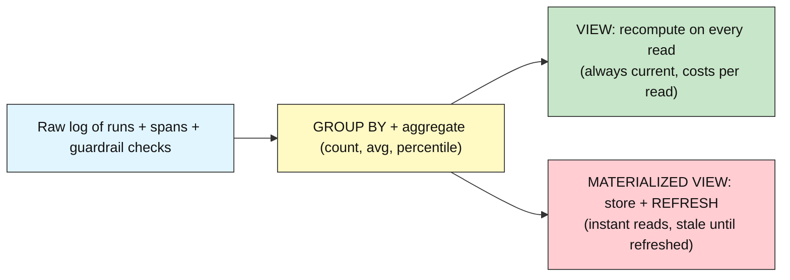
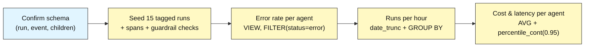

# Audit DB Advanced: How to Turn Events into Metrics

## Metrics and Dashboards

**Difficulty: Advanced | ~45 min | Requires Lab 4 (Filtering, Search, and Pagination) done in this Supabase project**

*Lab 5 of 8 in the Audit DB Labs module.*

These views are what a harness dashboard reads to show cost, error rate, and latency per agent -- without rescanning the raw log every time.

---

# Problem Statement / Use Case Overview

Labs 1-4 proved you can write events, model them into a run → span → tool_call / guardrail_event hierarchy, and read them back with JOINs, aggregation, filters, search, and pagination. But every query so far returned a *slice* of the log on demand. A dashboard is different: it shows **aggregate numbers that summarize the whole log at a glance** — how many runs errored, how many ran per hour, what the average (and the worst) cost and latency are per agent, and how often each guardrail fails. These are the numbers an operations team stares at daily, and they are all computed by the same `GROUP BY` + aggregate vocabulary you already know — the new question is *how to name them and where to compute them*.

This lab turns raw events into named, reusable metrics. It introduces **views** and **materialized views**, and the central distinction between them separates this lab from every earlier one:

> A **VIEW** recomputes its rows every time you read it (compute-on-read).
> A **MATERIALIZED VIEW** stores its rows and stays frozen until you **REFRESH** it.

It deliberately uses nothing from Lab 7: no triggers, no roles, no hash chains. Those protect the log's *integrity*; this lab is about *measuring* it.

---

# Underlying Concepts

**A view is a named query.** `CREATE VIEW v AS SELECT ...` stores the *definition*, not the *answer*. Every `SELECT * FROM v` runs the underlying query fresh, so the result is always current — at the cost of recomputing it on every read. This is the right choice when correctness matters more than speed and the underlying data is small.

**A materialized view is a stored snapshot.** `CREATE MATERIALIZED VIEW v AS SELECT ...` runs the query *once*, writes the result to disk, and serves it as a plain table. Reads are instant, but the snapshot goes **stale** the moment the underlying tables change. `REFRESH MATERIALIZED VIEW` re-runs the query and swaps in new data — you decide *when* that happens.

**Aggregates turn many rows into one number.** `count(*)`, `avg(...)`, and `sum(...)` fold a group into a single value, and `FILTER (WHERE ...)` narrows which rows contribute — `count(*) FILTER (WHERE status = 'error')` counts only the errored runs in one pass.

**Time bucketing makes a time series.** `date_trunc('hour', started_at)` snaps a timestamp down to its hour boundary, so `GROUP BY date_trunc('hour', started_at)` folds runs into hourly buckets — the raw material of a throughput chart.

**Percentiles resist outliers.** `avg()` can be dragged up by a single slow or costly run. `percentile_cont(0.95) WITHIN GROUP (ORDER BY x)` returns the value below which 95% of the data falls — the "tail" a dashboard shows alongside the mean so a normal day isn't hidden by one bad run.

**Latency is a timestamp difference.** `ended_at - started_at` is an interval; `EXTRACT(EPOCH FROM ...)` turns it into plain seconds that aggregate and render cleanly.



---

# Input Data

| Item | Detail |
|------|--------|
| **Source** | Synthetic agent activity, written inline in the notebook — no files to download |
| **Prerequisite data** | Lab 1's `run` and `event` tables + Lab 2's `span`, `tool_call`, `guardrail_event` tables with foreign keys and indexes |
| **Scenario** | A seeded measuring corpus: 15 tagged runs across three logical agents (`support`, `billing`, `copilot`) with a deliberate mix of `status`, `total_cost`, and varied start times and latencies, plus a span and a guardrail check per run |
| **Run row** | `agent_name` (the logical agent + the cleanup tag), `status`, `total_cost`, `started_at`, `ended_at` (latency = `ended_at - started_at`) |
| **Guardrail rows** | `guardrail_event` linked through `span` to each run, with `outcome` of `pass` / `fail` / `warn` |
| **Seed spread** | `status` success/error/timeout; `total_cost` from ~$0.001 to ~$0.45; start times from 20 minutes to 6 days ago; latencies from 5 to 90 seconds; guardrail outcomes deliberately mixed |
| **Cleanup tag** | `agent_name` of the form `pytest-lab5-<agent>-<hex>-<i>` so teardown can delete exactly this lab's rows by the `pytest-lab5-%` prefix, and `split_part('-', 3)` recovers the logical agent |
| **Size** | 15 runs + 15 spans + 15 guardrail checks per run-through, all removed again during cleanup |

---

# Processing

### Part A — Named metrics from plain views



The notebook confirms the schema, seeds a varied corpus, then names three metric queries as plain views over it, each time returning hand-computable numbers.

### Part B — From compute-on-read to stored-and-refreshed

```mermaid
flowchart LR
    COST2["Guardrail-fail rate\nVIEW across span join"] --> EXPL["EXPLAIN whole-log aggregate\nshows a Seq Scan"]
    EXPL --> CREATE["CREATE MATERIALIZED VIEW\nsnapshot stored once"]
    CREATE --> STALE["Insert a new run\nmatview stays STALE"]
    STALE --> REF["REFRESH MATERIALIZED VIEW\nnow current"]
    REF --> CLEAN["Cleanup tagged rows + views\n+ verify zero remain"]
    style COST2 fill:#fff9c4,stroke:#333333,color:#111111
    style EXPL fill:#e1f5ff,stroke:#333333,color:#111111
    style CREATE fill:#ffcdd2,stroke:#333333,color:#111111
    style STALE fill:#ffcdd2,stroke:#333333,color:#111111
    style REF fill:#c8e6c9,stroke:#333333,color:#111111
    style CLEAN fill:#ffcdd2,stroke:#333333,color:#111111
```



With plain views proven, the lab shows why they do not scale to a whole-log metric, then demonstrates the materialized-view answer: snapshot once, watch it go stale when a new run arrives, and `REFRESH` it to bring it back current.

---

# Output

When you run the notebook top-to-bottom, every step prints real output from your own Supabase database. The run ids, tags, and timestamps differ on every run-through (they're generated live); below is the output captured from an actual validation run so you know exactly what to expect. A `pytest-lab5-<agent>-<hex>-*` tag is shown with a placeholder hex because the hex changes per run.

**Step 1 — connection succeeds:**

```
PostgreSQL 17.6 on x86_64-pc-linux-gnu, compiled by gcc (GCC) 15.2.0, 64-bit
```

**Step 2 — prerequisite check:**

```
Schema found: run, event, span, tool_call, guardrail_event.
```

**Step 3 — seed:**

```
Seeded 15 tagged runs under marker pytest-lab5-*-<hex>-* (run ids 583..597).
```

**Step 4 — error rate per agent (a plain VIEW):**

```
  copilot: 2/4 runs errored = 50.0%
  support: 2/6 runs errored = 33.3%
  billing: 1/5 runs errored = 20.0%
```

**Step 5 — runs per hour (date_trunc):**

```
  2026-08-22T16:00:00+00:00: 1 run(s)
  2026-08-23T16:00:00+00:00: 1 run(s)
  2026-08-25T16:00:00+00:00: 1 run(s)
  2026-08-26T16:00:00+00:00: 1 run(s)
  2026-08-28T04:00:00+00:00: 1 run(s)
  2026-08-28T09:00:00+00:00: 1 run(s)
  2026-08-28T11:00:00+00:00: 1 run(s)
  2026-08-28T12:00:00+00:00: 1 run(s)
  2026-08-28T13:00:00+00:00: 1 run(s)
  2026-08-28T14:00:00+00:00: 2 run(s)
  2026-08-28T15:00:00+00:00: 4 run(s)
```

**Step 6 — cost and latency per agent:**

```
  billing: avg_cost=0.1118 avg_latency=26.6s p95_cost=0.3780 p95_latency=76.4s
  copilot: avg_cost=0.0391 avg_latency=30.0s p95_cost=0.0980 p95_latency=42.8s
  support: avg_cost=0.0090 avg_latency=28.3s p95_cost=0.0195 p95_latency=55.0s
```

**Step 7 — guardrail-fail rate:**

```
  toxicity_scan: 2/5 checks failed = 40.0%
  hallucination_scan: 1/4 checks failed = 25.0%
  pii_scan: 1/6 checks failed = 16.7%
```

**Step 8 — the materialized-view pay-off:**

```
8a) EXPLAIN of the whole-log error count:
    Aggregate  (cost=1.39..1.40 rows=1 width=16)
      ->  Seq Scan on run  (cost=0.00..1.22 rows=22 width=8)
8c) Matview (initial snapshot): total=22 errored=5 pct=22.73
8d) Matview after inserting a run, BEFORE refresh: total=22 errored=5 pct=22.73
8e) Matview after REFRESH: total=23 errored=6 pct=26.09
    Stale before refresh; current after. That is the materialized-view trade-off.
```

Note how `8d` repeats the *identical* numbers from `8c` — the snapshot froze before the new run existed — and `8e` finally shows `total=23 errored=6` after the refresh. That unchanged-then-changed pair is the whole demonstration. (The totals in step 8 aggregate the whole `run` table, so they include rows from earlier labs, not just this seed.)

**Step 9 — cleanup and recap:**

```
Cleanup done - 0 tagged runs left behind; views + materialized view dropped.
Lab 5 complete: named metrics from a view vs a materialized view.
```

> **Note:** this section shows actual output from a real execution against Supabase; your ids, tags, hour buckets, and the totals in step 8 (which aggregate the whole log, not just this seed) will differ since every value is generated live from the current table contents. The *rates* in steps 4 and 7 are exact for this seed.

---

# Tech Stack

| Component | Tool |
|-----------|------|
| **Database** | Supabase Postgres (free tier is sufficient; validated against PostgreSQL 17.6 in Lab 1) |
| **Python driver** | `psycopg2-binary==2.9.12` — connects Python to Postgres, with `%s` parameter binding |
| **Credential loader** | `python-dotenv==1.2.3` — loads `DATABASE_URL` from the module-level `.env` |
| **Tag source** | Python `secrets.token_hex(4)` — generates the unique cleanup tag for each run-through |

> **Compute & cost:** Runs fine on any laptop CPU — the entire workload is a handful of small SQL statements. Supabase's free tier covers it; nothing in this lab calls a paid API.

> Credentials never appear in the notebook itself: they're read from `.env` at runtime (README Section 7), exactly as in Labs 1-4.

---

# Prerequisites

- **Lab 4 (Filtering, Search, and Pagination) completed in this same Supabase project** — this lab's Step 2 explicitly checks for the `run`, `event`, `span`, `tool_call`, and `guardrail_event` tables and fails fast with a clear message if any is missing. The Lab 1 `run` table is the source of every metric; the Lab 2 `guardrail_event` (via `span`) is the source of the guardrail metric. This is a hard requirement.
- **Comfort with Lab 2's schema and Lab 3's aggregation** — `run` and `event` from Lab 1, the child tables and foreign keys from Lab 2, and the `GROUP BY` / aggregate vocabulary from Lab 3 (`count`, `avg`, `sum`, `FILTER`). This lab adds *no tables*; it only names queries over what already exists.
- **Supabase + `.env` setup completed** — the same one-time setup from Audit-DB-Labs README Section 7. If you haven't done it, do Lab 1 first; its Prerequisites walk through it in full.

---

# Environment / Dependencies Setup

| Package | Purpose |
|---------|---------|
| `python-dotenv` | Loads `.env` files so credentials stay out of the notebook |
| `psycopg2-binary` | The standard Python driver that connects Python to Postgres |

Install the two pinned packages (same versions the notebook's first cell installs, matching Labs 1-4 exactly so nothing drifts between labs):

```bash
pip install python-dotenv==1.2.3 psycopg2-binary==2.9.12
```

No additional packages are needed: aggregations, time bucketing, percentiles, and materialization are all SQL, executed through the same `psycopg2` cursor Labs 1-4 already used.

---

# Step-wise Development Instructions

Every step below matches one cell in `lab-metrics-dashboards.ipynb`. Run them in order — later cells depend on earlier ones.

### Step 0 — Install dependencies

```python
!pip install python-dotenv==1.2.3 psycopg2-binary==2.9.12
```

One pinned line installs everything the lab needs, matching Section 9 exactly.

### Step 1 — Connect to Postgres

```python
import os
from pathlib import Path
from datetime import datetime, timezone

from dotenv import load_dotenv
import psycopg2

env_path = next((p / ".env" for p in [Path.cwd(), *Path.cwd().parents] if (p / ".env").exists()), None)
load_dotenv(env_path)
database_url = os.getenv("DATABASE_URL")
assert database_url, "DATABASE_URL not found - complete README Section 7 setup first."

connection = psycopg2.connect(database_url, connect_timeout=10)
cursor = connection.cursor()
cursor.execute("SELECT version();")
print(cursor.fetchone()[0])
```

Identical to Labs 1-4 — same upward `.env` search, same connection, same version-string proof.

### Step 2 — Confirm the schema is already here

```python
# Fail-fast: confirm the Lab 1 + Lab 2 tables exist before we write against them.
cursor.execute("SELECT to_regclass('public.run')")
assert cursor.fetchone()[0] is not None, "run table missing - complete Lab 1 first."
cursor.execute("SELECT to_regclass('public.event')")
assert cursor.fetchone()[0] is not None, "event table missing - complete Lab 1 first."
for table in ["span", "tool_call", "guardrail_event"]:
    cursor.execute("SELECT to_regclass(%s)", (f"public.{table}",))
    assert cursor.fetchone()[0] is not None, f"{table} table missing - complete Lab 2 first."
print("Schema found: run, event, span, tool_call, guardrail_event.")
```

`to_regclass` returns the table's identifier if it exists, or `NULL` if it doesn't. Our metrics read `run` (for errors, cost, latency) and `guardrail_event` (for compliance), so both the Lab 1 tables and the Lab 2 children must be present.

### Step 3 — Seed a spread of runs worth measuring

```python
import secrets

# One tag for this entire run-through, so cleanup (Step 9) can find exactly these rows.
lab5_tag = secrets.token_hex(4)

# (agent_name, status, total_cost, started_a_go, duration)
#   agent_name  = a logical agent token (no hyphens) - the sort key our metrics GROUP BY
#   started_a_go = how far in the past the run began (Postgres interval string)
#   duration      = the run's latency; ended_at - started_at equals this interval
seed_runs = [
    ("support",   "success", 0.0210, "2 hours",    "35 seconds"),
    ("support",   "error",   0.0045, "1 hour",     "12 seconds"),
    ("billing",   "success", 0.0900, "30 minutes",  "5 seconds"),
    ("billing",   "timeout", 0.0120, "3 days",     "90 seconds"),
    ("support",   "success", 0.0031, "5 days",     "8 seconds"),
    ("copilot",   "error",   0.1100, "4 hours",    "45 seconds"),
    ("copilot",   "success", 0.0077, "6 days",     "20 seconds"),
    ("support",   "timeout", 0.0012, "12 hours",   "60 seconds"),
    ("billing",   "success", 0.4500, "2 days",     "22 seconds"),
    ("copilot",   "error",   0.0088, "45 minutes", "30 seconds"),
    ("support",   "success", 0.0150, "7 hours",    "15 seconds"),
    ("billing",   "error",   0.0010, "5 hours",    "10 seconds"),
    ("copilot",   "success", 0.0300, "2 hours",    "25 seconds"),
    ("support",   "error",   0.0090, "3 hours",    "40 seconds"),
    ("billing",   "success", 0.0060, "20 minutes",  "6 seconds"),
]

# One guardrail check per run's span: (check_name, outcome) with a deliberate mix.
seed_guards = [
    ("pii_scan",            "pass"),
    ("toxicity_scan",       "fail"),
    ("pii_scan",            "pass"),
    ("hallucination_scan",  "warn"),
    ("toxicity_scan",       "pass"),
    ("pii_scan",            "fail"),
    ("hallucination_scan",  "pass"),
    ("pii_scan",            "pass"),
    ("toxicity_scan",       "fail"),
    ("pii_scan",            "pass"),
    ("hallucination_scan",  "fail"),
    ("toxicity_scan",       "pass"),
    ("pii_scan",            "pass"),
    ("hallucination_scan",  "warn"),
    ("toxicity_scan",       "pass"),
]

inserted = []
for i, (agent, status, cost, ago, duration) in enumerate(seed_runs):
    # agent_name = logical agent + the lab5 tag. split_part('-', 3) recovers the agent.
    name = f"pytest-lab5-{agent}-{lab5_tag}-{i}"
    cursor.execute(
        "INSERT INTO run (agent_name, status, total_cost, started_at, ended_at) "
        "VALUES (%s, %s, %s, now() - (interval %s + interval %s), now() - interval %s) "
        "RETURNING run_id",
        (name, status, cost, ago, duration, ago),
    )
    run_id = cursor.fetchone()[0]
    cursor.execute(
        "INSERT INTO span (run_id, span_name, started_at, ended_at) "
        "VALUES (%s, %s, now() - (interval %s + interval %s), now() - interval %s) "
        "RETURNING span_id",
        (run_id, "handle_request", ago, duration, ago),
    )
    span_id = cursor.fetchone()[0]
    check_name, outcome = seed_guards[i]
    cursor.execute(
        "INSERT INTO guardrail_event (span_id, check_name, outcome, reason) "
        "VALUES (%s, %s, %s, %s)",
        (span_id, check_name, outcome, None),
    )
    inserted.append(run_id)

connection.commit()
print(f"Seeded {len(inserted)} tagged runs under marker pytest-lab5-*-{lab5_tag}-* "
      f"(run ids {inserted[0]}..{inserted[-1]}).")
```

The corpus is deliberately varied so every metric has something to summarize. Each run is tagged
`pytest-lab5-<agent>-<hex>-<n>` in `agent_name` (our private marker, never another lab's), where the
agent token is the thing our metric views group by. The run's `started_at` is pushed into the past by
`started_a_go`, and its latency equals `duration` — so `ended_at - started_at` gives exactly the
latency we designed. Each run's span carries one guardrail check, so the pass/fail/warn mix in
`seed_guards` can be aggregated into a failure metric later. Every number here is hand-computable,
which is what we verify in Step 4.

### Step 4 — Error rate per agent (a plain VIEW)

```python
# A VIEW is compute-on-read: every SELECT re-runs the query inside it.
cursor.execute("DROP VIEW IF EXISTS v_run_error_rate")
cursor.execute("""
    CREATE VIEW v_run_error_rate AS
    SELECT
        split_part(agent_name, '-', 3)                       AS agent_name,
        count(*)                                         AS total_runs,
        count(*) FILTER (WHERE status = 'error')         AS errored_runs,
        round(100.0 * count(*) FILTER (WHERE status = 'error') / count(*), 1) AS error_rate_pct
    FROM run
    WHERE agent_name LIKE 'pytest-lab5-%'
    GROUP BY split_part(agent_name, '-', 3)
    ORDER BY error_rate_pct DESC
""")
connection.commit()

cursor.execute("SELECT agent_name, total_runs, errored_runs, error_rate_pct FROM v_run_error_rate")
for agent, total, errored, pct in cursor.fetchall():
    print(f"  {agent}: {errored}/{total} runs errored = {pct}%")
```

`CREATE VIEW` stores the *definition*, not the answer — every read re-runs the query. `count(*) FILTER (WHERE status = 'error')` counts only errored runs in one pass, and `split_part(agent_name, '-', 3)` recovers the logical agent from the tagged name, so `GROUP BY` folds the six `support` runs into one row instead of reporting each run separately. We scope the view to `pytest-lab5-%` so it reads only this lab's synthetic rows (a production dashboard would drop that tag and group by the real agent name). By hand: `support` 2/6 (33.3%), `billing` 1/5 (20.0%), `copilot` 2/4 (50.0%).

### Step 5 — Runs per hour: date_trunc

```python
# Bucket each run's start time to its hour, then count per bucket.
cursor.execute("DROP VIEW IF EXISTS v_runs_per_hour")
cursor.execute("""
    CREATE VIEW v_runs_per_hour AS
    SELECT
        date_trunc('hour', started_at) AS hour_bucket,
        count(*)                       AS runs
    FROM run
    WHERE agent_name LIKE 'pytest-lab5-%'
    GROUP BY hour_bucket
    ORDER BY hour_bucket
""")
connection.commit()

cursor.execute("SELECT hour_bucket, runs FROM v_runs_per_hour")
for hour, runs in cursor.fetchall():
    print(f"  {hour.isoformat()}: {runs} run(s)")
```

`date_trunc('hour', started_at)` snaps every timestamp to its hour boundary, so runs at `14:03` and `14:51` share a `14:00` bucket. `GROUP BY hour_bucket` folds them together — this is the time-series view behind "what does hourly throughput look like?". Our seed spans 20 minutes to 6 days, so it produces many distinct buckets.

### Step 6 — Cost and latency per agent

```python
# AVG is easy to fool (one slow run inflates it), so add a 95th-percentile tail too.
cursor.execute("DROP VIEW IF EXISTS v_agent_cost_latency")
cursor.execute("""
    CREATE VIEW v_agent_cost_latency AS
    SELECT
        split_part(agent_name, '-', 3)                                       AS agent_name,
        round(avg(total_cost)::numeric, 4)                                   AS avg_cost,
        round(avg(EXTRACT(EPOCH FROM (ended_at - started_at))), 1)           AS avg_latency_s,
        round(percentile_cont(0.95) WITHIN GROUP (ORDER BY total_cost)::numeric, 4) AS p95_cost,
        round(percentile_cont(0.95) WITHIN GROUP (ORDER BY EXTRACT(EPOCH FROM (ended_at - started_at)))::numeric, 1) AS p95_latency_s
    FROM run
    WHERE agent_name LIKE 'pytest-lab5-%'
    GROUP BY split_part(agent_name, '-', 3)
    ORDER BY avg_cost DESC
""")
connection.commit()

cursor.execute("SELECT agent_name, avg_cost, avg_latency_s, p95_cost, p95_latency_s FROM v_agent_cost_latency")
for agent, avg_cost, avg_lat, p95_cost, p95_lat in cursor.fetchall():
    print(f"  {agent}: avg_cost={avg_cost} avg_latency={avg_lat}s p95_cost={p95_cost} p95_latency={p95_lat}s")
```

Latency is a timestamp difference, so `EXTRACT(EPOCH FROM ...)` turns the resulting interval into plain seconds that aggregate cleanly (and we cast the percentile result to `numeric` before rounding it, because `percentile_cont` over a double returns a double that `round(x, 1)` refuses). `percentile_cont(0.95) WITHIN GROUP (ORDER BY ...)` returns the value below which 95% of runs fall — the tail you show *alongside* the mean. Notice how `billing` has `avg_latency=26.6s` but `p95_latency=76.4s`: its one 90-second timeout is invisible to the mean yet dominates the tail, exactly why the percentile belongs in a dashboard. Both are ordinary ordered-set aggregates; no stored logic yet — Step 8 is where storage finally matters.

### Step 7 — Guardrail-fail rate

```python
# Join guardrail checks through spans to their runs, then fail-rate per check.
cursor.execute("DROP VIEW IF EXISTS v_guardrail_fail_rate")
cursor.execute("""
    CREATE VIEW v_guardrail_fail_rate AS
    SELECT
        ge.check_name,
        count(*)                                AS total_checks,
        count(*) FILTER (WHERE ge.outcome = 'fail') AS failed_checks,
        round(100.0 * count(*) FILTER (WHERE ge.outcome = 'fail') / count(*), 1) AS fail_rate_pct
    FROM guardrail_event ge
    JOIN span s ON s.span_id = ge.span_id
    JOIN run r ON r.run_id = s.run_id
    WHERE r.agent_name LIKE 'pytest-lab5-%'
    GROUP BY ge.check_name
    ORDER BY fail_rate_pct DESC
""")
connection.commit()

cursor.execute("SELECT check_name, total_checks, failed_checks, fail_rate_pct FROM v_guardrail_fail_rate")
for check, total, failed, pct in cursor.fetchall():
    print(f"  {check}: {failed}/{total} checks failed = {pct}%")
```

`guardrail_event` is a child of `span`, so reaching the *run* means joining through two tables. The join filters to our tagged runs, then `FILTER (WHERE outcome = 'fail')` turns raw outcomes into a compliance metric. By hand: `toxicity_scan` 2/5 (40%), `hallucination_scan` 1/4 (25%), `pii_scan` 1/6 (~16.7%). Every one of these is a plain view — cheap on 15 rows, increasingly expensive as the real log grows. That cost is the bridge to Step 8.

### Step 8 — The scaling problem, and the MATERIALIZED VIEW answer

```python
# 8a) The whole-log aggregate pays a full scan on every single read.
cursor.execute("EXPLAIN SELECT count(*), count(*) FILTER (WHERE status = 'error') FROM run")
print("8a) EXPLAIN of the whole-log error count:")
for row in cursor.fetchall():
    print("    " + row[0])

# 8b) Snapshot that expensive metric into a MATERIALIZED VIEW (stored, not recomputed).
cursor.execute("DROP MATERIALIZED VIEW IF EXISTS mv_global_error_rate")
cursor.execute("""
    CREATE MATERIALIZED VIEW mv_global_error_rate AS
    SELECT
        count(*)                                AS total_runs,
        count(*) FILTER (WHERE status = 'error') AS errored_runs,
        round(100.0 * count(*) FILTER (WHERE status = 'error') / count(*), 2) AS error_rate_pct
    FROM run
""")
connection.commit()

# 8c) Reading it is instant - it is a stored snapshot, not a recomputed query.
cursor.execute("SELECT total_runs, errored_runs, error_rate_pct FROM mv_global_error_rate")
before = cursor.fetchone()
print(f"8c) Matview (initial snapshot): total={before[0]} errored={before[1]} pct={before[2]}")

# 8d) A new run arrives - the matview is STALE until we refresh it.
cursor.execute(
    "INSERT INTO run (agent_name, status, total_cost) VALUES (%s, %s, %s)",
    (f"pytest-lab5-{lab5_tag}-NEW", "error", 0.02),
)
connection.commit()
cursor.execute("SELECT total_runs, errored_runs, error_rate_pct FROM mv_global_error_rate")
stale = cursor.fetchone()
print(f"8d) Matview after inserting a run, BEFORE refresh: total={stale[0]} errored={stale[1]} pct={stale[2]}")
assert before == stale, "matview should be stale (unchanged) until refreshed"

# 8e) REFRESH makes it current.
cursor.execute("REFRESH MATERIALIZED VIEW mv_global_error_rate")
connection.commit()
cursor.execute("SELECT total_runs, errored_runs, error_rate_pct FROM mv_global_error_rate")
after = cursor.fetchone()
print(f"8e) Matview after REFRESH: total={after[0]} errored={after[1]} pct={after[2]}")
print("    Stale before refresh; current after. That is the materialized-view trade-off.")
```

This is the intellectual peak. `8a` uses `EXPLAIN` to show the problem: counting errors over the whole `run` table is a **Seq Scan** that touches every row, and a plain view would pay that cost on *every* read even though the answer barely changes. `8b` creates a **materialized view**, which runs that query once and stores the answer; `8c` shows reading it is a plain table read. Then the trade-off: `8d` inserts a new run and the snapshot **stays frozen** (the `assert before == stale` proves it), and `8e`'s `REFRESH` finally brings it current. **Views** = always correct, recompute each read; **materialized views** = instant to read, but you choose *when* to refresh.

### Step 9 — Cleanup and recap

```python
# Drop every object this lab created (views + the materialized view).
for stmt in [
    "DROP VIEW IF EXISTS v_guardrail_fail_rate",
    "DROP VIEW IF EXISTS v_agent_cost_latency",
    "DROP VIEW IF EXISTS v_runs_per_hour",
    "DROP VIEW IF EXISTS v_run_error_rate",
    "DROP MATERIALIZED VIEW IF EXISTS mv_global_error_rate",
]:
    cursor.execute(stmt)
connection.commit()

# Delete only this lab's tagged rows - children first (FK order), then parents.
cursor.execute(
    "DELETE FROM guardrail_event WHERE span_id IN "
    "(SELECT span_id FROM span WHERE run_id IN (SELECT run_id FROM run WHERE agent_name LIKE %s))",
    ("pytest-lab5-%",),
)
cursor.execute(
    "DELETE FROM tool_call WHERE span_id IN "
    "(SELECT span_id FROM span WHERE run_id IN (SELECT run_id FROM run WHERE agent_name LIKE %s))",
    ("pytest-lab5-%",),
)
cursor.execute(
    "DELETE FROM span WHERE run_id IN (SELECT run_id FROM run WHERE agent_name LIKE %s)",
    ("pytest-lab5-%",),
)
cursor.execute(
    "DELETE FROM event WHERE run_id IN (SELECT run_id FROM run WHERE agent_name LIKE %s)",
    ("pytest-lab5-%",),
)
cursor.execute("DELETE FROM run WHERE agent_name LIKE %s", ("pytest-lab5-%",))
connection.commit()

cursor.execute("SELECT count(*) FROM run WHERE agent_name LIKE %s", ("pytest-lab5-%",))
leftover = cursor.fetchone()[0]

cursor.close()
connection.close()

print(f"Cleanup done - {leftover} tagged runs left behind; views + materialized view dropped.")
print("Lab 5 complete: named metrics from a view vs a materialized view.")
```

Cleanup happens before closing and verifies itself: it drops the four views and the materialized view (`IF EXISTS` makes it safe to re-run), deletes only our `pytest-lab5-%` rows children-before-parents so foreign keys are satisfied, and counts how many tagged rows remain — zero. That self-verifying teardown is what makes the lab safe to re-run end to end.

---

# Optional Exercise

Implement a **stale-then-fresh "runs per hour" dashboard metric** with a materialized view, and prove the refresh schedule matters:

1. After Step 5, create a materialized view for the hourly buckets instead of the plain view:
   `mv_runs_per_hour`, defined as today's Step 5 query but *without* the `pytest-lab5-%` filter (a whole-log throughput chart), so it aggregates all runs.
2. Read it and record the bucket counts — this is your "this week" baseline.
3. Now insert a *new* tagged run whose `started_at` is `now()` (so it lands in the current hour bucket) and read the materialized view again. Note that the current-hour bucket is **unchanged** — the snapshot is stale.
4. Run `REFRESH MATERIALIZED VIEW mv_runs_per_hour`, read it a third time, and confirm the current-hour bucket increased by exactly one and the rest are untouched.
5. Finally add a `WHERE started_at >= now() - interval '24 hours'` wrapper `SELECT ... FROM mv_runs_per_hour WHERE hour_bucket >= ...` (or re-create the matview with the filter) and confirm the refreshed, whole-log chart now reflects the new run.

This mirrors Step 8 exactly but for the time-series metric, and it demonstrates the operational reality of materialized views: you (or a scheduled job) must choose *when* to refresh, or the dashboard goes quietly stale.

---

# What We Learnt

- **A log of events becomes a dashboard only when you aggregate it** — `GROUP BY` + `count`/`avg` + `FILTER (WHERE ...)` turn many rows into the single numbers a team reads, all in the same vocabulary Labs 3-4 used (Problem Statement; Steps 4-7).
- **A VIEW is compute-on-read** — it stores a query definition, not an answer, so every read is current but recomputes; the right choice for small or frequently-changing data (Step 4).
- **A MATERIALIZED VIEW is a stored snapshot** — it stores the answer, reads instantly, goes stale the moment the base tables change, and needs an explicit `REFRESH` to become current again (Step 8).
- **Time series come from bucketing** — `date_trunc('hour', started_at)` + `GROUP BY` is the raw material of a throughput chart (Step 5).
- **Averages hide outliers; percentiles surface them** — `percentile_cont(0.95)` shows the tail that a single slow/costly run would otherwise hide behind the mean (Step 6).
- **Latency is a timestamp difference** — `EXTRACT(EPOCH FROM (ended_at - started_at))` turns an interval into seconds that aggregate and render cleanly (Step 6).
- **Views can be composed across the hierarchy** — `guardrail_event` → `span` → `run` join turns raw check outcomes into a compliance-style failure metric (Step 7).
- **`EXPLAIN` reveals the cost a plain view hides** — a whole-log aggregate is a Seq Scan over every row, which is precisely why stored snapshots exist (Step 8).
- **A re-runnable lab is one with a tag and a self-verifying teardown** — cleanup drops every view and materialized view it created and deletes tagged rows children-before-parents, proving nothing leaks (Step 9).
