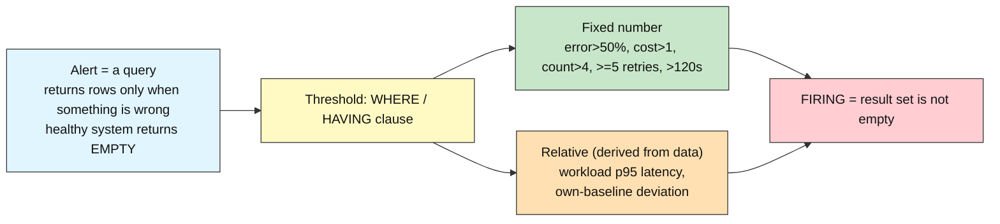
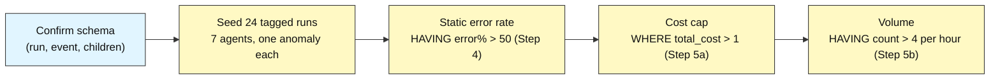
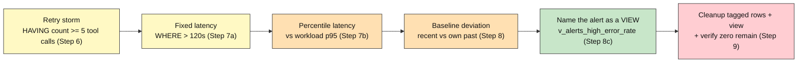

# Audit DB Advanced: How to Detect Trouble Automatically

## Alerting on Anomalies

**Difficulty: Advanced | ~45 min | Requires Lab 5 (Metrics and Dashboards) done in this Supabase project**

*Lab 6 of 8 in the Audit DB Labs module.*

These queries are what a harness runs on a schedule against its own audit DB to catch a cost spike, an error surge, or a stuck retry loop automatically.

---

# Problem Statement / Use Case Overview

Lab 5 turned a raw log into *metrics*: error rates, cost and latency, throughput. But a metric is
only useful when a human looks at it. This lab removes the human from the loop: instead of "here are
the numbers, go study them," it asks the database itself to **ring an alarm when a number goes
wrong**. Every single alert in this lab is the same shape, and once you see that shape you've
understood the whole lab:

> An **alert** is a query that returns rows only when something is wrong. A healthy system returns an
> empty result; a problem returns the offending rows.

The **threshold** is the `WHERE`/`HAVING` clause, the **metric** is the thing being measured, and
**"firing"** just means "the result set is not empty." We build that idea up from the simplest case
-- a hard-coded error-rate number -- through cost and volume thresholds, a retry storm, and latency
budgets, all the way to the conceptual peak: a **relative** alert that compares an agent to *its own
past* and therefore fires on trouble no fixed number could ever see.

It deliberately uses nothing from Lab 7: no triggers, no roles, no hash chains. Those protect the
log's *integrity*; this lab is about *noticing* problems in the data that is already there.

---

# Underlying Concepts

**An alert is a query, not a program.** There is no daemon to write and no separate alerting system.
Because the audit DB is PostgreSQL, an "alert" is a `SELECT` whose `WHERE` or `HAVING` encodes the
bad condition. A monitoring job only has to run the query on a schedule and check `rowcount == 0`.

**A threshold is a `WHERE`/`HAVING` clause.** The simplest alert is a row-level filter:
`WHERE total_cost > 1` returns a row only when a run is too expensive. Grouped alerts move the
threshold into `HAVING` -- `HAVING count(*) > 4` fires only when a group is too big. Choosing *where*
the condition lives is the design decision of every alert.

**"Firing" is an empty vs non-empty result.** This reframing is the whole trick. A healthy system
makes every alert query return `0` rows; a problem makes it return the offending rows themselves, so
the alert *carries its own evidence* and requires no separate alert payload.

**The threshold can be absolute or relative.** An **absolute** threshold is a fixed number you choose
(`> 50%` error rate). It is simple but goes stale as the workload drifts. A **relative** threshold is
derived from data -- a workload's own 95th-percentile latency, or an agent's own trailing error rate
-- so it adapts and, crucially, can catch "worse than normal for *this* agent" even when no fixed
number is crossed.

**Time is often the dimension, not the value.** `date_trunc('hour', started_at)` + `HAVING count(*)`
detects a volume spike; comparing two windows (`recent` vs `baseline` CTEs) detects a *deviation over
time*. Alerts are frequently about "what changed," not just "what is large."

**Latency is a timestamp difference.** `ended_at - started_at` is an interval;
`EXTRACT(EPOCH FROM ...)` turns it into plain seconds that a threshold can compare, and
`percentile_cont(0.95)` lets the data itself pick what "abnormally slow" means for this workload.



---

# Input Data

| Item | Detail |
|------|--------|
| **Source** | Synthetic agent activity, written inline in the notebook — no files to download |
| **Prerequisite data** | Lab 1's `run` and `event` tables + Lab 2's `span`, `tool_call`, `guardrail_event` tables with foreign keys and indexes (the same schema Lab 5 already used) |
| **Scenario** | A seeded corpus of **24 tagged runs** across seven logical agents, each planting exactly one kind of trouble the alerts must catch, plus a fully-healthy agent as the contrast case |
| **Run row** | `agent_name` (the logical agent + the cleanup tag), `status`, `total_cost`, `started_at`, `ended_at` (latency = `ended_at - started_at`) |
| **Tool rows** | `tool_call` linked through `span` to each run, with `tool_name` and `success` — the retry-storm model lives here |
| **Seed design** | `noisy` spikes error rate to 75%; `pricey` has one run costing `999.0`; `bursty` lands five runs in one tight window; `laggy` has one `300s` run; `tricky` jumps `0% → 33%` error rate; `loopy` repeats one tool call six times; `calm` stays fully healthy |
| **Cleanup tag** | `agent_name` of the form `pytest-lab6-<agent>-<hex>-<i>` so teardown can delete exactly this lab's rows by the `pytest-lab6-%` prefix, and `split_part('-', 3)` recovers the logical agent |
| **Size** | 24 runs + 24 spans + 6 tool calls per run-through, all removed again during cleanup |

---

# Processing

### Part A — The simplest alerts: fixed numbers



The notebook confirms the schema, seeds a corpus in which exactly one agent trips each alert, then
demonstrates the row-level cost cap and the grouped volume threshold — each time proving the healthy
agent stays silent.

### Part B — Diagnosis and relative thresholds



Step 6 sees the retry storm through the Lab 2 hierarchy; Step 7 moves from a hand-picked fixed latency
to a percentile the workload derives for itself; Step 8 reaches the peak — a *relative* alert that
compares each agent to its own trailing baseline and catches `tricky`'s jump that every fixed
threshold missed. Step 9 tears everything down so the schema returns to its Lab 1 + Lab 2 shape.

---

# Output

When you run the notebook top-to-bottom, every step prints real output from your own Supabase
database. The run ids, tags, and timestamps differ on every run-through (they're generated live);
below is the output captured from an actual validation run so you know exactly what to expect. A
`pytest-lab6-<agent>-<hex>-*` tag is shown with a placeholder hex because the hex changes per run.

**Step 1 — connection succeeds:**

```
PostgreSQL 17.6 on x86_64-pc-linux-gnu, compiled by gcc (GCC) 15.2.0, 64-bit
```

**Step 2 — prerequisite check:**

```
Schema found: run, event, span, tool_call, guardrail_event.
```

**Step 3 — seed:**

```
Seeded 24 tagged runs under marker pytest-lab6-*-<hex>-* (run ids 824..847).
```

**Step 4 — static error-rate threshold:**

```
Agents firing (error rate > 50%):
  noisy: 3/4 runs errored = 75.0%
Same query, healthy slice: returned 0 rows -- calm is fine.
```

**Step 5 — cost and volume thresholds:**

```
Runs over the $1 cost cap: 1
  pytest-lab6-pricey-<hex>-8: $999.000000 (success)
Hour buckets with more than 4 runs: 1
  2026-08-28T14:00:00+00:00: 5 runs
```

**Step 6 — retry storm:**

```
Retry storms (same operation >= 5 times in one run): 1
  pytest-lab6-loopy-<hex>-23: 'check_status' attempted 6 times, 2 failed
```

**Step 7 — latency outliers (fixed then percentile):**

```
Runs over the 120s fixed budget: 1
  pytest-lab6-laggy-<hex>-17: 300.0s
Runs above the workload's own 95th-percentile latency:
  pytest-lab6-laggy-<hex>-17: 300.0s vs p95=9.0s
```

**Step 8 — baseline deviation (the peak):**

```
Agents deviating from their own baseline by > 25 points (last 60 minutes, >= 2 recent runs): 1
  tricky: recent 33.3% vs baseline 0.0% (deviation +33.3)
8c) v_alerts_high_error_rate (a named alert-as-a-view) returns:
    noisy: 75.0%
```

**Step 9 — cleanup and recap:**

```
Cleanup done - 0 tagged runs left behind; view dropped.
Lab 6 complete: alerts are queries that return rows only when something is wrong.
```

> **Note:** this section shows actual output from a real execution against Supabase; your ids, tags,
> and hour buckets will differ since every value is generated live. The key *outcomes* are stable:
> Step 4 fires only `noisy`, Step 5 fires only `pricey`/`bursty`, Step 6 only `loopy`, Step 7 only
> `laggy`, Step 8 only `tricky`, and every alert stays silent on `calm`.

---

# Tech Stack

| Component | Tool |
|-----------|------|
| **Database** | Supabase Postgres (free tier is sufficient; validated against PostgreSQL 17.6 in Lab 1) |
| **Python driver** | `psycopg2-binary==2.9.12` — connects Python to Postgres, with `%s` parameter binding |
| **Credential loader** | `python-dotenv==1.2.3` — loads `DATABASE_URL` from the module-level `.env` |
| **Tag source** | Python `secrets.token_hex(4)` — generates the unique cleanup tag for each run-through |

> **Compute & cost:** Runs fine on any laptop CPU — the entire workload is a handful of small SQL
> statements. Supabase's free tier covers it; nothing in this lab calls a paid API.

> Credentials never appear in the notebook itself: they're read from `.env` at runtime (README
> Section 7), exactly as in Labs 1-5.

---

# Prerequisites

- **Lab 5 (Metrics and Dashboards) completed in this same Supabase project** — this lab's Step 2
  explicitly checks for the `run`, `event`, `span`, `tool_call`, and `guardrail_event` tables and
  fails fast with a clear message if any is missing. The `GROUP BY` + aggregate vocabulary
  (`count`, `FILTER`, `date_trunc`, `percentile_cont`) that Lab 5 taught is exactly what every alert
  here builds on. This is a hard requirement.
- **Comfort with Lab 3's aggregation and Lab 2's hierarchy** — reaching `tool_call` through `span`
  and `run` (Step 6), and writing the two-window `CTE` comparison (Step 8), both reuse what earlier
  labs established.
- **Supabase + `.env` setup completed** — the same one-time setup from Audit-DB-Labs README
  Section 7. If you haven't done it, do Lab 1 first; its Prerequisites walk through it in full.

---

# Environment / Dependencies Setup

| Package | Purpose |
|---------|---------|
| `python-dotenv` | Loads `.env` files so credentials stay out of the notebook |
| `psycopg2-binary` | The standard Python driver that connects Python to Postgres |

Install the two pinned packages (same versions the notebook's first cell installs, matching Labs 1-5
exactly so nothing drifts between labs):

```bash
pip install python-dotenv==1.2.3 psycopg2-binary==2.9.12
```

No additional packages are needed: all detection (aggregation, bucketing, percentiles, comparisons)
is SQL, executed through the same `psycopg2` cursor Labs 1-5 already used.

---

# Step-wise Development Instructions

Every step below matches one cell in `lab-alerting-anomalies.ipynb`. Run them in order — later cells
depend on earlier ones.

### Step 0 — Install dependencies

```python
!pip install python-dotenv==1.2.3 psycopg2-binary==2.9.12
```

One pinned line installs everything the lab needs, matching Section 9 exactly.

### Step 1 — Connect to Postgres

```python
import os
from pathlib import Path

from dotenv import load_dotenv
import psycopg2

env_path = next((p / ".env" for p in [Path.cwd(), *Path.cwd().parents] if (p / ".env").exists()), None)
load_dotenv(env_path)
database_url = os.getenv("DATABASE_URL")
assert database_url, "DATABASE_URL not found - complete README Section 7 setup first."

connection = psycopg2.connect(database_url, connect_timeout=10)
cursor = connection.cursor()
cursor.execute("SELECT version();")
print(cursor.fetchone()[0])
```

Identical to Labs 1-5 — same upward `.env` search, same connection, same version-string proof.

### Step 2 — Confirm the schema is here

```python
# Fail-fast: confirm the Lab 1 + Lab 2 tables exist before we write against them.
cursor.execute("SELECT to_regclass('public.run')")
assert cursor.fetchone()[0] is not None, "run table missing - complete Lab 1 first."
cursor.execute("SELECT to_regclass('public.event')")
assert cursor.fetchone()[0] is not None, "event table missing - complete Lab 1 first."
for table in ["span", "tool_call", "guardrail_event"]:
    cursor.execute("SELECT to_regclass(%s)", (f"public.{table}",))
    assert cursor.fetchone()[0] is not None, f"{table} table missing - complete Lab 2 first."
print("Schema found: run, event, span, tool_call, guardrail_event.")
```

`to_regclass` returns the table's identifier if it exists, or `None` if it doesn't. Any `None` means
an earlier lab has not been run, and the assertions stop us before we start building alerts against
tables that are not there. Our alerts read `run` (error rates, cost, latency), `span` (to reach child
tables), and `tool_call` (for the retry-storm model in Step 6), so the Lab 1 and Lab 2 tables must
all be present.

### Step 3 — Seed a spread with planted anomalies

```python
import secrets

# One tag for this entire run-through, so cleanup (Step 9) can find exactly these rows.
lab6_tag = secrets.token_hex(4)

# (logical_agent, status, total_cost, started_a_go, duration)
#   agent_name = pytest-lab6-<agent>-<tag>-<i>  -- split_part('-', 3) recovers the agent
#   Each agent plants ONE kind of trouble the alerts must catch; "calm" stays healthy.
seed_runs = [
    # calm: a healthy baseline -- nothing below should ever fire on these
    ("calm",    "success", 0.0010, "6 hours",   "5 seconds"),
    ("calm",    "success", 0.0010, "10 hours",  "6 seconds"),
    ("calm",    "success", 0.0010, "12 hours",  "7 seconds"),
    # noisy: an error-rate SPIKE (3 of 4 errored = 75%), all fast runs
    ("noisy",   "error",   0.0050, "5 hours",   "8 seconds"),
    ("noisy",   "success", 0.0030, "7 hours",   "9 seconds"),
    ("noisy",   "error",   0.0070, "9 hours",   "9 seconds"),
    ("noisy",   "error",   0.0040, "11 hours",  "9 seconds"),
    # pricey: one run wildly over the cost cap
    ("pricey",  "success", 0.0100, "14 hours",  "5 seconds"),
    ("pricey",  "success", 999.0,  "16 hours",  "6 seconds"),
    ("pricey",  "success", 0.0150, "18 hours",  "7 seconds"),
    # bursty: five runs landing in ONE tight window (volume spike, isolated bucket)
    ("bursty",  "success", 0.0010, "2 hours",   "5 seconds"),
    ("bursty",  "error",   0.0010, "2 hours",   "6 seconds"),
    ("bursty",  "success", 0.0010, "2 hours",   "7 seconds"),
    ("bursty",  "error",   0.0010, "2 hours",   "8 seconds"),
    ("bursty",  "success", 0.0010, "2 hours",   "9 seconds"),
    # laggy: one run with a clear latency outlier
    ("laggy",   "success", 0.0050, "20 hours",  "8 seconds"),
    ("laggy",   "success", 0.0050, "23 hours",  "9 seconds"),
    ("laggy",   "success", 0.0020, "26 hours",  "300 seconds"),
    # tricky: LOW baseline that then jumps -- a fixed threshold misses it,
    #   but a baseline comparison catches it (the Step 8 peak)
    ("tricky",  "success", 0.0020, "8 hours",   "5 seconds"),
    ("tricky",  "success", 0.0020, "10 hours",  "6 seconds"),
    ("tricky",  "success", 0.0020, "10 minutes", "4 seconds"),
    ("tricky",  "error",   0.0020, "15 minutes", "5 seconds"),
    ("tricky",  "success", 0.0020, "20 minutes", "6 seconds"),
    # loopy: a retry storm - one run repeats the same tool call, otherwise fast
    ("loopy",   "success", 0.0200, "6 hours",   "9 seconds"),
]

inserted = []
for i, (agent, status, cost, ago, duration) in enumerate(seed_runs):
    name = f"pytest-lab6-{agent}-{lab6_tag}-{i}"
    cursor.execute(
        "INSERT INTO run (agent_name, status, total_cost, started_at, ended_at) "
        "VALUES (%s, %s, %s, now() - (interval %s + interval %s), now() - interval %s) "
        "RETURNING run_id",
        (name, status, cost, ago, duration, ago),
    )
    run_id = cursor.fetchone()[0]
    cursor.execute(
        "INSERT INTO span (run_id, span_name, started_at, ended_at) "
        "VALUES (%s, %s, now() - (interval %s + interval %s), now() - interval %s) "
        "RETURNING span_id",
        (run_id, "handle_request", ago, duration, ago),
    )
    span_id = cursor.fetchone()[0]
    if agent == "loopy":
        # A retry storm: the same operation, attempted six times inside one span.
        for attempt in range(6):
            cursor.execute(
                "INSERT INTO tool_call (span_id, tool_name, success) VALUES (%s, %s, %s)",
                (span_id, "check_status", attempt % 3 != 0),
            )
    inserted.append(run_id)

connection.commit()
print(f"Seeded {len(inserted)} tagged runs under marker pytest-lab6-*-{lab6_tag}-* "
      f"(run ids {inserted[0]}..{inserted[-1]}).")
```

An alert is only meaningful if we control *what the data looks like when it is wrong*. So this seed
isn't random — it plants each problem the alerts must catch and keeps one agent (`calm`) fully
healthy as the contrast case. Every run carries the same private tag in `agent_name`, our marker
alone; `split_part('-', 3)` recovers the logical agent. The run's `started_at` is pushed into the
past by `started_a_go` and its latency equals `duration`, so `ended_at - started_at` is exactly what
we designed — every threshold below is hand-checkable.

### Step 4 — The simplest alert: a static error-rate threshold

```python
# The alert: agents whose error rate is above a fixed bar. Non-empty == firing.
error_threshold = 50.0
cursor.execute("""
    SELECT
        split_part(agent_name, '-', 3)                       AS agent_name,
        count(*)                                         AS total_runs,
        count(*) FILTER (WHERE status = 'error')         AS errored_runs,
        round(100.0 * count(*) FILTER (WHERE status = 'error') / count(*), 1) AS error_rate_pct
    FROM run
    WHERE agent_name LIKE 'pytest-lab6-%%'
    GROUP BY split_part(agent_name, '-', 3)
    HAVING 100.0 * count(*) FILTER (WHERE status = 'error') / count(*) > %s
    ORDER BY error_rate_pct DESC
""", (error_threshold,))
fired = cursor.fetchall()
print(f"Agents firing (error rate > {int(error_threshold)}%):")
if not fired:
    print("  (none - healthy)")
for agent, total, errored, pct in fired:
    print(f"  {agent}: {errored}/{total} runs errored = {pct}%")

# The empty case matters just as much: the SAME query over the healthy agent.
cursor.execute("""
    SELECT
        split_part(agent_name, '-', 3),
        count(*) FILTER (WHERE status = 'error')
    FROM run
    WHERE agent_name LIKE 'pytest-lab6-calm-%%'
    GROUP BY split_part(agent_name, '-', 3)
    HAVING 100.0 * count(*) FILTER (WHERE status = 'error') / count(*) > %s
""", (error_threshold,))
print("Same query, healthy slice: returned", cursor.rowcount, "rows -- calm is fine.")
```

Read Step 4 as the whole lab in miniature. The `HAVING` clause is the **threshold**; the grouped
error-rate query is the **metric**; and **firing** is simply "did any rows come back?" The first
`cursor.execute` returns one row per agent whose error rate clears `50%` — only **noisy** (75%) does;
`calm`, `pricey`, `laggy`, `tricky`, `bursty`, and `loopy` are all below it, so they do not appear. A
non-empty result *is* the alert: it carries exactly the offending rows. The second half proves the
healthy case: the **identical** query, narrowed to `pytest-lab6-calm-%`, returns `0` rows. When
nothing is wrong, the alert is silent — an empty result set is a *good* signal, not an error.

### Step 5 — Cost and volume thresholds

```python
# 5a) Runs over a cost cap -- a plain WHERE-style alert (row-level threshold).
cost_cap = 1.0
cursor.execute("""
    SELECT agent_name, total_cost, status
    FROM run
    WHERE agent_name LIKE 'pytest-lab6-%%'
      AND total_cost > %s
    ORDER BY total_cost DESC
""", (cost_cap,))
over_cost = cursor.fetchall()
print(f"Runs over the ${int(cost_cap)} cost cap: {len(over_cost)}")
for name, cost, status in over_cost:
    print(f"  {name}: ${cost} ({status})")

# 5b) Volume: more than a fixed number of runs inside one hour bucket.
max_per_hour = 4
cursor.execute("""
    SELECT date_trunc('hour', started_at) AS hour_bucket, count(*) AS runs
    FROM run
    WHERE agent_name LIKE 'pytest-lab6-%%'
    GROUP BY hour_bucket
    HAVING count(*) > %s
    ORDER BY runs DESC
""", (max_per_hour,))
bursty_hours = cursor.fetchall()
print(f"Hour buckets with more than {max_per_hour} runs: {len(bursty_hours)}")
for hour, runs in bursty_hours:
    print(f"  {hour.isoformat()}: {runs} runs")
```

Two thresholds, one idea. **5a** is a *row-level* check — `WHERE total_cost > 1.0`. Only **pricey**'s
`999.0` run clears it. This is the cheapest kind of alert: it examines each run by itself, no
grouping at all. **5b** is a *grouped* check — `date_trunc('hour', started_at)` snaps each run to its
hour, then `HAVING count(*) > 4` fires when any one hour contains more than four runs. Only
**bursty**'s five runs, all landing in a single tight window, trip it. This is the first alert that
needs the aggregate vocabulary from Lab 5: the *bucket* is the metric, the `HAVING` clause is the
threshold. Same shape as Step 4, but the thing being measured is a count over time instead of a
single field.

### Step 6 — Retry storms

```python
# A retry storm = the same operation attempted many times. Group tool calls by
# (run, tool_name) and fire when one run repeats an operation N+ times.
max_attempts = 5
cursor.execute("""
    SELECT
        r.agent_name,
        tc.tool_name,
        count(*) AS attempts,
        count(*) FILTER (WHERE tc.success = false) AS failed_attempts
    FROM tool_call tc
    JOIN span s     ON s.span_id = tc.span_id
    JOIN run r      ON r.run_id  = s.run_id
    WHERE r.agent_name LIKE 'pytest-lab6-%%'
    GROUP BY r.agent_name, tc.tool_name
    HAVING count(*) >= %s
    ORDER BY attempts DESC
""", (max_attempts,))
retries = cursor.fetchall()
print(f"Retry storms (same operation >= {max_attempts} times in one run): {len(retries)}")
for name, tool, attempts, failed in retries:
    print(f"  {name}: '{tool}' attempted {attempts} times, {failed} failed")
```

A **retry storm** is when an agent gets stuck: it keeps calling the same tool (say `check_status`)
over and over instead of giving up. That is worth alerting on for two reasons — every retry burns
tokens and CPU (wasted cost), and it usually means a loop the agent cannot escape. We reach
`tool_call` through `span` (Lab 2), as Step 2 promised. Grouping by `r.agent_name, tc.tool_name`
folds all the calls of one operation per run together, and `HAVING count(*) >= 5` fires when a single
run attempted the same thing at least five times. Only **loopy**'s six `check_status` calls trip it —
every other run has zero or one tool call, so nothing else appears. The
`FILTER (WHERE tc.success = false)` adds a useful extra column: *how many* of those attempts failed.
This is detection with a diagnosis attached, not just a flag.

### Step 7 — Latency outliers: fixed, then percentile-based

```python
# 7a) Fixed latency budget -- a run that took longer than a hard limit.
latency_budget_s = 120
cursor.execute("""
    SELECT agent_name,
           round(EXTRACT(EPOCH FROM (ended_at - started_at)), 1) AS latency_s
    FROM run
    WHERE agent_name LIKE 'pytest-lab6-%%'
      AND EXTRACT(EPOCH FROM (ended_at - started_at)) > %s
    ORDER BY latency_s DESC
""", (latency_budget_s,))
over_budget = cursor.fetchall()
print(f"Runs over the {latency_budget_s}s fixed budget: {len(over_budget)}")
for name, latency_s in over_budget:
    print(f"  {name}: {latency_s}s")

# 7b) Percentile-based budget: the bar derives from THIS workload, not a guess.
cursor.execute("""
    WITH latencies AS (
        SELECT agent_name,
               EXTRACT(EPOCH FROM (ended_at - started_at)) AS latency_s
        FROM run
        WHERE agent_name LIKE 'pytest-lab6-%'
    ),
    p95 AS (
        SELECT percentile_cont(0.95) WITHIN GROUP (ORDER BY latency_s) AS p95_s
        FROM latencies
    )
    SELECT l.agent_name, round(l.latency_s::numeric, 1) AS latency_s, round(p.p95_s::numeric, 1) AS p95_s
    FROM latencies l, p95 p
    WHERE l.latency_s > p.p95_s
    ORDER BY l.latency_s DESC
""")
percentile_outliers = cursor.fetchall()
print("Runs above the workload's own 95th-percentile latency:")
if not percentile_outliers:
    print("  (none)")
for name, latency_s, p95_s in percentile_outliers:
    print(f"  {name}: {latency_s}s vs p95={p95_s}s")
```

Latency is a *distribution*, so there are two reasonable budgets — and they answer different
questions. **7a (fixed)** sets a hard limit, `120s`. Only **laggy**'s `300s` run trips it. Simple to
reason about, but *you* must pick the number, and a fixed guess goes out of date as the workload
changes: a limit that fits this lab's fast runs would drown a team whose typical run takes minutes.
**7b (percentile-based)** computes the bar from the data itself. A `CTE` first pulls every tagged
run's latency, a second `CTE` derives `percentile_cont(0.95)`, and the outer `SELECT` keeps only runs
*above* that self-derived threshold. Now the alert adapts: it flags whatever is unusually slow *for
this workload* — no hand-tuning, and it still catches laggy's `300s` outlier (vs this workload's
p95 of `9.0s`). The lesson is the same one from Lab 5's p95: fixed thresholds need a human to
maintain them; percentile thresholds let the data tell you what "abnormal" means.

### Step 8 — Baseline deviation: the relative alert, and naming it as a view

```python
# The peak: a RELATIVE alert. Each agent's recent error rate is compared to its
# own trailing baseline; it fires only when it deviates by more than a margin.
window = "60 minutes"
margin = 25.0
min_recent_runs = 2
cursor.execute("""
    WITH recent AS (
        SELECT split_part(agent_name, '-', 3) AS agent_name,
               count(*) AS recent_runs,
               count(*) FILTER (WHERE status = 'error') AS recent_errors
        FROM run
        WHERE agent_name LIKE 'pytest-lab6-%%'
          AND started_at >= now() - %s::interval
        GROUP BY split_part(agent_name, '-', 3)
    ),
    baseline AS (
        SELECT split_part(agent_name, '-', 3) AS agent_name,
               count(*) AS base_runs,
               count(*) FILTER (WHERE status = 'error') AS base_errors
        FROM run
        WHERE agent_name LIKE 'pytest-lab6-%%'
          AND started_at < now() - %s::interval
        GROUP BY split_part(agent_name, '-', 3)
    )
    SELECT
        r.agent_name,
        round(100.0 * r.recent_errors / r.recent_runs, 1) AS recent_rate_pct,
        round(100.0 * COALESCE(b.base_errors, 0) / NULLIF(b.base_runs, 0), 1) AS baseline_rate_pct,
        round(100.0 * r.recent_errors / r.recent_runs
              - 100.0 * COALESCE(b.base_errors, 0) / NULLIF(b.base_runs, 0), 1) AS deviation_pct
    FROM recent r
    LEFT JOIN baseline b ON b.agent_name = r.agent_name
    WHERE r.recent_runs >= %s
      AND (100.0 * r.recent_errors / r.recent_runs
           - 100.0 * COALESCE(b.base_errors, 0) / NULLIF(b.base_runs, 0)) > %s
    ORDER BY deviation_pct DESC
""", (window, window, min_recent_runs, margin))
fired = cursor.fetchall()
print(f"Agents deviating from their own baseline by > {int(margin)} points "
      f"(last {window}, >= {min_recent_runs} recent runs): {len(fired)}")
for agent, recent_rate, base_rate, dev in fired:
    print(f"  {agent}: recent {recent_rate}% vs baseline {base_rate}% (deviation +{dev})")

# 8c) Package an alert as a named, reusable check (a VIEW): an "alert-as-a-query".
cursor.execute("DROP VIEW IF EXISTS v_alerts_high_error_rate")
cursor.execute("""
    CREATE VIEW v_alerts_high_error_rate AS
    SELECT
        split_part(agent_name, '-', 3) AS agent_name,
        round(100.0 * count(*) FILTER (WHERE status = 'error') / count(*), 1) AS error_rate_pct
    FROM run
    WHERE agent_name LIKE 'pytest-lab6-%%'
    GROUP BY split_part(agent_name, '-', 3)
    HAVING 100.0 * count(*) FILTER (WHERE status = 'error') / count(*) > %s
""", (error_threshold,))
connection.commit()
cursor.execute("SELECT agent_name, error_rate_pct FROM v_alerts_high_error_rate")
print(f"8c) v_alerts_high_error_rate (a named alert-as-a-view) returns:")
for agent, pct in cursor.fetchall():
    print(f"    {agent}: {pct}%")
```

Every threshold so far was a *fixed number*: `> 50%`, `$ > 1`, `count > 4`, `>= 5`, `> 120s`. Step 8
throws all of those away and asks a harder question: *is this agent worse than it usually is for
ITSELF?* Two `CTE`s split each agent's runs by time. **`recent`** holds runs from the last `60
minutes`; the **trailing baseline** holds everything older. The outer `SELECT` computes each agent's
recent error rate versus its own baseline rate, and the `WHERE` fires only two conditions at once —
enough recent runs to trust the sample (`>= 2`) **and** a deviation past the margin (`> 25` points).
Only **tricky** clears the bar: its recent runs sit within the window, its baseline is `0%`, and its
recent `33%` is a `33`-point leap. (Every other agent is skipped for a different reason — `noisy`'s
runs are all *older* than the window, so it has no recent sample to compare.)

Now the payoff of seeding `tricky` the way we did: its recent rate is `33%`. That is *below* Step 4's
fixed `50%` bar, so the static alert stayed silent on it. But `33%` is a sharp jump from `tricky`'s
own `0%` baseline — a `33`-point relative deviation. A **relative** alert catches "worse than normal
for THIS agent" even when no fixed threshold is crossed. That is the most powerful and the most
subtle kind of detection, because "normal" is defined per agent rather than globally. **8c** closes
the loop on the whole lab's through-line: because an alert is just a query, we can name it —
`CREATE VIEW v_alerts_high_error_rate` packages Step 4's static check as a reusable, named alert so
"is any agent misbehaving?" becomes a one-line `SELECT * FROM v_alerts_high_error_rate` a monitoring
job could run on a schedule. It is dropped again in Step 9 so the schema returns to its Lab 1 + Lab 2
shape.

### Step 9 — Cleanup and recap

```python
# Drop the one view this lab created.
cursor.execute("DROP VIEW IF EXISTS v_alerts_high_error_rate")
connection.commit()

# Delete only this lab's tagged rows - children first (FK order), then parents.
cursor.execute(
    "DELETE FROM tool_call WHERE span_id IN "
    "(SELECT span_id FROM span WHERE run_id IN (SELECT run_id FROM run WHERE agent_name LIKE %s))",
    ("pytest-lab6-%",),
)
cursor.execute(
    "DELETE FROM guardrail_event WHERE span_id IN "
    "(SELECT span_id FROM span WHERE run_id IN (SELECT run_id FROM run WHERE agent_name LIKE %s))",
    ("pytest-lab6-%",),
)
cursor.execute(
    "DELETE FROM span WHERE run_id IN (SELECT run_id FROM run WHERE agent_name LIKE %s)",
    ("pytest-lab6-%",),
)
cursor.execute(
    "DELETE FROM event WHERE run_id IN (SELECT run_id FROM run WHERE agent_name LIKE %s)",
    ("pytest-lab6-%",),
)
cursor.execute("DELETE FROM run WHERE agent_name LIKE %s", ("pytest-lab6-%",))
connection.commit()

cursor.execute("SELECT count(*) FROM run WHERE agent_name LIKE %s", ("pytest-lab6-%",))
leftover = cursor.fetchone()[0]

cursor.close()
connection.close()

print(f"Cleanup done - {leftover} tagged runs left behind; view dropped.")
print("Lab 6 complete: alerts are queries that return rows only when something is wrong.")
```

We leave the schema exactly as Lab 1 + Lab 2 shipped it: drop the one view we created (`IF EXISTS`
makes it safe to re-run), delete only our `pytest-lab6-%` rows children-before-parents so foreign
keys are satisfied, and verify nothing tagged remains before closing the connection. That
self-verifying teardown is what makes the lab safe to re-run end to end.

---

# Optional Exercise

Turn the relative baseline alert (Step 8) into a **self-tuning** alert whose "recent" and "baseline"
windows are parameters, and confirm the fixed-vs-relative contrast:

1. After Step 8, add two Python globals, `window = "60 minutes"` and `margin = 25.0`, and generalize
   the Step 8 query so both are passed as `%s` parameters (they already are) — then add a *third*
   parameter, `min_recent_runs`, and re-run. Confirm `tricky` still fires.
2. Now lower the margin to `15.0` and re-run the same query. In *addition* to `tricky`, expect a
   second agent to join the list. Look at the seed — `tricky` is the only agent with any runs inside
   the last 60 minutes, so it is still the only one with a recent sample. Explain in one sentence why
   dropping the margin would reveal `noisy` instead if the seed's recent window were widened.
3. Prove the fixed alert cannot see what the relative one can: re-run the Step 4 static query
   (`HAVING error rate > 50`) and confirm `tricky` does **not** appear even though the relative
   alert fires on it. Print both results side by side to make the contrast explicit.
4. Finally, note that the alert installed as a view (Step 8c) could be wrapped into a scheduled
   check — write (don't run) the `SELECT * FROM v_alerts_high_error_rate` query a monitoring job
   would execute on an interval, and state when a *non-empty* result would mean there is no problem
   to act on (answer: never — a non-empty result is always the signal to act).

---

# What We Learnt

- **An alert is a query, not a program** — `SELECT` rows whose `WHERE`/`HAVING` encodes the bad
  condition is the whole mechanism; a scheduler just checks `rowcount == 0` (Problem Statement,
  Steps 4-9).
- **A threshold is a `WHERE`/`HAVING` clause** — row-level filters catch single bad rows (Step 5a);
  grouped `HAVING` thresholds catch bad *groups* such as a crowded hour bucket (Step 5b).
- **Firing is simply "the result is non-empty"** — a healthy system makes every alert return `0`
  rows, and an alert that trips carries its own offending rows as evidence (Step 4).
- **An empty result on the healthy slice is a *good* signal** — every alert in the lab is shown
  twice: once on the anomaly and once on the `calm` agent, proving the query stays silent when
  nothing is wrong (Steps 4-8).
- **Fixed thresholds need a human to maintain them** — `> 50%`, `> $1`, `count > 4`, `>= 5`, and
  `> 120s` all work here only because we hand-picked them for this seed (Steps 4-7).
- **Percentile thresholds adapt to the workload** — `percentile_cont(0.95)` derives "abnormally
  slow" from the data itself, so no person has to re-tune the number as the workload drifts (Step 7b).
- **Relative thresholds catch what fixed numbers cannot** — comparing an agent to *its own* trailing
  baseline flags `tricky`'s `0% → 33%` jump even though its `33%` never crossed the fixed `50%` bar;
  "normal" becomes per-agent rather than global (Step 8).
- **A named alert is a reusable asset** — `CREATE VIEW v_alerts_high_error_rate` turns "is any agent
  misbehaving?" into a one-line query any scheduler can run against the audit DB (Step 8c).
- **A re-runnable lab is one with a tag and a self-verifying teardown** — cleanup drops the view and
  deletes tagged rows children-before-parents, proving nothing leaks (Step 9).
