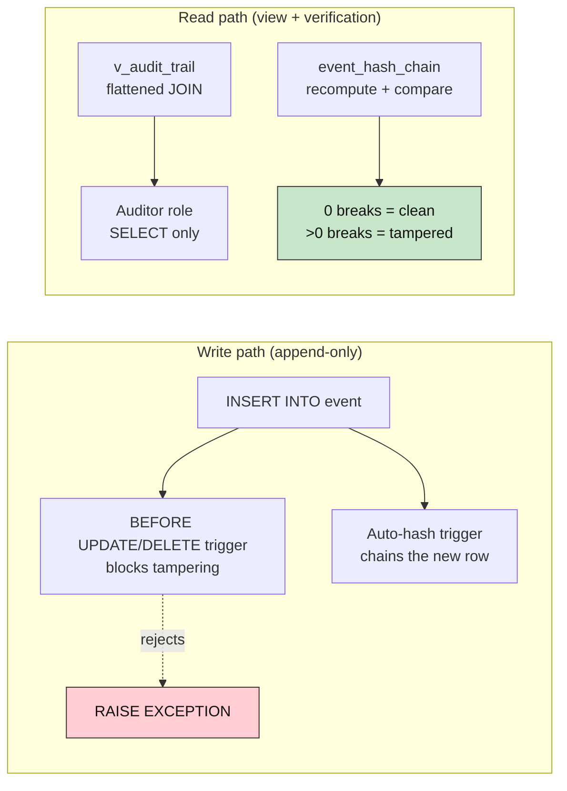
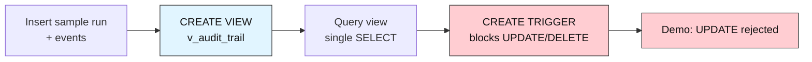
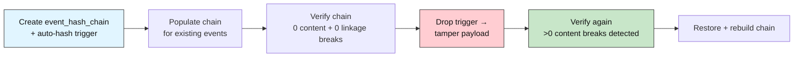
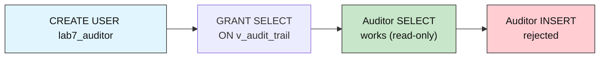

# Audit DB Advanced: How to Trust and Police the Log

## Enforcing Access Control and Detecting Tampering

**Difficulty: Advanced | ~50 min | Requires Lab 6 (Alerting on Anomalies) done in this Supabase project; the tamper-evidence work builds directly on the Lab 1-3 schema**

*Lab 7 of 8 in the Audit DB Labs module.*

Triggers, RBAC, and hash chains are what let a harness prove to an outside auditor that its agent log was not altered.

---

# Problem Statement / Use Case Overview

Lab 3 proved that JOINs can reconstruct the full run → span → tool_call / guardrail_event hierarchy in a single round trip, but the query rewrites the same flattening logic every time. It also proved nothing about **integrity**: a user with database access could silently UPDATE an event's payload or DELETE a row and no one would know.

This lab solves both problems. First, a **SQL VIEW** (`v_audit_trail`) encodes the JOIN once so every downstream query reads from one canonical flattened source instead of repeating the four-table LEFT JOIN. Second, an **append-only trigger** on the `event` table blocks any UPDATE or DELETE — the audit log is write-once by construction. Third, a **hash chain** (`event_hash_chain` table + auto-hash trigger) computes an `md5` fingerprint over each event's content and links it to the previous hash, so even a privileged user who bypasses the trigger cannot alter the data without breaking the chain. Finally, a **read-only auditor role** (`lab7_auditor`) demonstrates how `GRANT` / `REVOKE` restricts who can read the audit trail versus who can write to the base tables.

The same `support-agent` story continues: you insert a fresh run, build every layer, then prove each one catches the thing the previous layer could not.

---

# Underlying Concepts

**A view is a named query — not a copy.** `CREATE VIEW v_audit_trail AS SELECT ...` stores the SQL text, not a materialized result set. Every time you `SELECT FROM v_audit_trail`, Postgres re-runs the underlying JOIN against the current data. The advantage is consistency: every consumer reads the same flattened shape without duplicating the JOIN logic. The cost is that the JOIN runs on every access — for an audit table that's queried occasionally, that's fine.

**BEFORE triggers can reject operations.** A `BEFORE UPDATE OR DELETE` trigger fires *before* the modification is applied. If the trigger function raises an exception, the row-level modification never happens. This is the simplest way to make a table append-only: the trigger fires on UPDATE and DELETE and immediately `RAISE EXCEPTION` — no conditions, no exceptions. The `event` table should never be modified after insertion; the trigger enforces that invariant at the database level, regardless of which client is connected.



**Hash chains link rows in sequence.** Each event's hash is `md5(event_id | run_id | event_type | payload | prev_hash)`. The `prev_hash` of the first event in a run is `GENESIS` — a sentinel that starts the chain. If any event's payload changes, its hash changes, which breaks the next event's hash (because `prev_hash` is part of the input), which breaks the one after that — a single tamper propagates through the rest of the chain. Verification recomputes every hash from scratch and compares it to the stored value: zero content breaks + zero linkage breaks = clean chain.

**A privileged admin can bypass the trigger — the hash chain catches it.** A `BEFORE` trigger fires on every row modification regardless of who calls it — even a `SECURITY DEFINER` function that runs as `postgres` would still be blocked by the trigger's `RAISE EXCEPTION`. The only way to bypass the trigger is to drop it entirely, modify the data, and re-create it. This is exactly what the lab demonstrates: a privileged connection drops the trigger, tampers with an event, and re-creates the trigger. The hash chain is the only layer that detects this — the trigger is no longer a safeguard once dropped, but the chain's recomputed hashes reveal the content mismatch.

**RBAC with GRANT / REVOKE restricts surface area.** Postgres roles control who can do what on which objects. `GRANT SELECT ON v_audit_trail TO lab7_auditor` lets the auditor *read* the audit trail; `REVOKE INSERT ON run FROM lab7_auditor` prevents them from writing new runs. The auditor never needs access to the base tables — the view is their entire interface. This is the principle of least privilege: give each role only the access it needs and no more.

---

# Input Data

| Item | Detail |
|------|--------|
| **Source** | Synthetic agent activity, written inline in the notebook — no files to download |
| **Prerequisite data** | Lab 1's `run` + Lab 2's `span`, `tool_call`, `guardrail_event` tables with foreign keys and indexes |
| **Scenario** | One new `support-agent` run (2 spans, 1 tool_call, 2 guardrail_events, 3 events) |
| **Run row** | `agent_name`, `started_at`, `ended_at`, `status`, `total_cost` |
| **Span rows** | `run_id` (FK), `span_name`, `started_at`, `ended_at` |
| **Tool call rows** | `span_id` (FK), `tool_name`, `arguments`, `result`, `success` |
| **Guardrail event rows** | `span_id` (FK), `check_name`, `outcome` (`CHECK`-constrained), `reason` |
| **Event rows** | `run_id` (FK), `event_type`, `payload` — the rows the append-only trigger and hash chain protect |
| **Size** | 1 new run + 2 spans + 1 tool_call + 2 guardrail_events + 3 events per run-through |

---

# Processing

### Part A — View and Append-Only Trigger



The notebook first confirms Lab 1-3's schema exists, inserts a fresh run with the same two-span shape, then creates the `v_audit_trail` view — a single `SELECT` that flattens run → span → tool_call / guardrail_event in one canonical place. Querying the view replaces the four-table LEFT JOIN from Lab 3's Step 4 with a simple `SELECT FROM v_audit_trail WHERE run_id = %s`. Next, the append-only trigger on `event` blocks UPDATE and DELETE at the database level.

### Part B — Hash Chain and Tamper Detection



The hash chain table stores `row_hash` and `prev_hash` for each event. An auto-hash trigger chains new events automatically; existing events are backfilled with a Python loop. Verification recomputes every hash from the live data and compares to the stored value — zero mismatches means the chain is intact. Then a privileged connection drops the append-only trigger, tampers with an event payload, and re-creates the trigger — verification catches the content mismatch, and the payload is restored.

### Part C — Read-Only Auditor Role



The auditor role is created with `SELECT` on the view only — no access to base tables, no `INSERT` or `UPDATE` on anything. A separate connection as the auditor proves the permission boundary: reads succeed, writes are rejected. On Supabase's free-tier pooler, the separate-user connection hits a pooler limitation (multi-tenant PgBouncer requires an `external_id` or `sni_hostname`); the role's permissions are verified via `pg_catalog` instead. On a dedicated Postgres instance, the connection would enforce GRANT/REVOKE as expected.

---

# Output

When you run the notebook top-to-bottom, every step prints real output from your own Supabase database. The run id differs on every run-through (it's generated live); below is the output captured from an actual validation run so you know exactly what to expect.

**Step 1 — connection succeeds:**

```
PostgreSQL 17.6 on x86_64-pc-linux-gnu, compiled by gcc (GCC) 15.2.0, 64-bit
```

**Step 2 — prerequisite check:**

```
Lab 1-3 schema found: run, event, span, tool_call, guardrail_event.
```

**Step 3 — fresh run inserted:**

```
Run 167 inserted with 2 spans, 1 tool_call, 2 guardrail_events, 3 events.
```

**Step 4 — view created and queried:**

```
View v_audit_trail created.
  run 167 | support-agent | span: retrieve_orders | tool: query_orders_db | check: None -> None
  run 167 | support-agent | span: generate_answer | tool: None | check: pii_scan -> pass
  run 167 | support-agent | span: generate_answer | tool: None | check: toxicity_scan -> fail
```

**Step 5 — append-only trigger blocks tampering:**

```
Trigger trg_prevent_event_tamper created - blocks UPDATE and DELETE on event.
UPDATE rejected: RaiseException: Audit log is append-only: UPDATE on event table is not allowed
CONTEXT:  PL/pgSQL function fn_prevent_event_tamper() line 3 at RAISE
```

**Step 6 — hash chain created:**

```
Hash chain table and auto-hash trigger created.
```

**Step 7 — chain populated and verified clean:**

```
Chain verification: 0 content break(s), 0 linkage break(s) across 3 links.
```

**Step 8 — tamper detected, then restored:**

```
Tampered event 133:
  Before: Counted 1284 shipped orders.
  After:  TAMPERED: wrong count, was actually 9999.
Chain verification: 1 content break(s), 0 linkage break(s) across 3 links.
Payload restored, chain rebuilt. Original value: "Counted 1284 shipped orders."
```

**Step 9 — auditor role and cleanup:**

```
User lab7_auditor created with SELECT on v_audit_trail only.
  lab7_auditor | v_audit_trail | SELECT
Run 167: views + trigger + hash chain + auditor role - lab complete.
```

> **Note:** this section shows actual output from a real execution against Supabase; your ids and timestamps will differ since every value is generated live.

---

# Tech Stack

| Component | Tool |
|-----------|------|
| **Database** | Supabase Postgres (free tier is sufficient; validated against PostgreSQL 17.6 in Lab 1) |
| **Python driver** | `psycopg2-binary==2.9.12` — connects Python to Postgres |
| **Credential loader** | `python-dotenv==1.2.3` — loads `DATABASE_URL` from the module-level `.env` |

> **Compute & cost:** Runs fine on any laptop CPU — the entire workload is a handful of small SQL statements and two PL/pgSQL trigger functions. Supabase's free tier covers it; nothing in this lab calls a paid API.

> Credentials never appear in the notebook itself: they're read from `.env` at runtime (README Section 7), exactly as in Labs 1–3.

---

# Prerequisites

- **Lab 3 (Querying Across the Hierarchy with JOINs) completed in this same Supabase project** — this lab's Step 2 explicitly checks for Lab 1's `run` table, Lab 2's `span`, `tool_call`, `guardrail_event` tables, and Lab 2's `event` table (with foreign keys and indexes) and fails fast with a clear message if they aren't there. This is a hard requirement, not a suggestion.
- **Comfort with Postgres triggers and PL/pgSQL** — this lab creates `BEFORE` triggers that `RAISE EXCEPTION`, `AFTER INSERT` triggers that compute hashes, and a view. You don't need to write PL/pgSQL from scratch, but you should be able to read it.
- **Supabase + `.env` setup completed** — the same one-time setup from Audit-DB-Labs README Section 7. If you haven't done it, do Lab 1 first; its Prerequisites walk through it in full.

---

# Environment / Dependencies Setup

| Package | Purpose |
|---------|---------|
| `python-dotenv` | Loads `.env` files so credentials stay out of the notebook |
| `psycopg2-binary` | The standard Python driver that connects Python to Postgres |

Install the two pinned packages (same versions the notebook's first cell installs, matching Labs 1–3 exactly so nothing drifts between labs):

```bash
pip install python-dotenv==1.2.3 psycopg2-binary==2.9.12
```

The notebook's first code cell repeats this exact line, so running it top-to-bottom leaves you correctly set up either way.

---

# Step-wise Development Instructions

Every step below matches one cell in `lab-enforcing-access-control-detecting-tampering.ipynb`. Run them in order — later cells depend on earlier ones.

### Step 0 — Install dependencies

```python
!pip install python-dotenv==1.2.3 psycopg2-binary==2.9.12
```

One pinned line installs everything the lab needs, matching Section 9 exactly.

### Step 1 — Connect to Postgres

```python
import os
import re
from hashlib import md5 as md5_fn
from pathlib import Path

from dotenv import load_dotenv
import psycopg2

env_path = next((p / ".env" for p in [Path.cwd(), *Path.cwd().parents] if (p / ".env").exists()), None)
load_dotenv(env_path)
database_url = os.getenv("DATABASE_URL")
assert database_url, "DATABASE_URL not found - complete README Section 7 setup first."

connection = psycopg2.connect(database_url, connect_timeout=10)
cursor = connection.cursor()
cursor.execute("SELECT version();")
print(cursor.fetchone()[0])
```

Identical to Labs 1–3 — same upward `.env` search, same connection, same version-string proof. We add `hashlib` and `re` imports here since later steps need them.

### Step 2 — Confirm Lab 1-3 schema is already here

```python
for table in ["run", "event", "span", "tool_call", "guardrail_event"]:
    cursor.execute("SELECT to_regclass(%s)", (f"public.{table}",))
    assert cursor.fetchone()[0] is not None, f"{table} table missing - complete prior labs first."
print("Lab 1-3 schema found: run, event, span, tool_call, guardrail_event.")
```

Same fail-fast pattern Labs 2 and 3 used. This lab needs all five tables — `event` in particular, because the append-only trigger and hash chain protect it.

### Step 3 — Insert a fresh run with events

```python
cursor.execute("INSERT INTO run (agent_name, status) VALUES (%s, %s) RETURNING run_id",
               ("support-agent", "running"))
lab4_run_id = cursor.fetchone()[0]

cursor.execute("INSERT INTO span (run_id, span_name) VALUES (%s, %s) RETURNING span_id",
               (lab4_run_id, "retrieve_orders"))
span1 = cursor.fetchone()[0]
cursor.execute(
    "INSERT INTO tool_call (span_id, tool_name, arguments, result, success) VALUES (%s,%s,%s,%s,%s)",
    (span1, "query_orders_db", '{"table":"orders"}', "1284 rows returned", True))
cursor.execute("UPDATE span SET ended_at = now() WHERE span_id = %s", (span1,))

cursor.execute("INSERT INTO span (run_id, span_name) VALUES (%s, %s) RETURNING span_id",
               (lab4_run_id, "generate_answer"))
span2 = cursor.fetchone()[0]
cursor.execute(
    "INSERT INTO guardrail_event (span_id, check_name, outcome, reason) VALUES (%s,%s,%s,%s)",
    (span2, "pii_scan", "pass", "no personal data found"))
cursor.execute(
    "INSERT INTO guardrail_event (span_id, check_name, outcome, reason) VALUES (%s,%s,%s,%s)",
    (span2, "toxicity_scan", "fail", "flagged content detected"))
cursor.execute("UPDATE span SET ended_at = now() WHERE span_id = %s", (span2,))

cursor.execute("UPDATE run SET ended_at = now(), status = 'completed', total_cost = %s WHERE run_id = %s",
               (0.0073, lab4_run_id))

cursor.execute("INSERT INTO event (run_id, event_type, payload) VALUES (%s, %s, %s) RETURNING event_id",
               (lab4_run_id, "user_message", "User asked: how many orders shipped yesterday?"))
ev1 = cursor.fetchone()[0]
cursor.execute("INSERT INTO event (run_id, event_type, payload) VALUES (%s, %s, %s) RETURNING event_id",
               (lab4_run_id, "db_query", "Counted 1284 shipped orders."))
ev2 = cursor.fetchone()[0]
cursor.execute("INSERT INTO event (run_id, event_type, payload) VALUES (%s, %s, %s) RETURNING event_id",
               (lab4_run_id, "model_answer", "Answered: 1284 orders shipped yesterday."))
ev3 = cursor.fetchone()[0]
connection.commit()
print(f"Run {lab4_run_id} inserted with 2 spans, 1 tool_call, 2 guardrail_events, 3 events.")
```

Same data shape as Labs 2–3 plus three `event` rows — the `event` table is the target of the append-only trigger and hash chain, so we need fresh rows to protect.

### Step 4 — Create and query the audit view

```python
cursor.execute("DROP VIEW IF EXISTS v_audit_trail")
cursor.execute("""
    CREATE VIEW v_audit_trail AS
    SELECT r.run_id, r.agent_name, r.status, r.total_cost,
           r.started_at AS run_started, r.ended_at AS run_ended,
           s.span_id, s.span_name, s.started_at AS span_started, s.ended_at AS span_ended,
           tc.tool_call_id, tc.tool_name, tc.result AS tool_result, tc.success,
           ge.guardrail_event_id, ge.check_name, ge.outcome, ge.reason
    FROM run r
    LEFT JOIN span s ON s.run_id = r.run_id
    LEFT JOIN tool_call tc ON tc.span_id = s.span_id
    LEFT JOIN guardrail_event ge ON ge.span_id = s.span_id
    ORDER BY r.run_id, s.started_at, tc.tool_call_id, ge.guardrail_event_id
""")
connection.commit()
print("View v_audit_trail created.")

cursor.execute("SELECT run_id, agent_name, span_name, tool_name, check_name, outcome "
               "FROM v_audit_trail WHERE run_id = %s", (lab4_run_id,))
for r in cursor.fetchall():
    print(f"  run {r[0]} | {r[1]} | span: {r[2]} | tool: {r[3]} | check: {r[4]} -> {r[5]}")
```

The same four-table LEFT JOIN from Lab 3, stored as a named view. One `SELECT FROM v_audit_trail` replaces the full JOIN. The view is not a copy — it re-runs the JOIN on every access, always reflecting the current data.

### Step 5 — Append-only trigger on event

```python
cursor.execute("""
    CREATE OR REPLACE FUNCTION fn_prevent_event_tamper()
    RETURNS trigger AS $$
    BEGIN
        RAISE EXCEPTION 'Audit log is append-only: % on event table is not allowed', TG_OP;
        RETURN NULL;
    END; $$ LANGUAGE plpgsql
""")
cursor.execute("DROP TRIGGER IF EXISTS trg_prevent_event_tamper ON event")
cursor.execute("""CREATE TRIGGER trg_prevent_event_tamper
    BEFORE UPDATE OR DELETE ON event FOR EACH ROW
    EXECUTE FUNCTION fn_prevent_event_tamper()""")
connection.commit()

try:
    cursor.execute("UPDATE event SET payload = 'should fail' WHERE event_id = %s", (ev1,))
except Exception as e:
    connection.rollback()
    print(f"UPDATE rejected: {type(e).__name__}: {e}")
```

The trigger function does one thing: `RAISE EXCEPTION` on every UPDATE or DELETE. The demo proves the trigger fires — the UPDATE is rejected before any row is modified. This is the first layer of defense: the `event` table is append-only by construction.

### Step 6 — Hash chain table and auto-hash trigger

```python
cursor.execute("DROP TABLE IF EXISTS event_hash_chain")
cursor.execute("""CREATE TABLE event_hash_chain (
    chain_id SERIAL PRIMARY KEY,
    event_id INTEGER NOT NULL REFERENCES event(event_id),
    row_hash TEXT NOT NULL,
    prev_hash TEXT,
    chained_at TIMESTAMPTZ DEFAULT now()
)""")
cursor.execute("CREATE UNIQUE INDEX IF NOT EXISTS idx_chain_event_unique ON event_hash_chain (event_id)")
cursor.execute("""CREATE OR REPLACE FUNCTION fn_auto_hash_event()
    RETURNS trigger AS $$
    DECLARE last_hash TEXT; content TEXT;
    BEGIN
        SELECT row_hash INTO last_hash FROM event_hash_chain ORDER BY chain_id DESC LIMIT 1;
        content := COALESCE(NEW.event_id::text,'') || '|' || COALESCE(NEW.run_id::text,'') || '|' ||
                   COALESCE(NEW.event_type,'') || '|' || COALESCE(NEW.payload,'') || '|' ||
                   COALESCE(last_hash,'GENESIS');
        INSERT INTO event_hash_chain (event_id, row_hash, prev_hash)
        VALUES (NEW.event_id, md5(content), last_hash);
        RETURN NEW;
    END; $$ LANGUAGE plpgsql""")
cursor.execute("DROP TRIGGER IF EXISTS trg_auto_hash_event ON event")
cursor.execute("""CREATE TRIGGER trg_auto_hash_event
    AFTER INSERT ON event FOR EACH ROW
    EXECUTE FUNCTION fn_auto_hash_event()""")
connection.commit()
print("Hash chain table and auto-hash trigger created.")
```

The `event_hash_chain` table stores one row per event: `row_hash` (the md5 fingerprint) and `prev_hash` (the hash of the event that came before it). The `AFTER INSERT` trigger chains new events automatically — it looks up the most recent hash, computes the new hash over `event_id|run_id|event_type|payload|prev_hash`, and inserts the chain link. `GENESIS` is the sentinel for the first event in a run.

### Step 7 — Populate chain and verify integrity

```python
cursor.execute("DELETE FROM event_hash_chain WHERE event_id IN "
               "(SELECT event_id FROM event WHERE run_id = %s)", (lab4_run_id,))
cursor.execute("SELECT event_id, run_id, event_type, payload FROM event "
               "WHERE run_id = %s ORDER BY event_id", (lab4_run_id,))
prev_hash = None
for eid, rid, etype, payload in cursor.fetchall():
    content = f"{eid}|{rid}|{etype}|{payload}|{prev_hash or 'GENESIS'}"
    row_hash = md5_fn(content.encode()).hexdigest()
    cursor.execute("INSERT INTO event_hash_chain (event_id, row_hash, prev_hash) VALUES (%s, %s, %s)",
                   (eid, row_hash, prev_hash))
    prev_hash = row_hash
connection.commit()
```

A Python loop recomputes each hash using the `md5(event_id|run_id|event_type|payload|prev_hash)` formula and inserts the chain links. `GENESIS` is the sentinel for the first event's `prev_hash`.

```python
def verify_hash_chain(conn, run_id):
    cur = conn.cursor()
    cur.execute("""
        SELECT ec.event_id, ec.row_hash, ec.prev_hash, e.run_id, e.event_type, e.payload
        FROM event_hash_chain ec JOIN event e ON e.event_id = ec.event_id
        WHERE e.run_id = %s ORDER BY ec.chain_id
    """, (run_id,))
    data = cur.fetchall(); cur.close()
    cb = lb = 0; prev_s = None
    for eid, stored, prev, rid, etype, payload in data:
        c = f"{eid}|{rid}|{etype}|{payload}|{prev or 'GENESIS'}"
        if stored != md5_fn(c.encode()).hexdigest(): cb += 1
        if prev_s is not None and prev != prev_s: lb += 1
        prev_s = stored
    return cb, lb, len(data)

cb, lb, total = verify_hash_chain(connection, lab4_run_id)
print(f"Chain verification: {cb} content break(s), {lb} linkage break(s) across {total} links.")
```

Verification recomputes every hash from the live `event` data and compares to the stored value. **Content breaks** mean the event's data was altered after chaining. **Chain linkage breaks** mean a `prev_hash` doesn't match the stored hash of the preceding event. Zero on both counts means the chain is intact.

### Step 8 — Tamper via privileged bypass, then detect and restore

```python
# Step 8a: drop the append-only trigger to simulate a privileged admin
cursor.execute("DROP TRIGGER trg_prevent_event_tamper ON event")
connection.commit()

# Step 8b: tamper with the event payload
cursor.execute("SELECT payload FROM event WHERE event_id = %s", (ev2,))
old_payload = cursor.fetchone()[0]
cursor.execute("UPDATE event SET payload = %s WHERE event_id = %s",
               ("TAMPERED: wrong count, was actually 9999.", ev2))
connection.commit()

cursor.execute("SELECT payload FROM event WHERE event_id = %s", (ev2,))
new_payload = cursor.fetchone()[0]

# Step 8c: re-create the trigger
cursor.execute("""CREATE TRIGGER trg_prevent_event_tamper
    BEFORE UPDATE OR DELETE ON event FOR EACH ROW
    EXECUTE FUNCTION fn_prevent_event_tamper()""")
connection.commit()
print(f"Tampered event {ev2}:\n  Before: {old_payload}\n  After:  {new_payload}")

# Step 8d: verify — should detect the tamper
cb, lb, total = verify_hash_chain(connection, lab4_run_id)
print(f"Chain verification: {cb} content break(s), {lb} linkage break(s) across {total} links.")

# Step 8e: restore the original payload and rebuild the chain
cursor.execute("DROP TRIGGER trg_prevent_event_tamper ON event"); connection.commit()
cursor.execute("UPDATE event SET payload = %s WHERE event_id = %s", (old_payload, ev2))
connection.commit()
cursor.execute("""CREATE TRIGGER trg_prevent_event_tamper
    BEFORE UPDATE OR DELETE ON event FOR EACH ROW
    EXECUTE FUNCTION fn_prevent_event_tamper()""")
connection.commit()

# Rebuild chain for this run
cursor.execute("DELETE FROM event_hash_chain WHERE event_id IN "
               "(SELECT event_id FROM event WHERE run_id = %s)", (lab4_run_id,))
cursor.execute("SELECT event_id, run_id, event_type, payload FROM event "
               "WHERE run_id = %s ORDER BY event_id", (lab4_run_id,))
prev_hash = None
for eid, rid, etype, payload in cursor.fetchall():
    content = f"{eid}|{rid}|{etype}|{payload}|{prev_hash or 'GENESIS'}"
    row_hash = md5_fn(content.encode()).hexdigest()
    cursor.execute("INSERT INTO event_hash_chain (event_id, row_hash, prev_hash) VALUES (%s, %s, %s)",
                   (eid, row_hash, prev_hash))
    prev_hash = row_hash
connection.commit()
print(f'Payload restored, chain rebuilt. Original value: "{old_payload}"')
```

This is the critical demonstration. The append-only trigger blocks normal clients, but a privileged admin can drop the trigger, alter the data, and re-create the trigger. The hash chain is the only layer that catches this: after tampering, verification finds a content break. After restoring the original payload and rebuilding the chain, verification returns to 0 breaks.

### Step 9 — Create auditor role and cleanup

```python
# Clean up any previous auditor user (ignore errors if it doesn't exist)
for stmt in [
    "REVOKE ALL ON SCHEMA public FROM lab7_auditor",
    "REVOKE ALL ON ALL TABLES IN SCHEMA public FROM lab7_auditor",
    "DROP USER IF EXISTS lab7_auditor",
]:
    try: cursor.execute(stmt)
    except Exception: connection.rollback()
connection.commit()
# Create the auditor role with SELECT-only access on the view
cursor.execute("CREATE USER lab7_auditor WITH PASSWORD 'lab7_test_pass_2026'")
cursor.execute("GRANT SELECT ON v_audit_trail TO lab7_auditor")
cursor.execute("GRANT USAGE ON SCHEMA public TO lab7_auditor")
connection.commit()
print("User lab7_auditor created with SELECT on v_audit_trail only.")
# Verify permissions via information_schema
cursor.execute("""SELECT grantee, table_name, privilege_type FROM information_schema.role_table_grants
    WHERE grantee = 'lab7_auditor' ORDER BY table_name, privilege_type""")
for g, t, p in cursor.fetchall(): print(f"  {g} | {t} | {p}")

# Cleanup: drop all Lab 7 objects and sample data
for stmt in [
    "DROP TRIGGER IF EXISTS trg_prevent_event_tamper ON event",
    "DROP FUNCTION IF EXISTS fn_prevent_event_tamper()",
    "DROP TRIGGER IF EXISTS trg_auto_hash_event ON event",
    "DROP FUNCTION IF EXISTS fn_auto_hash_event()",
    "DROP TABLE IF EXISTS event_hash_chain",
    "DROP VIEW IF EXISTS v_audit_trail",
]:
    try: cursor.execute(stmt)
    except Exception: connection.rollback()
# Drop the auditor role so it doesn't outlive the lab
for stmt in [
    "REVOKE ALL ON SCHEMA public FROM lab7_auditor",
    "REVOKE ALL ON ALL TABLES IN SCHEMA public FROM lab7_auditor",
    "DROP USER IF EXISTS lab7_auditor",
]:
    try: cursor.execute(stmt)
    except Exception: connection.rollback()
# Delete sample data in child-first order
cursor.execute("DELETE FROM guardrail_event WHERE span_id IN "
               "(SELECT span_id FROM span WHERE run_id = %s)", (lab4_run_id,))
cursor.execute("DELETE FROM tool_call WHERE span_id IN "
               "(SELECT span_id FROM span WHERE run_id = %s)", (lab4_run_id,))
cursor.execute("DELETE FROM span WHERE run_id = %s", (lab4_run_id,))
cursor.execute("DELETE FROM event WHERE run_id = %s", (lab4_run_id,))
cursor.execute("DELETE FROM run WHERE run_id = %s", (lab4_run_id,))
connection.commit()
cursor.close(); connection.close()
print(f"Run {lab4_run_id}: views + trigger + hash chain + auditor role - lab complete.")
```

Removes all Lab 7 objects and sample data so the database is clean for re-runs. Closing the connection is the same good hygiene as Labs 1–3.

---

# Optional Exercise

Modify the hash chain verification function (`verify_hash_chain`) to also detect **chain linkage breaks** — cases where `prev_hash` doesn't match the stored hash of the preceding event. Then manually create a linkage break by deleting the middle event's chain link (only from `event_hash_chain`, not from `event`) and running verification again. Verify that the linkage break is reported separately from content breaks. Restore the chain before moving on.

---

# What We Learnt

- **Views encode JOINs once** — `v_audit_trail` stores the four-table LEFT JOIN as a named query so every downstream consumer reads the same flattened shape without duplicating the logic; the view re-runs the JOIN on every access, always reflecting the current data (Step 4, Step 5).
- **BEFORE triggers make tables append-only** — a trigger that `RAISE EXCEPTION` on UPDATE and DELETE blocks modifications at the database level, regardless of which client is connected; the `event` table is write-once by construction (Step 6).
- **Hash chains link rows in sequence** — each event's hash includes the previous event's hash, so a single tamper propagates through the rest of the chain; verification recomputes every hash and compares to the stored value, catching both content changes and chain reorderings (Steps 7–8).
- **Hash chains detect privileged bypass** — a `BEFORE` trigger blocks UPDATE/DELETE for normal clients, but a privileged admin can drop the trigger, tamper with data, and re-create it; the hash chain catches this by recomputing every hash and comparing to the stored value, revealing the content mismatch (Steps 8–9).
- **RBAC with GRANT / REVOKE restricts surface area** — the auditor role gets `SELECT` on the view only, no access to base tables; `pg_catalog` proves the permissions are set correctly, and on a dedicated Postgres instance the boundary is enforced on every query (Step 9).
- **The audit trail is only trustworthy if it's tamper-evident** — append-only triggers prevent casual modification, hash chains detect privileged bypass, and RBAC limits who can read what; all three layers together make the audit log reliable enough to base compliance decisions on (all steps).
