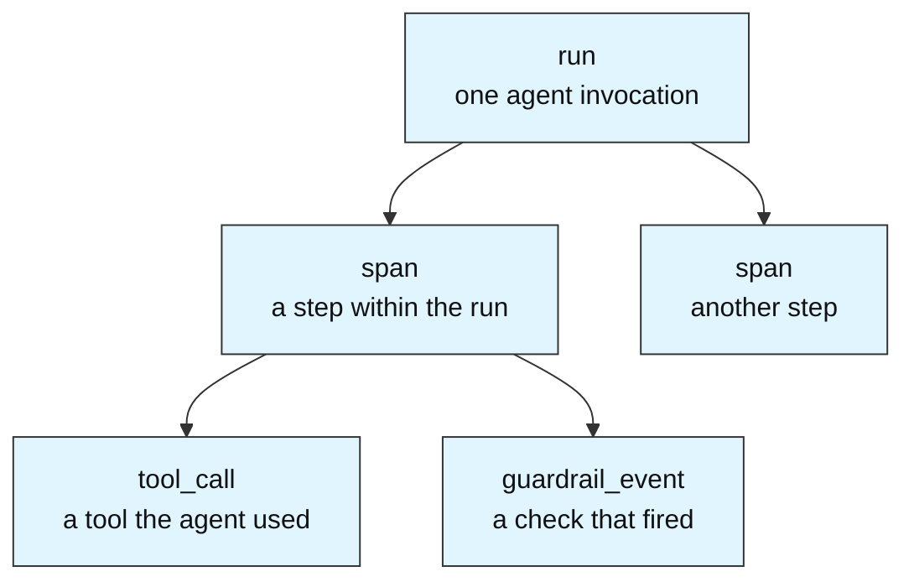
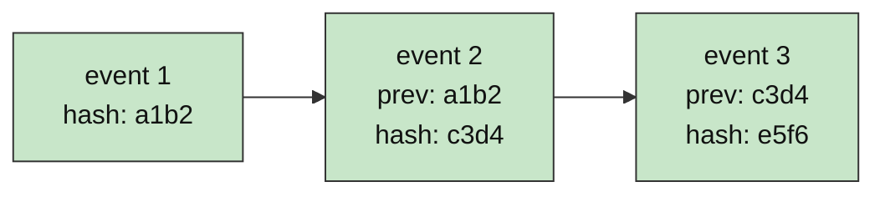
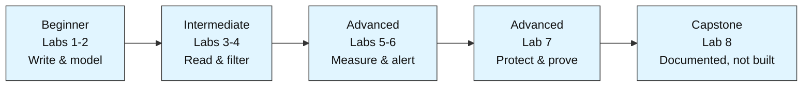

# Audit DB Labs — Foundations to the Harness Audit Layer

This module teaches how to build an **audit database** from first principles through seven hands-on labs, all built around one consistent domain — the activity log of an AI agent harness — so every lab reinforces the same story instead of jumping between unrelated examples. An eighth, capstone lab is documented in the roadmap below but intentionally not built for now; that's where the module's real end goal — wiring the audit database into a live AI harness — is reserved for later.

All seven built labs run against a real, cloud-hosted **Supabase Postgres** database rather than a local install or a mock. This README first explains what an audit database is and why it's built the way it is, then walks through setting up the Supabase environment, and finally lays out how the labs are organized. Read it fully before opening Lab 1.

---

## 1. What Is an Audit Database?

An audit database is an ordinary database put to a specific job: **recording what a system did, as an ongoing, permanent history.** It doesn't hold the *current state* of an application the way a normal app database does — it holds the *record of events* that produced that state.

The distinction matters. A normal database answers "what is true right now?" — how many students are enrolled, what's the account balance. An audit database answers "what happened, when, and in what order?" — who changed the balance, at what time, from what value to what value, and whether it succeeded.

> **In one line:** a normal database is the current photo; an audit database is the entire film reel that led to it.

### 1.1 Why an AI Harness Needs One

An **AI harness** is the scaffolding around a language model — the code that assembles context, routes tool calls, applies guardrails, retries on failure, and returns a result. When an agent runs, a lot happens that nobody can see directly: which tools it called, what it sent to the model, what came back, how much it cost, whether a guardrail blocked something, how long each step took.

If none of that is recorded, the harness is a black box. You can't debug a bad run, prove to a compliance reviewer what the agent did, measure cost, or detect an attack. The **audit database is the layer that makes the harness observable and accountable.** That is the concrete thing this module builds toward.

### 1.2 What Problem It Actually Solves

The core job is trustworthy history. That imposes one unusual constraint that shapes every design decision in this module: an audit record, once written, is **append-only** — you add new events, but you do not go back and quietly edit or delete old ones. A history you can silently rewrite is not an audit trail; it's just a log. Section 3 explains how this constraint drives the schema, and exactly what it does and doesn't cover.

---

## 2. Core Building Blocks

Postgres is a **relational database**: data lives in **tables** made of **rows** and **columns**, and tables link to each other through **keys**. Everything in this module fits into one hierarchy that mirrors how an agent actually runs.



### 2.1 Run

A **run** is one top-level invocation of the agent — a single "the user asked something, the agent did its work, and returned an answer" cycle. Its row is created when the run starts and carries the overall metadata: when it started, when it ended, total cost, final status. See Section 3 for how a run's own lifecycle fields differ from the append-only rule that governs everything under it.

### 2.2 Span

A **span** is one step inside a run — a unit of work with its own start and end. One run contains many spans, the same way one function call contains many sub-steps. Spans are what let you reconstruct the *sequence* of what the agent did.

### 2.3 Tool Call

A **tool_call** records the agent using a tool — a web search, a database query, a calculation. It captures what was requested, what came back, and how long it took.

### 2.4 Guardrail Event

A **guardrail_event** records a safety or policy check firing — a blocked request, a redacted field, a flagged injection attempt. For an *audit* database specifically, these are among the most important rows in the system.

### 2.5 The Primary Key

Every row gets a unique **primary key** — a permanent identifier for that one record. Child rows point back to their parent through a **foreign key** (a span stores the `run_id` it belongs to). This is how the hierarchy above is physically wired together, and Lab 2 builds it directly.

### 2.6 Timestamps Are Not Optional

In a normal database a timestamp is a nice-to-have. In an audit database it is the backbone: every row records *when* it happened, because the entire value of the log is the ability to place events in order and in time.

---

## 3. Why Append-Only Changes Everything

A normal database freely uses `UPDATE` and `DELETE` — you edit a student's grade, you remove a graduated record. An audit database deliberately restricts both, because the whole point is a history that can be trusted not to have been rewritten.

**Append-only applies to what happened, not to a run's own lifecycle bookkeeping.** The `run` row is created the moment a run starts and is allowed exactly one further write — setting its `ended_at`, `status`, and `total_cost` once the run finishes. That's not rewriting history; the run genuinely wasn't finished yet, so there was nothing to misrepresent. What append-only actually protects are the **event** tables underneath it — `span`, `tool_call`, and `guardrail_event` rows. Once one of those is written, it is never silently updated or deleted, because each one already describes something that fully happened. The only other exception is redaction (Section 3.2) — and even that is required to log the fact that it happened, so it's a controlled, visible exception rather than a silent edit. This is why the storage layer can answer both "what is this run doing right now" (read the run row) and "prove nothing in this run's history was rewritten" (every change to an event row is itself on the record) at the same time.

### 3.1 Corrections Instead of Edits

If a record was logged wrong, you don't overwrite it. You write a *new* record that corrects or supersedes it, leaving the original visible. The mistake stays part of the history — which is exactly what an auditor needs to see.

### 3.2 Redaction Instead of Deletion

Sensitive data is a deliberate, narrow exception to "event rows never change" — and it's an exception with a rule, not a loophole. If sensitive data (a password, a personal detail) was captured in an event's payload, you don't delete the row, and you don't quietly overwrite the field either: you perform a scoped redaction — replacing just that field's contents — **and** you insert a new event row recording that the redaction happened (which event, which field, when). The original row's existence, its timestamp, and the fact that it once held that data are never hidden; only the sensitive contents are removed, and removing them is itself part of the permanent history. Lab 1 demonstrates this pattern.

### 3.3 Tamper-Evidence

The strongest form of this idea: chain records together cryptographically, so that each row includes a hash of the one before it. Change any past row and every hash after it breaks — making tampering *detectable* even if someone has write access. Lab 7 builds this hash-chain.



---

## 4. Key Concepts Used Across the Labs

### 4.1 Transactions

A **transaction** groups several writes so they all succeed or all fail together — never half-applied. When the harness logs a run plus its spans, a transaction guarantees you never end up with a run that's missing half its steps. Lab 1 introduces this.

### 4.2 Foreign Keys & Constraints

**Foreign keys** enforce that a span can't point to a run that doesn't exist. **Constraints** (`NOT NULL`, `CHECK`) enforce that required fields are present and values are valid — a status can only be one of the allowed words, a cost can't be negative. Lab 2 applies these to make the schema self-protecting.

### 4.3 Joins

Data split across `run`, `span`, and `tool_call` tables is recombined with a **JOIN** — the operation that reconstructs a full trace from its separate pieces. Lab 3 is built on this.

### 4.4 Aggregation & Window Functions

**Aggregation** (`GROUP BY`, `COUNT`, `SUM`, `AVG`) rolls many rows into summaries — total cost per run, average latency per tool. **Window functions** compute across ordered rows without collapsing them — useful for spotting a retry that fired three times in a row. Lab 3 introduces both; Lab 5 uses them to build standing metrics.

### 4.4a Filtering, Search & Pagination

A real audit log grows without bound, so you almost never want *all* of it — you want a slice: only failed runs, only the last 24 hours, only calls that cost more than a threshold, only payloads containing a certain string. **Filtering** (`WHERE` with time windows, ranges, and categories), **text search** (`ILIKE`, full-text), and **pagination** (`LIMIT`/`OFFSET` and keyset paging) are how you turn an unbounded log into a readable answer. Lab 4 is built entirely on this.

### 4.5 Indexing

An **index** lets Postgres find matching rows without scanning the whole table, the same role an index plays at the back of a book. Audit tables grow fast, so the right index is the difference between a millisecond query and a multi-second one. Lab 2 introduces indexing; Lab 3 uses `EXPLAIN` to see it working.

### 4.6 Views & Materialized Views

A **view** is a saved query you can treat like a table — ideal for packaging an audit check ("all guardrail blocks in the last hour") so a dashboard can read it by name instead of re-writing the SQL. A **materialized view** goes further: it stores the computed result on disk and refreshes on demand, so an expensive metric over millions of rows is paid for once, not on every dashboard load. Lab 5 builds both to turn raw events into metrics.

### 4.7 Thresholds & Anomaly Detection

An **alert** is just a filter over a metric that returns rows only when something is wrong — an error rate above a limit, a cost per run beyond its usual band, a retry count that spikes. Expressing "what counts as a problem" as a query is the audit-DB half of an alerting pipeline. Lab 6 covers this.

### 4.8 Triggers & Roles

A **trigger** runs code automatically on write — used in Lab 7 to enforce append-only at the database level, so the rule holds even against someone with direct table access. **Roles** (RBAC) control who can read versus write the log — an auditor who can read everything but change nothing. Lab 7 covers both, alongside the hash-chain tamper-evidence from Section 3.3.

---

## 5. Postgres vs. a Document Database

If you've used a document database before, this table maps the two worlds:

| Aspect | Document database (document) | Postgres (relational) |
|---|---|---|
| Basic unit of data | A document in a collection | A row in a table |
| Schema | Flexible — documents can differ | Fixed — every row has the same columns |
| How related data connects | Embedding or referencing | Foreign keys + JOINs |
| Query language | JSON-style filters | SQL |
| Best fit for audit logs | Workable | Excellent — rigid structure + strong constraints + mature transactions |

An audit log is *naturally* uniform and relational — every event has the same core fields, and integrity matters more than shape-flexibility. That's precisely the case where a relational database like Postgres is the stronger default.

---

## 6. Glossary

| Term | Meaning |
|---|---|
| Audit database | A database that records what a system did, as permanent history |
| Run | One top-level agent invocation |
| Span | One step within a run |
| Tool call | A record of the agent using a tool |
| Guardrail event | A record of a safety/policy check firing |
| Append-only | Event rows (spans, tool calls, guardrail events) are added, never silently edited or deleted once written; the only exceptions are a run's own header row (one lifecycle update, when it completes) and a scoped, self-logging redaction of a field (Section 3.2) |
| Redaction | Blanking a field's contents while keeping the row — with the redaction itself recorded as a new event, so the fact it happened is never hidden |
| Primary key | A row's unique, permanent identifier |
| Foreign key | A field linking a row to its parent row |
| Transaction | A group of writes that all succeed or all fail together |
| Constraint | A rule the database enforces on a column (`NOT NULL`, `CHECK`) |
| JOIN | Recombining data split across tables |
| Index | A lookup structure that speeds up queries |
| View | A saved query treated like a table |
| Trigger | Code the database runs automatically on write |
| Hash chain | Rows linked by hashes so tampering is detectable |

---

## 7. Environment Setup — Required Before You Start

Now that you know what an audit database is, here's how to get a real Postgres running before opening Lab 1. **Do this in this exact order** — none of the notebooks will run without it, and each step depends on the one before it.

**Step 1 — Create a free Supabase account.**
Go to `supabase.com` and sign up. No credit card required.

**Step 2 — Create a project.**
Click **New Project**, give it a name (e.g. `agent-audit-db`), and set a **database password**. **Save that password immediately, somewhere durable** — you'll need it in Step 4, and it's the password for your database. Pick a region close to you. The project takes a minute or two to provision.

**Step 3 — Open the connection panel.**
Click the green **Connect** button (top of the dashboard, next to your project name) — not Project Settings. That opens a "Connect to your project" panel with several tabs: Framework, Server, **Direct Connection**, ORM, MCP. Click the **Direct Connection** tab (it means "give me a raw connection string," not the client-library tabs).

**Watch for a naming collision here.** Inside that same "Direct Connection" tab, you'll then see three *connection mode* options, and confusingly one of them is also called "Direct connection":
- **Direct connection** (radio option) — needs IPv6, or a paid IPv4 add-on. Skip this unless you know your network has IPv6.
- **Transaction pooler** — for stateless, one-shot serverless calls. Not what a notebook needs.
- **Session pooler** — the one to pick. It works over plain IPv4 with no add-on, and holds a connection open the way a notebook running many cells needs.

Set **Type** to **Python**.

**Step 4 — Get your connection details.**
Supabase may show this as one URI string, or as split parameters (Host, Port, Database, User, Password). Either is fine. If you get split parameters for the Session pooler, they'll look like:

```
host = aws-0-<region>.pooler.supabase.com
port = 5432
database = postgres
user = postgres.<your-project-ref>
password = (not shown — see Step 5)
```

**Step 5 — Get your database password.**
This is **not** the password you log in to supabase.com with — it's a separate password specific to this project's Postgres, set once when you created the project, and shown to you only that one time. If you didn't save it: click the database-shaped icon in the left sidebar (a separate section from the Settings gear) → **Settings** tab inside it → reset/set the database password there. Copy it immediately; it won't be shown again.

**Step 6 — Assemble the connection string, and watch for special characters.**
Build the final string as:

```
postgresql://<user>:<password>@<host>:<port>/<database>
```

If your password contains any of `@ # / : % ? & =`, you must percent-encode it first, or the connection will fail with a confusing "socket ... failed: Invalid argument" error instead of a clear authentication error. Run this once, locally, to build a safe URL (don't paste its output anywhere — it contains your real password):

```python
from urllib.parse import quote_plus

user = "postgres.<your-project-ref>"
password = "PASTE-YOUR-RAW-PASSWORD-HERE"
host = "aws-0-<region>.pooler.supabase.com"
port = "5432"
database = "postgres"

print(f"postgresql://{user}:{quote_plus(password)}@{host}:{port}/{database}")
```

**Step 7 — Create a `.env` file inside this `Audit-DB-Labs/` folder.**
In this `Audit-DB-Labs/` folder — the same level as this `README.md`, one level *above* the individual `Lab N - <Title>/` folders — create a file named `.env` containing exactly one line, using the string you just built:

```
DATABASE_URL=<paste your full connection string here>
```

**Step 8 — Keep that `.env` file private.**
Don't share it or commit it anywhere. If this project ever goes into a git repository, add `.env` to `.gitignore` first, so the real credentials are never committed.

**Step 9 — Test the connection before opening Lab 1.**
Save this as a throwaway script anywhere in the `Audit-DB-Labs/` folder (it will find the `.env` there automatically) and run it:

```python
import os, sys
from dotenv import load_dotenv
import psycopg2

load_dotenv()
db_url = os.getenv("DATABASE_URL")
if not db_url:
    print("FAILED: DATABASE_URL not found — check .env is inside the Audit-DB-Labs/ folder.")
    sys.exit(1)

try:
    conn = psycopg2.connect(db_url, connect_timeout=10)
    cur = conn.cursor()
    cur.execute("SELECT version();")
    print("SUCCESS:", cur.fetchone()[0])
    cur.close()
    conn.close()
except Exception as e:
    print("FAILED to connect.")
    print("Error:", e)
    sys.exit(1)
```

```
pip install python-dotenv==1.2.3 psycopg2-binary==2.9.12
python test_connection.py
```

A `SUCCESS` line means you're ready for Lab 1. If it fails, the printed error will point at the actual cause (bad password, wrong host, or the special-character issue in Step 6) rather than a vague timeout.

**That's the whole flow.** Every notebook in this module already contains the code that reads `DATABASE_URL` from this module-level `.env` file automatically, even though the notebook itself lives one folder down inside its own `Lab N - <Title>/` folder — no need to write or paste any connection code yourself. As long as the `.env` file exists inside `Audit-DB-Labs/` with that exact variable name, every lab connects on its own from here.

> **Tip:** Supabase also gives you a **Table Editor** and a **SQL Editor** in the dashboard. You don't need them for the labs — the notebooks do everything in code — but they're a handy way to *see* the rows your code writes.

---

## 8. Module Roadmap

### 8.1 Lab Sequence

One domain — the activity log of an AI agent harness — runs through every lab below. Different labs touch different parts of that same log; none of them switch to an unrelated example. The seven built labs follow one escalating verb chain — **write → model → read → filter → measure → alert → protect** — where each lab depends on the skills of the one before it, and the eighth wires all of them into a live harness. That ordering is deliberate: difficulty rises monotonically, so the hardest material (triggers, roles, and hash-chaining in Lab 7) lands last, right before the capstone, rather than in the middle where it would break the climb.



| # | Lab slug (file name) | Concept Title (used inside the lab's `.md` write-up) | Level | Domain Content | What You Learn | Harness Job |
|---|-----|----------------|-------|-----------------|-----------------|-------------|
| 1 | `lab-recording-agent-activity` | Audit DB Basics: How to Write Event Data Reliably | Beginner | Logging runs and events, correcting a mislogged row, redacting a sensitive field | Connect, `INSERT`, `SELECT`/`WHERE`/`ORDER BY`, transactions, append-only discipline | Writing events as the agent runs |
| 2 | `lab-modeling-runs-spans-tool-calls` | Audit DB Intermediate: How to Design an Auditable Schema | Intermediate | The `run → span → tool_call → guardrail_event` schema | Normalization, foreign keys, `CHECK`/`NOT NULL`, indexing | The schema the harness emits into |
| 3 | `lab-querying-hierarchy-joins` | Audit DB Intermediate: How to Join & Roll Up Across Tables | Intermediate | Rebuilding a full trace; cost & latency per run | `JOIN`s, `GROUP BY`, window functions, CTEs, `EXPLAIN` | Reading back what happened |
| 4 | `lab-filtering-search-pagination` | Audit DB Intermediate: How to Slice an Unbounded Log | Intermediate | Failed-runs-only, last-24h, cost thresholds, payload search, paged results | Time-window/range/category `WHERE`, `ILIKE`/full-text search, `LIMIT`/`OFFSET` + keyset pagination | Finding the needle in an ever-growing log |
| 5 | `lab-metrics-dashboards` | Audit DB Advanced: How to Turn Events into Metrics | Advanced | Runs-per-hour, error rate, avg cost & latency per agent, guardrail-fail rate | Views, materialized views, `date_trunc` bucketing, refresh strategy | Standing metrics a dashboard reads |
| 6 | `lab-alerting-anomalies` | Audit DB Advanced: How to Detect Trouble Automatically | Advanced | Cost spikes, error-rate surges, retry storms, latency outliers | Threshold queries over metrics, CTEs, alert-as-a-query, baselines/deviation | Firing when something goes wrong |
| 7 | `lab-enforcing-access-control-detecting-tampering` | Audit DB Advanced: How to Trust & Police the Log | Advanced | Append-only enforcement, redaction, guardrail-block reconstruction, tamper-evidence | Views, triggers, roles/RBAC, hash-chaining | Making the log trustworthy |
| 8 | `lab-capstone-project` *(documented only, not built)* | Audit DB Capstone: Wiring the Log into a Live Harness | Capstone | A real harness emitting events into the DB as it runs, plus filtering, metrics, alerting, and an audit view over it | Full-stack: everything above, applied to the real harness | The end goal |

The order is not the order these labs were written — Lab 7 (Integrity) was built before Labs 4–6 existed, then deliberately moved to sit just before the capstone. The reason is difficulty: filtering, metrics, and alerting all build only on the schema (Lab 2) and JOINs/aggregation (Lab 3), and none of them need Lab 7's trigger/role/hash-chain machinery — so they belong *before* it, letting the module climb smoothly to its hardest material instead of peaking in the middle and dropping back down.

Each lab lives in its own folder, named `Lab N - <Title>` using the short titles from the table above. The **"Concept Title"** column is longer and more descriptive — it's the headline used *inside* that lab's `.md` write-up, not the folder or file name. The files *inside* each folder follow a single naming convention so they're easy to spot: `lab-<topic-slug>.ipynb`, `lab-<topic-slug>.md`, and `lab-<topic-slug>-assignment.md`, all sharing the same slug and sitting together in that lab's folder.

### 8.2 Repository Structure

```
Audit-DB-Labs/
├── Lab 1 - Recording Agent Activity/
│   ├── lab-recording-agent-activity.ipynb
│   ├── lab-recording-agent-activity.md
│   ├── lab-recording-agent-activity-assignment.md
│   └── test_lab_recording_agent_activity.py
├── Lab 2 - Modeling Runs, Spans, and Tool Calls/
│   ├── lab-modeling-runs-spans-tool-calls.ipynb
│   ├── lab-modeling-runs-spans-tool-calls.md
│   ├── lab-modeling-runs-spans-tool-calls-assignment.md
│   └── test_lab_modeling_runs_spans_tool_calls.py
├── Lab 3 - Querying Across the Hierarchy with JOINs/
│   ├── lab-querying-hierarchy-joins.ipynb
│   ├── lab-querying-hierarchy-joins.md
│   ├── lab-querying-hierarchy-joins-assignment.md
│   └── test_lab_querying_hierarchy_joins.py
├── Lab 4 - Filtering, Search, and Pagination/
│   ├── lab-filtering-search-pagination.ipynb
│   ├── lab-filtering-search-pagination.md
│   ├── lab-filtering-search-pagination-assignment.md
│   └── test_lab_filtering_search_pagination.py
├── Lab 5 - Metrics and Dashboards/
│   ├── lab-metrics-dashboards.ipynb
│   ├── lab-metrics-dashboards.md
│   ├── lab-metrics-dashboards-assignment.md
│   └── test_lab_metrics_dashboards.py
├── Lab 6 - Alerting on Anomalies/
│   ├── lab-alerting-anomalies.ipynb
│   ├── lab-alerting-anomalies.md
│   ├── lab-alerting-anomalies-assignment.md
│   └── test_lab_alerting_anomalies.py
├── Lab 7 - Enforcing Access Control and Detecting Tampering/
│   ├── lab-enforcing-access-control-detecting-tampering.ipynb
│   ├── lab-enforcing-access-control-detecting-tampering.md
│   ├── lab-enforcing-access-control-detecting-tampering-assignment.md
│   └── test_lab_enforcing_access_control_detecting_tampering.py
└── Lab 8 - Capstone Project - Agent Audit and Compliance Platform/
    ├── lab-capstone-project.md
    ├── lab-capstone-project-assignment.md
    ├── test_lab_capstone_project.py
    └── README.md   (documented only — not built)
```

(Test files use underscores instead of hyphens — `test_<slug with underscores>.py` — since Python module names can't contain hyphens; pytest still discovers and runs them normally.)

`.env` (Section 7) lives **inside `Audit-DB-Labs/`**, at the same level as this README, one level above the `Lab N` folders. It's never committed. Every notebook reads it by walking upward from its own lab folder, so regardless of which lab you're in, the same `.env` is found.

---

## 9. Prerequisites

Basic Python — variables, dictionaries, lists, loops, `import` statements — is the only requirement to start, beyond the one-time Supabase + `.env` setup in Section 7. No prior SQL is assumed; Lab 1 starts from the beginning.

---

## 10. Getting Started

1. Complete Section 7 first if you haven't already — nothing below will work without it.
2. Start with Lab 1, in sequence — later labs assume the concepts taught earlier.
3. Run the `!pip install` cell at the top of each notebook first, then proceed step by step. The connection cell reads from your `.env` file automatically — no need to paste any credentials into the notebook itself.
4. Refer to the matching `.md` file if a step needs further explanation.
5. Complete the assignment after each lab before checking its answer key.