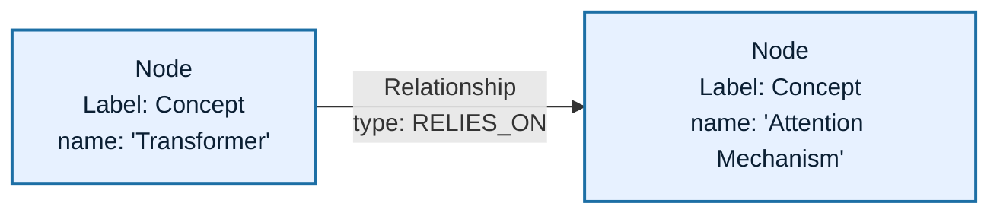
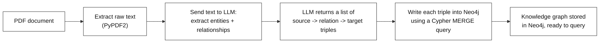
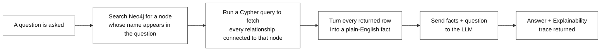
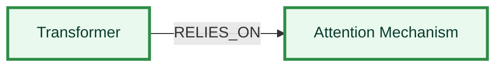
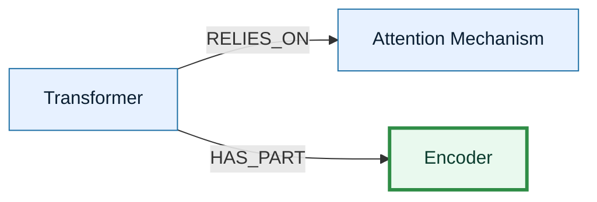
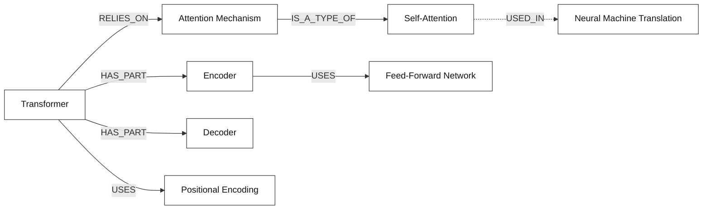
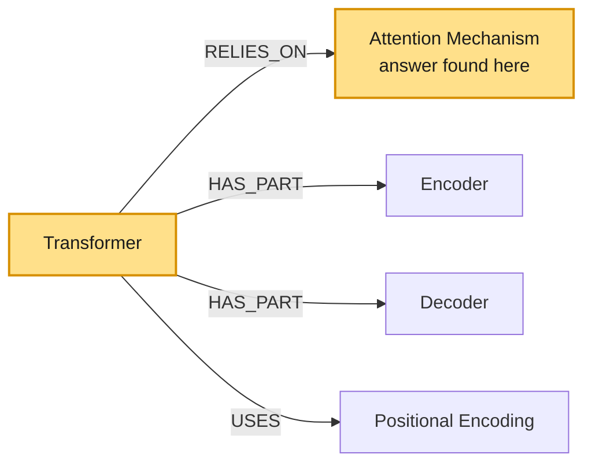
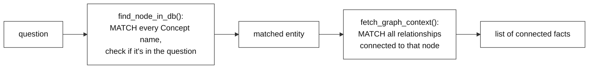

# End-to-End Graph RAG with Neo4j

---

# Problem Statement / Use Case Overview

A normal RAG pipeline finds chunks of text that are *similar* to a question and hands them to an LLM. But similarity isn't the same as connection — it can miss how one fact actually links to another, especially when the answer depends on following a chain of relationships rather than just matching keywords.

Building the knowledge graph purely in memory, using a library like NetworkX, works well for a single notebook session — but the graph disappears the moment the notebook stops running, and there's no way to browse it visually or query it from outside Python.

This document covers a version that solves that by storing the same kind of knowledge graph inside **Neo4j**, a dedicated graph database. It reads a PDF, asks an LLM to pull out entities and how they relate to each other, and writes those relationships into Neo4j using **Cypher**, the query language Neo4j understands. When a question comes in, the pipeline searches the database for the right starting point, pulls out every directly connected fact using a Cypher query, and only then asks the LLM to answer — along with a clear, step-by-step trace of how it got there. Because the graph lives in a real database, it persists between sessions and can be opened and explored visually in the Neo4j browser.

**This pipeline has two connected parts:**

1. **Building the knowledge graph** — turning raw PDF text into entities and relationships, and writing them into Neo4j.
2. **Querying the graph** — asking a question, running Cypher queries to find connected facts, and getting a clear, explainable answer back from the LLM.

This is useful for:
- **Questions that depend on connections between facts**, not just keyword or meaning similarity
- **Any case where you want the AI to show its reasoning path** — exactly which facts it followed to reach an answer
- **Graphs that need to persist, scale, or be shared** — beyond what a single notebook session can hold in memory
- **Documents where entities relate to each other in a chain**, e.g. "A causes B, B relates to C"

---

# What is Neo4j

Neo4j is a database built specifically to store and query connected data. Most databases store information in tables — rows and columns — where relationships between records have to be figured out afterward by joining tables together. Neo4j stores the relationships themselves, directly, as part of the data.

Everything in Neo4j is made of three simple pieces:

- **Nodes** — the "things," such as a person, a concept, or a document. A node can carry a **label** describing what kind of thing it is (e.g. `Concept`), plus **properties** that describe it (e.g. `name: "Transformer"`).
- **Relationships** — the connections between two nodes. A relationship always has a **direction** and a **type**, written in capital letters (e.g. `RELIES_ON`).
- **Properties** — key-value details attached to either a node or a relationship.



This structure — nodes, relationships, and properties — is called the **property graph model**, and it's what Neo4j is built around.

To read and write data in this model, Neo4j uses its own query language called **Cypher**. Cypher is designed to look like the pattern you're describing. For example, this single line finds a node named "Transformer" and creates a connection from it to a node named "Attention Mechanism":

```cypher
MERGE (s:Concept {name: "Transformer"})
MERGE (t:Concept {name: "Attention Mechanism"})
MERGE (s)-[:RELIES_ON]->(t)
```

`MERGE` means "find this if it already exists, otherwise create it" — which is exactly what's needed when a graph is built up gradually from extracted facts, since the same entity can be mentioned more than once without creating duplicates.

This walkthrough uses **Neo4j Aura**, Neo4j's cloud-hosted version, so no local database installation is required. The Python code connects to it over the network using a URI, username, and password, in the same way a client connects to any remote database.

---

# Input Data

| Item | Detail |
|------|--------|
| **The PDF** | A document downloaded automatically from a link |
| **Your question** | A natural-language question about an entity mentioned in the document |
| **LLM API Key** | Used to call the LLM that extracts entities and answers questions |
| **Neo4j Aura credentials** | A URI, username, and password for a running Neo4j Aura instance |

---

# Processing

### Part A — Building the Knowledge Graph in Neo4j



This diagram shows the full graph-building pipeline: the PDF's text is extracted, that text is sent to the LLM which pulls out entities and how they relate to each other, those relationships are returned as simple triples, and each triple is written into Neo4j as nodes and a relationship — producing a knowledge graph that lives in the database, not just in memory.

### Part B — Querying the Graph with Cypher



This diagram shows the full querying pipeline: the incoming question is matched against the node names stored in Neo4j, a Cypher query pulls every relationship directly connected to the matching node, those relationships are turned into plain facts, that context plus the question is sent to the LLM, and the LLM returns both the answer and its explainability trace.

### How the Graph Gets Built, One Relationship at a Time

Before any question can be asked, the graph has to exist inside Neo4j. The ingestion step doesn't create the whole graph in one shot — it loops over the extracted triples and runs one `MERGE` query per triple, and the graph in the database grows a little with each one:

**Loop 1 — first relationship written to Neo4j:**



**Loop 2 — next relationship adds on top of the first:**



**...and so on, until the loop finishes — the complete graph, now stored in Neo4j:**



Each pass through the loop takes one `{source, relation, target}` triple the LLM extracted, and runs a `MERGE` query that creates the two `Concept` nodes if they don't already exist, then creates a relationship between them labeled with the relation type. Because `MERGE` checks for an existing match before creating anything, running the same triple twice never produces a duplicate node or relationship — the graph simply accumulates until every extracted triple has been written. By the time the loop ends, this full graph is sitting inside Neo4j, ready to be queried by anyone with access to the database — not just the current notebook session.

---

### A Sample Graph and How a Query Travels Through It

Now that the graph above exists inside Neo4j, here's how one real question — **"What mechanism does the Transformer architecture rely on?"** — actually moves through it. A Cypher query starts at the `Transformer` node and pulls back every relationship connected to it directly:



The question mentions "Transformer," so the Cypher query is run with `Transformer` as the starting node. This query pulls back only the **direct** neighbors of the matched node — Attention Mechanism, Encoder, Decoder, and Positional Encoding — in a single step, using the pattern `(n:Concept {name: $name})-[r]-(m:Concept)`. Each of those connections is already enough context: the direct relationship `Transformer --[RELIES_ON]--> Attention Mechanism` answers the question outright.

Every row the query returns gets turned into a simple, plain-English fact — the kind of sentence a person would say out loud, like "Transformer relies on the Attention Mechanism." All of these facts are then handed to the LLM together with the original question, and it picks out the one that actually answers it: *"The Transformer relies on the Attention Mechanism."*

---

# Output

**Downloading and extracting text** prints how many characters were pulled from the PDF:

```
Downloading PDF...
Success! Extracted 1500 characters ready for processing.
```

**Extracting relationships** prints how many were found, followed by a preview of the raw JSON:

```
Extracting relationships... (This may take a minute)

Extracted 36 relationships from the text.
[
  {
    "source": "Attention Is All You Need",
    "relation": "HAS_AUTHOR",
    "target": "Ashish Vaswani"
  },
  {
    "source": "Attention Is All You Need",
    "relation": "HAS_AUTHOR",
    "target": "Noam Shazeer"
  }
]
```

**Loading into Neo4j** clears out any previous data first, then confirms the write succeeded:

```
Database cleared for fresh ingestion.
Knowledge Graph successfully loaded into Neo4j!
```

**Querying the graph** prints which concept was auto-detected, then a two-section answer — a direct answer, followed by a step-by-step explainability trace:

```
[System Log] Auto-detected focus concept: 'Transformer'
--- FINAL ANSWER ---
The Transformer architecture relies on attention mechanisms.

--- AI TRACING & EXPLAINABILITY ---
The answer was derived by examining the provided Neo4j graph relationships
for the Transformer node. A direct relationship labeled BASED_ON connects
the Transformer node to the "attention mechanisms" node, explicitly
indicating that the architecture is founded on this mechanism. No other
mechanism-related relationships describe a foundational reliance; they
describe components, training details, or removed elements like recurrence
and convolutions. Therefore, the graph supports the conclusion that
attention mechanisms are the core mechanism the Transformer relies on.
```

The explainability section always describes the exact chain of relationships used, in an objective third-person voice, so the reasoning path can be checked against the graph itself — and, since the graph lives in Neo4j, it can also be checked visually by opening the Neo4j Aura browser and running `MATCH (n) RETURN n`.

---

# Tech Stack

| Component | Tool |
|---|---|
| **PDF Text Extraction** | `PyPDF2` — pulls raw text out of the first page of the PDF |
| **File Downloading** | `requests` — grabs the PDF from a link and saves it locally |
| **Entity/Relationship Extraction** | LLM (`nvidia/nemotron-3-ultra-550b-a55b:free`) — reads text and returns structured triples |
| **Graph Storage** | `Neo4j Aura` (cloud-hosted Neo4j) — stores entities as nodes and relationships as directed edges |
| **Database Driver** | `neo4j` Python driver — connects to Aura and runs Cypher queries |
| **Query Language** | `Cypher` — used to write (`MERGE`) and read (`MATCH`) the graph |
| **LLM (Answering)** | `nvidia/nemotron-3-ultra-550b-a55b:free` — answers using only the retrieved graph facts |
| **Graph Visualization** | `yfiles_jupyter_graphs_for_neo4j` — renders the Neo4j graph as an interactive widget inside the notebook |

---

# Underlying Concepts (Summarized)

**Knowledge Graph** is a way of storing facts as a network instead of a flat list — each entity is a node, and each relationship between two entities is an edge connecting them. This makes it possible to follow a chain of connected facts, not just look things up one at a time.

**Neo4j** is a database purpose-built to store graphs like this directly, rather than approximating them with tables. Data is modeled as nodes, relationships, and properties, and it's queried using Cypher.

**Cypher** is Neo4j's query language. `MERGE` is used to write data — it creates a node or relationship only if a matching one doesn't already exist, which avoids duplicates when the same entity appears in multiple extracted triples. `MATCH` is used to read data — it describes a pattern to search for in the graph and returns whatever fits that pattern.

**Entity & Relationship Extraction** means asking an LLM to read plain text and identify the "who/what" (entities) and "how they connect" (relationships), turning unstructured text into structured `source -> relation -> target` triples.

**Graph Traversal** is the act of starting at one node and following its relationships outward to discover what's connected to it. Here, the Cypher query pulls back every relationship directly attached to the matched node in a single step.

**Graph RAG** stands for **Graph-based Retrieval-Augmented Generation** — instead of retrieving similar-looking text chunks, the relevant *connected facts* are retrieved from the graph first, and the LLM is asked to answer using only those facts, with a clear trace of which relationships were followed.

> **Why this matters:** A question like "What mechanism does the Transformer rely on?" isn't answered by finding the most *similar-sounding* sentence — it's answered by finding the node named "Transformer" in Neo4j and following its actual `RELIES_ON` relationship to "Attention Mechanism." Because that relationship is stored permanently in a database rather than rebuilt in memory each run, the same graph can be queried again later, shared with others, or inspected visually — without repeating the extraction step.

---

# Pre-requisites

- **Basic familiarity** with Python (functions, loops, `import` statements).
- **An LLM API Key** — used to call the LLM for extraction and answering.
- **A Neo4j Aura instance** — a free cloud instance can be created at [neo4j.com/aura](https://neo4j.com/aura), which provides the URI, username, and password needed below.
- **High-level understanding** of what a knowledge graph and RAG are (covered above).

---

# Getting Neo4j Credentials

The pipeline needs three values to connect to Neo4j: a **URI**, a **username**, and a **password**. Here's how to get all three from a free Neo4j Aura instance:

1. Go to [neo4j.com/aura](https://neo4j.com/aura) and sign up, or log in if an account already exists.
2. From the Aura console, click **Create instance** and choose the **free tier**.
3. Give the instance a name and confirm creation. Aura will generate the database and show a screen with the connection details.
4. On that screen, **download or copy the generated password immediately** — Aura shows it only once. If it's missed, the password has to be reset from the instance's settings page.
5. Once the instance finishes provisioning (usually under a minute), open it from the console. The **Connection URI** is shown on the instance's overview page, and typically looks like:
   ```
   neo4j+s://xxxxxxxx.databases.neo4j.io
   ```
6. The **username** is `neo4j` by default unless it was changed during setup.
7. Store all three values — URI, username, password — as environment variables (`NEO4J_URI`, `NEO4J_USER`, `NEO4J_PASSWORD`) rather than pasting them directly into the notebook, so they aren't exposed if the file is shared.

Once these three values are set, the driver connection shown in the next section will pick them up automatically.

---

# Environment / Dependencies Setup

The cell below installs all required Python packages:

| Package | Purpose |
|---------|---------|
| `neo4j` | **Database driver** — connects to Neo4j Aura and runs Cypher queries |
| `requests` | **File downloading** and later calls to the LLM API |
| `PyPDF2` | **PDF text extraction** — pulls raw text out of the PDF |
| `yfiles-jupyter-graphs-for-neo4j` | **Graph visualization** — renders the Neo4j graph as an interactive widget inside the notebook |

> **Note:** Run this cell first — it only needs to be run once per session.

```python
!pip install neo4j requests PyPDF2 yfiles-jupyter-graphs-for-neo4j
```

## Import Libraries

```python
import os
import json
import requests
import PyPDF2
from neo4j import GraphDatabase
```

| Import | Purpose |
|---|---|
| `os` | Used for file paths and folders |
| `json` | Parses the LLM's JSON reply into Python objects |
| `requests` | Downloads the PDF, and later calls the LLM API |
| `PyPDF2` | Extracts raw text from the PDF |
| `GraphDatabase` | The Neo4j driver's entry point for opening a connection |

## Configure the LLM and Connect to Neo4j

```python
# --- LLM Configuration ---
OPENROUTER_API_KEY = "your-api-key"
OPENROUTER_URL = "https://openrouter.ai/api/v1/chat/completions"
TEXT_MODEL = "nvidia/nemotron-3-ultra-550b-a55b:free"

# --- Neo4j Aura Configuration ---
NEO4J_URI = "YOUR-NEO4J_URI"
NEO4J_USER = "YOUR-NEO4J_USER"
NEO4J_PASSWORD = "YOUR-NEO4J_PASSWORD"

# Open a persistent connection to the database
driver = GraphDatabase.driver(NEO4J_URI, auth=(NEO4J_USER, NEO4J_PASSWORD))
driver.verify_connectivity()
print("Success: Connected to Neo4j Database!")
```

> **Note:** Replace `"your-api-key"`, `"YOUR-NEO4J_URI"`, `"YOUR-NEO4J_USER"`, and `"YOUR-NEO4J_PASSWORD"` with the actual values from the LLM provider and the Neo4j Aura instance created earlier. To avoid pasting these directly into the notebook, they can instead be loaded with `os.getenv("VARIABLE_NAME")` after setting them as environment variables — for example, `OPENROUTER_API_KEY = os.getenv("OPENROUTER_API_KEY")` — which keeps the actual credentials out of the file itself. `verify_connectivity()` immediately checks that the URI, username, and password are correct, so any connection problem is caught before the rest of the notebook runs.

---

# Step-wise Instructions — Development

---

### Step 1 — Download the Target Document

The PDF is downloaded directly from a link and saved locally, ready to be opened in the next step.

```python
PDF_URL = "https://arxiv.org/pdf/1706.03762.pdf"

os.makedirs("data", exist_ok=True)
PDF_PATH = os.path.join("data", "document.pdf")

print("Downloading PDF...")
response = requests.get(PDF_URL)
with open(PDF_PATH, "wb") as f:
    f.write(response.content)
```

By the end of this step, the raw PDF file exists locally at `data/document.pdf` — nothing has been read out of it yet.

---

### Step 2 — Extract Text via PyPDF2

Only the first page is read here, and only the first 1500 characters of it are kept, so the text sent to the LLM later stays short and fast.

```python
with open(PDF_PATH, "rb") as file:
    reader = PyPDF2.PdfReader(file)
    sample_text = reader.pages[0].extract_text()

# We only use the first 1500 characters to keep API processing fast and free
sample_text = sample_text[:1500].strip()
print(f"Success! Extracted {len(sample_text)} characters ready for processing.")
```

By the end of this step, `sample_text` holds a short block of plain text from the document's first page, ready to be handed to the LLM for entity extraction.

---

### Step 3 — Domain-Agnostic Entity Extraction

This step asks the LLM to read the text and return a structured list of relationships, with no fixed list of entity types to look for — it works the same way regardless of what the document is about.

```python
def extract_graph_elements(text):
    prompt = f"""
    You are an expert knowledge graph builder. Read the text below and extract all key concepts and their relationships.

    Text:
    {text}

    CRITICAL INSTRUCTIONS:
    Output ONLY a valid JSON list of objects with keys "source", "relation", and "target".
    Example format:
    [
      {{"source": "Entity_A", "relation": "RELATES_TO", "target": "Entity_B"}}
    ]
    Return ONLY pure JSON. Do not add explanations.
    """

    payload = {
        "model": TEXT_MODEL,
        "messages": [{"role": "user", "content": prompt}],
        "temperature": 0.0  # Keeps the AI strictly factual
    }
    headers = {"Authorization": f"Bearer {OPENROUTER_API_KEY}"}

    try:
        print("Extracting relationships... (This may take a minute)")
        resp = requests.post(OPENROUTER_URL, headers=headers, json=payload)
        resp.raise_for_status()
        raw_json = resp.json()["choices"][0]["message"]["content"].strip()

        # Strip out markdown formatting if the AI added it
        if raw_json.startswith("```"):
            raw_json = raw_json.split("\n", 1)[1].rsplit("```", 1)[0].strip()

        return json.loads(raw_json)
    except Exception as e:
        print(f"Extraction Error: {e}")
        return []

extracted_relationships = extract_graph_elements(sample_text)
print(f"\nExtracted {len(extracted_relationships)} relationships from the text.")
print(json.dumps(extracted_relationships[:2], indent=2))  # Preview first 2
```

`temperature=0.0` keeps the LLM's output consistent and predictable, which matters here since the reply needs to be parsed as exact JSON. By the end of this step, `extracted_relationships` holds a plain Python list of `source`/`relation`/`target` triples pulled straight out of the text — nothing has touched Neo4j yet.

---

### Step 4 — Ingest Data into Neo4j

Every extracted triple is written into Neo4j as two nodes and a relationship, using a Cypher `MERGE` query so the same entity never gets duplicated.

```python
def insert_into_neo4j(tx, relationships):
    for rel in relationships:
        source = rel["source"].strip()
        target = rel["target"].strip()

        # Neo4j relation names must be uppercase with underscores (e.g., HAS_AUTHOR)
        relation_type = rel["relation"].strip().replace(" ", "_").replace("-", "_").upper()

        # Cypher query using MERGE so we don't create duplicate nodes
        query = f"""
        MERGE (s:Concept {{name: $source}})
        MERGE (t:Concept {{name: $target}})
        MERGE (s)-[:{relation_type}]->(t)
        """
        tx.run(query, source=source, target=target)

# Connect to the DB and load the data
with driver.session() as session:
    # Clear out the database first for a clean lab environment
    session.run("MATCH (n) DETACH DELETE n")
    print("Database cleared for fresh ingestion.")

    session.execute_write(insert_into_neo4j, extracted_relationships)
    print("Success: Knowledge Graph loaded into Neo4j!")
```

`session.run("MATCH (n) DETACH DELETE n")` wipes out any leftover data from a previous run, so each run starts from a clean graph. `execute_write` then runs `insert_into_neo4j` inside a single write transaction, looping over every triple and merging it into the database. By the end of this step, the full knowledge graph exists inside Neo4j — it can be opened directly in the Neo4j Aura browser, independent of this notebook.

---

### Step 5 — Dynamic Traversal via Cypher

This step defines two functions that work together: one searches Neo4j to find which entity a question is about, the other runs a Cypher query to pull back everything connected to it.



**`find_node_in_db` — searches Neo4j for a node matching the question:**

```python
def find_node_in_db(question):
    """Searches the database to see if a word in the question matches a known node."""
    with driver.session() as session:
        result = session.run("MATCH (c:Concept) RETURN c.name AS name")
        for record in result:
            node_name = record["name"]
            if node_name.lower() in question.lower():
                return node_name
    return None
```

**`fetch_graph_context` — pulls every relationship connected to the matched node:**

```python
def fetch_graph_context(entity_name):
    """Pulls all direct relationships connected to our target node."""
    query = """
    MATCH (n:Concept {name: $name})-[r]-(m:Concept)
    RETURN n.name AS source, type(r) AS relation, m.name AS target
    """
    facts = []
    with driver.session() as session:
        result = session.run(query, name=entity_name)
        for record in result:
            facts.append(f"{record['source']} --[{record['relation']}]--> {record['target']}")
    return facts
```

`find_node_in_db` reads every `Concept` node's name out of Neo4j and checks each one against the question's text to see which entity is being asked about. `fetch_graph_context` then runs a Cypher `MATCH` pattern that finds the matched node and follows every relationship attached to it, in either direction, turning each one into a plain, readable fact.

---

### Step 6 — The Neo4j Graph RAG Engine

This step ties everything together: find the entity in Neo4j, gather its connected facts with a Cypher query, and ask the LLM for a direct answer plus an explainability trace, all in one function.

```python
def execute_neo4j_rag(question):
    # Step 1: Detect if any entity from the database is mentioned in the question
    target_entity = find_node_in_db(question)
    if not target_entity:
        return "Could not find any known concepts from the database in your question."

    print(f"[System Log] Auto-detected focus concept: '{target_entity}'")

    # Step 2: Retrieve connected relationship paths from Neo4j
    retrieved_facts = fetch_graph_context(target_entity)
    if not retrieved_facts:
        return f"Found '{target_entity}' in Neo4j, but no relationships were connected to it."

    facts_block = "\n".join([f"- {f}" for f in retrieved_facts])

    # Step 3: Build a prompt that forces the LLM to rely strictly on graph facts
    prompt = f"""
    You are an expert AI research assistant using a Neo4j Knowledge Graph.
    Answer the question using ONLY the connected relationship paths provided below.

    Graph Relationships:
    {facts_block}

    Question: {question}

    CRITICAL INSTRUCTIONS:
    Output your response in EXACTLY two sections as shown below.

    --- FINAL ANSWER ---
    [Provide a direct, simple, 1-sentence answer.]

    --- AI TRACING & EXPLAINABILITY ---
    [Explain step-by-step how the answer was derived from the Neo4j graph. Use an objective, third-person perspective.]
    """

    payload = {
        "model": TEXT_MODEL,
        "messages": [{"role": "user", "content": prompt}],
        "temperature": 0.0
    }
    headers = {"Authorization": f"Bearer {OPENROUTER_API_KEY}"}

    # Step 4: Send prompt to LLM and return the structured answer
    try:
        resp = requests.post(OPENROUTER_URL, headers=headers, json=payload)
        resp.raise_for_status()

        response_json = resp.json()
        if "choices" in response_json:
            return response_json["choices"][0]["message"]["content"].strip()
        return f"OpenRouter API Error: {response_json}"

    except Exception as e:
        return f"Error executing Graph RAG: {e}"
```

If no matching entity is found at all, the function stops early instead of guessing. Otherwise, the connected facts pulled from Neo4j are formatted into a clean bullet list and handed to the LLM along with strict formatting instructions, so the reply always separates the direct answer from the reasoning trace.

---

### Step 7 — Test the Database RAG

```python
query = "What mechanism does the Transformer architecture rely on?"
print(execute_neo4j_rag(query))
```

This is where everything built in Steps 1–6 gets used end-to-end: the question is matched to a node stored in Neo4j, a Cypher query pulls back its connected facts, those facts are sent to the LLM, and the printed result shows both the final answer and the reasoning path that produced it.

---

### Step 8 — Visualize the Graph Inside the Notebook

Since the graph now lives in Neo4j, it can be rendered as an interactive widget directly inside the notebook, using the same connection opened earlier.

```python
from yfiles_jupyter_graphs_for_neo4j import Neo4jGraphWidget

# 'driver' is the connection we already opened earlier
widget = Neo4jGraphWidget(driver)

# Run the exact same query you would run in the Aura console
widget.show_cypher("MATCH (n)-[r]->(m) RETURN n, r, m")
```

`show_cypher` sends a Cypher query to Neo4j and draws the result as a zoomable, clickable graph, node by node and relationship by relationship — the same graph that was built in Step 4, now visible instead of hidden inside Python objects. The same query, `MATCH (n) RETURN n`, can also be run directly in the Neo4j Aura browser outside the notebook, since the data lives permanently in the database.

---

# What We Learnt

By the end of this walkthrough, a PDF has been turned into a knowledge graph — built automatically from LLM-based entity extraction, and written into a real graph database rather than held in memory. That graph is then queried end-to-end using Cypher: a question is matched to a node, its connected facts are pulled directly from Neo4j, and a final answer is produced along with a visible, step-by-step trail of how it was reached.

**Key takeaways:**
- **Graphs capture connections that plain text search can miss** — following an actual relationship path can answer questions that simple keyword or similarity matching would struggle with.
- **Neo4j stores the graph permanently** — unlike an in-memory graph, it survives after the notebook stops running, and can be queried, shared, or visualized independently of the code that built it.
- **Cypher's `MERGE` keeps ingestion safe** — the same entity can appear in many extracted triples without ever creating duplicate nodes.
- **Extraction is domain-agnostic** — the LLM decides what counts as an entity or relationship on the fly, so the same code works on any document, not just one specific topic.
- **Answers come with a reasoning trail** — every answer includes a step-by-step explanation of which graph relationships were followed to reach it.
- **The graph can be inspected visually** — both inside the notebook and in the Neo4j Aura browser, using the same Cypher queries that power the RAG pipeline.