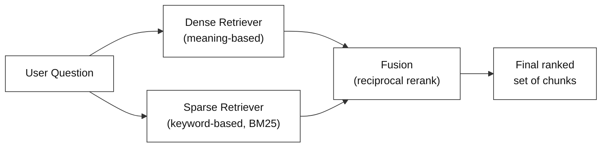
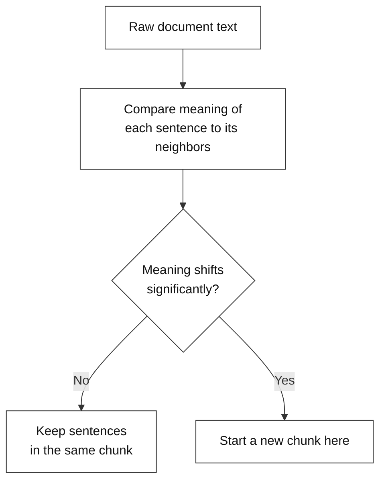
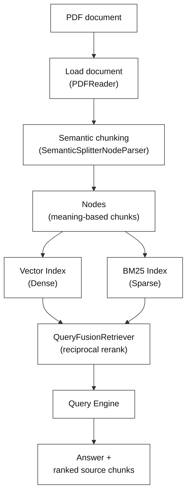
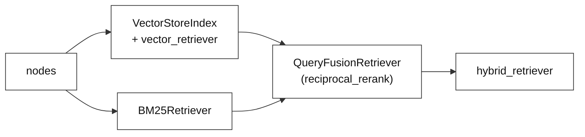

# Lab Guide: Hybrid RAG (Dense + Sparse) with Semantic Chunking

---

## 1. What is RAG?

**RAG** stands for **Retrieval-Augmented Generation**. Normally, an LLM answers a question using only what it learned during training. RAG works differently: it first finds the relevant passages from your own documents, then gives those passages to the LLM along with the question, and asks it to answer using only that text.

This keeps the answer grounded in your actual source material, instead of the model guessing or making something up.

---

## 2. What is Hybrid RAG (Dense + Sparse Retrieval)?

There are two very different ways to find the right passage for a question, and each one is weak where the other is strong.

**Dense retrieval** turns both the question and every chunk of the document into embeddings — numbers that capture *meaning*. It then finds chunks whose meaning is closest to the question's meaning, even if they don't use the same words. This works well for conceptual questions, but it can miss a chunk that has the exact keyword, number, or name the question is asking about.

**Sparse retrieval** (this lab uses an algorithm called **BM25**) works more like normal keyword search — it scores chunks by how many exact words they share with the question, and how rare those words are. This is good at finding exact terms, codes, or names, but it doesn't understand meaning, so it can miss a chunk that says the same thing in different words.

**Hybrid retrieval** runs both searches at the same time and combines their results, so the strengths of one make up for the weak spots of the other.



The fusion step in this lab uses **reciprocal rerank**. Instead of trusting either retriever's raw score, it looks at how each chunk ranked in each retriever's results, and combines those two rankings into one final, blended order.

---

## 3. What is Semantic Chunking?

Before any retrieval can happen, the source document has to be split into smaller pieces. A whole PDF is too big to search through quickly, or to hand to an LLM all at once.

The simplest way to split a document is by a fixed size — for example, every 500 characters. The problem is that a fixed cut point doesn't know where one idea ends and another begins. It can slice a sentence, or an explanation, right down the middle.

**Semantic chunking** works differently. It looks at the *meaning* of each sentence and compares it to the sentences around it. It only starts a new chunk at a point where the meaning clearly shifts — in other words, where the topic actually changes. This keeps each chunk as one complete idea, instead of a random slice of text.



---

## 4. Why Use This Approach

Dense retrieval alone can miss a chunk that has the exact word or number the question is asking about, if the surrounding wording doesn't look similar enough in meaning. Sparse retrieval alone can miss a chunk that answers the question well but uses completely different words to say it.

Combining both, and blending their rankings, gives a system that covers both weak spots at once — it catches what dense search would find, and it catches what keyword search would find. This means the LLM is much less likely to be given an incomplete or misleading set of passages to work from.

Semantic chunking helps in a different way. Even the best retriever can't return good context if the chunks themselves are cut off mid-thought. Splitting by meaning, instead of by size, means each chunk that gets retrieved actually makes sense on its own.

---

## 5. Pipeline Overview



The rest of this guide walks through the notebook that implements this pipeline, cell by cell.

---

## 6. Code Walkthrough

### Setup — Install Dependencies

This cell gets every external library the notebook needs onto the machine before anything else can run.

```python
!pip install llama-index-core llama-index-llms-openrouter llama-index-embeddings-huggingface llama-index-readers-file python-dotenv pymupdf rank_bm25
```

This cell installs everything the notebook depends on in one go: the core retrieval framework, the pieces that connect it to an LLM and an embedding model, a PDF reader, a way to load the API key safely, and the library that powers keyword-based search.

### Setup — Import Libraries

This cell loads all those installed tools into the notebook so they're actually ready to use.

```python
import os
from dotenv import load_dotenv

# Core LlamaIndex components
from llama_index.core import VectorStoreIndex, Settings
from llama_index.core.node_parser import SemanticSplitterNodeParser
from llama_index.readers.file import PDFReader
from llama_index.core.query_engine import RetrieverQueryEngine

# Hybrid Search Specifics
from llama_index.retrievers.bm25 import BM25Retriever
from llama_index.core.retrievers import QueryFusionRetriever

# LLM and Embedding integrations
from llama_index.llms.openrouter import OpenRouter
from llama_index.embeddings.huggingface import HuggingFaceEmbedding
```

This cell brings in every tool the pipeline will need, grouped by role: the core pieces for building an index and querying it, the two retrievers that make up the "hybrid" part (dense and sparse) along with the tool that fuses them, and the LLM and embedding integrations that actually do the reading and understanding.

### Setup — Silence Noisy Logs

This cell doesn't touch the pipeline at all — it's purely there to keep the notebook's output readable.

```python
import warnings
import logging
# 2. Silence general Python warnings
warnings.filterwarnings("ignore")

# 3. Silence HuggingFace download/info logs
logging.getLogger("transformers").setLevel(logging.ERROR)
logging.getLogger("sentence_transformers").setLevel(logging.ERROR)
logging.getLogger("httpx").setLevel(logging.ERROR)
```

It suppresses routine warning and info-level messages from the underlying libraries, so only meaningful output shows up in later cells.

### Setup — Load API Keys & Configure LlamaIndex Settings

This cell gets everything authenticated and configured so every later step knows which LLM and embedding model to use, without being told again.

```python
load_dotenv(".env")

OPENROUTER_API_KEY = os.getenv("OPENROUTER_API_KEY")

if not OPENROUTER_API_KEY:
    OPENROUTER_API_KEY = input("Enter your OpenRouter API key (get one at https://openrouter.ai): ").strip()

print("Key loaded.")

# Set up the LLM (using OpenRouter)
Settings.llm = OpenRouter(
    model="nvidia/nemotron-3-ultra-550b-a55b:free",
    api_key=OPENROUTER_API_KEY,
    temperature=0,
    max_tokens=512
)

# Set up the dense embedding model
Settings.embed_model = HuggingFaceEmbedding(model_name="all-MiniLM-L6-v2")

print("LlamaIndex configured!")
```

- The API key is loaded first, with a fallback that simply asks for it directly if it isn't found — so the notebook doesn't just crash if the `.env` file is missing.
- It then sets which LLM will generate answers and which embedding model will be used to understand meaning, for the rest of the notebook to use automatically.

---

### Step 1 — Load Documents & Create Semantic Nodes

This step takes the raw PDF and turns it into the meaning-based chunks the rest of the pipeline will search over.

```python
# Load PDF document
reader = PDFReader()

# Remove the fake citation tag here!
documents = reader.load_data(file="data/sample_text_document.pdf")

print(f"Loaded {len(documents)} document(s)")

# Semantic chunking: splits based on meaning, not fixed size
splitter = SemanticSplitterNodeParser(
    buffer_size=1, 
    breakpoint_percentile_threshold=95, 
    embed_model=Settings.embed_model
)

# Parse documents into nodes explicitly for hybrid search
nodes = splitter.get_nodes_from_documents(documents)

print(f"Extracted {len(nodes)} semantic nodes from the documents.")
```

- The PDF is loaded first, giving the notebook something to work with.
- That content is then split by meaning rather than by a fixed size, so each chunk stays focused on one complete idea, as described in Section 3.
- These chunks are what both the dense and sparse retrievers will be built from next.

---

### Step 2 — Create the Hybrid Retrievers (Dense + Sparse)

This step builds three things in sequence: a dense retriever, a sparse retriever, and a fused retriever that combines both. The diagram below shows that flow before the code.



```python
# 1. THE DENSE COMPONENT
vector_index = VectorStoreIndex(nodes)
vector_retriever = vector_index.as_retriever(similarity_top_k=3)

# 2. THE SPARSE COMPONENT
bm25_retriever = BM25Retriever.from_defaults(
    nodes=nodes, 
    similarity_top_k=3
)

# 3. THE HYBRID ENGINE (Fusing them together)
hybrid_retriever = QueryFusionRetriever(
    [vector_retriever, bm25_retriever],
    similarity_top_k=3,
    num_queries=1, 
    mode="reciprocal_rerank", 
)

print("Hybrid retrievers (Dense + Sparse) successfully fused!")
```

- The dense retriever is built first, set up to return the handful of chunks that are closest in meaning to a given question.
- The sparse retriever is built next, over those same chunks, returning its own handful of best keyword matches.
- The two are then combined into one fused retriever, which blends their rankings together using reciprocal rerank rather than trusting either one alone — this is the actual "hybrid" step.

---

### Step 3 — Query the Index

This step is where a real question finally gets asked and answered, using everything built so far.

```python
# Create a query engine from the fused retriever
query_engine = RetrieverQueryEngine.from_args(hybrid_retriever)

# Ask a question
QUERY = "Why do restoration teams reintroduce tidal flow gradually instead of all at once?"
response = query_engine.query(QUERY)

print(f"Query: {QUERY}")
print(f"\nAnswer: {response}")
```

- The fused retriever from Step 2 is wrapped into something that can be asked a question directly, handling retrieval and answer generation together.
- Asking it a question runs the whole pipeline in one call: the hybrid retriever finds the most relevant chunks, and the LLM uses them to produce the final answer.
- The result carries more than just the answer text — it also keeps track of exactly which chunks were used, which is what the next step looks at.

---

### Step 4 — Inspect Post-Fusion Sources

This step doesn't generate anything new — it just reveals what actually went into the answer above.

```python
# Show the source nodes (retrieved chunks)
print("Source nodes used (Post-Fusion):")
for i, node in enumerate(response.source_nodes):
    print(f"\n--- Source {i + 1} (score: {node.score:.4f}) ---")
    print(node.text[:200] + "...")
```

- This cell prints out the exact chunks that were fused together and handed to the LLM to generate the answer in Step 3, along with how each one ranked after fusion.
- Seeing that list means nothing is hidden — it's possible to check exactly which passages the final answer was based on, instead of just trusting the answer on its own.

---

## 7. Expected Output

**Step 1** should report how many pages were loaded and how many semantic chunks were extracted from them:

```
Loaded 2 document(s)
Extracted 4 semantic nodes from the documents.
```

**Step 2** should confirm both retrievers were built and fused successfully:

```
Hybrid retrievers (Dense + Sparse) successfully fused!
```

**Step 3** should print the question followed by a grounded answer generated from the retrieved chunks:

```
Query: Why do restoration teams reintroduce tidal flow gradually instead of all at once?

Answer: Restoration teams reintroduce tidal flow gradually because a sudden, full breach can erode unconsolidated fill material before vegetation has a chance to stabilize the soil. A phased approach—opening a small channel first, then widening it in stages—allows time for pioneer plant species to colonize newly wetted areas and for teams to monitor erosion and sediment deposition before proceeding further.
```

**Step 4** should list the top-ranked chunks that were fused together and used to produce that answer, each with its fusion score:

```
Source nodes used (Post-Fusion):

--- Source 1 (score: 0.0333) ---
A Short Guide to Coastal Wetland Restoration...

--- Source 2 (score: 0.0328) ---
4. Planting and Vegetation Recovery...

--- Source 3 (score: 0.0161) ---
Phased approaches might open a small channel first...
```

---

## 8. Summary

This lab builds a retrieval pipeline that avoids the biggest weakness of a typical RAG system: relying on just one way of matching a question to the right passage.

A PDF is first split into meaning-based chunks using semantic chunking, instead of arbitrary fixed-size cuts. Those chunks are then indexed twice — once for dense, meaning-based search, and once for sparse, keyword-based search. The two retrievers are then fused together using reciprocal rerank, so the final set of chunks draws on the strengths of both.

The last two steps show that this isn't a black box. The actual answer, and the exact source chunks that produced it — along with their fusion scores — are both fully visible and can be checked.