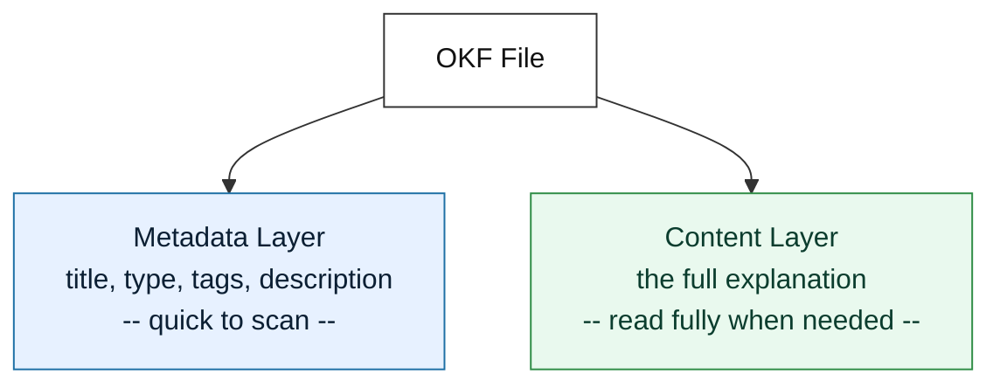
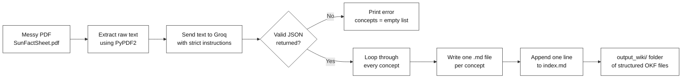
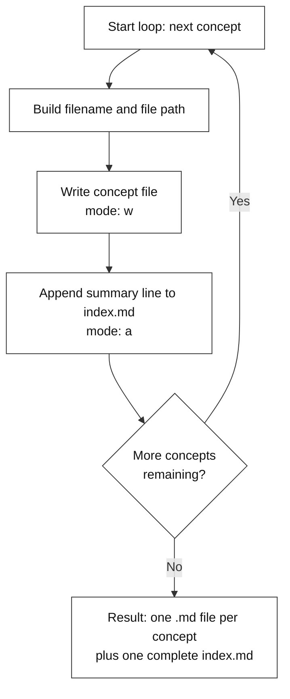

# Lab 1 Guide: Automated Ingestion (Building Structured Knowledge)

Before looking at the code, it's worth understanding what we're building and why. Once that's clear, the notebook itself is easy to follow.

---

## 1. What is an LLM Wiki?

**LLM** stands for **Large Language Model** — an AI system that is very good at reading and writing natural language. It can read a document and summarize or restructure what's inside it.

**Wiki** refers to something like Wikipedia — a collection of short, focused pages, where each page explains exactly one topic, supported by an index that helps locate the right page quickly.

An **LLM Wiki** combines the two ideas: it is a Wikipedia-style knowledge base that is built and read by an AI. Instead of a person writing each page by hand, the AI reads the source material and generates the pages. Instead of a person browsing to find the right page, the AI searches the index and reads the relevant page when it needs to answer a question.

---

## 2. What is OKF (Open Knowledge Format)?

If an AI is going to generate knowledge pages automatically, there needs to be one consistent format for what a page looks like. That is what **OKF (Open Knowledge Format)** defines — a simple, consistent structure that every knowledge file follows.

Every OKF file has **two layers**:

1. **Metadata Layer** — short facts about the page: its title, type, tags, and a one-line description. This layer exists so the AI (or a person) can quickly judge relevance without reading the entire file.
2. **Content Layer** — the full explanation itself.



These two layers are kept separate because they serve different purposes. The metadata is meant to be scanned quickly to decide whether a page is relevant. The content is meant to be read in full, but only once the metadata has already confirmed relevance.

As an example, this guide itself follows the same idea. If it were stored as an OKF file, its metadata layer would look like this:

```yaml
title: "Lab 1 Guide: Automated Ingestion (Building Structured Knowledge)"
type: "guide"
tags: ["llm-wiki", "okf", "lab1", "ingestion", "groq"]
description: "A step-by-step walkthrough of the Lab 1 notebook: what an LLM Wiki and OKF are, why this approach is used, and what every part of the code does."
```

Everything below that — the explanations, code walkthroughs, and diagrams that follow — is the content layer.

---

## 3. Why Use This Approach

A common way AI tools handle large documents is to split them into small, randomly-sized chunks, then retrieve a handful of chunks that appear similar to a given question. This has a well-known weakness: chunking can separate a fact from the context that explains it, and "appears similar" is not the same as "actually answers the question." When the retrieved chunks don't fully cover the answer, the AI tends to fill the gap with a guess — commonly referred to as **hallucination**.

This workshop avoids that problem by generating one complete, self-contained file per fact or concept, along with a master index describing what exists. When a question is asked later, the AI does not guess from fragments — it checks the index, selects the correct file(s), and reads them in full.

Lab 1 is where this structured knowledge base gets created, starting from a single unstructured PDF.

---

## 4. Pipeline Overview



The pipeline takes an unstructured PDF as input and produces a folder of clean, indexed OKF files as output. The rest of this guide walks through the notebook that implements this pipeline, cell by cell.

---

## 5. Code Walkthrough

### Step 1 — Install Required Libraries

```python
# !pip install PyPDF2 python-dotenv groq requests
```

This line is commented out because it only needs to run once, during initial setup — not every time the notebook runs. Each library serves a specific purpose:

- **PyPDF2** — opens a PDF file and extracts its plain text.
- **python-dotenv** — reads secret values (such as an API key) from a hidden `.env` file, instead of hardcoding them into the notebook.
- **groq** — the official library used to communicate with Groq's AI models.
- **requests** — a general-purpose library for making internet requests, used internally by some of the other libraries.

### Step 2 — Import Libraries

```python
import os
import json
import PyPDF2
from dotenv import load_dotenv
from groq import Groq
```

Installing a library makes it available on the machine. Importing it brings it into this specific notebook so it can be used.

| Import | Purpose |
|---|---|
| `os` | Working with file paths and folders |
| `json` | Converting JSON-formatted text into a Python dictionary/list |
| `PyPDF2` | Opening the PDF and reading its pages |
| `load_dotenv` | Reading values from the `.env` file |
| `Groq` | The client used to send requests to the AI |

### Step 3 — Set Up API Keys

```python
load_dotenv("../.env")

# Initialize the Native Groq Client
client = Groq(api_key=os.getenv("GROQ_API_KEY"))
```

- `load_dotenv("../.env")` loads the contents of a `.env` file located one directory above the notebook into memory.
- `os.getenv("GROQ_API_KEY")` retrieves the value of `GROQ_API_KEY` from that loaded file.
- `client = Groq(api_key=...)` creates a client object — the interface used to send requests to Groq for the rest of the notebook.

Keeping the API key in a separate `.env` file (rather than typing it directly into the notebook) prevents it from being exposed if the notebook is ever shared or published.

### Step 4 — Locate and Read the Document

```python
PDF_PATH = "../SunFactSheet.pdf"

if os.path.exists(PDF_PATH):
    print(f"Success: Found the document at '{PDF_PATH}'")
else:
    print(f"Error: Could not find the document.")

reader = PyPDF2.PdfReader(PDF_PATH)
raw_text = ""
for page in reader.pages:
    raw_text += page.extract_text() + "\n"

print("Text extraction complete! Ready for AI processing.")
```

- **`PDF_PATH`** stores the file's location as a string, not the file itself.
- `os.path.exists(PDF_PATH)` checks that a file actually exists at that location before attempting to open it, preventing an avoidable crash.
- `reader = PyPDF2.PdfReader(PDF_PATH)` opens the PDF for reading, page by page.
- **`raw_text`** starts as an empty string. The `for` loop iterates through every page, extracts its text with `page.extract_text()`, and appends it to `raw_text` (the `+=` operator adds each page's text onto what's already collected). After the loop finishes, `raw_text` holds the entire PDF's content as one continuous string.

### Step 5 — Extract Concepts with Groq

```python
system_prompt = """
You are a data extraction assistant. Read the text below and extract every distinct technical fact or value present in the source.
Do not limit yourself to a fixed number of facts — extract all of them, no matter how many there are.
Use the same wording as the source text for each fact — do not paraphrase or rename values.
Each fact must have its own separate concept entry, even if two facts are about a related topic.
Keep each "content" field short — 1 to 2 sentences maximum, stating only the fact and its value.
Respond in JSON only, matching this format:
{
  "concepts": [
    {
      "filename": "concept_name.md",
      "type": "concept",
      "title": "Human Readable Title",
      "tags": ["tag1", "tag2"],
      "description": "A single sentence summary",
      "content": "The full detailed explanation in markdown format."
    }
  ]
}
Output ONLY the JSON. No extra text, no markdown formatting blocks.
"""
```

This block is the **system prompt** — the instructions given to the AI before any actual content. The instructions are deliberately strict and repetitive ("extract all of them," "do not paraphrase," "Output ONLY the JSON") because the AI's response will be parsed as strict JSON a few lines later. Any extra conversational text in the response would cause that parsing step to fail.

```python
print("Sending document to Groq for extraction...")

response = client.chat.completions.create(
    model="llama-3.3-70b-versatile", 
    messages=[
        {"role": "system", "content": system_prompt},
        {"role": "user", "content": raw_text}
    ],
    temperature=0.0,
    max_tokens=8000
)
```

This is the actual request sent to Groq, using the `client` created in Step 3.

- `model="llama-3.3-70b-versatile"` specifies which AI model to use.
- `messages=[...]` supplies both the instructions (`system_prompt`) and the actual input (`raw_text`, the full PDF text).
- `temperature=0.0` controls how deterministic the output is. A value of `0.0` produces the most consistent, repeatable results — appropriate for an extraction task where reliability matters more than variation.
- `max_tokens=8000` sets the maximum length of the response, leaving enough room to list a large number of facts without the output being cut off.

The result is stored in **`response`**, a structured object containing the AI's reply along with additional metadata about the request.

```python
raw_json = response.choices[0].message.content.strip()

try:
    structured_data = json.loads(raw_json)
    concepts = structured_data.get("concepts", [])
    print(f"Success! AI identified {len(concepts)} distinct concepts.")
except json.JSONDecodeError:
    print("Error: The model's JSON response was cut off or malformed.")
    print("Try reducing the amount of source text, or check the raw output below:")
    print(raw_json[-500:])
    concepts = []
```

- `response.choices[0].message.content` extracts just the AI's written reply from the larger `response` object. `.strip()` removes any leading/trailing whitespace. The result is stored in **`raw_json`** — still a plain string at this point.
- `json.loads(raw_json)` converts that string into an actual Python dictionary, stored in **`structured_data`**.
- `structured_data.get("concepts", [])` retrieves the list stored under the `"concepts"` key, producing the **`concepts`** variable — a list where each item represents one extracted fact.
- The `try` / `except` block handles the case where the response is not valid JSON (for example, if it was cut off). Rather than letting the notebook crash, the error is caught, a message is printed, and `concepts` is set to an empty list so the rest of the notebook can still run.

At the end of this cell, `concepts` contains one dictionary per extracted fact, each with a `filename`, `type`, `title`, `tags`, `description`, and `content`.

### Step 6 — Build OKF Files and Update the Index

This step is split across two cells.

**Cell A — Preparing the output folder and index file:**

```python
output_dir = "../output_wiki"
os.makedirs(output_dir, exist_ok=True)

index_path = os.path.join(output_dir, "index.md")

if not os.path.exists(index_path):
    with open(index_path, "w", encoding="utf-8") as f:
        f.write("# Master Index\n\n")

print(f"Output directory ready at: {output_dir}")
```

- **`output_dir`** stores the path to the folder where the generated files will be saved.
- `os.makedirs(output_dir, exist_ok=True)` creates that folder if it doesn't already exist. `exist_ok=True` prevents an error if the folder was already created in a previous run.
- **`index_path`** stores the full path to the master index file.
- The `if not os.path.exists(index_path):` check ensures a new index file is only created if one doesn't already exist, so re-running the notebook doesn't overwrite an existing index.

**Cell B — Generating the files:**

```python
for concept in concepts:
    filename = concept['filename'].replace(" ", "_").lower()
    if not filename.endswith('.md'):
        filename += '.md'
        
    file_path = os.path.join(output_dir, filename)
    
    okf_content = f"""type: {concept['type']}
title: {concept['title']}
tags: {concept['tags']}
description: {concept['description']}
---
# {concept['title']}

{concept['content']}
"""
    
    with open(file_path, "w", encoding="utf-8") as f:
        f.write(okf_content)
    
    print(f"Created: {filename}")
    
    with open(index_path, "a", encoding="utf-8") as f:
        f.write(f"- **{filename}**: {concept['description']}\n")

print("\nPipeline complete! Ready for Lab 2.")
```

This loop runs once for every item in `concepts`. On each pass, the variable `concept` holds one fact, and the following steps occur:

1. **Building a safe filename.** `concept['filename'].replace(" ", "_").lower()` replaces spaces with underscores and converts the filename to lowercase for consistency. The `.md` extension is added if it's missing.
2. **Building the full save path.** `file_path = os.path.join(output_dir, filename)` combines the output folder and filename into the final save location.
3. **Assembling the OKF content.** The f-string builds the metadata layer (`type`, `title`, `tags`, `description`), followed by a `---` separator, followed by the content layer.
4. **Saving the file.** `open(file_path, "w", ...)` opens a new file in write mode, and `f.write(okf_content)` saves the content.
5. **Printing a confirmation** for each file created.
6. **Updating the index.** `open(index_path, "a", ...)` opens the index in append mode, meaning each pass adds one new line without erasing what's already there. This is what allows the index to accumulate one entry per concept across the entire loop.



Once this loop completes, `output_wiki/` contains one file per fact, along with an `index.md` listing every one of them.

---

## 6. Variable Reference

| Variable | Holds |
|---|---|
| `client` | The connection used to send requests to Groq |
| `PDF_PATH` | The file location of the source PDF |
| `raw_text` | The entire PDF's extracted text |
| `system_prompt` | The instructions given to the AI |
| `response` | The AI's full reply, including metadata |
| `raw_json` | The AI's reply, as a plain string |
| `structured_data` | The reply, converted into a Python dictionary |
| `concepts` | A list of dictionaries, one per extracted fact |
| `output_dir` | The folder where generated files are saved |
| `index_path` | The location of the master index file |
| `concept` | The current fact being processed inside the loop |
| `filename` / `file_path` | The name and full save location of one file |
| `okf_content` | The assembled metadata + content for one file |

---

## 7. Expected Output

When the notebook runs successfully, the final cell should print output similar to:

```
Created: sun_mass.md
Created: earth_mass.md
Created: sun_to_earth_mass_ratio.md
...
Created: sun_photosphere_composition.md

Pipeline complete! Ready for Lab 2.
```

The `output_wiki/` folder should then contain one `.md` file per extracted fact, along with an `index.md` listing each file with its description.

---

## 8. Troubleshooting

- **`ModuleNotFoundError`** — the install step was skipped. Uncomment the install line, run it once, then continue.
- **`Error: Could not find the document.`** — check that `PDF_PATH` matches the actual file location.
- **`Error: The model's JSON response was cut off or malformed.`** — the response likely exceeded `max_tokens` before completing. Try a shorter source document or a higher `max_tokens` value.
- **Duplicate or missing index entries** — confirm the "prepare output directory" cell isn't being re-run in a way that overwrites an index that already has entries appended to it.

---

## 9. Summary

By the end of Lab 1, an unstructured PDF has been converted into a folder of clean, consistently formatted OKF files, along with a master index describing all of them — generated automatically. This structured knowledge base, along with its master index, is the complete output of this lab.