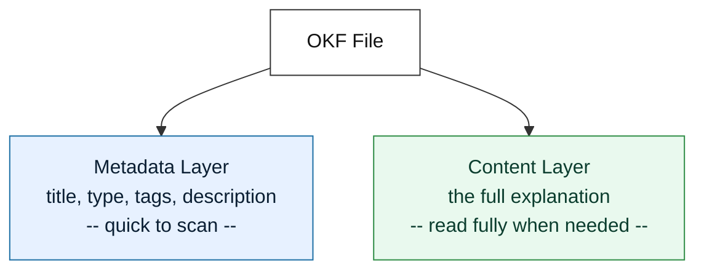
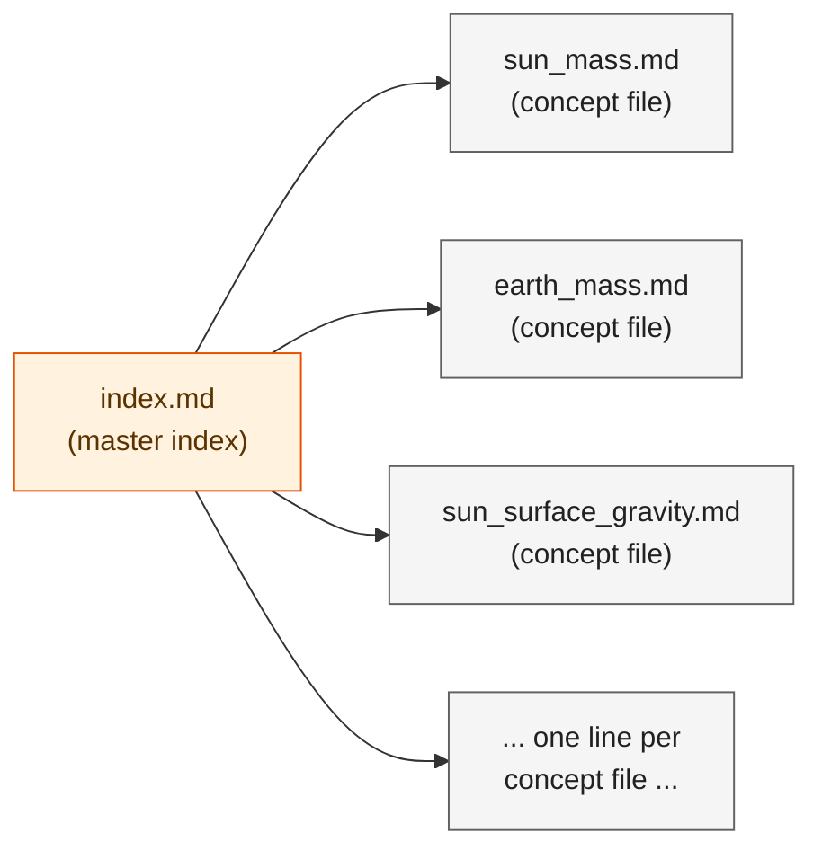
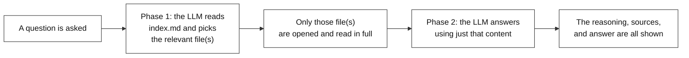
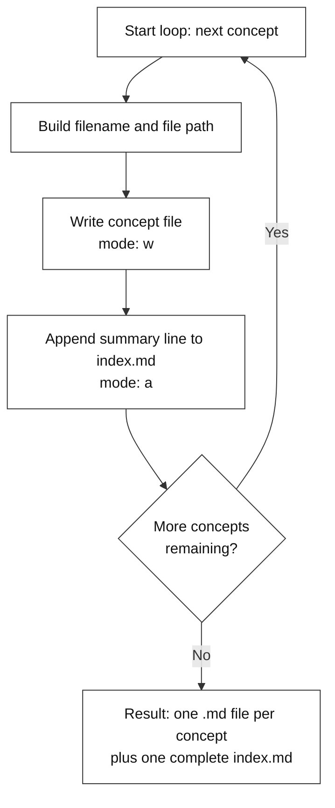
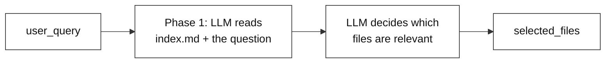
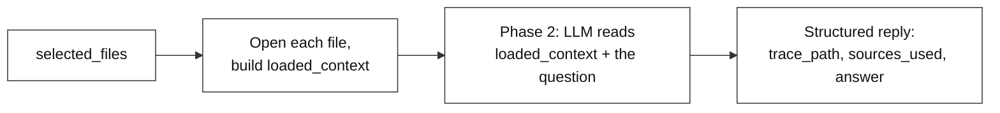

# Lab 1 Guide: Automated Ingestion (Building Structured Knowledge)

---

## 1. What is an LLM Wiki?

**LLM** stands for **Large Language Model** — an AI system that is very good at reading and writing natural language. It can read a document and summarize or restructure what's inside it.

**Wiki** refers to something like Wikipedia — a collection of short, focused pages, where each page explains exactly one topic, supported by an index that helps locate the right page quickly.

An **LLM Wiki** combines the two ideas: it is a Wikipedia-style knowledge base that is built and read by an AI. Instead of a person writing each page by hand, the AI reads the source material and generates the pages. Instead of a person browsing to find the right page, the AI searches the index and reads the relevant page when it needs to answer a question.

---

## 2. What is OKF (Open Knowledge Format)?

If an AI is going to generate knowledge pages automatically, there needs to be one consistent format for what a page looks like. That is what **OKF (Open Knowledge Format)** defines — a simple, consistent structure that every knowledge file follows.

Every OKF file has **two layers**:

1. **Metadata Layer** — short facts about the page: its title, type, tags, and a one-line description. This layer exists so the AI (or a person) can quickly judge relevance without reading the entire file.
2. **Content Layer** — the full explanation itself.



These two layers are kept separate because they serve different purposes. The metadata is meant to be scanned quickly to decide whether a page is relevant. The content is meant to be read in full, but only once the metadata has already confirmed relevance.

As an example, this guide itself follows the same idea. If it were stored as an OKF file, its metadata layer would look like this:

```yaml
title: "Lab 1 Guide: Automated Ingestion (Building Structured Knowledge)"
type: "guide"
tags: ["llm-wiki", "okf", "lab1", "ingestion"]
description: "A step-by-step walkthrough of the Lab 1 notebook: what an LLM Wiki and OKF are, why this approach is used, and what every part of the code does."
```

Everything below that — the explanations, code walkthroughs, and diagrams that follow — is the content layer.

---

## 3. Concept Files and the Master Index

Every individual fact that gets extracted from a document is saved as its own OKF file — this is what we call a **concept file**. One concept file holds exactly one fact, formatted with the metadata and content layers described above.

Sitting alongside all the concept files is one extra file: **`index.md`**, the **master index**. It doesn't hold any facts itself — it holds one short line per concept file, just its filename and a one-sentence description. It works like a table of contents for the whole knowledge base.



This separation matters because it means nobody — human or AI — has to open every concept file just to find the right one. The master index can be scanned quickly to see what exists, and only the relevant concept file(s) need to be opened in full afterward. This is the same "index first, then read only what's needed" idea referenced in Section 1, made concrete — and it's exactly what powers the retrieval steps later in this same lab.

---

## 4. Why Use This Approach

A common way AI tools handle large documents is to split them into small, randomly-sized chunks, then retrieve a handful of chunks that appear similar to a given question. This has a well-known weakness: chunking can separate a fact from the context that explains it, and "appears similar" is not the same as "actually answers the question." When the retrieved chunks don't fully cover the answer, the AI tends to fill the gap with a guess — commonly referred to as **hallucination**.

This workshop avoids that problem by generating one complete, self-contained file per fact or concept, along with a master index describing what exists. When a question is asked later, the AI does not guess from fragments — it checks the index, selects the correct file(s), and reads them in full.

Lab 1 covers both halves of that idea: building this structured knowledge base from a single unstructured PDF, and then actually querying it to get a grounded, explainable answer.

---

## 5. Pipeline Overview

This lab has two connected parts. The first builds the knowledge base. The second queries it.

**Part A — Ingestion (Steps 1–6):** an unstructured PDF is turned into a folder of clean OKF files, plus a master index.


**Part B — Retrieval (Steps 7–10):** a question is answered using only the relevant files from that knowledge base, with a visible explanation of how the answer was reached.



The rest of this guide walks through the notebook that implements both parts, cell by cell.

---

## 6. Code Walkthrough

### Step 1 — Install Required Libraries

```python
!pip install PyPDF2 python-dotenv groq requests
```

This line is commented out because it only needs to run once, during initial setup — not every time the notebook runs. Each library serves a specific purpose:

- **PyPDF2** — opens a PDF file and extracts its plain text.
- **python-dotenv** — reads secret values (such as an API key) from a hidden `.env` file, instead of hardcoding them into the notebook.
- The AI provider's client library — used to communicate with the LLM's API.
- **requests** — a general-purpose library for making internet requests, used internally by some of the other libraries.

### Step 2 — Import Libraries

```python
import os
import json
import PyPDF2
from dotenv import load_dotenv
from groq import Groq
```

Installing a library makes it available on the machine. Importing it brings it into this specific notebook so it can be used.

| Import | Purpose |
|---|---|
| `os` | Working with file paths and folders |
| `json` | Converting JSON-formatted text into a Python dictionary/list |
| `PyPDF2` | Opening the PDF and reading its pages |
| `load_dotenv` | Reading values from the `.env` file |
| The AI client | The client used to send requests to the LLM |

### Step 3 — Set Up API Keys

```python
load_dotenv("../.env")

# Initialize the Native Groq Client
client = Groq(api_key=os.getenv("GROQ_API_KEY"))
```

- This cell loads the secret LLM API key from a hidden `.env` file, and uses it to open a connection to the AI.
- That connection is stored in `client`, which every later call to the AI will use — including the retrieval steps later in this same notebook.
- Keeping the key in a separate `.env` file — instead of typing it directly into the notebook — means the key stays private even if the notebook itself is shared.

### Step 4 — Locate and Read the Document

```python
PDF_PATH = "../SunFactSheet.pdf"

if os.path.exists(PDF_PATH):
    print(f"Success: Found the document at '{PDF_PATH}'")
else:
    print(f"Error: Could not find the document.")

reader = PyPDF2.PdfReader(PDF_PATH)
raw_text = ""
for page in reader.pages:
    raw_text += page.extract_text() + "\n"

print("Text extraction complete! Ready for AI processing.")
```

- This cell first checks that the PDF actually exists at the given location, so the notebook fails with a clear message instead of a confusing crash.
- It then opens the PDF and reads through every page, collecting all the text into one variable, `raw_text`.
- By the end of this cell, the entire PDF exists as one plain block of text — nothing has been summarized yet, it's just been pulled out of the PDF.

### Step 5 — Extract Concepts with the LLM

```python
system_prompt = """
You are a data extraction assistant. Read the text below and extract every distinct technical fact or value present in the source.
Do not limit yourself to a fixed number of facts — extract all of them, no matter how many there are.
Use the same wording as the source text for each fact — do not paraphrase or rename values.
Each fact must have its own separate concept entry, even if two facts are about a related topic.
Keep each "content" field short — 1 to 2 sentences maximum, stating only the fact and its value.
Respond in JSON only, matching this format:
{
  "concepts": [
    {
      "filename": "concept_name.md",
      "type": "concept",
      "title": "Human Readable Title",
      "tags": ["tag1", "tag2"],
      "description": "A single sentence summary",
      "content": "The full detailed explanation in markdown format."
    }
  ]
}
Output ONLY the JSON. No extra text, no markdown formatting blocks.
"""

print("Sending document to Groq for extraction...")

response = client.chat.completions.create(
    model="llama-3.3-70b-versatile", 
    messages=[
        {"role": "system", "content": system_prompt},
        {"role": "user", "content": raw_text}
    ],
    temperature=0.0,
    max_tokens=8000
)

raw_json = response.choices[0].message.content.strip()

try:
    structured_data = json.loads(raw_json)
    concepts = structured_data.get("concepts", [])
    print(f"Success! AI identified {len(concepts)} distinct concepts.")
except json.JSONDecodeError:
    print("Error: The model's JSON response was cut off or malformed.")
    print("Try reducing the amount of source text, or check the raw output below:")
    print(raw_json[-500:])
    concepts = []
```

This is the heart of the ingestion half of the lab, so it helps to think of it in three parts:

- **The instructions.** The notebook first writes out strict instructions telling the AI to extract every fact from the text, keep the original wording, and reply with pure JSON — nothing else.
- **The request.** It then sends the PDF text along with those instructions to the AI, asking it to stay as factual and consistent as possible rather than creative, and giving it enough room in its reply to list out a large number of facts.
- **Reading the reply.** Finally, it takes the AI's answer and converts it from plain text into an actual usable list of facts, `concepts`. If the AI's reply comes back broken or incomplete, this step catches the problem instead of letting the notebook crash, and simply continues with an empty list.

By the end of this cell, every fact the AI found exists as its own small entry, ready to be turned into files.

### Step 6 — Build OKF Files and Update the Index

This step is split across two cells. The diagram below shows what the second cell does before we look at it.



**Cell A — Preparing the output folder and index file:**

```python
output_dir = "../output_wiki"
os.makedirs(output_dir, exist_ok=True)

index_path = os.path.join(output_dir, "index.md")

if not os.path.exists(index_path):
    with open(index_path, "w", encoding="utf-8") as f:
        f.write("# Master Index\n\n")

print(f"Output directory ready at: {output_dir}")
```

- This cell makes sure the `output_wiki` folder exists, creating it if it's the first run.
- It also starts the master index file if one doesn't already exist, without overwriting one from a previous run.

**Cell B — Generating the files:**

```python
for concept in concepts:
    filename = concept['filename'].replace(" ", "_").lower()
    if not filename.endswith('.md'):
        filename += '.md'
        
    file_path = os.path.join(output_dir, filename)
    
    okf_content = f"""type: {concept['type']}
title: {concept['title']}
tags: {concept['tags']}
description: {concept['description']}
---
# {concept['title']}

{concept['content']}
"""
    
    with open(file_path, "w", encoding="utf-8") as f:
        f.write(okf_content)
    
    print(f"Created: {filename}")
    
    with open(index_path, "a", encoding="utf-8") as f:
        f.write(f"- **{filename}**: {concept['description']}\n")
```

- This loop runs once for every fact in `concepts`.
- For each one, it cleans up the filename, builds the OKF-formatted content, and saves it as its own `.md` file.
- Right after saving, it adds one line about that fact to the master index — so the index grows alongside the files, without ever being rewritten from scratch.
- Once the loop finishes, `output_wiki/` holds one file per fact, plus a complete `index.md` listing all of them. This is the exact knowledge base that the retrieval steps below will now query.

### Step 7 — Define the Query

```python
# Set the question you want to ask based on the PDF data
user_query = "What is the magnetic field strength of the Sun's polar field, its sunspots, and its prominences?"

print(f"Question: '{user_query}'")
```

This cell simply defines the question being asked, storing it in `user_query`. Every step from here onward uses this one question to demonstrate how the knowledge base built in Steps 1–6 can actually be queried and answered.

### Step 8 — Two-Step Retrieval Using the Master Index (Phase 1: Routing)

This step doesn't try to answer the question yet — it's just figuring out where to look. The diagram below shows that decision flow before we look at the code.



```python
index_path = "../output_wiki/index.md"
with open(index_path, "r", encoding="utf-8") as f:
    index_content = f.read()

index_system_prompt = """
You are a retrieval assistant. Read the provided Table of Contents and select the files needed to answer the user's question.
You MUST respond in strict JSON format matching this schema:
{
  "files_to_read": ["filename1.md", "filename2.md"]
}
Output ONLY the JSON.
"""

print("Phase 1: Asking the LLM to review index.md and select relevant files...")
response_1 = client.chat.completions.create(
    model="llama-3.3-70b-versatile",
    messages=[
        {"role": "system", "content": index_system_prompt},
        {"role": "user", "content": f"Table of Contents:\n{index_content}\n\nUser Question: {user_query}"}
    ],
    temperature=0.0,
    response_format={"type": "json_object"}
)

retrieval_data = json.loads(response_1.choices[0].message.content)
selected_files = retrieval_data.get("files_to_read", [])

print(f"Success! The LLM requested {len(selected_files)} file(s):")
for file in selected_files:
    print(f" - {file}")
```

- The full index built back in Step 6 is loaded, along with the user's question. Note `index_path` is set again here — this is deliberate, so this step can be run on its own as long as `output_wiki/index.md` already exists on disk, without depending on Step 6 still being in memory.
- The AI is given one narrow job here: act like a librarian, look at the table of contents, and point out which specific file(s) actually cover the topic being asked about.
- The AI replies with a short, clean list of just the filenames it thinks are relevant — nothing has been opened or read in full yet.

### Step 9 — Read Selected Files and Generate the Answer (Phase 2: Answering)

Now that the relevant file(s) have been picked out, this step opens them for real and gets an actual answer. The diagram below shows that flow before the code.



```python
output_dir = "../output_wiki"
loaded_context = ""

for filename in selected_files:
    file_path = os.path.join(output_dir, filename)
    if os.path.exists(file_path):
        with open(file_path, "r", encoding="utf-8") as f:
            loaded_context += f"--- START OF {filename} ---\n{f.read()}\n--- END OF {filename} ---\n\n"
    else:
        print(f"Warning: {filename} not found on disk.")

qa_system_prompt = """
You are an explainable AI system answering user questions using ONLY the provided text from the markdown files.

You MUST respond in strict JSON format with these exact keys:
1. "trace_path": A list of natural language sentences explaining your step-by-step logical thinking process.
2. "sources_used": A list of the specific filenames you used to get the answer.
3. "answer": The direct, clear, and concise answer to the user's question.
"""

print("\nPhase 2: Sending the selected file contents to generate the final answer...")
response_2 = client.chat.completions.create(
    model="llama-3.3-70b-versatile",
    messages=[
        {"role": "system", "content": qa_system_prompt},
        {"role": "user", "content": f"Provided Context:\n{loaded_context}\n\nUser Question: {user_query}"}
    ],
    temperature=0.0,
    response_format={"type": "json_object"}
)
```

- Only the files chosen in Step 8 are opened, and their full content is collected together, clearly labeled by filename. Note `output_dir` is set again here for the same reason as Step 8 — so this cell works standalone.
- That full content is sent to the AI along with the original question, but with a different instruction this time: don't just give an answer, show the reasoning behind it.
- The AI is asked to return three things together: the reasoning it followed, the exact files it relied on, and the final answer — which is what makes the result explainable instead of just a plain, unverifiable reply.

### Step 10 — View the Explainability Trace

```python
final_result = json.loads(response_2.choices[0].message.content)

print("\nEXPLAINABILITY TRACE\n")
for step in final_result.get("trace_path", []):
    print(f"-> {step}")

print("\nSOURCES CITED\n")
for source in final_result.get("sources_used", []):
    print(f"- {source}")

print("\nFINAL ANSWER\n")
print(final_result.get("answer"))
```

This last cell doesn't generate anything new — it just displays what the AI produced in Step 9 in a clean, readable way.

- The reasoning behind the answer is printed first, step by step.
- The exact files used as sources are listed next, so the answer can be traced back to something real.
- The final answer is printed last, now backed by a visible trail of how it was reached instead of just appearing on its own.

---

## 7. Expected Output

**Ingestion (Steps 1–6)** should print one `Created:` line per extracted fact:

```
Created: sun_mass.md
Created: earth_mass.md
Created: sun_to_earth_mass_ratio.md
...
Created: sun_photosphere_composition.md
```

The `output_wiki/` folder should then contain one `.md` file per extracted fact, along with an `index.md` listing each file with its description.

**Retrieval (Steps 7–10)** should print the question, the files selected by Phase 1, and the explainability trace from Phase 2:

```
Question: 'What is the magnetic field strength of the Sun's polar field, its sunspots, and its prominences?'

Phase 1: Asking the LLM to review index.md and select relevant files...
Success! The LLM requested 3 file(s):
 - sun_polar_field_magnetic_field_strength.md
 - sun_sunspots_magnetic_field_strength.md
 - sun_prominences_magnetic_field_strength.md

Phase 2: Sending the selected file contents to generate the final answer...

EXPLAINABILITY TRACE

-> To find the polar field's strength, look at sun_polar_field_magnetic_field_strength.md: 1-2 Gauss.
-> To find the sunspots' strength, look at sun_sunspots_magnetic_field_strength.md: 3000 Gauss.
-> To find the prominences' strength, look at sun_prominences_magnetic_field_strength.md: 10-100 Gauss.

SOURCES CITED
- sun_polar_field_magnetic_field_strength.md
- sun_sunspots_magnetic_field_strength.md
- sun_prominences_magnetic_field_strength.md

FINAL ANSWER
The magnetic field strength of the Sun's polar field is 1-2 Gauss, its sunspots is 3000 Gauss, and its prominences is 10-100 Gauss.
```

Notice that Phase 1 correctly picked exactly the three files relevant to the question — nothing more, nothing less — and Phase 2's answer is fully traceable back to those same three files.

---

## 8. Summary

By the end of Lab 1, an unstructured PDF has been converted into a folder of clean, consistently formatted OKF files, along with a master index describing all of them — generated automatically. That same knowledge base is then queried end-to-end: a question is routed to the right file(s), those files are read in full, and a final answer is produced along with a visible trace of how it was reached. This structured, queryable knowledge base — and the explainable retrieval process built on top of it — is the complete output of this lab.