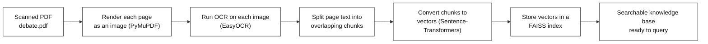
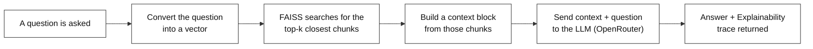
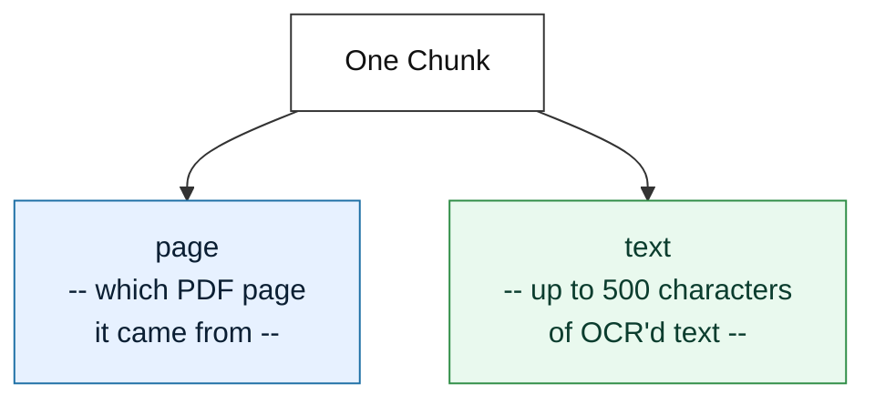
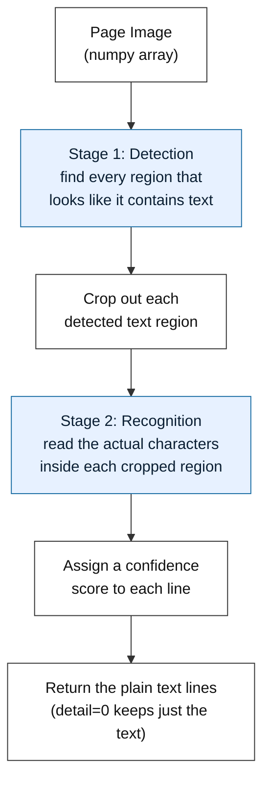
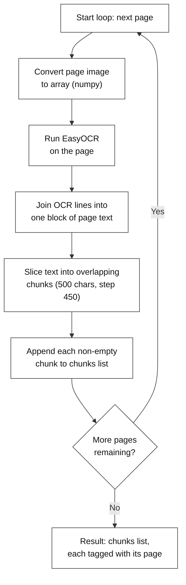
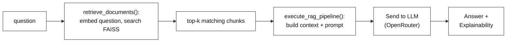

# Automated Document Q&A: OCR + RAG on a Scanned PDF (OpenRouter)

---

# Problem Statement / Use Case Overview

Many important documents — old scanned forms, printed transcripts, faxed reports — exist only as **images of text**, not as text an AI can read directly. Before any question can be answered about a scanned document, the words trapped inside the image have to be pulled out first.

Even once that text exists, a second problem shows up: a scanned document can be long, and an LLM can't just be handed the entire thing for every question — it's inefficient, and it makes the AI more likely to lose track of which part of the document actually answers the question.

This lab solves both problems in one pipeline. It downloads a scanned PDF, reads the text out of each page using local OCR, breaks that text into small overlapping chunks, and stores those chunks in a searchable vector database. When a question comes in, only the handful of chunks that are actually relevant to that question are retrieved and handed to the LLM — along with a trace showing exactly which chunks were used and how.

**This lab has two connected parts:**

1. **Building the searchable index** — turning a scanned PDF into overlapping, embedded text chunks stored in a FAISS vector database.
2. **Querying the index** — asking a question, retrieving the most relevant chunks, and getting a clear, explainable answer back from the LLM.

This is useful for:
- **Scanned or image-only documents** — anything where the text isn't selectable/extractable directly
- **Any case where you want the AI to show its work** — which page(s) and chunk(s) it actually used
- **Answering many different questions against the same document**, once it's been processed a single time

---

# Input Data

| Item | Detail |
|------|--------|
| **The PDF** | A scanned document, downloaded automatically from a link |
| **Your question** | A natural-language question about something in the document |
| **OpenRouter API Key** | Entered manually when prompted — used to call the LLM |

---

# Processing

### Part A — Building the Searchable Index



This diagram shows the full indexing pipeline: the scanned PDF is rendered page-by-page into images, each image is OCR'd into raw text, that text is split into overlapping chunks, each chunk is embedded into a vector, and all vectors are stored in a FAISS index — producing a knowledge base ready to be searched.

### Part B — Querying the Index



This diagram shows the full querying pipeline: the incoming question is converted into a vector, FAISS searches the index for the closest matching chunks, those chunks are assembled into a context block, that context plus the question is sent to the LLM, and the LLM returns both the answer and its explainability trace.

### How Each Chunk Is Organized

Every chunk stored in the index is a small dictionary with just two things in it — which page it came from, and the text itself:



Keeping the page number attached to every chunk is what later lets the final answer cite a specific page instead of just a vague "somewhere in the document."

### How the OCR Model Reads a Page

EasyOCR doesn't read a page the way a human does in one pass — it works in two distinct stages, detection and then recognition:



**Detection** answers "where is there text on this page?" — it scans the whole image and draws a box around every cluster of pixels that looks like it could be a word or line, without trying to read it yet. **Recognition** then takes each of those cropped boxes one at a time and answers "what does this actually say?", converting the pixels inside the box into real characters.

In this lab, `ocr_reader.readtext(page_array, detail=0)` runs both stages internally and hands back just the plain text lines — `detail=0` means the bounding-box coordinates and confidence scores are thrown away, and only the text itself is kept, which is exactly what's needed before chunking.

---

# Output

**Building the index** prints one line per page processed, plus a final chunk count:

```
Running OCR on 2 pages...
Page 1 transcribed! Found 1583 characters.
Page 2 transcribed! Found 1420 characters.

Total chunks created: 7
Success: Indexed 7 chunks into the database.
```

**Querying the index** prints the question, then a two-section answer — a direct answer, followed by a page-by-page explainability breakdown:

```
Asking AI: 'What was the main topic of the debate?'

--- FINAL ANSWER ---
The debate centered on [topic], as discussed across the retrieved pages. (Page 1)

--- EXPLAINABILITY ---
Page 1: USED (Extracted: <short fact from page 1>)
Page 2: NOT USED
Page 2: USED (Extracted: <short fact from page 2>)
```

Only the chunks FAISS actually retrieved for that question are shown in the explainability section — so the answer can always be traced back to specific pages instead of appearing out of nowhere.

---

# Tech Stack

| Component | Tool |
|---|---|
| **PDF Rendering** | PyMuPDF (`fitz`) — opens the PDF and renders each page as an image |
| **File Downloading** | `requests` — grabs the PDF from a link and saves it locally |
| **Image Handling** | Pillow (`PIL`) — stores/handles each rendered page as an image object |
| **OCR** | EasyOCR — reads the text out of each page image locally (CPU) |
| **Embeddings** | Sentence-Transformers (`all-MiniLM-L6-v2`) — turns text chunks into vectors |
| **Vector Search** | FAISS (`IndexFlatL2`) — stores chunk vectors and finds the closest matches to a question |
| **LLM** | `openai/gpt-oss-20b:free` via OpenRouter — answers the question using only the retrieved chunks |
| **Environment** | API key entered manually at runtime via `input()` |

---

# Underlying Concepts (Summarized)

**OCR** stands for **Optical Character Recognition** — software that looks at an image and reads the text inside it, the same way a person would, turning pixels into actual words a program can work with.

**Embeddings** are a way of turning text into a list of numbers (a vector) that captures its meaning. Two chunks of text that mean similar things end up with vectors that are close to each other — which is what makes it possible to search by *meaning* instead of by exact keyword matches.

**FAISS** is a library built for storing large numbers of these vectors and quickly finding which ones are closest to a new vector — in this lab, that "new vector" is the question, and the closest stored vectors are the chunks most likely to contain the answer.

**RAG** stands for **Retrieval-Augmented Generation** — instead of asking an LLM to answer purely from what it already knows, the relevant text is *retrieved* first and handed to the LLM as context, so the answer is grounded in the actual source document rather than the model's memory.

This lab also uses **overlapping chunks**: each chunk is 500 characters long, but the next chunk only starts 450 characters later, so consecutive chunks share 50 characters of overlap. This exists so an important sentence sitting right at a chunk boundary doesn't get cut in half and lost from both chunks.

> **Why this matters:** Instead of sending an entire scanned document to the LLM (or guessing which part matters), the pipeline narrows down to just the chunks whose *meaning* matches the question, and asks the LLM to point to exactly which pages it used. That's what makes the final answer traceable back to something real, instead of just appearing on its own.

---

# Pre-requisites

- **Basic familiarity** with Python (functions, loops, `import` statements).
- **An OpenRouter API Key** — entered manually when the notebook prompts for it.
- **High-level understanding** of what OCR, embeddings, and a vector database are (covered above).

---

# Environment / Dependencies Setup

The cell below installs all required Python packages:

| Package | Purpose |
|---------|---------|
| `pymupdf` (`fitz`) | **PDF rendering** — opens the PDF and renders each page as an image |
| `Pillow` | Basic image handling in Python |
| `sentence-transformers` | **Embeddings** — turns text chunks into vectors for search |
| `faiss-cpu` | **Vector database** — fast similarity search over those vectors |
| `requests` | **File downloading** — grabs the PDF from a link, and later calls the LLM API |
| `easyocr` | **OCR** — reads the text out of each page image |

> **Note:** Run this cell first — it only needs to be run once per session.

```python
!pip install pymupdf Pillow sentence-transformers faiss-cpu requests easyocr
```

## Import Libraries

```python
import os  
import time  
import requests  
import numpy as np  # work with the OCR image arrays  

import fitz  # PyMuPDF -> renders PDF pages to images
from PIL import Image  # store/handle each rendered page as an image

import easyocr  # Local OCR model
from sentence_transformers import SentenceTransformer  # Text to vector model
import faiss  # Vector search database
```

| Import | Purpose |
|---|---|
| `os` | Working with file paths and folders |
| `time` | Available for optional timing/debugging use |
| `requests` | Downloads the PDF, and later calls the OpenRouter API |
| `numpy` | Converts each page image into an array EasyOCR can read |
| `fitz` (PyMuPDF) | Opens the PDF and renders each page as an image |
| `Image` (Pillow) | Holds each rendered page as an image object |
| `easyocr` | Reads text out of each page image |
| `SentenceTransformer` | Converts text chunks (and questions) into vectors |
| `faiss` | Stores those vectors and searches them |

## Configure the OpenRouter API Key

```python
OPENROUTER_API_KEY = input("Please enter your OpenRouter API key manually: ").strip()

# Endpoint + model we'll use later to ask questions about the document
OPENROUTER_URL = "https://openrouter.ai/api/v1/chat/completions"
TEXT_MODEL = "openai/gpt-oss-20b:free"
```

This key is entered once per session and reused for every LLM call later in the notebook.

## Initialize Local AI Models

```python
print("Loading embedding model (for vector search)...")
embed_model = SentenceTransformer("all-MiniLM-L6-v2")

print("Loading EasyOCR model (for reading text from images)...")
# gpu=False forces CPU mode. Change to True if you have a powerful NVIDIA GPU.
ocr_reader = easyocr.Reader(["en"], gpu=False)

print("Models loaded successfully!")
```

Both models run **locally** — no API call is needed to embed text or read text out of an image. These two model objects, `embed_model` and `ocr_reader`, are reused for everything later in the notebook.

---

# Step-wise Instructions — Development

---

### Step 1 — Download the Scanned PDF

The PDF is downloaded directly from a link and saved locally, ready to be opened in the next step.

```python
PDF_URL = "https://raw.githubusercontent.com/jamalmazrui/pdf2ocr/master/debate.pdf"
os.makedirs("data", exist_ok=True)  # create a "data" folder if it doesn't exist yet
PDF_PATH = os.path.join("data", "debate.pdf")

# Download the sample scanned PDF and save it locally.
try:
    print("Downloading PDF...")
    r = requests.get(PDF_URL)
    r.raise_for_status()  # stop here if the download failed (e.g. bad URL, no internet)
    
    with open(PDF_PATH, "wb") as f:
        f.write(r.content)
    print(f"Success! Saved PDF to: {PDF_PATH}")
except Exception as e:
    print(f"Error downloading PDF: {e}")
```

By the end of this step, the raw PDF file exists locally at `data/debate.pdf` — nothing has been read out of it yet.

---

### Step 2 — Convert PDF Pages to Images

OCR can't read a PDF directly — it needs an image. This step renders every page of the PDF into its own image, scaled up for better OCR accuracy.

```python
pages = []  # will hold one PIL Image per PDF page

try:
    doc = fitz.open(PDF_PATH)
    zoom = 200 / 72  # Scale up for better image quality (simulating 200 DPI)
    matrix = fitz.Matrix(zoom, zoom)  # transform used when rendering each page

    for page in doc:
        pix = page.get_pixmap(matrix=matrix)  # render the page to raw pixels
        img = Image.frombytes("RGB", [pix.width, pix.height], pix.samples)  # turn those pixels into a normal image object
        pages.append(img)

    doc.close()
    print(f"Success: Converted {len(pages)} pages into images.")
except Exception as e:
    print(f"Error reading PDF: {e}")
```

By the end of this step, `pages` holds one image per PDF page, ready to be handed to the OCR model.

---

### Step 3 — Run OCR and Build Overlapping Chunks

This step does two jobs in one loop: read the text out of each page image, then immediately split that text into small overlapping chunks ready for the vector database.



```python
TEST_PAGE_LIMIT = 2  # only process the first 2 pages for this test run
pages_to_process = pages[:TEST_PAGE_LIMIT]
print(f"Running OCR on {len(pages_to_process)} pages...")

chunks = []  # We will store our text chunks here
chunk_size = 450  # how far we move forward for each new chunk (see overlap note below)

for i, page_img in enumerate(pages_to_process, start=1):
    # Convert image to a format EasyOCR understands
    page_array = np.array(page_img)

    # Extract text from the image
    lines = ocr_reader.readtext(page_array, detail=0)
    full_page_text = "\n".join(lines)

    # Split the page text into smaller chunks for our vector database.
    # Each chunk is 500 characters, but we only step forward by 450 -> chunks
    # overlap by 50 characters so we don't accidentally cut a sentence in half
    # right at a chunk boundary.
    for start_idx in range(0, len(full_page_text), chunk_size):
        piece = full_page_text[start_idx : start_idx + 500].strip()
        if piece:
            chunks.append({"page": i, "text": piece})

    print(f"Page {i} transcribed! Found {len(full_page_text)} characters.")

print(f"\nTotal chunks created: {len(chunks)}")
```

By the end of this step, `chunks` holds every overlapping piece of text from the processed pages, each one tagged with the page number it came from — ready to be embedded in the next step.

---

### Step 4 — Build the Vector Database (FAISS)

Every chunk of text gets converted into a vector, and all of those vectors are loaded into a FAISS index so they can be searched later.

```python
# Get just the text from our chunks
chunk_texts = [c["text"] for c in chunks]

# Convert text to vectors
print("Converting text to vectors...")
embeddings = embed_model.encode(chunk_texts, convert_to_numpy=True)

# Build the FAISS index
index = faiss.IndexFlatL2(embeddings.shape[1])
index.add(embeddings)

print(f"Success: Indexed {index.ntotal} chunks into the database.")
```

By the end of this step, `index` is a fully searchable vector database — this, together with the `chunks` list, is the knowledge base the next steps will query.

---

### Step 5 — Define the RAG Pipeline

This step defines two functions that work together: one finds the relevant chunks for a question, the other turns those chunks into a full, explainable answer.



**`retrieve_documents` — finds the relevant chunks:**

```python
def retrieve_documents(question, k=3):
    """Searches the FAISS database for the most relevant text chunks."""
    try:
        # Convert the question to a vector and search FAISS
        q_vec = embed_model.encode([question], convert_to_numpy=True)
        _, idx = index.search(q_vec, k)
        
        # Grab the actual chunks based on the search results
        retrieved_chunks = [chunks[i] for i in idx[0]]
        return retrieved_chunks
    except Exception as e:
        print(f"Retrieval Error: {e}")
        return []
```

**`execute_rag_pipeline` — builds the prompt and gets the answer:**

```python
def execute_rag_pipeline(question):
    """Runs RAG and gets both the answer and source reasoning in a single call."""
    
    sources = retrieve_documents(question)
    if not sources:
        return "No sources found."
        
    # Format context with page numbers clearly labeled
    context_block = "\n\n".join([f"--- Context Block (Page {c['page']}) ---\n{c['text']}" for c in sources])
    
    # This is the instruction ("prompt") we send to the AI model, telling it
    # exactly how to answer and how to format its response.
    qa_prompt = f"""
    You are an expert assistant. Answer the question using ONLY the provided context blocks.
    
    Context:
    {context_block}
    
    Question: {question}
    
    CRITICAL INSTRUCTIONS:
    Output your response in EXACTLY two sections as shown below.
    
    --- FINAL ANSWER ---
    [Provide a direct, 1-sentence answer without bold text or markdown formatting. End with simple citation like (Page X).]
    
    --- EXPLAINABILITY ---
    [For each Context Block provided above, list Page X and state either "NOT USED" or "USED (Extracted: <1 short fact>)"]
    """
    
    payload = {
        "model": TEXT_MODEL,
        "messages": [{"role": "user", "content": qa_prompt}],
        "temperature": 0.0
    }
    headers = {"Authorization": f"Bearer {OPENROUTER_API_KEY}"}
    
    try:
        resp = requests.post(OPENROUTER_URL, headers=headers, json=payload)
        resp.raise_for_status()
        return resp.json()["choices"][0]["message"]["content"].strip()
    except Exception as e:
        return f"An error occurred: {e}"
```

`retrieve_documents` handles Part B's retrieval step — turning a question into a vector and pulling back the `k` closest chunks. `execute_rag_pipeline` takes those chunks, labels each one by page number, and asks the LLM for a direct answer *and* a page-by-page explanation of what it used and what it ignored — all in a single API call.

---

### Step 6 — Run a Query and See the Explainable Answer

```python
user_query = "What was the main topic of the debate?"

print(f"Asking AI: '{user_query}'\n")

# Single call gets both answer and explainability
result = execute_rag_pipeline(user_query)

print(result)
```

This is where everything built in Steps 1–5 gets used end-to-end: the question is embedded, FAISS finds the closest chunks, those chunks are sent to the LLM with page labels, and the printed result shows both the final answer and exactly which pages it came from.

---

# What We Learnt

By the end of this lab, a scanned PDF has been turned into a searchable vector index — built automatically from local OCR, chunking, and embeddings, with no manual data entry. That index is then queried end-to-end: a question is embedded, the closest chunks are retrieved, and a final answer is produced along with a visible, page-by-page trail of how it was reached.

**Key takeaways:**
- **OCR turns images into searchable text** — nothing after Step 3 works without it.
- **Overlapping chunks protect against losing information at boundaries** — a 50-character overlap means a sentence split across two chunks still appears in full in at least one of them.
- **Search by meaning, not by keyword** — embeddings + FAISS let the pipeline find the *right* chunks even if the question doesn't use the exact same words as the document.
- **Answers come with proof** — every answer includes a page-by-page breakdown of what was used and what wasn't.
- **Building the index is a one-time cost** — once `chunks` and `index` exist, `execute_rag_pipeline` can be called with as many different questions as needed.