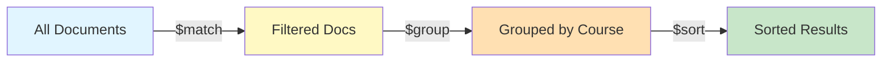
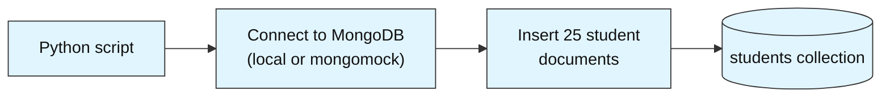
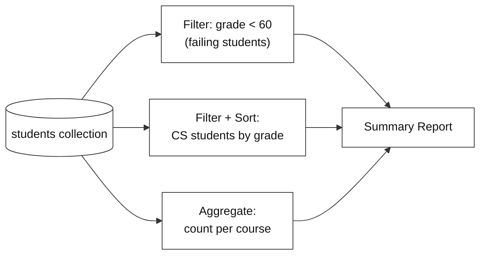

# Student Records Lookup System

**Difficulty: Beginner | ~35 min | No prerequisites**

---

# Problem Statement / Use Case Overview

A university administrator needs to manage and query a growing collection of student records. They want to quickly answer questions like "which students are currently failing?", "list all Computer Science students sorted by grade", and "how many students are enrolled in each course?" — all without writing complex SQL joins or managing rigid table schemas.

This lab walks you through building a queryable mini student database using MongoDB. You will learn how to connect to a MongoDB instance, design a flexible document schema, insert a realistic dataset of 25 student records, and then use MongoDB's built-in query operators to filter, sort, and project the data — finishing with a printed summary report that answers real administrative questions.

Before diving into the code, it helps to understand the core MongoDB concepts this lab uses.

### Document Databases vs. Relational Databases

Traditional relational databases (MySQL, PostgreSQL) store data in **tables** with fixed columns and rows. Every row must conform to the same schema — if you want to add a new field, you must alter the table first. MongoDB is a **document database**: it stores data as **documents** (JSON-like objects) inside **collections** (roughly equivalent to tables). Each document can have a different structure, so adding a new field to one student record doesn't require changing any others.

### Documents and Collections

A **document** is a key-value pair structure — think of it as a Python dictionary. For example:

```python
{"name": "Alice", "course": "CS", "grade": 92}
```

A **collection** is a group of documents, like a table of rows. In this lab, the `students` collection holds 25 documents, each representing one student.

### CRUD Operations

MongoDB supports four core operations:

- **Create** — `insert_one()` or `insert_many()` to add documents
- **Read** — `find()` with a filter to query documents
- **Update** — `update_one()` or `update_many()` to modify documents
- **Delete** — `delete_one()` or `delete_many()` to remove documents

This lab focuses on **Create** (inserting students) and **Read** (filtering, sorting, aggregating).

### Query Filters and Sorting

MongoDB uses Python dictionaries as query filters. For example, `{"grade": {"$lt": 60}}` means "find all documents where the grade field is less than 60." Sorting is done with `.sort("field_name", 1)` for ascending or `-1` for descending.

### Aggregation Pipelines

An **aggregation pipeline** is a sequence of stages that transform data step by step. Each stage takes input, processes it, and passes the result to the next stage. The `$group` stage groups documents by a field (e.g., course), and `$sum` tallies how many documents are in each group.



> **Why this matters:** Understanding the difference between a document database and a relational database is the first step to deciding which tool fits your project. MongoDB's flexible schema makes it a natural choice for applications where the data shape evolves over time — user profiles, product catalogs, or, as in this lab, student records.

---

# Input Data

| Item | Detail |
|------|--------|
| **Student records** | 25 synthetic records generated inline in the notebook |
| **Fields per record** | `name`, `student_id`, `course`, `grade`, `enrollment_date`, `status` |
| **Courses covered** | Computer Science, Mathematics, Physics, English, Biology |
| **Grade range** | 45–98 (some intentionally failing, below 60) |
| **Status values** | `active`, `inactive`, `graduated` |

---

# Processing

### Part A — Building the Database



The notebook connects to a MongoDB instance, creates a `students` collection inside a `school_db` database, and bulk-inserts 25 student documents in one operation.

### Part B — Querying the Data



Three types of queries are run against the same collection: a filter query to find failing students, a filtered sort to list top performers in a specific course, and an aggregation pipeline to count students per course. All results are collected into a single printed summary report.

---

# Output

**Inserting documents** confirms the count:

```
Inserted 25 student records.
```

**Query 1 — Failing students** (grade below 60):

```
--- Students Currently Failing (Grade < 60) ---
Charlie Brown        | Physics         | Grade: 55 | Status: active
Diana Prince         | English         | Grade: 48 | Status: active
Frank Castle         | Mathematics     | Grade: 52 | Status: inactive
Laura Palmer         | Biology         | Grade: 45 | Status: active
Rosa Parks           | English         | Grade: 58 | Status: inactive
Walt Disney          | Physics         | Grade: 56 | Status: active
```

**Query 2 — Computer Science students sorted by grade:**

```
--- Computer Science Students (Sorted by Grade) ---
Alice Johnson        | Grade: 95 | Status: active
Grace Hopper         | Grade: 91 | Status: active
Quincy Adams         | Grade: 87 | Status: active
Ivan Petrov          | Grade: 84 | Status: active
Yusuf Islam          | Grade: 70 | Status: active
Uma Thurman          | Grade: 62 | Status: active
```

**Query 3 — Course enrollment counts:**

```
--- Enrollment Count by Course ---
Computer Science     | 6 students
English              | 5 students
Mathematics          | 5 students
Physics              | 5 students
Biology              | 4 students
```

**Summary report** ties it all together in one formatted block.

---

# Tech Stack

| Component | Tool |
|-----------|------|
| **MongoDB driver** | `pymongo==4.10.1` — Python driver for MongoDB |
| **Mock server** | `mongomock` — in-memory MongoDB simulation, no install required |

> **Note:** `mongomock` lets you practice MongoDB queries without installing a MongoDB server. The queries you write are identical to those you would run against a real MongoDB instance — only the connection step changes.

---

# Prerequisites

- **Basic Python knowledge** — variables, lists, dictionaries, loops, and `import` statements.
- **No MongoDB experience required** — this lab teaches you from scratch.
- **No database installation required** — we use `mongomock`, an in-memory simulation.

---

# Environment / Dependencies Setup

| Package | Purpose |
|---------|---------|
| `pymongo` | Python driver for MongoDB — used to connect, insert, and query |
| `mongomock` | In-memory mock of MongoDB — no server installation needed |

```bash
pip install -qU pymongo==4.10.1 mongomock
```

> **Note:** Run this command once in your terminal before opening the notebook, or run the first code cell in the notebook which does the same thing.

---

# Step-wise Development Instructions

---

### Step 1 — Connect to MongoDB

```python
import pymongo
import mongomock

# Create an in-memory MongoDB client (no server needed)
# To use a real MongoDB server, replace with: client = pymongo.MongoClient("mongodb://localhost:27017/")
client = mongomock.MongoClient()

# Access (or create) the database and collection
db = client["school_db"]
students = db["students"]

print("Connected to MongoDB (in-memory mock)")
```

We create a `mongomock.MongoClient()` which behaves exactly like a real MongoDB connection but runs in memory. To switch to a real server later, you only change this one line.

---

### Step 2 — Design and Insert Student Records

```python
# 25 student records across 5 courses with varying grades
# Some students have grades below 60 (failing) to make queries interesting
student_records = [
    {"name": "Alice Johnson",    "student_id": "STU001", "course": "Computer Science", "grade": 95, "enrollment_date": "2024-09-01", "status": "active"},
    {"name": "Bob Smith",        "student_id": "STU002", "course": "Mathematics",      "grade": 78, "enrollment_date": "2024-09-01", "status": "active"},
    {"name": "Charlie Brown",    "student_id": "STU003", "course": "Physics",          "grade": 55, "enrollment_date": "2024-09-02", "status": "active"},
    {"name": "Diana Prince",     "student_id": "STU004", "course": "English",          "grade": 48, "enrollment_date": "2024-09-01", "status": "active"},
    {"name": "Eve Torres",       "student_id": "STU005", "course": "Biology",          "grade": 88, "enrollment_date": "2024-09-03", "status": "active"},
    {"name": "Frank Castle",     "student_id": "STU006", "course": "Mathematics",      "grade": 52, "enrollment_date": "2024-09-01", "status": "inactive"},
    {"name": "Grace Hopper",     "student_id": "STU007", "course": "Computer Science", "grade": 91, "enrollment_date": "2024-09-02", "status": "active"},
    {"name": "Hank Pym",         "student_id": "STU008", "course": "Physics",          "grade": 73, "enrollment_date": "2024-09-01", "status": "active"},
    {"name": "Ivan Petrov",      "student_id": "STU009", "course": "Computer Science", "grade": 84, "enrollment_date": "2024-09-03", "status": "active"},
    {"name": "Julia Child",      "student_id": "STU010", "course": "English",          "grade": 90, "enrollment_date": "2024-09-02", "status": "graduated"},
    {"name": "Karl Marx",        "student_id": "STU011", "course": "Mathematics",      "grade": 67, "enrollment_date": "2024-09-01", "status": "active"},
    {"name": "Laura Palmer",     "student_id": "STU012", "course": "Biology",          "grade": 45, "enrollment_date": "2024-09-02", "status": "active"},
    {"name": "Marco Polo",       "student_id": "STU013", "course": "Physics",          "grade": 82, "enrollment_date": "2024-09-03", "status": "active"},
    {"name": "Nina Simone",      "student_id": "STU014", "course": "English",          "grade": 76, "enrollment_date": "2024-09-01", "status": "active"},
    {"name": "Oscar Wilde",      "student_id": "STU015", "course": "Mathematics",      "grade": 93, "enrollment_date": "2024-09-02", "status": "active"},
    {"name": "Pia Zadora",       "student_id": "STU016", "course": "Biology",          "grade": 71, "enrollment_date": "2024-09-01", "status": "active"},
    {"name": "Quincy Adams",     "student_id": "STU017", "course": "Computer Science", "grade": 87, "enrollment_date": "2024-09-03", "status": "active"},
    {"name": "Rosa Parks",       "student_id": "STU018", "course": "English",          "grade": 58, "enrollment_date": "2024-09-02", "status": "inactive"},
    {"name": "Sam Wilson",       "student_id": "STU019", "course": "Physics",          "grade": 98, "enrollment_date": "2024-09-01", "status": "active"},
    {"name": "Tina Turner",      "student_id": "STU020", "course": "Mathematics",      "grade": 79, "enrollment_date": "2024-09-03", "status": "active"},
    {"name": "Uma Thurman",      "student_id": "STU021", "course": "Computer Science", "grade": 62, "enrollment_date": "2024-09-02", "status": "active"},
    {"name": "Vera Wang",        "student_id": "STU022", "course": "Biology",          "grade": 85, "enrollment_date": "2024-09-01", "status": "graduated"},
    {"name": "Walt Disney",      "student_id": "STU023", "course": "Physics",          "grade": 56, "enrollment_date": "2024-09-02", "status": "active"},
    {"name": "Xena Warrior",     "student_id": "STU024", "course": "English",          "grade": 94, "enrollment_date": "2024-09-03", "status": "active"},
    {"name": "Yusuf Islam",      "student_id": "STU025", "course": "Computer Science", "grade": 70, "enrollment_date": "2024-09-01", "status": "active"},
]

# insert_many() adds all documents to the collection in one call
result = students.insert_many(student_records)
print(f"Inserted {len(result.inserted_ids)} student records.")
```

Each dictionary is a **document** — MongoDB's equivalent of a row. Unlike SQL, there's no table definition needed; you simply insert documents and MongoDB stores them as-is.

---

### Step 3 — Query: Find Failing Students

```python
# Find all students with a grade below 60
# {"grade": {"$lt": 60}} means "grade less than 60"
# {"_id": 0} is a projection that hides MongoDB's auto-generated _id field
failing_students = students.find(
    {"grade": {"$lt": 60}},
    {"_id": 0}
)

print("--- Students Currently Failing (Grade < 60) ---")
for s in failing_students:
    print(f"{s['name']:<20} | {s['course']:<15} | Grade: {s['grade']} | Status: {s['status']}")
```

The filter `{"grade": {"$lt": 60}}` uses MongoDB's **less than** operator. The second argument `{"_id": 0}` is a **projection** — it excludes the auto-generated `_id` field, keeping output clean.

---

### Step 4 — Query: List CS Students Sorted by Grade

```python
# Find all Computer Science students, sorted by grade descending (highest first)
cs_students = students.find(
    {"course": "Computer Science"},
    {"_id": 0}
).sort("grade", -1)  # -1 = descending order

print("--- Computer Science Students (Sorted by Grade) ---")
for s in cs_students:
    print(f"{s['name']:<20} | Grade: {s['grade']} | Status: {s['status']}")
```

This chains a **filter** (`{"course": "Computer Science"}`) with a **sort** (`.sort("grade", -1)`). Use `1` instead of `-1` to sort ascending (lowest first).

---

### Step 5 — Query: Enrollment Count by Course (Aggregation)

```python
# Aggregation pipeline: group by course, then count students in each
pipeline = [
    {"$group": {"_id": "$course", "count": {"$sum": 1}}},
    {"$sort": {"count": -1}}
]

course_counts = students.aggregate(pipeline)

print("--- Enrollment Count by Course ---")
for doc in course_counts:
    print(f"{doc['_id']:<20} | {doc['count']} students")
```

An **aggregation pipeline** processes data in stages. `$group` groups documents by `course` and counts them with `$sum: 1`. `$sort` then orders by count, highest first. This is MongoDB's equivalent of SQL's `GROUP BY course ORDER BY count DESC`.

---

### Step 6 — Print Summary Report

```python
# Re-run queries to collect data for the summary
failing = list(students.find({"grade": {"$lt": 60}}, {"_id": 0}))
top_cs = list(students.find({"course": "Computer Science"}, {"_id": 0}).sort("grade", -1))
enrollment = list(students.aggregate([
    {"$group": {"_id": "$course", "count": {"$sum": 1}}},
    {"$sort": {"count": -1}}
]))

print("         STUDENT RECORDS SUMMARY REPORT")

print(f"\nTotal records in database: {students.count_documents({})}")
print(f"Students currently failing (grade < 60): {len(failing)}")

print("\n--- Failing Students ---")
for s in failing:
    print(f"  {s['name']} ({s['course']}) — Grade: {s['grade']}")

print(f"\n--- Top CS Student ---")
if top_cs:
    top = top_cs[0]
    print(f"  {top['name']} — Grade: {top['grade']}")

print("\n--- Course Enrollment ---")
for doc in enrollment:
    print(f"  {doc['_id']}: {doc['count']} students")
```

This final cell collects all results into a formatted summary report — the kind of output an administrator would actually want to see.

---

# Optional Exercise

Replace the `mongomock` in-memory client with a real MongoDB server running locally. Install MongoDB Community Edition, start the server, change the connection line from `mongomock.MongoClient()` to `pymongo.MongoClient("mongodb://localhost:27017/")`, and re-run the entire notebook. Verify that the same 25 records are inserted and the same queries return the same results.

---

# What We Learnt

- **Document databases store flexible, JSON-like documents** instead of rigid table rows — each record can have different fields without requiring schema changes.
- **Collections are MongoDB's equivalent of tables** — they group related documents together and are created automatically when you first insert data.
- **`pymongo` is the standard Python driver for MongoDB** — `MongoClient()` connects to the server, and the connection string is the only thing that changes between local, remote, and mock instances.
- **`insert_many()` bulk-inserts a list of dictionaries** as documents — no table creation or column definition needed beforehand.
- **Query filters use dictionary syntax** — `{"grade": {"$lt": 60}}` means "grade less than 60," and multiple conditions can be combined in one filter.
- **Projections control which fields are returned** — `{"_id": 0}` hides the auto-generated `_id`, and you can include or exclude any field.
- **`.sort("field", -1)` orders results** — `1` for ascending, `-1` for descending, and it chains naturally with `.find()`.
- **Aggregation pipelines transform data in stages** — `$group` groups by a field, `$sum` counts, and `$sort` orders — MongoDB's equivalent of SQL's `GROUP BY`.
