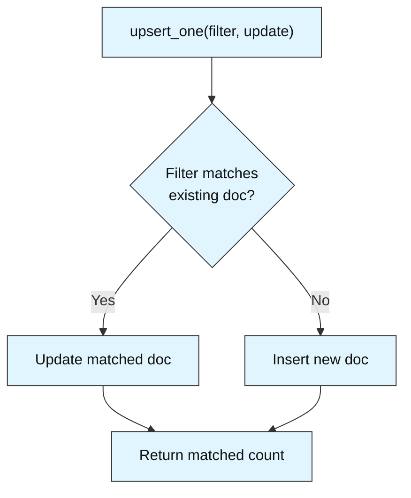
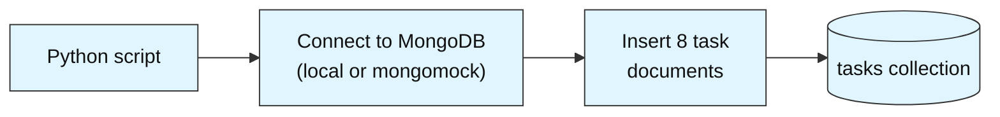
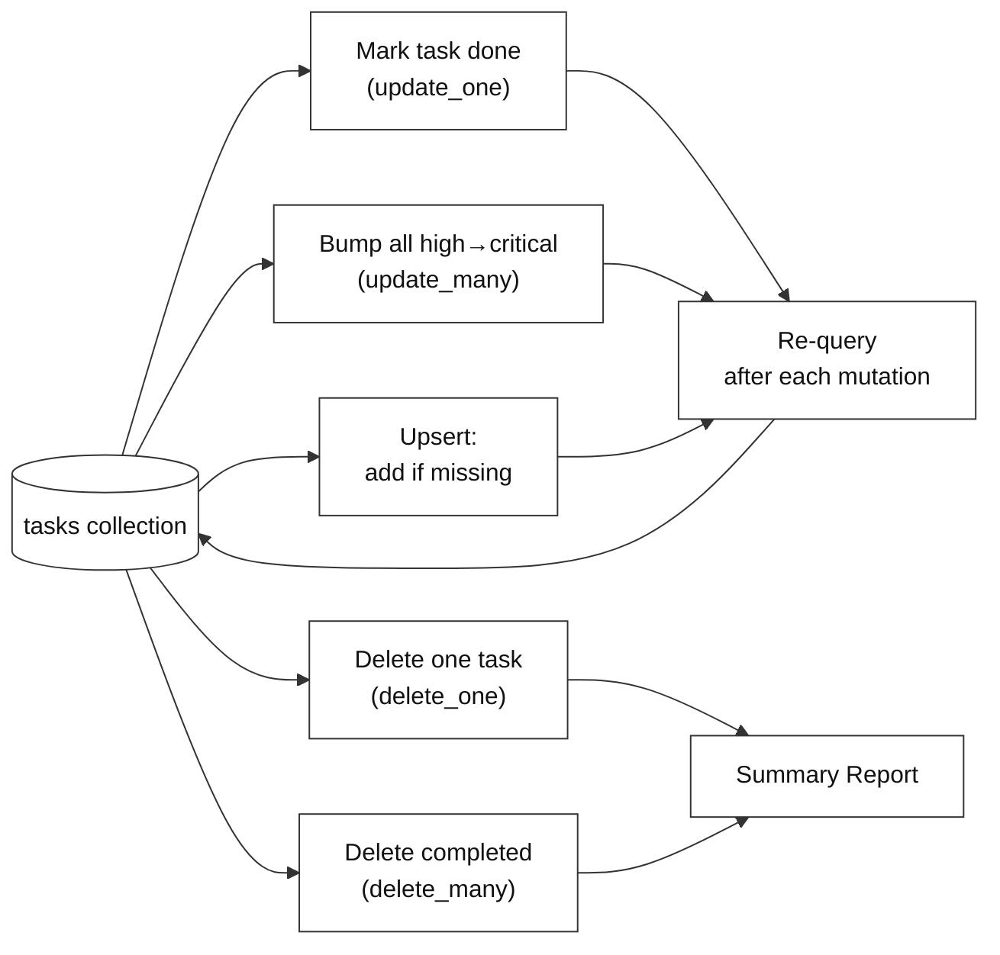

# MongoDB Basics: How to Write, Update & Delete Data

**Difficulty: Beginner | ~40 min | No prerequisites**

*Lab 2 of 7 in the MongoDB Mastery series.*

---

# Problem Statement / Use Case Overview

A project manager needs a lightweight task tracker that supports the full lifecycle of work items — creating tasks, updating their status as work progresses, reassigning priorities, and removing completed items from the active list. They want to see data change over time as tasks move through different states, not just query a static snapshot.

This lab walks you through building a personal task tracker using MongoDB. You will learn how to connect to a MongoDB instance, insert individual and bulk task records, update task state (mark done, bump priority, edit due dates), use upserts to add-if-missing-or-update, and delete finished tasks — finishing with a summary report that reflects the tracker's current state after every mutation.

This is the write-heavy lab. Lab 1 covered how to insert data and query it. This lab covers what happens when data changes — updates, deletes, and upserts. After each change, you will re-query the data to see it update in real time.

Before diving into the code, it helps to understand the core MongoDB concepts this lab uses.

### Documents and Collections

A **document** is a key-value pair structure — think of it as a Python dictionary. For example:

```python
{"title": "Write report", "status": "pending", "priority": "high"}
```

A **collection** is a group of documents, like a table of rows. In this lab, the `tasks` collection holds task documents, each representing one work item.

### CRUD Operations

MongoDB supports four core operations:

- **Create** — `insert_one()` or `insert_many()` to add documents
- **Read** — `find()` with a filter to query documents
- **Update** — `update_one()` or `update_many()` to modify documents
- **Delete** — `delete_one()` or `delete_many()` to remove documents

This lab covers all four, giving you the full picture of how data flows through a MongoDB database.

### Update Operators

MongoDB provides **update operators** that modify specific fields without replacing the entire document:

- `$set` — sets a field to a new value
- `$unset` — removes a field entirely
- `$inc` — increments a numeric field by a given amount

For example, `{"$set": {"status": "done"}}` changes only the `status` field, leaving everything else untouched. This is more efficient and safer than replacing the whole document.

### Upserts

An **upsert** is a combination of "update" and "insert." If the filter matches an existing document, it updates it. If nothing matches, it inserts a new document. This is useful when you want to add a task if it doesn't already exist, or update it if it does — all in one operation.



> **Why this matters:** In Lab 1 you learned how to insert and query data. But real applications need to change data too — marking tasks done, updating prices, removing old records. Understanding the full CRUD lifecycle (Create, Read, Update, Delete) is essential for building applications that manage real data. Task trackers, shopping carts, and user profiles all depend on reliable update and delete operations.

---

# Input Data

| Item | Detail |
|------|--------|
| **Task records** | 8 sample tasks generated inline in the notebook |
| **Fields per record** | `title`, `description`, `priority`, `status`, `due_date`, `category` |
| **Priority values** | `critical`, `high`, `medium`, `low` |
| **Status values** | `pending`, `in_progress`, `completed` |
| **Categories** | `work`, `personal`, `learning` |

---

# Processing

### Part A — Building the Database



The notebook connects to a MongoDB instance, creates a `tasks` collection inside a `task_db` database, and inserts 8 task documents using both `insert_one()` and `insert_many()`.

### Part B — Mutating and Querying the Data



After every write operation, the notebook re-queries the collection so you can see the data change in real time — the write-heavy counterpart to Lab 1's read-heavy focus.

---

# Output

**Inserting documents** confirms the counts:

```
Inserted 1 task with insert_one().
Inserted 7 tasks with insert_many().
Total tasks in collection: 8
```

**Query 1 — All tasks (after insert):**

```
--- All Tasks (after insert) ---
Design login page       | critical | pending    | 2026-01-20
Write unit tests        | high     | pending    | 2026-01-25
Fix navigation bug      | critical | pending    | 2026-01-22
Deploy staging server   | medium   | pending    | 2026-02-01
Learn Docker basics     | low      | pending    | 2026-02-10
Review pull requests    | high     | pending    | 2026-01-28
Update documentation    | medium   | pending    | 2026-02-05
Plan team offsite       | low      | pending    | 2026-02-15
```

**After marking "Design login page" as completed:**

```
--- All Tasks (after marking complete) ---
Design login page       | critical | completed  | 2026-01-20
Fix navigation bug      | critical | pending    | 2026-01-22
Write unit tests        | high     | pending    | 2026-01-25
...
```

**After bumping high-priority tasks to critical:**

```
--- All Tasks (after priority bump) ---
Design login page       | critical | completed  | 2026-01-20
Fix navigation bug      | critical | pending    | 2026-01-22
Write unit tests        | critical | pending    | 2026-01-25
Review pull requests    | critical | pending    | 2026-01-28
...
```

**After upserting "Update user profile" (new task inserted):**

```
Upsert result: upserted_id=<ObjectId>
```

**After deleting "Learn Docker basics":**

```
Deleted 1 task: Learn Docker basics
Remaining tasks: 8
```

**After deleting all completed tasks:**

```
Deleted 2 completed tasks.
Remaining tasks: 7
```

**Summary report** ties it all together in one formatted block showing final counts, high-priority items, and upcoming deadlines.

---

# Tech Stack

| Component | Tool |
|-----------|------|
| **MongoDB driver** | `pymongo==4.10.1` — Python driver for MongoDB |
| **Mock server** | `mongomock` — in-memory MongoDB simulation, no install required |

> **Note:** `mongomock` lets you practice MongoDB queries without installing a MongoDB server. The queries you write are identical to those you would run against a real MongoDB instance — only the connection step changes.

---

# Prerequisites

- **Basic Python knowledge** — variables, lists, dictionaries, loops, and `import` statements.
- **No MongoDB experience required** — this lab teaches you from scratch.
- **No database installation required** — we use `mongomock`, an in-memory simulation.

---

# Environment / Dependencies Setup

| Package | Purpose |
|---------|---------|
| `pymongo` | Python driver for MongoDB — used to connect, insert, update, and delete |
| `mongomock` | In-memory mock of MongoDB — no server installation needed |

```bash
pip install -qU pymongo==4.10.1 mongomock
```

> **Note:** Run this command once in your terminal before opening the notebook, or run the first code cell in the notebook which does the same thing.

---

# Step-wise Development Instructions

---

### Step 1 — Connect to MongoDB

```python
import pymongo
import mongomock

client = mongomock.MongoClient()

db = client["task_db"]
tasks = db["tasks"]

print("Connected to MongoDB (in-memory mock)")
```

We create a `mongomock.MongoClient()` which behaves exactly like a real MongoDB connection but runs in memory. To switch to a real server later, you only change this one line.

---

### Step 2 — Insert Tasks (insert_one + insert_many)

```python
first_task = {
    "title": "Design login page",
    "description": "Create wireframes for the new login flow",
    "priority": "critical",
    "status": "pending",
    "due_date": "2026-01-20",
    "category": "work"
}

result = tasks.insert_one(first_task)
print(f"Inserted 1 task with insert_one().")

remaining_tasks = [
    {"title": "Write unit tests",       "description": "Add tests for auth module",       "priority": "high",   "status": "pending", "due_date": "2026-01-25", "category": "work"},
    {"title": "Fix navigation bug",     "description": "Menu not closing on mobile",       "priority": "critical","status": "pending", "due_date": "2026-01-22", "category": "work"},
    {"title": "Deploy staging server",  "description": "Push latest build to staging",     "priority": "medium", "status": "pending", "due_date": "2026-02-01", "category": "work"},
    {"title": "Learn Docker basics",    "description": "Complete Docker tutorial series",  "priority": "low",    "status": "pending", "due_date": "2026-02-10", "category": "learning"},
    {"title": "Review pull requests",   "description": "Review 3 open PRs on GitHub",      "priority": "high",   "status": "pending", "due_date": "2026-01-28", "category": "work"},
    {"title": "Update documentation",   "description": "Refresh API docs with new endpoints","priority": "medium","status": "pending", "due_date": "2026-02-05", "category": "work"},
    {"title": "Plan team offsite",      "description": "Book venue and send invites",      "priority": "low",    "status": "pending", "due_date": "2026-02-15", "category": "personal"},
]

result = tasks.insert_many(remaining_tasks)
print(f"Inserted {len(result.inserted_ids)} tasks with insert_many().")
print(f"Total tasks in collection: {tasks.count_documents({})}")
```

`insert_one()` adds a single document. `insert_many()` accepts a list of dictionaries and inserts them all in one call — much faster than calling `insert_one()` in a loop. Unlike SQL, no table creation is needed; MongoDB creates the collection automatically on first insert.

---

### Step 3 — Query: View All Tasks

```python
print("--- All Tasks (after insert) ---")
for t in tasks.find({}, {"_id": 0}):
    print(f"{t['title']:<25} | {t['priority']:<8} | {t['status']:<10} | {t['due_date']}")
```

The empty filter `{}` matches all documents. The `{"_id": 0}` projection excludes MongoDB's auto-generated `_id` field, keeping output clean.

---

### Step 4 — Query: Tasks Due Soon

```python
print("--- Tasks Due By End of January 2026 ---")
for t in tasks.find(
    {"due_date": {"$lte": "2026-01-31"}, "status": {"$ne": "completed"}},
    {"_id": 0}
):
    print(f"{t['title']:<25} | Due: {t['due_date']} | Priority: {t['priority']}")
```

The `$lte` operator means "less than or equal to." Combining it with `{"$ne": "completed"}` filters out tasks that are already done. String-based date comparisons work here because the dates are in ISO 8601 format (`YYYY-MM-DD`), which sorts lexicographically.

---

### Step 5 — Update: Mark a Task as Completed (update_one)

```python
result = tasks.update_one(
    {"title": "Design login page"},
    {"$set": {"status": "completed", "completed_date": "2026-01-19"}}
)
print(f"Matched {result.matched_count}, modified {result.modified_count}")

print("\n--- All Tasks (after marking complete) ---")
for t in tasks.find({}, {"_id": 0}):
    print(f"{t['title']:<25} | {t['priority']:<8} | {t['status']:<10} | {t['due_date']}")
```

`update_one()` modifies the **first** document that matches the filter. The `$set` operator updates only the specified fields — `status` becomes `"completed"` and a new `completed_date` field is added. All other fields remain unchanged.

---

### Step 6 — Update: Bump Priority for All High-Priority Tasks (update_many)

```python
result = tasks.update_many(
    {"priority": "high", "status": {"$ne": "completed"}},
    {"$set": {"priority": "critical"}}
)
print(f"Matched {result.matched_count}, modified {result.modified_count}")

print("\n--- All Tasks (after priority bump) ---")
for t in tasks.find({}, {"_id": 0}):
    print(f"{t['title']:<25} | {t['priority']:<8} | {t['status']:<10} | {t['due_date']}")
```

`update_many()` modifies **all** documents that match the filter. Here, every task with `"priority": "high"` that isn't completed gets bumped to `"critical"`. The `modified_count` tells you exactly how many documents changed.

---

### Step 7 — Upsert: Add a Task if Missing, Else Update (update_one with upsert)

```python
result = tasks.update_one(
    {"title": "Update user profile"},
    {"$set": {"title": "Update user profile", "description": "Add profile photo",
              "priority": "medium", "status": "pending", "due_date": "2026-02-20",
              "category": "personal"}},
    upsert=True
)
print(f"Matched {result.matched_count}, modified {result.modified_count}, upserted_id {result.upserted_id}")

print("\n--- All Tasks (after upsert) ---")
for t in tasks.find({}, {"_id": 0}):
    print(f"{t['title']:<25} | {t['priority']:<8} | {t['status']:<10} | {t['due_date']}")
```

With `upsert=True`, MongoDB first tries to find a document matching the filter. If found, it updates it. If not found, it **inserts** a new document with the fields from the update. Since "Update user profile" doesn't exist yet, this creates it. Running the same cell again would update the existing document instead of creating a duplicate.

---

### Step 8 — Delete: Remove a Single Task (delete_one)

```python
result = tasks.delete_one({"title": "Learn Docker basics"})
print(f"Deleted {result.deleted_count} task: Learn Docker basics")

print("\n--- Remaining Tasks ---")
for t in tasks.find({}, {"_id": 0}):
    print(f"{t['title']:<25} | {t['priority']:<8} | {t['status']:<10}")
print(f"\nTotal tasks: {tasks.count_documents({})}")
```

`delete_one()` removes the **first** document matching the filter. Only one document is deleted, even if multiple match.

---

### Step 9 — Delete: Remove All Completed Tasks (delete_many)

```python
result = tasks.delete_many({"status": "completed"})
print(f"Deleted {result.deleted_count} completed tasks.")

print("\n--- Remaining Active Tasks ---")
for t in tasks.find({}, {"_id": 0}):
    print(f"{t['title']:<25} | {t['priority']:<8} | {t['status']:<10} | Due: {t['due_date']}")
print(f"\nTotal tasks: {tasks.count_documents({})}")
```

`delete_many()` removes **all** documents matching the filter. This is how you'd archive or clean up finished work — query for completed items, then delete them in one call.

---

### Step 10 — Print Summary Report

```python
all_tasks = list(tasks.find({}, {"_id": 0}))
high_priority = [t for t in all_tasks if t["priority"] in ("critical", "high")]
overdue = [t for t in all_tasks if t["due_date"] < "2026-01-31" and t["status"] != "completed"]

print("         PERSONAL TASK TRACKER — SUMMARY")
print(f"\nTotal active tasks: {len(all_tasks)}")
print(f"Critical/high priority: {len(high_priority)}")
print(f"Overdue (due before Feb 1): {len(overdue)}")

print("\n--- High Priority Tasks ---")
for t in high_priority:
    print(f"  [{t['priority'].upper():<8}] {t['title']} — Due: {t['due_date']}")

print("\n--- Overdue Tasks ---")
for t in overdue:
    print(f"  {t['title']} — Due: {t['due_date']} (still {t['status']})")

print("\n--- All Active Tasks by Due Date ---")
for t in sorted(all_tasks, key=lambda x: x["due_date"]):
    print(f"  {t['due_date']} | {t['title']:<25} | {t['priority']:<8} | {t['status']}")
```

This final cell collects all remaining data into a formatted summary — the kind of dashboard a project manager would actually use to plan their day.

---

# Optional Exercise

Replace the `mongomock` in-memory client with a real MongoDB server running locally. Install MongoDB Community Edition, start the server, change the connection line from `mongomock.MongoClient()` to `pymongo.MongoClient("mongodb://localhost:27017/")`, and re-run the entire notebook. Verify that the same tasks are inserted, updates take effect, and deletions persist across notebook restarts.

---

# What We Learnt

- **`insert_one()` adds a single document** — useful when creating one record at a time (e.g., a new task from a form submission).
- **`insert_many()` bulk-inserts a list of dictionaries** — much faster than calling `insert_one()` in a loop when you have a batch of records.
- **`update_one()` modifies the first matching document** — use it when you know exactly which record to change (e.g., mark a specific task as completed).
- **`update_many()` modifies all matching documents** — useful for batch changes like bumping all high-priority tasks to critical.
- **The `$set` operator updates specific fields** without replacing the entire document — safer and more efficient than overwriting the whole record.
- **Upserts (`upsert=True`) combine insert and update** — if the document exists, update it; if not, create it. Perfect for "add if missing, else update" patterns.
- **`delete_one()` removes the first matching document** — use with a specific filter to remove exactly one record.
- **`delete_many()` removes all matching documents** — ideal for cleanup operations like archiving completed tasks.
- **Re-querying after every mutation** confirms the data actually changed — this is the write-heavy counterpart to Lab 1's read-heavy focus.

With Labs 1 and 2 done, you now know the full MongoDB CRUD picture — inserting, querying, updating, and deleting. Lab 3 builds on this with aggregation pipelines and indexing.
