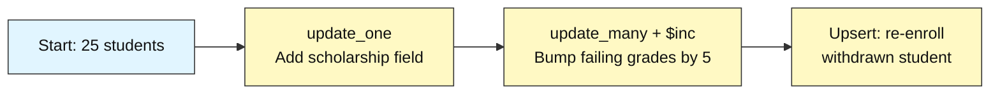
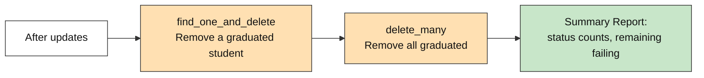

# MongoDB Basics: How to Write, Update & Delete Data

## Student Enrollment Tracker

**Difficulty: Beginner | ~35 min | Requires Lab 1**

*Lab 2 of 7 in the MongoDB Mastery series.*

---

# Problem Statement / Use Case Overview

A university needs to actively manage student enrollment records — updating grades when exam results come in, adding new fields like scholarships as policies change, re-enrolling students who withdrew, and removing records for students who have graduated. These are the **write** operations that Lab 1's read-only queries didn't cover.

This lab walks you through the full **CRUD write lifecycle** in MongoDB. You will learn how to update individual and multiple documents using different update operators (`$set`, `$unset`, `$inc`), perform upserts to handle re-enrollments, delete documents, and use atomic `find_one_and_update` / `find_one_and_delete` operations. The same 25-student dataset from Lab 1 is your starting point.

### Update Operators

MongoDB update operations always use an **update document** that tells MongoDB *what* to change. The most common operators are:

- **`$set`** — sets a field to a specific value, or creates it if it doesn't exist
- **`$unset`** — removes a field entirely from a document
- **`$inc`** — increments a numeric field by a given amount (useful for counters, scores, balances)

```python
# $set adds or overwrites a field
students.update_one({"name": "Alice"}, {"$set": {"scholarship": "Dean's Award"}})

# $inc raises a numeric field
students.update_one({"name": "Alice"}, {"$inc": {"grade": 5}})

# $unset removes a field
students.update_one({"name": "Alice"}, {"$unset": {"scholarship": ""}})
```

### Upserts

An **upsert** is a combined update-or-insert operation. If the filter matches a document, it updates it. If nothing matches, it inserts a new document with the filter fields and the update fields combined. This is useful for re-enrolling a student who previously withdrew — the record may or may not already exist.

```python
# upsert=True: update if exists, insert if not
students.update_one(
    {"student_id": "STU006"},
    {"$set": {"status": "active"}},
    upsert=True
)
```

### Atomic Find-and-Modify Operations

`find_one_and_update` and `find_one_and_delete` combine a query and a write in a single atomic operation — they find a document, apply a change, and return the document (before or after the change). This avoids the race condition of finding a document in one call and modifying it in another.

> **Why this matters:** Understanding the full CRUD write lifecycle — update, delete, and upsert — is what makes MongoDB practical for real applications. Lab 1 showed you how to read data; this lab shows you how to change it. Lab 3 builds on both by introducing aggregation pipelines and indexing for analytics at scale.

---

# Input Data

| Item | Detail |
|------|--------|
| **Starting dataset** | Same 25 student records from Lab 1 (inserted automatically at the start) |
| **Fields per record** | `name`, `student_id`, `course`, `grade`, `enrollment_date`, `status` |
| **Status values** | `active`, `inactive`, `graduated` |
| **Write operations covered** | `update_one`, `update_many`, `find_one_and_update`, `find_one_and_delete`, `delete_one`, `delete_many` |

---

# Processing

### Part A — Single & Bulk Updates



The notebook starts by inserting the same 25 student records (dropping the collection first so re-runs are safe). It then walks through `update_one` to add a field to a single student, `update_many` with `$inc` to modify groups of students, and an upsert to handle a re-enrollment.

### Part B — Deletions & Summary



After updates are complete, the notebook demonstrates single-document and bulk deletion, then prints a summary report showing the final state of the collection.

---

# Output

**Insert confirmation:**
```
Inserted 25 student records.
```

**Single update — Alice receives a scholarship:**
```
Updated: Alice Johnson — added scholarship = 'Dean's Award'
```

**Increment — Failing students' grades raised by 5:**
```
Updated 6 failing student(s) — grades incremented by 5

--- Updated Failing Students ---
Charlie Brown        | Physics     | Grade: 60
Diana Prince         | English     | Grade: 53
Frank Castle         | Mathematics | Grade: 57
Laura Palmer         | Biology     | Grade: 50
Rosa Parks           | English     | Grade: 63
Walt Disney          | Physics     | Grade: 61
```

**Upsert — Re-enrolling Frank Castle after withdrawal:**
```
Upserted: Frank Castle — status set to 'active'
```

**Deletion — Graduated students removed:**
```
Deleted: Julia Child (graduated)
Deleted 1 graduated student(s).
```

**Summary report:**
```
         ENROLLMENT TRACKER SUMMARY

Total students remaining: 23
Students with scholarship field: 1

--- Status Distribution ---
  active: 22
  inactive: 1

--- Still Failing (Grade < 60) ---
  Laura Palmer (Biology) — Grade: 50
  Diana Prince (English) — Grade: 53
  Frank Castle (Mathematics) — Grade: 57
```

---

# Tech Stack

| Component | Tool |
|-----------|------|
| **MongoDB driver** | `pymongo[srv,tls]==4.10.1` — Python driver for MongoDB with SRV and TLS support |
| **Credential loader** | `python-dotenv==1.0.1` — loads `.env` files for credentials |
| **CA certificates** | `certifi` — provides up-to-date CA bundles for reliable SSL/TLS on all platforms |

> **Note:** This lab connects to a real MongoDB Atlas cluster. The connection string is stored in the `.env` file (see README Section 8) and loaded at runtime — credentials never appear in the notebook itself.

---

# Prerequisites

- **Lab 1 completed** — you should be familiar with connecting to MongoDB, inserting documents, and running basic queries.
- **Basic Python knowledge** — variables, lists, dictionaries, loops, and `import` statements.
- **MongoDB Atlas cluster set up** — the shared Atlas cluster and `.env` file are already configured (see README Section 8). No additional database installation is needed.

---

# Environment / Dependencies Setup

| Package | Purpose |
|---------|---------|
| `pymongo[srv,tls]` | Python driver for MongoDB with SRV and TLS support |
| `python-dotenv` | Loads `.env` files so credentials stay out of the notebook |
| `certifi` | Provides up-to-date CA certificates for reliable SSL/TLS on all platforms |

```bash
pip install -qU "pymongo[srv,tls]==4.10.1" python-dotenv==1.0.1 certifi
```

---

# Step-wise Development Instructions

---

### Step 1 — Connect to MongoDB

```python
import os
import certifi
from dotenv import load_dotenv
import pymongo

# Load the Atlas connection string from the .env file one directory up
load_dotenv("../.env")
uri = os.environ["MONGODB_URI"]

# Connect to the real MongoDB Atlas cluster
client = pymongo.MongoClient(uri, tlsCAFile=certifi.where())

# Access the database and collection
db = client["school_db"]
students = db["students"]

print("Connected to MongoDB Atlas")
```

---

### Step 2 — Insert the Starting Dataset

```python
# Drop the collection first so re-running the notebook starts clean
students.drop()

# Same 25 student records from Lab 1 — the starting point for write operations
student_records = [
    {"name": "Alice Johnson",  "student_id": "STU001", "course": "Computer Science", "grade": 95, "enrollment_date": "2024-09-01", "status": "active"},
    {"name": "Bob Smith",      "student_id": "STU002", "course": "Mathematics",      "grade": 78, "enrollment_date": "2024-09-01", "status": "active"},
    {"name": "Charlie Brown",  "student_id": "STU003", "course": "Physics",          "grade": 55, "enrollment_date": "2024-09-02", "status": "active"},
    {"name": "Diana Prince",   "student_id": "STU004", "course": "English",          "grade": 48, "enrollment_date": "2024-09-01", "status": "active"},
    {"name": "Eve Torres",     "student_id": "STU005", "course": "Biology",          "grade": 88, "enrollment_date": "2024-09-03", "status": "active"},
    {"name": "Frank Castle",   "student_id": "STU006", "course": "Mathematics",      "grade": 52, "enrollment_date": "2024-09-01", "status": "inactive"},
    {"name": "Grace Hopper",   "student_id": "STU007", "course": "Computer Science", "grade": 91, "enrollment_date": "2024-09-02", "status": "active"},
    {"name": "Hank Pym",       "student_id": "STU008", "course": "Physics",          "grade": 73, "enrollment_date": "2024-09-01", "status": "active"},
    {"name": "Ivan Petrov",    "student_id": "STU009", "course": "Computer Science", "grade": 84, "enrollment_date": "2024-09-03", "status": "active"},
    {"name": "Julia Child",    "student_id": "STU010", "course": "English",          "grade": 90, "enrollment_date": "2024-09-02", "status": "graduated"},
    {"name": "Karl Marx",      "student_id": "STU011", "course": "Mathematics",      "grade": 67, "enrollment_date": "2024-09-01", "status": "active"},
    {"name": "Laura Palmer",   "student_id": "STU012", "course": "Biology",          "grade": 45, "enrollment_date": "2024-09-02", "status": "active"},
    {"name": "Marco Polo",     "student_id": "STU013", "course": "Physics",          "grade": 82, "enrollment_date": "2024-09-03", "status": "active"},
    {"name": "Nina Simone",    "student_id": "STU014", "course": "English",          "grade": 76, "enrollment_date": "2024-09-01", "status": "active"},
    {"name": "Oscar Wilde",    "student_id": "STU015", "course": "Mathematics",      "grade": 93, "enrollment_date": "2024-09-02", "status": "active"},
    {"name": "Pia Zadora",     "student_id": "STU016", "course": "Biology",          "grade": 71, "enrollment_date": "2024-09-01", "status": "active"},
    {"name": "Quincy Adams",   "student_id": "STU017", "course": "Computer Science", "grade": 87, "enrollment_date": "2024-09-03", "status": "active"},
    {"name": "Rosa Parks",     "student_id": "STU018", "course": "English",          "grade": 58, "enrollment_date": "2024-09-02", "status": "inactive"},
    {"name": "Sam Wilson",     "student_id": "STU019", "course": "Physics",          "grade": 98, "enrollment_date": "2024-09-01", "status": "active"},
    {"name": "Tina Turner",    "student_id": "STU020", "course": "Mathematics",      "grade": 79, "enrollment_date": "2024-09-03", "status": "active"},
    {"name": "Uma Thurman",    "student_id": "STU021", "course": "Computer Science", "grade": 62, "enrollment_date": "2024-09-02", "status": "active"},
    {"name": "Vera Wang",      "student_id": "STU022", "course": "Biology",          "grade": 85, "enrollment_date": "2024-09-01", "status": "graduated"},
    {"name": "Walt Disney",    "student_id": "STU023", "course": "Physics",          "grade": 56, "enrollment_date": "2024-09-02", "status": "active"},
    {"name": "Xena Warrior",   "student_id": "STU024", "course": "English",          "grade": 94, "enrollment_date": "2024-09-03", "status": "active"},
    {"name": "Yusuf Islam",    "student_id": "STU025", "course": "Computer Science", "grade": 70, "enrollment_date": "2024-09-01", "status": "active"},
]

result = students.insert_many(student_records)
print(f"Inserted {len(result.inserted_ids)} student records.")
```

---

### Step 3 — Single Update: Add a Scholarship Field

```python
# update_one() modifies the first document that matches the filter
# $set creates the "scholarship" field if it doesn't exist
result = students.update_one(
    {"name": "Alice Johnson"},
    {"$set": {"scholarship": "Dean's Award"}}
)

print(f"Updated: Alice Johnson — added scholarship = 'Dean's Award'")
```

`update_one()` updates **only the first** matching document. `$set` either creates a new field or overwrites an existing one — it never removes other fields.

---

### Step 4 — Bulk Increment: Bump Failing Grades by 5

```python
# update_many() modifies ALL documents that match the filter
# $inc adds 5 to the grade field (no need to read the current value first)
result = students.update_many(
    {"grade": {"$lt": 60}},
    {"$inc": {"grade": 5}}
)

print(f"Updated {result.modified_count} failing student(s) — grades incremented by 5")

# Show the updated failing students
updated_failing = students.find(
    {"grade": {"$lt": 60}},
    {"_id": 0}
).sort("grade", 1)

print("\n--- Updated Failing Students ---")
for s in updated_failing:
    print(f"{s['name']:<20} | {s['course']:<12} | Grade: {s['grade']}")
```

`$inc` is atomic — MongoDB reads the current value, adds the increment, and writes it back in one operation. This is safer than reading, modifying in Python, and writing back, because another process can't slip in a write between the read and the write.

---

### Step 5 — Upsert: Re-enroll a Withdrawn Student

```python
# upsert=True: if the filter matches, update it; if nothing matches, insert a new document
# Frank Castle (STU006) has status "inactive" — this changes it to "active"
result = students.update_one(
    {"student_id": "STU006"},
    {"$set": {"status": "active"}},
    upsert=True
)

if result.upserted_id:
    print(f"Upserted: new document inserted with _id = {result.upserted_id}")
else:
    print(f"Upserted: Frank Castle — status set to 'active'")
```

Without `upsert=True`, `update_one` does nothing if the filter matches nothing. With it, MongoDB inserts a new document combining the filter fields and the update fields. Here the filter matches an existing student, so it behaves like a normal update — but the pattern is essential when you're not sure if a record already exists.

---

### Step 6 — Delete: Remove Graduated Students

```python
# find_one_and_delete: finds one document, deletes it, and returns what it removed
graduated = students.find_one_and_delete(
    {"status": "graduated"},
    projection={"_id": 0, "name": 1, "status": 1}
)

if graduated:
    print(f"Deleted: {graduated['name']} (graduated)")
```

`find_one_and_delete` is atomic — it finds and removes in one step, returning the deleted document so you can log or confirm what was removed.

```python
# delete_many() removes ALL documents matching the filter
result = students.delete_many({"status": "graduated"})
print(f"Deleted {result.deleted_count} graduated student(s).")
```

`delete_many` with `{"status": "graduated"}` cleans up any remaining graduated records in one call. Combined with the previous `find_one_and_delete`, this demonstrates both single and bulk deletion patterns.

---

### Step 7 — Summary Report

```python
# Count remaining students
total = students.count_documents({})

# Count how many students have the "scholarship" field (updated in Step 3)
updated = students.count_documents({"scholarship": {"$exists": True}})

# Status distribution
pipeline = [
    {"$group": {"_id": "$status", "count": {"$sum": 1}}},
    {"$sort": {"_id": 1}}
]
status_counts = {doc["_id"]: doc["count"] for doc in students.aggregate(pipeline)}

# Students still failing after the grade bump
still_failing = list(students.find(
    {"grade": {"$lt": 60}},
    {"_id": 0}
).sort("grade", 1))

print("         ENROLLMENT TRACKER SUMMARY")
print(f"\nTotal students remaining: {total}")
print(f"Students with scholarship field: {updated}")

print("\n--- Status Distribution ---")
for status, count in sorted(status_counts.items()):
    print(f"  {status}: {count}")

print("\n--- Still Failing (Grade < 60) ---")
for s in still_failing:
    print(f"  {s['name']} ({s['course']}) — Grade: {s['grade']}")
```

Re-collects the key metrics from each step and prints a formatted summary — the same kind of report an enrollment office would review at the end of a processing cycle.

---

# Optional Exercise

Write a sequence of operations that does the following: (1) uses `$unset` to remove the `scholarship` field from all students in Mathematics, (2) uses `$set` to change every "inactive" student's status to "active", and (3) uses `delete_one` to remove exactly one student with the lowest grade in the collection. Print the final total count and status distribution after each step to verify your changes.

---

# What We Learnt

- **`update_one()` modifies the first matching document** — use it when you know exactly which record to change.
- **`update_many()` modifies every matching document** — use it for bulk operations across a collection.
- **`$set` creates or overwrites a field** without touching other fields — the most common update operator.
- **`$inc` atomically increments a numeric field** — safer than reading, modifying in Python, and writing back.
- **`$unset` removes a field entirely** from matching documents.
- **Upserts (`upsert=True`) combine insert and update** — if the filter matches, update; if not, insert a new document.
- **`find_one_and_delete` is atomic** — finds and removes in one step, returning the deleted document.
- **`delete_many()` removes all matching documents** — use it with a specific filter to avoid accidental full-collection deletion.
- **`modified_count` and `deleted_count` tell you what actually changed** — always check these to confirm operations worked as expected.
- **Atomic operations prevent race conditions** — MongoDB guarantees that find-and-modify and find-and-delete happen as a single uninterruptible step.

With Lab 2 done, you know the full CRUD lifecycle: insert (Lab 1), query (Lab 1), update, and delete (this lab). Lab 3 builds on both by introducing aggregation pipelines and indexing for analytics at scale.
