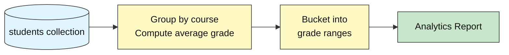
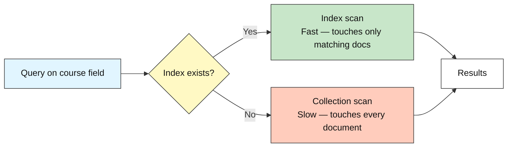

# MongoDB Intermediate: How to Analyze Data at Scale

## Academic Performance Analytics

**Difficulty: Intermediate | ~40 min | Requires Labs 1 and 2**

*Lab 3 of 7 in the MongoDB Mastery series.*

---

# Problem Statement / Use Case Overview

A university's academic office needs to move beyond individual student lookups and answer questions that span the entire dataset: which courses have the highest and lowest average grades? How are grades distributed across the class — how many students scored an A versus a C? These are analytical questions that can't be answered with a simple `find()` query.

This lab teaches you to use MongoDB's **aggregation pipeline** — a sequence of data transformation stages that run directly inside the database — to compute course-level statistics and grade distributions from the same 25-student dataset used in Labs 1 and 2. You will also learn how **indexing** speeds up these queries and how to use `.explain()` to verify that MongoDB is using your index instead of scanning every document.

---

# Input Data

| Item | Detail |
|------|--------|
| **Student records** | Same 25 synthetic records from Labs 1 and 2 (inserted automatically at the start) |
| **Fields per record** | `name`, `student_id`, `course`, `grade`, `enrollment_date`, `status` |
| **Courses covered** | Computer Science, Mathematics, Physics, English, Biology |
| **Grade range** | 45–98 (some intentionally failing, below 60) |

---

# Processing

### Part A — Aggregation Pipelines



The notebook runs two aggregation pipelines: one that groups students by course and computes the average grade per course (sorted highest to lowest), and another that buckets all students into grade ranges (A, B, C, D, F) to show the overall grade distribution.

### Part B — Indexing and Performance



You run `.explain()` twice — once before creating the index (seeing a COLLSCAN) and once after (seeing an IXSCAN) — making the performance difference visible.

---

# Output

**Average grade per course:**

```
--- Average Grade per Course ---
Computer Science     | Avg: 81.5
Mathematics          | Avg: 73.8
English              | Avg: 73.2
Physics              | Avg: 72.8
Biology              | Avg: 72.2
```

**Grade distribution:**

```
--- Grade Distribution ---
  0-59   (F): 6 students
  60-69  (D): 2 students
  70-79  (C): 6 students
  80-89  (B): 5 students
  90-100 (A): 6 students
```

**Index performance comparison:**

```
--- Before indexing ---
Stage: COLLSCAN

--- After indexing ---
Stage: IXSCAN

--- Comparison ---
Before index: COLLSCAN
After index:  IXSCAN
```

**Analytics summary report:**

```
       ACADEMIC PERFORMANCE ANALYTICS

Total students: 25
Overall average grade: 75.1

Top course:    Computer Science (avg 81.5)
Bottom course: Biology (avg 72.2)

--- Grade Distribution ---
  A: 6 students
  B: 5 students
  C: 6 students
  D: 2 students
  F: 6 students
```

---

# Tech Stack

| Component | Tool |
|-----------|------|
| **MongoDB driver** | `pymongo[srv,tls]==4.10.1` — Python driver for MongoDB with SRV and TLS support |
| **Credential loader** | `python-dotenv==1.0.1` — loads `.env` files for credentials |
| **CA certificates** | `certifi` — provides up-to-date CA bundles for reliable SSL/TLS on all platforms |

> **Note:** This lab connects to a real MongoDB Atlas cluster. The connection string is stored in the `.env` file (see README Section 8) and loaded at runtime — credentials never appear in the notebook itself.

---

# Underlying Concepts

### Aggregation Pipelines

An **aggregation pipeline** is a sequence of stages that transform data step by step inside the database, rather than pulling raw data into your application. Each stage receives the output of the previous one as its input. This is MongoDB's equivalent of SQL's `GROUP BY`, `HAVING`, and window functions — but expressed as a chain of stages rather than a single query.

```mermaid
flowchart LR
    A["All Documents"] -->|"$match"| B["Filtered Docs"]
    B -->|"$group"| C["Grouped + Aggregated"]
    C -->|"$sort"| D["Sorted Results"]
    D -->|"$project"| E["Final Output"]

    style A fill:#e1f5ff,stroke:#333333,stroke-width:1px,color:#111111
    style B fill:#fff9c4,stroke:#333333,stroke-width:1px,color:#111111
    style C fill:#fff9c4,stroke:#333333,stroke-width:1px,color:#111111
    style D fill:#fff9c4,stroke:#333333,stroke-width:1px,color:#111111
    style E fill:#c8e6c9,stroke:#333333,stroke-width:1px,color:#111111
```



The key stages used in this lab are:

- **`$group`** — groups documents by a field (e.g., course) and applies accumulators (e.g., `$avg`, `$sum`) to each group
- **`$sort`** — orders the grouped results by a field (e.g., average grade descending)
- **`$bucket`** — distributes documents into predefined ranges (e.g., grade bands 0–59, 60–69, etc.)
- **`$project`** — reshapes documents, selecting or computing specific fields for the output

Pipelines run inside the database engine, so they are faster than pulling all documents into Python and processing them there — especially as collections grow.

### Indexing

An **index** is a data structure that lets MongoDB locate documents matching a query without scanning every document in the collection. Without an index, MongoDB must perform a **collection scan** (COLLSCAN) — reading every document to find matches. With an index, it performs an **index scan** (IXSCAN) — reading only the index entries that match.

Creating an index on a field that you frequently filter or sort by (e.g., `course`) is the single most impactful performance optimization you can make. The tradeoff is that indexes consume storage and slow down write operations slightly, since every insert or update must also update the index.

### `.explain()`

The `.explain()` method returns the **query execution plan** — a detailed breakdown of how MongoDB processed a query, including which stages it used and how many documents it examined. This is the tool you use to verify that your indexes are actually being used. The key field to look at is `stage`: `COLLSCAN` means no index was used; `IXSCAN` means an index was used. When a query has no projection, the winning plan's top-level `stage` directly shows `COLLSCAN` or `IXSCAN`. When a query includes a projection (as in this lab's covered-query Steps 5/6), MongoDB wraps the real scan under an outer projection stage — so you need to look inside `inputStage.stage` to find the `COLLSCAN` or `IXSCAN` value.

> **Why this matters:** Aggregation pipelines let you compute analytics directly inside the database, which is faster and more efficient than pulling raw data into your application. Indexing ensures those pipelines run quickly even as collections grow. Together, they are the foundation for building production-grade MongoDB applications that can handle real data volumes. Lab 4 applies these concepts to schema design and `$lookup` joins.

---

# Prerequisites

- **Labs 1 and 2 completed** — you should be familiar with connecting to MongoDB, inserting documents, and running basic queries and updates.
- **Basic Python knowledge** — variables, lists, dictionaries, loops, and `import` statements.
- **MongoDB Atlas cluster set up** — the shared Atlas cluster and `.env` file are already configured (see README Section 8). No additional database installation is needed.

---

# Environment / Dependencies Setup

| Package | Purpose |
|---------|---------|
| `pymongo[srv,tls]` | Python driver for MongoDB with SRV and TLS support |
| `python-dotenv` | Loads `.env` files so credentials stay out of the notebook |
| `certifi` | Provides up-to-date CA certificates for reliable SSL/TLS on all platforms |

```bash
pip install -qU "pymongo[srv,tls]==4.10.1" python-dotenv==1.0.1 certifi
```

---

# Step-wise Development Instructions

---

### Step 1 — Connect to MongoDB

```python
import os
import certifi
from dotenv import load_dotenv
import pymongo

# Load the Atlas connection string from the .env file one directory up
load_dotenv("../.env")
uri = os.environ["MONGODB_URI"]

# Connect to the real MongoDB Atlas cluster
client = pymongo.MongoClient(uri, tlsCAFile=certifi.where())

# Access the database and collection
db = client["school_db"]
students = db["students"]

print("Connected to MongoDB Atlas")
```

Same connection pattern as Labs 1 and 2 — `load_dotenv` reads from the shared `.env` file, and `certifi.where()` provides trusted CA certificates for SSL.

---

### Step 2 — Insert the Starting Dataset

```python
students.drop()

student_records = [
    {"name": "Alice Johnson",  "student_id": "STU001", "course": "Computer Science", "grade": 95, "enrollment_date": "2024-09-01", "status": "active"},
    {"name": "Bob Smith",      "student_id": "STU002", "course": "Mathematics",      "grade": 78, "enrollment_date": "2024-09-01", "status": "active"},
    {"name": "Charlie Brown",  "student_id": "STU003", "course": "Physics",          "grade": 55, "enrollment_date": "2024-09-02", "status": "active"},
    {"name": "Diana Prince",   "student_id": "STU004", "course": "English",          "grade": 48, "enrollment_date": "2024-09-01", "status": "active"},
    {"name": "Eve Torres",     "student_id": "STU005", "course": "Biology",          "grade": 88, "enrollment_date": "2024-09-03", "status": "active"},
    {"name": "Frank Castle",   "student_id": "STU006", "course": "Mathematics",      "grade": 52, "enrollment_date": "2024-09-01", "status": "inactive"},
    {"name": "Grace Hopper",   "student_id": "STU007", "course": "Computer Science", "grade": 91, "enrollment_date": "2024-09-02", "status": "active"},
    {"name": "Hank Pym",       "student_id": "STU008", "course": "Physics",          "grade": 73, "enrollment_date": "2024-09-01", "status": "active"},
    {"name": "Ivan Petrov",    "student_id": "STU009", "course": "Computer Science", "grade": 84, "enrollment_date": "2024-09-03", "status": "active"},
    {"name": "Julia Child",    "student_id": "STU010", "course": "English",          "grade": 90, "enrollment_date": "2024-09-02", "status": "graduated"},
    {"name": "Karl Marx",      "student_id": "STU011", "course": "Mathematics",      "grade": 67, "enrollment_date": "2024-09-01", "status": "active"},
    {"name": "Laura Palmer",   "student_id": "STU012", "course": "Biology",          "grade": 45, "enrollment_date": "2024-09-02", "status": "active"},
    {"name": "Marco Polo",     "student_id": "STU013", "course": "Physics",          "grade": 82, "enrollment_date": "2024-09-03", "status": "active"},
    {"name": "Nina Simone",    "student_id": "STU014", "course": "English",          "grade": 76, "enrollment_date": "2024-09-01", "status": "active"},
    {"name": "Oscar Wilde",    "student_id": "STU015", "course": "Mathematics",      "grade": 93, "enrollment_date": "2024-09-02", "status": "active"},
    {"name": "Pia Zadora",     "student_id": "STU016", "course": "Biology",          "grade": 71, "enrollment_date": "2024-09-01", "status": "active"},
    {"name": "Quincy Adams",   "student_id": "STU017", "course": "Computer Science", "grade": 87, "enrollment_date": "2024-09-03", "status": "active"},
    {"name": "Rosa Parks",     "student_id": "STU018", "course": "English",          "grade": 58, "enrollment_date": "2024-09-02", "status": "inactive"},
    {"name": "Sam Wilson",     "student_id": "STU019", "course": "Physics",          "grade": 98, "enrollment_date": "2024-09-01", "status": "active"},
    {"name": "Tina Turner",    "student_id": "STU020", "course": "Mathematics",      "grade": 79, "enrollment_date": "2024-09-03", "status": "active"},
    {"name": "Uma Thurman",    "student_id": "STU021", "course": "Computer Science", "grade": 62, "enrollment_date": "2024-09-02", "status": "active"},
    {"name": "Vera Wang",      "student_id": "STU022", "course": "Biology",          "grade": 85, "enrollment_date": "2024-09-01", "status": "graduated"},
    {"name": "Walt Disney",    "student_id": "STU023", "course": "Physics",          "grade": 56, "enrollment_date": "2024-09-02", "status": "active"},
    {"name": "Xena Warrior",   "student_id": "STU024", "course": "English",          "grade": 94, "enrollment_date": "2024-09-03", "status": "active"},
    {"name": "Yusuf Islam",    "student_id": "STU025", "course": "Computer Science", "grade": 70, "enrollment_date": "2024-09-01", "status": "active"},
]

result = students.insert_many(student_records)
print(f"Inserted {len(result.inserted_ids)} student records.")
```

`students.drop()` ensures re-running the notebook starts clean without duplicating records.

---

### Step 3 — Aggregation: Average Grade per Course

```python
pipeline = [
    {"$group": {"_id": "$course", "avg_grade": {"$avg": "$grade"}}},
    {"$sort": {"avg_grade": -1}}
]

course_avgs = list(students.aggregate(pipeline))

print("--- Average Grade per Course ---")
for doc in course_avgs:
    print(f"{doc['_id']:<20} | Avg: {doc['avg_grade']:.1f}")
```

`$group` collects all students sharing the same `course` value. `$avg` computes the mean grade within each group. `$sort` orders the results from highest to lowest average.

---

### Step 4 — Aggregation: Grade Distribution with $bucket

```python
pipeline = [
    {"$bucket": {
        "groupBy": "$grade",
        "boundaries": [0, 60, 70, 80, 90, 101],
        "default": "Other",
        "output": {"count": {"$sum": 1}}
    }}
]

distribution = list(students.aggregate(pipeline))

print("--- Grade Distribution ---")
labels = {0: "0-59   (F)", 60: "60-69  (D)", 70: "70-79  (C)",
          80: "80-89  (B)", 90: "90-100 (A)"}
for doc in distribution:
    label = labels.get(doc["_id"], doc["_id"])
    print(f"  {label}: {doc['count']} students")
```

`$bucket` distributes documents into predefined ranges based on the `grade` field. Each `boundaries` value is the inclusive lower edge of a bucket. The `output` key defines what to compute for each bucket — here, a simple count.

---

### Step 5 — Query Performance Without an Index

```python
query = {"course": "Computer Science"}
projection = {"_id": 0, "course": 1}

# Before creating any index, run the query and inspect the execution plan
# Project only the indexed field so the query is covered (no FETCH needed)
plan_before = students.find(query, projection).explain()

winning_before = plan_before.get("queryPlanner", {}).get("winningPlan", {})
stage_before = winning_before.get("inputStage", {}).get("stage", winning_before.get("stage", "unknown"))

print("--- Before indexing ---")
print(f"Stage: {stage_before}")
```

With no index on `course`, MongoDB must perform a **collection scan** (COLLSCAN) — it reads every document in the collection to find matches. This is fine for 25 documents, but would be slow on a collection with millions.

---

### Step 6 — Create an Index and Verify the Difference

```python
students.create_index("course")
print("Index created on 'course' field")

# Now run the same covered query again and inspect the execution plan
plan_after = students.find(query, projection).explain()

winning_after = plan_after.get("queryPlanner", {}).get("winningPlan", {})
stage_after = winning_after.get("inputStage", {}).get("stage", winning_after.get("stage", "unknown"))

print(f"\n--- After indexing ---")
print(f"Stage: {stage_after}")

print(f"\n--- Comparison ---")
print(f"Before index: {stage_before}")
print(f"After index:  {stage_after}")
```

Creating an index on `course` lets MongoDB locate matching documents via an **index scan** (IXSCAN) instead of scanning every document. By projecting only the indexed field (`{"_id": 0, "course": 1}`), the query becomes **covered** — MongoDB can answer it entirely from the index without fetching the full document. We read the scan stage from `inputStage` (the inner stage of the plan) rather than the top-level `stage`, because MongoDB may wrap the scan in a projection stage. The result: the `inputStage` stage changes from `COLLSCAN` to `IXSCAN` after the index is created.

---

### Step 7 — Analytics Summary Report

```python
# Overall stats
total = students.count_documents({})
pipeline_all = [{"$group": {"_id": None, "avg": {"$avg": "$grade"}}}]
overall_avg = list(students.aggregate(pipeline_all))[0]["avg"]

# Top and bottom courses
top_course = course_avgs[0]
bottom_course = course_avgs[-1]

# Grade distribution
dist_pipeline = [
    {"$bucket": {
        "groupBy": "$grade",
        "boundaries": [0, 60, 70, 80, 90, 101],
        "output": {"count": {"$sum": 1}}
    }}
]
dist = {doc["_id"]: doc["count"] for doc in students.aggregate(dist_pipeline)}

print("       ACADEMIC PERFORMANCE ANALYTICS")
print(f"\nTotal students: {total}")
print(f"Overall average grade: {overall_avg:.1f}")

print(f"\nTop course:    {top_course['_id']} (avg {top_course['avg_grade']:.1f})")
print(f"Bottom course: {bottom_course['_id']} (avg {bottom_course['avg_grade']:.1f})")

print("\n--- Grade Distribution ---")
for bound, label in [(90, "A"), (80, "B"), (70, "C"), (60, "D"), (0, "F")]:
    print(f"  {label}: {dist.get(bound, 0)} students")
```

Collects the key metrics from each aggregation step into one formatted summary — the kind of report an academic office would review at the end of a semester.

---

# Optional Exercise

Add a new field `"midterm_score"` (random integer between 50 and 100) to every student document using `update_many()` with `$set`. Then write an aggregation pipeline that groups by `course` and computes the average of both `grade` and `midterm_score` per course, sorting by average `grade` descending. Print the results. Finally, drop the `course` index you created in Step 6 and re-run `.explain()` on the same query to confirm the stage changes from `IXSCAN` back to `COLLSCAN`.

---

# What We Learnt

- **Aggregation pipelines transform data in stages inside the database** — `$group`, `$avg`, `$sort`, and `$bucket` let you compute analytics without pulling raw data into Python.
- **`$group` groups documents by a field** and applies accumulators like `$avg` (mean) and `$sum` (count) to each group.
- **`$bucket` distributes documents into predefined ranges** — useful for creating grade distributions, histograms, or any binned analysis.
- **`$sort` orders pipeline output** — use `1` for ascending, `-1` for descending.
- **Indexes dramatically speed up queries** — `create_index("field")` builds a lookup structure so MongoDB can find matching documents without scanning the entire collection.
- **`.explain()` reveals the query execution plan** — look for `IXSCAN` (index used) versus `COLLSCAN` (full collection scan) to verify your indexes are effective. If the query uses a projection, check `inputStage.stage` instead of the top-level `stage`, because MongoDB wraps the scan in a projection stage.
- **`totalDocsExamined` in the explain output** tells you how many documents MongoDB had to inspect — a lower number means a more efficient query.
- **Indexes trade write speed for read speed** — every index must be updated on insert/update, so index fields you actually query.

With Labs 1–3 done, you can connect, query, update, aggregate, and index. Lab 4 introduces schema design patterns and `$lookup` joins — how to structure related data across collections.
