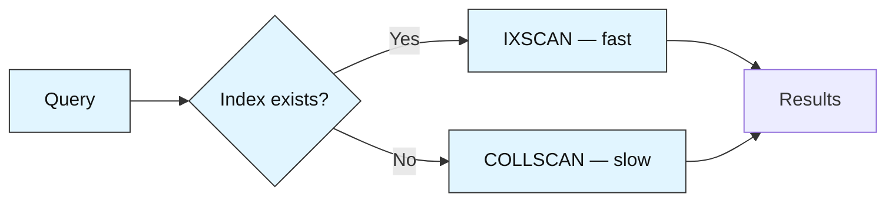
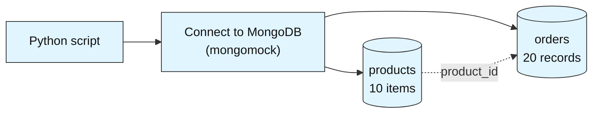
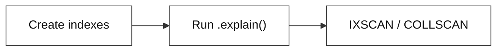

# Sales Analytics Pipeline

**Difficulty: Intermediate | ~50 min | Requires Labs 1–2**

*Lab 3 of 7 in the MongoDB Mastery series.*

---

# Problem Statement / Use Case Overview

An e-commerce company needs to analyze its sales data to answer questions like "which products generate the most revenue?", "what does the monthly revenue trend look like?", and "which regions are performing best?" — all using MongoDB's aggregation pipeline framework.

This lab walks you through building a sales analytics pipeline. You will learn how to design a multi-collection schema with orders and products, build multi-stage aggregation pipelines to join and transform data, create indexes to speed up queries, and use `.explain()` to analyze query performance.

Before diving into the code, it helps to understand the core MongoDB concepts this lab uses.

### Aggregation Pipelines (Advanced)

An **aggregation pipeline** is a sequence of stages that transform data step by step. Each stage takes input, processes it, and passes the result to the next stage. In Lab 1 you used basic `$group` and `$sort`. This lab introduces more powerful stages:

- **`$lookup`** — joins data across collections (like SQL JOIN)
- **`$unwind`** — flattens arrays into individual documents
- **`$addFields`** — adds computed fields without replacing the document
- **`$match`** — filters documents early in the pipeline for efficiency
- **`$limit`** — restricts the number of output documents

### Indexing

An **index** is a data structure that speeds up query operations. Without an index, MongoDB must scan every document (called a **collection scan** or `COLLSCAN`). With an index, MongoDB can jump directly to matching documents (**index scan** or `IXSCAN`). The trade-off is that indexes slightly slow down write operations and use disk space.



### Compound Indexes

A **compound index** covers multiple fields. An index on `(region, date)` efficiently handles queries that filter by `region` and sort by `date` — the order of fields in the index matters.

### `.explain()`

The `.explain()` method shows the query plan MongoDB would use. It tells you whether an index is being used, how many documents are scanned, and which stages are involved in the query.

> **Why this matters:** Aggregation pipelines are MongoDB's most powerful tool for analytics. Combined with indexes and `.explain()`, you can build production-grade analytics that are both fast and cost-effective.

---

# Input Data

| Item | Detail |
|------|--------|
| **Products** | 10 products across 3 categories (Electronics, Accessories, Stationery) |
| **Orders** | 20 orders spanning January–May 2025 |
| **Regions** | North, South, East, West |
| **Customers** | 8 unique customers |
| **Fields** | `order_id`, `customer`, `product_id`, `quantity`, `date`, `region` |

---

# Processing

### Part A — Data Setup



Two collections are seeded: `products` (catalog) and `orders` (transactions). Orders reference products via `product_id`.

### Part B — Aggregation Pipelines

```mermaid
flowchart LR
    ORD[("orders")] --> LK["$lookup<br/>join products"]
    LK --> UW["$unwind<br/>flatten array"]
    UW --> AF["$addFields<br/>compute revenue"]
    AF --> GP["$group<br/>aggregate"]
    GP --> ST["$sort / $limit"]
    ST --> R["Results"]

    style ORD fill:#ffffff,stroke:#333333,stroke-width:1px,color:#111111
    style LK fill:#ffffff,stroke:#333333,stroke-width:1px,color:#111111
    style UW fill:#ffffff,stroke:#333333,stroke-width:1px,color:#111111
    style AF fill:#ffffff,stroke:#333333,stroke-width:1px,color:#111111
    style GP fill:#ffffff,stroke:#333333,stroke-width:1px,color:#111111
    style ST fill:#ffffff,stroke:#333333,stroke-width:1px,color:#111111
    style R fill:#ffffff,stroke:#333333,stroke-width:1px,color:#111111
```



Each pipeline joins orders with products, computes revenue, then groups by product, month, customer, or region.

### Part C — Indexing and Explain



Three indexes are created (product_id, unique product_id, compound region+date). `.explain()` shows whether each query uses an index or falls back to a collection scan.

---

# Output

**Products seeded:**
```
Inserted 10 products.
```

**Orders seeded:**
```
Inserted 20 orders.
```

**Revenue by Product (top 3):**
```
Noise Cancelling Headphones   | Revenue: $  599.97 | Sold: 3
Mechanical Keyboard           | Revenue: $  269.97 | Sold: 3
USB-C Hub                     | Revenue: $  270.00 | Sold: 6
```

**Monthly Revenue Trend:**
```
2025-01  | Revenue: $  474.96 | Orders: 4
2025-02  | Revenue: $  423.48 | Orders: 5
2025-03  | Revenue: $  489.92 | Orders: 5
2025-04  | Revenue: $  474.96 | Orders: 5
2025-05  | Revenue: $   75.00 | Orders: 1
```

**Revenue by Region:**
```
North    | Revenue: $ 1118.44 | Avg Order: $93.20
South    | Revenue: $  219.98 | Avg Order: $73.33
West     | Revenue: $  379.98 | Avg Order: $76.00
East     | Revenue: $  224.46 | Avg Order: $56.12
```

**Summary report** ties it all together with totals, top products, region breakdown, and index list.

---

# Tech Stack

| Component | Tool |
|-----------|------|
| **MongoDB driver** | `pymongo==4.10.1` — Python driver for MongoDB |
| **Mock server** | `mongomock` — in-memory MongoDB simulation |

---

# Prerequisites

- **Labs 1–2 completed** — you should be comfortable with `insert_many()`, `find()`, `update_one()`, and basic aggregation.
- **Basic Python knowledge** — dictionaries, lists, loops, f-strings.

---

# Environment / Dependencies Setup

| Package | Purpose |
|---------|---------|
| `pymongo` | Python driver for MongoDB — used to connect, insert, aggregate, and create indexes |
| `mongomock` | In-memory mock of MongoDB — no server installation needed |

```bash
pip install -qU pymongo==4.10.1 mongomock
```

---

# Step-wise Development Instructions

---

### Step 1 — Connect and Create Collections

```python
import pymongo
import mongomock
from datetime import datetime

client = mongomock.MongoClient()
db = client["ecommerce"]
orders = db["orders"]
products = db["products"]

print("Connected to ecommerce database")
```

We create two collections: `orders` for purchase records and `products` for the product catalog. This multi-collection design separates transactions from catalog data, linked by `product_id`.

---

### Step 2 — Seed the Product Catalog

```python
product_catalog = [
    {"product_id": "P001", "name": "Wireless Mouse",    "category": "Electronics", "price": 29.99},
    {"product_id": "P002", "name": "Mechanical Keyboard","category": "Electronics", "price": 89.99},
    {"product_id": "P003", "name": "USB-C Hub",         "category": "Electronics", "price": 45.00},
    {"product_id": "P004", "name": "Laptop Stand",      "category": "Accessories", "price": 35.00},
    {"product_id": "P005", "name": "Noise Cancelling Headphones", "category": "Electronics", "price": 199.99},
    {"product_id": "P006", "name": "Webcam HD",         "category": "Electronics", "price": 59.99},
    {"product_id": "P007", "name": "Desk Lamp",         "category": "Accessories", "price": 22.50},
    {"product_id": "P008", "name": "Monitor Arm",       "category": "Accessories", "price": 75.00},
    {"product_id": "P009", "name": "Notebook Set",      "category": "Stationery",  "price": 12.99},
    {"product_id": "P010", "name": "Pen Bundle",        "category": "Stationery",  "price": 8.50},
]

products.insert_many(product_catalog)
print(f"Inserted {products.count_documents({})} products.")
```

Each product has a `product_id`, `name`, `category`, and `price`. The `product_id` is the key we will reference from orders to join the two collections.

---

### Step 3 — Seed Order Data

```python
order_records = [
    {"order_id": "ORD001", "customer": "Alice",   "product_id": "P001", "quantity": 2, "date": "2025-01-10", "region": "North"},
    {"order_id": "ORD002", "customer": "Bob",     "product_id": "P002", "quantity": 1, "date": "2025-01-12", "region": "South"},
    # ... (20 orders total)
]

orders.insert_many(order_records)
print(f"Inserted {orders.count_documents({})} orders.")
```

Each order links to a product via `product_id`. Orders span January–May 2025 across four regions. We will use aggregation pipelines to slice this data in different ways.

---

### Step 4 — Revenue by Product (Multi-Stage Pipeline)

```python
pipeline = [
    {"$lookup": {
        "from": "products",
        "localField": "product_id",
        "foreignField": "product_id",
        "as": "product"
    }},
    {"$unwind": "$product"},
    {"$addFields": {
        "revenue": {"$multiply": ["$quantity", "$product.price"]}
    }},
    {"$group": {
        "_id": "$product.name",
        "total_revenue": {"$sum": "$revenue"},
        "total_sold": {"$sum": "$quantity"}
    }},
    {"$sort": {"total_revenue": -1}}
]
```

Five stages: `$lookup` joins each order with its product (like SQL JOIN), `$unwind` flattens the joined array into individual documents, `$addFields` computes `revenue = quantity × price`, `$group` aggregates revenue and quantity by product name, and `$sort` ranks products by total revenue descending.

---

### Step 5 — Monthly Revenue Trend

```python
pipeline = [
    {"$lookup": {
        "from": "products",
        "localField": "product_id",
        "foreignField": "product_id",
        "as": "product"
    }},
    {"$unwind": "$product"},
    {"$addFields": {
        "revenue": {"$multiply": ["$quantity", "$product.price"]},
        "month": {"$substr": ["$date", 0, 7]}
    }},
    {"$group": {
        "_id": "$month",
        "monthly_revenue": {"$sum": "$revenue"},
        "order_count": {"$sum": 1}
    }},
    {"$sort": {"_id": 1}}
]

print("--- Monthly Revenue Trend ---")
for doc in orders.aggregate(pipeline):
    print(f"{doc['_id']}  | Revenue: ${doc['monthly_revenue']:>9.2f} | Orders: {doc['order_count']}")
```

Uses `$substr` to extract the year-month portion (e.g., `"2025-01"`) from each order date, then groups by that substring. This gives a month-by-month revenue breakdown without needing date-type parsing.

### Step 6 — Top Customers by Spend

```python
pipeline = [
    {"$lookup": {
        "from": "products",
        "localField": "product_id",
        "foreignField": "product_id",
        "as": "product"
    }},
    {"$unwind": "$product"},
    {"$addFields": {
        "revenue": {"$multiply": ["$quantity", "$product.price"]}
    }},
    {"$group": {
        "_id": "$customer",
        "total_spend": {"$sum": "$revenue"},
        "orders_count": {"$sum": 1}
    }},
    {"$sort": {"total_spend": -1}},
    {"$limit": 5}
]

print("--- Top 5 Customers by Spend ---")
for i, doc in enumerate(orders.aggregate(pipeline), 1):
    print(f"{i}. {doc['_id']:<10} | Total: ${doc['total_spend']:>9.2f} | Orders: {doc['orders_count']}")
```

Groups by customer, computes total spend and order count, then uses `$limit` to return only the top 5 highest-spending customers.

### Step 7 — Revenue by Region

```python
pipeline = [
    {"$lookup": {
        "from": "products",
        "localField": "product_id",
        "foreignField": "product_id",
        "as": "product"
    }},
    {"$unwind": "$product"},
    {"$addFields": {
        "revenue": {"$multiply": ["$quantity", "$product.price"]}
    }},
    {"$group": {
        "_id": "$region",
        "total_revenue": {"$sum": "$revenue"},
        "avg_order_value": {"$avg": "$revenue"}
    }},
    {"$sort": {"total_revenue": -1}}
]

print("--- Revenue by Region ---")
for doc in orders.aggregate(pipeline):
    print(f"{doc['_id']:<8} | Revenue: ${doc['total_revenue']:>9.2f} | Avg Order: ${doc['avg_order_value']:.2f}")
```

Groups by region with both `$sum` (total revenue) and `$avg` (average order value) in the same pipeline — two aggregations in one pass.

### Step 8 — Category Breakdown with `$match`

```python
pipeline = [
    {"$lookup": {
        "from": "products",
        "localField": "product_id",
        "foreignField": "product_id",
        "as": "product"
    }},
    {"$unwind": "$product"},
    {"$match": {"product.category": "Electronics"}},
    {"$addFields": {
        "revenue": {"$multiply": ["$quantity", "$product.price"]}
    }},
    {"$group": {
        "_id": "$product.name",
        "total_revenue": {"$sum": "$revenue"},
        "units_sold": {"$sum": "$quantity"}
    }},
    {"$sort": {"total_revenue": -1}}
]

print("--- Electronics Category Breakdown ---")
for doc in orders.aggregate(pipeline):
    print(f"{doc['_id']:<30} | Revenue: ${doc['total_revenue']:>9.2f} | Units: {doc['units_sold']}")
```

Places `$match` after `$unwind` to filter on the joined product's category, showing only Electronics orders. In production, you would move `$match` as early as possible (before `$lookup`) for better performance.

### Step 9 — Create Indexes

```python
orders.create_index("product_id")
products.create_index("product_id", unique=True)
orders.create_index([("region", 1), ("date", 1)])
```

Three indexes: `orders.product_id` accelerates the `$lookup` join, `products.product_id` with `unique=True` enforces one record per product, and the compound index `(region, date)` optimizes filtered time-range queries.

### Step 10 — Analyze with `.explain()`

```python
result = orders.find({"region": "North", "date": {"$gte": "2025-02-01"}}).explain()
print(result["queryPlanner"]["winningPlan"]["stage"])  # IXSCAN or COLLSCAN
```

`explain()` shows the query plan MongoDB uses. `IXSCAN` means an index is being used (fast). `COLLSCAN` means a full collection scan (slow — indicates a missing index). This query hits the compound `(region, date)` index we created in Step 9.

### Step 11 — Print Summary Report

Re-runs the key pipelines from earlier steps and collects all results — total revenue, top products, region breakdown, and index listing — into a single formatted summary report.

---

# Optional Exercise

Replace `mongomock` with a real MongoDB server. Run the notebook and verify that `.explain()` returns actual execution stats (totalDocsExamined, executionTimeMillis) that reflect the indexes you created.

---

# What We Learnt

- **Multi-collection schemas** separate related data (orders vs products) and use references (`product_id`) to link them.
- **`$lookup` joins collections** like SQL JOIN — it matches a local field to a foreign field and embeds the result as an array.
- **`$unwind` flattens arrays** created by `$lookup` into individual documents for further processing.
- **`$addFields` computes new values** without replacing the original document — useful for derived metrics like revenue.
- **`$match` filters early** in the pipeline for better performance — the sooner you reduce the dataset, the faster the pipeline runs.
- **`$limit` restricts output** to the top-N results, combining naturally with `$sort` for ranking queries.
- **Indexes speed up queries** by avoiding full collection scans — the compound index on `(region, date)` optimizes filtered time-range queries.
- **`.explain()` reveals the query plan** — look for `IXSCAN` (good) vs `COLLSCAN` (needs an index).

With Lab 3 done, you know how to build analytics pipelines and optimize them with indexes. Lab 4 moves into schema design patterns — embedding vs referencing, text search, and multi-tenant architectures.
