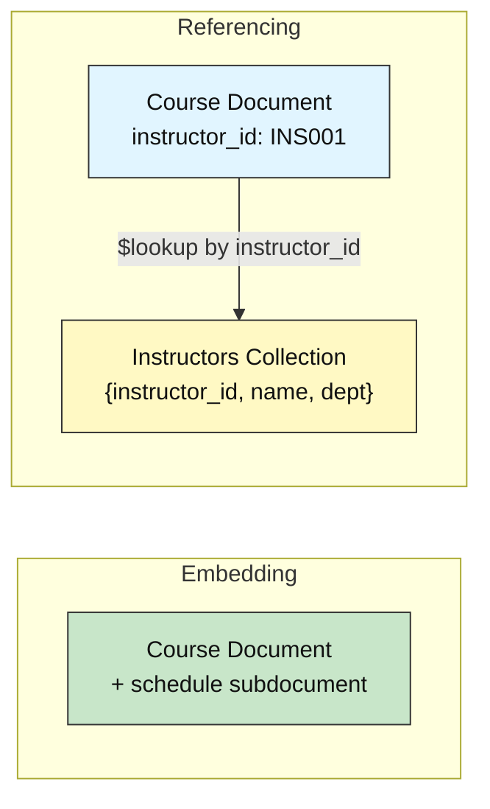
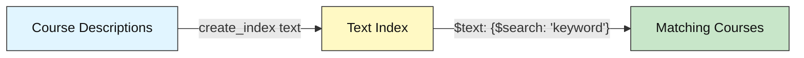
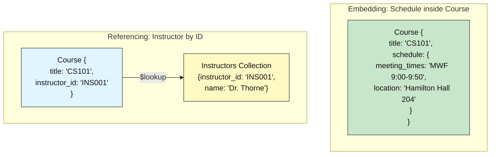

# MongoDB Intermediate: How to Design Schemas & Search Data

## Courses & Instructors

**Difficulty: Intermediate | ~40 min | Requires Labs 1–3**

*Lab 4 of 7 in the MongoDB Mastery series.*

---

# Problem Statement / Use Case Overview

A university needs to organize its course catalog so that each course shows its schedule (meeting times, location) and links to the instructor who teaches it. One instructor can teach multiple courses, and each course has a description that students search by keyword. The core design question is: should the schedule live *inside* the course document, or should it be stored separately and joined later?

This lab teaches you to make that **embedding vs. referencing** decision — the same tradeoff that README Section 3.2 introduces. You will embed bounded, always-read-together data (the schedule) directly inside each course document, and reference shared, independently-updated data (the instructor) by storing an `instructor_id` and joining it later with `$lookup`. You will also create a **text index** on course descriptions and use `$text` search to find courses by keyword.

---

# Input Data

| Item | Detail |
|------|--------|
| **Instructors** | 3 synthetic instructor records (Dr. Sarah Thorne, Prof. James Reed, Dr. Maria Chen) |
| **Courses** | 6 synthetic course records across Computer Science, Mathematics, and Physics |
| **Embedded fields** | Each course contains an embedded `schedule` subdocument: `meeting_times`, `location` |
| **Referenced fields** | Each course stores `instructor_id` — a reference to the instructors collection |
| **Domain** | Same student/university management system used in Labs 1–3 |

---

# Processing

### Part A — Schema Design: Embedding vs. Referencing



You populate two collections — `courses` (with embedded schedules) and `instructors` — then use `$lookup` to join them and `$text` search to find courses by keyword.

### Part B — Text Search



---

# Output

**Embedded schedule (Step 3):**

```
--- Embedded Schedule for CS101: Introduction to Computer Science ---
  Meeting times: MWF 9:00-9:50
  Location: Hamilton Hall Room 204
```

**$lookup join (Step 4):**

```
--- Course Instructor Lookup (6 results) ---
CS101: Introduction to Computer Science -> Dr. Sarah Thorne (Computer Science)
CS201: Data Structures and Algorithms -> Dr. Sarah Thorne (Computer Science)
MATH201: Linear Algebra -> Prof. James Reed (Mathematics)
MATH301: Probability and Statistics -> Prof. James Reed (Mathematics)
PHYS101: General Physics I -> Dr. Maria Chen (Physics)
PHYS301: Computational Physics -> Dr. Maria Chen (Physics)
```

**Text search (Step 5):**

```
Text index created on 'description' field.

--- Text Search: 'algorithms' (3 results) ---
CS101: Introduction to Computer Science
PHYS301: Computational Physics
CS201: Data Structures and Algorithms
```

**Summary report (Step 6):**

```
       COURSES & INSTRUCTORS

Total courses: 6
Total instructors: 3
Average seats per course: 85.0

Top instructor by courses: Dr. Sarah Thorne (2 courses)

--- Text Search: 'algorithms' (3 results) ---
CS101: Introduction to Computer Science
PHYS301: Computational Physics
CS201: Data Structures and Algorithms
```

Note: all three instructors teach exactly 2 courses each — the tie is broken alphabetically by `instructor_id`, so Dr. Sarah Thorne (INS001) appears first.

---

# Tech Stack

| Component | Tool |
|-----------|------|
| **MongoDB driver** | `pymongo[srv,tls]==4.10.1` — Python driver for MongoDB with SRV and TLS support |
| **Credential loader** | `python-dotenv==1.0.1` — loads `.env` files for credentials |
| **CA certificates** | `certifi` — provides up-to-date CA bundles for reliable SSL/TLS on all platforms |

> **Note:** This lab connects to a real MongoDB Atlas cluster. The connection string is stored in the `.env` file (see README Section 8) and loaded at runtime — credentials never appear in the notebook itself.

---

# Underlying Concepts

### Embedding vs. Referencing

README Section 3.2 introduces the core design choice: put related data *inside* the same document (**embedding**), or store it separately and link to it by ID (**referencing**). Lab 4 applies this decision directly.

**Embedding** suits data that is always read together and doesn't grow without bound. A course's schedule — meeting times and location — is always displayed with the course and never shared across courses. Embedding it inside the course document means one `find()` returns everything, with no join needed.

**Referencing** suits data that is large, shared across many documents, or updated independently. One instructor teaches multiple courses; if the instructor's bio changes, you update it in one place (the instructors collection) rather than in every course document. The course stores only an `instructor_id`, and `$lookup` joins the data at query time.



### `$lookup`

`$lookup` is MongoDB's equivalent of a SQL `JOIN`. It takes four parameters — `from` (the collection to join), `localField` (the field in the current document), `foreignField` (the field in the joined collection), and `as` (the output array name). The result is an array of matching documents from the foreign collection, embedded into each source document. As README Section 6 notes, `$lookup` narrows the gap between MongoDB and relational joins considerably. Use `$unwind` after `$lookup` to flatten the array into a single subdocument when you expect exactly one match.

### Text Search

A **text index** lets MongoDB search the *content* of string fields by keyword, rather than requiring an exact match. Creating a text index on `description` means a query like `{"$text": {"$search": "algorithms"}}` returns any course whose description contains that word. The `$text` operator supports multi-word searches (results must contain all words by default) and phrase matching with double quotes.

> **Why this matters:** Schema design is the most consequential decision in a MongoDB application — it determines query performance, data consistency, and how easily your schema evolves. Understanding when to embed and when to reference prevents the two most common anti-patterns: data duplication (embedding everything) and excessive joins (referencing everything). Text search provides a lightweight full-text search capability without needing an external search engine. Lab 5 applies these design decisions to transactional workflows.

---

# Prerequisites

- **Labs 1–3 completed** — you should be familiar with connecting to MongoDB, inserting documents, running queries, and using aggregation pipelines.
- **Basic Python knowledge** — variables, lists, dictionaries, loops, and `import` statements.
- **MongoDB Atlas cluster set up** — the shared Atlas cluster and `.env` file are already configured (see README Section 8). No additional database installation is needed.

---

# Environment / Dependencies Setup

| Package | Purpose |
|---------|---------|
| `pymongo[srv,tls]` | Python driver for MongoDB with SRV and TLS support |
| `python-dotenv` | Loads `.env` files so credentials stay out of the notebook |
| `certifi` | Provides up-to-date CA certificates for reliable SSL/TLS on all platforms |

```bash
pip install -qU "pymongo[srv,tls]==4.10.1" python-dotenv==1.0.1 certifi
```

---

# Step-wise Development Instructions

---

### Step 1 — Connect to MongoDB

```python
import os
import certifi
from dotenv import load_dotenv
import pymongo

# Load the Atlas connection string from the .env file one directory up
load_dotenv("../.env")
uri = os.environ["MONGODB_URI"]

# Connect to the real MongoDB Atlas cluster
client = pymongo.MongoClient(uri, tlsCAFile=certifi.where())

# Access the database and collections
db = client["school_db"]
courses = db["courses"]
instructors = db["instructors"]

print("Connected to MongoDB Atlas")
```

Same connection pattern as Labs 1–3 — `load_dotenv` reads from the shared `.env` file, and `certifi.where()` provides trusted CA certificates for SSL.

---

### Step 2 — Populate Both Collections

```python
courses.drop()
instructors.drop()

# Insert 3 instructors into the instructors collection
instructor_records = [
    {"instructor_id": "INS001", "name": "Dr. Sarah Thorne",  "department": "Computer Science", "bio": "Specializes in algorithms and data structures with 15 years of teaching experience."},
    {"instructor_id": "INS002", "name": "Prof. James Reed",  "department": "Mathematics",      "bio": "Research focus on applied statistics and linear algebra in machine learning."},
    {"instructor_id": "INS003", "name": "Dr. Maria Chen",    "department": "Physics",           "bio": "Expert in computational physics and quantum mechanics simulation."},
]
instructors.insert_many(instructor_records)
print(f"Inserted {len(instructor_records)} instructors.")

# Insert 6 courses with embedded schedule subdocuments and instructor references
course_records = [
    {"course_id": "CS101",   "title": "Introduction to Computer Science",
     "description": "Fundamentals of programming, algorithms, and computational thinking",
     "instructor_id": "INS001", "seats": 120,
     "schedule": {"meeting_times": "MWF 9:00-9:50", "location": "Hamilton Hall Room 204"}},
    {"course_id": "CS201",   "title": "Data Structures and Algorithms",
     "description": "Advanced data structures including trees, graphs, and algorithm analysis",
     "instructor_id": "INS001", "seats": 80,
     "schedule": {"meeting_times": "TTh 10:30-11:45", "location": "Science Building Room 105"}},
    {"course_id": "MATH201", "title": "Linear Algebra",
     "description": "Vectors, matrices, eigenvalues, and applications to data science",
     "instructor_id": "INS002", "seats": 100,
     "schedule": {"meeting_times": "MWF 11:00-11:50", "location": "Math Building Room 301"}},
    {"course_id": "MATH301", "title": "Probability and Statistics",
     "description": "Probability distributions, hypothesis testing, and statistical inference",
     "instructor_id": "INS002", "seats": 75,
     "schedule": {"meeting_times": "TTh 1:00-2:15", "location": "Math Building Room 205"}},
    {"course_id": "PHYS101", "title": "General Physics I",
     "description": "Classical mechanics, thermodynamics, and wave phenomena",
     "instructor_id": "INS003", "seats": 90,
     "schedule": {"meeting_times": "MWF 2:00-2:50", "location": "Physics Lab Room 110"}},
    {"course_id": "PHYS301", "title": "Computational Physics",
     "description": "Numerical methods, scientific computing, and algorithm simulation",
     "instructor_id": "INS003", "seats": 45,
     "schedule": {"meeting_times": "TTh 3:30-4:45", "location": "Physics Lab Room 202"}},
]
result = courses.insert_many(course_records)
print(f"Inserted {len(result.inserted_ids)} courses.")
```

Each course stores a `schedule` subdocument (embedded) and an `instructor_id` (reference). Both collections are dropped first to ensure a clean slate on re-runs.

---

### Step 3 — Demonstrate Embedded Schedule

```python
# Read the embedded schedule directly from the course document — no join needed
cs101 = courses.find_one({"course_id": "CS101"}, {"_id": 0})

print(f"--- Embedded Schedule for {cs101['course_id']}: {cs101['title']} ---")
print(f"  Meeting times: {cs101['schedule']['meeting_times']}")
print(f"  Location: {cs101['schedule']['location']}")
```

The schedule data lives inside the course document. A single `find()` returns everything — the course metadata and its schedule — with no second query or join required. This is the embedding pattern at work: bounded, always-read-together data stored alongside the main record.

---

### Step 4 — $lookup: Join Courses to Instructors

```python
pipeline = [
    {"$lookup": {
        "from": "instructors",
        "localField": "instructor_id",
        "foreignField": "instructor_id",
        "as": "instructor_info"
    }},
    {"$unwind": "$instructor_info"},
    {"$project": {
        "_id": 0,
        "course_id": 1,
        "title": 1,
        "instructor_name": "$instructor_info.name",
        "department": "$instructor_info.department"
    }}
]

results = list(courses.aggregate(pipeline))

print(f"--- Course Instructor Lookup ({len(results)} results) ---")
for doc in results:
    print(f"{doc['course_id']}: {doc['title']} -> {doc['instructor_name']} ({doc['department']})")
```

`$lookup` joins each course to its instructor by matching `instructor_id`. `$unwind` flattens the resulting array into a single subdocument. `$project` reshapes the output to show only the fields we care about — course ID, title, instructor name, and department. All six courses are printed with a dynamic count in the header.

---

### Step 5 — Text Index and Search

```python
# Create a text index on the description field
courses.create_index([("description", "text")])
print("Text index created on 'description' field.")

# Search for courses containing the word 'algorithms'
search_results = list(courses.find(
    {"$text": {"$search": "algorithms"}},
    {"_id": 0, "course_id": 1, "title": 1, "description": 1}
))

print(f"\n--- Text Search: 'algorithms' ({len(search_results)} results) ---")
for doc in search_results:
    print(f"{doc['course_id']}: {doc['title']}")
```

The text index lets MongoDB search the *content* of the `description` field. The query `{"$text": {"$search": "algorithms"}}` matches any course whose description contains that word or a stemmed variant — here, CS101 ("algorithms"), CS201 ("Algorithms"), and PHYS301 ("algorithm") all match due to MongoDB's built-in stemming.

---

### Step 6 — Summary Report

```python
total_courses = courses.count_documents({})
total_instructors = instructors.count_documents({})

# Average seats across all courses
seats_pipeline = [{"$group": {"_id": None, "avg_seats": {"$avg": "$seats"}}}]
avg_seats = list(courses.aggregate(seats_pipeline))[0]["avg_seats"]

# Instructor with most courses taught
teach_pipeline = [
    {"$group": {"_id": "$instructor_id", "count": {"$sum": 1}}},
    {"$sort": {"count": -1, "_id": 1}},
    {"$limit": 1}
]
top = list(courses.aggregate(teach_pipeline))[0]
top_name = instructors.find_one({"instructor_id": top["_id"]})["name"]

print("       COURSES & INSTRUCTORS")
print(f"\nTotal courses: {total_courses}")
print(f"Total instructors: {total_instructors}")
print(f"Average seats per course: {avg_seats:.1f}")
print(f"\nTop instructor by courses: {top_name} ({top['count']} courses)")

# Re-run text search for the report
search_results = list(courses.find(
    {"$text": {"$search": "algorithms"}},
    {"_id": 0, "course_id": 1, "title": 1}
))
print(f"\n--- Text Search: 'algorithms' ({len(search_results)} results) ---")
for doc in search_results:
    print(f"{doc['course_id']}: {doc['title']}")
```

Collects the key metrics from both collections into one formatted report — course counts, seat statistics, the instructor with the most courses, and a text search for "algorithms." Note: all three instructors teach exactly 2 courses each — the tie is broken alphabetically by `instructor_id`, so the output shows Dr. Sarah Thorne (INS001) first.

---

# Optional Exercise

Add a new instructor — `{"instructor_id": "INS004", "name": "Dr. Alan Turing", "department": "Computer Science", "bio": "Pioneer of theoretical computer science and artificial intelligence."}` — to the instructors collection. Then add a new course — `{"course_id": "CS401", "title": "Artificial Intelligence", "description": "Machine learning, search algorithms, and intelligent agents", "instructor_id": "INS004", "seats": 60, "schedule": {"meeting_times": "MWF 3:00-3:50", "location": "Science Building Room 210"}}` — to the courses collection. Re-run the `$lookup` pipeline from Step 4 and verify that CS401 appears in the results with Dr. Alan Turing as the instructor. Then search for "intelligent" using the text index.

---

# What We Learnt

- **Embedding puts bounded, always-read-together data inside the main document** — a course's schedule (meeting times, location) is embedded because it is always displayed with the course and never shared across courses.
- **Referencing stores an ID to shared, independently-updated data** — one instructor teaches many courses, so the course stores only `instructor_id` rather than duplicating the instructor's full record.
- **`$lookup` joins two collections by matching fields** — the `from`, `localField`, `foreignField`, and `as` parameters mirror the logic of a SQL `JOIN`.
- **`$unwind` flattens the `$lookup` output array** into a single subdocument per document, which is cleaner when you expect exactly one match.
- **`$project` reshapes the output** to show only the fields you need, stripping internal fields like `_id`.
- **A text index enables full-text search** on string fields — `create_index([("field", "text")])` followed by `{"$text": {"$search": "word"}}` finds documents containing the search term. MongoDB's built-in stemming means searching for "algorithms" also matches "algorithm".
- **Schema design is the most consequential MongoDB decision** — embedding gives speed (no join), referencing gives consistency (single source of truth). The right choice depends on whether the data is bounded and co-read, or shared and independently updated. Lab 5 applies these design decisions to transactional workflows.
