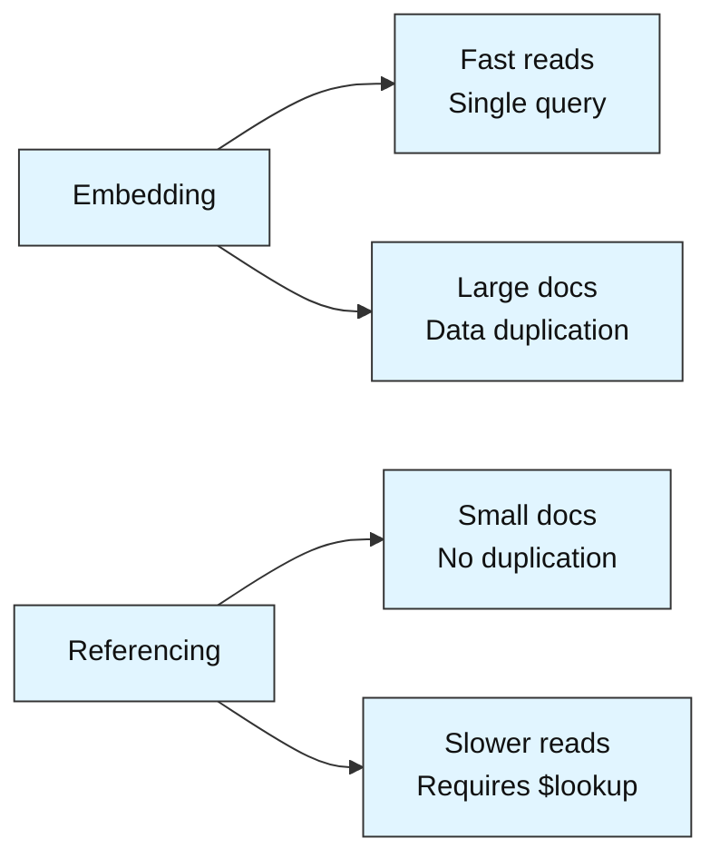
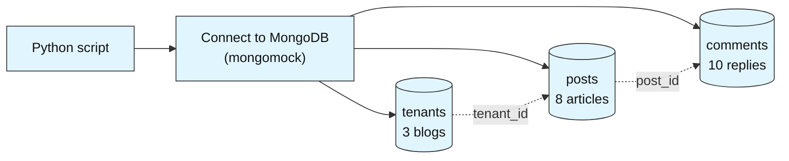
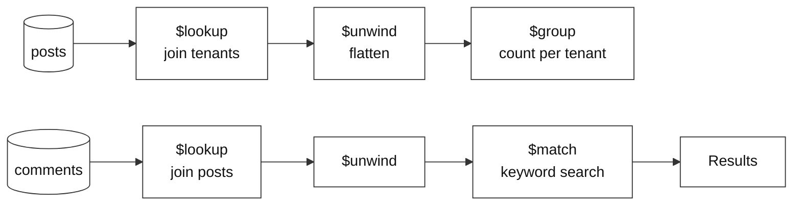

# Multi-Tenant Blog Backend

**Difficulty: Intermediate | ~45 min | Requires Labs 1–3**

*Lab 4 of 7 in the MongoDB Mastery series.*

---

# Problem Statement / Use Case Overview

A blogging platform needs to support multiple tenants — each tenant owns a blog with posts, and readers leave comments on posts. The platform team must decide how to structure the data: should comments live inside each post document (embedding), or in their own collection (referencing)? They also need to search posts by keyword and generate per-tenant analytics.

This lab walks you through designing a multi-tenant blog backend. You will learn when to embed data inside a document versus when to reference it in a separate collection, how to use `$lookup` to join related collections, and how to search post content by keyword. By the end, you will have a working blog data layer with tenant analytics.

Before diving into the code, it helps to understand the core MongoDB concepts this lab uses.

### Schema Design Patterns

MongoDB offers two fundamental patterns for structuring related data:

- **Embedding** — store related data inside the same document. Reads are fast (single query), but the document can grow large and duplicated data wastes space.
- **Referencing** — store related data in separate collections and link them via an ID field. Keeps documents small and avoids duplication, but requires joins (`$lookup`) at query time.



### Embedding vs. Referencing — Rules of Thumb

- **Embed** when data is always fetched together and grows predictably (e.g., tags on a post, address on a user profile).
- **Reference** when data is shared across documents, grows unboundedly, or needs its own lifecycle (e.g., comments on a post, orders for a customer).

### `$lookup` (Joins)

`$lookup` joins two collections by matching a local field to a foreign field, similar to SQL JOIN. It produces an array of matched documents that you can then `$unwind` for further processing.

### Text Search

MongoDB supports **text indexes** for full-text search. Once a text index is created on a field, you can use the `$text` operator to find documents containing specific words or phrases. When a text index is not available (e.g., with `mongomock`), you can fall back to regex-based matching for keyword searches.

> **Why this matters:** Choosing the wrong schema pattern early leads to painful refactoring later. Understanding when to embed versus reference — and how to query across collections — is essential for building scalable MongoDB applications.

---

# Input Data

| Item | Detail |
|------|--------|
| **Tenants** | 3 blog tenants (Alice's Tech Blog, Bob's Data Corner, Charlie's Code World) |
| **Posts** | 8 posts across tenants, each with embedded `tags` array |
| **Comments** | 10 comments referencing posts via `post_id` |
| **Fields (tenants)** | `tenant_id`, `name`, `blog_title`, `created_at` |
| **Fields (posts)** | `post_id`, `tenant_id`, `title`, `body`, `tags`, `created_at` |
| **Fields (comments)** | `comment_id`, `post_id`, `author`, `text`, `created_at` |

---

# Processing

### Part A — Data Setup



Three collections are seeded: `tenants` (blog owners), `posts` (articles with embedded tags), and `comments` (reader replies referencing posts).

### Part B — Embedding vs. Referencing in Action

Posts embed their `tags` array directly — tags are small, fixed, and always fetched with the post. Comments live in a separate collection because they grow unboundedly and are loaded on demand.

### Part C — Joins and Search



`$lookup` joins posts with tenants for analytics, and comments with posts for per-post detail. Keyword search uses regex matching on post titles and bodies.

---

# Output

**Collections seeded:**
```
Tenants: 3
Posts:   8
Comments: 10
```

**Embedding demo (post with embedded tags):**
```
Post: Getting Started with MongoDB
Tags: (array) mongodb, nosql, beginner
```

**Posts with tenant names (via $lookup):**
```
Getting Started with MongoDB      | Alice's Tech Blog
Advanced Aggregation Pipelines    | Alice's Tech Blog
Schema Design Patterns            | Bob's Data Corner
...
```

**Comments per post (via $lookup):**
```
Getting Started with MongoDB — 3 comments
  - Eve: Great intro!
  - Grace: Very helpful
  - Hank: Thanks for sharing
```

**Keyword search for "python":**
```
Python for Data Science | Tags: python, data
```

**Posts per tenant (aggregation):**
```
Alice's Tech Blog   | 3 posts
Bob's Data Corner   | 3 posts
Charlie's Code World | 2 posts
```

**Summary report** ties together tenant counts, total posts, total comments, top tenants by post count, and index listing.

---

# Tech Stack

| Component | Tool |
|-----------|------|
| **MongoDB driver** | `pymongo==4.10.1` — Python driver for MongoDB |
| **Mock server** | `mongomock` — in-memory MongoDB simulation |

---

# Prerequisites

- **Labs 1–3 completed** — you should be comfortable with CRUD operations, `$lookup`, `$unwind`, `$group`, and basic indexing.
- **Basic Python knowledge** — dictionaries, lists, loops, f-strings.

---

# Environment / Dependencies Setup

| Package | Purpose |
|---------|---------|
| `pymongo` | Python driver for MongoDB — used to connect, insert, aggregate, and create indexes |
| `mongomock` | In-memory mock of MongoDB — no server installation needed |

```bash
pip install -qU pymongo==4.10.1 mongomock
```

---

# Step-wise Development Instructions

---

### Step 1 — Connect and Create Collections

```python
import pymongo
import mongomock
import re
from datetime import datetime

client = mongomock.MongoClient()
db = client["blog_platform"]
tenants = db["tenants"]
posts = db["posts"]
comments = db["comments"]

print("Connected to blog_platform database")
```

We create three collections: `tenants` for blog owners, `posts` for articles, and `comments` for reader replies. This three-collection design is typical for a multi-tenant blogging platform.

---

### Step 2 — Seed Tenants

```python
tenant_data = [
    {"tenant_id": "T001", "name": "Alice",   "blog_title": "Alice's Tech Blog",    "created_at": "2024-06-01"},
    {"tenant_id": "T002", "name": "Bob",     "blog_title": "Bob's Data Corner",     "created_at": "2024-08-15"},
    {"tenant_id": "T003", "name": "Charlie", "blog_title": "Charlie's Code World",  "created_at": "2025-01-10"},
]

tenants.insert_many(tenant_data)
print(f"Inserted {tenants.count_documents({})} tenants.")
```

Each tenant owns one blog. The `tenant_id` is referenced by posts to link them back to the owner. This is the **referencing** pattern — posts do not embed the full tenant document.

---

### Step 3 — Seed Posts (with Embedded Tags)

```python
post_data = [
    {"post_id": "P001", "tenant_id": "T001", "title": "Getting Started with MongoDB",
     "body": "MongoDB is a document database that stores data as JSON.", "tags": ["mongodb", "nosql", "beginner"], "created_at": "2024-07-01"},
    {"post_id": "P002", "tenant_id": "T001", "title": "Advanced Aggregation Pipelines",
     "body": "Aggregation pipelines let you transform data step by step.", "tags": ["mongodb", "aggregation", "advanced"], "created_at": "2024-09-10"},
    {"post_id": "P003", "tenant_id": "T001", "title": "Python for Data Science",
     "body": "Python is the go-to language for data analysis and ML.", "tags": ["python", "data"], "created_at": "2025-02-01"},
    {"post_id": "P004", "tenant_id": "T002", "title": "Schema Design Patterns",
     "body": "Choosing between embedding and referencing is a key design decision.", "tags": ["mongodb", "schema", "design"], "created_at": "2024-10-05"},
    {"post_id": "P005", "tenant_id": "T002", "title": "Indexing Strategies",
     "body": "Indexes speed up reads but slow down writes.", "tags": ["mongodb", "indexing", "performance"], "created_at": "2024-12-20"},
    {"post_id": "P006", "tenant_id": "T002", "title": "Building Data Pipelines",
     "body": "ETL pipelines move data from source to destination.", "tags": ["data", "etl", "pipeline"], "created_at": "2025-03-15"},
    {"post_id": "P007", "tenant_id": "T003", "title": "REST API Design",
     "body": "A good REST API is predictable and consistent.", "tags": ["api", "rest", "design"], "created_at": "2025-01-20"},
    {"post_id": "P008", "tenant_id": "T003", "title": "Docker for Developers",
     "body": "Containers package your app with all its dependencies.", "tags": ["docker", "devops", "containers"], "created_at": "2025-04-01"},
]

posts.insert_many(post_data)
print(f"Inserted {posts.count_documents({})} posts.")
```

Notice that `tags` is embedded as an array inside each post document. This is a textbook embedding case — tags are small, always fetched with the post, and never queried independently.

---

### Step 4 — Seed Comments (Referenced by post_id)

```python
comment_data = [
    {"comment_id": "C001", "post_id": "P001", "author": "Eve",   "text": "Great intro to MongoDB!", "created_at": "2024-07-05"},
    {"comment_id": "C002", "post_id": "P001", "author": "Grace", "text": "Very helpful for beginners.", "created_at": "2024-07-06"},
    {"comment_id": "C003", "post_id": "P001", "author": "Hank",  "text": "Thanks for sharing.", "created_at": "2024-07-10"},
    {"comment_id": "C004", "post_id": "P002", "author": "Eve",   "text": "The $lookup examples were eye-opening.", "created_at": "2024-09-12"},
    {"comment_id": "C005", "post_id": "P002", "author": "Alice", "text": "Can you cover $graphLookup next?", "created_at": "2024-09-15"},
    {"comment_id": "C006", "post_id": "P004", "author": "Charlie","text": "Embedding vs referencing explained well.", "created_at": "2024-10-08"},
    {"comment_id": "C007", "post_id": "P004", "author": "Grace", "text": "I chose embedding for my project after reading this.", "created_at": "2024-10-10"},
    {"comment_id": "C008", "post_id": "P005", "author": "Hank",  "text": "Compound indexes are a game changer.", "created_at": "2024-12-22"},
    {"comment_id": "C009", "post_id": "P007", "author": "Bob",   "text": "Clear and concise API guide.", "created_at": "2025-01-25"},
    {"comment_id": "C010", "post_id": "P008", "author": "Alice", "text": "Docker made deployment so much easier.", "created_at": "2025-04-03"},
]

comments.insert_many(comment_data)
print(f"Inserted {comments.count_documents({})} comments.")
```

Comments **reference** posts via `post_id` — this is the referencing pattern. Comments can grow unboundedly and are often loaded separately (on demand), so they belong in their own collection rather than being embedded inside each post.

---

### Step 5 — Demonstrate Embedding (Post with Tags)

```python
sample_post = posts.find_one({"post_id": "P001"})
print(f"Post: {sample_post['title']}")
print(f"Tags: {sample_post['tags']}")
```

The `tags` array lives inside the post document — no extra query needed to fetch them. This is the embedding pattern in action. If tags were in a separate collection, you would need a `$lookup` just to display them.

---

### Step 6 — Posts with Tenant Names ($lookup)

```python
pipeline = [
    {"$lookup": {
        "from": "tenants",
        "localField": "tenant_id",
        "foreignField": "tenant_id",
        "as": "tenant"
    }},
    {"$unwind": "$tenant"},
    {"$project": {"_id": 0, "title": 1, "tenant_name": "$tenant.blog_title", "tags": 1}}
]

print("--- Posts with Tenant Names ---")
for doc in posts.aggregate(pipeline):
    print(f"{doc['title']:<35} | {doc['tenant_name']}")
```

`$lookup` joins each post with its tenant document by matching `tenant_id`. `$unwind` flattens the resulting array (one tenant per post), and `$project` shapes the output to show only the fields we care about.

---

### Step 7 — Comments per Post ($lookup)

```python
pipeline = [
    {"$lookup": {
        "from": "comments",
        "localField": "post_id",
        "foreignField": "post_id",
        "as": "post_comments"
    }},
    {"$match": {"post_comments": {"$ne": []}}},
    {"$project": {"_id": 0, "title": 1, "comment_count": {"$size": "$post_comments"}}}
]

print("--- Comments per Post ---")
for doc in posts.aggregate(pipeline):
    print(f"{doc['title']:<35} | {doc['comment_count']} comments")
```

Here we reverse the join direction — starting from posts, we pull in their comments. `$match` with `{"$ne": []}` filters to posts that have at least one comment. `$size` counts the elements in the joined array.

---

### Step 8 — Keyword Search (Regex Fallback)

```python
keyword = "python"
pattern = re.compile(keyword, re.IGNORECASE)

matching = list(posts.find({
    "$or": [
        {"title": {"$regex": pattern}},
        {"body": {"$regex": pattern}}
    ]
}, {"_id": 0, "title": 1, "tags": 1}))

print(f'--- Posts matching "{keyword}" ---')
for doc in matching:
    print(f"{doc['title']} | Tags: {doc['tags']}")
```

Since `mongomock` does not support `$text` indexes, we use regex matching as a fallback. The `$or` operator searches both `title` and `body` fields. In a real MongoDB instance, you would create a text index (`posts.create_index([("title", "text"), ("body", "text")])`) and query with `{"$text": {"$search": keyword}}` for faster full-text search with relevance scoring.

---

### Step 9 — Posts per Tenant (Aggregation)

```python
pipeline = [
    {"$lookup": {
        "from": "tenants",
        "localField": "tenant_id",
        "foreignField": "tenant_id",
        "as": "tenant"
    }},
    {"$unwind": "$tenant"},
    {"$group": {
        "_id": "$tenant.blog_title",
        "post_count": {"$sum": 1}
    }},
    {"$sort": {"post_count": -1}}
]

print("--- Posts per Tenant ---")
for doc in posts.aggregate(pipeline):
    print(f"{doc['_id']:<25} | {doc['post_count']} posts")
```

Groups posts by tenant name after joining, then sorts by post count descending. This is a typical analytics query for a multi-tenant platform — answering "which tenant is most active?"

---

### Step 10 — Create Indexes

```python
posts.create_index("tenant_id")
posts.create_index("post_id")
comments.create_index("post_id")
tenants.create_index("tenant_id", unique=True)

print("Indexes created.")
print("Posts indexes:", list(posts.index_information().keys()))
print("Comments indexes:", list(comments.index_information().keys()))
print("Tenants indexes:", list(tenants.index_information().keys()))
```

Indexes on foreign key fields (`tenant_id`, `post_id`) speed up `$lookup` joins by allowing MongoDB to find matching documents without scanning the entire collection. The unique index on `tenants.tenant_id` enforces one record per tenant.

---

### Step 11 — Print Summary Report

```python
total_tenants = tenants.count_documents({})
total_posts = posts.count_documents({})
total_comments = comments.count_documents({})

top_tenant = list(posts.aggregate([
    {"$lookup": {"from": "tenants", "localField": "tenant_id", "foreignField": "tenant_id", "as": "tenant"}},
    {"$unwind": "$tenant"},
    {"$group": {"_id": "$tenant.blog_title", "count": {"$sum": 1}}},
    {"$sort": {"count": -1}},
    {"$limit": 1}
]))[0]

print("       MULTI-TENANT BLOG — SUMMARY REPORT")
print(f"\nTenants:   {total_tenants}")
print(f"Posts:     {total_posts}")
print(f"Comments:  {total_comments}")
print(f"\nTop tenant by posts: {top_tenant['_id']} ({top_tenant['count']} posts)")
print(f"\n--- Indexes ---")
print(f"  Posts:    {list(posts.index_information().keys())}")
print(f"  Comments: {list(comments.index_information().keys())}")
  print(f"  Tenants:  {list(tenants.index_information().keys())}")
```

Re-runs the key queries and aggregates total tenant, post, and comment counts. Uses a `$lookup` + `$group` pipeline to find the top tenant by post count, then prints everything in a single formatted summary report.

---

# Optional Exercise

Replace `mongomock` with a real MongoDB server. Create a text index on `posts` using `posts.create_index([("title", "text"), ("body", "text")])`, then search with `{"$text": {"$search": "mongodb python"}}`. Compare the results and performance with the regex-based approach from Step 8.

---

# What We Learnt

- **Embedding stores related data inside the same document** — ideal for small, always-fetched data like tags on a post.
- **Referencing stores related data in separate collections** — ideal for unbounded or independently-queried data like comments on a post.
- **`$lookup` joins collections** by matching a local field to a foreign field, producing an array of matched documents.
- **`$unwind` flattens arrays** from `$lookup` into individual documents for further processing.
- **`$project` shapes output** by selecting, renaming, or computing fields — keeps results clean.
- **`$match` with `$ne: []`** filters to documents that have related data in the joined collection.
- **Regex matching serves as a text search fallback** when `$text` indexes are unavailable.
- **Indexes on foreign key fields** (`tenant_id`, `post_id`) speed up `$lookup` joins significantly.
- **Schema design decisions are permanent** — choosing embedding vs. referencing early affects query patterns, performance, and scalability for the lifetime of the application.

With Lab 4 done, you understand schema design patterns and can build multi-tenant data layers. Lab 5 moves into advanced topics — change streams, transactions, and time-series data.
