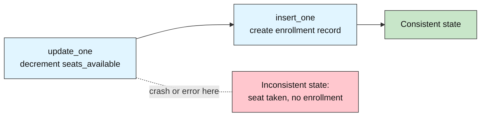
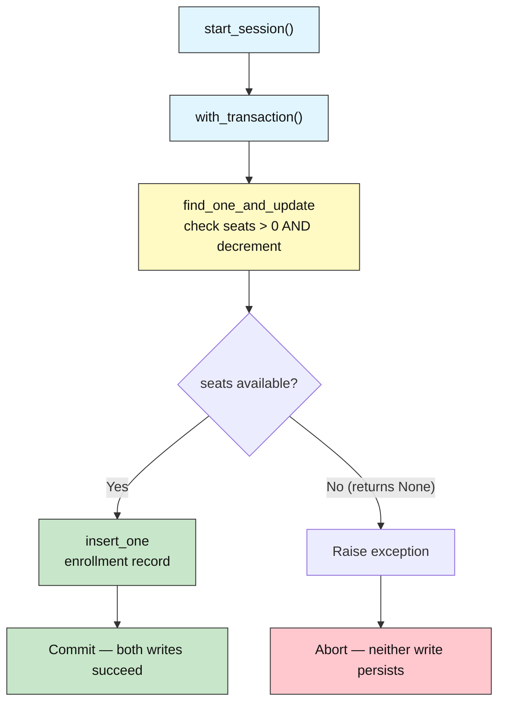
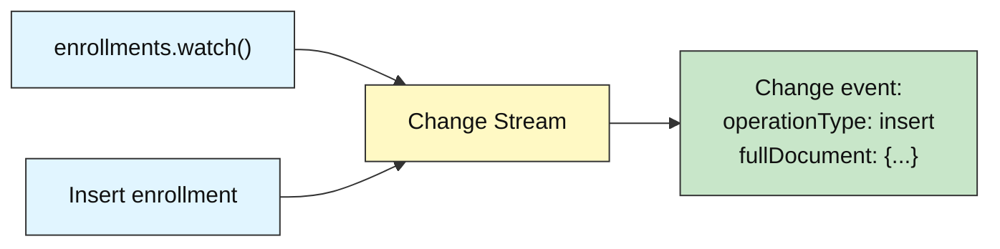
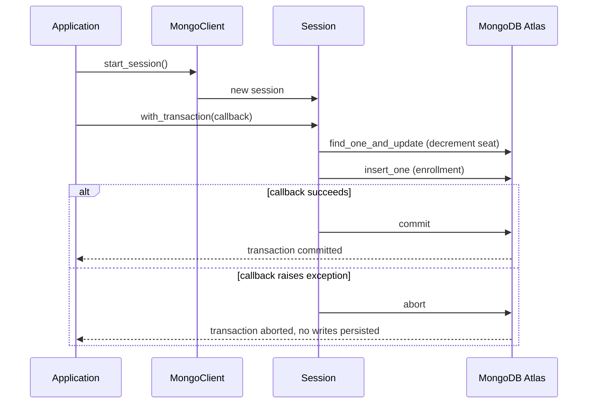

# MongoDB Advanced: How to Guarantee Data Consistency

## Enrollment Transactions

**Difficulty: Advanced | ~40 min | Requires Labs 1–4**

*Lab 5 of 7 in the MongoDB Mastery series.*

---

# Problem Statement / Use Case Overview

A university's enrollment system must decrement a course's seat count and create an enrollment record at the same time. If the seat decrement succeeds but the enrollment record fails — or vice versa — the database is left in an inconsistent state: a seat is taken with no student record, or a student is enrolled for a seat that was never reserved. Individual MongoDB writes are atomic, but these are *two separate operations across two collections*, and MongoDB cannot guarantee they both succeed or both fail without a **multi-document transaction**.

This lab teaches you to solve this problem with real ACID transactions, then demonstrates the abort path when a course is genuinely full, and finally introduces **change streams** (a real-time feed of write events) and a lightweight Python backup/restore pattern.

---

# Input Data

| Item | Detail |
|------|--------|
| **Courses** | 4 synthetic course records (`CS101`, `CS201`, `MATH101`, `PHYS101`) with deliberately small seat counts (2–5 seats) |
| **Course fields** | `course_id`, `title`, `seats_total`, `seats_available` |
| **Enrollments** | Starts empty; enrollment documents are created during the lab |
| **Enrollment fields** | `enrollment_id`, `student_id`, `student_name`, `course_id`, `enrolled_at` |
| **Domain** | Same student/university management system used in Labs 1–4 |

---

# Processing

### Part A — The Non-Atomic Problem



Two separate operations: a seat decrement and an enrollment insert. If anything goes wrong between them, the data is inconsistent.

### Part B — Transaction-Safe Enrollment



Both the seat check+decrement and the enrollment insert happen inside the same transaction. Either both persist, or neither does.

### Part C — Change Streams



A change stream watches a collection for writes in real time, producing an event for every insert, update, or delete.

---

# Output

**Step 2 — Populate (seed data):**

```
Inserted 4 courses.
Enrollments: 0 documents.
```

**Step 3 — Non-atomic enrollment:**

```
Step 3a: decremented seats_available for CS101
Step 3b: inserted enrollment document for STU999

Current state of CS101: seats_available = 2, enrollments = 1
```

**Step 4 — Transactional enrollment (3 students into CS101):**

```
Enrolled Alice Johnson (STU001) in CS101
Enrolled Bob Smith (STU002) in CS101
Enrolled Charlie Brown (STU003) in CS101

CS101 seats_available: 0
CS101 enrollments (3):
  STU001: Alice Johnson
  STU002: Bob Smith
  STU003: Charlie Brown
```

**Step 5 — Abort path (enroll into full CS101):**

```
Transaction aborted as expected: No seats available in CS101

After attempted overflow:
  seats_available: 0
  STU999 enrollment exists: False
```

**Step 6 — Change stream event (enrolling Diana Prince into CS201):**

```
Change stream event:
  operationType: insert
  fullDocument.student_id: STU010
  fullDocument.student_name: Diana Prince
  fullDocument.course_id: CS201
```

**Step 7 — Backup and restore:**

```
Backup saved to school_db_backup.json
  courses: 4 documents
  enrollments: 4 documents

Dropped collections. courses: 0, enrollments: 0
Restored. courses: 4, enrollments: 4
```

**Step 8 — Summary report:**

```
       ENROLLMENT TRANSACTIONS

Total courses: 4
Total enrollments: 4

Seats remaining per course:
  CS101: 0/3 seats available (3 enrolled)
  CS201: 4/5 seats available (1 enrolled)
  MATH101: 2/2 seats available (0 enrolled)
  PHYS101: 4/4 seats available (0 enrolled)
```

---

# Tech Stack

| Component | Tool |
|-----------|------|
| **MongoDB driver** | `pymongo[srv,tls]==4.10.1` — Python driver for MongoDB with SRV and TLS support |
| **Credential loader** | `python-dotenv==1.0.1` — loads `.env` files for credentials |
| **CA certificates** | `certifi` — provides up-to-date CA bundles for reliable SSL/TLS on all platforms |

> **Note:** This lab connects to a real MongoDB Atlas cluster. The connection string is stored in the `.env` file (see README Section 8) and loaded at runtime — credentials never appear in the notebook itself.

---

# Underlying Concepts

### Multi-Document ACID Transactions

README Section 4.6 introduces the idea: a group of writes either all succeed together or all fail together, with no partial state in between. Lab 5 applies this to an enrollment workflow where two documents across two collections must be updated atomically.

A transaction runs inside a **session** created by `client.start_session()`. All operations passed to `session.with_transaction()` share that session. If the callback function raises an exception, the transaction is **aborted** — every write inside it is rolled back as if it never happened. If the callback returns normally, the transaction is **committed** — all writes become visible at once.



The critical insight: the `find_one_and_update` filter `{"seats_available": {"$gt": 0}}` makes the availability check and the decrement **atomic together** within a single operation. This eliminates the race condition that would exist if you read the seat count, checked it in Python, and then decremented in a separate write.

### Change Streams

A **change stream** is a real-time feed of write operations on a collection (or database, or entire cluster). Opening one with `collection.watch()` returns a cursor that produces a change event for every insert, update, delete, or replace. Change events include the `operationType`, the `fullDocument` (for inserts), and metadata about which document was affected.

Change streams are the foundation for event-driven architectures: triggering notifications, syncing data to another system, or building real-time dashboards — all driven by the database itself rather than by polling.

### Lightweight Backup and Restore

The notebook implements backup as exporting every document in both collections to a local JSON file (encoding `ObjectId` as a string), and restore as wiping the collections and reinserting from that JSON. This is a lightweight pattern you can do entirely from Python — useful for small datasets, testing, or when you need to snapshot a specific subset of data without CLI access.

For production databases, use MongoDB Atlas's built-in `mongodump` / `mongorestore` CLI tools or Atlas's automated backup and point-in-time recovery, which operate at the storage engine level and are far more robust.

---

# Prerequisites

- **Labs 1–4 completed** — you should be familiar with connecting to MongoDB, inserting documents, running queries, using aggregation pipelines, and understanding schema design.
- **Basic Python knowledge** — variables, lists, dictionaries, loops, `import` statements, and exception handling with `try`/`except`.
- **MongoDB Atlas cluster set up** — the shared Atlas cluster and `.env` file are already configured (see README Section 8). This lab was verified against the free M0 tier (a 3-node replica set running MongoDB 8.0), which fully supports multi-document transactions, change streams, and all other features used here.

---

# Environment / Dependencies Setup

| Package | Purpose |
|---------|---------|
| `pymongo[srv,tls]` | Python driver for MongoDB with SRV and TLS support |
| `python-dotenv` | Loads `.env` files so credentials stay out of the notebook |
| `certifi` | Provides up-to-date CA certificates for reliable SSL/TLS on all platforms |

```bash
pip install -qU "pymongo[srv,tls]==4.10.1" python-dotenv==1.0.1 certifi
```

---

# Step-wise Development Instructions

---

### Step 1 — Connect to MongoDB

```python
import os
import certifi
from dotenv import load_dotenv
import pymongo

# Load the Atlas connection string from the .env file one directory up
load_dotenv("../.env")
uri = os.environ["MONGODB_URI"]

# Connect to the real MongoDB Atlas cluster
client = pymongo.MongoClient(uri, tlsCAFile=certifi.where())

# Access the database and collections
db = client["school_db"]
courses = db["courses"]
enrollments = db["enrollments"]

print("Connected to MongoDB Atlas")
```

Same connection pattern as Labs 1–4 — `load_dotenv` reads from the shared `.env` file, and `certifi.where()` provides trusted CA certificates for SSL.

---

### Step 2 — Populate Courses and Enrollments

```python
from datetime import datetime

courses.drop()
enrollments.drop()

# Insert 4 courses with deliberately small seat counts so we can
# realistically demonstrate a course filling up and a transaction aborting
course_records = [
    {"course_id": "CS101",   "title": "Introduction to Computer Science",
     "seats_total": 3, "seats_available": 3},
    {"course_id": "CS201",   "title": "Data Structures and Algorithms",
     "seats_total": 5, "seats_available": 5},
    {"course_id": "MATH101", "title": "Calculus I",
     "seats_total": 2, "seats_available": 2},
    {"course_id": "PHYS101", "title": "General Physics I",
     "seats_total": 4, "seats_available": 4},
]
courses.insert_many(course_records)
print(f"Inserted {len(course_records)} courses.")

# Enrollments starts empty — we will add enrollment documents in later steps
print(f"Enrollments: {enrollments.count_documents({})} documents.")
```

Each course tracks `seats_total` (maximum capacity) and `seats_available` (how many spots remain). The small counts — especially MATH101 with only 2 seats — let us demonstrate real aborts when a course fills up, rather than just describing the possibility hypothetically.

---

### Step 3 — The Problem: Non-Atomic Enrollment

```python
# Two separate operations: decrement seats, then insert the enrollment record
cid = "CS101"

courses.update_one(
    {"course_id": cid, "seats_available": {"$gt": 0}},
    {"$inc": {"seats_available": -1}}
)
print(f"Step 3a: decremented seats_available for {cid}")

enrollments.insert_one({
    "enrollment_id": "ENR999",
    "student_id": "STU999",
    "student_name": "Test Student",
    "course_id": cid,
    "enrolled_at": datetime.utcnow()
})
print(f"Step 3b: inserted enrollment document for STU999")

# Show the current state
course_after = courses.find_one({"course_id": cid}, {"_id": 0})
enr_count = enrollments.count_documents({"course_id": cid})
print(f"\nCurrent state of {cid}: seats_available = {course_after['seats_available']}, enrollments = {enr_count}")
```

This *happens* to work when nothing goes wrong — the seat decrement and the enrollment insert both succeed. The problem is that they are **two separate operations**. If the process crashes or an error occurs after the first `update_one` but before the `insert_one`, you get a seat taken with no enrollment record — or if the insert succeeds but the update fails, an enrollment exists for a seat that was never actually reserved. MongoDB guarantees that each *individual* write is atomic, but it cannot guarantee that two separate writes will both succeed or both fail. This is exactly the problem multi-document transactions are designed to solve.

---

### Step 4 — The Fix: Multi-Document Transaction

```python
# Reset CS101 back to full capacity for a clean demo
courses.update_one(
    {"course_id": "CS101"},
    {"$set": {"seats_available": 3}}
)
enrollments.delete_many({"course_id": "CS101"})

def enroll_student(session, cid, student_id, student_name):
    """Atomically decrement a seat and insert the enrollment record."""
    result = courses.find_one_and_update(
        {"course_id": cid, "seats_available": {"$gt": 0}},
        {"$inc": {"seats_available": -1}},
        session=session
    )
    if result is None:
        raise Exception(f"No seats available in {cid}")
    enrollments.insert_one({
        "enrollment_id": f"ENR{student_id[-3:]}",
        "student_id": student_id,
        "student_name": student_name,
        "course_id": cid,
        "enrolled_at": datetime.utcnow()
    }, session=session)

# Enroll 3 students into CS101 (which has 3 seats) using transactions
students_to_enroll = [
    ("STU001", "Alice Johnson"),
    ("STU002", "Bob Smith"),
    ("STU003", "Charlie Brown"),
]

for sid, sname in students_to_enroll:
    with client.start_session() as session:
        session.with_transaction(
            lambda s: enroll_student(s, "CS101", sid, sname)
        )
    print(f"Enrolled {sname} ({sid}) in CS101")

# Verify the state
cs101 = courses.find_one({"course_id": "CS101"}, {"_id": 0})
enr = list(enrollments.find({"course_id": "CS101"}, {"_id": 0, "enrollment_id": 0}))
print(f"\nCS101 seats_available: {cs101['seats_available']}")
print(f"CS101 enrollments ({len(enr)}):")
for e in enr:
    print(f"  {e['student_id']}: {e['student_name']}")
```

Each enrollment runs inside a **session** and a **transaction**. The `find_one_and_update` call checks that `seats_available > 0` and decrements it — and the `insert_one` call adds the enrollment record — both within the same transaction. If either operation fails, the entire transaction rolls back: no seat is taken without an enrollment, and no enrollment exists without a seat. The `find_one_and_update` with the `seats_available: {$gt: 0}` filter is the key — it makes the availability check and the decrement atomic together, so no two transactions can race past each other to claim the last seat.

---

### Step 5 — Abort Path: Enrolling Into a Full Course

```python
# CS101 now has 0 seats_available — try to enroll one more student
try:
    with client.start_session() as session:
        session.with_transaction(
            lambda s: enroll_student(s, "CS101", "STU999", "Overflow Student")
        )
    print("ERROR: This line should not print — enrollment should have failed.")
except Exception as e:
    print(f"Transaction aborted as expected: {e}")

# Verify nothing changed
cs101 = courses.find_one({"course_id": "CS101"}, {"_id": 0})
overflow = enrollments.find_one({"student_id": "STU999"})
print(f"\nAfter attempted overflow:")
print(f"  seats_available: {cs101['seats_available']}")
print(f"  STU999 enrollment exists: {overflow is not None}")
```

The `find_one_and_update` inside the transaction returned `None` because no document matched the filter `{"seats_available": {"$gt": 0}}` — the course is full. Our `enroll_student` function raises an exception, which causes `with_transaction` to **abort the entire transaction**. The result: `seats_available` stays at 0 (it did not go negative), and no enrollment document was created for STU999. The database is left in a perfectly consistent state, even though we attempted an invalid operation.

---

### Step 6 — Change Streams: Watching Enrollments in Real Time

```python
# Open a change stream on the enrollments collection
pipeline = []
change_stream = enrollments.watch(pipeline)

# Perform one more enrollment to generate a change event
with client.start_session() as session:
    session.with_transaction(
        lambda s: enroll_student(s, "CS201", "STU010", "Diana Prince")
    )

# Read the change event from the stream
event = change_stream.next()

print(f"Change stream event:")
print(f"  operationType: {event['operationType']}")
print(f"  fullDocument.student_id: {event['fullDocument']['student_id']}")
print(f"  fullDocument.student_name: {event['fullDocument']['student_name']}")
print(f"  fullDocument.course_id: {event['fullDocument']['course_id']}")

change_stream.close()
```

A **change stream** is a real-time feed of all write operations on a collection. `enrollments.watch()` opens the stream, and `next()` blocks until the next change arrives. The event tells you exactly what happened — `operationType` is `"insert"`, and `fullDocument` contains the newly inserted enrollment document. Change streams are the foundation for event-driven architectures: trigger a notification, sync to another system, or build a real-time dashboard — all driven by the database itself, not by polling.

---

### Step 7 — Lightweight Backup and Restore from Python

```python
import json

# --- Backup: export every document in both collections to a JSON file ---
backup = {
    "courses": [doc for doc in courses.find({}, {"_id": 0})],
    "enrollments": [doc for doc in enrollments.find({}, {"_id": 0})],
}

backup_path = "school_db_backup.json"
with open(backup_path, "w") as f:
    json.dump(backup, f, indent=2, default=str)

print(f"Backup saved to {backup_path}")
print(f"  courses: {len(backup['courses'])} documents")
print(f"  enrollments: {len(backup['enrollments'])} documents")
```

```python
# --- Restore: wipe both collections and reinsert from the JSON backup ---
courses.drop()
enrollments.drop()
print(f"Dropped collections. courses: {courses.count_documents({})}, enrollments: {enrollments.count_documents({})}")

with open(backup_path, "r") as f:
    restored = json.load(f)

if restored["courses"]:
    courses.insert_many(restored["courses"])
if restored["enrollments"]:
    enrollments.insert_many(restored["enrollments"])

print(f"Restored. courses: {courses.count_documents({})}, enrollments: {enrollments.count_documents({})}")
```

This is a lightweight backup/restore pattern you can do entirely from Python — exporting documents as JSON and reinserting them to restore state. For production databases, use MongoDB Atlas's built-in `mongodump` / `mongorestore` CLI tools or Atlas's automated backup and point-in-time recovery, which operate at the storage engine level and are far more robust. The Python approach above is useful for small datasets, testing, or when you need to snapshot a specific subset of data without CLI access.

---

### Step 8 — Summary Report

```python
total_courses = courses.count_documents({})
total_enrollments = enrollments.count_documents({})

print("       ENROLLMENT TRANSACTIONS")
print(f"\nTotal courses: {total_courses}")
print(f"Total enrollments: {total_enrollments}")

print("\nSeats remaining per course:")
for c in courses.find({}, {"_id": 0}).sort("course_id", 1):
    enr_count = enrollments.count_documents({"course_id": c["course_id"]})
    print(f"  {c['course_id']}: {c['seats_available']}/{c['seats_total']} seats available ({enr_count} enrolled)")
```

Collects the key metrics from both collections into one formatted report — course counts, remaining seats per course, and total enrollments across the system.

---

# Optional Exercise

Modify `enroll_student` to also accept an `overwrite` flag. When `overwrite=True` and the student already has an enrollment in the target course, the function should first delete the old enrollment, then insert the new one — all inside the same transaction. Test this by re-enrolling STU001 (Alice Johnson) into CS101 with `overwrite=True` and verifying that she still appears exactly once in the enrollments collection for CS101.

---

# What We Learnt

- **Multi-document transactions guarantee atomicity across collections** — a seat decrement and an enrollment insert either both succeed or both fail, leaving the database in a consistent state no matter what happens in between.
- **`client.start_session()` creates a session** that groups operations into a transaction; `session.with_transaction(callback)` runs the callback inside that transaction, committing on success and aborting on exception.
- **`find_one_and_update` with a `$gt: 0` filter** makes the availability check and the decrement atomic in one operation — this eliminates the race condition that a separate read-then-write would introduce.
- **The abort path is real and verifiable** — when a course is full, the `find_one_and_update` returns `None`, the callback raises, and the transaction rolls back with no partial writes.
- **Change streams provide a real-time feed of write events** — `collection.watch()` opens a cursor that produces change events for every insert, update, or delete, with the `operationType` and `fullDocument` fields describing what happened.
- **Lightweight Python backup/restore** works by exporting documents to JSON and reinserting them — useful for small datasets, while `mongodump` / `mongorestore` or Atlas's automated backups are the production-grade equivalents.
- **Schema design decisions from Lab 4 carry into transactional workflows** — referencing courses by `course_id` in enrollment documents is what makes multi-document transactions the right pattern here, rather than embedding.
