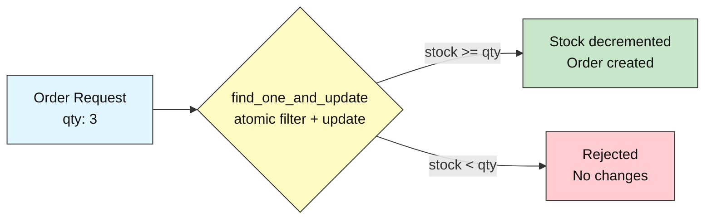
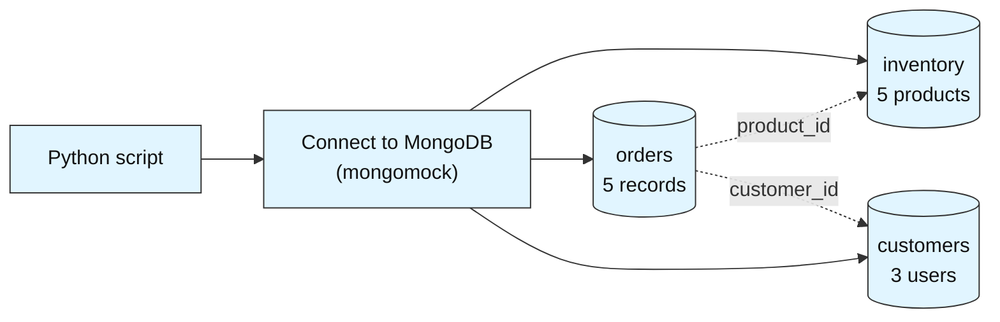
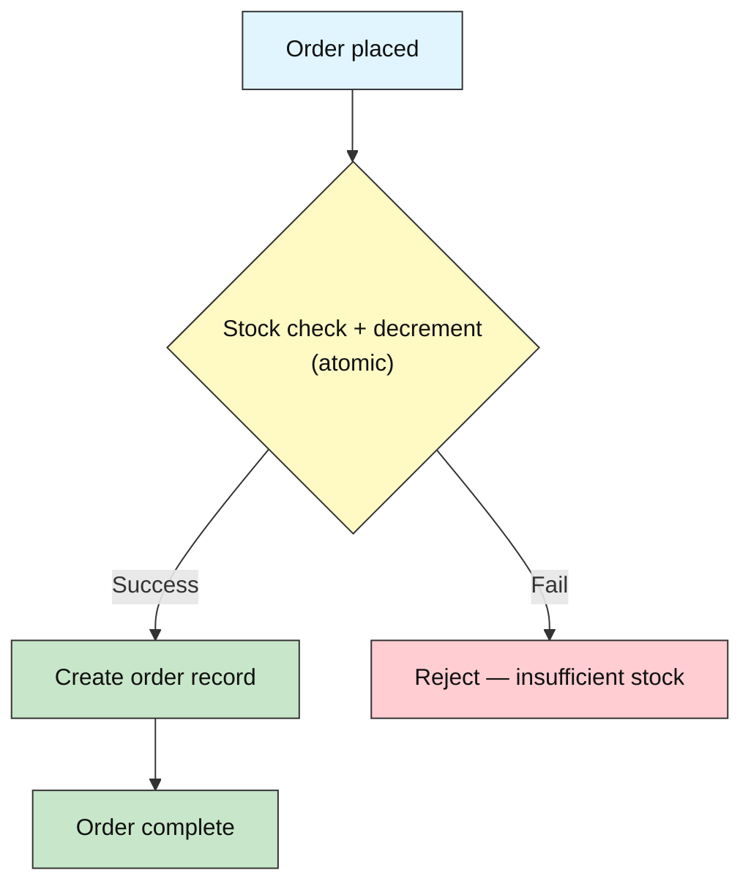

# Reliable Order Processing System

**Difficulty: Advanced | ~50 min | Requires Labs 1–4**

*Lab 5 of 7 in the MongoDB Mastery series.*

---

# Problem Statement / Use Case Overview

An e-commerce platform processes thousands of orders per day. When a customer places an order, the system must simultaneously decrement inventory and create an order record — if one operation succeeds but the other fails, the database ends up in an inconsistent state (e.g., inventory shows zero stock but no order exists). The platform also needs real-time notifications when new orders arrive and a disaster recovery plan in case of data loss.

This lab teaches production-grade reliability patterns using MongoDB. You will implement atomic order placement and cancellation, build a revenue aggregation pipeline, simulate change streams for real-time order monitoring, and perform backup and restore operations. By the end, you will have a working order processing system that handles edge cases gracefully.

Before diving into the code, it helps to understand the core MongoDB concepts this lab uses.

### ACID Transactions

ACID stands for Atomicity, Consistency, Isolation, and Durability — the four properties that guarantee database operations are reliable:

- **Atomicity** — a operation either completes entirely or not at all; no partial writes.
- **Consistency** — the database moves from one valid state to another; constraints are never violated.
- **Isolation** — concurrent operations don't interfere with each other.
- **Durability** — once committed, data survives crashes.

In MongoDB, single-document operations are atomic by default. For multi-document operations, MongoDB provides multi-document transactions (requiring a replica set). In this lab, we demonstrate atomic operations on single documents using `find_one_and_update` — the practical alternative when a full replica set is unavailable.

### Atomic Operations

`find_one_and_update` performs a filter-check and update in a single atomic step. The filter condition acts as a guard — if it passes, the update is applied; if it fails, nothing changes. This prevents race conditions that occur with separate find-then-update sequences, where another process could modify the document between the find and the update.



### Change Streams

Change streams allow applications to listen for real-time changes on a collection, database, or cluster. When a document is inserted, updated, or deleted, the change stream fires an event with the full document or the delta. This is the foundation for event-driven architectures — notifications, triggers, and real-time dashboards.

> **Why this matters:** Without atomic operations, order processing systems are vulnerable to race conditions that corrupt data. Change streams enable reactive systems that respond to database changes in real time. Together, these patterns form the backbone of reliable, production-grade MongoDB applications.

---

# Input Data

| Item | Detail |
|------|--------|
| **Inventory** | 5 products (Wireless Mouse, Keyboard, USB Hub, Monitor, Laptop Stand) |
| **Customers** | 3 customers (Alice, Bob, Charlie) |
| **Order History** | 5 past orders for aggregation and analytics |
| **Fields (inventory)** | `product_id`, `name`, `price`, `quantity` |
| **Fields (orders)** | `order_id`, `customer_id`, `product_id`, `quantity`, `total`, `date`, `status` |
| **Fields (customers)** | `customer_id`, `name`, `email` |

---

# Processing

### Part A — Data Setup



Three collections are seeded: `inventory` (product catalog with stock levels), `orders` (order history), and `customers` (registered users).

### Part B — Atomic Order Placement



Order placement uses `find_one_and_update` with a stock guard (`quantity >= qty`) to atomically decrement inventory. If the guard fails, the order is rejected with no partial changes. Order cancellation reverses the stock change using `$inc`.

### Part C — Analytics and Monitoring

Revenue is computed via a `$lookup` + `$group` aggregation pipeline joining orders with inventory. Change streams are simulated by polling for new orders (a real MongoDB replica set would support native change streams via `collection.watch()`). Backup and restore demonstrate disaster recovery using JSON export and re-import.

---

# Output

**Collections seeded:**
```
Inventory: 5 products
Orders:    5 historical orders
Customers: 3 users
```

**Successful order (atomic placement):**
```
Order placed: ORD-S1001 | Laptop Stand x1 | $49.99
Inventory: Laptop Stand stock = 14 (was 15)
```

**Failed order (insufficient stock):**
```
Failed: Only 14 Laptop Stand(s) in stock, order was for 20
Inventory unchanged: Laptop Stand stock = 14
```

**Revenue by product:**
```
Laptop Stand  | 4 sold | $199.96
Keyboard      | 3 sold | $149.97
Wireless Mouse| 2 sold | $59.98
Monitor       | 1 sold | $249.99
USB Hub       | 1 sold | $24.99
```

**Change stream event:**
```
[INSERT] order_id=ORD-S1001 customer=alice product=Laptop Stand qty=1 total=$49.99
```

**Backup and restore:**
```
Backup:   5 orders, 5 inventory items, 3 customers exported
Restore:  5 orders, 5 inventory items, 3 customers restored
```

**Summary report** ties together order count, inventory products, customers, revenue, and indexes.

---

# Tech Stack

| Component | Tool |
|-----------|------|
| **MongoDB driver** | `pymongo==4.10.1` — Python driver for MongoDB |
| **Mock server** | `mongomock` — in-memory MongoDB simulation |

---

# Prerequisites

- **Labs 1–4 completed** — you should be comfortable with CRUD operations, aggregation pipelines, `$lookup`, `$unwind`, `$group`, and indexing.
- **Basic Python knowledge** — dictionaries, lists, loops, f-strings.

---

# Environment / Dependencies Setup

| Package | Purpose |
|---------|---------|
| `pymongo` | Python driver for MongoDB — used to connect, insert, aggregate, and create indexes |
| `mongomock` | In-memory mock of MongoDB — no server installation needed |

```bash
pip install -qU pymongo==4.10.1 mongomock
```

---

# Step-wise Development Instructions

---

### Step 1 — Connect and Create Collections

```python
import pymongo
import mongomock
import json
from datetime import datetime

client = mongomock.MongoClient()
db = client["order_system"]
inventory = db["inventory"]
orders = db["orders"]
customers = db["customers"]

print("Connected to order_system database")
```

We create three collections: `inventory` for product stock levels, `orders` for order records, and `customers` for registered users. This three-collection design separates concerns — stock management, order processing, and user data are independent domains.

---

### Step 2 — Seed Inventory

```python
inventory_data = [
    {"product_id": "P001", "name": "Wireless Mouse",  "price": 29.99, "quantity": 20},
    {"product_id": "P002", "name": "Keyboard",        "price": 49.99, "quantity": 15},
    {"product_id": "P003", "name": "USB Hub",         "price": 24.99, "quantity": 30},
    {"product_id": "P004", "name": "Monitor",         "price": 249.99, "quantity": 8},
    {"product_id": "P005", "name": "Laptop Stand",    "price": 49.99, "quantity": 15},
]

inventory.insert_many(inventory_data)
print(f"Inventory: {inventory.count_documents({})} products")
for item in inventory.find({}, {"_id": 0}):
    print(f"  {item['name']:<18} | ${item['price']:<7} | qty: {item['quantity']}")
```

Each inventory document tracks `quantity` — the number of units in stock. This field will be atomically decremented when orders are placed and incremented when orders are cancelled.

---

### Step 3 — Seed Order History and Customers

```python
customer_data = [
    {"customer_id": "alice", "name": "Alice Johnson", "email": "alice@example.com"},
    {"customer_id": "bob",   "name": "Bob Smith",    "email": "bob@example.com"},
    {"customer_id": "charlie","name": "Charlie Brown","email": "charlie@example.com"},
]
customers.insert_many(customer_data)

order_data = [
    {"order_id": "ORD-1001", "customer_id": "alice",   "product_id": "P001", "quantity": 2, "total": 59.98,  "date": "2025-01-15", "status": "completed"},
    {"order_id": "ORD-1002", "customer_id": "bob",     "product_id": "P002", "quantity": 1, "total": 49.99,  "date": "2025-02-20", "status": "completed"},
    {"order_id": "ORD-1003", "customer_id": "charlie", "product_id": "P004", "quantity": 1, "total": 249.99, "date": "2025-03-10", "status": "completed"},
    {"order_id": "ORD-1004", "customer_id": "alice",   "product_id": "P003", "quantity": 1, "total": 24.99,  "date": "2025-04-05", "status": "completed"},
    {"order_id": "ORD-1005", "customer_id": "bob",     "product_id": "P002", "quantity": 2, "total": 99.98,  "date": "2025-05-12", "status": "completed"},
]
orders.insert_many(order_data)

print(f"Customers: {customers.count_documents({})}")
print(f"Orders:    {orders.count_documents({})}")
```

The order history provides data for the aggregation pipeline in Step 7. Each order tracks `status` (completed, pending, cancelled) to support different order lifecycle operations.

---

### Step 4 — Atomic Order Placement (find_one_and_update)

```python
def place_order(customer_id, product_id, qty):
    """Place an order atomically: decrement stock + create order in one step."""
    now = datetime.now().strftime("%Y-%m-%d %H:%M:%S")
    order_id = f"ORD-S{orders.count_documents({}) + 1001}"

    updated = inventory.find_one_and_update(
        {"product_id": product_id, "quantity": {"$gte": qty}},
        {"$inc": {"quantity": -qty}},
    )

    if updated is None:
        item = inventory.find_one({"product_id": product_id}, {"_id": 0})
        if item and item["quantity"] < qty:
            return None, f"Only {item['quantity']} {item['name']}(s) in stock, order was for {qty}"
        return None, f"Product {product_id} not found"

    total = updated["price"] * qty
    orders.insert_one({
        "order_id": order_id, "customer_id": customer_id,
        "product_id": product_id, "quantity": qty,
        "total": total, "date": now, "status": "completed",
    })

    updated_stock = inventory.find_one({"product_id": product_id}, {"_id": 0, "quantity": 1})
    return order_id, f"${total:.2f} | Stock remaining: {updated_stock['quantity']}"

order_id, result = place_order("alice", "P005", 1)
print(f"Order placed: {order_id} | Laptop Stand x1 | {result}")
```

The key design decision: `find_one_and_update` with `{"$gte": qty}` as the filter is a single atomic operation. The filter checks stock *and* decrements in one step — no window where another process could modify the quantity between the check and the decrement. This prevents overselling under concurrent access.

---

### Step 5 — Atomic Order Cancellation

```python
def cancel_order(order_id):
    """Cancel an order atomically: restore stock + remove order in one step."""
    order = orders.find_one({"order_id": order_id})
    if not order:
        return False, "Order not found"

    inventory.update_one(
        {"product_id": order["product_id"]},
        {"$inc": {"quantity": order["quantity"]}}
    )
    orders.delete_one({"order_id": order_id})
    return True, f"Restored {order['quantity']} unit(s) of {order['product_id']}"

success, msg = cancel_order("ORD-S1001")
print(f"Cancellation: {msg}")

item = inventory.find_one({"product_id": "P005"}, {"_id": 0})
print(f"Laptop Stand stock after cancel: {item['quantity']}")
```

Cancellation reverses the stock change atomically using `$inc` with a positive value. In a production system, you would wrap both the `$inc` and `delete_one` in a multi-document transaction to ensure both succeed or both fail. With `mongomock`, we rely on the single-document atomic `$inc` for the critical stock update.

---

### Step 6 — Insufficient Stock (Failure Handling)

```python
order_id, msg = place_order("charlie", "P005", 20)
print(f"Failed: {msg}")

item = inventory.find_one({"product_id": "P005"}, {"_id": 0})
print(f"Stock unchanged: {item['name']} quantity = {item['quantity']}")
```

When the filter `{"$gte": 20}` fails (stock is less than 20), `find_one_and_update` returns `None` and makes no changes. This is the atomic guard in action — the stock check and decrement are a single operation, so there is no partial state where stock was decremented but no order was created.

---

### Step 7 — Revenue by Product (Aggregation)

```python
pipeline = [
    {"$lookup": {
        "from": "inventory", "localField": "product_id",
        "foreignField": "product_id", "as": "product"
    }},
    {"$unwind": "$product"},
    {"$group": {
        "_id": "$product.name",
        "total_qty": {"$sum": "$quantity"},
        "total_revenue": {"$sum": "$total"}
    }},
    {"$sort": {"total_revenue": -1}},
    {"$project": {"_id": 0, "product": "$_id", "total_qty": 1,
                  "total_revenue": {"$round": ["$total_revenue", 2]}}}
]

print("--- Revenue by Product ---")
for doc in orders.aggregate(pipeline):
    print(f"{doc['product']:<18} | {doc['total_qty']} sold | ${doc['total_revenue']}")
```

This pipeline joins orders with inventory to get product names, groups by product to sum quantities and revenue, and sorts by revenue descending. The `$round` stage ensures clean currency formatting in the output.

---

### Step 8 — Change Stream Simulation

```python
new_order_id, _ = place_order("bob", "P001", 1)

change_events = []
for order in orders.find({"order_id": {"$regex": "^ORD-S"}}):
    product = inventory.find_one({"product_id": order["product_id"]}, {"_id": 0, "name": 1})
    change_events.append({
        "operationType": "insert",
        "fullDocument": {
            "order_id": order["order_id"],
            "customer_id": order["customer_id"],
            "product": product["name"],
            "quantity": order["quantity"],
            "total": order["total"],
        }
    })

print("--- Change Stream Events (Simulated) ---")
for evt in change_events:
    doc = evt["fullDocument"]
    print(f"[{evt['operationType'].upper()}] order_id={doc['order_id']} "
          f"customer={doc['customer_id']} product={doc['product']} "
          f"qty={doc['quantity']} total=${doc['total']:.2f}")
```

In production MongoDB, `orders.watch()` returns a cursor that yields change events as documents are inserted or updated. Since `mongomock` does not support native change streams, we simulate the pattern by querying for newly inserted orders and constructing event objects. The structure mirrors what a real change stream event looks like.

---

### Step 9 — Backup and Restore

```python
backup = {}
for name in ["orders", "inventory", "customers"]:
    backup[name] = list(db[name].find({}, {"_id": 0}))

with open("order_system_backup.json", "w") as f:
    json.dump(backup, f, indent=2)

print(f"Backup: {len(backup['orders'])} orders, "
      f"{len(backup['inventory'])} inventory items, "
      f"{len(backup['customers'])} customers exported")
```

The backup exports each collection to a JSON file. In production, you would use `mongodump` for binary backups (faster, supports point-in-time recovery) or MongoDB Atlas continuous backups for managed cloud deployments.

```python
for name in ["orders", "inventory", "customers"]:
    db[name].drop()
    db[name] = db.create_collection(name)

with open("order_system_backup.json", "r") as f:
    backup = json.load(f)

for name in ["orders", "inventory", "customers"]:
    if backup[name]:
        db[name].insert_many(backup[name])

print(f"Restore: {db['orders'].count_documents({})} orders, "
      f"{db['inventory'].count_documents({})} inventory items, "
      f"{db['customers'].count_documents({})} customers restored")
```

Restore clears each collection and re-imports from the JSON backup. The `drop()` + `create_collection()` pattern ensures a clean slate — no stale documents remain from the original data. In production, `mongorestore` handles this with journaling and corruption detection.

---

### Step 10 — Create Indexes

```python
orders.create_index("customer_id")
orders.create_index("date")
orders.create_index([("customer_id", 1), ("date", -1)])

print("Indexes created.")
print("Orders indexes:", list(orders.index_information().keys()))
```

The compound index on `(customer_id, date)` supports the common query pattern "show me this customer's orders, most recent first" — the index covers both the filter and the sort, avoiding an in-memory sort stage.

---

### Step 11 — Print Summary Report

```python
total_orders = orders.count_documents({})
total_inventory = inventory.count_documents({})
total_customers = customers.count_documents({})

rev_pipeline = [
    {"$group": {"_id": None, "total": {"$sum": "$total"}}}
]
total_revenue = list(orders.aggregate(rev_pipeline))[0]["total"]

print("       RELIABLE ORDER PROCESSING — SUMMARY REPORT")
print(f"\nOrders:    {total_orders}")
print(f"Inventory: {total_inventory} products")
print(f"Customers: {total_customers}")
print(f"Revenue:   ${total_revenue:.2f}")
print(f"\n--- Indexes ---")
print(f"  Orders: {list(orders.index_information().keys())}")
```

Re-runs the key queries and aggregates total order count, product count, customer count, and revenue. Prints everything in a single formatted summary report.

---

# Optional Exercise

Replace `mongomock` with a real MongoDB server running as a single-node replica set (`mongod --replSet rs0`). Use `client.start_session()` and `session.with_transaction()` to wrap the order placement logic (decrement inventory + create order) in a multi-document transaction. Verify that if the order insertion fails, the inventory decrement is rolled back.

---

# What We Learnt

- **`find_one_and_update` performs atomic filter-check and update** — prevents race conditions by combining the check and mutation into a single operation.
- **The `$gte` filter acts as a guard** — the update only applies when the condition is met, preventing overselling under concurrent access.
- **`$inc` atomically adjusts numeric fields** — safe for concurrent inventory updates without reading the current value first.
- **Cancellation restores stock atomically** — using `$inc` with a positive value reverses the decrement.
- **Aggregation pipelines with `$lookup` join related data** — enabling revenue analytics across orders and inventory.
- **Change streams provide real-time reactivity** — listen for inserts, updates, and deletes as they happen.
- **Backup and restore ensure disaster recovery** — JSON export/import is the simplest form; `mongodump`/`mongorestore` are production-grade.
- **Compound indexes optimize multi-field queries** — `(customer_id, date)` covers both filter and sort in one index.
- **Atomic operations are the foundation of data integrity** — without them, concurrent order processing leads to inconsistent states.

With Lab 5 done, you understand transaction patterns and can build reliable order processing systems. Lab 6 moves into cluster management — replica sets, sharding, RBAC, and TLS.
