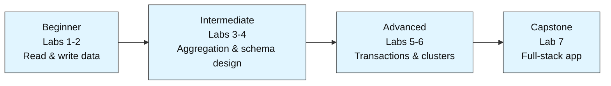

# MongoDB Labs

A hands-on lab series for learning MongoDB from scratch. You start with the basics — connecting to a database, inserting data, and running simple queries — and work your way up to building real applications with transactions, indexing, and production-grade security.

Each lab is built around one small, self-contained project (a student database, a task tracker, a sales pipeline) so you learn by building something real, not by reading theory. Every lab ships as three files: a Jupyter notebook with code you can run, a markdown guide that explains what's happening and why, and an assignment with exercises and an answer key so you can test what you learned.



No prior MongoDB experience is needed — Labs 1-2 teach the fundamentals from zero. Labs 3-4 move into aggregation pipelines and schema design. Labs 5-6 cover transactions and cluster management. Lab 7 ties everything together into one working app.

## Labs

| # | Lab | Level | Est. Time | What You Learn |
|---|-----|-------|-----------|-----------------|
| 1 | Student Records Lookup System | Beginner | ~35 min | Connect, insert, filter, sort, aggregate |
| 2 | Personal Task Tracker | Beginner | ~35 min | Full CRUD lifecycle, upserts, re-query after mutations |
| 3 | Sales Analytics Pipeline | Intermediate | ~45 min | Aggregation pipelines, indexing, `.explain()` |
| 4 | Multi-Tenant Blog Backend | Intermediate | ~45 min | Schema design, embedding vs. referencing, `$lookup`, text search |
| 5 | Reliable Order Processing System | Advanced | ~50 min | Transactions, change streams, backup/restore |
| 6 | Scaling and Securing a Cluster | Advanced | ~40 min | Replica sets, sharding, RBAC, TLS |
| 7 | End-to-End Mini App | Capstone | ~60 min | Full-stack: schema + CRUD + analytics + indexing |

## Repository Structure

Each lab is a set of three files, named consistently as `labN<topic>`:

```
lab1studentrecordslookup.ipynb              # the runnable pipeline
lab1studentrecordslookup.md                 # concept write-up: problem statement, diagrams, step-by-step explanation
lab1studentrecordslookupassignment.md       # practice exercises + answer key
```

Open the `.ipynb` to run the lab, read the `.md` alongside it if a step doesn't make sense, and use the `assignment.md` afterward to check you actually absorbed the concept.

## Prerequisites

- Basic Python — variables, dictionaries, lists, loops, `import` statements.
- No MongoDB experience required for Labs 1-2; each lab only assumes what the earlier ones taught.
- No database installation required for Labs 1-4 — they run on `pymongo` (the MongoDB Python driver) plus `mongomock` (an in-memory mock server), so there's nothing to install beyond Python packages. Labs 5-6 involve concepts (replication, sharding, security) that go beyond what an in-memory mock can fully demonstrate, so those labs call out where a real MongoDB server is assumed.

## Getting Started

1. Start with Lab 1, in order — later labs assume the concepts taught in earlier ones.
2. Each notebook has a `!pip install` cell at the top. Run that first, then follow the steps.
3. If a step is confusing, check the matching `.md` file — it explains the *why*, not just the *how*.
4. After finishing a lab, try the assignment before checking the answer key.