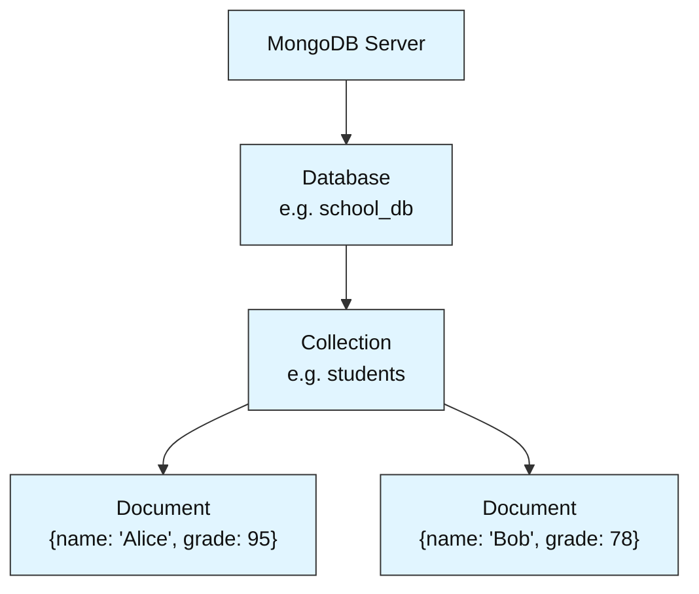
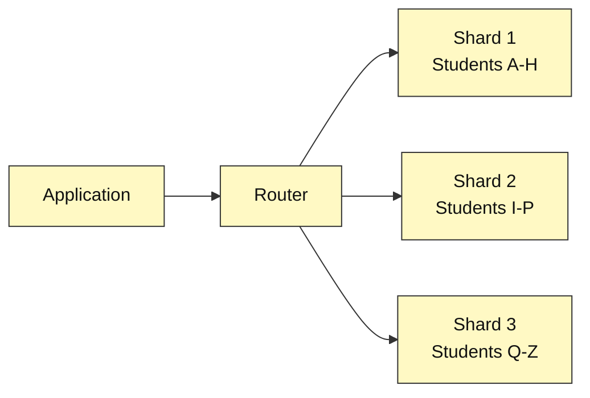
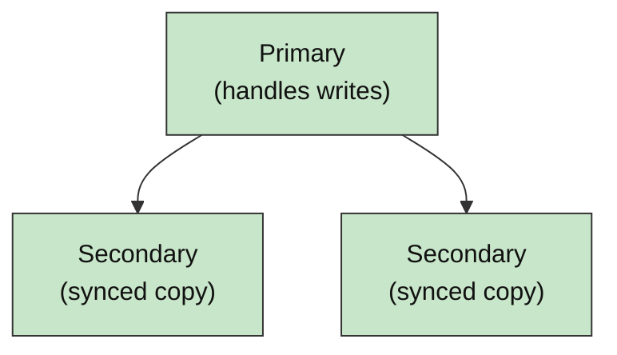
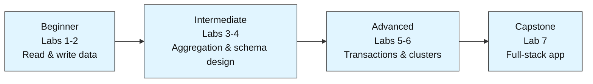

# MongoDB Labs — Foundations to Production

This module teaches MongoDB from first principles through seven hands-on labs. This README is the starting point: it explains what MongoDB is, how it works, and how the labs are organized. Read it fully before opening Lab 1.

---

## 1. What Is MongoDB?

MongoDB is a database — a system for storing and retrieving data, the same basic job as MySQL or PostgreSQL. The difference is *how* it stores that data: as flexible, JSON-like records called **documents**, rather than fixed rows in a table.

It exists because real applications kept hitting the same problem. Data whose shape changes over time — a user profile that gains a new field, a product that has attributes other products don't — is awkward to store in a table that demands every row look identical. MongoDB was built in 2007, and released publicly in 2009, specifically to remove that constraint.

> **In one line:** a relational database is a filing cabinet where every folder must have identical tabs. MongoDB is a shelf of folders where each one holds only what that particular case needs.

### 1.1 NoSQL: Not Only SQL

MongoDB is usually described as a **NoSQL database**. The term doesn't mean "no SQL is involved" — it stands for **"Not Only SQL,"** a category of databases built as alternatives to the traditional table-based, relational model. Within that category, MongoDB belongs to a specific family called **document databases**.

### 1.2 What Problem It Actually Solves

The core trade a document database makes is this: it gives up the strict, uniform structure of a table, in exchange for letting each record's shape evolve independently. That trade is worth it for data that genuinely varies — user profiles, product catalogs, content — and less worth it for data that is naturally uniform and relational, which Section 6 covers.

---

## 2. Core Building Blocks

Everything in MongoDB fits into one hierarchy: a server holds databases, a database holds collections, a collection holds documents.



### 2.1 Document

A document is one record — one student, one order, one blog post — written as key-value pairs:

```json
{ "name": "Alice", "course": "Computer Science", "grade": 95 }
```

Each key (`name`, `course`, `grade`) is a **field**.

### 2.2 Collection

A collection is a group of related documents, playing the same role a table plays in SQL. Unlike a table, it has no fixed set of columns — one document can carry a field another document in the same collection doesn't have.

### 2.3 Database

A database is a named container holding one or more collections. Labs in this module use databases such as `school_db` and `task_db`.

### 2.4 The `_id` Field

Every document receives a unique `_id` field automatically at the moment it's inserted, whether or not one is supplied. MongoDB uses this field as the document's permanent fingerprint.

### 2.5 BSON: What's Actually Stored on Disk

Documents look like JSON when you write them, but MongoDB stores them internally as **BSON** (Binary JSON) — a binary format that supports additional data types (like native dates) and is faster to read and write than plain-text JSON. This conversion is automatic; `pymongo` handles it without any extra code.

---

## 3. MongoDB vs. Relational Databases

### 3.1 Side-by-Side Comparison

| Aspect | Relational (SQL) | MongoDB (NoSQL) |
|---|---|---|
| Basic unit of data | A row in a table | A document in a collection |
| Schema | Fixed — every row has the same columns | Flexible — every document can differ |
| How related data connects | Joins across separate tables | Embedding or referencing (Section 3.2) |
| Query language | SQL | JSON-style filter queries |
| Scaling approach | Primarily vertical (a bigger server) | Built for horizontal scaling (Section 4.2) |

### 3.2 Embedding vs. Referencing

MongoDB documents can hold nested data, which creates a design choice SQL doesn't require: put related data *inside* the same document (**embedding**), or store it separately and link to it by ID (**referencing**, similar to a SQL foreign key).

Embedding suits data that is always read together and doesn't grow without bound — an order and its shipping address, for instance. Referencing suits data that is large, shared across many documents, or updated independently — a blog post referencing its author, since one author writes many posts. Lab 4 applies this decision directly.

---

## 4. Key Features

### 4.1 Flexible Schema

Documents in the same collection don't need to match each other, so applications can add fields as requirements change without a schema migration. New documents carry the new field; existing documents are unaffected.

### 4.2 Sharding — Horizontal Scaling

When a single server can no longer hold or serve a collection efficiently, MongoDB can split that collection across multiple servers automatically. This is **sharding**.



Lab 6 covers this at a conceptual level.

### 4.3 Replica Sets — High Availability

A **replica set** is a group of servers holding synchronized copies of the same data. One server (the primary) accepts writes; the others (secondaries) stay in sync automatically and can take over if the primary fails.



This is also covered in Lab 6.

### 4.4 Aggregation Pipeline

Rather than pulling raw data into application code to process it, MongoDB can transform data in stages directly inside the database — filtering, grouping, counting, averaging. This is an **aggregation pipeline**, functionally equivalent to SQL's `GROUP BY`, expressed as a sequence of steps. Lab 1 introduces it; Lab 3 goes further.

### 4.5 Indexing

An **index** lets MongoDB locate matching documents without scanning an entire collection, the same role an index plays at the back of a book. Without the right index, a query that should take milliseconds can take seconds as a collection grows. Lab 3 demonstrates the difference using `.explain()`.

### 4.6 ACID Transactions

Since version 4.0, MongoDB supports multi-document **ACID transactions**: a group of writes either all succeed together or all fail together, with no partial state in between. This addresses a common misconception that document databases cannot offer strict consistency. Lab 5 applies this to an order-processing scenario.

---

## 5. Real-World Use Cases

| Use Case | Why MongoDB Fits |
|---|---|
| Content management systems | Articles and pages naturally have varying fields |
| E-commerce product catalogs | Different product types need different attributes |
| Real-time analytics dashboards | Aggregation pipelines summarize data quickly |
| IoT and sensor data | High write volume, flexible event shapes |
| Mobile and social app backends | User-generated data changes shape constantly |
| Logging and event data | Schema-less by nature, high insert speed |

---

## 6. When MongoDB Isn't the Right Fit

Data that is naturally tabular and rarely changes shape — financial ledgers with strict row-level relationships, for example — is often better served by a relational database's enforced structure and mature join support.

Applications that depend heavily on complex, multi-table joins with strict referential integrity have traditionally leaned on relational databases, though MongoDB's `$lookup` (Lab 4) and transactions (Lab 5) narrow that gap considerably.

The practical guidance: MongoDB is a strong default for flexible, evolving, high-volume data — not a universal replacement for every database.

---

## 7. Glossary

| Term | Meaning |
|---|---|
| Document | One record, stored as key-value fields |
| Collection | A group of related documents |
| Database | A container holding one or more collections |
| BSON | The binary format documents are stored in internally |
| `_id` | The unique, auto-generated identifier every document receives |
| Embedding | Nesting related data inside one document |
| Referencing | Linking to related data by storing its `_id` |
| Sharding | Splitting a collection across multiple servers |
| Replica Set | A group of servers holding synchronized copies of the same data |
| Aggregation Pipeline | A sequence of stages that transform data inside the database |
| Index | A lookup structure that speeds up queries |
| ACID Transaction | A group of writes that succeed or fail together, as one unit |

---

## 8. Module Roadmap

### 8.1 Lab Sequence



| # | Lab | Level | Est. Time | What You Learn |
|---|-----|-------|-----------|-----------------|
| 1 | Student Records Lookup System | Beginner | ~35 min | Connect, insert, filter, sort, aggregate |
| 2 | Personal Task Tracker | Beginner | ~35 min | Full CRUD lifecycle, upserts, re-query after mutations |
| 3 | Sales Analytics Pipeline | Intermediate | ~45 min | Aggregation pipelines, indexing, `.explain()` |
| 4 | Multi-Tenant Blog Backend | Intermediate | ~45 min | Schema design, embedding vs. referencing, `$lookup`, text search |
| 5 | Reliable Order Processing System | Advanced | ~50 min | Transactions, change streams, backup/restore |
| 6 | Scaling and Securing a Cluster | Advanced | ~40 min | Replica sets, sharding, RBAC, TLS |
| 7 | End-to-End Mini App | Capstone | ~60 min | Full-stack: schema + CRUD + analytics + indexing |

### 8.2 Repository Structure

Each lab is a set of three files, named consistently as `labN<topic>`:

```
lab1studentrecordslookup.ipynb              # the runnable pipeline
lab1studentrecordslookup.md                 # concept write-up: problem statement, diagrams, step-by-step explanation
lab1studentrecordslookupassignment.md       # practice exercises + answer key
```

Open the `.ipynb` to run the lab, read the matching `.md` if a step needs more explanation, and use `assignment.md` afterward to verify understanding.

---

## 9. Prerequisites

Basic Python — variables, dictionaries, lists, loops, `import` statements — is the only requirement.

No prior MongoDB experience is assumed for Labs 1-2; each later lab builds only on what earlier ones taught. No database installation is required for Labs 1-4, since they run on `pymongo` (the official MongoDB Python driver) and `mongomock` (an in-memory mock server). Labs 5-6 involve replication, sharding, and security concepts that exceed what an in-memory mock can fully demonstrate, and each calls out clearly where a real MongoDB server is assumed.

---

## 10. Getting Started

1. Start with Lab 1, in sequence — later labs assume the concepts taught earlier.
2. Run the `!pip install` cell at the top of each notebook first, then proceed step by step.
3. Refer to the matching `.md` file if a step needs further explanation.
4. Complete the assignment after each lab before checking its answer key.