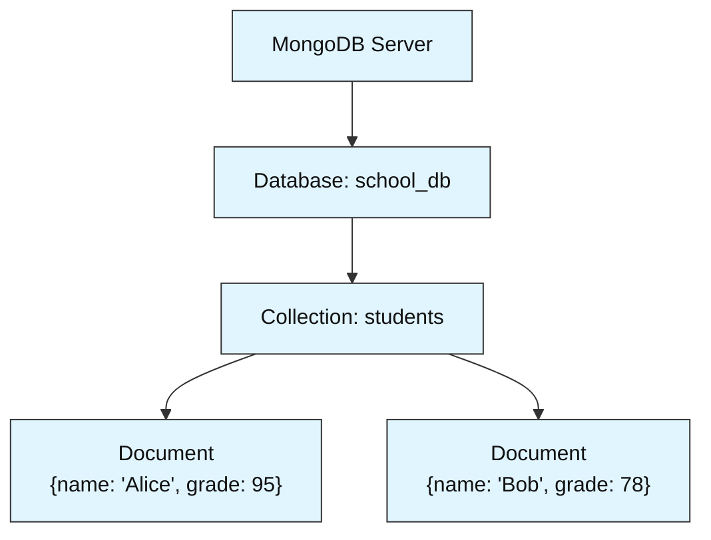
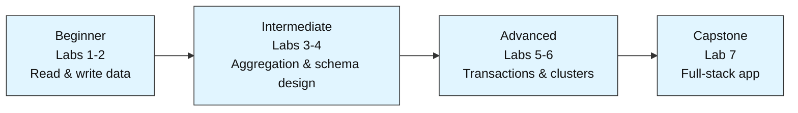

# MongoDB Labs — Foundations to Production

A hands-on module for learning MongoDB from zero. Before you touch any code, this README explains what MongoDB actually is and why it exists — then lays out how the labs will take you from your first `insert_one()` to designing a production-ready system.

---

## What Is MongoDB, and Why Does It Exist?

Most learners come to this module already familiar with relational databases like MySQL or PostgreSQL, where data lives in tables with fixed columns, and every row in a table has to look the same shape. MongoDB takes a different approach. It is a **document-oriented NoSQL database** — it stores data as flexible, JSON-like records called *documents*, and it does not force every document in a collection to share the same fields.

It was built because real applications kept running into the same wall: the data they needed to store didn't stay the same shape over time. A user profile today might need a new field tomorrow (a profile picture, a loyalty tier, a shipping address) — and in a relational database, that means altering a table schema that other parts of the system depend on. MongoDB was designed so that adding a field to one record never requires touching any other record, or any schema definition at all.

> **Analogy:** A relational database is like a filing cabinet where every folder must have identically labeled tabs — name, age, address, in that exact order, every time. MongoDB is more like a shelf of manila folders: each one holds whatever paperwork that particular case actually needs, without forcing every other folder on the shelf to match.

This flexibility is why MongoDB is widely used for user profiles, product catalogs, content management systems, mobile app backends, and IoT sensor data — anywhere the data's shape varies or evolves faster than a rigid schema can comfortably track.

---

## Core Concepts: The Building Blocks

Everything in MongoDB is organized in a simple hierarchy: one server can hold many databases, each database holds many collections, and each collection holds many documents.



A **database** is a named container for related collections — roughly the same role a database plays in the SQL world. A **collection** is a group of related documents, similar to a table, except it has no fixed set of columns. A **document** is a single record, stored internally as BSON (a binary form of JSON), and made up of **fields** — key-value pairs like `"name": "Alice"`. Every document gets a unique `_id` field automatically the moment it's inserted, whether you provide one or not.

---

## MongoDB vs. Relational Databases

| Aspect | Relational (SQL) | MongoDB (NoSQL) |
|---|---|---|
| Basic unit of data | A row in a table | A document in a collection |
| Schema | Fixed — every row has the same columns | Flexible — every document can have different fields |
| Relationships | Joins across separate tables | Embedding (nest related data in one document) or referencing (store an ID and look it up) |
| Query language | SQL | A query language based on dictionaries/JSON-style filters |
| Scaling approach | Mainly vertical (a bigger, more powerful server) | Built for horizontal scaling (spreading data across many servers via sharding) |

Neither approach is "better" in every case — this module will show you, through the labs, when each concept (embedding vs. referencing, flexible vs. fixed schema) is the right tool.

---

## Why Teams Actually Choose MongoDB

A few features explain most of MongoDB's popularity in real production systems. Its **flexible schema** lets applications evolve without painful migrations. Its **horizontal scalability** — via a technique called sharding — lets a dataset outgrow a single machine by spreading it across many. Built-in **replication** keeps multiple copies of the data in sync automatically, so the system keeps running even if one server goes down. Its **aggregation framework** lets you transform and summarize data in stages (grouping, filtering, computing averages) directly inside the database, instead of pulling everything into application code first. And since version 4.0, MongoDB also supports **multi-document ACID transactions**, so "flexible" doesn't mean "no consistency guarantees" — you get strict consistency exactly where you ask for it.

You'll meet every one of these ideas hands-on as you move through the labs below.

---

## How This Module Is Structured

The labs move through four stages, each building on the last:



Each lab is built around one small, self-contained project (a student database, a task tracker, a sales pipeline) so you learn every concept by building something real, not by reading theory in isolation.

### Labs

| # | Lab | Level | Est. Time | What You Learn |
|---|-----|-------|-----------|-----------------|
| 1 | Student Records Lookup System | Beginner | ~35 min | Connect, insert, filter, sort, aggregate |
| 2 | Personal Task Tracker | Beginner | ~35 min | Full CRUD lifecycle, upserts, re-query after mutations |
| 3 | Sales Analytics Pipeline | Intermediate | ~45 min | Aggregation pipelines, indexing, `.explain()` |
| 4 | Multi-Tenant Blog Backend | Intermediate | ~45 min | Schema design, embedding vs. referencing, `$lookup`, text search |
| 5 | Reliable Order Processing System | Advanced | ~50 min | Transactions, change streams, backup/restore |
| 6 | Scaling and Securing a Cluster | Advanced | ~40 min | Replica sets, sharding, RBAC, TLS |
| 7 | End-to-End Mini App | Capstone | ~60 min | Full-stack: schema + CRUD + analytics + indexing |

### Repository Structure

Every lab is a set of three files, named consistently as `labN<topic>`:

```
lab1studentrecordslookup.ipynb              # the runnable pipeline
lab1studentrecordslookup.md                 # concept write-up: problem statement, diagrams, step-by-step explanation
lab1studentrecordslookupassignment.md       # practice exercises + answer key
```

Open the `.ipynb` to run the lab, read the `.md` alongside it if a step doesn't make sense, and use the `assignment.md` afterward to check you actually absorbed the concept.

---

## Prerequisites

Basic Python is the only real requirement — variables, dictionaries, lists, loops, and `import` statements. No MongoDB experience is assumed for Labs 1-2; each later lab only builds on what earlier ones already taught. No database installation is required for Labs 1-4 either — they run on `pymongo` (the official MongoDB Python driver) plus `mongomock` (an in-memory mock server), so there's nothing to install beyond Python packages. Labs 5-6 touch concepts — replication, sharding, security — that go beyond what an in-memory mock can fully demonstrate, so those labs call out clearly where a real MongoDB server is assumed.

---

## Getting Started

1. Start with Lab 1, in order — later labs assume the concepts taught in earlier ones.
2. Each notebook has a `!pip install` cell at the top. Run that first, then follow the steps.
3. If a step is confusing, check the matching `.md` file — it explains the *why*, not just the *how*.
4. After finishing a lab, try the assignment before checking the answer key.