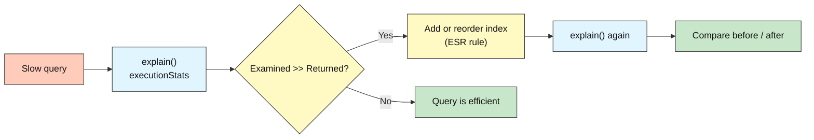
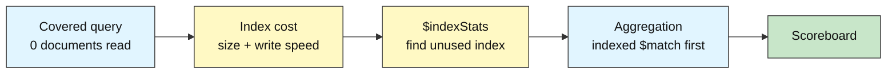

# MongoDB Intermediate: How to Make Queries Fast

## Query Optimization

**Difficulty: Intermediate | ~50 min | Requires Lab 3**

*Lab 3B in the MongoDB Mastery series — the performance deep-dive that follows Lab 3.*

---

# Problem Statement / Use Case Overview

In Lab 3 you proved that an index changes a query plan from `COLLSCAN` to `IXSCAN`. Real applications need more than that. A university's enrollment system receives a hundred thousand records per year, and the dashboard that lists "the top 20 active Computer Science grades" has started to feel slow. Someone has asked you to find out why and fix it **without adding hardware**.

This lab gives you a deliberately unoptimized collection of 100,000 enrollment records and a short list of slow queries. For each one you will read the execution plan, form a diagnosis, apply a fix, and prove the fix worked with numbers: documents examined, index keys examined, and milliseconds. You will also learn the cost side of indexing: every index takes storage and slows writes, so unused ones must be found and removed.

The skill you leave with is a repeatable loop: **measure, diagnose, change one thing, measure again.**

---

# Input Data

| Item | Detail |
|------|--------|
| **Collection** | `school_db.enrollment_log` (created and dropped by the notebook) |
| **Size** | 100,000 synthetic documents, generated with a fixed random seed so every learner gets identical data |
| **Fields** | `record_id`, `student_id`, `course`, `semester`, `status`, `grade`, `credits`, `submitted_at`, `notes` |
| **Courses** | Computer Science, Mathematics, Physics, English, Biology |
| **Statuses** | active (~60%), completed (~25%), withdrawn (~10%), pending (~5%) |
| **Storage** | Roughly 20-30 MB, which fits comfortably inside the 512 MB Atlas M0 free tier |

---

# Processing

### Part A — Diagnose and Fix with Indexes



The notebook runs two slow queries: a "filter then sort" query (Query 1) and a "filter on a range then sort by date" query (Query 2). Query 1 is fixed with a compound index. Query 2 shows how the **order of fields inside the index** decides whether MongoDB can skip an expensive in-memory sort.

### Part B — Covered Queries, Index Cost and Aggregations



After the fixes, you write a query answered entirely from the index, measure what the indexes cost in storage and insert time, detect and drop an index nobody uses, and speed up an aggregation by letting an index feed its first stage.

---

# Output

> **Illustrative output.** Your millisecond values and exact counts will differ by cluster and region. What must match is the *shape*: `COLLSCAN` before, `IXSCAN` after, and a large drop in documents examined.

**Query 1 plan, before and after the compound index:**

```
Query 1 - before index
  stages: COLLSCAN > SORT
  returned: 20 | docs examined: 100000 | keys examined: 0 | server ms: 60

Query 1 - after ESR index
  stages: IXSCAN > FETCH
  returned: 20 | docs examined: 20 | keys examined: 20 | server ms: 0
```

**Index field order decides whether a SORT stage is needed (Query 2):**

```
Query 2 - index order Equality, Range, Sort   (course, grade, submitted_at)
  stages: IXSCAN > FETCH > SORT           <-- in-memory sort required
Query 2 - index order Equality, Sort, Range   (course, submitted_at, grade)
  stages: IXSCAN > FETCH                  <-- no SORT stage
```

**Covered query:**

```
Covered query
  stages: IXSCAN > PROJECTION_COVERED
  returned: 5000 | docs examined: 0 | keys examined: 5000
```

**Scoreboard:**

```
Case                      Docs examined (before -> after)
Query 1: top 20 active    100000 -> 20
Query 2: newest high       ~3300 -> ~60
Covered query             5000 -> 0
Aggregation (one slice)    100000 -> ~6250
```

---

# Tech Stack

| Component | Tool |
|-----------|------|
| **MongoDB driver** | `pymongo[srv,tls]==4.10.1` — Python driver with SRV and TLS support |
| **Credential loader** | `python-dotenv==1.0.1` — loads the shared `.env` file |
| **CA certificates** | `certifi` — trusted CA bundle for Atlas TLS connections |
| **Standard library** | `random`, `datetime`, `time` — data generation and timing |

> **Note:** This lab connects to a real MongoDB Atlas cluster. The connection string lives in the shared `.env` file at the module root (README Section 8), two folders above this notebook. The data set is sized to fit the free M0 tier.

---

# Underlying Concepts

### The Explain Report

`explain("executionStats")` actually runs the query and reports what happened. Four numbers matter most:

| Field | Meaning | What you want |
|-------|---------|---------------|
| `nReturned` | Documents sent back to the client | Whatever the query needs |
| `totalDocsExamined` | Documents MongoDB read from disk or cache | Close to `nReturned` |
| `totalKeysExamined` | Index entries MongoDB walked | Close to `nReturned` |
| `executionTimeMillis` | Server-side time | As low as possible |

A healthy query examines roughly as many documents as it returns. If it examines 100,000 to return 20, MongoDB did 5,000 times more work than necessary.

### Plan Stages You Will See

`COLLSCAN` reads every document. `IXSCAN` walks an index. `FETCH` loads the full document for an index entry. `SORT` is an **in-memory sort** that happens when no index delivers results in the requested order; it blocks until all matching documents are read and is limited by memory. `PROJECTION_COVERED` means the answer came straight from the index.

### The ESR Rule

For a compound index, order the fields as **E**quality, **S**ort, **R**ange:

1. **Equality** fields first (`course == "Physics"`).
2. **Sort** fields next, so the index already holds entries in the requested order.
3. **Range** fields last (`grade >= 90`, `$gt`, `$lt`, `$in` with many values).

Putting a range field before the sort field breaks the sort order and forces an in-memory `SORT`. ESR is a strong starting rule, not a law: always confirm with `explain`.

### Covered Queries

If every field the query filters on **and** returns lives in one index, and `_id` is excluded from the projection, MongoDB never reads a document. `totalDocsExamined` is `0`.

### The Cost of Indexes

Each index uses storage and must be updated on every insert, update of an indexed field, and delete. An index that no query uses is pure cost. `$indexStats` reports how often each index was used since the server last restarted, so unused indexes can be found and dropped.

### Aggregation and Indexes

Only the **first stages** of a pipeline can use an index. A `$match` (and a `$sort`) at the start of the pipeline can; a `$group` at the start cannot. Filtering early also reduces the number of documents flowing through later stages.

---

# Pre-requisites

- Lab 3 completed (aggregation and your first index)
- A working Atlas cluster and `.env` file (README Section 8)
- Comfort reading Python dictionaries and loops

> **Atlas free-tier note.** The database profiler and the Performance Advisor are not available on the free M0 tier. This lab uses `explain` and `$indexStats`, which work everywhere. Step 10 shows how to try the profiler and what to do if your tier refuses it.

---

# Step-wise Instructions — Development

```python
!pip install -qU "pymongo[srv,tls]==4.10.1" python-dotenv==1.0.1 certifi
```

This installs the MongoDB Python driver (`pymongo`), `python-dotenv` for loading credentials, and `certifi` for trusted CA certificates — the same packages as Labs 1-3.


### Step 1 — Connect to MongoDB

```python
import os
import time
import random
import datetime as dt
import certifi
from dotenv import load_dotenv
import pymongo

# The shared .env sits at the module root, two folders above this notebook
load_dotenv("../../.env")
uri = os.environ["MONGODB_URI"]

client = pymongo.MongoClient(uri, tlsCAFile=certifi.where())
db = client["school_db"]
log = db["enrollment_log"]

print("Connected to MongoDB Atlas")
```

Same connection pattern as the earlier labs. The only change is the path: labs now live inside section folders, so the shared `.env` is two levels up (`../../.env`).

---

### Step 2 — Generate 100,000 Enrollment Records

```python
random.seed(42)          # fixed seed: every learner gets identical data

COURSES   = ["Computer Science", "Mathematics", "Physics", "English", "Biology"]
STATUSES  = ["active", "completed", "withdrawn", "pending"]
WEIGHTS   = [60, 25, 10, 5]
SEMESTERS = ["2024-Fall", "2025-Spring", "2025-Fall", "2026-Spring"]
START     = dt.datetime(2024, 9, 1)
N         = 100_000

def make_record(i):
    return {
        "record_id":    i,
        "student_id":   f"STU{random.randint(1, 5000):05d}",
        "course":       random.choice(COURSES),
        "semester":     random.choice(SEMESTERS),
        "status":       random.choices(STATUSES, weights=WEIGHTS)[0],
        "grade":        random.randint(35, 100),
        "credits":      random.choice([2, 3, 4]),
        "submitted_at": START + dt.timedelta(minutes=random.randint(0, 60 * 24 * 600)),
        "notes":        "x" * 40,
    }

log.drop()                                   # also removes any old indexes
batch = []
for i in range(N):
    batch.append(make_record(i))
    if len(batch) == 10_000:
        log.insert_many(batch)
        batch = []
if batch:
    log.insert_many(batch)

print("Documents inserted:", log.count_documents({}))
print("Indexes now:", list(log.index_information().keys()))
```

Inserting in batches of 10,000 keeps each network request a reasonable size. `log.drop()` at the start makes the notebook safe to re-run, and it also removes any indexes left from a previous run. Only the automatic `_id_` index exists now, so every query other than a lookup by `_id` will scan the whole collection.

---

### Step 3 — Build Explain Helpers

```python
def collect_stages(node, found=None):
    """Walk a plan tree and return every stage name, outermost first."""
    found = [] if found is None else found
    if isinstance(node, dict):
        if "stage" in node:
            found.append(node["stage"])
        for value in node.values():
            collect_stages(value, found)
    elif isinstance(node, list):
        for value in node:
            collect_stages(value, found)
    return found

def summarize(label, explain):
    """Boil an explain report down to the numbers that matter."""
    stats  = explain["executionStats"]
    stages = collect_stages(explain["queryPlanner"]["winningPlan"])
    ordered = list(dict.fromkeys(stages))            # drop repeats, keep order
    summary = {
        "label": label,
        "stages": ordered,
        "returned": stats["nReturned"],
        "docs": stats["totalDocsExamined"],
        "keys": stats["totalKeysExamined"],
        "ms": stats["executionTimeMillis"],
    }
    print(label)
    print("  stages:", " > ".join(ordered))
    print(f"  returned: {summary['returned']} | docs examined: {summary['docs']} | "
          f"keys examined: {summary['keys']} | server ms: {summary['ms']}")
    return summary

def has_stage(summary, name):
    return any(name in s for s in summary["stages"])

scoreboard = {}      # filled in as we go
```

`collect_stages` walks the whole plan tree so it works whether MongoDB reports a simple plan or a nested one. `summarize` extracts the four numbers from the concepts section and prints them in one line, so every experiment below is easy to compare.

---

### Step 4 — Query 1 Before: Filter, Sort, Limit with No Index

```python
Q1_FILTER = {"course": "Computer Science", "status": "active"}

def query1():
    return log.find(Q1_FILTER, {"_id": 0, "student_id": 1, "grade": 1}).sort("grade", -1).limit(20)

before_q1 = summarize("Query 1 - before index", query1().explain())
scoreboard["Query 1: top 20 active CS grades"] = {"before": before_q1}

top = list(query1())
print("\nTop 3 results:", top[:3])
```

The dashboard asks for the 20 highest grades among active Computer Science enrollments. With no useful index MongoDB reads **all 100,000 documents** (`COLLSCAN`), keeps the ~12,000 matches, sorts them in memory (`SORT`), and returns 20. The gap between `docs examined` and `returned` is the signal that something can be improved.

---

### Step 5 — Query 1 After: A Compound Index Built with ESR

```python
def esr_index(equality, sort, range_fields=()):
    """Return index keys ordered Equality, Sort, Range."""
    return [(f, 1) for f in equality] + list(sort) + [(f, 1) for f in range_fields]

q1_keys = esr_index(equality=["course", "status"], sort=[("grade", -1)])
print("Index keys:", q1_keys)

log.create_index(q1_keys, name="esr_course_status_grade")

after_q1 = summarize("Query 1 - after ESR index", query1().explain())
scoreboard["Query 1: top 20 active CS grades"]["after"] = after_q1

print("\nSORT stage gone?", not has_stage(after_q1, "SORT"))
```

The index stores entries grouped by `course`, then `status`, then `grade` in descending order. MongoDB jumps straight to `(Computer Science, active)` and reads the first 20 entries, which are already in the requested order, so there is no `SORT` stage and only about 20 documents are examined instead of 100,000. The `esr_index` helper simply makes the rule explicit: equality fields, then sort fields, then range fields.

---

### Step 6 — Query 2: Why Field Order Inside the Index Matters

```python
Q2_FILTER = {"course": "Physics", "grade": {"$gte": 90}}

def query2():
    return log.find(Q2_FILTER, {"_id": 0, "student_id": 1, "grade": 1, "submitted_at": 1}) \
              .sort("submitted_at", -1).limit(10)

# Attempt A: Equality, Range, Sort  (the order many people write first)
log.create_index([("course", 1), ("grade", 1), ("submitted_at", -1)], name="ers_course_grade_date")
plan_a = summarize("Query 2 - index order Equality, Range, Sort", query2().explain())
log.drop_index("ers_course_grade_date")

# Attempt B: Equality, Sort, Range  (ESR)
log.create_index([("course", 1), ("submitted_at", -1), ("grade", 1)], name="esr_course_date_grade")
plan_b = summarize("Query 2 - index order Equality, Sort, Range (ESR)", query2().explain())

scoreboard["Query 2: newest 10 high grades in Physics"] = {"before": plan_a, "after": plan_b}

print("\nERS needed SORT:", has_stage(plan_a, "SORT"))
print("ESR needed SORT:", has_stage(plan_b, "SORT"))
```

Both indexes contain the same three fields, yet they behave differently. With the range field (`grade`) before the sort field (`submitted_at`), index entries for one course are ordered by grade first, so dates are scattered and MongoDB must gather every match and sort in memory. With the sort field before the range field, entries come out already ordered by date, MongoDB walks them newest-first, checks the grade range as it goes, and stops after 10 matches. The ESR index may examine a few dozen index keys but avoids the blocking sort. Always confirm with `explain` that the trade works for your data.

---

### Step 7 — A Covered Query: Answer from the Index Alone

```python
covered_filter = {"course": "Biology", "status": "completed"}
covered_projection = {"_id": 0, "course": 1, "status": 1, "grade": 1}

# Uses the index from Step 5 (course, status, grade)
cov_plan = summarize("Covered query",
                     log.find(covered_filter, covered_projection).explain())

uncovered_plan = summarize("Same filter, but returning extra fields",
                           log.find(covered_filter, {"_id": 0, "course": 1, "status": 1, "grade": 1, "notes": 1}).explain())

scoreboard["Covered query: Biology completed"] = {"before": uncovered_plan, "after": cov_plan}

print("\nCovered query read", cov_plan["docs"], "documents")
```

A query is covered when the filter fields and the returned fields all live in one index and `_id` is excluded. Here MongoDB answers from the index alone (`PROJECTION_COVERED`, zero documents examined). Asking for one extra field (`notes`) that is not in the index forces a `FETCH` of every matching document. Covered queries are the fastest queries you can write, but only worth designing for when the query is hot.

---

### Step 8 — Measure What Indexes Cost

```python
# Storage: size of the data and of each index
stats = db.command("collStats", "enrollment_log")
print(f"Data size:   {stats['size'] / 1_048_576:.1f} MB")
for name, size in stats["indexSizes"].items():
    print(f"  index {name:<28} {size / 1_048_576:.2f} MB")

# Write cost: time the same 5,000 inserts with and without our indexes
def timed_insert(collection, count=5_000):
    docs = [make_record(N + i) for i in range(count)]
    start = time.perf_counter()
    collection.insert_many(docs)
    return (time.perf_counter() - start) * 1000

scratch = db["enrollment_scratch"]
scratch.drop()
ms_plain = timed_insert(scratch)                 # only the _id index
scratch.drop()

ms_indexed = timed_insert(log)                   # _id plus our two compound indexes
log.delete_many({"record_id": {"$gte": N}})      # remove the 5,000 test rows again

print(f"\n5,000 inserts, _id index only:      {ms_plain:7.0f} ms")
print(f"5,000 inserts, with 3 indexes:       {ms_indexed:7.0f} ms")
```

Every index is a second copy of part of your data that must be kept in sync. The first block reports how many megabytes each index occupies. The second block times the same 5,000 inserts into a plain collection and into `enrollment_log`. Network time is included in both numbers, so the difference is modest at this scale; on a busy production system with many indexes it becomes significant. The `delete_many` afterwards restores the collection to exactly 100,000 documents so later steps give consistent results.

---

### Step 9 — Find and Drop an Unused Index

```python
# Create an index nobody will use
log.create_index([("notes", 1)], name="idx_notes_unused")

# Run a few normal queries so the other indexes get used
list(query1()); list(query2())
list(log.find({"course": "English", "status": "pending"}).limit(5))

usage = list(log.aggregate([{"$indexStats": {}}]))
print(f"{'Index':<28} {'Times used':>10}")
for entry in usage:
    print(f"{entry['name']:<28} {entry['accesses']['ops']:>10}")

unused = [e["name"] for e in usage if e["accesses"]["ops"] == 0 and e["name"] != "_id_"]
print("\nUnused indexes:", unused)

for name in unused:
    log.drop_index(name)
    print("Dropped:", name)
```

`$indexStats` returns one row per index with `accesses.ops`, the number of times the index was used since the server started. An index that stays at `0` after representative traffic is costing storage and write time for nothing. In production you would check this over days or weeks, not seconds, because the counter resets on restart and a rarely-run monthly report may legitimately use an index only once a month.

---

### Step 10 — Speed Up an Aggregation

```python
def explain_aggregate(pipeline):
    report = db.command({
        "explain": {"aggregate": "enrollment_log", "pipeline": pipeline, "cursor": {}},
        "verbosity": "executionStats",
    })
    # Pipelines with a $group report a "stages" list; the first stage holds the cursor plan
    return report["stages"][0]["$cursor"] if "stages" in report else report

def timed_aggregate(pipeline):
    start = time.perf_counter()
    result = list(log.aggregate(pipeline))
    return result, (time.perf_counter() - start) * 1000

group_stage = {"$group": {"_id": "$course", "avg_grade": {"$avg": "$grade"}, "n": {"$sum": 1}}}

# Slow: group everything, then look at the result
pipeline_all = [group_stage, {"$sort": {"avg_grade": -1}}]

# Fast: an indexed $match first, so $group only sees one slice
log.create_index([("semester", 1), ("status", 1)], name="idx_semester_status")
pipeline_slice = [
    {"$match": {"semester": "2026-Spring", "status": "completed"}},
    group_stage,
    {"$sort": {"avg_grade": -1}},
]

plan_all   = summarize("Aggregation - all documents", explain_aggregate(pipeline_all))
plan_slice = summarize("Aggregation - indexed $match first", explain_aggregate(pipeline_slice))

_, ms_all   = timed_aggregate(pipeline_all)
_, ms_slice = timed_aggregate(pipeline_slice)
print(f"\nClient-side timing: all = {ms_all:.0f} ms | sliced = {ms_slice:.0f} ms")

scoreboard["Aggregation: average per course"] = {"before": plan_all, "after": plan_slice}
```

Only the first stages of a pipeline can use an index. Starting with `$match` on indexed fields lets MongoDB read just the matching slice (`IXSCAN`) and hand a much smaller stream to `$group`. A pipeline that starts with `$group` has no choice but to read everything. The two pipelines answer slightly different questions (all data versus one semester and status), which is the point: if the business question only needs a slice, ask for the slice. MongoDB also reorders some stages automatically, so always check `explain` instead of assuming.

---

### Step 11 — Try the Profiler (Where Your Tier Allows It)

```python
try:
    db.command("profile", 1, slowms=20)           # log operations slower than 20 ms
    list(log.find({"notes": "x" * 40}).limit(1))  # a deliberately unindexed query
    slow = list(db["system.profile"].find({"ns": "school_db.enrollment_log"}).sort("ts", -1).limit(3))
    for op in slow:
        print(op.get("millis"), "ms |", op.get("planSummary"), "|", op.get("command", {}).get("filter"))
    db.command("profile", 0)                      # always switch it back off
    print("\nProfiler works on this cluster.")
except pymongo.errors.OperationFailure as err:
    print("Profiler is not available on this cluster tier.")
    print("Reason:", err.details.get("errmsg", str(err)) if err.details else err)
    print("Use Atlas > your cluster > Query Insights / Performance Advisor instead.")
```

The database profiler records every operation slower than a threshold, including its plan summary (`COLLSCAN` or `IXSCAN ...`). It is how you find slow queries you did not know about. Free and shared Atlas tiers refuse the `profile` command, so the cell catches the error and points you to Atlas's Query Insights and Performance Advisor, which perform the same job through the web interface on paid tiers.

---

### Step 12 — The Before / After Scoreboard

```python
print(f"{'Case':<44} {'Docs examined':>22} {'SORT stage':>14}")
print("-" * 82)
for case, result in scoreboard.items():
    b, a = result["before"], result["after"]
    docs = f"{b['docs']:>8} -> {a['docs']:<8}"
    sort = f"{'yes' if has_stage(b, 'SORT') else 'no':>4} -> {'yes' if has_stage(a, 'SORT') else 'no':<4}"
    print(f"{case:<44} {docs:>22} {sort:>14}")

print("\nFinal indexes on enrollment_log:")
for name, info in log.index_information().items():
    print(" ", name, info["key"])
```

This collects every experiment into one table. The pattern to remember is the loop you just followed: measure with `explain`, diagnose from `docs examined` versus `returned` and from the presence of `SORT`, change one thing, and measure again.

---

# Optional Exercise

Prefix versus suffix searches on `student_id`:

1. Create an index on `student_id`.
2. Run `log.find({"student_id": {"$regex": "^STU0042"}})` with `.explain()` and note `keys examined` and `docs examined`.
3. Run `log.find({"student_id": {"$regex": "42$"}})` with `.explain()`.
4. Explain, using the plan stages and key counts, why an anchored prefix can use the index efficiently while a suffix search cannot.
5. Finally, drop every index you created in this lab except `_id_` and confirm with `log.index_information()`.

---

# What We Learnt

- **`explain("executionStats")` tells you the truth about a query** — compare `totalDocsExamined` and `totalKeysExamined` to `nReturned`; a large gap means wasted work.
- **`COLLSCAN` + `SORT` is the classic slow plan**; an index that matches the filter and the sort removes both.
- **The ESR rule orders compound index fields: Equality, Sort, Range.** A range field placed before the sort field forces an in-memory `SORT`.
- **Covered queries read zero documents** when every filtered and returned field is in one index and `_id` is excluded.
- **Indexes cost storage and write speed**; `collStats` shows their size and `$indexStats` shows whether they are ever used.
- **Only the leading stages of an aggregation can use an index** — start with an indexed `$match`.
- **The profiler and Performance Advisor find slow queries in production**, but they need a paid Atlas tier; `explain` works on every tier.
- **Optimize by loop, not by guess:** measure, diagnose, change one thing, measure again.

With query tuning in your toolbox, the next lab in the data-modeling section (Lab 4, Courses and Instructors) shows how the *shape* of your documents can make queries cheap or expensive before you ever create an index. Lab 4B then covers named schema patterns and the anti-patterns that cause performance problems.
