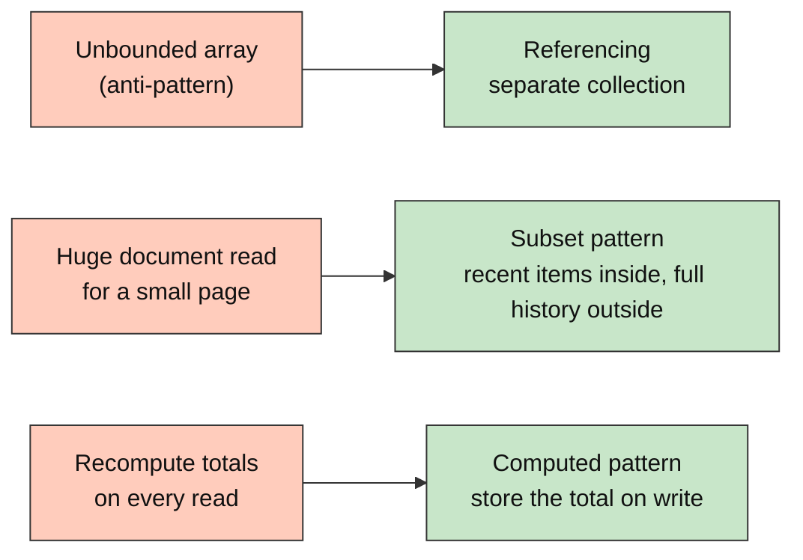
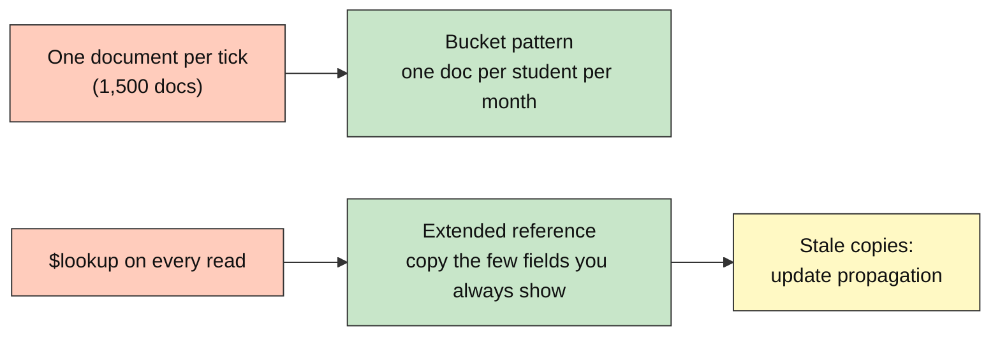

# MongoDB Intermediate: How to Recognize Schema Patterns and Anti-patterns

---

# Problem Statement / Use Case Overview

A document database lets you shape data any way you like, which is exactly why teams get it wrong. The university's student portal started simple: one course document with every submission pushed into an array, one student document holding every grade ever recorded, one record per attendance tick. A year later, pages load slowly, documents are megabytes in size, and one popular course is close to a hard limit: **a single MongoDB document cannot exceed 16 MB**.

This lab walks through the five most common schema problems in the same university domain. For each one you first build the problematic design and *measure* what it costs (bytes, document counts, operations needed), then apply the matching **schema design pattern** and measure again. You finish with a decision table you can reuse on your own projects.

The data sets are small enough to run in seconds on the free Atlas M0 tier. The lesson comes from **measuring document size and counting operations**, not from huge data.

---

# Input Data

| Item | Detail |
|------|--------|
| **Collections** | All prefixed `pat_` and dropped at the start and end of the notebook, so your Lab 1-4 data is untouched |
| **Submissions** | 2,000 generated assignment submissions for one popular course |
| **Grades** | 1,500 generated grades for one student |
| **Attendance** | 50 students x 30 days = 1,500 attendance ticks |
| **Courses and enrollments** | 4 courses with instructors, 200 generated enrollments |
| **Database** | `school_db`, same as the other labs |

---

# Processing

### Part A — Documents That Grow Too Large



You measure the size of a document as an array grows, see how close it gets to the 16 MB cap, and split it. Then you keep a student document small by storing only the most recent grades inside it, and keep the average grade current by updating counters when each grade arrives instead of recomputing from history.

### Part B — Too Many Documents and Too Many Joins



Attendance ticks are grouped into one document per student per month. Enrollments carry a copy of the course title and instructor name so the student's schedule needs no `$lookup`, and you then see what happens when the instructor's name changes and the copies must be updated.

---

# Output

> **Illustrative output.** Byte counts depend on your driver version and field values, so yours will differ slightly. The relationships (growth with array length, small versus large document, 1 document versus 30) are what to look for.

**Unbounded array growth:**

```
Embedded submissions: bytes in the course document as the array grows
     10 entries ->      1,087 bytes
    100 entries ->     10,267 bytes
   1000 entries ->    102,967 bytes
   2000 entries ->    206,967 bytes

~104 bytes per submission  =>  16 MB limit reached near 161,319 submissions
```

**Subset pattern, student profile page:**

```
Profile page, whole document with full history:   184,585 bytes
Profile page, document with 5 recent grades:          702 bytes
Reduction: 263x smaller
```

**Computed pattern:**

```
Aggregated from 1503 history documents: 74.52
Stored counters (sum / count):                  74.52
```

**Bucket pattern:**

```
Documents, one per tick:          1500
Documents, one per student-month: 50
One student, one month: 30 documents vs 1 bucket document
```

**Extended reference and stale data:**

```
Enrollment copies with the OLD name: 100
Copies updated: 100
Copies still stale: 0
```

---

# Tech Stack

| Component | Tool |
|-----------|------|
| **MongoDB driver** | `pymongo[srv,tls]==4.10.1` — also provides the `bson` module |
| **Credential loader** | `python-dotenv==1.0.1` |
| **CA certificates** | `certifi` |
| **Document measuring** | `bson.BSON.encode()` — the exact bytes MongoDB would store or send |

> **Note:** This lab connects to a real MongoDB Atlas cluster using the shared `.env` file two folders above this notebook. It only creates collections prefixed `pat_`.

---

# Underlying Concepts (Summarized)

### The 16 MB Document Limit

A single BSON document can be at most **16 megabytes**. That sounds enormous until an array inside a document grows without bound: every submission, every log line, every message pushed into one document brings it closer to the cap. Long before that, a large document also costs time on every read, because the whole document moves from disk to memory to the network even if you needed one field.

### Anti-pattern: The Unbounded Array

An array that can grow forever (comments on a post, submissions to a course, events for a device) does not belong inside a parent document. The fix is **referencing**: store each item as its own document in a separate collection, with the parent's `_id` as a field, and index that field.

### Subset Pattern

Keep only the part of a large related data set that is read most often (the last five grades) inside the parent document, and store the rest in a separate collection. The hot document stays small and cacheable; the history is one query away.

### Computed Pattern

If a value is expensive to calculate and read far more often than the underlying data changes (an average grade, a total credit count), calculate it **at write time** and store it. Use atomic `$inc` updates so the stored value never drifts. Trade-off: writes do a little extra work.

### Bucket Pattern

When data arrives as a high-volume stream of small records (sensor readings, attendance ticks), group them into one document per natural time window (per student per month). Fewer documents means fewer index entries and fewer reads for typical queries. Cap the bucket (a month is naturally bounded) so the bucket itself never becomes an unbounded array.

### Extended Reference Pattern

A `$lookup` joins collections at read time. If a page always needs the same two or three fields from the referenced document (a course title, an instructor name), **copy those fields** into the referencing document and keep only the reference for the rest. Trade-off: copies can go stale, so choose fields that change rarely and plan how to propagate changes.

### Choosing a Pattern

| Symptom | Pattern |
|---------|---------|
| Array keeps growing | Reference in a separate collection |
| Big document, small page | Subset |
| Same total recomputed constantly | Computed |
| Millions of tiny documents | Bucket |
| `$lookup` for the same few fields everywhere | Extended reference |

---

# Pre-requisites

- Lab 4 completed (embedding versus referencing, `$lookup`)
- A working Atlas cluster and `.env` file (README Section 8)
- Basic update operators from Lab 2 (`$set`, `$inc`, `$push`)

---

# Environment / Dependencies Setup

| Package | Purpose |
|---------|---------|
| `pymongo[srv,tls]` | Python driver for MongoDB with SRV and TLS support (also provides the `bson` module) |
| `python-dotenv` | Loads `.env` files so credentials stay out of the notebook |
| `certifi` | Provides up-to-date CA certificates for reliable SSL/TLS on all platforms |

```bash
pip install -qU "pymongo[srv,tls]==4.10.1" python-dotenv==1.0.1 certifi
```

This installs the MongoDB Python driver (`pymongo`, which also provides the `bson` module used to measure document sizes), `python-dotenv`, and `certifi`.

---

# Step-wise Instructions — Development


### Step 1 — Connect and Prepare Clean Collections

```python
import os
import random
import certifi
from dotenv import load_dotenv
import pymongo
from bson import BSON

load_dotenv("../../.env")
client = pymongo.MongoClient(os.environ["MONGODB_URI"], tlsCAFile=certifi.where())
db = client["school_db"]

PATTERN_COLLECTIONS = [
    "pat_courses_embedded", "pat_submissions",
    "pat_students_fat", "pat_students", "pat_grade_history",
    "pat_attendance_daily", "pat_attendance_monthly",
    "pat_courses", "pat_enrollments_ref", "pat_enrollments_ext",
]
for name in PATTERN_COLLECTIONS:
    db[name].drop()

def doc_size(document):
    """Exact size in bytes of a document once encoded as BSON."""
    return len(BSON.encode(document))

random.seed(7)
print("Connected. Clean pat_ collections ready.")
```

All collections created by this lab start with `pat_`, and are dropped at the beginning so the notebook can be re-run safely. `doc_size` uses the driver's own BSON encoder, so the number it returns is the number of bytes MongoDB would actually store for that document.

---

### Step 2 — Anti-pattern 1: The Unbounded Array

```python
course = {"_id": "CS101", "title": "Introduction to Programming", "submissions": []}

def make_submission(n):
    return {"student_id": f"STU{n % 500:05d}", "assignment": f"A{n % 8 + 1}",
            "score": 50 + n % 50, "submitted_at": "2026-01-15T10:00:00"}

checkpoints = {}
for n in range(1, 2001):
    course["submissions"].append(make_submission(n))
    if n in (10, 100, 1000, 2000):
        checkpoints[n] = doc_size(course)

print("Embedded submissions: bytes in the course document as the array grows")
for n, size in checkpoints.items():
    print(f"  {n:>5} entries -> {size:>9,} bytes")

per_entry = (checkpoints[2000] - checkpoints[1000]) / 1000
limit = int(16 * 1024 * 1024 / per_entry)
print(f"\n~{per_entry:.0f} bytes per submission  =>  16 MB limit reached near {limit:,} submissions")

db["pat_courses_embedded"].insert_one(course)
fetched = db["pat_courses_embedded"].find_one({"_id": "CS101"})
print(f"\nShowing the course title alone still transfers {doc_size(fetched):,} bytes")
```

The size of the course document grows linearly with every submission, and a page that only wants the course title still pays for the whole array. At roughly 104 bytes per submission the 16 MB cap is about 160,000 submissions away, which is well within reach for a large course over several years. This is the **unbounded array** anti-pattern: the growth is limited only by the 16 MB wall, and by then performance has been bad for a long time.

---

### Step 3 — Fix 1: Reference Submissions in Their Own Collection

```python
subs = db["pat_submissions"]
subs.create_index([("course_id", 1), ("submitted_at", -1)])

subs.insert_many([{**make_submission(n), "course_id": "CS101"} for n in range(1, 2001)])

# The course document stays tiny forever
small_course = {"_id": "CS101", "title": "Introduction to Programming"}
print(f"Course document: {doc_size(small_course)} bytes (was {doc_size(fetched):,})")

# "Show the 10 most recent submissions" now reads only 10 documents
recent = list(subs.find({"course_id": "CS101"}).sort("submitted_at", -1).limit(10))
print(f"Recent-submissions query returned {len(recent)} documents, "
      f"{sum(doc_size(d) for d in recent):,} bytes")

# Adding a submission is one small insert, not a rewrite of an ever-larger document
subs.insert_one({**make_submission(2001), "course_id": "CS101"})
print("Total submissions stored:", subs.count_documents({"course_id": "CS101"}))
```

Each submission is now its own small document that points back to the course, with an index on `course_id` so lookups are fast. The course document never grows, the 16 MB limit disappears as a concern, and a query for recent submissions reads only the ten it needs. The trade-off is that fetching a course *and* all its submissions now takes a second query (or a `$lookup`).

---

### Step 4 — Anti-pattern 2 and the Subset Pattern: Keep the Hot Document Small

```python
HISTORY_LEN = 1500

def make_grade(n):
    return {"course": ["Math", "Physics", "English", "Biology", "CS"][n % 5],
            "grade": 50 + (n * 7) % 50, "term": f"T{n // 100}", "comment": "graded " * 8}

# Bad: everything inside the student document
fat = {"_id": "STU00001", "name": "Alice Johnson", "major": "Computer Science",
       "grade_history": [make_grade(n) for n in range(HISTORY_LEN)]}
db["pat_students_fat"].insert_one(fat)

# Good: profile + last 5 grades inside; full history in its own collection
history = [{**make_grade(n), "student_id": "STU00001", "seq": n} for n in range(HISTORY_LEN)]
db["pat_grade_history"].insert_many(history)
db["pat_grade_history"].create_index([("student_id", 1), ("seq", -1)])

slim = {"_id": "STU00001", "name": "Alice Johnson", "major": "Computer Science",
        "recent_grades": [make_grade(n) for n in range(HISTORY_LEN - 5, HISTORY_LEN)]}
db["pat_students"].insert_one(slim)

print(f"Profile page, whole document with full history: {doc_size(fat):>9,} bytes")
print(f"Profile page, document with 5 recent grades:    {doc_size(slim):>9,} bytes")
print(f"Reduction: {doc_size(fat) / doc_size(slim):.0f}x smaller")

full = db["pat_grade_history"].count_documents({"student_id": "STU00001"})
print(f"\nFull history still available on demand: {full} grade documents")
```

A student's profile page needs the name, major and a handful of recent grades, but the first design drags 1,500 grades through the database and the network on every page view. With the **subset pattern** the hot document holds only what is read most often, and the long tail lives in a separate collection that is queried only when someone clicks "full transcript". The duplicated `recent_grades` is intentional: it is a small copy of data that also exists in `pat_grade_history`.

---

### Step 5 — The Computed Pattern: Store the Total, Do Not Recompute It

```python
def record_grade(student_id, course, grade):
    """Insert a grade and update the student's subset and running totals in one pass."""
    seq = db["pat_grade_history"].count_documents({"student_id": student_id})
    entry = {"course": course, "grade": grade, "term": "T-new", "comment": "graded " * 8}
    db["pat_grade_history"].insert_one({**entry, "student_id": student_id, "seq": seq})
    db["pat_students"].update_one(
        {"_id": student_id},
        {
            "$push": {"recent_grades": {"$each": [entry], "$slice": -5}},   # keep only the last 5
            "$inc":  {"grade_count": 1, "grade_sum": grade},                  # computed pattern
        },
    )

# Seed counters once from existing history (a one-time backfill)
seed = list(db["pat_grade_history"].aggregate([
    {"$match": {"student_id": "STU00001"}},
    {"$group": {"_id": None, "n": {"$sum": 1}, "total": {"$sum": "$grade"}}},
]))[0]
db["pat_students"].update_one({"_id": "STU00001"},
                              {"$set": {"grade_count": seed["n"], "grade_sum": seed["total"]}})

for g in (88, 92, 79):
    record_grade("STU00001", "Computer Science", g)

student = db["pat_students"].find_one({"_id": "STU00001"})
stored_avg = student["grade_sum"] / student["grade_count"]

agg_avg = list(db["pat_grade_history"].aggregate([
    {"$match": {"student_id": "STU00001"}},
    {"$group": {"_id": None, "avg": {"$avg": "$grade"}}},
]))[0]["avg"]

print(f"Aggregated from {student['grade_count']} history documents: {agg_avg:.2f}")
print(f"Stored counters (sum / count):                  {stored_avg:.2f}")
print("Recent grades kept:", len(student["recent_grades"]), "(always 5 or fewer)")
```

Reading the average now costs one document read and a division, instead of scanning 1,500 history documents. The write path pays a little extra, one `$inc` on two counters, and because `$inc` is atomic the counters cannot drift apart even if many grades arrive at once. `$push` with `$each` and `$slice: -5` keeps `recent_grades` at five entries automatically, so the subset maintains itself. The first block backfills the counters once for data that already existed; in a real system you would do that in a migration.

---

### Step 6 — The Bucket Pattern: Fewer, Fuller Documents

```python
STUDENTS = [f"STU{n:05d}" for n in range(1, 51)]
DAYS = range(1, 31)

daily = db["pat_attendance_daily"]
monthly = db["pat_attendance_monthly"]
monthly.create_index([("student_id", 1), ("month", 1)], unique=True)

daily_docs = []
for sid in STUDENTS:
    for day in DAYS:
        present = random.random() > 0.15
        daily_docs.append({"student_id": sid, "date": f"2026-09-{day:02d}", "present": present})
daily.insert_many(daily_docs)

# Build the bucketed form with upserts: one document per student per month
for rec in daily_docs:
    monthly.update_one(
        {"student_id": rec["student_id"], "month": "2026-09"},
        {
            "$push": {"days": {"date": rec["date"], "present": rec["present"]}},
            "$inc":  {"present_count": 1 if rec["present"] else 0, "total_count": 1},
        },
        upsert=True,
    )

print("Documents, one per tick:      ", daily.count_documents({}))
print("Documents, one per student-month:", monthly.count_documents({}))

# "Show Alice's attendance for September"
sid = "STU00001"
per_tick_reads = daily.count_documents({"student_id": sid})
bucket = monthly.find_one({"student_id": sid, "month": "2026-09"})
print(f"\nOne student, one month: {per_tick_reads} documents vs {1} bucket document")
print(f"Attendance rate from bucket counters: {bucket['present_count'] / bucket['total_count']:.0%}")
```

Thirty ticks per student become one document per student per month, so the collection holds 50 documents instead of 1,500, indexes are 30 times smaller, and "show this student's month" is a single read. The `$inc` counters give instant totals. The array inside a bucket is **bounded by design** (a month has at most 31 days), which is what makes this safe where Step 2's array was not. Choose the bucket window (day, month, hour) so a bucket stays comfortably small.

---

### Step 7 — The Extended Reference Pattern: Avoid Joins on Hot Pages

```python
courses = db["pat_courses"]
courses.insert_many([
    {"_id": "CS101", "title": "Intro to Programming", "instructor_id": "I1", "instructor_name": "Dr. Rao",    "credits": 4},
    {"_id": "MA101", "title": "Calculus I",            "instructor_id": "I2", "instructor_name": "Dr. Singh",  "credits": 4},
    {"_id": "PH101", "title": "Mechanics",             "instructor_id": "I1", "instructor_name": "Dr. Rao",    "credits": 3},
    {"_id": "EN101", "title": "Academic Writing",      "instructor_id": "I3", "instructor_name": "Dr. Mehta",  "credits": 2},
])
course_map = {c["_id"]: c for c in courses.find()}

# Plain references, and the same data with an extended reference
for i in range(200):
    sid = f"STU{i % 40 + 1:05d}"
    cid = ["CS101", "MA101", "PH101", "EN101"][i % 4]
    c = course_map[cid]
    db["pat_enrollments_ref"].insert_one({"student_id": sid, "course_id": cid})
    db["pat_enrollments_ext"].insert_one({
        "student_id": sid, "course_id": cid,
        "course": {"title": c["title"], "instructor_id": c["instructor_id"],
                   "instructor_name": c["instructor_name"]},   # copied, display-only fields
    })

# Student schedule page, version 1: reference + $lookup
schedule_lookup = list(db["pat_enrollments_ref"].aggregate([
    {"$match": {"student_id": "STU00001"}},
    {"$lookup": {"from": "pat_courses", "localField": "course_id", "foreignField": "_id", "as": "course"}},
    {"$unwind": "$course"},
    {"$project": {"_id": 0, "course_id": 1, "title": "$course.title", "instructor": "$course.instructor_name"}},
]))

# Version 2: extended reference, a single find()
schedule_ext = list(db["pat_enrollments_ext"].find(
    {"student_id": "STU00001"},
    {"_id": 0, "course_id": 1, "course": 1}))

print("With $lookup:       ", schedule_lookup[:2])
print("With extended ref:  ", schedule_ext[:2])
print("Same number of rows:", len(schedule_lookup) == len(schedule_ext))
```

The schedule page always shows the course title and the instructor's name. Version 1 joins with `$lookup` every time the page loads. Version 2 stores those few display fields inside each enrollment, so one indexed `find()` answers the whole page. Only **display-only, slowly changing** fields are copied; everything else (credits, syllabus, room) remains in `pat_courses` and is fetched only when needed. The copied fields are why this pattern needs the next step.

---

### Step 8 — The Price of Copies: Propagating a Change

```python
# Dr. Rao gets married and changes their surname. Update the source of truth first...
courses.update_many({"instructor_id": "I1"}, {"$set": {"instructor_name": "Dr. Rao-Verma"}})

# ...now the copies are stale:
stale = db["pat_enrollments_ext"].count_documents({"course.instructor_id": "I1",
                                                    "course.instructor_name": "Dr. Rao"})
print("Enrollment copies with the OLD name:", stale)

# Propagate to every copy in one operation
result = db["pat_enrollments_ext"].update_many(
    {"course.instructor_id": "I1"},
    {"$set": {"course.instructor_name": "Dr. Rao-Verma"}},
)
print("Copies updated:", result.modified_count)

fresh = db["pat_enrollments_ext"].count_documents({"course.instructor_name": "Dr. Rao"})
print("Copies still stale:", fresh)
```

Every copy of a field is a place that can go out of date. The fix is to update the source first, then propagate with one `update_many` that targets documents by the instructor's id (which is why the id is copied alongside the name). This is acceptable when the field changes rarely and the update can be a background job. If the copied field changed constantly, the extended reference would be the wrong pattern and a plain reference with `$lookup` would be better.

---

### Step 9 — Summary Table and Cleanup

```python
patterns = [
    ("Unbounded array",     "Anti-pattern", "Array grows forever",           "Reference in separate collection"),
    ("Subset",              "Pattern",      "Big document, small page",       "Keep hot items inside, rest outside"),
    ("Computed",            "Pattern",      "Same total recomputed",          "Store totals, update with $inc"),
    ("Bucket",              "Pattern",      "Millions of tiny documents",     "Group by student + month"),
    ("Extended reference",  "Pattern",      "Repeated $lookup for same fields", "Copy display fields, plan updates"),
]
print(f"{'Name':<22}{'Type':<14}{'Symptom':<36}{'Fix'}")
print("-" * 100)
for name, kind, symptom, fix in patterns:
    print(f"{name:<22}{kind:<14}{symptom:<36}{fix}")

for name in PATTERN_COLLECTIONS:
    db[name].drop()
print("\nCleaned up all pat_ collections.")
```

One line per idea: the symptom you can observe, and the pattern that fixes it. The last cell drops every `pat_` collection so nothing from this lab is left behind in your cluster.

---

### Optional Exercise

Design exercise:

The portal also stores **chat messages** between students and instructors. A popular course channel receives 50,000 messages per semester. Sketch the schema you would use, and say which pattern from this lab you used for each of these decisions:

1. Where the messages live relative to the channel document.
2. How the channel page shows "the last 20 messages" quickly.
3. How the channel shows "number of messages sent" without counting 50,000 documents.
4. How each message shows the sender's display name without a join.
5. What should happen to those copies when a user changes their display name.

Then implement the "last 20 messages" and "message count" parts with pymongo, using `$push` with `$slice` and `$inc`.

---

# What We Learnt

- **A document cannot exceed 16 MB, and large documents are slow long before that** — measure with `bson.BSON.encode()`.
- **Unbounded arrays are an anti-pattern**; store the many side as its own collection with an indexed reference.
- **Subset pattern:** keep the data you read most inside the parent and move the long tail out.
- **Computed pattern:** calculate values on write with atomic `$inc`, so reads are one cheap lookup. Backfill existing data once.
- **Bucket pattern:** group high-volume small records into one document per natural window, and keep each bucket bounded.
- **Extended reference pattern:** copy only display-only, slowly changing fields to avoid repeated `$lookup` joins.
- **Every copy of data must have a plan for staying correct** — update the source first, then propagate with `update_many`.
- **Patterns are trade-offs, not rules:** each trades a little write work or duplication for much cheaper, smaller reads.

You now have the vocabulary to design schemas on purpose. The next section, **Search and AI**, adds a new way to find documents: Atlas Search for keyword relevance and Atlas Vector Search for meaning (Lab 4C).
