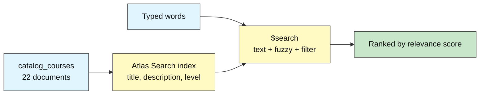
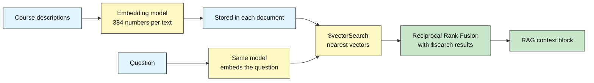

# MongoDB Intermediate: How to Search by Keywords and by Meaning

## Atlas Search and Vector Search

**Difficulty: Intermediate to Advanced | ~60 min | Requires Lab 4**

*Lab 4C in the MongoDB Mastery series — the bridge between the data labs and the AI Agent Memory capstone (Lab 7).*

---

# Problem Statement / Use Case Overview

The university has a catalog of 22 courses and a search box that does exact matching. A student who types "make my chatbot remember what customers told it yesterday" gets nothing, even though a course on persistent conversation state is exactly what they need: none of their words appear in its description. Another student typing "databses" (a typo) also gets nothing.

Two different problems need two different tools. **Keyword search** (Atlas Search, built on Apache Lucene) finds documents that contain the words you typed, ranks them by relevance, and forgives typos. **Vector search** finds documents that *mean* the same thing, even with no words in common, by comparing embeddings (lists of numbers that capture meaning). Each is strong where the other is weak, so production systems often use both and merge the rankings.

This lab builds all three on one collection, and ends by formatting the top results as the context block of a RAG prompt, which is the retrieval half of the agent memory service you will build in the capstone.

---

# Input Data

| Item | Detail |
|------|--------|
| **Catalog file** | `course_catalog.json` in this lab folder: 22 courses, each with `course_id`, `title`, `level`, `topic`, `description` |
| **Levels** | beginner (7), intermediate (7), advanced (8) |
| **Collection** | `school_db.catalog_courses` (dropped and recreated by the notebook) |
| **Embedding model** | `BAAI/bge-small-en-v1.5` through `fastembed`: 384-dimensional vectors, runs locally |
| **Search indexes** | 2 (one text, one vector). The free M0 tier allows up to 3 Atlas Search or Vector Search indexes in total |

---

# Processing

### Part A — Keyword Search with `$search`



The notebook creates a search index, waits for it to become queryable, and runs plain text queries, a typo-tolerant query, and a compound query that adds a filter on `level`.

### Part B — Vector Search and Hybrid Fusion



Each description is embedded once and stored beside the text. A vector index lets MongoDB find the closest vectors to the question's embedding. The two ranked lists (keyword and meaning) are then merged with Reciprocal Rank Fusion, the same method used in the Hybrid RAG labs.

---

# Output

> **What to expect.** Exact scores and some ordering will differ between runs and clusters. What matters is *which kind of search finds what*: keyword search misses the paraphrased question but handles the typo; vector search finds the paraphrased question; the hybrid list contains both strengths.

**Keyword search:**

```
Query: "databases"
  Relational Databases and SQL, Introduction to Document Databases

Typo query without fuzzy: "databses"  -> (no results)
Typo query with fuzzy:    "databses"  -> the same two courses again
```

**The semantic gap:**

```
Question: "make my chatbot remember what customers told it yesterday"
  Keyword search ($search):   nothing relevant (at most weak matches on common words)
  Vector search ($vectorSearch):  Persistent Conversation State for AI Assistants is expected near the top
```

**Hybrid result (Reciprocal Rank Fusion):**

```
Fused ranking: course IDs ordered by 1/(60+rank) summed over both lists
```

**RAG context block:**

```
[1] Persistent Conversation State for AI Assistants (advanced)
Store dialogue history and learned facts across sessions ...
```

---

# Tech Stack

| Component | Tool |
|-----------|------|
| **MongoDB driver** | `pymongo[srv,tls]==4.10.1` — includes `SearchIndexModel` and search-index management |
| **Credential loader** | `python-dotenv==1.0.1` |
| **CA certificates** | `certifi` |
| **Embeddings** | `fastembed` with `BAAI/bge-small-en-v1.5` — local ONNX model, 384 dimensions, no API key |
| **Search engines** | MongoDB Atlas Search (Lucene) and Atlas Vector Search |

> **Important:** `$search` and `$vectorSearch` run only on **MongoDB Atlas** (or Atlas-compatible deployments), not on a plain local `mongod`. The free M0 tier supports both, with a limit of three search/vector indexes.

---

# Underlying Concepts

### Atlas Search

Atlas Search embeds the Apache Lucene engine next to your data. You define a **search index** that says which fields to analyze. At query time the `$search` stage returns documents ranked by a **relevance score** (how well the text matches, how rare the matched words are, how often they appear). Useful operators:

| Operator / option | What it does |
|-------------------|--------------|
| `text` | Match analyzed words in one or more fields |
| `fuzzy` | Tolerate typos (`maxEdits` = how many character changes) |
| `compound` | Combine clauses: `must` (required, scored), `should` (optional, boosts), `filter` (required, not scored), `mustNot` |
| `equals` | Exact match on a field indexed as `token` (good for filters such as level) |

### Embeddings

An **embedding** is a list of numbers (here, 384) produced by a model so that texts with similar *meaning* get similar numbers. "Persist dialogue history" and "remember earlier chats" end up close together even though they share no words. Questions and documents must be embedded by the **same model**, otherwise their numbers live in different spaces and distances mean nothing.

### Atlas Vector Search

A **vector search index** stores the embeddings in a structure that finds nearest neighbours quickly. You declare the field path, the number of dimensions (must match the model) and the similarity function (`cosine`, `euclidean` or `dotProduct`). Extra `filter` fields let you pre-filter results (for example, only beginner courses). The `$vectorSearch` stage takes the query vector, `numCandidates` (how many neighbours to examine; higher is more accurate but slower) and `limit` (how many to return).

### Keyword Versus Meaning

| Situation | Keyword search | Vector search |
|-----------|----------------|---------------|
| Exact names, codes, rare terms | Strong | Can be vague |
| Question phrased in different words | Weak | Strong |
| Typos | Strong with `fuzzy` | Usually tolerant |
| Explaining why a result matched | Easy (matched words) | Hard |

### Reciprocal Rank Fusion (RRF)

Keyword scores and vector similarities are on different scales, so they cannot simply be added. RRF uses only **ranks**: each document earns `1 / (k + rank)` from every list it appears in (commonly `k = 60`), and the sums decide the final order. A document ranked highly by both lists wins.

### From Search to RAG

Retrieval-Augmented Generation takes the top search results, pastes them into the prompt as context, and asks a language model to answer *only* from that context. This lab stops right before the model call, at the formatted context block.

---

# Pre-requisites

- Lab 4 completed
- A working Atlas cluster and `.env` file (README Section 8). The M0 free tier is sufficient
- Network access to download the embedding model on first run (about 130 MB)
- No LLM or embedding API key is required

---

# Step-wise Instructions — Development

```python
!pip install -qU "pymongo[srv,tls]==4.10.1" python-dotenv==1.0.1 certifi fastembed
```

This installs the MongoDB driver, `python-dotenv`, `certifi`, and `fastembed` — a small library that runs an embedding model on your own machine, so this lab needs **no API key** for embeddings. The first run downloads the model (about 130 MB).


### Step 1 — Connect and Load the Catalog

```python
import os
import json
import time
import certifi
from dotenv import load_dotenv
import pymongo
from pymongo.operations import SearchIndexModel

load_dotenv("../../.env")
client = pymongo.MongoClient(os.environ["MONGODB_URI"], tlsCAFile=certifi.where())
db = client["school_db"]
catalog = db["catalog_courses"]

with open("course_catalog.json") as f:
    courses = json.load(f)

catalog.drop()
catalog.insert_many(courses)

print("Courses inserted:", catalog.count_documents({}))
print("Example:", {k: courses[0][k] for k in ("course_id", "title", "level")})
```

The 22 courses live in a JSON file next to the notebook so every learner searches the same data. The collection is dropped first so the notebook can be re-run. Note that nothing here is search-specific yet: these are ordinary documents.

---

### Step 2 — Create the Atlas Search (Keyword) Index

```python
TEXT_INDEX = "course_text_index"

text_index_definition = {
    "mappings": {
        "dynamic": False,
        "fields": {
            "title":       {"type": "string"},
            "description": {"type": "string"},
            "level":       {"type": "token"},     # exact-value field, used for filtering
        },
    }
}

def wait_until_queryable(collection, name, timeout=300):
    """Search indexes build in the background; poll until Atlas says the index is ready."""
    waited = 0
    while waited < timeout:
        found = list(collection.list_search_indexes(name))
        if found and found[0].get("queryable"):
            return True
        time.sleep(5)
        waited += 5
    return False

# Drop a leftover index from a previous run, if any
if list(catalog.list_search_indexes(TEXT_INDEX)):
    catalog.drop_search_index(TEXT_INDEX)
    time.sleep(10)

catalog.create_search_index(model=SearchIndexModel(definition=text_index_definition,
                                                   name=TEXT_INDEX, type="search"))
print("Building search index (usually 20-60 seconds)...")
print("Ready:", wait_until_queryable(catalog, TEXT_INDEX))
```

A search index is built asynchronously by Atlas, which is why the helper polls `list_search_indexes` until `queryable` is true. The definition turns off dynamic mapping so only the three fields we name are indexed: `title` and `description` are analyzed as text, while `level` is a `token` (kept whole) so it can be used for exact filtering later.

---

### Step 3 — Keyword Search with $search

```python
def text_pipeline(query, limit=5, fuzzy=False, level=None):
    """Build a $search pipeline over title + description, optionally typo-tolerant and filtered by level."""
    text_clause = {"text": {"query": query, "path": ["title", "description"]}}
    if fuzzy:
        text_clause["text"]["fuzzy"] = {"maxEdits": 1}
    if level is None:
        search = {"index": TEXT_INDEX, **text_clause}
    else:
        search = {"index": TEXT_INDEX, "compound": {
            "must":   [text_clause],
            "filter": [{"equals": {"path": "level", "value": level}}],
        }}
    return [
        {"$search": search},
        {"$limit": limit},
        {"$project": {"_id": 0, "course_id": 1, "title": 1, "level": 1,
                      "score": {"$meta": "searchScore"}}},
    ]

def show(results):
    for rank, doc in enumerate(results, 1):
        print(f"  {rank}. {doc['title']}  [{doc['level']}]  score={doc.get('score', 0):.2f}")
    if not results:
        print("  (no results)")

print('Query: "databases"')
show(list(catalog.aggregate(text_pipeline("databases"))))

print('\nTypo query without fuzzy: "databses"')
show(list(catalog.aggregate(text_pipeline("databses"))))

print('\nTypo query with fuzzy:   "databses"')
show(list(catalog.aggregate(text_pipeline("databses", fuzzy=True))))
```

`$search` must be the **first** stage of the pipeline. Each result carries a relevance score through `{"$meta": "searchScore"}`. Without `fuzzy`, the misspelled word `databses` matches nothing; with `maxEdits: 1`, one missing character is forgiven and `databases` matches again. Keyword search is excellent at this kind of forgiving exact-word matching.

---

### Step 4 — Combine a Search with a Filter

```python
print('"data" restricted to level = intermediate')
show(list(catalog.aggregate(text_pipeline("data", level="intermediate"))))

print('\n"data" restricted to level = advanced')
show(list(catalog.aggregate(text_pipeline("data", level="advanced"))))
```

The `compound` operator mixes clauses. The `must` clause is required *and* contributes to the score. The `filter` clause is required but does **not** affect the score, which is exactly right for hard constraints such as level, category or date. Because the `level` field was indexed as a `token`, the `equals` operator matches it exactly.

---

### Step 5 — Where Keyword Search Fails: The Semantic Gap

```python
question = "make my chatbot remember what customers told it yesterday"

print("Keyword search ($search):")
show(list(catalog.aggregate(text_pipeline(question))))

print("\nWhat the right course actually says:")
target = catalog.find_one({"course_id": "CAT303"}, {"_id": 0, "title": 1, "description": 1})
print(" ", target["title"])
print(" ", target["description"])
```

The best course for this question is *Persistent Conversation State for AI Assistants*, yet none of the question's important words appear in it. A keyword engine looks for shared words, so it either returns nothing relevant or returns weak accidental matches on common words. A person would instantly see "remember what customers told it" and "store dialogue history across sessions" mean the same thing. That is the gap embeddings close.

---

### Step 6 — Create Embeddings and Store Them

```python
from fastembed import TextEmbedding

EMBED_MODEL = "BAAI/bge-small-en-v1.5"
EMBED_DIMS  = 384
embedder = TextEmbedding(EMBED_MODEL)

def embed_text(text):
    """Return one embedding (a list of 384 floats) for one text."""
    return list(embedder.embed([text]))[0].tolist()

def doc_text(course):
    return f"{course['title']}. {course['description']}"

texts = [doc_text(c) for c in courses]
vectors = [v.tolist() for v in embedder.embed(texts)]

for course, vector in zip(courses, vectors):
    catalog.update_one({"course_id": course["course_id"]}, {"$set": {"embedding": vector}})

sample = catalog.find_one({"course_id": "CAT301"})
print("Model:", EMBED_MODEL, "| dimensions:", len(sample["embedding"]))
print("First 5 numbers:", [round(x, 3) for x in sample["embedding"][:5]])
print("Embedded and stored:", catalog.count_documents({"embedding": {"$exists": True}}), "documents")
```

`fastembed` downloads a small model the first time and then runs entirely on your computer. Each course's title and description are embedded together into 384 numbers and stored in an `embedding` field **inside the same document**, so the vector always travels with its text. The numbers have no readable meaning on their own; only their *distance* from other vectors matters.

---

### Step 7 — Create the Vector Search Index

```python
VECTOR_INDEX = "course_vector_index"

vector_index_definition = {
    "fields": [
        {"type": "vector", "path": "embedding", "numDimensions": EMBED_DIMS, "similarity": "cosine"},
        {"type": "filter", "path": "level"},       # allows pre-filtering inside $vectorSearch
    ]
}

if list(catalog.list_search_indexes(VECTOR_INDEX)):
    catalog.drop_search_index(VECTOR_INDEX)
    time.sleep(10)

catalog.create_search_index(model=SearchIndexModel(definition=vector_index_definition,
                                                   name=VECTOR_INDEX, type="vectorSearch"))
print("Building vector index...")
print("Ready:", wait_until_queryable(catalog, VECTOR_INDEX))
```

`numDimensions` must equal the model's output size (384); a mismatch fails at query time. `cosine` similarity compares the **direction** of two vectors, which works well for text embeddings. Declaring `level` as a `filter` field lets `$vectorSearch` restrict candidates *before* ranking, instead of throwing results away afterwards.

---

### Step 8 — Search by Meaning with $vectorSearch

```python
def vector_pipeline(query_vector, limit=5, level=None, num_candidates=100):
    """Build a $vectorSearch pipeline; level (optional) pre-filters candidates."""
    stage = {
        "index": VECTOR_INDEX,
        "path": "embedding",
        "queryVector": query_vector,
        "numCandidates": num_candidates,
        "limit": limit,
    }
    if level is not None:
        stage["filter"] = {"level": level}
    return [
        {"$vectorSearch": stage},
        {"$project": {"_id": 0, "course_id": 1, "title": 1, "level": 1,
                      "score": {"$meta": "vectorSearchScore"}}},
    ]

query_vector = embed_text(question)          # the SAME model that embedded the courses

print(f'Question: "{question}"')
print("\nVector search results:")
show(list(catalog.aggregate(vector_pipeline(query_vector))))

print("\nSame question, advanced courses only:")
show(list(catalog.aggregate(vector_pipeline(query_vector, level="advanced"))))
```

The question is embedded with the same model, and MongoDB returns the courses whose vectors are nearest. Even though no important words are shared, *Persistent Conversation State for AI Assistants* is expected to rank near the top because its meaning is close to the question. `numCandidates` controls how many neighbours the index examines before returning `limit` results: raise it for better accuracy, lower it for speed. The `vectorSearchScore` is a similarity (higher is closer) and is not comparable to `searchScore`.

---

### Step 9 — Hybrid Search with Reciprocal Rank Fusion

```python
def rrf_fuse(rankings, k=60):
    """Merge several ranked lists of ids. Each id scores 1 / (k + rank) in every list it appears in."""
    scores = {}
    for ranking in rankings:
        for rank, item in enumerate(ranking, start=1):
            scores[item] = scores.get(item, 0.0) + 1.0 / (k + rank)
    return sorted(scores.items(), key=lambda pair: pair[1], reverse=True)

def hybrid_search(query, limit=5):
    keyword_hits = list(catalog.aggregate(text_pipeline(query, limit=10, fuzzy=True)))
    vector_hits  = list(catalog.aggregate(vector_pipeline(embed_text(query), limit=10)))
    fused = rrf_fuse([[d["course_id"] for d in keyword_hits],
                      [d["course_id"] for d in vector_hits]])[:limit]
    by_id = {c["course_id"]: c for c in catalog.find({"course_id": {"$in": [i for i, _ in fused]}},
                                                      {"_id": 0, "embedding": 0})}
    return [{**by_id[cid], "rrf_score": score} for cid, score in fused]

for query in ["databases", question]:
    print(f'Hybrid results for: "{query}"')
    for rank, doc in enumerate(hybrid_search(query), 1):
        print(f"  {rank}. {doc['title']}  [{doc['level']}]  rrf={doc['rrf_score']:.4f}")
    print()
```

Keyword scores and vector similarities have different scales, so they cannot be added. **Reciprocal Rank Fusion** looks only at positions: a document earns `1/(60+rank)` from each list it appears in, and documents found by both lists rise to the top. The exact-word query keeps its precise matches; the paraphrased question still surfaces the semantically right course. This is the same fusion used in the Hybrid RAG labs, now running on top of MongoDB. (For production scale, Atlas also offers server-side fusion with `$rankFusion` on newer cluster versions; the Python version here works everywhere and shows the arithmetic.)

---

### Step 10 — Build the RAG Context Block

```python
def build_context(results):
    """Format retrieved courses as numbered, citable context for an LLM prompt."""
    blocks = []
    for number, doc in enumerate(results, 1):
        blocks.append(f"[{number}] {doc['title']} ({doc['level']})\n{doc['description']}")
    return "\n\n".join(blocks)

user_question = "Which course helps me make a chatbot that remembers earlier conversations?"
top = hybrid_search(user_question, limit=3)

prompt = f"""Answer the question using ONLY the context below. If the context does not
contain the answer, say you do not know. Cite sources as [1], [2], ...

Context:
{build_context(top)}

Question: {user_question}
Answer:"""

print(prompt)
```

This is the retrieval half of RAG: search finds the most relevant documents, and the prompt template constrains the model to answer only from them and to cite numbered sources. Sending `prompt` to any LLM would complete the pipeline, but the part you built here (the search) is where answer quality is won or lost. In the capstone, the same idea powers an agent's memory: instead of course descriptions, the documents are past conversation snippets and facts.

---

### Step 11 — Clean Up Search Indexes

```python
for name in (TEXT_INDEX, VECTOR_INDEX):
    if list(catalog.list_search_indexes(name)):
        catalog.drop_search_index(name)
        print("Dropped search index:", name)

print("Remaining search indexes:", [i["name"] for i in catalog.list_search_indexes()])
```

The free M0 tier allows only three search/vector indexes per cluster, so dropping the ones you no longer need leaves room for the capstone. Search indexes also consume resources while they exist, even when idle. The collection itself (with its embeddings) is kept so you can re-create the indexes later without re-embedding.

---

# Optional Exercise

Experiment with the knobs:

1. Change `numCandidates` in the vector query from 100 to 5 and then to 22. Do the results change? Why does a very small value risk missing the best match?
2. Add a second text field boost: make title matches count more than description matches (hint: wrap the `text` operator with `score: {"boost": {"value": 3}}` and search `title` and `description` in separate `should` clauses).
3. Write three new questions in your own words that share no words with the catalog and check which course vector search returns. Does it always match your intent?
4. Change the `rrf_fuse` constant `k` from 60 to 5. What happens to the influence of rank 1 versus rank 5?

---

# What We Learnt

- **Atlas Search (`$search`) finds documents that contain your words**, ranks by relevance, tolerates typos with `fuzzy`, and combines clauses with `compound` (`must`, `should`, `filter`).
- **Search indexes are built asynchronously** — poll `list_search_indexes` until `queryable` is true before querying.
- **Embeddings turn text into vectors where similar meaning means small distance**; questions and documents must use the same model and the same dimension count.
- **Atlas Vector Search (`$vectorSearch`) finds nearest neighbours**; `numCandidates` trades accuracy for speed, and declared `filter` fields allow pre-filtering.
- **Keyword and vector search fail in opposite places**: exact terms versus paraphrased questions.
- **Reciprocal Rank Fusion merges ranked lists using only ranks**, so unrelated score scales do not matter.
- **RAG retrieval is search plus a prompt template** that restricts the model to the retrieved context and asks for citations.
- **The free M0 tier allows three search indexes** — drop indexes you are finished with.

You can now find documents by words and by meaning. The next section covers reliability and scale (transactions, replication, security), and the capstone (Lab 7, AI Agent Memory Service) puts search, schema patterns and transactions together into a memory layer for an AI agent.
