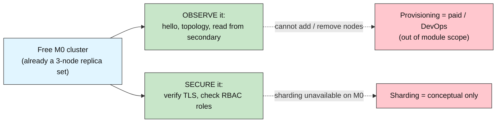
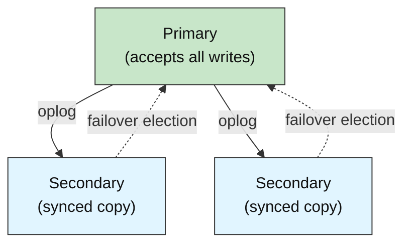
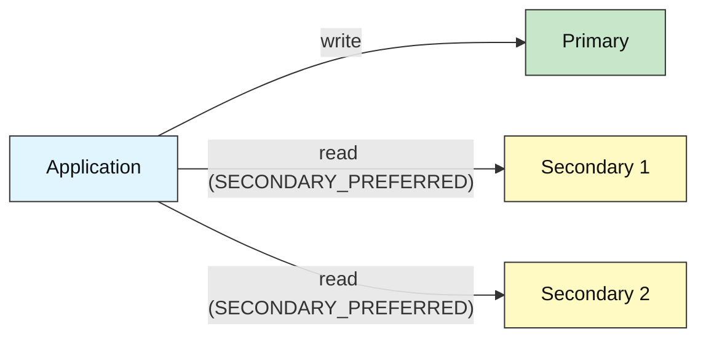
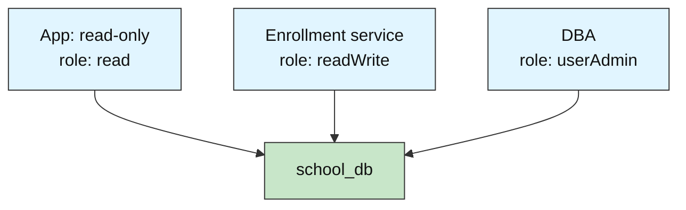
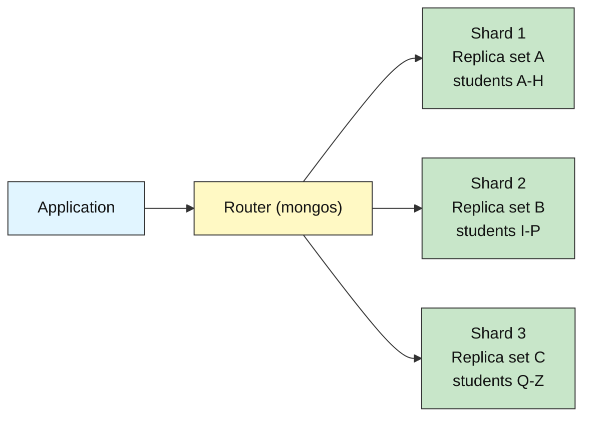

# MongoDB Advanced: How to Inspect a Replica Set and Secure Access

## Scaling the University Database

**Difficulty: Advanced | ~40 min | Requires Labs 1–5**

*Lab 6 of 7 in the MongoDB Mastery series.*

---

# Problem Statement / Use Case Overview

Labs 1–5 taught reading, writing, aggregation, schema design, and transactions against a single logical database. But a database used by a real system must do more than store data correctly — it must **stay available** and be **secure**. What happens if a machine hosting the database dies? How do you stop every person with a connection string from rewriting any document? How is the data protected while it travels over the network?

This lab answers those questions by inspecting a **real, running Atlas cluster** — the same free M0 cluster from the earlier labs — and verifying the production features that keep a database alive and safe:

- A **replica set** (a live 3-node group with a primary and secondaries) for high availability.
- **Read preferences** for scaling reads to secondaries.
- **TLS** encryption for data in transit.
- **Role-based access control (RBAC)** with built-in roles for least privilege.
- **Sharding**, treated conceptually only, as the way to scale past one machine.

The domain stays the same university system (`school_db`). This lab is the step between "a database that works" and "a database that survives production."

---

# Input Data

| Item | Detail |
|------|--------|
| **Database** | `school_db` — the same database used in Labs 1–5 |
| **Students** | The `students` collection seeded by earlier labs; this lab appends one tagged document (removed before the end) |
| **Reads** | Run against `students` (and conceptually `courses`) |
| **Cluster** | The shared free **M0** Atlas cluster — already a 3-node replica set |
| **Domain** | Same student/university management system used throughout the module |

---

# Processing

### The M0 Framing — Inspect, Do Not Provision



On the free M0 tier you cannot provision or reconfigure infrastructure — the cluster is already a replica set, TLS is already enforced, and users with built-in roles exist. So this lab is framed as **inspect a real running cluster and secure access to it**, not "configure/scale infrastructure." Every code cell runs, unchanged, on M0; anything M0 forbids is explained in markdown instead.

### Replica Set Topology



Writes go only to the primary. Secondaries stay in sync by replaying the primary's **oplog** (operations log), and if the primary becomes unreachable, a secondary is elected to take over — automatic **failover**.

### Read Preference



A read preference like `SECONDARY_PREFERRED` offloads read traffic onto secondaries, scaling reads across the whole set — at the cost of possible slightly stale reads (eventual consistency).

### RBAC and Least Privilege



RBAC ties access to **roles**. Least privilege gives each connection only the access it needs — a read-only consumer gets `read`, an enrollment service gets `readWrite`, and only DBAs get `userAdmin`.

---

# Output

**Step 2 — The `hello` command proving we are on a replica set:**

```
setName: atlas-jooykf-shard-0
me: ac-mtwetuu-shard-00-02.rfzvgwe.mongodb.net:27017
isWritablePrimary: True

hosts in this replica set:
   ac-mtwetuu-shard-00-00.rfzvgwe.mongodb.net:27017
   ac-mtwetuu-shard-00-01.rfzvgwe.mongodb.net:27017
   ac-mtwetuu-shard-00-02.rfzvgwe.mongodb.net:27017

current primary:
   ac-mtwetuu-shard-00-02.rfzvgwe.mongodb.net:27017
```

**Step 3 — Labeling primary vs secondary from `client.nodes`:**

```
Replica set members:
  ac-mtwetuu-shard-00-00.rfzvgwe.mongodb.net:27017  ->  SECONDARY
  ac-mtwetuu-shard-00-01.rfzvgwe.mongodb.net:27017  ->  SECONDARY
  ac-mtwetuu-shard-00-02.rfzvgwe.mongodb.net:27017  ->  PRIMARY
```

**Step 4 — Reading from a secondary:**

```
Read via primary:       Replica Read Test
Read via secondary:     Replica Read Test
```

**Step 5 — Verifying TLS:**

```
URI scheme: mongodb+srv
TLS is mandatory for mongodb+srv: True
CA bundle file exists: True
CA bundle path: C:\...\certifi\cacert.pem
```

**Step 6 — `connectionStatus` showing the current user's roles:**

```
Authenticated user:
   <your_db_user> on admin

Current user's roles:
  - atlasAdmin on db admin
```

**Step 8 — Summary and cleanup:**

```
Removed 1 lab-6 seeded document(s).

       REPLICA SET & SECURITY CHECKLIST

Replica set name:       atlas-jooykf-shard-0
Member node count:     3
Primary host:           ac-mtwetuu-shard-00-02.rfzvgwe.mongodb.net:27017
Connection encrypted:   TLS enforced (mongodb+srv + tlsCAFile)
Current user:           <your_db_user>
Current user's roles:   atlasAdmin
```

---

# Tech Stack

| Component | Tool |
|-----------|------|
| **MongoDB driver** | `pymongo[srv,tls]==4.10.1` — Python driver for MongoDB with SRV and TLS support |
| **Credential loader** | `python-dotenv==1.0.1` — loads `.env` files for credentials |
| **CA certificates** | `certifi` — provides up-to-date CA bundles for reliable SSL/TLS on all platforms |

> **Note:** This lab connects to a real MongoDB Atlas cluster. The connection string is stored in the `.env` file (see README Section 8) and loaded at runtime — credentials never appear in the notebook itself.

---

# Underlying Concepts

### Replica Sets

A **replica set** is a group of MongoDB servers holding synchronized copies of the same data. One node is the **primary** — the only node that accepts writes, which keeps the data consistent across the set. The other nodes are **secondaries**; they do not accept client writes directly, but they stay synchronized by replaying the primary's oplog. Every Atlas cluster is a replica set, because a database that exists on only one machine is a single point of failure: if that machine dies, the database is gone.

The `hello` command (`db.command("hello")`) is how you ask a node about itself and its cluster. The fields `setName`, `hosts`, and `primary` directly reveal the replica-set membership and current leader — which is exactly what this lab inspects in Step 2.

### The Oplog and Failover

When the primary performs a write, it appends a description of that operation to its **oplog** — a special capped collection that is itself replicated. Each secondary continuously tails the primary's oplog and applies those operations to its own data, so all members converge on the same state. If the primary becomes unreachable, the remaining secondaries detect the loss and hold an **election**, promoting one secondary to primary. Because every secondary already holds a full synchronized copy, no data is lost and the database continues to serve — this is automatic **failover**.

### Read Preferences and Eventual Consistency

A driver normally sends every read to the primary. A **read preference** changes that. `ReadPreference.SECONDARY_PREFERRED` tells the driver to read from a secondary when one is available, falling back to the primary only if none is. This spreads read load across the whole set — useful for analytics, reporting, and dashboards. The trade-off is **eventual consistency**: a secondary can lag behind the primary by a fraction of a second, so a secondary read may momentarily return slightly stale data. Reads that must reflect the very latest write should stay on the primary.

### TLS

**TLS (Transport Layer Security)** encrypts every byte between the driver and the cluster, protecting data in transit from interception. On Atlas, TLS is enforced on every connection — you cannot turn it off. The `mongodb+srv` connection-string scheme *requires* TLS by spec, and we additionally pass `tlsCAFile=certifi.where()` so the driver can verify the server's certificate against a trusted CA bundle. Therefore Step 5 is *verify-only*: we confirm the properties are in force rather than configuring anything.

### RBAC and Built-in Roles

**RBAC (role-based access control)** means the database decides what each authenticated user may do, based on **roles**. The `connectionStatus` command reports the current user's roles. Built-in roles include `read`, `readWrite`, `dbAdmin`, `userAdmin`, `readAnyDatabase` / `readWriteAnyDatabase`, and `dbOwner`. The principle of **least privilege** says give each user only the access they need and nothing more. On M0, database users with built-in roles are supported and are the right tool; custom roles are limited and treated conceptually.

### Sharding

**Sharding** is how MongoDB spreads a single distributed collection across many servers when one is not enough. Each **shard** is an independent replica set holding a subset of the data; a router (`mongos`) fronts the whole set, and the application talks to it as if it were a single database. The router decides which shard holds each document based on a chosen **shard key** — a field you choose carefully, because it decides how the data splits:



You reach for sharding when a single node can no longer hold the working set or handle the write/read throughput — think hundreds of millions of documents, or very high write loads. The shard key must be **high-cardinality and evenly distributed** (so no one shard becomes a hot spot) and should match your most common query pattern. A fully deployed sharded cluster is normally a paid, DevOps concern. The free M0 tier **cannot shard** — sharding requires a dedicated tier and more infrastructure — so this lab covers sharding conceptually only.

---

# Prerequisites

- **Labs 1–5 completed** — you should be comfortable connecting to MongoDB and running reads and writes against `school_db`.
- **Basic Python knowledge** — variables, dictionaries, loops, `import` statements, and string formatting.
- **MongoDB Atlas cluster set up** — the shared M0 cluster and `.env` file are already configured (see README Section 8). This lab was verified against the free M0 tier (a 3-node replica set), which fully supports every command used here.

---

# Environment / Dependencies Setup

| Package | Purpose |
|---------|---------|
| `pymongo[srv,tls]` | Python driver for MongoDB with SRV and TLS support |
| `python-dotenv` | Loads `.env` files so credentials stay out of the notebook |
| `certifi` | Provides up-to-date CA certificates for reliable SSL/TLS on all platforms |

```bash
pip install -qU "pymongo[srv,tls]==4.10.1" python-dotenv==1.0.1 certifi
```

---

# Step-wise Development Instructions

---

### Step 1 — Connect to MongoDB

```python
import os
import certifi
from dotenv import load_dotenv
import pymongo

# Load the Atlas connection string from the .env file one directory up
load_dotenv("../../.env")
uri = os.environ["MONGODB_URI"]

# Connect to the real MongoDB Atlas cluster
client = pymongo.MongoClient(uri, tlsCAFile=certifi.where())

# Access the database and collections used in earlier labs
db = client["school_db"]
students = db["students"]
courses = db["courses"]

print("Connected to MongoDB Atlas")
```

The same connection pattern used since Lab 1 — `load_dotenv` reads the shared `.env`, and `certifi.where()` supplies the trusted CA bundle. Passing `tlsCAFile` is our first sign that every Atlas connection is encrypted.

---

### Step 2 — See That You're Talking to a Replica Set

```python
# The "hello" command reports back the node's view of the cluster
hello = db.command("hello")

print("setName:", hello.get("setName"))
print("me:", hello.get("me"))
print("isWritablePrimary:", hello.get("isWritablePrimary"))
print("\nhosts in this replica set:")
for host in hello.get("hosts", []):
    print("  ", host)
print("\ncurrent primary:")
print("  ", hello.get("primary"))
```

The `setName`, `hosts`, and `primary` fields together prove we are connected to a 3-node replica set, and `isWritablePrimary` confirms our connection landed on the node that currently accepts writes.

---

### Step 3 — Primary vs Secondaries, and the Oplog Idea

```python
# Label each node in the replica set as primary or secondary
node_roles = []
for addr in sorted(client.nodes):
    node = f"{addr[0]}:{addr[1]}"
    if node == hello["primary"]:
        node_roles.append((node, "PRIMARY"))
    else:
        node_roles.append((node, "SECONDARY"))

print("Replica set members:")
for node, role in node_roles:
    print(f"  {node}  ->  {role}")
```

We label each node in `client.nodes` by comparing it to the `primary` from Step 2. Writes go only to the primary; secondaries stay in sync by replaying the primary's oplog, and if the primary dies a secondary is automatically elected to replace it (failover).

---

### Step 4 — Read From a Secondary

```python
from pymongo import ReadPreference

# Seed one clearly-tagged document so we have data to read (cleaned up in Step 8)
students.insert_one({
    "student_id": "LAB6TAG001",
    "name": "Replica Read Test",
    "lab6_marker": True
})

# A database handle that PREFERS secondaries for reads
secondary_db = client.get_database(
    "school_db", read_preference=ReadPreference.SECONDARY_PREFERRED
)

# Read the tagged doc through the primary ...
primary_view = db["students"].find_one({"student_id": "LAB6TAG001"})
# ... and through a secondary-preferred handle
secondary_view = secondary_db["students"].find_one({"student_id": "LAB6TAG001"})

print("Read via primary:      ", primary_view["name"])
print("Read via secondary:    ", secondary_view["name"])
```

`SECONDARY_PREFERRED` lets reads be served by a secondary, spreading read traffic across the set. The trade-off is eventual consistency — a secondary can momentarily lag behind the primary.

---

### Step 5 — Verify the Connection Is Encrypted (TLS)

```python
import os

# The mongodb+srv scheme REQUIRES TLS for every connection by driver spec
scheme = uri.split("://", 1)[0]
print("URI scheme:", scheme)
print("TLS is mandatory for mongodb+srv:", scheme == "mongodb+srv")

# We supplied a trusted CA bundle via tlsCAFile
ca_path = certifi.where()
print("CA bundle file exists:", os.path.exists(ca_path))
print("CA bundle path:", ca_path)
```

`mongodb+srv` requires TLS by the driver spec, and `tlsCAFile=certifi.where()` supplies the trusted CA bundle. This is a verify-only step because Atlas enforces TLS on every connection.

---

### Step 6 — Role-Based Access Control (RBAC)

```python
# Ask the server who we are and what we are allowed to do
status = db.command("connectionStatus")

print("Authenticated user:")
for u in status["authInfo"]["authenticatedUsers"]:
    print("  ", u.get("user"), "on", u.get("db"))

print("\nCurrent user's roles:")
for r in status["authInfo"]["authenticatedUserRoles"]:
    print("  -", r.get("role"), "on db", r.get("db"))
```

`connectionStatus` reveals the current user and their roles, showing exactly what the connection is permitted to do. From here you apply **least privilege** — building-in roles let you grant each application only what it needs (`read`, `readWrite`, `dbAdmin`, `userAdmin`, etc.). The built-in roles are summarized in the table under "Underlying Concepts → RBAC and Built-in Roles" above.

**Creating a read-only user on the free tier.** M0 lets you create database **users** and assign **built-in roles**, but creating users *from the driver* is restricted — a read-only user is created in the Atlas UI:

1. Atlas → Database Access → Add New Database User.
2. Give it a username and a strong password (save it somewhere durable).
3. Under *Database User Privileges*, choose *Specific Privileges* (or a role), select the `read` role, and set the database to `school_db`.
4. Click *Add User*.

A user holding only `read` on `school_db` **cannot write** to it. If such a user tried to insert a document, MongoDB would respond with an `OperationFailure: not authorized on school_db to execute command ...`. Our current user holds a fully-privileged role, so every write in the code above succeeded — but now you know exactly which role grants that power, and that the database itself enforces the boundary. Custom roles (extra fine-grained combinations) extend this, but built-in roles already cover almost any need, and on M0 they are the right tool.

---

### Step 7 — Sharding (Conceptual Only)

This step has no code — it is a markdown explanation (see Step 7 in the notebook) with a Mermaid diagram. Sharding spreads a collection across multiple replica sets for scale, but the free M0 tier cannot shard, so it is explained rather than exercised.

---

### Step 8 — Summary Report and Cleanup

```python
# --- Clean up the document we seeded in Step 4 (tagged deletes) ---
removed = students.delete_many({"lab6_marker": True})
print(f"Removed {removed.deleted_count} lab-6 seeded document(s).")

# --- Summary of everything we verified ---
print("\n       REPLICA SET & SECURITY CHECKLIST")
print("\nReplica set name:      ", hello.get("setName"))
print(f"Member node count:     {len(hello.get('hosts', []))}")
print("Primary host:          ", hello.get("primary"))
print("Connection encrypted:   TLS enforced (mongodb+srv + tlsCAFile)")
print("Current user:          ", next((u.get('user') for u in status['authInfo']['authenticatedUsers']), 'unknown'))
print("Current user's roles:  ", ", ".join(r.get('role') for r in status['authInfo']['authenticatedUserRoles']))
```

First we delete every tagged document (`lab6_marker: True`) so `school_db` is returned to the state the earlier labs left it in, then we print a summary of everything verified in this lab.

---

# Optional Exercise

Modify the notebook's Step 6 to *also* print, for each of the current user's roles, a short one-line answer to "could a user holding **only** this role insert into `school_db`?" For the role you actually hold, say why the answer is what it is based on the role name alone. Next, describe (in a markdown cell, not code) the exact Atlas UI steps you would take to create a user with the least privilege needed for a read-only reporting dashboard on `school_db` — and state which single built-in role that is.

---

# What We Learnt

- **Every Atlas cluster is a replica set** — the `hello` command reveals the `setName`, the 3 `hosts`, and the current `primary`, proving a database is mirrored across machines rather than living on a single point of failure.
- **Writes go to the primary; secondaries stay in sync via the oplog** — the primary records each operation in the oplog, and secondaries replay it, so all members converge.
- **Failover is automatic** — if the primary becomes unreachable, a secondary is elected to replace it, and no data is lost because every secondary already holds a synchronized copy.
- **Read preferences scale reads** — `SECONDARY_PREFERRED` spreads read traffic across secondaries, at the cost of possible slight staleness (eventual consistency).
- **TLS protects data in transit** — Atlas enforces TLS on every connection; the `mongodb+srv` scheme requires it and `tlsCAFile` supplies the trusted CA bundle, which we verified rather than configured.
- **RBAC applies least privilege** — `connectionStatus` shows the current user's roles, and built-in roles (`read`, `readWrite`, `dbAdmin`, `userAdmin`, ...) let you grant each connection only the access it needs.
- **Sharding scales past one machine** — conceptually, shards + a router + a shard key spread a collection across servers, but it is not available on the free M0 tier.
- **The shared cluster is left clean** — the only document this lab seeded was tagged and deleted in Step 8, so `school_db` is exactly as the earlier labs left it.

These are the very properties a production database needs — and they are the same properties the module's end goal, the **AI agent harness's memory service**, depends on. A memory layer that records conversation context must be highly available (so it is never the reason an agent stalls) and tightly access-controlled (so only the harness can read and write it). You now know how those guarantees are built and how to verify them on a real cluster.
