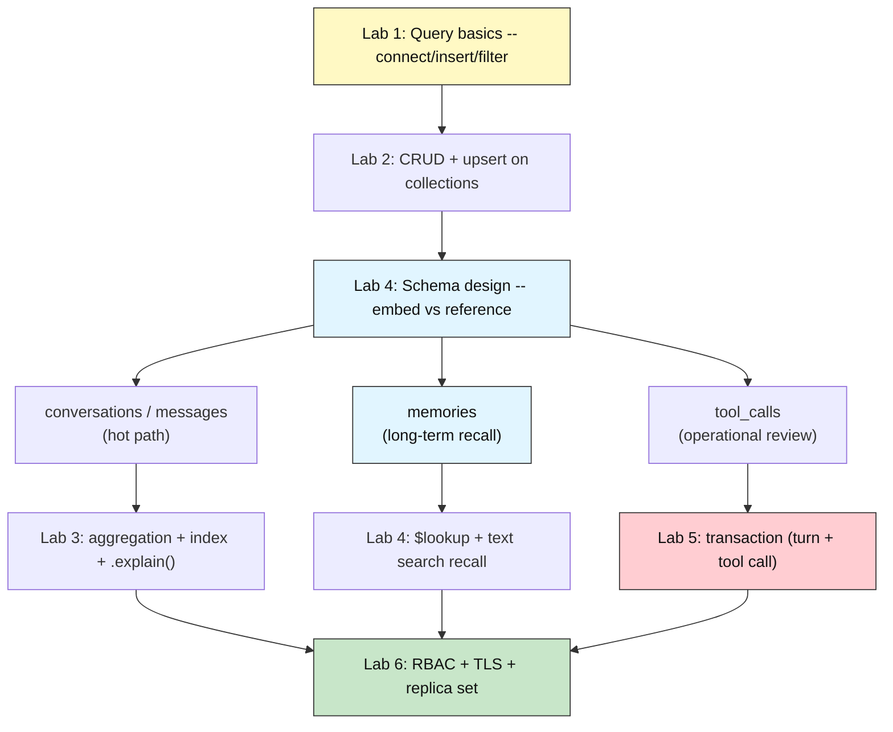
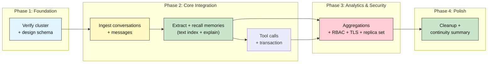
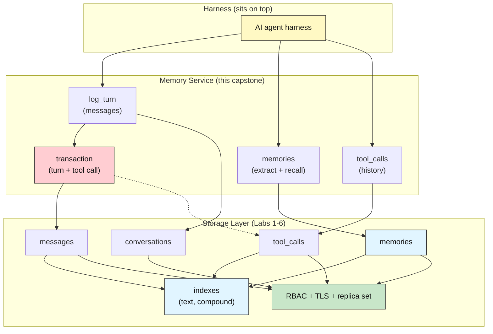

# MongoDB Capstone: AI Agent Memory Service

## Capstone Project -- Conversation Logging, Long-Term Memory, and Tool-Call History for an AI Harness

**Difficulty: Capstone (Advanced) | ~60 min per week for 2 weeks | Requires Labs 1-6 completed in this MongoDB Atlas project**

*Lab 7 of 7 in the MongoDB Mastery series.*

---

# Problem Statement / Use Case Overview

An AI agent *harness* — the program that runs an agent loop, decides which tool to call next, and keeps the conversation going across turns — needs one thing that a stateless LLM call does not: **memory**. It must remember what happened in an earlier turn, what a user told it weeks ago, and every tool call it has already made, so it does not repeat the same lookup or misremember a fact.

This capstone builds the **storage/memory layer** that harness sits on top of. It is the documented-only final lab of the MongoDB module: it is *not* a student notebook to run. Instead, this brief, together with the assignment file, describes the full-stack agent-memory service you would implement — the same MongoDB skills from Labs 1-6, now applied to the real AI-harness use case the whole module was building toward.

Labs 1-6 each solve one piece of the storage puzzle:

| Lab | What it proved |
|-----|---------------|
| **Lab 1** | Flexible documents can be read: connect, insert, filter, sort, aggregate a new database instantly |
| **Lab 2** | Writes are easy: the full CRUD lifecycle and `upsert` keep a collection current without manual bookkeeping |
| **Lab 3** | Aggregation pipelines and indexes turn raw documents into answers and fast lookups, provable with `.explain()` |
| **Lab 4** | Schema design, embedding vs. referencing, `$lookup`, and text search model related documents and let users search them |
| **Lab 5** | Multi-document transactions and change streams guarantee atomic writes and stream the changes out to subscribers |
| **Lab 6** | Replica sets, RBAC, and TLS keep a real database available and secure |

But each piece is incomplete alone. Documents with no schema plan collapse under a growing harness. A conversation log with no recall queries is dead data. A memory collection that cannot be searched, linked, or written atomically with the turn it came from is worse than no memory at all — it silently contradicts the agent.

This capstone combines all six into one **AI Agent Memory Service**, running in a dedicated `agent_memory` database on the same M0 Atlas cluster. Your implementation will:

- **Log each turn** — a conversation is stored with every user message and assistant reply plus token usage (Lab 1 reads, Lab 2 writes).
- **Store and recall long-term memories** — a `memories` collection that extracts, deduplicates, indexes, searches, and links facts across sessions (Labs 2-4).
- **Review tool-call history** — a `tool_calls` collection that records what tools ran, how they fared, and is written atomically with the turn that invoked them (Labs 3, 5).
- **Keep it fast and safe** — indexes and `.explain()` on the hot recall paths, read-only RBAC on the memory collection, TLS verified, replica set inspected (Labs 3, 6).

When complete, the pipeline demonstrates continuity across sessions: a harness can log a turn, extract a memory, recall it in a later conversation, review its own tool history, and trust the writes — all against MongoDB.

---

# Underlying Concepts

This lab doesn't re-teach Labs 1-6's individual concepts -- those already exist. Instead, it explains how they **compose** into a memory service.

**The memory service sits between the harness and the LLM.** The harness calls the service to persist a turn, and to fetch whatever a new turn needs before it calls the model. Two of the four collections serve the "hot" conversation path (`conversations`, `messages`); one serves long-term recall (`memories`); one serves operational review (`tool_calls`). Every query the harness makes runs against exactly one of these four collections -- this is where Lab 4's schema design decides what is embedded and what is referenced.

**Recall is a search problem, not a lookup problem.** A user asks for *"the thing about the largest vendor"* in a later session. Finding that memory is a text search over the `memories` collection using the text index from Lab 4, ranked and returned -- not a point lookup on a known `_id`. The index work in Lab 3 (`create_index` and `.explain()`) is what makes that recall fast as the collection grows.

**A turn and the tool calls it triggered must be written atomically.** When the agent calls a tool, the tool call and the assistant message that triggered it must land together. If the message commits but the tool call does not, the harness reviews a history that is missing an action it definitely took. Lab 5's multi-document transaction wraps both writes so they commit or roll back as one.

**Embedded vs. referenced answers the one-to-many question.** A conversation has many messages, and a conversation's `_id` appears on each message and each tool call -- reference, not embed, so a conversation never grows unbounded (Lab 4). A memory, in contrast, is short and always read as a unit -- but it is shared across *many* conversations, so it must be its own document referenced by each, never embedded in one conversation and lost to the others.



**RBAC must match how the harness and a reviewer differ.** The harness connection needs `readWrite` on `agent_memory` to log turns and write memories. A human reviewer who inspects what the agent has learned should be a separate user with `read` on `memories` only -- the least privilege a read-only recall reviewer needs, mirroring Lab 6.

**Cleanup must respect the write order.** Synthetic data is tagged with a marker field so every seeded conversation, message, memory, and tool call can be deleted without touching anything else. Teardown deletes `tool_calls` and `messages` before their parent `conversations`, and drops the read-only reviewer role last.

---

# Project Structure

The graded artifact for this capstone, when you build it, is your own notebook (`lab-agent-memory-service.ipynb`) plus whatever supporting files you create. If you're extending this into a fuller service, here's a suggested directory layout you may adapt:

```
agent-memory-service/
├── src/
│   ├── log_turn.py           # Write a turn (messages) to the conversation
│   ├── memories.py           # Extract, upsert, and recall memories
│   ├── tools.py              # Log tool calls + transaction helper
│   ├── secure.py             # RBAC user + role management
├── tests/
│   ├── test_log_turn.py
│   ├── test_memories.py
│   └── test_tools.py
├── submission/
│   └── PROJECT_SUMMARY.md    # Submission deliverable
├── lab-agent-memory-service.ipynb   # <-- your notebook (the main graded artifact)
├── lab-agent-memory-service-assignment.md
└── .env                      # your MONGODB_URI .env, kept inside this module, never committed
```

**This is a suggestion, not a requirement.** You may put everything in the notebook, or split it across modules -- the grading rubric evaluates what the notebook produces, not how you organize your source tree.

---

# Input Data

Your implementation should generate **synthetic, deterministic** data across the four `agent_memory` collections. A good starting point:

| Collection | What it holds | Seed size |
|------------|---------------|-----------|
| `conversations` | One document per session: `conversation_id`, `agent`, `created_at`, `status` | 3 |
| `messages` | One document per turn: `conversation_id`, `role` (user/assistant), `content`, `tokens` | 8 |
| `memories` | Extracted long-term facts: `memory_id`, `text`, `agent`, `source_conversation_id` | 5 |
| `tool_calls` | One document per invocation: `conversation_id`, `tool`, `args`, `ok`, `latency_ms` | 4 |

A good spread gives the aggregation and recall queries something real to chew on: the 3 conversations span two distinct agents, the 8 messages include both `user` and `assistant` roles with different token counts, the 5 memories include overlapping phrasing (so the text search has to *rank*, not just match), and the 4 tool calls mix `ok: True` and `ok: False` outcomes (so a failure-rate aggregation is meaningful).

Tag **every** synthetic document with a distinguishable marker field (e.g. `pytest-lab7-<hex>`) so cleanup can find and delete all synthetic rows without touching real data from Labs 1-6.

---

# Processing

Your pipeline should execute seven phases:

1. **Schema design** -- decide, per Lab 4, what is embedded and what is referenced across the four collections; create the collections.
2. **Conversation ingestion** -- insert the 3 tagged conversations and their 8 tagged messages (Lab 1 insert, Lab 2 CRUD lifecycle).
3. **Memory extraction & upsert** -- pull facts out of the messages into `memories`, using `upsert` (Lab 2) so re-runs never duplicate a memory, and link each memory to its source conversation via `$lookup` (Lab 4).
4. **Recall** -- build a text index on `memories.text` and run a ranked text-search recall for a later session; show `.explain()` proving the index is used (Labs 3, 4).
5. **Tool-call history & atomicity** -- log the 4 tagged tool calls and wrap the "assistant message + its tool call" write in a multi-document transaction (Lab 5); demo a change stream on `tool_calls`.
6. **Analytics** -- run aggregation pipelines over `messages` and `tool_calls` (token usage per conversation, tool failure rate), with an index + `.explain()` (Labs 1, 3).
7. **Security & continuity** -- inspect the replica set and verify TLS (Lab 6), create a read-only reviewer role on `memories` only (Lab 6 RBAC), then clean everything up tagged, in child-first order.

---

# Output

The following is **illustrative example output** -- a worked example of what a correct implementation would print. Your actual output will differ in `_id` values, token counts, and exact aggregation numbers, since every value is generated live.

**Step 1 -- connection succeeds:**

```
Connected to M0 cluster: replica set atlas-xxxx-shard-0 (TLS verified)
Database: agent_memory
```

**Step 2 -- schema design decision:**

```
conversations: reference messages -> 8 messages reference their conversation _id
tool_calls:    reference conversation _id
memories:      separate collection, referenced by conversations (shared across sessions)
```

**Step 3 -- conversation ingestion:**

```
Ingested 3 conversations and 8 messages (tagged pytest-lab7-3f9c...).
```

**Step 4 -- memory extraction & upsert:**

```
Extracted 5 memories from 8 messages; 0 duplicates (upsert dedup on memory text).
```

**Step 5 -- recall (text search + explain):**

```
Recall "largest vendor" returned 2 memories in 3 ms.
memory text: "The largest vendor is AtlasCloud (0.54s)"  | explain: IXSCAN on memories_text
```

**Step 6 -- tool-call history & atomicity:**

```
Logged 4 tool calls atomically with their turns (1 transaction).
Change stream: 1 new tool_call document observed.
```

**Step 7 -- analytics:**

```
Token usage by conversation:
  conv-0001 | user: 240 | assistant: 190
  conv-0002 | user: 180 | assistant: 220

Tool failure rate by tool:
  web_search: 1/2 failed (50%)
  code_runner: 0/2 failed (0%)
```

**Step 8 -- security & continuity:**

```
Replica set: 3 hosts, primary present (Lab 6 inspect).
Reviewer role mongo_memory_reviewer has read on memories only.
Capstone complete; all 4 collections cleaned up (tagged rows removed).
```

---

# Tech Stack

| Component | Tool |
|-----------|------|
| **Database** | MongoDB Atlas free M0 cluster (same one used in Labs 1-6; replica set, TLS already enforced) |
| **Python driver** | `pymongo[srv,tls]==4.10.1` -- connects Python to MongoDB |
| **Credential loader** | `python-dotenv==1.0.1` -- loads `MONGODB_URI` from the module-level `.env` |
| **TLS CA bundle** | `certifi` -- supplies the trusted CA certificate for the `tlsCAFile` argument |

> **Compute & cost:** Runs fine on any laptop CPU -- the entire workload is a handful of small pymongo operations and two or three aggregation pipelines. The free M0 tier covers it; nothing in this lab calls a paid API.

> Credentials never appear in the notebook itself: they're read from `.env` at runtime, exactly as in Labs 1-6.

---

# Prerequisites

- **Lab 1 (Student Records Lookup) completed** -- you can connect, insert, filter, sort, and aggregate documents; the memory service's hot path leans on these read operations.
- **Lab 2 (Student Enrollment Tracker) completed** -- full CRUD and `upsert`; memory extraction re-runs safely only because `upsert` deduplicates.
- **Lab 3 (Academic Performance Analytics) completed** -- aggregation pipelines, indexes, and `.explain()`; token and tool-failure analytics reuse these directly.
- **Lab 4 (Courses & Instructors) completed** -- schema design, embedding vs. referencing, `$lookup`, and text search; the four-collection design and memory recall come from here.
- **Lab 5 (Enrollment Transactions) completed** -- multi-document transactions and change streams; the atomic turn+tool-call write is a transaction.
- **Lab 6 (Scaling the University Database) completed** -- replica sets, RBAC, and TLS; the security phase inspects and secures the cluster the same way.
- **MongoDB Atlas + `.env` setup completed** -- the same one-time setup from the module README Section 8. If you haven't done it, do Lab 1 first.

---

# Environment / Dependencies Setup

| Package | Purpose |
|---------|---------|
| `pymongo` | The official MongoDB driver -- `[srv,tls]` extras enable `mongodb+srv` and TLS |
| `python-dotenv` | Loads `.env` files so credentials stay out of the notebook |
| `certifi` | Supplies the CA bundle MongoDB uses to verify the cluster's TLS certificate |

Install the three pinned packages (same versions Labs 1-6 already use):

```bash
!pip install -qU "pymongo[srv,tls]==4.10.1" python-dotenv==1.0.1 certifi
```

Your notebook's first code cell should contain exactly this line. The connection cell then loads the shared module `.env` and reads `MONGODB_URI`, exactly as in Labs 1-6:

```python
from dotenv import load_dotenv
import os, certifi
load_dotenv("../../.env")
client = pymongo.MongoClient(os.environ["MONGODB_URI"], tlsCAFile=certifi.where())
db = client["agent_memory"]
```

---

# Development Guide

This is a two-week capstone. The four phases below map to the recommended weekly schedule. Adapt the pacing to your own speed -- the milestones in the assignment file are what matter, not the calendar.

### Phase 1 -- Foundation (Week 1, Days 1-2)

Verify the database connection, confirm the M0 cluster is a replica set (Lab 6 inspect), and design the four-collection schema (Lab 4). Create the collections and decide which fields are embedded versus referenced.

### Phase 2 -- Core Integration (Week 1, Days 3-5)

Ingest the 3 tagged conversations and 8 messages (Labs 1-2). Extract 5 memories with `upsert` dedup (Lab 2). Build the text index and run the ranked search recall with `.explain()` (Labs 3-4). Log the 4 tool calls, wrapping the turn+tool-call write in a transaction (Lab 5), and demo a change stream.

### Phase 3 -- Analytics & Security (Week 2, Days 1-3)

Run the token-usage and tool-failure aggregations with an index + `.explain()` (Lab 3). Inspect the replica set and verify TLS (Lab 6). Create the read-only reviewer role on `memories` only (Lab 6 RBAC) and verify via a permissions query.

### Phase 4 -- Polish (Week 2, Days 4-5)

Delete all tagged rows in child-first order (`tool_calls` and `messages` before `conversations`), drop the reviewer role, and print a final continuity summary. Review against the Success Criteria Checklist in the assignment file.



---

# Marking Breakdown

| Category | Points | What is assessed |
|----------|--------|-----------------|
| Conversation & message ingestion | 15 points | 3 tagged conversations + 8 tagged messages present; read/filter/sort/aggregate over them (Lab 1); full CRUD lifecycle (Lab 2) |
| Memory extraction & upsert | 15 points | `memories` populated; `upsert` dedup so re-runs don't duplicate; `$lookup` links each memory to its source conversation (Labs 2, 4) |
| Recall & schema design | 15 points | Embed-vs-reference decision documented (Lab 4); text index on `memories.text`; ranked search recall with `.explain()` showing index use (Labs 3, 4) |
| Tool-call history & atomicity | 15 points | 4 tagged tool calls logged; assistant-message + tool-call write is a multi-document transaction; change stream on `tool_calls` demonstrated (Labs 3, 5) |
| Analytics | 15 points | Aggregation pipelines: token usage per conversation, tool failure rate; an index + `.explain()` on a hot query (Labs 1, 3) |
| Security & continuity | 15 points | Replica set inspected + TLS verified (Lab 6); read-only reviewer role on `memories` only, verified; continuity: a memory recalled in a different conversation (Lab 6) |
| Code quality | 7 points | Tagged synthetic rows; child-first cleanup; no hardcoded credentials; single pinned pip install |
| Documentation | 3 points | Output section matches notebook; Mermaid diagrams present; PROJECT_SUMMARY.md submitted |

**Grading bands:**

| Band | Points | Description |
|------|--------|-------------|
| Distinction | 85-100 | All components working; documentation thorough; optional exercise attempted |
| Merit | 70-84 | All core components working; minor documentation gaps |
| Pass | 50-69 | Most components working; some bugs or missing features |
| Borderline | 40-49 | Partial implementation; significant gaps in one or more categories |
| Fail | 0-39 | Minimal or non-functional implementation |

> These bands describe the 100-point mandatory rubric above. The Optional Exercise section below awards bonus points on top of it -- a perfect mandatory score plus every optional exercise tops out at 110.

---

# Optional Exercise

Add a **second recall path: a per-agent memory filter**. The base recall searches all memories; this exercise filters by agent so the harness only recalls memories the *current* agent wrote. Combine an index on `{agent: 1, source_conversation_id: 1}` with a compound query filter, and demonstrate that the harness can ask "what did *this* agent learn?" and get back only that agent's memories. Show how the filter composes with the existing text search (Lab 4) and confirm with `.explain()` that the compound filter uses an index (Lab 3).

This exercises the same skill as multi-tenant filtering in production: different agents share one `memories` collection but must not see each other's learned facts.

---

# What We Learnt

- **Integration is where the value appears** -- no single lab produces a memory service; only combining document reads (Lab 1), CRUD and upserts (Lab 2), aggregation and indexing (Lab 3), schema design and search (Lab 4), transactions (Lab 5), and security (Lab 6) creates something an agent harness could actually rest its long-term memory on.
- **Schema design is the first decision, not the last** -- whether a message is embedded in a conversation or referenced, and whether a memory is a shared document or a per-conversation child, determines every query that follows (Lab 4).
- **Recall is search, not lookup** -- an agent that asks "what did the user say about X" is running a ranked text search over `memories`, and that search is only practical at scale because of an index (Labs 3, 4).
- **Atomicity makes history trustworthy** -- logging a tool call separately from the message that triggered it lets the harness review an action it never actually committed; a multi-document transaction closes that gap (Lab 5).
- **Tagged rows enable safe re-runs** -- the `pytest-lab7-<hex>` marker means every synthetic document can be deleted without touching real data, making the pipeline safe to execute repeatedly.
- **`.explain()` proves the queries are practical** -- a recall that takes minutes on a small collection would be useless when an agent's memory grows to thousands of facts; the index-usage output confirms the hot paths are fast (Lab 3).
- **Memory is a security boundary** -- a reviewer role with `read` on `memories` only, and a harness role with `readWrite` on everything else, is the least-privilege separation that keeps an agent's learned facts from being visible to the wrong reader (Lab 6).

---

# Appendix A: Memory Service Checklist

| # | Requirement | How it is verified |
|---|-------------|-------------------|
| 1 | **Turns are logged** | 3 conversations + 8 messages present, tagged `pytest-lab7-<hex>` |
| 2 | **Memories are deduplicated** | `upsert` on memory text returns 0 duplicates on re-run |
| 3 | **Recall works across sessions** | text-search recall returns a memory from a different conversation |
| 4 | **A turn and its tool call commit together** | one multi-document transaction covering the assistant message + its tool call |
| 5 | **Hot paths use indexes** | `.explain()` shows IXSCAN, not COLLSCAN, on recall and analytics queries |
| 6 | **RBAC least-privilege** | reviewer role has `read` on `memories` only; harness role has `readWrite` on the collection set |
| 7 | **No hardcoded credentials** | `MONGODB_URI` loaded from `.env` via `os.environ` |
| 8 | **Cleanup is complete** | all tagged rows deleted in child-first order; reviewer role dropped |

---

# Appendix B: System Diagram


