# MongoDB Capstone: University Registration Database

---

# Problem Statement / Use Case Overview

A university is replacing its spreadsheet-based course registration with a real database. Students must be able to enroll in courses, a course must never be over-booked, the dean needs reports, the dashboard has to stay fast as records pile up, and students want to find courses even when they misspell the name.

You are the database owner. Over seven short steps you build and verify the whole thing on MongoDB Atlas. There is no new theory here: every step reuses one skill you already practised, so the capstone is about **putting the pieces together**, not learning something new.

This is deliberately a **small, single-sitting capstone**: one notebook, one database, three collections, seven checks.

---

# Input Data

| Item | Detail |
|------|--------|
| **Database** | `registrar_db` (created and deleted by the notebook) |
| **Students** | 20 generated students across 5 programs |
| **Courses** | 6 seeded courses, plus one you add (CS101 has only 3 seats, to test over-booking) |
| **Enrollments** | A few you create by hand, plus 30,000 synthetic records loaded in Step 4 |

---

# Processing

```mermaid
flowchart LR
    A["1 Design & seed<br/>Labs 1, 4, 4B"] --> B["2 Query & maintain<br/>Labs 1, 2"] --> C["3 Safe enrollment<br/>Labs 2, 5"] --> D["4 Reporting<br/>Lab 3"] --> E["5 Fast dashboard<br/>Labs 3, 3B"] --> F["6 Catalog search<br/>Lab 4C"] --> G["7 Deploy check<br/>& cleanup<br/>Lab 6"]

    style A fill:#e1f5ff,stroke:#333333,stroke-width:1px,color:#111111
    style B fill:#e1f5ff,stroke:#333333,stroke-width:1px,color:#111111
    style C fill:#fff9c4,stroke:#333333,stroke-width:1px,color:#111111
    style D fill:#fff9c4,stroke:#333333,stroke-width:1px,color:#111111
    style E fill:#fff9c4,stroke:#333333,stroke-width:1px,color:#111111
    style F fill:#c8e6c9,stroke:#333333,stroke-width:1px,color:#111111
    style G fill:#c8e6c9,stroke:#333333,stroke-width:1px,color:#111111
```



| Step | What you do | Lab skill reused |
|------|-------------|------------------|
| 1 | Design the three collections, load the data, add a unique index | Labs 1, 4, 4B (schema patterns) |
| 2 | Query, update and upsert records | Labs 1, 2 |
| 3 | Enroll students in a transaction that can never over-book a course | Labs 2, 5 |
| 4 | Report enrollments and average grade per course | Lab 3 (aggregation) |
| 5 | Make the dashboard query fast with an ESR index | Labs 3, 3B (optimization) |
| 6 | Search the catalog with typo tolerance | Lab 4C (Atlas Search) |
| 7 | Check the replica set, TLS and roles, then clean up | Lab 6 |

---

# Output

Every step ends with a check cell. A finished run prints:

```
Step 1 check passed
Step 2 check passed
Three students enrolled in CS101
Rejected S004 (course is full): no seats available
Rejected S007 (student is inactive): student not eligible
Step 3 check passed
Step 4 check passed
Step 5 check passed      (COLLSCAN + SORT before, IXSCAN with no SORT after)
Step 6 check passed
Step 7 check passed
```

> The numbers in the report (Step 4) and the explain output (Step 5) vary slightly by cluster. The checks look at their shape, not exact values.

---

# Tech Stack

| Component | Tool |
|-----------|------|
| **MongoDB driver** | `pymongo[srv,tls]==4.10.1` |
| **Credential loader** | `python-dotenv==1.0.1` (shared `.env`, two folders up) |
| **CA certificates** | `certifi` |
| **Database** | MongoDB Atlas free M0 tier (transactions, change streams and Atlas Search all work on it) |

---

# Underlying Concepts (Summarized)

There is no new theory in the capstone — every step reuses one skill from an earlier lab. Here is the whole toolkit in one place.

### The document model

MongoDB stores **documents** (JSON-like key-value records) inside **collections**. Unlike a relational table, documents in a collection do not have to share one schema, so a field can be added to one record without touching the others. This flexibility is exactly what lets the registrar model students, courses and enrollments without a rigid join table for every relationship.

### Schema patterns

Rather than normalise everything, MongoDB modeling chooses between **embedding** related data in one document and **referencing** it by id. The capstone uses two patterns: a **computed pattern** (`courses.seats_available` is a stored counter, never recounted on read) and an **extended reference** (`enrollments` copies `course_title` so a listing needs no `$lookup`).

### Aggregation and query shape

An **aggregation pipeline** transforms documents stage by stage — `$match` filters, `$group` summarises, `$sort` orders, `$project` shapes the output. Filtering early keeps later stages cheap.

### Indexes and the ESR rule

An **index** is a sorted structure that lets MongoDB find documents without scanning the whole collection. A **compound index** orders fields left to right, and the **ESR rule** — Equality, then Sort, then Range — gives the field order that lets one index serve both the filter and the sort. `explain("executionStats")` shows whether a query used an index (`IXSCAN`) or fell back to a collection scan (`COLLSCAN`).

### Transactions, replication and security

A **transaction** groups several writes across collections so they all commit or all abort — the mechanism that makes over-booking impossible. Atlas runs as a **replica set**: one primary accepts writes while secondaries replicate, and reads can be directed to secondaries. `mongodb+srv://` connections always use **TLS**, and database users are scoped with **roles** that limit what they may do.

### Atlas Search

**Atlas Search** (built on Apache Lucene) indexes text fields so queries tolerate typos and rank by relevance — something a plain `$text` index cannot do.

---

# Pre-requisites

- Labs 1-6 completed, plus 3B, 4B and 4C (this capstone checks the skills from all of them)
- A working Atlas cluster and `.env` file (README Section 8)
- About 90 minutes. Step 6 waits roughly a minute for the search index to build

---

# Environment / Dependencies Setup

| Package | Purpose |
|---------|---------|
| `pymongo[srv,tls]` | Python driver for MongoDB with SRV and TLS support, including `SearchIndexModel` |
| `python-dotenv` | Loads `.env` files so credentials stay out of the notebook |
| `certifi` | Provides up-to-date CA certificates for reliable SSL/TLS on all platforms |

```bash
pip install -qU "pymongo[srv,tls]==4.10.1" python-dotenv==1.0.1 certifi
```

This installs the MongoDB Python driver (`pymongo`), `python-dotenv` for loading credentials, and `certifi` for trusted CA certificates — the same packages as Labs 1-6.

---

# Step-wise Instructions — Development

**How the Capstone Works.** Open the **starter notebook** (`lab-7-registration-database.ipynb`). Each step has:

1. a short brief,
2. a code cell with one or two `# TODO` markers for you to fill in,
3. a **check cell** that stops with a clear message if something is wrong.

When a check prints *passed*, move on. If you are stuck, compare with `lab-7-registration-database-solution.ipynb`.

### Step 1 — Design and Seed the Database

*Skills from: Labs 1, 4, 4B*

Create the three collections the registrar needs and load the starting data.

**Schema decisions (already made for you, notice why):**

| Collection | Holds | Pattern used |
|---|---|---|
| `students` | one document per student | plain document |
| `courses` | one per course, with a `seats_available` counter | **computed pattern** (a stored counter, never recounted) |
| `enrollments` | one per student per course, with a copy of `course_title` | **referencing** by `student_id` and `course_id` plus an **extended reference** for the title |

**Your tasks**
1. Insert `STUDENTS` and `COURSES`.
2. Create a **unique** index on `enrollments` over `(student_id, course_id)` named `uniq_student_course`, so nobody can enroll twice in the same course.

**Expected output:**

```
Step 1 check passed
```

---

### Step 2 — Query and Maintain the Data

*Skills from: Labs 1, 2*

Everyday registrar work: look things up and keep records correct.

**Your tasks**
1. Find the **active Computer Science students**, sorted by name. Store the list in `cs_students`.
2. Student `S014` is marked inactive by mistake. Set their `status` to `"active"`.
3. Add a new course `CS301` ("Databases") using an **upsert**, and run the upsert **twice** to prove it never creates a duplicate.

*Hints:* `find(filter).sort(...)`, `update_one(..., {"$set": ...})`, and `upsert=True` with `$setOnInsert` for fields that should only be written when the document is first created.

**Expected output:**

```
Step 2 check passed
```

---

### Step 3 — Enroll Students Safely with a Transaction

*Skills from: Labs 2, 5*

Enrolling a student changes two collections at once: a seat is taken in `courses` and a record is added to `enrollments`. Both must happen, or neither.

**Your tasks** — complete the `enroll` function:
1. Confirm the student exists and is **active**, otherwise raise `ValueError`.
2. Take one seat: update the course only if `seats_available > 0`, decrementing the counter, and raise `ValueError` if no seat was available.
3. Insert the enrollment record, copying the course `title` into `course_title` (the extended reference).

The notebook then enrolls three students into `CS101` (only 3 seats), tries a 4th (must fail), and tries an inactive student (must fail).

*Hints:* `find_one_and_update(filter, update, session=session)` returns `None` when the filter matches nothing. Every operation inside the transaction needs `session=session`.

**Expected output:**

```
Three students enrolled in CS101
Rejected S004 (course is full): no seats available
Rejected S007 (student is inactive): student not eligible
Step 3 check passed
```

---

### Step 4 — Report on the Data with an Aggregation

*Skills from: Lab 3*

The dean wants a report: for every course, how many **active** enrollments does it have and what is the **average grade**, highest average first.

**Your task:** write the aggregation pipeline `report_pipeline` using `$match`, `$group` (with `$sum` and `$avg`) and `$sort`. Then run it.

*Hints:* match `status == "active"` first; group by `$course_id`; name the output fields `enrolled` and `avg_grade`.

**Expected output:**

```
Synthetic enrollments loaded: 30000
Total enrollment documents: 30003
CS201  enrolled= ...  avg_grade=...
Step 4 check passed
```

---

### Step 5 — Make the Dashboard Query Fast

*Skills from: Labs 3, 3B*

The registrar's dashboard shows the **10 newest active enrollments for a course**. With 30,000 documents and no matching index, that query reads everything.

**Your task:** create a compound index that follows the **ESR rule** (Equality fields, then Sort field) for this query, then re-check the plan.

The two equality fields are `course_id` and `status`; the sort field is `enrolled_at` (newest first, so descending). Name the index `esr_course_status_date`.

*Success looks like:* `COLLSCAN` and a `SORT` stage before; `IXSCAN` and no `SORT` stage after, with about 10 documents examined instead of 30,000.

**Expected output:**

```
Before: {'stages': ['SORT', 'COLLSCAN'...], 'docs': 30003, ...}
After:  {'stages': ['LIMIT', 'FETCH', 'IXSCAN'], 'docs': 10, ...}
Step 5 check passed
```

---

### Step 6 — Let Students Search the Course Catalog

*Skills from: Lab 4C*

Students type course names with typos. Exact `find()` queries cannot cope, but **Atlas Search** can.

The notebook creates an Atlas Search index on `courses` (title and description) and waits for it to build.

**Your task:** write `search_courses(text)`: a `$search` pipeline using the `text` operator on `title` and `description` with **fuzzy matching (one typo allowed)**, limited to 3 results, returning only `course_id` and `title`.

*Test it with `"programing"` (one `m` missing): the top result must be `CS101`.*

*Hints:* `$search` must be the first stage; fuzzy is `{"maxEdits": 1}`. This step needs Atlas (the free M0 tier is fine).

**Expected output:**

```
Building search index (20-60 seconds)...
Search index ready
[{'course_id': 'CS101', 'title': 'Introduction to Programming'}, ...]
Step 6 check passed
```

---

### Step 7 — Check the Deployment and Clean Up

*Skills from: Lab 6*

The last job of a database owner: confirm the system is deployed safely, then leave no mess behind.

**Your tasks**
1. Run the `hello` command and store the replica set name in `set_name` and the number of members in `member_count`.
2. Set `tls_enforced` to `True` if the connection string uses the `mongodb+srv` scheme (which requires TLS).
3. Use `connectionStatus` to list your current user's roles in `roles`.
4. Clean up: drop the search index, then the whole `registrar_db` database.

*Hints:* `db.command("hello")` returns `setName` and `hosts`; `db.command("connectionStatus")["authInfo"]["authenticatedUserRoles"]` lists roles.

**Expected output:**

```
Replica set: atlas-... | members: 3 | TLS enforced: True
Current roles: [...]
Step 7 check passed
```

---

### Optional Stretch (not required)

1. Add `$vectorSearch` from Lab 4C to the catalog so "learn to write code" finds Introduction to Programming.
2. Add a change stream on `enrollments` and print each new enrollment as it happens (Lab 5).
3. Show how many documents the Step 4 report examines before and after adding the Step 5 index.

---

# What We Learnt

- **A database project is a chain of small, well-understood skills.** Each step reused one lab: CRUD, aggregation, indexing, transactions, search and deployment checks.
- **Schema patterns pay off in daily work:** the `seats_available` counter (computed pattern) and the copied `course_title` (extended reference) kept enrollment and listing fast and simple.
- **A transaction protects a rule that spans collections:** a seat is taken and an enrollment written together, or neither happens.
- **Always check the plan, not just the result:** the dashboard query returned correct rows both before and after the index, but `explain` showed the real difference.
- **Own your cleanup:** a good capstone leaves the cluster exactly as it found it.

Congratulations: you have now built a small production-style database from scratch.
