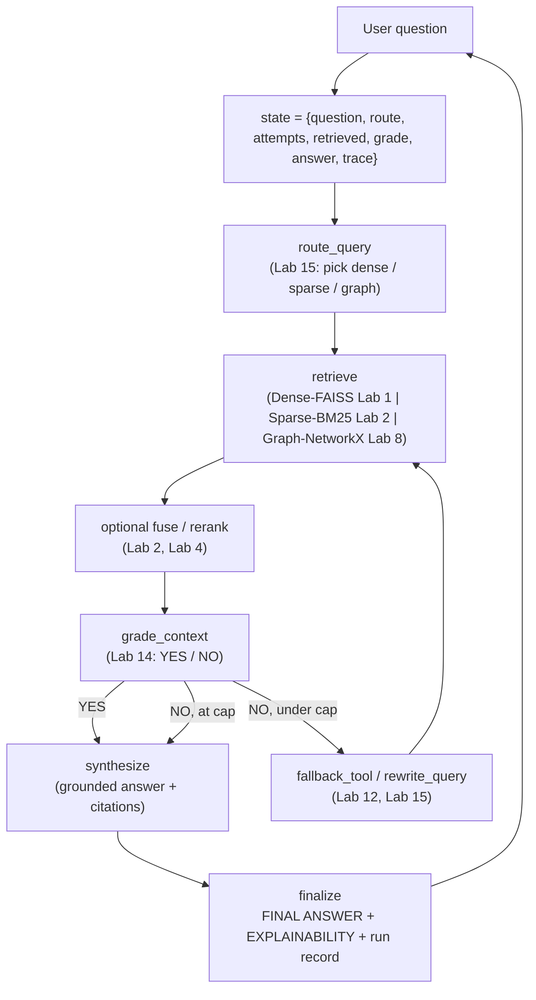
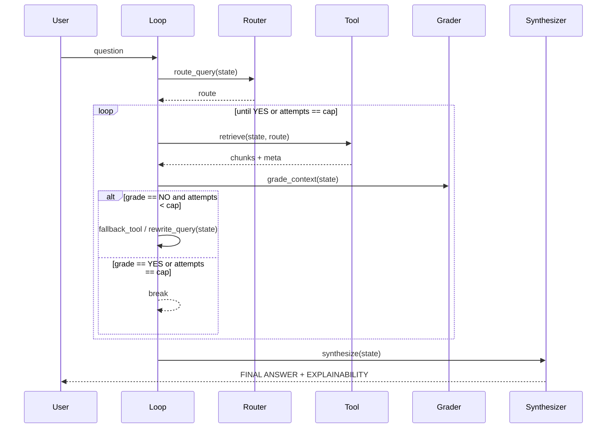

# Capstone — Agentic Research Assistant: A Multi-Tool, Self-Correcting RAG Agent

**Type:** Capstone Project | **Level:** Advanced | **Duration:** 2–3 weeks (30–60 hours)

**Integrates:** Labs 1–15 (complete RAG catalog).

**Execution model:** Documentation suite — design and build spec only (no runnable
code files in this folder). The agent loop is **hand-rolled in plain Python**:
a single `state` dictionary threaded through explicit `route → retrieve → grade →
rewrite / fallback → synthesize` functions driven by a `while` loop. **No
LangGraph, LangChain agent, or any orchestration framework** — the point of the
capstone is to see the mechanics, not to hide them behind a library.

**Corpus:** `sample_text_document.pdf` (already shipped in `Classical-RAG/data/`
and `HybridRAG/data/`), so the whole capstone runs locally and offline.

---

## 1. Problem Statement

Build a single **research assistant** that answers a natural-language question by
choosing among several retrieval strategies, checking whether what it retrieved
is actually good enough, correcting itself when it is not, and producing a final
answer with a per-source explainability trace.

Three requirements separate this from the earlier labs, each of which built one
piece in isolation:

- **One question, many tools.** The assistant has to *decide* whether a question
  is best served by dense semantic search, sparse keyword search, or a knowledge
  graph — and it must be able to switch tools mid-run when its own grading says
  the first choice failed (Labs 10, 15).
- **Self-correction is explicit state, not magic.** Grading, question rewriting,
  retry caps, and fallback are ordinary functions operating on a shared state
  dict; the learner can print the state after every turn and watch the decision
  change (Labs 12, 14, 15).
- **Answers are grounded and inspectable.** Every claim cites the tool and chunk
  it came from, and failed routes are reported, not hidden (Labs 1, 5, 13).

The assistant is designed for a single local user, reading one document today,
with a documented path to more documents and more tools.

## 2. Scope

**In scope**

- One hand-rolled agent loop: `route → retrieve → grade → (rewrite | fallback) →
  synthesize → finalize`, with a bounded retry cap.
- Three local retrieval tools built from earlier labs:
  - **Dense** — `sentence-transformers` + FAISS `IndexFlatIP` (Lab 1).
  - **Sparse** — a hand-rolled BM25 over the same chunks (Lab 2).
  - **Graph** — NetworkX graph built from LLM-extracted `source/relation/target`
    triples, traversed outward from a matched entity (Lab 8).
- Optional **fusion** stage that merges dense + sparse ranks (Lab 2) and optional
  **reranking** of fused candidates (Lab 4).
- A **grader** that labels retrieved context `YES`/`NO` and a **rewriter** that
  reformulates the question on `NO` (Lab 14).
- A **router** that picks the starting tool and a **fallback** that swaps tools
  before rewriting (Lab 15).
- A **synthesizer** that answers only from retrieved context and emits a
  `--- FINAL ANSWER ---` block plus a `--- EXPLAINABILITY ---` trace.

**Out of scope (documented as future work)**

- Cloud backends: Neo4j (Lab 9), Qdrant (Labs 3–4), PageIndex vectorless
  (Labs 11–13), OCR ingestion (Labs 5–6) — each named as an optional tool plug-in.
- Multi-document / multi-user isolation, a web UI, and deployment.
- Fine-tuning or any model training.

## 3. Integration Map — every lab earns its place

| Lab | Concept | Where it lands in the capstone |
|-----|---------|--------------------------------|
| 1 | Classical pipeline (load, chunk, embed, FAISS, cosine, generate) | The document spine: chunking, embeddings, the dense tool, and the generate step |
| 2 | Hybrid dense + sparse with BM25 | The sparse tool; the optional fusion stage that merges dense + sparse ranks |
| 3 | Parent-child / summary multi-vector | Context assembly: retrieve small, return the surrounding parent chunk |
| 4 | ColBERT late interaction | Optional reranker over fused candidates before grading |
| 5 | Structured OCR + RAG | Optional ingestion path for scanned inputs (documented plug-in) |
| 6 | Scanned PDF + FAISS | Optional ingestion path; reuses the same chunk/embed contract |
| 7 | LLM-Wiki structured knowledge base | Index-first tool selection: route by topic before retrieving |
| 8 | NetworkX generalized graph RAG | The graph tool: triple extraction + `traverse_subgraph(radius)` |
| 9 | Neo4j graph RAG | Optional persistent graph backend behind the same graph-tool interface |
| 10 | Vector + graph hybrid | Combined scoring when both dense and graph evidence are useful |
| 11 | Vectorless tree reasoning | Optional tree/index tool for section-level reasoning |
| 12 | Vectorless multi-hop + explainability | The rewrite-and-retry hop mechanism and per-hop citations |
| 13 | Vectorless structured table retrieval | Optional table tool for numeric/figure questions |
| 14 | Agentic self-correction | The `grade_context` + `rewrite_query` loop and retry cap |
| 15 | Agentic routing + tool-swap fallback | The `route_query` router and `fallback_tool` swap before rewriting |

## 4. Target Output

For a question such as *"How does the document describe the water cycle, and what
role do plants play?"* the assistant produces:

- A **routing decision** (e.g. `route = sparse`, or `dense` for a paraphrase-y
  question) that is visible in the state.
- A **grading verdict** (`YES`/`NO`), and on `NO` either a **tool swap** or a
  **rewritten query** — with the retry count shown.
- A **grounded answer** in a `--- FINAL ANSWER ---` block.
- An **explainability trace** in a `--- EXPLAINABILITY ---` block: which tool ran
  at each attempt, which chunks/paths were returned, and how many retries it took.
- A **run record**: question, final route, attempts, tools used, and whether the
  answer was downgraded to an "insufficient evidence" message.

## 5. Tech Stack & Constraints

- **Agent loop:** plain Python — a `state` dict, a `while` loop, and named
  functions. No LangGraph/LangChain agent framework.
- **Retrieval:** `sentence-transformers` (`all-MiniLM-L6-v2`, local), `faiss-cpu`,
  a hand-rolled BM25, and `networkx`.
- **Model provider:** *model-agnostic* — a thin `Provider.chat()` wrapper (an
  `openai` client pointed at OpenRouter with a free-tier model, matching
  `Lab 1 / Lab 15`), chosen by a `RAG_MODEL` env var so the backend can change
  without touching the loop.
- **Parsing:** `pymupdf` for the PDF; `numpy` for scoring.
- **Secrets:** `python-dotenv`, reading `OPENROUTER_API_KEY` from `.env`.
- **Cost:** free-tier model + local embeddings, so a full run costs nothing.
- **Constraint:** every model call goes through `Provider`; every tool returns the
  same `{chunks, meta}` shape so the loop is tool-agnostic.

## 6. Architecture Overview

### 6.1 System diagram

### 6.2 Component responsibilities

| Component | Function | Contract | Primary labs |
|-----------|----------|----------|--------------|
| State | one dict threaded through the loop | `{question, route, attempts, retrieved, grade, answer, trace[]}` | 12, 14 |
| Router | `route_query(state)` | returns `dense` / `sparse` / `graph` (+ rationale) | 7, 15 |
| Tools | `retrieve_dense / _sparse / _graph(state)` | returns `{chunks, meta}` in a common shape | 1, 2, 8 |
| Fuse/Rerank | optional merge + reorder | returns reordered `{chunks, meta}` | 2, 4 |
| Grader | `grade_context(state)` | returns `YES` / `NO` | 14 |
| Rewriter/Fallback | `rewrite_query` / `fallback_tool` | mutates `state`, increments `attempts` | 12, 15 |
| Synthesizer | `synthesize(state)` | answer grounded only in `retrieved` | 1, 5, 13 |
| Finalizer | `finalize(state)` | answer block + explainability + run record | 5, 13 |

### 6.3 Data flow (one run)

## 7. Key Design Decisions

- **The loop is the teacher.** A `while` loop over a dict — not a framework —
  so every state transition is printable and explainable (Labs 14–15).
- **One tool contract, many tools.** Every retriever returns `{chunks, meta}`,
  which is why a tool can be swapped mid-run without touching the loop.
- **Grade before you retry, retry before you give up.** `NO` first triggers a
  tool swap; only when tools are exhausted does the question get rewritten, and
  a hard `max_attempts` cap guarantees termination (Labs 12, 15).
- **Grounded or silent.** `synthesize` answers only from `retrieved`; if the cap
  is hit with no passing grade, it returns an explicit "insufficient evidence"
  message instead of guessing (Labs 1, 13).
- **Explainability is a first-class output.** The trace records route, tool,
  chunks, and verdict per attempt, feeding the final `EXPLAINABILITY` block
  (Labs 5, 12, 13).
- **Local by default, cloud by plug-in.** Neo4j, Qdrant, PageIndex, and OCR are
  optional backends behind the same contracts — the capstone runs with none of
  them installed (Labs 3, 6, 9, 11).
- **Model-agnostic by interface.** All model calls pass through `Provider.chat()`;
  switching vendors is a config change, not a code change.

## 8. Required Documentation Set

| File | Contents |
|------|----------|
| `00-overview-architecture.md` | this document — problem, scope, integration map, architecture, decisions |
| `01-agent-loop-and-state.md` | the state schema, the `while` loop, each function's input/output/failure contract, the retry cap |
| `02-retrieval-tools.md` | dense / sparse / graph tool specs, the common `{chunks, meta}` contract, fusion & reranking, optional cloud backends |
| `03-routing-grading-correction.md` | router heuristics, grader prompt + parsing, rewrite strategy, fallback ordering, termination proof |
| `04-explainability-and-output.md` | the `FINAL ANSWER` / `EXPLAINABILITY` formats, citations, run record, insufficient-evidence behavior |
| `05-test-plan.md` | unit tests per function (fake tools/provider), scenario tests (wrong route, forced `NO`, cap reached), pass criteria |
| `06-evaluation-and-tuning.md` | a small gold question set, hit-rate / route-accuracy / retry-count metrics, knob sweep (`top_k`, `max_attempts`, fusion on/off) |
| `07-extensions-and-runbook.md` | adding a tool, plugging in Neo4j/Qdrant/PageIndex, cost/keys, local run walkthrough |
| `lab-capstone-project-assignment.md` | the post-capstone assignment (Section 10) as a standalone sheet |

## 9. Environment Setup (documentation convention)

This capstone ships as a design + build spec, so there is nothing to install to
*read* it. The runbook (`07-extensions-and-runbook.md`) documents the local
environment the design targets:

- a Python 3.11 venv built from `requirements.txt`,
- `OPENROUTER_API_KEY` in `.env`,
- `sample_text_document.pdf` copied into the working folder's `data/`.

The first code cell of the eventual notebook/script follows the catalog rule: a
single pinned `!pip install` line matching this section.

## 10. Post-Capstone Assignment

1. Trace one run that starts on `sparse`, gets `NO`, and recovers on `graph`.
   List the `state` keys that change at each of the four loop stages.
2. Explain why `synthesize` must read only `retrieved` and never the original
   question alone. Which lab first established this rule?
3. The retry cap is `max_attempts = 3`. Give a question that still ends in the
   "insufficient evidence" branch, and explain which route each attempt took.
4. Where would you insert a reranker (Lab 4) so it runs *once* per attempt rather
   than once per tool? Justify the placement.
5. The graph tool and the dense tool can disagree. Describe how you would combine
   their scores (Lab 10) and how the explainability trace should report a
   conflict.
6. Pick one cloud backend (Neo4j, Qdrant, or PageIndex). Describe the single
   contract its adapter must satisfy so the loop code does not change.

## 11. Further Reading / Next Steps

- Re-read the new **Lab 1 (Classical RAG)** for the chunk → embed → retrieve →
  generate spine the capstone reuses.
- **Lab 15 (Agentic Hybrid RAG with Dynamic Routing)** is the closest ancestor:
  this capstone is that lab's router/fallback logic rebuilt by hand, made
  multi-tool, and wrapped in explainability.
- **Labs 8 and 10** define the graph tool and combined vector+graph scoring.
- If a later milestone adds cloud tools, the adapter contracts in
  `02-retrieval-tools.md` already name the seams.

---

*End of overview. Continue to `01-agent-loop-and-state.md`.*
