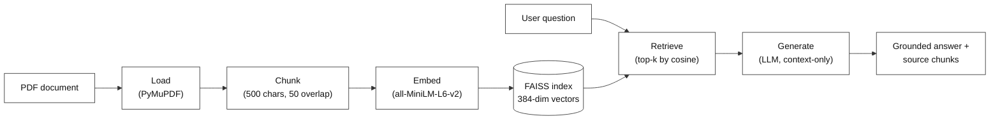

# Classical RAG: The Canonical Pipeline

**Difficulty:** Beginner | **Time:** ~50 min | **Requires:** None — this is the first lab

---

# Problem Statement / Use Case Overview

A language model only knows what it learned during training, so it cannot answer questions about *your* documents — and when it tries anyway, it fills the gap with plausible-sounding invention. The standard fix is **Retrieval-Augmented Generation**: search your document for the passages that actually matter, hand those passages to the model, and ask it to answer using only them. This lab builds that pipeline from scratch, one stage at a time, with the plainest tools available: read a PDF, cut it into chunks, turn each chunk into a vector, store the vectors in a search index, retrieve the closest matches, and generate an answer. It is deliberately the **simplest** version of RAG — the baseline that every other lab in this module improves on. Building it end to end is what makes the later techniques (hybrid search, knowledge graphs, agentic loops) make sense.

### How This Lab Solves It

This lab assembles the **canonical six-stage RAG pipeline** and runs a real question through all of it:

1. **Load** — pull the raw text out of a PDF.
2. **Chunk** — split the text into fixed-size pieces with a little overlap.
3. **Embed** — turn each chunk into a vector that captures its meaning.
4. **Index** — store every vector so it can be searched by similarity.
5. **Retrieve** — embed the question and fetch the top-k closest chunks.
6. **Generate** — pass those chunks to an LLM and ask it to answer from them alone.

This is useful for:

- **Any private document set** the model was never trained on — manuals, reports, notes, PDFs.
- **Attributable answers** — the retrieved chunks are printed, so you can see exactly what the answer was built from.
- **A reference point** — once you can measure this baseline's weaknesses, you can tell whether a fancier method is actually earning its complexity.

---

# Input Data

| Item | Detail |
|------|--------|
| **The PDF** | `data/sample_text_document.pdf` — a short synthetic guide to coastal wetland restoration, shipped with the lab. It is deliberately small (2 pages, ~4,000 characters) so you can read the chunks yourself and judge whether retrieval is right. |
| **Your question** | A natural-language question about the document. The default `QUESTION` asks why restoration teams reintroduce tidal flow gradually rather than all at once. |
| **Embedding model** | `all-MiniLM-L6-v2`, run locally via `sentence-transformers` — downloads once (~90 MB), no API key needed, 384 dimensions. |
| **LLM API key** | OpenRouter, used only to generate the final answer from the retrieved chunks. |

---

# Processing

The pipeline is a straight line — there is no loop and no decision-making. Data flows in one direction, and each stage transforms what the previous stage produced.

### Stage 1 — Load

The PDF is opened with PyMuPDF (`pymupdf`) and every page's text is concatenated into one long string.

### Stage 2 — Chunk

That string is sliced into fixed-size windows of **500 characters**, each window starting **50 characters** before the previous one ended. The overlap stops an idea that straddles a boundary from being lost entirely. This naive fixed-size cutoff is the baseline that semantic chunking (a later lab) improves on.

### Stage 3 — Embed

Each chunk is passed through `all-MiniLM-L6-v2`, which returns a **384-number vector** for it. We normalize each vector to length 1, which turns "closest by cosine similarity" into a simple dot-product comparison.

### Stage 4 — Index

The vectors are added to a FAISS `IndexFlatIP` — a flat list of vectors that supports exact nearest-neighbour search using inner product. On normalized vectors, inner product **is** cosine similarity, so the score FAISS returns is directly interpretable as "how aligned are these two texts."

### Stage 5 — Retrieve

The question is embedded with the same model, FAISS returns the `top_k` closest chunk vectors and their similarity scores, and the matching chunks are pulled back out.

### Stage 6 — Generate

The retrieved chunks are pasted into a prompt under a hard instruction — *answer using only this context* — and sent to the LLM. The model's answer, plus the chunks it was given, is the lab's final output.



---

# Output

**Step 1** reports what was read out of the PDF:

```
Loaded 2 page(s), 4,065 characters.
```

**Step 2** reports how many fixed-size chunks that text produced, and shows the start of the first one:

```
Created 10 chunks (500 chars, 50 overlap).

First chunk:
A Short Guide to Coastal Wetland Restoration
Synthetic Sample Document — Original Content, No Copyright Restrictions
1. Introduction
Coastal wetlands sit at the boundary between land and sea, absorbin
```

**Step 3** shows the shape of the embedding matrix — one row per chunk, one column per embedding dimension:

```
Embedding matrix shape: (10, 384)
```

**Step 4** confirms every vector landed in the index:

```
Vectors in index: 10
```

**Step 5** prints the question and the top-3 chunks retrieved for it, each with its cosine score. Notice the top hit is *topically* about tidal exchange but is not the sentence that answers the question — that chunk lands at rank 3. This is the naive retriever working as designed, and it is exactly the weakness later labs attack:

```
QUESTION: Why do restoration teams reintroduce tidal flow gradually instead of all at once?

--- Chunk 1 (cosine 0.644) ---
tures is often the single most effective step in a restoration project, since it allows the
natural rise and fall of the tide to resume moving sediment, nutrients, and organisms...

--- Chunk 2 (cosine 0.494) ---
rences determine whether a marsh plant community can establish itself. Soil cores reveal whether
the ground still holds buried peat or shell layers from a wetland that existed before it was drained...

--- Chunk 3 (cosine 0.474) ---
soil. Phased approaches might open a small channel first, monitor erosion and sediment deposition
for a season, and then widen the opening in stages. This measured pace gives pioneer plant species...
```

**Step 6** prints the generated answer. Because the prompt forbids outside knowledge, the model copies the reasoning out of the retrieved chunks rather than from its own training:

```
Answer: Restoration teams reintroduce tidal flow gradually because a sudden full breach can
erode unconsolidated fill material before vegetation has a chance to stabilize the soil.
Phased approaches allow teams to monitor erosion and sediment deposition, and give pioneer
plant species time to colonize newly wetted areas as they emerge.
```

**Step 7** sweeps `top_k` and chunk size to show how the two knobs trade context against precision:

```
top_k=1: 1 chunks, 500 context chars, top score 0.644
top_k=3: 3 chunks, 1499 context chars, top score 0.644
top_k=5: 5 chunks, 2499 context chars, top score 0.644

chunk_size=100: 41 chunks
chunk_size=500: 9 chunks
chunk_size=2000: 3 chunks
```

---

# Tech Stack

| Component | Tool |
|---|---|
| **PDF Reading** | `pymupdf` (PyMuPDF) — extracts text from the PDF |
| **Chunking** | plain Python — fixed-size slicing with overlap, no library |
| **Embedding Model** | `all-MiniLM-L6-v2`, via `sentence-transformers` — runs locally, 384 dimensions |
| **Vector Index** | `faiss-cpu` (`IndexFlatIP`) — exact inner-product search |
| **Similarity Math** | `numpy` — array storage and normalization |
| **LLM (Answering)** | `nvidia/nemotron-3-ultra-550b-a55b:free`, via the `openai` client pointed at OpenRouter — a free-tier model, so a full run costs nothing |
| **Secrets** | `python-dotenv` — reads `OPENROUTER_API_KEY` from a `.env` file |

---

# Underlying Concepts (Summarized)

**What RAG actually changes.** A plain LLM is a closed-book exam: it can only use what it memorized during training. RAG turns that into an open-book exam — before the model answers, the system looks up the relevant pages and puts them in front of the model. The model's *knowledge* is no longer the limit; the *retriever's* quality is.

**Embeddings.** An embedding model reads a piece of text and returns a vector — a list of numbers — positioned so that texts with similar meaning land near each other. "Phased reintroduction" and "opening the breach in stages" share almost no words, yet their vectors sit close together, because the model was trained to place paraphrases nearby. This is why vector search finds meaning instead of just matching strings.

**Cosine similarity.** To compare two vectors we measure the angle between them: the cosine of that angle is 1 when they point the same way, 0 when they are unrelated, and −1 when opposite. If every vector is first normalized to length 1, the cosine is just the dot product, which is why the lab normalizes once and then uses FAISS inner product. The scores you see (`0.644`, `0.494`, …) are those cosines — higher is a closer match.

**Chunking and overlap.** A document is too long to embed whole, so we cut it into pieces. Chunk size is a genuine trade-off: chunks that are too small lose the surrounding context and become ambiguous; chunks that are too large dilute the signal and waste the model's context window. Overlap exists because meaning doesn't respect a fixed boundary — a sentence split across two chunks still appears intact in at least one of them. This lab's fixed-size slicer is the simplest possible chunker and will happily cut mid-word, which is precisely why later labs replace it with semantic chunking.

**Vector index and top-k.** A vector index is just a searchable store of vectors. `top_k` says how many neighbours to return. Because the retriever always returns *k* chunks whether or not any are relevant, a small, off-topic corpus will still hand back confident-looking "matches" — retrieval scores measure similarity, not truth.

**Augmentation and grounding.** The retrieved chunks are "augmented" onto the prompt, and the instruction tells the model to answer from them only. This is what *grounds* the answer: the model is now summarizing supplied evidence instead of recalling training data, which is what reduces **hallucination**.

**When RAG isn't the right fit.** For a single short paragraph, just paste it into the prompt — there is nothing to retrieve. For tasks that need the entire corpus at once (summarize every document), retrieval throws away too much. And for highly relational data (transactions, inventory), SQL usually beats semantic search.

> **Why this matters:** every later lab in this module changes exactly one of these six stages — a smarter chunker, a second retriever, a graph instead of a flat index, or a loop that checks the retriever's work. You cannot judge those upgrades until you have felt this baseline's limits firsthand.

---

# Pre-requisites

- **Basic Python** — functions, loops, `import` statements, lists, and dictionaries.
- **No prior RAG knowledge** — this is the first lab; every concept above is introduced here.
- **An OpenRouter API key** — used only to generate the final answer.
- **~500 MB of free disk** for the local embedding model, and roughly 4 GB RAM. No GPU needed; everything runs on CPU.

---

# Environment / Dependencies Setup

The cell below installs all required Python packages:

| Package | Purpose |
|---------|---------|
| `pymupdf` | Reads text out of the PDF |
| `sentence-transformers` | Runs the local `all-MiniLM-L6-v2` embedding model |
| `faiss-cpu` | The vector index and similarity search |
| `openai` | Talks to the LLM (through OpenRouter's OpenAI-compatible endpoint) |
| `python-dotenv` | Loads the API key from `.env` |
| `numpy` | Array storage for the embedding matrix |

> **Note:** Run this cell first — it only needs to be run once per session.

```python
!pip install pymupdf sentence-transformers faiss-cpu openai python-dotenv numpy
```

**Getting an OpenRouter API key**

The LLM here is accessed through OpenRouter, which provides a single API key that works across many models, including free ones.

1. Go to [openrouter.ai](https://openrouter.ai) and sign up, or log in if an account already exists.
2. From the dashboard, open the **Keys** section.
3. Click **Create Key**, give it a name, and confirm.
4. **Copy the key immediately** — it is shown in full only once.
5. Put it in a `.env` file next to the notebook:

```
OPENROUTER_API_KEY=sk-or-v1-...
```

The notebook reads this file automatically, and falls back to prompting you interactively if the file is missing — so a missing `.env` won't crash the run.

---

# Step-wise Instructions — Development

---

### Setup — Import Libraries

This cell loads every tool the pipeline needs, grouped by role: the PDF reader, the embedding model, the vector index, and the LLM client.

```python
import os
import warnings
import logging

import numpy as np
import pymupdf  # PyMuPDF — reads the PDF
import faiss  # the vector index
from dotenv import load_dotenv
from sentence_transformers import SentenceTransformer
from openai import OpenAI
```

### Setup — Silence Noisy Logs

This cell doesn't touch the pipeline at all — it's purely there to keep the notebook's output readable by suppressing routine download and warning messages from the underlying libraries.

```python
warnings.filterwarnings("ignore")
logging.getLogger("transformers").setLevel(logging.ERROR)
logging.getLogger("sentence_transformers").setLevel(logging.ERROR)
logging.getLogger("httpx").setLevel(logging.ERROR)
```

### Setup — Load API Key & Build the Embedding Model

This cell gets the LLM client authenticated and loads the embedding model once, so every later step reuses the same objects.

```python
load_dotenv(".env")

OPENROUTER_API_KEY = os.getenv("OPENROUTER_API_KEY")

if not OPENROUTER_API_KEY:
    OPENROUTER_API_KEY = input("Enter your OpenRouter API key (get one at https://openrouter.ai): ").strip()

print("Key loaded.")

# The OpenAI client works with any OpenAI-compatible endpoint — here, OpenRouter.
client = OpenAI(
    base_url="https://openrouter.ai/api/v1",
    api_key=OPENROUTER_API_KEY,
)
MODEL = "nvidia/nemotron-3-ultra-550b-a55b:free"

# The embedding model runs locally and needs no API key.
embedder = SentenceTransformer("all-MiniLM-L6-v2")

print("Embedding model ready:", embedder.get_sentence_embedding_dimension(), "dimensions")
```

- The API key is loaded first, with a fallback that simply asks for it if the `.env` file is missing — so the notebook doesn't just crash.
- The `openai` client is pointed at OpenRouter's base URL, which means the same client object can call any model OpenRouter hosts.
- `embedder` is loaded once here because every later step needs it, and re-loading it repeatedly would be wasteful.
- `all-MiniLM-L6-v2` returns 384-dimensional vectors — the number printed here is the width of every vector that follows.

---

### Step 1 — Load the PDF

This step turns the raw PDF into a single string of text that the rest of the pipeline can cut up.

```python
PDF_PATH = "data/sample_text_document.pdf"

document = pymupdf.open(PDF_PATH)
text = "\n".join(page.get_text() for page in document)

print(f"Loaded {document.page_count} page(s), {len(text):,} characters.")
```

- `pymupdf.open` opens the file; iterating over the document yields one object per page.
- `page.get_text()` pulls the text layer out of a page, and `"\n".join(...)` concatenates the pages into one string.
- Printing the page count and character count confirms the file loaded and gives a sense of how much text we're working with.

---

### Step 2 — Chunk the Text

This step slices the long string into fixed-size, overlapping chunks — the units the retriever will actually search.

```python
CHUNK_SIZE = 500
CHUNK_OVERLAP = 50

def chunk_text(text, size=CHUNK_SIZE, overlap=CHUNK_OVERLAP):
    chunks = []
    start = 0
    while start < len(text):
        chunks.append(text[start:start + size].strip())
        start += size - overlap
    return [chunk for chunk in chunks if chunk]

chunks = chunk_text(text)

print(f"Created {len(chunks)} chunks ({CHUNK_SIZE} chars, {CHUNK_OVERLAP} overlap).")
print(f"\nFirst chunk:\n{chunks[0][:200]}")
```

- The loop walks a window of `size` characters across the text; each step advances by `size - overlap`, so consecutive chunks share the last/first `overlap` characters.
- `.strip()` removes whitespace at the edges, and the final list comprehension drops any chunk that was empty.
- This is the naive chunker: it knows nothing about sentences or paragraphs, so it can slice a word in half. That is the point — it is the baseline to improve on.
- `chunks` is the single list both embedding and retrieval will operate on.

---

### Step 3 — Embed the Chunks

This step turns every chunk of text into a vector of numbers that captures its meaning.

```python
embeddings = embedder.encode(chunks, normalize_embeddings=True).astype("float32")

print("Embedding matrix shape:", embeddings.shape)
```

- `embedder.encode` converts the whole list of chunks in one call, which is much faster than embedding them one at a time.
- `normalize_embeddings=True` scales every vector to length 1 — as Section 7 explains, this makes cosine similarity identical to a dot product.
- `.astype("float32")` matches the numeric type FAISS expects.
- The printed shape `(10, 384)` reads as *10 chunks, each represented by 384 numbers*.

---

### Step 4 — Build the FAISS Index

This step stores the vectors in a searchable structure.

```python
index = faiss.IndexFlatIP(embeddings.shape[1])  # inner product on normalized vectors == cosine similarity
index.add(embeddings)

print("Vectors in index:", index.ntotal)
```

- `IndexFlatIP` is the simplest FAISS index: it keeps every vector and compares the query against all of them exactly, with no approximation.
- Its argument is the vector width (`384`), which must match the embedding dimension.
- `index.add` inserts all 10 vectors; `index.ntotal` confirms they're in.
- "Flat" means exact but linear in the number of vectors — perfect for 10 chunks, and the reason production systems switch to approximate indexes for millions.

---

### Step 5 — Retrieve the Top-k Chunks

This step embeds the question the same way and asks FAISS for the closest chunks.

```python
def retrieve(question, top_k=3):
    query_vector = embedder.encode([question], normalize_embeddings=True).astype("float32")
    scores, indices = index.search(query_vector, top_k)
    return [(int(i), float(s)) for i, s in zip(indices[0], scores[0])]

QUESTION = "Why do restoration teams reintroduce tidal flow gradually instead of all at once?"

for rank, (i, score) in enumerate(retrieve(QUESTION), 1):
    print(f"\n--- Chunk {rank} (cosine {score:.3f}) ---")
    print(chunks[i][:200] + "...")
```

- The question is embedded with the *same* model as the chunks. This is essential: their vectors only live in the same space if the same model produced both.
- `index.search` returns two parallel arrays — the similarity `scores` and the `indices` of the matching vectors.
- Because the vectors are normalized, each `score` is a cosine similarity in the range −1 to 1.
- Mapping each index back into `chunks` shows the actual text behind the score, so retrieval is never a black box.

---

### Step 6 — Build the Prompt and Generate the Answer

This step hands the retrieved chunks to the LLM and gets a grounded answer back.

```python
def answer_question(question, top_k=3):
    hits = retrieve(question, top_k)
    context = "\n\n".join(f"[{n}] {chunks[i]}" for n, (i, _) in enumerate(hits, 1))
    prompt = (
        "Answer the question using ONLY the context below. "
        "If the answer is not in the context, say you don't know.\n\n"
        f"Context:\n{context}\n\nQuestion: {question}\nAnswer:"
    )
    response = client.chat.completions.create(
        model=MODEL,
        messages=[{"role": "user", "content": prompt}],
        temperature=0,
        max_tokens=512,
    )
    return response.choices[0].message.content.strip(), hits

answer, hits = answer_question(QUESTION)

print(f"Query: {QUESTION}")
print(f"\nAnswer: {answer}")
```

- `retrieve` finds the chunks; the `context` string stitches them together with `[1]`, `[2]`, … tags so the model — and you — can tell them apart.
- The instruction *"using ONLY the context below"* is what grounds the answer. Without it, the model would blend the supplied text with whatever it remembers from training.
- `temperature=0` makes the output as repeatable as the model allows, so re-running gives a near-identical answer.
- `answer_question` returns both the answer **and** the `hits`, so the next steps can show exactly what the answer was based on.

---

### Step 7 — Sweep the Two Knobs

Now that the pipeline runs end to end, this step changes the two settings that matter most — `top_k` and chunk size — to see what each one buys.

```python
for k in (1, 3, 5):
    _, hits_k = answer_question(QUESTION, top_k=k)
    context_chars = sum(len(chunks[i]) for i, _ in hits_k)
    print(f"top_k={k}: {len(hits_k)} chunks, {context_chars} context chars, top score {hits_k[0][1]:.3f}")

print()
for size in (100, 500, 2000):
    print(f"chunk_size={size}: {len(chunk_text(text, size=size, overlap=0))} chunks")
```

- Raising `top_k` adds more chunks to the prompt: recall goes up (the answer is more likely to be in the context) but so does noise, and the context window fills faster. The top score doesn't change — it's the score of the single best chunk regardless of how many you ask for.
- Changing `chunk_size` changes the *granularity* of the whole index: 100-character chunks shatter the document into 41 fragments, while 2,000-character chunks collapse it into just 3 blocks that each mix several ideas.
- There is no universally correct pair — the right values depend on the document and the questions asked of it. That tuning problem is what later labs tackle directly.

---

# What We Learnt

You built the canonical RAG pipeline from scratch and traced one question through every stage of it.

- **RAG is an open-book exam** — the model stops relying on memorized training data and starts answering from passages you supply.
- **The six stages are independent** — load, chunk, embed, index, retrieve, generate. Each is a plain function, and each is a place a later lab can improve without touching the others.
- **Embeddings turn meaning into geometry** — similar ideas become nearby vectors, which is what lets search find paraphrases instead of exact words.
- **Normalized vectors make cosine similarity a dot product** — the reason the lab normalizes once and lets FAISS's inner-product index produce directly readable scores like `0.644`.
- **Chunk size and top-k are trade-offs, not settings** — small chunks sharpen matching but lose context; large chunks preserve context but dilute the signal; more retrieved chunks raise recall at the cost of noise.
- **Generation quality is capped by retrieval quality** — when the top hit was topically related but not the answering sentence, the model still succeeded only because the right chunk was also retrieved. If it hadn't been, no amount of prompting could recover it.
- **Printed sources are what make RAG trustworthy** — the answer ships with the exact chunks and scores behind it, so grounding can be checked rather than assumed.
