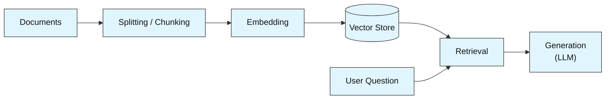
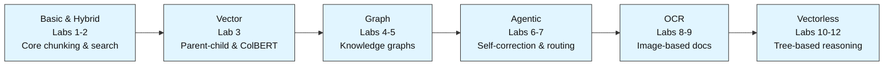

# RAG Labs -- From First Principles to Production Patterns

This module teaches Retrieval-Augmented Generation (RAG) from first principles through thirteen hands-on labs, organized into six thematic tracks. Each track tackles a different family of RAG techniques -- from basic chunking and hybrid search, through knowledge graphs and agentic workflows, all the way to vectorless and OCR-based retrieval. No single lab assumes you've done all the others, but each track builds on concepts introduced earlier in its own sequence.

Most labs download a PDF automatically at runtime, so you don't need to supply your own documents to get started. A few labs require a free cloud account (Qdrant, Neo4j Aura, or MongoDB Atlas) -- those steps are covered in Section 8. This README first explains what RAG is and how it works, then walks through the environment setup, and finally lays out how the labs are organized. Read it fully before opening Lab 1.

---

## 1. What Is RAG?

**RAG** stands for **Retrieval-Augmented Generation**. Normally, an LLM answers a question using only what it learned during training. RAG works differently: it first *retrieves* relevant passages from your own documents, then gives those passages to the LLM along with the question, and asks it to answer using only that text.

This keeps the answer grounded in your actual source material instead of the model guessing or making something up -- which is what people call **hallucination**.

> **In one line:** a plain LLM is a closed-book exam. RAG is an open-book exam -- the system looks up the right page before writing the answer.

RAG exists because real-world documents are too large, too numerous, or too frequently updated to be stuffed into a training run. Instead of retraining the model every time the information changes, RAG plugs a search step in front of the model so it can look up what it needs, right now, from your own files.

---

## 2. Core Building Blocks

Every RAG pipeline, regardless of its complexity, is built from the same five pieces:



### 2.1 Documents (the raw source)

Any file you want the LLM to be able to answer questions about -- a PDF, a set of web pages, a scanned invoice, a financial report. This is the starting material for everything that follows.

### 2.2 Chunking (splitting into searchable pieces)

A whole document is too large to hand to an LLM or to search through efficiently. Chunking splits it into smaller pieces so each piece represents one complete idea. The choice of chunking strategy is one of the most impactful design decisions in a RAG pipeline:

| Strategy | How it works | Best for |
|----------|-------------|----------|
| Fixed-size | Split every N characters, with overlap | Simple, fast, baseline pipelines |
| Semantic | Split only where the meaning changes between sentences | Conceptually clean, topic-aware chunks |
| Parent-child | Large parent chunks hold context; small child chunks are what actually get searched | Balancing search precision with answer context |
| Layout-aware | Keeps tables and multi-page sections whole (PageIndex) | Financial tables, structured documents |

### 2.3 Embedding (turning text into numbers)

Every chunk is passed through an **embedding model** -- a small neural network -- that converts it into a list of numbers called a **vector**. The vector captures the chunk's *meaning* in a mathematical form so that two chunks about the same topic end up close together in "vector space," even if they use completely different words.

Embedding models come in two flavors:
- **Local / open-source** (e.g., Sentence Transformers, ColBERT) -- run on your machine, no API key needed
- **Cloud-hosted** (e.g., OpenAI, Cohere) -- called via API, require a key

Most labs in this module use a local model by default.

### 2.4 Vector Store (the search index)

A vector store holds every chunk's embedding and answers the question: "given this new vector, which stored chunks are closest in meaning?" This is the search engine that powers retrieval. Vector stores range from a simple in-memory list (fine for a few documents) to dedicated databases like Qdrant, Pinecone, FAISS, or Neo4j's vector index (needed when documents are large or the system must scale).

### 2.5 Retrieval + Generation (the answer step)

When a user asks a question, the question is embedded the same way the chunks were, then the vector store returns the top-matching chunks. Those chunks, along with the question, are sent to an LLM which generates a final answer using only that retrieved text as its source material.

---

## 3. RAG vs. Other Approaches

| Approach | What it does | Limitation |
|----------|-------------|-----------|
| **Plain LLM** | Answers from training data only | Can't access private or recent documents; hallucinates on niche topics |
| **Fine-tuned LLM** | Trains the model on your data | Expensive, slow to update, still doesn't guarantee factual grounding |
| **RAG** | Retrieves relevant chunks, then generates | Retrieval quality directly limits answer quality |
| **Hybrid RAG** | Combines meaning-based (dense) and keyword-based (sparse) retrieval | More complex to tune; both retrievers must be configured |
| **Graph RAG** | Uses a knowledge graph to walk relationships | Requires building and maintaining a graph from source documents |
| **Vectorless RAG** | Replaces vectors with LLM-based tree traversal | Depends on a good document tree; no vector search at all |

### 3.1 Dense vs. Sparse Retrieval

The two most fundamental retrieval strategies are worth understanding separately:

- **Dense retrieval** embeds both the question and every chunk into vectors and finds the closest by meaning. It catches synonyms and paraphrases but can miss exact keywords.
- **Sparse retrieval** (e.g., BM25) scores chunks by how many exact keywords they share with the question. It catches exact terms and codes but misses paraphrases.

**Hybrid retrieval** runs both and combines their results -- the strengths of one cover the weaknesses of the other.

---

## 4. Key Concepts

### 4.1 Semantic Chunking

Instead of splitting text every N characters, semantic chunking compares the meaning of each sentence to its neighbors and only starts a new chunk where the topic clearly shifts. This keeps each chunk as one complete idea.

### 4.2 Knowledge Graphs

A **knowledge graph** stores information as nodes (entities) and edges (relationships) rather than as flat text chunks. When a question depends on following a chain of connections -- "A causes B, B relates to C" -- a graph traversal can walk those edges directly, something a plain vector search would miss.

### 4.3 Agentic RAG (Self-Correction)

A standard RAG pipeline moves in a straight line: retrieve, then answer. An **agentic** pipeline adds a loop: after retrieving, a grading step checks whether the retrieved chunks are actually useful. If they aren't, the question is rewritten and retrieval is retried -- up to a set number of times. This is what turns a pipeline into an *agent*: something that can evaluate its own progress and decide what to do next.

### 4.4 Multi-Vector Retrieval

The trade-off between chunk size and search precision can be solved by using two different chunk sizes for two different jobs: small chunks for searching, large chunks for answering. A parent-child system stores large parent chunks (full context) separately, while embedding only small child chunks and summaries for search. The retriever finds the best child or summary, then swaps it for the corresponding parent before handing it to the LLM.

### 4.5 ColBERT and Late Interaction

Instead of compressing an entire chunk into a single vector, ColBERT keeps **one vector per token**. At search time, every query token is compared to every document token using **MaxSim** -- each query token picks its best-matching document token, and those best scores are added together. This preserves fine-grained, word-level precision that single-vector methods blur away.

### 4.6 OCR + RAG

Documents that exist only as images (scanned invoices, receipts, photos of printed text) can't be embedded directly. **OCR** (Optical Character Recognition) extracts the text first, preserving layout where possible, so it can be chunked and embedded like any other document.

---

## 5. Real-World Use Cases

| Use Case | RAG Variant Used | Why It Fits |
|----------|-----------------|-------------|
| Chatting with company documents | Basic / Hybrid RAG | Grounded answers, reduced hallucination |
| Financial table lookup | Vectorless RAG (layout-aware) | Keeps tables whole; exact numbers without guessing |
| Invoice / receipt querying | OCR + RAG | Turns image-based documents into searchable text |
| Multi-hop research questions | Vectorless RAG (multi-hop) | Collects facts from multiple sections before answering |
| Policy document Q&A | Vectorless RAG (tree-based) | Structured documents suit tree traversal |
| Concept-heavy PDFs | Graph RAG | Relationships between entities are the answer |
| Mixed question types | Agentic RAG with routing | Automatically picks the right retrieval strategy |

---

## 6. When RAG Isn't the Right Fit

- **Extremely short documents** -- if the document is a single paragraph, there's nothing to chunk and retrieve; just pass the whole thing to the LLM directly.
- **Questions requiring reasoning over the entire corpus at once** -- some tasks (like summarizing every document in a collection) need the full text, not a retrieved subset.
- **Real-time, sub-millisecond latency requirements** -- the retrieval step adds latency that an in-memory fine-tuned model avoids, though this is increasingly negligible with modern vector stores.
- **Highly structured, relational data** -- data that lives naturally in a relational database (transactions, inventory, user accounts) is often better queried with SQL than with semantic search.

The practical guidance: RAG is a strong default when your LLM needs to answer questions about documents it wasn't trained on -- not a universal replacement for every information-retrieval pattern.

---

## 7. Glossary

| Term | Meaning |
|------|---------|
| RAG | Retrieval-Augmented Generation -- retrieving relevant chunks before generating an answer |
| Chunk | A small piece of a document, split from a larger file so it can be embedded and searched |
| Embedding | A vector of numbers that represents the meaning of a piece of text |
| Vector Store | A database that holds embeddings and finds the closest match to a new query vector |
| Dense Retrieval | Finding chunks by vector similarity (meaning-based) |
| Sparse Retrieval | Finding chunks by keyword overlap (e.g., BM25) |
| Hybrid Retrieval | Running dense and sparse retrieval together and fusing the results |
| Knowledge Graph | A network of nodes (entities) and edges (relationships) used for structured retrieval |
| Agentic RAG | A RAG pipeline with a self-correction loop that evaluates and retries retrieval |
| ColBERT | A token-level embedding model using late interaction (MaxSim) instead of single-vector search |
| MaxSim | ColBERT's scoring method: each query token picks its best document token match, then scores are summed |
| OCR | Optical Character Recognition -- extracting text from images |
| Semantic Chunking | Splitting text only where the meaning changes between sentences |
| Parent-Child Retrieval | Embedding small chunks for search but returning large parent chunks for context |
| Layout-Aware Extraction | Parsing documents by page structure (tables, sections) rather than fixed text size |
| PageIndex | A tool that parses PDFs into a hierarchical tree of sections, tables, and text |
| LangGraph | A library for building agentic workflows as branching, looping graphs |
| Cypher | The query language used by Neo4j to interact with a knowledge graph |
| FAISS | Facebook AI Similarity Search -- a library for fast in-memory vector search |
| Qdrant | A dedicated vector database supporting both dense and multi-vector search |
| Neo4j | A graph database for storing and querying networks of nodes and relationships |

---

## 8. Environment Setup -- Required Before You Start

Different labs require different external services. The table below summarizes what's needed so you can set up only what you plan to use. Every lab that calls an LLM or embedding API requires at least one set of credentials.

### 8.1 API Keys (all labs that use an LLM)

| Credential | Where to get it | Used by |
|-----------|----------------|---------|
| **OpenAI API Key** | `platform.openai.com` | Agentic RAG, Graph RAG (NetworkX), MultiVector RAG, OCR RAG (Lab 1), Hybrid RAG, LLM-Wiki (via OpenRouter) |
| **OpenRouter API Key** | `openrouter.ai` | OCR RAG (Lab 2), any lab using OpenRouter as a proxy |
| **AWS Bedrock Credentials** (Access Key, Secret Key, Endpoint URL, Region) | AWS Console -> IAM -> Security Credentials | Vectorless RAG (all 3 labs), LLM-Wiki |

Create a `.env` file in the `RAG-Labs/` root with whichever keys you need:
```
OPENAI_API_KEY=sk-...
OPENROUTER_API_KEY=sk-or-...
AWS_ACCESS_KEY_ID=...
AWS_SECRET_ACCESS_KEY=...
AWS_BEDROCK_ENDPOINT_URL=https://...
AWS_REGION=us-east-1
```

### 8.2 Cloud Database Accounts (specific labs only)

| Service | Free tier | Used by | Setup |
|---------|----------|---------|-------|
| **Qdrant Cloud** | Yes (1 GB) | MultiVector RAG (both labs) | Sign up at `cloud.qdrant.io` -> create a cluster -> copy URL + API key into `.env` as `QDRANT_URL` and `QDRANT_API_KEY` |
| **Neo4j Aura** | Yes (50 GB, 1 project) | Graph RAG (Lab 2), Agentic RAG (Lab 2), Graph-and-Vector | Sign up at `neo4j.com/cloud/aura-free` -> create an instance -> copy URI, username, password into `.env` as `NEO4J_URI`, `NEO4J_USERNAME`, `NEO4J_PASSWORD` |
| **PageIndex API Key** | Varies | Vectorless RAG (all 3 labs) | Sign up at `pageindex.ai` -> copy API key into `.env` as `PAGEINDEX_API_KEY` |

### 8.3 Local Setup

Most embedding models (Sentence Transformers, ColBERT) and OCR libraries (RapidOCR, PyMuPDF) are downloaded automatically on first use. No extra setup is needed beyond running the `!pip install` cell at the top of each notebook.

**That's the whole flow.** Each notebook handles its own `!pip install` cell and credential loading. As long as your `.env` file exists in `RAG-Labs/` with the relevant keys, every lab connects on its own.

---

## 9. Module Roadmap

### 9.1 Lab Sequence

The thirteen labs are organized into six thematic tracks. Within each track, labs progress from foundational to advanced.



| # | Track | Lab | Concept Title | Level | What You Learn |
|---|-------|-----|--------------|-------|----------------|
| 1 | Basic & Hybrid | HybridRAG | Hybrid RAG (Dense + Sparse) with Semantic Chunking | Beginner | Dense vs. sparse retrieval, reciprocal rerank fusion, semantic chunking, BM25, FAISS |
| 2 | OCR | OCR-RAG Lab 1 | Structured OCR + RAG Chatbot with RapidOCR and Gemini | Beginner | Layout-preserving OCR, document-level embeddings, source-tagged answers |
| 3 | Vector | MultiVector Lab 1 | Parent-Child & Summary-Based Multi-Vector RAG | Intermediate | Parent/child chunk architecture, LLM-generated summaries, Qdrant multi-collection indexing |
| 4 | Graph | Graph-RAG Lab 1 | End-to-End Generalized Graph RAG | Intermediate | LLM-based entity extraction, NetworkX knowledge graphs, graph traversal, explainability traces |
| 5 | Graph | Graph-RAG Lab 2 | End-to-End Graph RAG with Neo4j | Intermediate | Neo4j database, Cypher queries, persistent knowledge graphs, visual graph exploration |
| 6 | Vectorless | Vectorless-RAG Lab 1 | Vectorless RAG: Reasoning-Based Retrieval without Embeddings | Intermediate | PageIndex tree-based parsing, LLM-driven section selection, no-vector retrieval |
| 7 | OCR | OCR-RAG Lab 2 | Automated Document Q&A with OCR + RAG (OpenRouter) | Intermediate | Scanned PDF chunking, FAISS vector database, multi-chunk retrieval with explainability |
| 8 | Vectorless | Vectorless-RAG Lab 2 | Vectorless RAG: Multi-Hop Retrieval with Explainability | Advanced | Multi-section traversal, cumulative fact gathering, explainability tracking per section |
| 9 | Basic & Hybrid | LLM-Wiki | Automated Ingestion: Structured Knowledge Base (LLM Wiki + OKF) | Advanced | LLM-driven PDF-to-file ingestion, index-based retrieval, structured knowledge base building |
| 10 | Vector | MultiVector Lab 2 | ColBERT & Late Interaction RAG | Advanced | Token-level embeddings, MaxSim scoring, late interaction search, Qdrant multivector collections |
| 11 | Graph | Graph-and-Vector | Hybrid RAG: Vector Search + Graph Traversal on Neo4j | Advanced | Vector-indexed graph nodes, dual-mode retrieval (vector + Cypher), combined scoring |
| 12 | Agentic | Agentic-RAG Lab 1 | Agentic RAG with Self-Correction | Advanced | LangGraph agent loops, retrieval grading, question rewriting, retry logic |
| 13 | Agentic | Agentic-RAG Lab 2 | Agentic Hybrid RAG with Dynamic Routing | Advanced | Multi-tool routing, tool-swap fallback, combined graph + vector agent pipeline |

### 9.2 Repository Structure

Each track lives in its own folder inside `RAG-Labs/`. Inside each folder, each lab has a notebook (`.ipynb`) and a markdown write-up (`.md`).

```
RAG-Labs/
├── Agentic-RAG/
│   ├── agentic_lab_1.ipynb        # Lab 12: self-correcting agent
│   ├── agentic_lab_1.md
│   ├── agentic_lab_2.ipynb        # Lab 13: dynamic routing agent
│   └── agentic_lab_2.md
├── Graph-and-Vector/
│   ├── vector_graph_hybrid.ipynb  # Lab 11: vector + graph on Neo4j
│   └── vector_graph_hybrid.md
├── Graph-RAG/
│   ├── graph_rag_1.ipynb          # Lab 4: NetworkX knowledge graph
│   ├── graph_rag_1.md
│   ├── graph_rag_2.ipynb          # Lab 5: Neo4j knowledge graph
│   └── graph_rag_2.md
├── HybridRAG/
│   ├── data/
│   │   └── sample_text_document.pdf
│   ├── lab.ipynb                  # Lab 1: hybrid dense+sparse retrieval
│   └── lab.md
├── LLM-Wiki/
│   ├── data/
│   │   └── SunFactSheet.pdf
│   ├── llm_wiki.ipynb             # Lab 9: structured knowledge base
│   └── llm_wiki.md
├── MultiVector-RAG/
│   ├── lab1_langchain.ipynb       # Lab 3: parent-child + summary RAG
│   ├── lab1_langchain.md
│   ├── lab2_colbert.ipynb         # Lab 10: ColBERT late interaction
│   └── lab2_colbert.md
├── OCR-RAG/
│   ├── Lab 1/
│   │   ├── rag_ocr_lab.ipynb      # Lab 2: OCR + Gemini chatbot
│   │   └── rag_ocr_lab.md
│   └── Lab 2/
│       ├── ocr_rag_vision_ai.ipynb # Lab 7: scanned PDF + FAISS
│       └── ocr_rag_vision_ai.md
├── Vectorless-RAG/
│   ├── lab1/
│   │   ├── vectorless_rag.ipynb   # Lab 6: tree-based retrieval
│   │   ├── lab1_vectorless_rag.md
│   │   └── requirements.txt
│   ├── lab2/
│   │   ├── vectorless_rag_advanced_1.ipynb # Lab 8: multi-hop retrieval
│   │   ├── lab2_vectorless_rag_advanced.md
│   │   └── requirements.txt
│   └── lab3/
│       ├── lab3_table_retrieval_1.ipynb # not yet numbered in roadmap
│       └── lab3.md
└── README.md                      # this file
```

Open the `.ipynb` to run a lab; read the matching `.md` for the full explanation. Some labs (Vectorless-RAG) include a `requirements.txt` -- run `pip install -r requirements.txt` before the notebook if present.

---

## 10. Prerequisites

- **Basic Python** -- variables, dictionaries, lists, loops, `import` statements.
- **One terminal / notebook environment** -- Jupyter, Google Colab, or VS Code with a Python kernel.
- **The relevant API keys and cloud accounts** from Section 8 -- nothing will run without at least one LLM credential.

No prior knowledge of embeddings, vector databases, or RAG itself is required -- the first two labs introduce those concepts from scratch.

---

## 11. Getting Started

1. Complete the relevant parts of Section 8 first -- nothing below works without at least one API key.
2. Start with Lab 1 (HybridRAG) if you're new to RAG -- it introduces all core concepts in one place. Otherwise, jump into whichever track interests you.
3. Run the `!pip install` cell at the top of each notebook before anything else.
4. Refer to the matching `.md` file if a step needs more explanation.
5. If a lab has a `data/` folder, the PDF is already included; if it has a download link in the notebook, it runs automatically.
