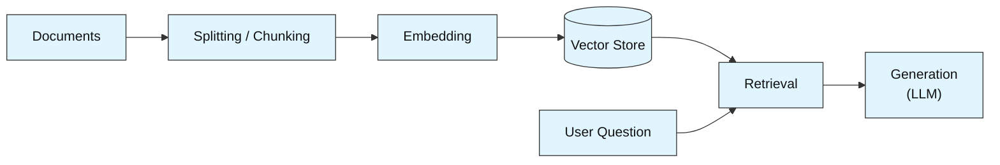
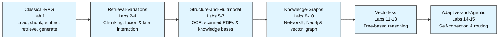

# RAG Labs -- From First Principles to Production Patterns

This module teaches Retrieval-Augmented Generation (RAG) from first principles through fifteen hands-on labs, organized into six sections. Each section tackles a different family of RAG techniques -- from the canonical RAG pipeline, through chunking, fusion, and late interaction, OCR and multimodal documents, and knowledge graphs, all the way to vectorless and agentic retrieval. No single lab assumes you've done all the others, but each section builds on concepts introduced earlier in its own sequence.

Most labs download a PDF automatically at runtime, so you don't need to supply your own documents to get started. A few labs require a free cloud account (Qdrant, Neo4j Aura, or MongoDB Atlas) -- those steps are covered in Section 8. This README first explains what RAG is and how it works, then walks through the environment setup, and finally lays out how the labs are organized. Read it fully before opening Lab 1.

---

## 1. What Is RAG?

**RAG** stands for **Retrieval-Augmented Generation**. Normally, an LLM answers a question using only what it learned during training. RAG works differently: it first *retrieves* relevant passages from your own documents, then gives those passages to the LLM along with the question, and asks it to answer using only that text.

This keeps the answer grounded in your actual source material instead of the model guessing or making something up -- which is what people call **hallucination**.

> **In one line:** a plain LLM is a closed-book exam. RAG is an open-book exam -- the system looks up the right page before writing the answer.

RAG exists because real-world documents are too large, too numerous, or too frequently updated to be stuffed into a training run. Instead of retraining the model every time the information changes, RAG plugs a search step in front of the model so it can look up what it needs, right now, from your own files.

---

## 2. Core Building Blocks

Every RAG pipeline, regardless of its complexity, is built from the same five pieces:


```mermaid
flowchart LR
    D["Documents"] --> SP["Splitting / Chunking"]
    SP --> E["Embedding"]
    E --> V[("Vector Store")]
    V --> R["Retrieval"]
    R --> G["Generation<br/>(LLM)"]
    Q["User Question"] --> R

    classDef defaultStyle fill:#e1f5ff,stroke:#333333,stroke-width:1px,color:#111111
    class D,SP,E,V,R,G,Q defaultStyle
```

### 2.1 Documents (the raw source)

Any file you want the LLM to be able to answer questions about -- a PDF, a set of web pages, a scanned invoice, a financial report. This is the starting material for everything that follows.

### 2.2 Chunking (splitting into searchable pieces)

A whole document is too large to hand to an LLM or to search through efficiently. Chunking splits it into smaller pieces so each piece represents one complete idea. The choice of chunking strategy is one of the most impactful design decisions in a RAG pipeline:

| Strategy | How it works | Best for |
|----------|-------------|----------|
| Fixed-size | Split every N characters, with overlap | Simple, fast, baseline pipelines |
| Semantic | Split only where the meaning changes between sentences | Conceptually clean, topic-aware chunks |
| Parent-child | Large parent chunks hold context; small child chunks are what actually get searched | Balancing search precision with answer context |
| Layout-aware | Keeps tables and multi-page sections whole (PageIndex) | Financial tables, structured documents |

### 2.3 Embedding (turning text into numbers)

Every chunk is passed through an **embedding model** -- a small neural network -- that converts it into a list of numbers called a **vector**. The vector captures the chunk's *meaning* in a mathematical form so that two chunks about the same topic end up close together in "vector space," even if they use completely different words.

Embedding models come in two flavors:
- **Local / open-source** (e.g., Sentence Transformers, ColBERT) -- run on your machine, no API key needed
- **Cloud-hosted** (e.g., OpenAI, Cohere) -- called via API, require a key

Most labs in this module use a local model by default.

### 2.4 Vector Store (the search index)

A vector store holds every chunk's embedding and answers the question: "given this new vector, which stored chunks are closest in meaning?" This is the search engine that powers retrieval. Vector stores range from a simple in-memory list (fine for a few documents) to dedicated databases like Qdrant, Pinecone, FAISS, or Neo4j's vector index (needed when documents are large or the system must scale).

### 2.5 Retrieval + Generation (the answer step)

When a user asks a question, the question is embedded the same way the chunks were, then the vector store returns the top-matching chunks. Those chunks, along with the question, are sent to an LLM which generates a final answer using only that retrieved text as its source material.

---

## 3. RAG vs. Other Approaches

| Approach | What it does | Limitation |
|----------|-------------|-----------|
| **Plain LLM** | Answers from training data only | Can't access private or recent documents; hallucinates on niche topics |
| **Fine-tuned LLM** | Trains the model on your data | Expensive, slow to update, still doesn't guarantee factual grounding |
| **RAG** | Retrieves relevant chunks, then generates | Retrieval quality directly limits answer quality |
| **Hybrid RAG** | Combines meaning-based (dense) and keyword-based (sparse) retrieval | More complex to tune; both retrievers must be configured |
| **Graph RAG** | Uses a knowledge graph to walk relationships | Requires building and maintaining a graph from source documents |
| **Vectorless RAG** | Replaces vectors with LLM-based tree traversal | Depends on a good document tree; no vector search at all |

### 3.1 Dense vs. Sparse Retrieval

The two most fundamental retrieval strategies are worth understanding separately:

- **Dense retrieval** embeds both the question and every chunk into vectors and finds the closest by meaning. It catches synonyms and paraphrases but can miss exact keywords.
- **Sparse retrieval** (e.g., BM25) scores chunks by how many exact keywords they share with the question. It catches exact terms and codes but misses paraphrases.

**Hybrid retrieval** runs both and combines their results -- the strengths of one cover the weaknesses of the other.

---

## 4. Key Concepts

### 4.1 Semantic Chunking

Instead of splitting text every N characters, semantic chunking compares the meaning of each sentence to its neighbors and only starts a new chunk where the topic clearly shifts. This keeps each chunk as one complete idea.

### 4.2 Knowledge Graphs

A **knowledge graph** stores information as nodes (entities) and edges (relationships) rather than as flat text chunks. When a question depends on following a chain of connections -- "A causes B, B relates to C" -- a graph traversal can walk those edges directly, something a plain vector search would miss.

### 4.3 Agentic RAG (Self-Correction)

A standard RAG pipeline moves in a straight line: retrieve, then answer. An **agentic** pipeline adds a loop: after retrieving, a grading step checks whether the retrieved chunks are actually useful. If they aren't, the question is rewritten and retrieval is retried -- up to a set number of times. This is what turns a pipeline into an *agent*: something that can evaluate its own progress and decide what to do next.

### 4.4 Multi-Vector Retrieval

The trade-off between chunk size and search precision can be solved by using two different chunk sizes for two different jobs: small chunks for searching, large chunks for answering. A parent-child system stores large parent chunks (full context) separately, while embedding only small child chunks and summaries for search. The retriever finds the best child or summary, then swaps it for the corresponding parent before handing it to the LLM.

### 4.5 ColBERT and Late Interaction

Instead of compressing an entire chunk into a single vector, ColBERT keeps **one vector per token**. At search time, every query token is compared to every document token using **MaxSim** -- each query token picks its best-matching document token, and those best scores are added together. This preserves fine-grained, word-level precision that single-vector methods blur away.

### 4.6 OCR + RAG

Documents that exist only as images (scanned invoices, receipts, photos of printed text) can't be embedded directly. **OCR** (Optical Character Recognition) extracts the text first, preserving layout where possible, so it can be chunked and embedded like any other document.

---

## 5. Real-World Use Cases

| Use Case | RAG Variant Used | Why It Fits |
|----------|-----------------|-------------|
| Chatting with company documents | Basic / Hybrid RAG | Grounded answers, reduced hallucination |
| Financial table lookup | Vectorless RAG (layout-aware) | Keeps tables whole; exact numbers without guessing |
| Invoice / receipt querying | OCR + RAG | Turns image-based documents into searchable text |
| Multi-hop research questions | Vectorless RAG (multi-hop) | Collects facts from multiple sections before answering |
| Policy document Q&A | Vectorless RAG (tree-based) | Structured documents suit tree traversal |
| Concept-heavy PDFs | Graph RAG | Relationships between entities are the answer |
| Mixed question types | Agentic RAG with routing | Automatically picks the right retrieval strategy |

---

## 6. When RAG Isn't the Right Fit

- **Extremely short documents** -- if the document is a single paragraph, there's nothing to chunk and retrieve; just pass the whole thing to the LLM directly.
- **Questions requiring reasoning over the entire corpus at once** -- some tasks (like summarizing every document in a collection) need the full text, not a retrieved subset.
- **Real-time, sub-millisecond latency requirements** -- the retrieval step adds latency that an in-memory fine-tuned model avoids, though this is increasingly negligible with modern vector stores.
- **Highly structured, relational data** -- data that lives naturally in a relational database (transactions, inventory, user accounts) is often better queried with SQL than with semantic search.

The practical guidance: RAG is a strong default when your LLM needs to answer questions about documents it wasn't trained on -- not a universal replacement for every information-retrieval pattern.

---

## 7. Glossary

| Term | Meaning |
|------|---------|
| RAG | Retrieval-Augmented Generation -- retrieving relevant chunks before generating an answer |
| Classical RAG | The canonical pipeline: load a document, chunk it, embed the chunks, store them, retrieve the top matches, and generate a grounded answer |
| Chunk | A small piece of a document, split from a larger file so it can be embedded and searched |
| Embedding | A vector of numbers that represents the meaning of a piece of text |
| Cosine Similarity | A measure of how closely two vectors point in the same direction; used to rank chunks by relevance to a query |
| Top-k Retrieval | Returning the k highest-scoring chunks for a query |
| Vector Store | A database that holds embeddings and finds the closest match to a new query vector |
| Dense Retrieval | Finding chunks by vector similarity (meaning-based) |
| Sparse Retrieval | Finding chunks by keyword overlap (e.g., BM25) |
| Hybrid Retrieval | Running dense and sparse retrieval together and fusing the results |
| Knowledge Graph | A network of nodes (entities) and edges (relationships) used for structured retrieval |
| Agentic RAG | A RAG pipeline with a self-correction loop that evaluates and retries retrieval |
| ColBERT | A token-level embedding model using late interaction (MaxSim) instead of single-vector search |
| MaxSim | ColBERT's scoring method: each query token picks its best document token match, then scores are summed |
| OCR | Optical Character Recognition -- extracting text from images |
| Semantic Chunking | Splitting text only where the meaning changes between sentences |
| Parent-Child Retrieval | Embedding small chunks for search but returning large parent chunks for context |
| Layout-Aware Extraction | Parsing documents by page structure (tables, sections) rather than fixed text size |
| PageIndex | A tool that parses PDFs into a hierarchical tree of sections, tables, and text |
| LangGraph | A library for building agentic workflows as branching, looping graphs |
| Cypher | The query language used by Neo4j to interact with a knowledge graph |
| FAISS | Facebook AI Similarity Search -- a library for fast in-memory vector search |
| Qdrant | A dedicated vector database supporting both dense and multi-vector search |
| Neo4j | A graph database for storing and querying networks of nodes and relationships |

---

## 8. Environment Setup -- Required Before You Start

Different labs require different external services, so set up only what you actually plan to run. There are only two credential families to worry about:

- **OpenRouter** — the LLM used by every lab in this module. One key covers all fifteen labs, and each lab uses a `:free` model, so running them costs nothing.
- **A managed service** — needed only by specific labs: Neo4j Aura (Labs 9, 10, 15), Qdrant Cloud (Labs 3, 4), or PageIndex (Labs 11, 12, 13).

### 8.1 OpenRouter API Key — needed by every lab

All labs call their LLM through [OpenRouter](https://openrouter.ai), which fronts many models behind a single key and offers free tiers. You never need an OpenAI key.

1. Go to [openrouter.ai](https://openrouter.ai) and sign up or log in.
2. Open the dashboard and go to the **Keys** section.
3. Click **Create Key**, name it something like `rag-labs`, and confirm.
4. **Copy the key immediately** — it is shown in full only once.
5. Put it in a `.env` file **inside each lab folder** you intend to run:

```
OPENROUTER_API_KEY=sk-or-v1-...
```

Each lab reads `.env` from its own directory, so a key in `RAG-Labs/` root is not picked up. Every lab's `.gitignore` already excludes `.env`, so your key will not be committed by accident.

### 8.2 Neo4j Aura Free — Labs 9, 10, 15

Neo4j Aura gives you a free cloud graph database with a browser UI you can use to see the graph your lab builds.

1. Go to [console.neo4j.io](https://console.neo4j.io) and sign up or log in.
2. Click **Create instance**, then choose the **Free** plan. No card is required.
3. Wait a minute or two while the instance provisions. The status shows in the instances list.
4. Click the instance, then **Connect** in the sidebar. A credentials dialog appears.
5. Copy each value into the lab's `.env` file:

```
NEO4J_URI=neo4j+s://xxxxxxxx.databases.neo4j.io
NEO4J_USERNAME=neo4j
NEO4J_PASSWORD=<the generated password>
NEO4J_DATABASE=neo4j
```

- `NEO4J_URI` must keep the `neo4j+s://` prefix — that `s` is what enables the encrypted connection Aura requires.
- On Aura Free the username is literally `neo4j` and the database name is also `neo4j`. If you created a custom instance, these differ and the **Connect** dialog shows the right values.
- The password is generated for you. If you lose it, use **Reset password** in the same dialog; you cannot view it later.

You can verify the credentials before running any notebook:

```python
from neo4j import GraphDatabase
driver = GraphDatabase.driver("neo4j+s://xxx.databases.neo4j.io",
                              auth=("neo4j", "your-password"))
driver.verify_connectivity()
print("connected")
driver.close()
```

### 8.3 Qdrant Cloud Free — Labs 3, 4

Qdrant is the vector database for the multi-vector and ColBERT labs. The free tier is 1 GB, which is far more than these labs need.

1. Go to [cloud.qdrant.io](https://cloud.qdrant.io) and sign up or log in.
2. Click **Create new cluster**. Choose the **Free** tier in the region closest to you.
3. Wait for the cluster to finish provisioning.
4. Open the cluster, then go to **API Keys** in the sidebar and click **Create API Key**.
5. Copy the cluster URL and the key into the lab's `.env`:

```
QDRANT_URL=https://your-cluster-id.eu-central.aws.cloud.qdrant.io:6333
QDRANT_API_KEY=...
```

- Keep the `:6333` port at the end of the URL. Without it the client cannot connect.
- Name the key after its lab (e.g. `lab-04`) so you can revoke it independently later.
- Both labs **recreate their collections on every run**, which means anything already in that cluster for those collection names is deleted. Use a dedicated cluster or dedicated collection names if you share one across labs.

### 8.4 PageIndex API Key — Labs 11, 12, 13

PageIndex parses a document into a tree structure, which is what the vectorless labs retrieve over instead of embeddings.

1. Go to [pageindex.ai](https://pageindex.ai) and sign up or log in.
2. Open the dashboard and find the **API Keys** section.
3. Click to create a new key and copy it.
4. Put it in the lab's `.env`:

```
PAGEINDEX_API_KEY=...
```

Labs 11, 12 and 13 also need the OpenRouter key from 8.1, so their `.env` files contain both lines.

### 8.5 What each lab needs

| Lab | OpenRouter | Neo4j | Qdrant | PageIndex |
|-----|-----------|-------|--------|-----------|
| 1. Classical RAG | yes | | | |
| 2. Hybrid RAG | yes | | | |
| 3. Parent-Child Multi-Vector | yes | | yes | |
| 4. ColBERT Late Interaction | yes | | yes | |
| 5. Structured OCR | yes | | | |
| 6. OCR Scanned PDF | yes | | | |
| 7. LLM Wiki | yes | | | |
| 8. Graph RAG (NetworkX) | yes | | | |
| 9. Graph RAG (Neo4j) | yes | yes | | |
| 10. Graph + Vector Hybrid | yes | yes | | |
| 11. Vectorless Reasoning | yes | | | yes |
| 12. Vectorless Multi-Hop | yes | | | yes |
| 13. Vectorless Table Retrieval | yes | | | yes |
| 14. Agentic Self-Correction | yes | | | |
| 15. Agentic Hybrid Routing | yes | yes | | |

### 8.6 Troubleshooting

| Symptom | Cause | Fix |
|---------|-------|-----|
| `AuthenticationError` on any lab | `.env` missing, or in the wrong folder | The file must sit next to the `.ipynb`, not in `RAG-Labs/` |
| `401 Unauthorized` from OpenRouter | Key copied with a trailing space, or revoked | Re-copy the key; make sure no quotes surround it |
| `ServiceUnavailable: 503` or `504` | Free-tier model is overloaded | Re-run the cell. These models recover within seconds |
| `Answer: Empty Response` | Free model returned an empty completion | Re-run the cell; it is transient, not a code bug |
| `ServiceUnavailable: The client is unable to verify that the certificate is valid` (Neo4j) | Aura needs TLS | Use the `neo4j+s://` URI |
| `ConnectTimeout` to `qdrant.io` | Missing `:6333` port | Add it to `QDRANT_URL` |
| Notebook asks for a key interactively | `.env` not found in the lab folder | Create it there; the `input()` prompt is the fallback, not the intended path |

### 8.7 Local Setup

Most embedding models (Sentence Transformers, ColBERT) and OCR libraries (RapidOCR, PyMuPDF) are downloaded automatically on first use. No extra setup is needed beyond running the `!pip install` cell at the top of each notebook.

**That's the whole flow.** Each notebook handles its own `!pip install` cell and credential loading. Create the `.env` file inside the specific lab folder using the sections above, and that lab connects on its own.

---

## 9. Module Roadmap

### 9.1 Lab Sequence

The fifteen labs are organized into six sections. Within each section, labs progress from foundational to advanced.


```mermaid
flowchart LR
    C["Classical-RAG<br/>Lab 1<br/>Load, chunk, embed, retrieve, generate"] --> R["Retrieval-Variations<br/>Labs 2-4<br/>Chunking, fusion &amp; late interaction"]
    R --> S["Structure-and-Multimodal<br/>Labs 5-7<br/>OCR, scanned PDFs &amp; knowledge bases"]
    S --> K["Knowledge-Graphs<br/>Labs 8-10<br/>NetworkX, Neo4j &amp; vector+graph"]
    K --> VL["Vectorless<br/>Labs 11-13<br/>Tree-based reasoning"]
    VL --> A["Adaptive-and-Agentic<br/>Labs 14-15<br/>Self-correction &amp; routing"]

    classDef defaultStyle fill:#e1f5ff,stroke:#333333,stroke-width:1px,color:#111111
    class C,R,S,K,VL,A defaultStyle
```

| # | Section | Lab | Concept Title | Level | What You Learn |
|---|---------|-----|--------------|-------|----------------|
| 1 | Classical-RAG | Classical-RAG | Classical RAG: The Canonical Pipeline | Beginner | Document loading, fixed-size chunking, embeddings (Sentence Transformers), FAISS indexing, cosine similarity, top-k retrieval, grounded generation |
| 2 | Retrieval-Variations | HybridRAG | Hybrid RAG (Dense + Sparse) with Semantic Chunking | Beginner | Dense vs. sparse retrieval, reciprocal rerank fusion, semantic chunking, BM25, FAISS |
| 3 | Retrieval-Variations | MultiVector Lab 1 | Parent-Child & Summary-Based Multi-Vector RAG | Intermediate | Parent/child chunk architecture, LLM-generated summaries, Qdrant multi-collection indexing |
| 4 | Retrieval-Variations | MultiVector Lab 2 | ColBERT & Late Interaction RAG | Advanced | Token-level embeddings, MaxSim scoring, late interaction search, Qdrant multivector collections |
| 5 | Structure-and-Multimodal | OCR-RAG Lab 1 | Structured OCR + RAG Chatbot with RapidOCR and Gemini | Beginner | Layout-preserving OCR, document-level embeddings, source-tagged answers |
| 6 | Structure-and-Multimodal | OCR-RAG Lab 2 | Automated Document Q&A with OCR + RAG (OpenRouter) | Intermediate | Scanned PDF chunking, FAISS vector database, multi-chunk retrieval with explainability |
| 7 | Structure-and-Multimodal | LLM-Wiki | Automated Ingestion: Structured Knowledge Base (LLM Wiki + OKF) | Advanced | LLM-driven PDF-to-file ingestion, index-based retrieval, structured knowledge base building |
| 8 | Knowledge-Graphs | Graph-RAG Lab 1 | End-to-End Generalized Graph RAG | Intermediate | LLM-based entity extraction, NetworkX knowledge graphs, graph traversal, explainability traces |
| 9 | Knowledge-Graphs | Graph-RAG Lab 2 | End-to-End Graph RAG with Neo4j | Intermediate | Neo4j database, Cypher queries, persistent knowledge graphs, visual graph exploration |
| 10 | Knowledge-Graphs | Graph-and-Vector | Hybrid RAG: Vector Search + Graph Traversal on Neo4j | Advanced | Vector-indexed graph nodes, dual-mode retrieval (vector + Cypher), combined scoring |
| 11 | Vectorless | Vectorless-RAG Lab 1 | Vectorless RAG: Reasoning-Based Retrieval without Embeddings | Intermediate | PageIndex tree-based parsing, LLM-driven section selection, no-vector retrieval |
| 12 | Vectorless | Vectorless-RAG Lab 2 | Vectorless RAG: Multi-Hop Retrieval with Explainability | Advanced | Multi-section traversal, cumulative fact gathering, explainability tracking per section |
| 13 | Vectorless | Vectorless-RAG Lab 3 | Vectorless RAG: Structured Table Retrieval with Explainability | Intermediate | Table-preserving PageIndex parsing, per-figure citation tags, explainability checks |
| 14 | Adaptive-and-Agentic | Agentic-RAG Lab 1 | Agentic RAG with Self-Correction | Advanced | LangGraph agent loops, retrieval grading, question rewriting, retry logic |
| 15 | Adaptive-and-Agentic | Agentic-RAG Lab 2 | Agentic Hybrid RAG with Dynamic Routing | Advanced | Multi-tool routing, tool-swap fallback, combined graph + vector agent pipeline |

### 9.2 Repository Structure

The repository mirrors the Table of Contents: one folder per section, and inside each section one numbered folder per lab (`lab-NN-<slug>/`). Each lab folder holds everything for that lab -- the notebook (`.ipynb`), the markdown write-up (`.md`), the matching `lab-<slug>-assignment.md` practice sheet, rendered `.html` versions of both, and any `data/` or `requirements.txt` it needs.

```
RAG-Labs/
├── section-1-classical-rag/
│   └── lab-01-classical-rag/               # Lab 1: canonical RAG pipeline
├── section-2-retrieval-variations/
│   ├── lab-02-hybrid-rag/                  # Lab 2: dense + sparse, semantic chunking
│   ├── lab-03-multivector-parent-child/    # Lab 3: parent-child + summary multi-vector
│   └── lab-04-colbert-late-interaction/    # Lab 4: ColBERT / MaxSim
├── section-3-structure-and-multimodal/
│   ├── lab-05-structured-ocr-rag/          # Lab 5: RapidOCR + Gemini chatbot
│   ├── lab-06-ocr-scanned-pdf-rag/         # Lab 6: scanned PDF + FAISS
│   └── lab-07-llm-wiki/                    # Lab 7: LLM Wiki + OKF knowledge base
├── section-4-knowledge-graphs/
│   ├── lab-08-graph-rag-networkx/          # Lab 8: generalized Graph RAG
│   ├── lab-09-graph-rag-neo4j/             # Lab 9: Graph RAG on Neo4j
│   └── lab-10-graph-vector-hybrid/         # Lab 10: vector + graph on Neo4j
├── section-5-vectorless/
│   ├── lab-11-vectorless-reasoning-retrieval/   # Lab 11
│   ├── lab-12-vectorless-multihop/              # Lab 12
│   └── lab-13-vectorless-table-retrieval/       # Lab 13
├── section-6-adaptive-and-agentic/
│   ├── lab-14-agentic-rag-self-correction/ # Lab 14: LangGraph self-correction
│   └── lab-15-agentic-hybrid-routing/      # Lab 15: dynamic routing
├── section-7-capstone/
│   └── lab-16-agentic-research-assistant/  # Capstone: 8-document design-and-build spec
├── learnyst-html/                          # publish-ready bundle, grouped by section (NN-lab.html / NN-assignment.html)
├── RAG-Labs-Table-of-Contents.html         # course table of contents
├── MOVE_MAP.md                             # old -> new path for every moved lab
└── README.md                               # this file
```

Open the `.ipynb` inside a lab folder to run it; read the matching `.md` for the full explanation. Section folders are numbered 1-6 (plus 7 for the capstone) in the same order as the TOC, and `learnyst-html/` uses the same section names, numbered sequentially 01-15. Some labs (Vectorless) include a `requirements.txt` -- run `pip install -r requirements.txt` before the notebook if present.

---

## 10. Prerequisites

- **Basic Python** -- variables, dictionaries, lists, loops, `import` statements.
- **One terminal / notebook environment** -- Jupyter, Google Colab, or VS Code with a Python kernel.
- **The relevant API keys and cloud accounts** from Section 8 -- nothing will run without at least one LLM credential.

No prior knowledge of embeddings, vector databases, or RAG itself is required -- the first lab (Classical RAG) introduces the whole pipeline from scratch, and the labs that follow build on it.

---

## 11. Getting Started

1. Complete the relevant parts of Section 8 first -- nothing below works without at least one API key.
2. Start with Lab 1 (Classical RAG) if you're new to RAG -- it introduces the full load -> chunk -> embed -> retrieve -> generate pipeline in one place. Lab 2 (HybridRAG) builds directly on it. Otherwise, jump into whichever section interests you.
3. Run the `!pip install` cell at the top of each notebook before anything else.
4. Refer to the matching `.md` file if a step needs more explanation.
5. If a lab has a `data/` folder, the PDF is already included; if it has a download link in the notebook, it runs automatically.
