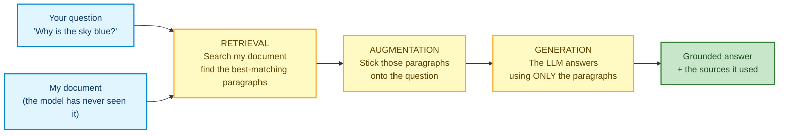
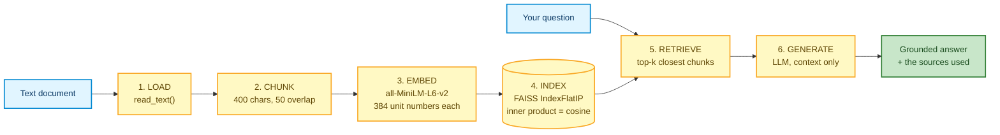

# Classical RAG: The Canonical Pipeline

---

# Problem Statement / Use Case Overview

## The problem

A restoration team has a guide on wetland restoration and needs to answer questions about it without reading it by hand. A plain LLM cannot help — it has never seen this document, so it makes things up. You will build a pipeline that finds the right paragraphs first, then answers using only those paragraphs.

## What RAG actually is

Suppose you need to answer a question from a document. The reliable way is not to recall it from memory — it is to **open the document, find the relevant passage, and answer from that passage.**

That is RAG:

1. You get a question.
2. You **search the document** and **find the passage** that answers it.
3. You **hand that passage to an LLM**, which writes the answer using only that text.

An LLM on its own does something different. It answers from whatever it memorised during training, and it has **never seen your document**, your handbook, or your notes. So when you ask it about your document it does one of two things:

- it says **"I don't know"**, or
- it **makes something up** that sounds right.

That second failure mode is called a **hallucination**, and it is the biggest practical problem with plain LLMs.

**RAG** = **R**etrieval-**A**ugmented **G**eneration. In plain words:

> **Find the right passage in your documents first, then answer using only that passage.**

That is the whole idea. Everything else in this lab is the plumbing that makes those three words happen.



Read that diagram as a story: the question and the document both point into **Retrieval**, retrieval feeds **Augmentation**, augmentation feeds **Generation**, and the result is a grounded answer.

## Why this matters in real life

- **Private documents** — contracts, manuals, research papers, internal wikis, your own notes. The model was never trained on them.
- **Answers you can check** — the lab prints the exact paragraphs behind every answer, so you can verify instead of trusting.
- **No retraining** — you drop in a new document and it works. You do not fine-tune anything.

## What this lab builds

The **plainest possible** version of RAG, using LangChain so the code stays short and readable. Six stages, one straight line, no loops and no decision-making:

1. **Load** — read the text out of the file.
2. **Chunk** — cut the text into small overlapping pieces.
3. **Embed** — turn each piece into a list of numbers.
4. **Index** — store those numbers so they can be searched.
5. **Retrieve** — find the pieces closest to the question.
6. **Generate** — hand those pieces to the LLM and get a grounded answer.

This is deliberately the **baseline**. Every later lab in this module changes exactly one of these six stages — a smarter chunker, a second retriever, a graph instead of a flat index, or a loop that double-checks the retriever. You cannot judge those upgrades until you have felt this one's limits yourself.

---

# Input Data

| Item | Detail |
|------|--------|
| **The document** | `data/sample_text_document.txt` — a short synthetic guide to coastal wetland restoration, shipped with the lab. Deliberately small (2 pages, 4,062 characters) so you can read the chunks yourself and judge whether retrieval got it right. Plain text, with a form-feed (`\f`) character marking the page break. An identical `.pdf` twin sits in the same folder if you want to compare loaders. |
| **Your question** | A natural-language question about the document. The default `QUESTION` asks why restoration teams reintroduce tidal flow gradually rather than all at once. Step 7 also asks a deliberately **unanswerable** question, to show you what a genuinely bad match looks like. |
| **Embedding model** | `all-MiniLM-L6-v2`, run locally on your own machine via `langchain-huggingface`. Downloads once (~90 MB), needs no API key, produces 384 numbers per chunk. |
| **LLM API key** | OpenRouter, used **only** for the final answer in Step 5. Every other step runs offline for free. |

---

# Processing

The pipeline is a straight line. Data flows in one direction, and each stage transforms whatever the previous stage produced.

### Stage 1 — Load

Reading a `.txt` file needs no library at all — `Path.read_text()` is the entire loader. What we *do* need is the object every RAG system passes around, and LangChain calls it a **`Document`**: a small wrapper holding two things, the **text** (`page_content`) and a small dictionary of **metadata** (`metadata`) — which page it came from, the file name, and so on.

So Stage 1 is really two jobs: read the string, then wrap it in `Document` objects. We build one per "page", splitting on `\f` — the ASCII **form feed** character, which is the traditional page break in plain text. That metadata is the reason a retrieved chunk can later tell you *which page* it came from.

The payoff of starting from a text file: every later stage is byte-identical to what it would be with a PDF, and none of the five stages has to care what format the document arrived in.

### Stage 2 — Chunk

One 4,000-character string is too big to search well and too big to paste into a prompt. `RecursiveCharacterTextSplitter` cuts it into pieces of about **400 characters**, each one starting **50 characters** before the previous one ended.

Two details worth knowing:

- **"Recursive"** means it tries to cut *nicely*: first at paragraph breaks (`\n\n`), then line breaks (`\n`), then sentences, and only as a last resort mid-word. It avoids the ugly cuts that a naive slicer produces.
- **Overlap** exists because meaning does not respect a fixed boundary. If a sentence would be sliced in half, the overlap keeps it whole in at least one of the two neighbouring chunks.

### Stage 3 — Embed

Each chunk is passed through `all-MiniLM-L6-v2`, which returns a **384-number vector** for it. The name for that vector is an **embedding**, and the trick it performs is turning *meaning* into *geometry*: texts that mean similar things end up pointing in similar directions.

Every vector this model returns is already **unit length** — each one is a direction, not a magnitude. We state that requirement explicitly with `normalize_embeddings=True` rather than relying on it happening by default, because the next stage depends on it.

### Stage 4 — Index

`FAISS.from_documents` does Stage 3 and Stage 4 together in a single call: it embeds every chunk, then stores all 13 vectors in a **FAISS** index. FAISS is a free library for searching vectors.

The measurement is chosen with `distance_strategy=DistanceStrategy.MAX_INNER_PRODUCT`, which builds a FAISS **`IndexFlatIP`** — a plain list of every vector, compared against your question by **inner product**, exactly. And because all the vectors are unit length, inner product *is* cosine similarity, so the number FAISS hands back can be read directly as "how similar are these two texts".

> **This is the one setting in the lab worth reading twice.** LangChain also offers a strategy literally named `COSINE`. On this version of `langchain-community` it quietly builds an `IndexFlatL2` instead and returns **squared straight-line distance** — a different number entirely, whose direction is *opposite* (lower is better). Section 7 works through why that trips people up.

### Stage 5 — Retrieve

The question is embedded by the **same model** — this is not optional, see Section 7 — and FAISS returns the `k` highest-scoring chunks. Higher score means closer in meaning, and with unit vectors the score is a cosine: **1** means identical direction, **0** means unrelated, **-1** means opposite.

### Stage 6 — Generate

The retrieved chunks are pasted into a prompt under one hard instruction — *answer using only this context* — and sent to the LLM. That instruction is what **grounds** the answer: the model is now summarising evidence you supplied instead of recalling training data.



Follow the arrows: the document takes the left path down to the index, the question takes the short path to retrieval, they meet at retrieval, and the result flows out to the right.

---

# Output

Everything below is **real output** from running this notebook end to end.

The setup cells print what they loaded as each piece comes up:

```
API key loaded.
LLM ready: nvidia/nemotron-3-ultra-550b-a55b:free
Embedding model ready: 384 numbers per chunk
```

**Step 1** confirms the document was read and how much text came out:

```
Loaded 2 page(s), 4,062 characters.
```

**Step 2** reports how many chunks that text became, and prints the first one in full so you can see where the cut landed:

```
Created 13 chunks (400 chars, 50 overlap).

First chunk:
A Short Guide to Coastal Wetland Restoration
Synthetic Sample Document — Original Content, No Copyright Restrictions
1. Introduction
Coastal wetlands sit at the boundary between land and sea, absorbing storm surge, filtering runoff, and
providing nursery habitat for fish and shellfish. Over the past century, many of these ecosystems have
```

Notice what the "recursive" part bought us: the chunk ends at a paragraph edge, not in the middle of the word "have".

**Step 3** confirms every chunk reached the index:

```
Chunks indexed: 13
Numbers per vector: 384
Index type: IndexFlatIP
```

That last line is the one worth checking every run. It confirms the index really is an inner-product index, so the scores in the next step mean what we said they mean. Had it printed `IndexFlatL2`, the numbers below would have been distances in the opposite direction.

**Step 4** prints the question and the top 3 chunks. The top hit is the section that literally answers the question, which is exactly what a healthy retriever looks like:

```
QUESTION: Why do restoration teams reintroduce tidal flow gradually instead of all at once?

--- Chunk 1 | page 0 | match 0.771 ---
3. Reintroducing Tidal Flow
Once barriers are addressed, restoration teams usually reintroduce tidal flow gradually rather than all at
once. A sudden full breach can erode unconsolidated fill material before vegetation has a chance to
stabilize the soil. Phased approaches might open a small channel first, monitor erosion and sediment

--- Chunk 2 | page 0 | match 0.626 ---
tide gates installed decades earlier for agricultural drainage. Removing or resizing these structures is often
the single most effective step in a restoration project, since it allows the natural rise and fall of the tide to
resume moving sediment, nutrients, and organisms in and out of the site.
3. Reintroducing Tidal Flow

--- Chunk 3 | page 0 | match 0.485 ---
been drained, filled, or cut off from tidal flow to make way for farmland, roads, and coastal development.
This guide summarizes the general principles behind restoring a degraded wetland to a functioning tidal
system, written as a plain-text reference document for testing purposes.
2. Assessing the Site
```

Read those three scores carefully, because they are the whole lesson:

- **0.771** — Chunk 1 is the right section: the sentence that answers the question lives here.
- **0.626** — Chunk 2 is about tide gates. Same topic, different point.
- **0.485** — Chunk 3 is the introduction. Retrieved anyway.

Look closely at Chunk 3: its score is **positive**, and it is the *worst* of the three, and it still **does not answer the question**. That is the real lesson of this lab. Every score here looks respectable, and only one of them is actually useful. **A cosine score measures how similar two texts sound — not whether they answer your question.**

**Step 5** prints the generated answer. Because the prompt forbids outside knowledge, the model copies its reasoning out of the retrieved chunks rather than out of its training:

```
Question: Why do restoration teams reintroduce tidal flow gradually instead of all at once?

Answer: Restoration teams reintroduce tidal flow gradually because a sudden full breach can erode unconsolidated fill material before vegetation has a chance to stabilize the soil.
```

Notice the answer is a near-verbatim lift from Chunk 1. That is what "grounded" looks like.

**Step 6** sweeps the two settings that matter most. First `TOP_K`, which controls how much context reaches the LLM:

```
--- Changing TOP_K (how many chunks reach the LLM) ---
TOP_K=1: 1 chunks, 335 context chars, best match 0.771
TOP_K=3: 3 chunks, 965 context chars, best match 0.771
TOP_K=5: 5 chunks, 1,604 context chars, best match 0.771
```

Then `CHUNK_SIZE`, which controls how finely the document is cut — note that changing it **rebuilds the whole index**, so it can change which section wins:

```
--- Changing CHUNK_SIZE (how finely we cut the document) ---
CHUNK_SIZE=300: 18 chunks, best match 0.814 -> "3. Reintroducing Tidal Flow Once barriers are addressed,..."
CHUNK_SIZE=400: 13 chunks, best match 0.771 -> "3. Reintroducing Tidal Flow Once barriers are addressed,..."
CHUNK_SIZE=800:  6 chunks, best match 0.687 -> "3. Reintroducing Tidal Flow Once barriers are addressed,..."
```

The best match score moves (0.814 → 0.687) while the winning section stays the same. That is the trade-off in one table: small chunks sharpen the score, large chunks preserve context, and the right choice depends on your document and your questions.

**Step 7** asks the document something it simply cannot answer, and the score collapses:

```
off-topic best match: 0.021
on-topic best match:  0.771
```

**0.021, against 0.771 for the real question.** Now you know what a bad match looks like, and you have a number to compare against. This is the diagnostic that Step 4 could not give you: in Step 4 every returned chunk scored above 0.48 and looked plausible, so nothing in that output told you where "irrelevant" begins. Asking a deliberately impossible question is how you find that line — and in a real system it is how you decide when to stop retrieving and say *"I don't know"*.

---

# Tech Stack

| Component | Tool | Verified version |
|---|---|---|
| **Orchestration** | `langchain` — the framework that provides the `Document` type and the chain-building helpers | 1.4.3 |
| **Reading the file** | Python's built-in `pathlib` (`Path.read_text`) — no library needed for a `.txt` | stdlib |
| **Chunking** | `langchain-text-splitters` (`RecursiveCharacterTextSplitter`) | 1.1.3 |
| **Embedding Model** | `langchain-huggingface` + `sentence-transformers`, running `all-MiniLM-L6-v2` locally — 384 dimensions | 1.2.2 / 6.1.0 |
| **Vector Index** | `faiss-cpu` via `langchain-community` (`FAISS`, `IndexFlatIP`) — exact inner-product search | 1.15.1 |
| **LLM (Answering)** | `nvidia/nemotron-3-ultra-550b-a55b:free` via `langchain-openai`, pointed at OpenRouter — a free-tier model, so a full run costs nothing | 1.6.7 |
| **Secrets** | `python-dotenv` — reads `OPENROUTER_API_KEY` from a `.env` file | 1.2.4 |

Versions above are the ones the Section 9 command installs in a clean virtual environment, and the run in Section 5 was verified against them. They are deliberately **not** pinned in the install line, so this lab shares one environment with the rest of the module instead of forcing a downgrade on it.

> **Why LangChain here?** Every other lab in this module builds on LangChain, and the Beginner guidance in the Constitution says to prefer high-level libraries over hand-rolled loops. LangChain also lets the six-stage pipeline be expressed in about 40 lines instead of well over a hundred, which means there is far less code for you to get lost in. Later labs swap one import at a time — the same pipeline with a better chunker is a one-line change.

---

# Underlying Concepts (Summarized)

**What RAG actually changes.** A plain LLM is a closed-book exam: it can only use what it memorised in training. RAG turns it into an open-book exam — before answering, the system looks up the relevant pages and puts them in front of the model. The model's *knowledge* stops being the limit; the *retriever's* quality becomes the limit.

**Embeddings.** An embedding model reads a piece of text and returns a vector — a list of numbers — positioned so that texts with similar meaning land near each other. "Phased reintroduction" and "opening the breach in stages" share almost no words, yet their vectors point in nearly the same direction, because the model was trained to place paraphrases nearby. That is why vector search finds *meaning* instead of just matching strings.

**Why the same embedding model must be used twice.** Vectors are only comparable inside one coordinate system. The question's vector means nothing unless it was produced by the exact model that produced the chunk vectors. Using a different model for the question is the classic silent RAG bug: the code runs, the scores are numbers, and the results are nonsense.

**Cosine similarity — and why unit vectors make it a dot product.** To compare two vectors we measure the angle between them. The cosine of that angle is **1** when they point the same way, **0** when they are unrelated, and **-1** when opposite. `all-MiniLM-L6-v2` returns unit-length vectors, and for two unit vectors the cosine is simply their **dot product** — so a plain inner-product index returns the cosine directly, with no trigonometry and nothing to convert. That is the trick this lab leans on.

**Similarity is not relevance — the lab's central lesson.** All three chunks in Step 4 scored between 0.485 and 0.771, all three looked like plausible matches, and only one of them answered the question. A cosine tells you two texts *sound alike*; it cannot tell you whether that text *addresses what you asked*. Step 7 exists to give that lesson a number: the same pipeline scores a question it cannot possibly answer at **0.021**. If your real system's scores never drop that low, your retriever is returning confident noise and you will not notice.

**Two strategies, two meanings — read the metric, not the name.** This is the mistake that costs beginners the most time. LangChain offers `DistanceStrategy.MAX_INNER_PRODUCT` and `DistanceStrategy.COSINE`, and the names suggest both return "cosine". They do not:

| Strategy | Index built | Value returned | Direction |
|---|---|---|---|
| `MAX_INNER_PRODUCT` | `IndexFlatIP` | inner product = **cosine** (unit vectors) | **higher is better** |
| `COSINE` | `IndexFlatL2` | **squared straight-line distance** | **lower is better** |

So `COSINE` is a genuine trap on this version: it names cosine, returns a distance, and inverts the direction. The tell is that its rank 1 score comes back as `0.457` while the true cosine is `0.771` — and `0.457` is exactly `2 × (1 − 0.771)`, the squared distance between two unit vectors. Always confirm **which index was built** (`type(vector_store.index).__name__`) and **which direction is good** before you trust a score.

**Chunking and overlap.** A document is too long to embed whole, so we cut it into pieces. Chunk size is a genuine trade-off: chunks that are too small lose the surrounding context and become ambiguous; chunks that are too large dilute the signal and waste the model's context window. Overlap exists because meaning does not respect a fixed boundary — a sentence split across two chunks still appears intact in at least one of them.

**Vector index and top-k.** A vector index is just a searchable store of vectors, and `k` is how many neighbours to ask for. The behaviour to internalise: **the retriever always returns `k` chunks whether or not any of them are relevant.** On a small corpus you will always get `k` confident-looking results. Relevance is decided by the score and by reading the text — never by the fact that something came back.

**Augmentation and grounding.** The retrieved chunks are "augmented" onto the prompt, and the instruction tells the model to answer from them alone. This is what *grounds* the answer — the model summarises supplied evidence instead of recalling training data, which is what reduces **hallucination**.

**Why `temperature=0`.** It makes the answer as repeatable as the model allows, so re-running the notebook gives you a near-identical answer. Useful while you are debugging, and honestly a bit dull when you are not.

**When RAG is the wrong tool.** For a single short paragraph, just paste it into the prompt — there is nothing to retrieve. For tasks that need the whole corpus at once (summarise every document), retrieval throws away too much. And for highly relational data (transactions, inventory), SQL beats semantic search every time.

> **Why this matters:** every later lab changes exactly one of these six stages. The baseline's weakness is already visible in Step 4 — three retrieved chunks, one useful answer, and no signal in the output telling you which was which.

---

# Pre-requisites

- **Basic Python** — variables, `print()`, lists, `if` statements, and `for` loops. You do not need classes or decorators.
- **No prior RAG knowledge** — this is the first lab; every concept above is introduced here.
- **An OpenRouter API key** — used only for Step 5. Get one at [openrouter.ai](https://openrouter.ai); the model used here is free.
- **Disk and RAM** — ~500 MB for the local embedding model on first run, plus roughly 4 GB RAM. No GPU needed; everything runs on CPU.
- **Run the notebook from inside this folder** — the document path in Step 1 is relative, so Jupyter's working directory must be the lab folder.

---

# Environment / Dependencies Setup

One command installs everything the lab needs:

| Package | Job it does for you |
|---------|---------------------|
| `langchain` | The `Document` type and the chain-building pieces |
| `langchain-community` | `FAISS`, the vector store that holds and searches the embeddings |
| `langchain-huggingface` | Wraps the `all-MiniLM-L6-v2` embedding model in a LangChain interface |
| `sentence-transformers` | **The engine that actually runs the embedding model.** `langchain-huggingface` treats this as an optional extra and will *not* install it for you, so it is listed explicitly here — skip it and Step 3 dies with `ImportError: Could not import sentence_transformers`. It brings PyTorch along with it, which is why this install is the slowest step. |
| `langchain-text-splitters` | `RecursiveCharacterTextSplitter`, which does the cutting |
| `langchain-openai` | `ChatOpenAI`, used to talk to OpenRouter |
| `faiss-cpu` | The vector-search engine underneath `FAISS` |
| `python-dotenv` | Loads `OPENROUTER_API_KEY` from a `.env` file |

Nothing in that list reads the document. `pathlib` ships with Python itself, so for a `.txt` input there is no PDF library to install at all — one fewer dependency that can break.

> **Note:** Run this cell first — it only needs to run once per session. Expect it to take a few minutes, because `sentence-transformers` pulls in PyTorch.

```python
!pip install -qU langchain langchain-community langchain-openai langchain-huggingface sentence-transformers langchain-text-splitters faiss-cpu python-dotenv
```

The `-q` flag means "quiet" (no long progress log) and `-U` means "upgrade if an older version is already installed". Versions are verified against the run in Section 5 rather than pinned, so this lab shares one environment with the rest of the module without fighting over pins.

**Getting an OpenRouter API key**

OpenRouter gives you one key that works across many models, including free ones.

1. Go to [openrouter.ai](https://openrouter.ai) and sign up, or log in.
2. Open the **Keys** section of the dashboard.
3. Click **Create Key**, give it a name, confirm.
4. **Copy the key immediately** — it is shown in full only once.
5. Put it in a `.env` file in this same folder:

```
OPENROUTER_API_KEY=sk-or-v1-...
```

The notebook reads that file automatically and falls back to prompting you if the file is missing — so a missing `.env` will not crash the run.

---

# Step-wise Instructions — Development

---

### Setup — Silence the Noisy Libraries

These libraries print progress bars and warnings that bury the actual output. This cell touches nothing in the pipeline; it just quiets things down so you can see your results.

**This cell runs *before* the imports on purpose.** Two things happen at import time that we want already silenced: LangChain's own *"this package is being deprecated"* notice, and the download progress bar for the embedding model. Silence first, then import — otherwise the noise is already on screen.

```python
import logging
import os
import warnings

os.environ["HF_HUB_DISABLE_PROGRESS_BARS"] = "1"
warnings.filterwarnings("ignore")

for noisy in ("transformers", "sentence_transformers", "huggingface_hub", "httpx"):
    logging.getLogger(noisy).setLevel(logging.ERROR)
```

> **Two lines you may still see, both harmless.**
> - On the very first run, HuggingFace suggests setting an `HF_TOKEN` for faster downloads. Ignore it — downloading anonymously works fine, and it appears once.
> - `langchain-community` is officially deprecated upstream, but it still works, and every lab in this module uses it. We silence its notice rather than rewriting the module.

### Setup — Import the Tools

LangChain splits its helpers into small packages, one per job. The imports below are grouped by that job so you can see where everything comes from.

```python
from pathlib import Path

from langchain_core.documents import Document
from langchain_core.output_parsers import StrOutputParser
from langchain_core.prompts import ChatPromptTemplate
from langchain_community.vectorstores import FAISS
from langchain_community.vectorstores.utils import DistanceStrategy
from langchain_huggingface import HuggingFaceEmbeddings
from langchain_openai import ChatOpenAI
from langchain_text_splitters import RecursiveCharacterTextSplitter
from dotenv import load_dotenv
```

- The LangChain package names state the job: `document_loaders` reads files, `text_splitters` cuts text, `vectorstores` stores and searches vectors, `prompts` builds prompts.
- `pathlib` and `dotenv` ship with Python and its usual companions, so they are not in the `!pip install` list.
- Nothing here does any work yet. This cell only makes the tools available.

### Setup — Load the API Key and Build the Two Models

This cell authenticates the LLM and loads the embedding model once, so every later step reuses the same objects instead of reloading them.

```python
load_dotenv(".env")
OPENROUTER_API_KEY = os.getenv("OPENROUTER_API_KEY")

if not OPENROUTER_API_KEY:
    OPENROUTER_API_KEY = input("Paste your OpenRouter API key: ").strip()

print("API key loaded.")
```

**There are two models in this lab, and they do completely different jobs.** The embedding model (local, free) converts text to numbers so the computer can *compare* it. The LLM (remote, needs a key) *writes prose*. Steps 1–4 and 6–7 never touch the LLM, so if your key is wrong you will still get real retrieval results — a useful thing to know when something breaks.

Now build the LLM. `base_url` is what sends the request to OpenRouter rather than OpenAI — same client, different server.

```python
llm = ChatOpenAI(
    model="nvidia/nemotron-3-ultra-550b-a55b:free",  # a free model on OpenRouter
    base_url="https://openrouter.ai/api/v1",
    api_key=OPENROUTER_API_KEY,
    temperature=0,  # 0 = as repeatable as the model allows
)

print("LLM ready:", llm.model_name)
```

Then the embedding model. It runs on your own machine, so it costs nothing and needs no key; the first run downloads ~90 MB and then remembers it.

```python
embedding_model = HuggingFaceEmbeddings(
    model_name="all-MiniLM-L6-v2",
    encode_kwargs={"normalize_embeddings": True},
)

print("Embedding model ready: 384 numbers per chunk")
```

- `normalize_embeddings=True` asks the model for **unit-length** vectors. This model already returns them, so the setting is belt-and-braces rather than a rescue — but stating it means the next stage does not depend on a default you did not choose.
- `temperature=0` makes the answer repeatable, so re-running gives you a near-identical answer.
- Both objects are created **once** here. Reloading an embedding model takes seconds, and a later step would silently get a *different* model than the index was built with.

---

### Step 1 — Load the Document

This step turns the file into `Document` objects the rest of the pipeline can cut up.

```python
# The path is relative, so Jupyter must be running from inside this lab folder.
DOC_PATH = "data/sample_text_document.txt"

# read_text() reads the whole file and hands back one long Python string.
raw_text = Path(DOC_PATH).read_text(encoding="utf-8")

# "\f" is the form-feed character -- the traditional ASCII page break in
# plain text. Splitting on it gives us one piece per page.
page_texts = [text.strip() for text in raw_text.split("\f") if text.strip()]

# Wrap each page in a Document: the text, plus a metadata dict recording
# where it came from. This metadata survives chunking, which is the point.
pages = [
    Document(page_content=text, metadata={"source": DOC_PATH, "page": number})
    for number, text in enumerate(page_texts)
]

total_characters = sum(len(page.page_content) for page in pages)

print(f"Loaded {len(pages)} page(s), {total_characters:,} characters.")
```

- A LangChain **`Document`** is the atom of every RAG system: some text plus a metadata dictionary. Everything downstream — chunking, embedding, retrieval — operates on `Document` objects, never on bare strings. `PyPDFLoader`, `CSVLoader` and the rest are just conveniences that build these two fields for you.
- **`"\f"` means the form-feed character**, not a backslash and an f. Writing `split("\\f")` would split on the two literal characters instead and give you one single page back — a quiet bug worth knowing.
- **Why strip each page?** The raw string is 4,064 characters while the document is really 4,062 — the two extras are the form-feed character itself and the trailing newline at end of file. `.strip()` on each page is what makes the count honest.
- `enumerate(...)` numbers the pages from `0`, which is why Step 4 prints `page 0` for the first one. That is a computer habit; a human would call it page 1.
- The comma in `{total_characters:,}` is a Python format trick that inserts thousands separators, so `4062` prints as `4,062`.
- **If this cell errors with `FileNotFoundError`,** your working directory is wrong. Check it with `import os; print(os.getcwd())`.
- **What we gave up by dropping the PDF:** nothing downstream. A real loader only decides how the string gets out of the file. Every stage after this one is byte-identical whether the input was a PDF, a web page, or a `.txt`.

---

### Step 2 — Chunk the Text

This step slices the long text into small, overlapping pieces — the units the retriever will actually search.

```python
# Each chunk aims to be ~400 characters long...
CHUNK_SIZE = 400
# ...and each new chunk repeats the last 50 characters of the previous one.
CHUNK_OVERLAP = 50

# Build the splitter with those two settings.
text_splitter = RecursiveCharacterTextSplitter(
    chunk_size=CHUNK_SIZE,
    chunk_overlap=CHUNK_OVERLAP,
)

# Apply it to every page we loaded in Step 1.
chunks = text_splitter.split_documents(pages)

print(f"Created {len(chunks)} chunks ({CHUNK_SIZE} chars, {CHUNK_OVERLAP} overlap).")
print("\nFirst chunk:\n" + chunks[0].page_content)
```

- **`split_documents` returns `Document` objects, not strings.** That is what lets the page number survive the cut — every chunk still knows where it came from.
- **Why "recursive"?** It tries to cut at paragraph breaks first, then line breaks, then sentences, and only cuts mid-word as a last resort. That is why the first chunk above ends cleanly at a paragraph edge instead of in the middle of the word "have".
- **Why overlap at all?** So an idea that would be cut in half still appears whole in one of the two neighbouring chunks.
- **Common misunderstanding:** `chunk_size=400` counts **characters**, not words and not LLM tokens. 400 characters is roughly 60–70 English words.
- `chunks[0].page_content` is the text; the `.page_content` part is how you get at the text inside a `Document`.

---

### Step 3 — Embed the Chunks and Build the Index

This is where text becomes searchable numbers. LangChain does the embedding *and* the storing in one call.

```python
# from_documents does two things at once:
#   1. runs embedding_model over every chunk  ->  13 lists of 384 numbers
#   2. stores all 13 vectors in a FAISS index that similarity_search can query
vector_store = FAISS.from_documents(
    documents=chunks,
    embedding=embedding_model,
    # Compare by INNER PRODUCT. Because every vector is unit length, the inner
    # product IS the cosine similarity, so the number comes back readable.
    distance_strategy=DistanceStrategy.MAX_INNER_PRODUCT,
)

print("Chunks indexed:", len(chunks))
print("Numbers per vector:", vector_store.index.d)
print("Index type:", type(vector_store.index).__name__)
```

- `vector_store.index.ntotal` would also work for the count; we print `len(chunks)` because it is the same number and does not require knowing FAISS internals.
- `vector_store.index.d` is FAISS's name for the vector width. Every vector in an index must have the same width, which is why the question in Step 4 must be embedded by the same model.
- `MAX_INNER_PRODUCT` builds an **`IndexFlatIP`** and returns the **inner product**. Since our vectors are unit length, that inner product *is* the cosine similarity: `1` identical, `0` unrelated, `-1` opposite, **higher is better**.
- **Read the warning in Section 4 before changing this line.** LangChain also has a strategy named `DistanceStrategy.COSINE`, and on this version it builds an `IndexFlatL2` and returns **squared straight-line distance** — a different number with the opposite direction. If you switch to it, your scores will drop to around `0.457` where the true cosine is `0.771`, and a high score will start meaning "worse". That is why this cell prints `Index type:` — so you can always check which index you actually got.

---

### Step 4 — Retrieve the Top-k Chunks

This step embeds your question and asks FAISS which chunks are closest to it.

```python
# The question we want answered. Try changing it later.
QUESTION = "Why do restoration teams reintroduce tidal flow gradually instead of all at once?"

# How many chunks to bring back. 3 is a sensible starting point.
TOP_K = 3

# similarity_search_with_score turns your text into a vector and returns
# (chunk, score) pairs, best first.
matches = vector_store.similarity_search_with_score(QUESTION, k=TOP_K)

print(f"QUESTION: {QUESTION}\n")

for rank, (chunk, score) in enumerate(matches, start=1):
    # With MAX_INNER_PRODUCT the score is already the cosine similarity:
    # higher is better, 1 is identical. No conversion needed.
    print(f"--- Chunk {rank} | page {chunk.metadata['page']} | match {score:.3f} ---")
    print(chunk.page_content.strip() + "\n")
```

- **`matches` is a list of `(chunk, score)` tuples**, best match first. `enumerate(..., start=1)` numbers them 1, 2, 3 so the output reads like "rank 1, rank 2" rather than "index 0, index 1".
- `chunk.metadata['page']` works because the page number was attached by hand in Step 1, then travelled with the text through the splitter in Step 2, into the index in Step 3. **This is the payoff of using `Document` objects instead of plain strings** — you can always say where an answer came from, and the metadata is yours to choose.
- `:.3f` formats the number to three decimal places (`0.771`). Without it Python would print `0.7712710331949077`.
- **The important thing to internalise here is what the score is *not*.** Chunk 3 scores `0.485` — positive, respectable, and it does not answer the question at all. A cosine measures how similar two texts *sound*; only reading them tells you whether they *answer* what you asked.
- **A retriever never returns "nothing found."** It always hands back `k` chunks. Chunk 3 came back because `k=3` was requested, not because the retriever thought it was useful.

---

### Step 5 — Generate the Answer

This step hands the retrieved chunks to the LLM and gets a grounded answer back.

```python
# Glue the retrieved chunks into one block of text for the prompt.
context = "\n\n".join(chunk.page_content.strip() for chunk, _ in matches)

# The prompt template. {context} and {question} are holes we fill in below.
rag_prompt = ChatPromptTemplate.from_template(
    "Answer the question using ONLY the context below. "
    "If the answer is not in the context, say you don't know.\n\n"
    "Context:\n{context}\n\nQuestion: {question}\nAnswer:"
)

# The pipe operator chains three things together, left to right:
#   fill in the prompt  ->  send it to the LLM  ->  keep only the text
rag_chain = rag_prompt | llm | StrOutputParser()

# Run the chain by handing it exactly the names of the holes in the template.
answer = rag_chain.invoke({"context": context, "question": QUESTION})

print(f"Question: {QUESTION}")
print(f"\nAnswer: {answer}")
```

- **The `|` symbol is the important bit.** It is LangChain's shorthand for "do this, then hand the result to that". Read `a | b | c` as "a, then b, then c".
- **`invoke` takes a plain dictionary.** The keys must match the hole names in the template exactly — `{"context": ..., "question": ...}`. A typo here raises a `KeyError` naming the variable it wanted, which is a friendly failure.
- **Why the double newline `\n\n`?** It separates chunks with a blank line, which stops the model from reading two unrelated paragraphs as one continuous thought.
- **`StrOutputParser` is what makes `answer` a string.** Without it you would get a full response object with metadata, token counts, and the text buried inside it.
- **This is the only step that needs the API key.** Everything else in the lab is free and offline.
- **If the answer sounds wrong,** do not retrain anything and do not rewrite the prompt — print `context` and read it. Nine times out of ten the right text was never retrieved, and no amount of prompt tweaking fixes a retrieval miss. Here the answer is nearly a verbatim lift from Chunk 1, which is exactly what "grounded" looks like.

---

### Step 6 — Sweep the Two Settings That Matter

Now that the pipeline runs, this step changes the two knobs that decide how good it is, and prints what each one buys.

```python
# --- Knob 1: TOP_K — how many chunks reach the LLM ---
# No LLM calls here, so this sweep is fast and free.
print("--- Changing TOP_K (how many chunks reach the LLM) ---")
for k in (1, 3, 5):
    trial_matches = vector_store.similarity_search_with_score(QUESTION, k=k)
    context_characters = sum(len(chunk.page_content) for chunk, _ in trial_matches)
    print(f"TOP_K={k}: {k} chunks, {context_characters:,} context chars, best match {trial_matches[0][1]:.3f}")

# --- Knob 2: CHUNK_SIZE — how finely we cut the document ---
print()
print("--- Changing CHUNK_SIZE (how finely we cut the document) ---")
for size in (300, 400, 800):
    # A different chunk size means different chunks, which means we must
    # rebuild the whole index before searching it again.
    trial_splitter = RecursiveCharacterTextSplitter(chunk_size=size, chunk_overlap=50)
    trial_chunks = trial_splitter.split_documents(pages)
    trial_store = FAISS.from_documents(
        documents=trial_chunks,
        embedding=embedding_model,
        distance_strategy=DistanceStrategy.MAX_INNER_PRODUCT,
    )
    best_chunk, best_score = trial_store.similarity_search_with_score(QUESTION, k=1)[0]
    # Show the first few words of whatever won, so we can see *which* section it was.
    opening_words = " ".join(best_chunk.page_content.split()[:8])
    print(f"CHUNK_SIZE={size}: {len(trial_chunks):>2} chunks, best match {best_score:.3f} -> \"{opening_words}...\"")
```

- **Raising `TOP_K` raises recall, not accuracy.** More chunks means the answer is more likely to be somewhere in the context, but also means more irrelevant text competing for the model's attention — and more tokens you pay for. Notice the best match stays `0.771` in every row: asking for more chunks cannot improve your single best chunk, because it was already found at `k=1`.
- **Changing `CHUNK_SIZE` rebuilds the index.** That is why this loop re-splits *and* re-builds instead of just searching again. It is also why chunk size is a more dangerous setting than `TOP_K`: it changes what the index contains, not just how much of it you read.
- `{len(trial_chunks):>2}` right-aligns the count in a 2-wide column so the three rows line up.
- `" ".join(...split()[:8])` collapses all the newlines and spaces, then takes the first 8 words — a tidy one-line preview of the winning chunk.
- **The winning section is the same in all three rows, but the score is not.** A higher score at `size=300` does not automatically mean a better answer — it can just mean a shorter chunk that happens to sit closer to the question's wording. Score and usefulness are two different things.
- **There is no universally correct pair.** The right values depend on your document and the questions asked of it. Tuning them is the honest, unglamorous work that separates a RAG demo from a RAG system, and it is what the next labs attack with smarter chunking, hybrid search, and reranking.

---

### Step 7 — Ask a Question the Document Cannot Answer

Step 4 gave us three chunks that all looked fine. This step finds out what "not fine" actually looks like, by asking about something this document has no opinion on.

```python
# A question with no possible answer in a wetland-restoration guide.
OFF_TOPIC_QUESTION = "Who won the 1998 FIFA World Cup?"

off_topic_matches = vector_store.similarity_search_with_score(OFF_TOPIC_QUESTION, k=1)
off_topic_score = off_topic_matches[0][1]

print(f"off-topic best match: {off_topic_score:.3f}")
print(f"on-topic best match:  {matches[0][1]:.3f}")
```

- **The retriever still returned a chunk.** It always does — that is the behaviour from Step 4, now aimed at a question the document cannot possibly answer.
- **Look at the score: `0.021`, against `0.771` for the real question.** Nothing in Step 4's output told you which chunks were useful, because all of them scored above 0.48. This is the number that gives you a floor.
- **This is how you build a "I don't know" gate in a real system.** Pick a threshold — anywhere well below the scores you saw in Step 4, and well above `0.021` — and when the best match falls under it, stop retrieving and make the model say it does not know. Without that gate, a system that has never seen a document will still confidently retrieve its least-unrelated paragraph and answer from it.
- **You can run this against the off-topic question for free.** No LLM call is involved, which is the point: measuring retrieval quality should not cost you anything.

---

# What We Learnt

- **RAG is an open-book exam** — find the right page first, then answer from that page only. Retrieval + supplied context + generation, in that order.
- **The loader is four lines of Python** — a `.txt` file needs no library, so `pathlib` does it. Every loader's only real job is handing you a `Document` with `page_content` and `metadata`; once you have one, the format of the original file stops mattering.
- **`\f` is a form feed, not a literal backslash-f** — it is how plain text marks a page break, and writing `"\\f"` splits on the wrong thing and quietly returns a single page.
- **The two models have different jobs** — the local embedding model turns text into comparable numbers; the remote LLM writes the answer. Steps 1–4 and 6–7 need no API key at all.
- **The six stages are independent** — load, chunk, embed, index, retrieve, generate. Each is a separate step, and each is a place a later lab can improve without touching the others.
- **Embeddings turn meaning into geometry** — similar ideas land in similar directions, which is how search finds paraphrases instead of matching exact words.
- **The same embedding model must be used for the document *and* the question** — vectors from two different models are not comparable, and mixing them fails silently.
- **Unit vectors make cosine similarity a dot product** — which is why `MAX_INNER_PRODUCT` returns a score you can read directly as "how similar are these".
- **Read the metric, not its name** — `MAX_INNER_PRODUCT` gives cosine where higher is better, while `COSINE` gives squared L2 distance where lower is better. Same index library, opposite direction, and the wrong one silently ruins every score you print.
- **Similarity is not relevance** — all three chunks in Step 4 scored between 0.485 and 0.771 and only one answered the question. A cosine tells you two texts sound alike; reading them tells you whether they help.
- **A retriever always returns `k` results** — relevance is decided by the score, not by the result count, so an off-topic question still comes back with a chunk attached.
- **Measure your floor before you trust your ceiling** — asking a question the document cannot answer scored `0.021`. That number is what lets a real system say "I don't know" instead of retrieving its least-unrelated paragraph and answering confidently.
- **Chunk size and top-k are trade-offs, not settings** — small chunks sharpen matching but lose context; more chunks raise recall at the cost of noise. There is no correct pair, only a better one for your documents.
- **Generation quality is capped by retrieval quality** — if the right chunk was not retrieved, no prompt can recover the answer. When an answer looks wrong, print the context before you touch the prompt.
- **Printing your sources is what makes RAG trustworthy** — the answer ships with the exact chunks and scores behind it, so grounding can be checked rather than assumed.