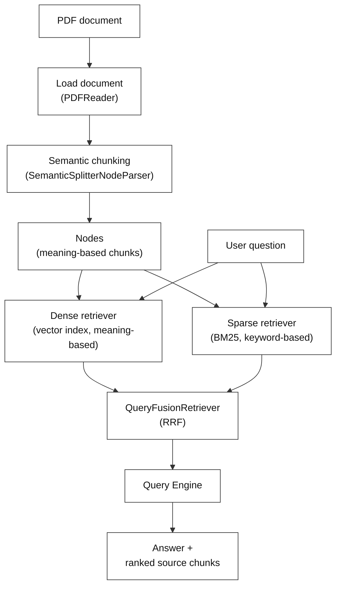
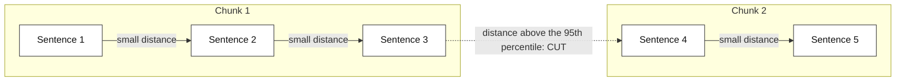
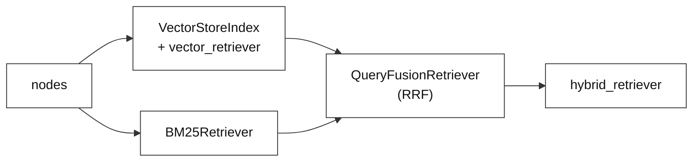

# Hybrid RAG (Dense + Sparse) with Semantic Chunking

---

# Problem Statement / Use Case Overview

A coastal-restoration team keeps its field notes in a PDF. Someone asks why the crews let the tide back in slowly instead of opening the breach all at once. Standard RAG turns that question into a vector (a list of numbers; here an *embedding*, meaning a vector that captures what a piece of text is about, so similar meanings get similar numbers), compares it to every chunk, and hands the nearest few to the LLM — but vector search has one reliable weakness: if the answer lives in an exact term, a code snippet, a species name, or a measurement, and the sentence around it doesn't read as *semantically* close to the question, it never surfaces. Keyword search has the mirror-image weakness: it nails "Section 4.2" and is blind to the fact that "they open the breach in stages" answers a question about "phased reintroduction."

### How This Lab Solves It

This lab searches the same document **both** ways and blends the two rankings, so each retriever covers the other's blind spot. It also fixes a problem that happens *before* retrieval: most chunkers cut at a fixed character count, slicing sentences in half, and a chunk cut mid-thought is a bad chunk no matter how good the retriever is. Here the split happens where the **meaning** changes instead.

**The pipeline has four connected parts:**

1. **Semantic chunking** — split the PDF where the topic changes, not every 500 characters.
2. **Dense retrieval** — index the chunks as vectors and search by meaning.
3. **Sparse retrieval** — index the same chunks with BM25 and search by keyword.
4. **Fusion** — combine both rankings via reciprocal rank fusion (RRF) into one final set.

This is useful for:
- **Technical and domain corpora** where exact identifiers matter as much as concepts.
- **Answers that must be checkable** — the retrieved chunks and their fusion scores are printed, so nothing is a black box.
- **Reducing hallucinations** — the LLM is less likely to be handed a thin or misleading context when two independent retrievers had to agree.

---

# Input Data

| Item | Detail |
|------|--------|
| **The PDF** | `data/sample_text_document.pdf` — a short guide to coastal wetland restoration, shipped with the lab. It is deliberately small (~2 pages) so you can read the chunks yourself and judge whether retrieval is right. |
| **Your question** | A natural-language question about the document. The default `QUERY` asks why restoration teams reintroduce tidal flow gradually rather than all at once. |
| **Embedding model** | `all-MiniLM-L6-v2`, run locally via HuggingFace — downloads once (~90 MB), no API key needed. |
| **LLM API key** | OpenRouter, used only to generate the final answer from the retrieved chunks. |

---

# Processing

### Part A — Ingestion

The PDF is read with `PDFReader`, then handed to `SemanticSplitterNodeParser`. Instead of cutting every N characters, the splitter embeds each sentence, compares it to its neighbours, and starts a new chunk only where the meaning shifts sharply. The result is a list of **nodes** — each one a complete idea.

Two settings control this, and both are set in Step 1:

- **`buffer_size`** — how many neighbouring sentences are glued onto each sentence before it is embedded. With `buffer_size=1`, each sentence is embedded together with the one sentence before and the one after it, so a single short or odd sentence is not mistaken for a topic change.
- **`breakpoint_percentile_threshold`** — the cut rule. The splitter measures the *distance* between each pair of neighbouring sentences (distance = 1 minus *cosine similarity*, where cosine similarity is a score from about 0 to 1 for how close two vectors point in the same direction, i.e. how similar in meaning). The 95th percentile is the distance value that 95% of all the gaps in the document fall below. A new chunk starts only where a gap is larger than that value, so roughly the biggest 5% of gaps become cut points.

### Part B — Two Retrievers Over the Same Nodes

The same `nodes` list is indexed twice:

- **Dense** — `VectorStoreIndex` embeds every node and returns the 3 closest in meaning (`similarity_top_k=3`; *top_k* simply means "return the best k results").
- **Sparse** — `BM25Retriever` scores nodes by keyword overlap and returns the 3 best keyword matches.

### Part C — Fusion

A `QueryFusionRetriever` wraps both and blends their rankings with **reciprocal rank fusion (RRF)**. Rather than trusting either retriever's raw score (which are not comparable — a cosine score and a BM25 score live on different scales), it looks at *where each chunk ranked* in each list and combines those positions into one ordering. A chunk that both retrievers liked rises to the top. The full flow of both retrievers and the fusion step is drawn in the Part D diagram below.

Each chunk earns `1 / (60 + rank)` from every list it appears in (LlamaIndex counts rank from 0), and the contributions are added. Here is the arithmetic behind the Step 4 scores in the Output section:

| Final order | Rank in one list | Rank in the other list | Contributions | Sum (fused score) |
|---|---|---|---|---|
| Source 1 | 0 | 0 | 1/60 + 1/60 = 0.01667 + 0.01667 | **0.0333** |
| Source 2 | 1 | 1 | 1/61 + 1/61 = 0.01639 + 0.01639 | **0.0328** |
| Source 3 | 2 | not in its top 3 | 1/62 = 0.01613 | **0.0161** |

The ranks are worked out from the scores (the only combinations that add up to those values, given that Source 1 already holds position 0 in both lists). The lab's own output does not print them, so the Step 4b cell below lets you see each list yourself, including which retriever gave Source 3 its single contribution. This is a worked example of the formula, not a chart: the numbers are the real Step 4 scores.

### Part D — The Full Pipeline



---

# Output

**Step 1** reports how many documents were loaded and how many semantic nodes were extracted. Two pages become four meaning-based chunks:

```
Loaded 2 document(s)

Extracted 4 semantic nodes from the documents.
```

**Step 2** confirms both retrievers were built and fused successfully:

```
Hybrid retrievers (Dense + Sparse) successfully fused!
```

**Step 3** prints the question followed by a grounded answer generated from the retrieved chunks:

```
Query: Why do restoration teams reintroduce tidal flow gradually instead of all at once?

Answer: Restoration teams reintroduce tidal flow gradually because a sudden full breach can erode unconsolidated fill material before vegetation has a chance to stabilize the soil. A phased approach — opening a small channel first, monitoring erosion and sediment deposition, then widening in stages — gives pioneer plant species time to colonize newly wetted areas as they emerge.
```

**Step 4** lists the top-ranked chunks that were fused together and used to produce that answer, each with its fusion score:

```
Source nodes used (Post-Fusion):

--- Source 1 (score: 0.0333) ---
A Short Guide to Coastal Wetland Restoration
Synthetic Sample Document — Original Content, No Copyright Restrictions
1. Introduction
Coastal wetlands sit at the boundary between land and sea, absorbin...

--- Source 2 (score: 0.0328) ---
4. Planting and Vegetation Recovery
Many restoration sites are left to revegetate naturally once tidal flow and elevation are corrected, since
wind- and water-borne seeds from nearby healthy marsh oft...

--- Source 3 (score: 0.0161) ---
Phased approaches might open a small channel first, monitor erosion and sediment
deposition for a season, and then widen the opening in stages. This measured pace gives pioneer plant
species time to c...
```

The scores are worth pausing on. They are not similarities; they come from the RRF formula, `1 / (60 + rank)` added up over the lists a chunk appears in (see the worked table in Part C).

- `0.0333` is `1/60 + 1/60`: Source 1 was ranked first (rank 0) by both the dense and the sparse retriever.
- `0.0328` is `1/61 + 1/61`: Source 2 was ranked second (rank 1) by both.
- `0.0161` is `1/62` alone: Source 3 made only one retriever's list, in third place (rank 2), so it got one contribution and no second one.

Notice what this means for Source 3. It is the chunk that actually contains the phased-approach passage the answer is built from (the answer's wording matches it), yet it ranks last. RRF rewards *agreement between the two retrievers*, not correctness: the two chunks both retrievers liked (the introduction and the planting section, which likely share many words with the question) outrank the one chunk only a single retriever found. Here that did no harm, because the document has only 4 chunks and all 3 top results were passed to the LLM anyway, so the answer was still grounded in Source 3. On a larger document, a lone correct chunk with a low fused score could be cut off by `similarity_top_k` and lost. If you see these as 0–1 cosine values, re-read this section: they are rank-derived, not similarity-derived.

---

# Tech Stack

| Component | Tool |
|---|---|
| **Retrieval Framework** | `llama-index-core` — the pipeline, node parsers, and query engine (Lab 1 used LangChain; see the note below) |
| **PDF Reading** | `llama-index-readers-file` (`PDFReader`) — pulls text out of the PDF |
| **Semantic Chunking** | `llama-index-core` (`SemanticSplitterNodeParser`) — splits on meaning shifts |
| **Sparse Retrieval** | `llama-index-retrievers-bm25` + `rank_bm25` — keyword scoring |
| **Fusion** | `llama-index-core` (`QueryFusionRetriever`, `mode="reciprocal_rerank"`) — blends both rankings |
| **Embedding Model** | `all-MiniLM-L6-v2`, via `llama-index-embeddings-huggingface` — runs locally, 384 dimensions |
| **LLM (Answering)** | `nvidia/nemotron-3-super-120b-a12b:free`, via `llama-index-llms-openrouter` — a free tier model, so a full run costs nothing |
| **Secrets** | `python-dotenv` — reads `OPENROUTER_API_KEY` from a `.env` file |

**Why LlamaIndex here, when Lab 1 used LangChain?** Both frameworks can build this pipeline. This lab switches because LlamaIndex ships all three special parts ready-made and with matching interfaces: a semantic chunker (`SemanticSplitterNodeParser`), a BM25 retriever, and a fusion retriever (`QueryFusionRetriever`) that takes any list of retrievers. Using it also shows that the *ideas* (chunking, retrieval, fusion) matter more than the library, and later labs use whichever framework fits.

---

# Underlying Concepts (Summarized)

**Dense retrieval** turns both the question and every chunk into embeddings — vectors that capture *meaning* — and returns the chunks whose vectors are closest. It's strong on conceptual questions and paraphrases, because "phased reintroduction" and "opening the breach in stages" land near each other in vector space. It's weak on exact terms: a chunk containing the precise figure, code, or species name won't surface just because it contains the right string, if the surrounding meaning is far from the question.

**Sparse retrieval** (here, **BM25**) scores chunks by how many query words they share, weighted by how rare those words are across the corpus — a term appearing in every chunk counts for less than one appearing in one. It's excellent at exact matches and useless at paraphrase: it has no idea that two differently-worded sentences mean the same thing.

**BM25** specifically combines three signals: term frequency in the chunk, inverse document frequency across the corpus, and a length normalization that stops long chunks from winning purely by containing more words.

**Reciprocal rank fusion (RRF)** is the fusion method used here (in code it is `mode="reciprocal_rerank"`). Each retriever assigns its own scores, which live on incompatible scales, so comparing them directly is meaningless. Instead, a chunk's contribution is computed from its *rank* — `1 / (60 + rank)` (LlamaIndex counts rank from 0) — and the contributions from every retriever are summed. A chunk that both retrievers ranked highly outranks one that only a single retriever loved.

**Semantic chunking** is the decision to start a new chunk where meaning changes rather than where a character counter runs out. The splitter embeds each sentence, compares it to a small buffer of its neighbours, and cuts only when the distance between two neighbouring sentences exceeds a percentile threshold — a high threshold means it cuts rarely, keeping chunks larger. `buffer_size` sets how many neighbouring sentences are embedded together with each sentence. The payoff: every retrieved chunk is a self-contained idea, so the LLM gets clean context to reason over.

> **Why this matters:** Neither retriever is wrong — each is wrong in a different place. Running both and fusing their *rankings* (not their scores) means the pipeline inherits the union of their strengths while sidestepping the scale mismatch that makes naive score-averaging fail. And the fusion step is auditable: the final answer comes with the exact chunks and scores that produced it.

---

# Pre-requisites

- **Basic familiarity** with Python (functions, loops, `import` statements, dictionaries).
- **A general sense of what RAG and embeddings are** — retrieving relevant text using vector similarity before asking an LLM to answer. The `RAG-Labs/README.md` covers this if you need a refresher.
- **An LLM API key** — used only to generate the final answer.
- **~500 MB of free disk** for the local embedding model, and roughly 4 GB RAM. No GPU needed; everything runs on CPU.

---

# Environment / Dependencies Setup

The cell below installs all required Python packages:

| Package | Purpose |
|---------|---------|
| `llama-index-core` | Core pipeline, node parsers, `QueryFusionRetriever`, query engine |
| `llama-index-llms-openrouter` | Connects the LLM to LlamaIndex |
| `llama-index-embeddings-huggingface` | Wraps the local embedding model |
| `llama-index-readers-file` | `PDFReader` for loading the PDF |
| `llama-index-retrievers-bm25` | The sparse (BM25) retriever |
| `python-dotenv` | Loads the API key from `.env` |
| `pymupdf` | PDF fallback reader |
| `rank_bm25` | The BM25 scoring engine |

> **Note:** Run this cell first — it only needs to be run once per session.

```python
!pip install -q llama-index-core llama-index-llms-openrouter llama-index-embeddings-huggingface "torch>=2.5" llama-index-readers-file llama-index-retrievers-bm25 python-dotenv pymupdf rank_bm25
```

**Getting an OpenRouter API key**

The LLM here is accessed through OpenRouter, which provides a single API key that works across many models, including free ones.

1. Go to [openrouter.ai](https://openrouter.ai) and sign up, or log in if an account already exists.
2. From the dashboard, open the **Keys** section.
3. Click **Create Key**, give it a name, and confirm.
4. **Copy the key immediately** — it is shown in full only once.
5. Put it in a `.env` file next to the notebook:

```
OPENROUTER_API_KEY=sk-or-v1-...
```

The notebook reads this file automatically, and falls back to prompting you interactively if the file is missing — so a missing `.env` won't crash the run.

---

# Step-wise Instructions — Development

---

### Setup — Import Libraries

This cell loads every tool the pipeline needs: the core pieces for building an index and querying it, the two retrievers that make up the "hybrid" part along with the tool that fuses them, and the LLM integration.

```python
import os

from dotenv import load_dotenv
from llama_index.core import VectorStoreIndex, Settings
from llama_index.core.node_parser import SemanticSplitterNodeParser
from llama_index.core.query_engine import RetrieverQueryEngine
from llama_index.core.retrievers import QueryFusionRetriever
from llama_index.embeddings.huggingface import HuggingFaceEmbedding
from llama_index.llms.openrouter import OpenRouter
from llama_index.readers.file import PDFReader
from llama_index.retrievers.bm25 import BM25Retriever
```

### Setup — Silence Noisy Logs

This cell doesn't touch the pipeline at all — it's purely there to keep the notebook's output readable.

```python
import logging
import warnings

warnings.filterwarnings("ignore")

# downgrade the chattiest loggers so their messages never reach the notebook
for noisy in ("transformers", "sentence_transformers", "huggingface_hub", "httpx"):
    logging.getLogger(noisy).setLevel(logging.ERROR)
```

`bm25s`, the library behind `BM25Retriever`, needs one extra step. It logs a DEBUG line every time it builds its index, and it attaches its own handler at import time — so it has to be stopped from propagating to the root logger. Setting its level alone leaves the line on screen.

```python
bm25_logger = logging.getLogger("bm25s")
bm25_logger.setLevel(logging.ERROR)
# stop these messages from also bubbling up to the root logger (double output)
bm25_logger.propagate = False
```

The `bm25s` block is the one that matters visually. Without it, a stray `Building index from IDs objects` DEBUG line lands in the middle of Step 2's output, right between the code and the confirmation message.

### Setup — Load API Keys & Configure LlamaIndex Settings

This cell gets everything authenticated and configured so every later step knows which LLM and embedding model to use, without being told again.

```python
load_dotenv(".env")

OPENROUTER_API_KEY = os.getenv("OPENROUTER_API_KEY")

if not OPENROUTER_API_KEY:
    OPENROUTER_API_KEY = input("Enter your OpenRouter API key (get one at https://openrouter.ai): ").strip()

print("Key loaded.")

# Settings.* are LlamaIndex globals -- every later component reads them automatically
# Set up the LLM (using OpenRouter)
Settings.llm = OpenRouter(
    model="nvidia/nemotron-3-super-120b-a12b:free",
    api_key=OPENROUTER_API_KEY,
    temperature=0,
    max_tokens=512
)

# Set up the dense embedding model
Settings.embed_model = HuggingFaceEmbedding(model_name="all-MiniLM-L6-v2")

print("LlamaIndex configured!")
```

- The API key is loaded first, with a fallback that simply asks for it directly if it isn't found — so the notebook doesn't just crash if the `.env` file is missing.
- It then sets which LLM will generate answers and which embedding model will be used to understand meaning, for the rest of the notebook to use automatically.
- `max_tokens=512` caps the length of the answer. A *token* is the small piece of text a language model reads and writes, roughly three-quarters of an English word. `temperature=0` makes the answers as repeatable as possible.

---

### Step 1 — Load Documents & Create Semantic Nodes

This step takes the raw PDF and turns it into the meaning-based chunks the rest of the pipeline will search over.

```python
# Load PDF document
reader = PDFReader()

# One LlamaIndex Document per PDF page
documents = reader.load_data(file="data/sample_text_document.pdf")

print(f"Loaded {len(documents)} document(s)")

# Semantic chunking: splits based on meaning, not fixed size
splitter = SemanticSplitterNodeParser(
    buffer_size=1, 
    # a new chunk starts where the distance between adjacent sentences exceeds the 95th percentile
    breakpoint_percentile_threshold=95, 
    embed_model=Settings.embed_model
)

# Parse documents into nodes explicitly for hybrid search
nodes = splitter.get_nodes_from_documents(documents)

print(f"Extracted {len(nodes)} semantic nodes from the documents.")
```

- The PDF is loaded first, giving the notebook something to work with.
- That content is then split by meaning rather than by a fixed size, so each chunk stays focused on one complete idea, as described in Underlying Concepts.
- `buffer_size=1` means each sentence is embedded together with one neighbouring sentence on each side, which smooths out the comparison so one odd sentence does not trigger a cut.
- `breakpoint_percentile_threshold=95` is the "how eager am I to cut" dial. The splitter lists the distance between every pair of adjacent sentences, finds the value that 95% of them fall below (the 95th percentile), and starts a new chunk only where a gap is bigger than that. So only the largest meaning shifts become cuts and chunks stay large. Lower it to see the document shatter into more, smaller ideas.
- These chunks are what both the dense and sparse retrievers will be built from next.

The picture below shows the cut rule on a made-up run of sentences (it is a flow diagram, not a plot of real data, because Mermaid cannot draw a curve with a threshold line). Each arrow is the distance between neighbouring sentences; only the gap above the 95th-percentile value cuts the text.



---

### Step 2 — Create the Hybrid Retrievers (Dense + Sparse)

This step builds three things in sequence: a dense retriever, a sparse retriever, and a fused retriever that combines both. The diagram below shows that flow before the code.



```python
# 1. THE DENSE COMPONENT
vector_index = VectorStoreIndex(nodes)
vector_retriever = vector_index.as_retriever(similarity_top_k=3)

# 2. THE SPARSE COMPONENT
bm25_retriever = BM25Retriever.from_defaults(
    nodes=nodes, 
    similarity_top_k=3
)

# 3. THE HYBRID ENGINE (Fusing them together)
hybrid_retriever = QueryFusionRetriever(
    [vector_retriever, bm25_retriever],
    similarity_top_k=3,
    num_queries=1, 
    # reciprocal rank fusion blends the two lists without needing comparable scores
    mode="reciprocal_rerank", 
)

print("Hybrid retrievers (Dense + Sparse) successfully fused!")
```

- The dense retriever is built first, set up to return the handful of chunks that are closest in meaning to a given question.
- The sparse retriever is built next, over those same chunks, returning its own handful of best keyword matches.
- `num_queries=1` means the question is used as-is. Raise it and LlamaIndex generates paraphrase variants and searches with each, which improves recall but costs one extra retrieval round per variant.
- The two are then combined into one fused retriever, which blends their rankings together using reciprocal rank fusion (RRF) rather than trusting either one alone — this is the actual "hybrid" step.

---

### Step 3 — Query the Index

This step is where a real question finally gets asked and answered, using everything built so far.

```python
# Create a query engine from the fused retriever
query_engine = RetrieverQueryEngine.from_args(hybrid_retriever)

# Ask a question
QUERY = "Why do restoration teams reintroduce tidal flow gradually instead of all at once?"
response = query_engine.query(QUERY)

print(f"Query: {QUERY}")
print(f"\nAnswer: {response}")
```

- The fused retriever from Step 2 is wrapped into something that can be asked a question directly, handling retrieval and answer generation together.
- Asking it a question runs the whole pipeline in one call: the hybrid retriever finds the most relevant chunks, and the LLM uses them to produce the final answer.
- The result carries more than just the answer text — it also keeps track of exactly which chunks were used, which is what the next step looks at.

---

### Step 4 — Inspect Post-Fusion Sources

This step doesn't generate anything new — it just reveals what actually went into the answer above.

```python
# Show the source nodes (retrieved chunks)
print("Source nodes used (Post-Fusion):")
# fusion scores are small rrf fractions (rank-based), not cosine similarities
for i, node in enumerate(response.source_nodes):
    print(f"\n--- Source {i + 1} (score: {node.score:.4f}) ---")
    print(node.text[:200] + "...")
```

- This cell prints out the exact chunks that were fused together and handed to the LLM to generate the answer in Step 3, along with how each one ranked after fusion.
- Seeing that list means nothing is hidden — it's possible to check exactly which passages the final answer was based on, instead of just trusting the answer on its own.
- The scores here are the *fused RRF* values, not raw cosine or BM25 scores. They are small numbers (about `1/60` per list a chunk appears in, shrinking as the rank gets worse) precisely because that is how the formula works — don't expect them in the 0–1 range a cosine score would give you.

---

### Step 4b — See Each Retriever Before Fusing

Step 4 only shows the blended result. This cell asks each retriever the same question on its own, so you can see the two input lists that RRF combined (and which one each chunk came from). It makes no LLM call.

```python
# Look at each retriever on its own, before fusion
print("Dense (vector) hits:")
for i, n in enumerate(vector_retriever.retrieve(QUERY)):
    print(f"  position {i} | cosine score {n.score:.4f} | {n.text[:70].replace(chr(10), ' ')}")

print("\nSparse (BM25) hits:")
for i, n in enumerate(bm25_retriever.retrieve(QUERY)):
    print(f"  position {i} | BM25 score {n.score:.4f} | {n.text[:70].replace(chr(10), ' ')}")
```

- Positions count from 0, matching the RRF formula. Compare them with the worked table in Part C.
- The two score columns are on different scales (cosine versus BM25), which is exactly why fusion uses positions instead of scores.
- The exact numbers depend on your run, so none are shown here.

---

### Step 5 — Variations Worth Trying

Now that the pipeline runs end to end, these are the swaps that show which parts actually matter. Change one at a time and re-run Steps 3 and 4 to compare.

- **Drop one retriever.** Build the query engine from `vector_retriever` alone, then from `bm25_retriever` alone. Ask a question containing an exact term from the document and one that paraphrases instead — the two retrievers will tend to disagree in the way Underlying Concepts describes. Be realistic about what you will see, though: this document has only 4 chunks and each retriever returns its top 3, so every list already covers most of the document and the fused result may look much like either one. The benefit of fusion shows up on larger documents, where each retriever misses chunks the other finds.
- **Compare fusion modes.** `QueryFusionRetriever` also supports `mode="simple"`. In LlamaIndex this does not add scores: it merges the two lists, keeps the highest raw score for any chunk found by both, and sorts by that raw score. Run it on the same query and compare. The scores are now raw cosine and BM25 values on different scales, so one retriever's scores can dominate the order — the scale-mismatch problem RRF exists to avoid.
- **Turn up `num_queries`.** Set it to 3 and re-run Step 3. More paraphrases means higher recall, at the cost of more retrieval calls and a noisier fusion.

---

# What We Learnt

You built a retrieval pipeline that closes the biggest weakness of a standard RAG system: relying on a single way of matching a question to the right passage.

- **Two retrievers, two blind spots** — dense search finds meaning but can miss exact terms; sparse search finds exact terms but can't see paraphrases. Running both covers each one's weakness.
- **Semantic chunking fixes the input, not the search** — cutting the document where the topic changes means every retrieved chunk is a complete idea. A great retriever still returns bad context if the chunks are sliced mid-sentence.
- **Fusion blends rankings, not scores** — a cosine score and a BM25 score live on different scales and can't be averaged meaningfully. Reciprocal rank fusion (RRF) scores each chunk by *position* in each result list, so the two are comparable.
- **One list of nodes feeds both indexes** — chunking happens once. Both retrievers then search the same meaning-based chunks, so the comparison between them is fair.
- **The pipeline is auditable, not a black box** — the final answer ships with the exact chunks and fused scores that produced it, so you can check the grounding instead of trusting it.
