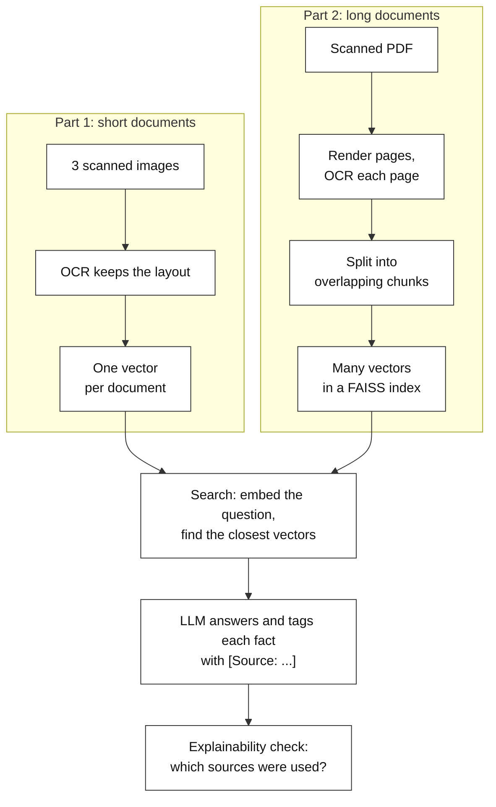
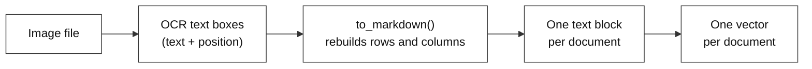
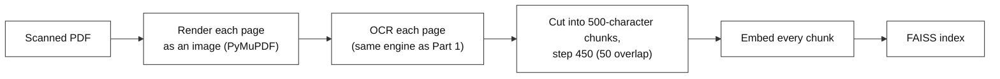
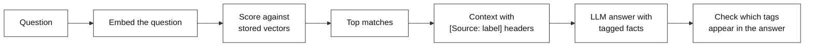

# OCR + RAG: Chatting with Scanned Documents

---

# Problem Statement / Use Case Overview

A lot of important documents exist only as **pictures of text**: scanned invoices, faxed receipts, old printed agreements. A computer cannot answer "what was the invoice total?" from a picture. First the words have to be read out of the image. That job is called **OCR** (Optical Character Recognition: software that looks at an image and turns the letters it sees into real text).

OCR alone is not enough, though. Two new problems show up:

1. **Layout gets lost.** An invoice is a table. If OCR returns a flat jumble of words, the label `Invoice Number` and its value `34278587` are no longer neighbours, and the LLM starts guessing which number belongs to which label.
2. **Some documents are long.** A 32-page scanned PDF cannot be pasted into a prompt for every question. Only the few passages that matter should be sent to the LLM, and you should be able to see which ones were used.

### How This Lab Solves It

This lab solves both, one idea at a time, on the same running example:

- **Part 1 (short documents):** OCR three scanned documents (an invoice, a receipt, a purchase order) while keeping the page layout, turn each whole document into one searchable unit, and answer questions with a `[Source: ...]` tag on every fact.
- **Part 2 (long documents):** OCR a scanned 32-page PDF, cut the text into small overlapping **chunks** (short pieces of text), store them in a **FAISS** index (a fast vector search library), and retrieve several chunks per question with an explainable "which chunk was used" check.
- **Part 3 (comparison):** a short look at when to retrieve whole documents and when to retrieve chunks.

**Which part teaches what:**

| Part | The one new idea | Example question |
|------|------------------|------------------|
| Part 1 | OCR that keeps layout, one vector per document, source tags on every fact | "What is the invoice number and total charge on the Contoso invoice?" |
| Part 2 | Scanned PDF to pages to chunks to FAISS, several chunks per question, an explainable answer trail | "How long does each debate last?" |
| Part 3 | Whole-document versus chunk retrieval | (no new question, just measurements) |

This is especially useful for:
- **Digitizing invoices, receipts, and forms**: turn scanned images into something you can query.
- **Scanned reports and agreements**: ask questions about long documents that have no selectable text.
- **Any answer that must be traceable** back to the exact document, page, and chunk it came from.

---

# Input Data

| Item | Detail |
|------|--------|
| **Part 1 documents** | An invoice, a receipt, and a purchase order (images), downloaded automatically from GitHub |
| **Part 2 document** | `debate.pdf`, a scanned 32-page agreement (a PDF made of page images), downloaded automatically from GitHub |
| **Your questions** | Plain-English questions about the documents |
| **OCR engine** | RapidOCR, runs on your CPU, downloads its small models once, no API key |
| **Embedding model** | `all-MiniLM-L6-v2` via Sentence Transformers, runs locally, downloads once (~90 MB), no API key |
| **LLM API key** | OpenRouter, used only to write the final answers |

---

# Processing

### The Full Flow



Both parts end the same way. A question is turned into numbers, compared against the stored numbers, and the closest sources are sent to the LLM with their labels. The LLM must tag every fact with the label it came from, and the lab then checks the tags to see which sources were really used.

### Part 1: How One Document Becomes Searchable



Each image is read once. OCR returns every piece of text together with its position on the page, and `to_markdown()` uses those positions to put the text back in reading order, so a table still looks like a table. The whole document is then embedded as a single vector. The documents are short, so no chunking is needed.

### Part 2: How a Long PDF Becomes Searchable



OCR cannot read a PDF directly, so every page is first drawn as an image. The text of each page is then cut into chunks that overlap by 50 characters, so a sentence sitting on a boundary is not lost. Every chunk remembers its page number, which is what lets the answer cite a page later.

### Answering a Question (Same in Both Parts)



---

# Output

The notebook was executed end to end; this is its real output.

**`load_dotenv(".env")`**

```text
Key loaded. LLM, embedding model and OCR engine are ready.
```

**`def download(url, path):`**

```text
Downloaded simple-invoice.png (166.8 KB)
Downloaded contoso-receipt.png (1769.2 KB)
Downloaded purchase-order-1.jpg (468.0 KB)
```

**`def read_text(image, keep_layout=True):`**

```text
simple-invoice.png: 250 characters of text
contoso-receipt.png: 245 characters of text
purchase-order-1.jpg: 950 characters of text
Contoso
Address:         Invoice For: Microsoft
1 Redmond way Suite    1020 Enterprise Way
6000 Redmond, WA     Sunnayvale, CA 87659
99243
Invoice Number Invoice Date Invoice Due Date Charges   VAT ID
34278587  6/18/2017  6/24/2017    $56,651.49 PT
```

**`flat_text = " ".join(ocr_engine(invoice_paths["simple-invoice.png"]).txts)`**

```text
Contoso Address: Invoice For: Microsoft 1 Redmond way Suite 1020 Enterprise Way 6000 Redmond, WA Sunnayvale, CA 87659 99243 Invoice Number Invoice Date Invoice Due Date Charges VAT ID 34278587 6/18/2017 6/24/2017 $56,651.49 PT
```

**`def embed(texts):`**

```text
Knowledge base built with 3 documents.
Vector table shape: (3, 384) (documents x dimensions)
```

**`query = "What is the invoice number and total charge on the Contoso invoice?"`**

```text
Question: What is the invoice number and total charge on the Contoso invoice?
--- SOURCES RETRIEVED ---
0.643  simple-invoice.png
0.443  contoso-receipt.png
--- ANSWER ---
Invoice Number: 34278587, Total Charge: $56,651.49 [Source: simple-invoice.png]
--- EXPLAINABILITY ---
0.643  simple-invoice.png  ->  USED
       cited in: Invoice Number: 34278587, Total Charge: $56,651.49 [Source: simple-invoice.png]
0.443  contoso-receipt.png  ->  retrieved but NOT used
```

**`follow_up = "Which items were purchased on the Surface Pro receipt?"`**

```text
Question: Which items were purchased on the Surface Pro receipt?
--- SOURCES RETRIEVED ---
0.466  contoso-receipt.png
0.359  purchase-order-1.jpg
0.271  simple-invoice.png
--- ANSWER ---
1 Surface Pro 6, 1 SurfacePen [Source: contoso-receipt.png]
--- EXPLAINABILITY ---
0.466  contoso-receipt.png  ->  USED
       cited in: 1 Surface Pro 6, 1 SurfacePen [Source: contoso-receipt.png]
0.359  purchase-order-1.jpg  ->  retrieved but NOT used
0.271  simple-invoice.png  ->  retrieved but NOT used
```

**`PDF_PATH = download(`**

```text
Downloaded debate.pdf (231.4 KB)
Rendered 32 pages. Page 1 is 1700x2199 pixels.
```

**`page_texts = []`**

```text
Page 1 transcribed: 1057 characters
Page 2 transcribed: 1240 characters
Page 3 transcribed: 1248 characters
... all 32 pages done, 36268 characters in total.
iii) Bob Schieffer for the third presidential debate,
October 13, 2004 at Arizona State University,
and;
iv)
Gwen Ifill for the vice presidential debate,
October 5, 2004 at the Case Western Reserve
University.
5. Rules Applicable to All Debates
The following rules shall apply to each of the four
debates:
(a) Each debate shall last for ninety (90) m
```

**`CHUNK_SIZE = 500`**

```text
Total chunks created: 94
End of chunk 1:   'n").\n1.\nNumber, Dates, Time, Locations, Topics\n(a)'
Start of chunk 2: '").\n1.\nNumber, Dates, Time, Locations, Topics\n(a) '
Chunk 2 starts with text already inside chunk 1: True
```

**`chunk_vectors = embed([chunk["text"] for chunk in chunks]).astype("float32")  # FAISS needs float32`**

```text
Indexed 94 chunks, 384 dimensions each.
```

**`query = "How long does each debate last, and are opening statements allowed?"`**

```text
Question: How long does each debate last, and are opening statements allowed?
--- SOURCES RETRIEVED ---
0.690  debate.pdf, page 7, chunk 19
0.689  debate.pdf, page 4, chunk 10
0.661  debate.pdf, page 7, chunk 20
--- ANSWER ---
Each debate shall last for ninety (90) minutes, and there shall be no opening statements. [Source: debate.pdf, page 4, chunk 10]
--- EXPLAINABILITY ---
0.690  debate.pdf, page 7, chunk 19  ->  retrieved but NOT used
0.689  debate.pdf, page 4, chunk 10  ->  USED
       cited in: Each debate shall last for ninety (90) minutes, and there shall be no opening statements. [Source: debate.pdf, page 4, chunk 10]
0.661  debate.pdf, page 7, chunk 20  ->  retrieved but NOT used
```

**`query = "What are the rules about props, notes and charts during a debate?"`**

```text
Question: What are the rules about props, notes and charts during a debate?
--- SOURCES RETRIEVED ---
0.592  debate.pdf, page 4, chunk 11
0.592  debate.pdf, page 5, chunk 13
0.582  debate.pdf, page 4, chunk 12
0.562  debate.pdf, page 5, chunk 14
--- ANSWER ---
No props, notes, charts, diagrams, or other writings or other tangible things may be brought into the debate by any candidate. [Source: debate.pdf, page 4, chunk 11]
--- EXPLAINABILITY ---
0.592  debate.pdf, page 4, chunk 11  ->  USED
       cited in: No props, notes, charts, diagrams, or other writings or other tangible things may be brought into the debate by any candidate. [Source: debate.pdf, page 4, chunk 11]
0.592  debate.pdf, page 5, chunk 13  ->  retrieved but NOT used
0.582  debate.pdf, page 4, chunk 12  ->  retrieved but NOT used
0.562  debate.pdf, page 5, chunk 14  ->  retrieved but NOT used
```

**`def count_tokens(text):`**

```text
The embedding model reads at most 256 tokens per text.
Part 1 units (whole documents):
  simple-invoice.png: 250 chars, 76 tokens
  contoso-receipt.png: 245 chars, 83 tokens
  purchase-order-1.jpg: 950 chars, 224 tokens
Part 2 units (chunks): 94 chunks, longest = 121 tokens
The whole PDF as ONE unit would be 7268 tokens, so about 97% of it would never be seen by the embedding model.
```


---

# Tech Stack

| Component | Tool |
|---|---|
| **OCR** | `rapidocr`: a fast, CPU-only OCR engine that finds each text box in an image and reads it. One engine is used for both parts. |
| **OCR runtime** | `onnxruntime`: the CPU runtime RapidOCR runs its models on, no GPU needed |
| **Keeping the layout** | RapidOCR's `.to_markdown()`: rebuilds reading order from the box positions so rows and columns stay aligned |
| **PDF to images** | `pymupdf` (`fitz`) and `Pillow`: draw each PDF page as an image so OCR can read it |
| **Embeddings** | `all-MiniLM-L6-v2` via `sentence-transformers`: turns text into a 384-number vector, runs locally |
| **Vector search** | Part 1: plain NumPy dot product. Part 2: `faiss-cpu` (`IndexFlatIP`) |
| **LLM** | `nvidia/nemotron-3-super-120b-a12b:free` via `langchain-openai` pointed at OpenRouter (a free model, so a full run costs nothing) |
| **Downloading samples** | `requests` |
| **Secrets** | `python-dotenv`: reads `OPENROUTER_API_KEY` from a `.env` file |

---

# Underlying Concepts (Summarized)

**OCR** reads the text out of an image. A plain OCR engine returns a flat list of text boxes in whatever order it found them. For an invoice that is a problem, because the meaning of a number depends on the row and column it sits in. This lab uses the layout-aware output (`to_markdown()`) so `Invoice Number` and `34278587` stay lined up.

**An embedding** is a list of numbers (a **vector**) that captures the meaning of a piece of text. Texts with similar meaning get vectors that point in similar directions. **Cosine similarity** measures that: 1.0 means the same direction, and values near 0 mean unrelated. This model returns vectors already scaled to length 1, so cosine similarity is just a dot product.

**RAG (Retrieval-Augmented Generation)** means: first retrieve the passages that match the question, then give only those passages to the LLM and tell it to answer from them. The answer is grounded in your document instead of the model's memory.

**A retrieval unit** is whatever one vector stands for. In Part 1 it is a whole document. In Part 2 it is a 500-character chunk. Short documents fit in one vector. Long ones must be cut up, because one vector cannot represent 32 pages, and a small, focused chunk matches a question much better than a whole page does.

**Overlapping chunks** share some text with their neighbour (here 50 characters). If a key sentence falls exactly on a boundary, it still appears whole in at least one chunk.

**FAISS** is a library that stores many vectors and quickly finds the ones closest to a new vector. With 3 documents a NumPy dot product is enough. With hundreds of chunks (and in real systems, millions), an index like FAISS is the right tool.

**Source tags make answers checkable.** The LLM is told to write `[Source: label]` after every fact. Afterwards the code only has to look for that exact text in the answer to know which sources were used. This is an exact check, not a guess. A source can be retrieved but not used: the search returns the top few matches, and some of them may be irrelevant to the answer.

---

# Pre-requisites

- **Basic Python**: functions, loops, lists, dictionaries.
- **A general idea of RAG and embeddings**: the Underlying Concepts section above covers what you need.
- **An OpenRouter API key**: used only to generate the answers.
- **About 1 GB of free disk and 4 GB RAM** for the OCR and embedding models. No GPU needed.

---

# Environment / Dependencies Setup

The cell below installs all required Python packages:

| Package | Purpose |
|---------|---------|
| `rapidocr`, `onnxruntime` | The OCR engine and the CPU runtime it needs |
| `pymupdf`, `Pillow` | Draw PDF pages as images |
| `sentence-transformers` | The local embedding model |
| `faiss-cpu` | Vector search for Part 2 |
| `langchain-openai` | Connects to the LLM through OpenRouter |
| `requests` | Downloads the sample documents |
| `numpy` | The vector math |
| `python-dotenv` | Loads the API key from `.env` |

```python
!pip install -q rapidocr onnxruntime pymupdf Pillow sentence-transformers "torch>=2.5" faiss-cpu langchain-openai requests numpy python-dotenv
```

### Getting an OpenRouter API key

OpenRouter gives you one API key that works across many models, including free ones.

1. Go to [openrouter.ai](https://openrouter.ai) and sign up, or log in.
2. Open the **Keys** section of the dashboard.
3. Click **Create Key**, give it a name, and confirm.
4. **Copy the key immediately**. It is shown in full only once.
5. Put it in a `.env` file next to the notebook:

```
OPENROUTER_API_KEY=sk-or-v1-...
```

The notebook reads this file automatically and asks you to type the key if the file is missing.

---

# Step-wise Instructions — Development

---

### Setup: Import Libraries

```python
import logging
import os

import faiss
import fitz  # PyMuPDF
import numpy as np
import requests
from dotenv import load_dotenv
from langchain_openai import ChatOpenAI
from PIL import Image
from rapidocr import RapidOCR
from sentence_transformers import SentenceTransformer

# Keep the output readable: hide model-download progress bars and noisy library logs
os.environ["HF_HUB_DISABLE_PROGRESS_BARS"] = "1"
for noisy in ("sentence_transformers", "huggingface_hub", "httpx", "transformers"):
    logging.getLogger(noisy).setLevel(logging.ERROR)
```

### Setup: Load the Key and Create the Three Tools

Three tools are created once here and reused in both parts: the LLM (writes answers), the embedding model (turns text into vectors), and the OCR engine (reads images).

```python
load_dotenv(".env")

OPENROUTER_API_KEY = os.getenv("OPENROUTER_API_KEY")

if not OPENROUTER_API_KEY:
    OPENROUTER_API_KEY = input("Enter your OpenRouter API key (get one at https://openrouter.ai): ").strip()

# 1. The LLM: a free model on OpenRouter, so running this lab costs nothing
llm = ChatOpenAI(
    model="nvidia/nemotron-3-super-120b-a12b:free",
    api_key=OPENROUTER_API_KEY,
    base_url="https://openrouter.ai/api/v1",
    temperature=0,
    max_tokens=500,
    extra_body={"reasoning": {"enabled": False}},
)

# 2. The embedding model: runs on your CPU, no API key needed
embedder = SentenceTransformer("all-MiniLM-L6-v2")

# 3. The OCR engine: loads its models once; "error" hides the startup chatter
ocr_engine = RapidOCR(params={"Global.log_level": "error"})

print("Key loaded. LLM, embedding model and OCR engine are ready.")
```

- `temperature=0` asks for the most predictable answer, which is what you want when checking exact figures.
- `base_url` points the OpenAI client at OpenRouter instead of OpenAI. Same client, different server.
- `extra_body={"reasoning": {"enabled": False}}` switches off this model's hidden "thinking" mode. Without it, this reasoning model can spend its whole token budget thinking and return an empty answer.

You should see: `Key loaded. LLM, embedding model and OCR engine are ready.`

---

## Part 1: Short Documents (Whole-Document Retrieval)

**New idea in this part:** OCR that keeps the page layout, one vector per document, and a source tag on every fact in the answer.

### Step 1.1: Download the Sample Documents

A small helper downloads a file and saves it. It is reused in Part 2.

```python
def download(url, path):
    """Download a file from a URL and save it at the given path."""
    os.makedirs(os.path.dirname(path), exist_ok=True)
    response = requests.get(url)
    response.raise_for_status()
    with open(path, "wb") as f:
        f.write(response.content)
    print(f"Downloaded {os.path.basename(path)} ({len(response.content)/1024:.1f} KB)")
    return path

INVOICE_URLS = {
    "simple-invoice.png": "https://raw.githubusercontent.com/Azure-Samples/cognitive-services-REST-api-samples/master/curl/form-recognizer/simple-invoice.png",
    "contoso-receipt.png": "https://raw.githubusercontent.com/Azure/azure-sdk-for-python/master/sdk/formrecognizer/azure-ai-formrecognizer/tests/sample_forms/receipt/contoso-receipt.png",
    "purchase-order-1.jpg": "https://raw.githubusercontent.com/Azure/azure-sdk-for-python/master/sdk/formrecognizer/azure-ai-formrecognizer/tests/sample_forms/forms/Form_1.jpg",
}

invoice_paths = {}
for filename, url in INVOICE_URLS.items():
    invoice_paths[filename] = download(url, os.path.join("data", "invoices", filename))
```

You should see three `Downloaded ...` lines.

### Step 1.2: Read Each Document With OCR (Keeping the Layout)

`read_text` runs the OCR engine on one image and returns layout-preserving text. It accepts either a file path or an image array, so Part 2 can reuse it.

```python
def read_text(image, keep_layout=True):
    """OCR one image (a file path or a numpy array) and return its text."""
    result = ocr_engine(image)
    if keep_layout:
        return result.to_markdown()      # rebuilds rows and columns from the box positions
    return "\n".join(result.txts)        # plain lines, in the order the engine found them

# document_texts maps each filename to its OCR text
document_texts = {}
for filename, path in invoice_paths.items():
    document_texts[filename] = read_text(path)
    print(f"{filename}: {len(document_texts[filename])} characters of text")

print()
print(document_texts["simple-invoice.png"])
```

The engine is created once and reused. Creating a new `RapidOCR()` for every image would reload its models each time.

You should see the three character counts, then the invoice text with `Invoice Number` and `34278587` in the same column of a small table.

To see what the layout is worth, compare it with the flat version, where the words are simply joined in detection order:

```python
flat_text = " ".join(ocr_engine(invoice_paths["simple-invoice.png"]).txts)
print(flat_text)
```

You should see one long line in which every label, date, and amount is mixed together. An LLM reading that line has to guess which number belongs to which header. (Do not test this with "are the label and value on the same line?". That is `True` for the flat text only because flattening puts everything on one line. The property that matters is column alignment, and only the layout version has it.)

### Step 1.3: Embed Each Document (One Vector Each)

Each document is short, so the whole thing becomes one vector. The `embed` helper is reused in Part 2.

```python
def embed(texts):
    """Turn a list of texts into a 2D array of unit-length vectors, one row per text."""
    # unit-length vectors, so a dot product later equals cosine similarity
    return embedder.encode(texts, normalize_embeddings=True)

doc_names = list(document_texts)
doc_vectors = embed([document_texts[name] for name in doc_names])

print(f"Knowledge base built with {len(doc_names)} documents.")
print(f"Vector table shape: {doc_vectors.shape} (documents x dimensions)")
```

`normalize_embeddings=True` scales every vector to length 1. That makes cosine similarity equal to a plain dot product, which keeps the search code very short.

You should see `Vector table shape: (3, 384)`: three documents, 384 numbers each.

### Step 1.4: Search the Documents

The question is embedded the same way, then compared to every document with a dot product. A higher score means a closer match.

```python
def search_documents(query, top_k=2):
    """Return the top_k closest documents as {source, text, score}, best first."""
    scores = doc_vectors @ embed([query])[0]          # one cosine score per document
    best = np.argsort(scores)[::-1][:top_k]           # positions of the highest scores
    return [
        {"source": doc_names[i], "text": document_texts[doc_names[i]], "score": float(scores[i])}
        for i in best
    ]
```

Every search function in this lab returns a list of dictionaries with the same three keys (`source`, `text`, `score`). That shared shape is what lets Part 2 reuse the next two functions unchanged.

### Step 1.5: Ask the LLM and Check the Sources

Two functions that both parts use. `ask_llm` labels each retrieved source and tells the LLM to tag every fact. `show_sources` then looks for those tags in the answer.

```python
def ask_llm(query, hits):
    """Send the retrieved sources to the LLM and return its tagged answer."""
    # tag each block with its source so the model can copy the tag into its answer
    context = "\n\n".join(f"[Source: {hit['source']}]\n{hit['text']}" for hit in hits)
    prompt = f"""You answer questions using ONLY the context below.
Every fact you state must be followed by its source tag, copied exactly, like [Source: name].
If the answer is not in the context, say "Not found in the provided documents."

Context:
{context}

Question: {query}
Answer:"""
    return llm.invoke(prompt).content.strip()

def show_sources(answer, hits):
    """Explainability: for every retrieved source, was its tag cited in the answer?"""
    print("--- EXPLAINABILITY ---")
    for hit in hits:
        tag = f"[Source: {hit['source']}]"
        used = tag in answer
        print(f"{hit['score']:.3f}  {hit['source']}  ->  {'USED' if used else 'retrieved but NOT used'}")
        if used:
            for line in answer.splitlines():
                if tag in line:
                    print(f"       cited in: {line.strip()}")

def answer_question(query, hits):
    """Print the retrieved sources, the answer, and the explainability check."""
    print(f"Question: {query}\n")
    print("--- SOURCES RETRIEVED ---")
    for hit in hits:
        print(f"{hit['score']:.3f}  {hit['source']}")
    answer = ask_llm(query, hits)
    print("\n--- ANSWER ---")
    print(answer)
    print()
    show_sources(answer, hits)
```

- `.invoke()` is LangChain's single call: it sends the prompt and returns a response object. `.content` is the text.
- A retrieved source is not necessarily a used source. The search returns the top 2, so if only one is relevant, the other is retrieved and then ignored. `show_sources` tells the two cases apart by looking for the exact tag.

### Step 1.6: Ask Questions

```python
query = "What is the invoice number and total charge on the Contoso invoice?"
answer_question(query, search_documents(query))
```

You should see `simple-invoice.png` ranked first, an answer containing `34278587` and `$56,651.49` with a `[Source: simple-invoice.png]` tag, and `USED` next to that file.

Now a question that should favour a different document:

```python
follow_up = "Which items were purchased on the Surface Pro receipt?"
answer_question(follow_up, search_documents(follow_up, top_k=3))
```

`top_k=3` shows every document's score. You should see `contoso-receipt.png` move to the top, and the answer name the Surface Pro and the Surface Pen. If the top document did not change between the two questions, retrieval would not be telling your documents apart.

---

## Part 2: A Long Scanned PDF (Chunks + FAISS)

**New idea in this part:** a long document cannot be one vector, so it is cut into overlapping chunks, indexed in FAISS, and several chunks are retrieved per question. It reuses `download`, `read_text`, `embed`, `ask_llm`, `show_sources`, and `answer_question` from Part 1.

### Step 2.1: Download the PDF and Draw Each Page as an Image

OCR reads images, not PDFs, so every page is first rendered to an image.

```python
PDF_PATH = download(
    "https://raw.githubusercontent.com/jamalmazrui/pdf2ocr/master/debate.pdf",
    os.path.join("data", "debate.pdf"),
)

def render_pages(pdf_path, dpi=200):
    """Draw every PDF page as an image array. A higher dpi means a sharper image for OCR."""
    zoom = dpi / 72                                   # PDF pages are 72 dpi by default
    matrix = fitz.Matrix(zoom, zoom)
    pages = []
    with fitz.open(pdf_path) as doc:
        for page in doc:
            pix = page.get_pixmap(matrix=matrix)
            # raw page pixels -> RGB image -> numpy array for the OCR engine
            image = Image.frombytes("RGB", [pix.width, pix.height], pix.samples)
            pages.append(np.array(image))
    return pages

page_images = render_pages(PDF_PATH)
print(f"Rendered {len(page_images)} pages. Page 1 is {page_images[0].shape[1]}x{page_images[0].shape[0]} pixels.")
```

You should see `Rendered 32 pages`.

### Step 2.2: OCR Every Page

The same `read_text` from Part 1 is used, with `keep_layout=False`. This document is flowing prose, not a table, so plain lines in reading order are what we want (the layout version would add blank lines between every line and waste chunk space).

```python
page_texts = []
for page_number, image in enumerate(page_images, start=1):
    page_texts.append(read_text(image, keep_layout=False))
    if page_number <= 3:
        print(f"Page {page_number} transcribed: {len(page_texts[-1])} characters")

print(f"... all {len(page_texts)} pages done, {sum(len(t) for t in page_texts)} characters in total.")
print()
print(page_texts[3][:350])
```

This takes about a minute on a CPU. You should see per-page character counts and the start of page 4, which lists the debate rules. Scanned text is rarely perfect, so expect an occasional garbled word.

### Step 2.3: Cut the Text into Overlapping Chunks

Each chunk is up to 500 characters, and the next chunk starts 450 characters later, so neighbours share 50 characters. Every chunk gets a `source` label with its page and chunk number, so answers can cite it.

```python
CHUNK_SIZE = 500
OVERLAP = 50
# step by CHUNK_SIZE - OVERLAP so consecutive chunks share OVERLAP characters
STEP = CHUNK_SIZE - OVERLAP

chunks = []
for page_number, text in enumerate(page_texts, start=1):
    for start in range(0, len(text), STEP):
        piece = text[start : start + CHUNK_SIZE].strip()
        if piece:
            chunks.append({
                "source": f"debate.pdf, page {page_number}, chunk {len(chunks) + 1}",
                "page": page_number,
                "text": piece,
            })

print(f"Total chunks created: {len(chunks)}")
print("End of chunk 1:  ", repr(chunks[0]["text"][-50:]))
print("Start of chunk 2:", repr(chunks[1]["text"][:50]))
print("Chunk 2 starts with text already inside chunk 1:", chunks[1]["text"][:40] in chunks[0]["text"])
```

You should see the end of chunk 1 and the start of chunk 2 show the same text, and `True` on the last line. That shared text is the overlap. (The two printed strings can differ by a character or two because blank space at the ends of a chunk is trimmed.)

### Step 2.4: Build the FAISS Index

Every chunk is embedded with the same `embed` helper and added to a FAISS index.

```python
chunk_vectors = embed([chunk["text"] for chunk in chunks]).astype("float32")  # FAISS needs float32

index = faiss.IndexFlatIP(chunk_vectors.shape[1])   # IP = inner product (dot product)
index.add(chunk_vectors)

print(f"Indexed {index.ntotal} chunks, {chunk_vectors.shape[1]} dimensions each.")
```

Because the vectors have length 1, the inner product FAISS computes is exactly the cosine similarity from Part 1, so scores in both parts mean the same thing. You should see `Indexed ... chunks, 384 dimensions each`.

### Step 2.5: Search the Index (Several Chunks per Question)

```python
def search_chunks(query, top_k=3):
    """Return the top_k closest chunks as {source, text, score}, best first."""
    query_vector = embed([query]).astype("float32")
    # faiss returns the rows already sorted by score, best first
    scores, positions = index.search(query_vector, top_k)
    return [
        {**chunks[i], "score": float(score)}
        for score, i in zip(scores[0], positions[0])
    ]
```

The returned dictionaries have the same `source`, `text`, and `score` keys as Part 1, so the Part 1 functions work on them directly.

### Step 2.6: Ask Questions With an Explainable Answer

```python
query = "How long does each debate last, and are opening statements allowed?"
answer_question(query, search_chunks(query))
```

You should see three chunks retrieved, an answer stating 90 minutes and no opening statements (a two-minute closing statement), and the explainability list marking which chunks were cited and which were retrieved but ignored.

A question whose answer is spread over more than one chunk:

```python
query = "What are the rules about props, notes and charts during a debate?"
answer_question(query, search_chunks(query, top_k=4))
```

With `top_k=4` the LLM sees four chunks at once and may cite more than one. This is the point of multi-chunk retrieval: the facts needed for an answer are often split across neighbouring chunks, and the explainability check shows exactly which ones the answer drew from.

---

## Part 3: Whole Documents or Chunks?

**New idea in this part:** measure why Part 1 can use whole documents and Part 2 cannot.

An embedding model can only read a limited amount of text per input and silently ignores the rest. This cell compares the retrieval units of both parts to that limit.

```python
def count_tokens(text):
    """How many word pieces ('tokens') the embedding model needs for this text."""
    return len(embedder.tokenizer.tokenize(text))

print(f"The embedding model reads at most {embedder.max_seq_length} tokens per text.\n")

print("Part 1 units (whole documents):")
for name, text in document_texts.items():
    print(f"  {name}: {len(text)} chars, {count_tokens(text)} tokens")

chunk_tokens = [count_tokens(chunk["text"]) for chunk in chunks]
print(f"\nPart 2 units (chunks): {len(chunks)} chunks, longest = {max(chunk_tokens)} tokens")

whole_pdf = "\n".join(page_texts)
# how much of the PDF falls outside the model window and is never embedded
print(f"\nThe whole PDF as ONE unit would be {count_tokens(whole_pdf)} tokens, "
      f"so about {100 - 100 * embedder.max_seq_length // count_tokens(whole_pdf)}% of it would never be seen by the embedding model.")
```

You should see the invoices fitting comfortably under the limit (the purchase order is the longest and may be close to it), every chunk well under it, and the whole PDF far over it. That is why short documents can be one vector each, while long documents must be chunked.

| | Whole-document retrieval (Part 1) | Chunk retrieval (Part 2) |
|---|---|---|
| **Best for** | A few short documents (invoices, receipts, forms) | Long documents and big collections |
| **Search unit** | One document | A 500-character piece |
| **What the LLM receives** | Complete documents | A few focused passages |
| **Citation points to** | A file | A page and chunk |
| **Search tool** | NumPy dot product | FAISS index |
| **Weak spot** | Anything past the embedding limit is ignored | An answer split across chunks needs several of them retrieved |

---

# What We Learnt

This lab turned scanned images into something you can question, first with short documents and then with a long PDF, and showed which sources ended up in every answer.

- **OCR gives you text from images, and layout matters.** RapidOCR's `to_markdown()` keeps rows and columns together, so `Invoice Number` stays next to `34278587` instead of dissolving into a flat word list.
- **Short documents can be one vector each.** With a handful of invoice-length documents, one embedding per document and a plain dot product retrieve the right one, with no database.
- **Long documents must be chunked.** A scanned PDF is rendered to page images, OCR'd page by page, and cut into 500-character chunks that overlap by 50, so a sentence on a boundary survives whole in at least one chunk.
- **FAISS makes chunk search scale.** The same normalized vectors and the same cosine score are used in both parts; only the search tool changes.
- **Retrieval returns several sources, and the answer is checkable.** The LLM tags every fact with `[Source: ...]`, and looking for that exact tag shows which sources were used and which were retrieved but ignored.
- **The retrieval unit is a design choice.** The embedding model only reads a limited number of tokens, which is why short documents work whole and long ones need chunks.
