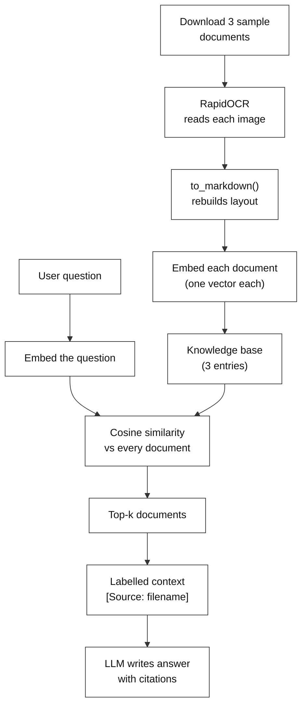
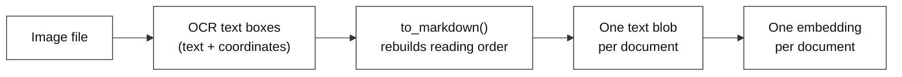
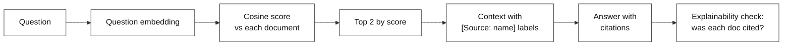

# Structured OCR + RAG Chatbot: Chatting with Scanned Invoices

**Difficulty:** Intermediate | **Time:** ~40 min | **Requires:** Basic RAG familiarity

---

# Problem Statement / Use Case Overview

An accounts-payable clerk has three scanned documents: an invoice, a receipt, and a purchase order. Someone asks, "what was the invoice number and total on the Contoso invoice?" To answer that at all, the text has to be pulled out of the images first — and that is where a basic OCR setup falls apart. It reads every text box on the page but throws away the layout, so the invoice's neat rows and columns become a jumbled bag of words. Once `Invoice Number` and `34278587` are no longer neighbours, an LLM reading the output can no longer tell which number belongs to which field, and it starts guessing.

This lab keeps the page's layout intact while extracting text, so `$56,651.49` still sits next to the label `Charges`. Each document then becomes one searchable unit, so a question pulls in only the relevant document, and the LLM is told to tag every fact it uses with the exact document it came from. You can then check the answer against the source instead of trusting it.

This is especially useful for:
- **Digitizing invoices and receipts** — turning scanned images into something you can actually query
- **Expense and purchase-order tracking** — pulling a specific number out of a pile of documents
- **Any situation where an answer must be traceable** back to the exact document it came from

---

# Input Data

| Item | Detail |
|------|--------|
| **Your question** | A question about the invoices (e.g. "What is the invoice number and total charge on the Contoso invoice?") |
| **The sample documents** | An invoice, a receipt, and a purchase order — downloaded automatically from GitHub links, no need to have them saved beforehand |
| **Embedding model** | `all-MiniLM-L6-v2`, run locally via Sentence Transformers — downloads once (~90 MB), no API key needed |
| **LLM API key** | OpenRouter, used only to generate the final answer from the retrieved text |

---

# Processing

### The Full Flow



Every question goes through the same five stages: the sample documents are downloaded, each one is read by RapidOCR and turned into structured text, that text is embedded and stored as a tiny knowledge base, the question is compared against that knowledge base to find the closest match(es), and the LLM writes the final answer using only what was retrieved — tagging every fact with the document it came from.

### How Each Document Becomes Searchable



Each image goes through OCR once, is converted into layout-preserving text, and is embedded into a single vector. There's no splitting into a dozen fragments and no vector database to manage — with only a handful of short documents, one embedding per document is enough to make retrieval accurate.

### Answering a Question, Step by Step



The question is embedded the same way the documents were, compared against every document's embedding using cosine similarity, and the top matches are handed to the LLM as labelled context. It is instructed to answer only from that context and to cite the source document for every fact.

---

# Output

The notebook below was executed end to end; this is its real output, reproduced in full.

**load_dotenv(".env")**

```text
Key loaded.
LLM ready.
```

**INVOICE_URLS = {**

```text
Downloaded simple-invoice.png (166.8 KB)
Downloaded contoso-receipt.png (1769.2 KB)
Downloaded purchase-order-1.jpg (468.0 KB)
```

**engine = RapidOCR(params={"Global.log_level": "error"})**

```text
simple-invoice.png: found 18 text boxes in 0.62s
contoso-receipt.png: found 19 text boxes in 0.49s
purchase-order-1.jpg: found 54 text boxes in 1.28s
```

**document_texts = {}**

```text
Contoso
Address:         Invoice For: Microsoft
1 Redmond way Suite    1020 Enterprise Way
6000 Redmond, WA     Sunnayvale, CA 87659
99243

Invoice Number Invoice Date Invoice Due Date Charges   VAT ID

34278587  6/18/2017  6/24/2017    $56,651.49 PT
```

**embedder = SentenceTransformer("all-MiniLM-L6-v2")**

```text
Loading weights:   0%|          | 0/103 [00:00<?, ?it/s]Knowledge base built with 3 documents.
Each embedding has 384 dimensions.
```

**query = "What is the invoice number and total charge on the Contoso invoice?"**

```text
--- DOCUMENTS RETRIEVED ---
simple-invoice.png  (similarity: 0.643)
contoso-receipt.png  (similarity: 0.443)

--- ANSWER ---
The invoice number is **34278587** and the total charge is **$56,651.49** [Source: simple-invoice.png].
```

**print("\n--- EXPLAINABILITY ---")**

```text
--- EXPLAINABILITY ---

Document: "simple-invoice.png"
similarity: 0.643 | USED in answer
Why: The document displays the Contoso invoice header with "Invoice Number 34278587" and a "Charges" field showing "$56,651.49". These two fields directly provide the invoice number and total charge requested. The layout confirms this is a Contoso invoice issued to Microsoft.

Document: "contoso-receipt.png"
similarity: 0.443 | retrieved but NOT used
Why: The document shows a Contoso receipt with a **Total of $1203.39** (listed at the bottom) and transaction details (date 6/10/2019, items, subtotal $1098.99, tax $104.40). No explicit invoice number appears in the provided text.
```

**follow_up = "Which items were purchased on the Surface Pro receipt?"**

```text
--- ALL DOCUMENTS, RANKED ---
0.466  contoso-receipt.png
0.359  purchase-order-1.jpg
0.271  simple-invoice.png

--- ANSWER ---
The Surface Pro receipt shows the following items purchased:

1. **1 Surface Pro 6** – 256GB / Intel Core i5 / 8GB RAM (Black) [Source: contoso-receipt.png]  
2. **1 SurfacePen** [Source: contoso-receipt.png]
```

---

# Tech Stack

| Component | Tool |
|---|---|
| **Reading the documents** | `rapidocr` — a fast, CPU-only OCR engine that detects and reads text boxes in each image |
| **OCR backend** | `onnxruntime` — the CPU runtime RapidOCR executes its models on, no GPU needed |
| **Structuring the OCR output** | RapidOCR's `.to_markdown()` — rebuilds a reading order from the box coordinates, so rows and columns stay roughly aligned instead of turning into a flat list |
| **Embedding** | `all-MiniLM-L6-v2` via `sentence-transformers` — turns each document's structured text into a 384-dimension vector, runs locally |
| **Searching for relevant documents** | Cosine similarity (plain NumPy) — compares the question's embedding to every document's embedding, no vector database needed |
| **Writing the answer** | `nvidia/nemotron-3-ultra-550b-a55b:free` via `langchain-openai` pointed at OpenRouter — a free tier model, so a full run costs nothing |
| **Downloading the sample documents** | `requests` — grabs each sample invoice/receipt from GitHub and saves it locally |
| **Secrets** | `python-dotenv` — reads `OPENROUTER_API_KEY` from a `.env` file |

---

# Underlying Concepts (Summarized)

A plain OCR engine gives you text boxes with coordinates, but no sense of layout — everything comes back as one flat list, in whatever order the engine happened to detect it. For a document like an invoice, that's a problem, because the meaning of a number depends entirely on which column and row it sits in. This lab uses RapidOCR's layout-aware output instead of the raw text list, so a document like `Invoice Number: 34278587` stays readable as a document, not a scrambled sentence.

Once the text is structured, this becomes a standard **RAG (Retrieval-Augmented Generation)** setup, just applied to OCR output instead of plain text files:
- **Retrieval** — every document is embedded once, and a question is matched against those embeddings using cosine similarity, so only the most relevant document(s) are used.
- **Generation** — the matched document(s) are handed to the LLM as context, with instructions to answer only from what's given and to cite the source document for every fact, using a tag like `[Source: filename]`.

That citation tag is what makes the explainability check possible afterward — the lab doesn't have to guess which documents actually mattered, it just checks whether each document's tag shows up in the final answer.

---

# Pre-requisites

- **Basic familiarity** with Python (functions, loops, `import` statements, dictionaries).
- **A general sense of what RAG and embeddings are** — retrieving relevant text by similarity before asking an LLM to answer. The `RAG-Labs/README.md` covers this if you need a refresher.
- **An LLM API key** — used only to generate the final answer.
- **~500 MB of free disk** for the OCR and embedding models, and roughly 4 GB RAM. No GPU needed; everything runs on CPU.

---

# Environment / Dependencies Setup

The cell below installs all required Python packages:

| Package | Purpose |
|---------|---------|
| `rapidocr` | Reads each image and extracts its text, box by box |
| `onnxruntime` | The CPU backend RapidOCR runs its models on |
| `sentence-transformers` | Runs the local embedding model that builds the knowledge base |
| `langchain-openai` | Connects the LLM to OpenRouter for answer generation |
| `requests` | Downloads the sample invoices from GitHub |
| `numpy` | Does the cosine similarity math for retrieval |
| `python-dotenv` | Loads the API key from `.env` |

```python
!pip install -q rapidocr onnxruntime sentence-transformers langchain-openai requests numpy python-dotenv
```

### Getting an OpenRouter API key

The LLM here is accessed through OpenRouter, which provides a single API key that works across many models, including free ones.

1. Go to [openrouter.ai](https://openrouter.ai) and sign up, or log in if an account already exists.
2. From the dashboard, open the **Keys** section.
3. Click **Create Key**, give it a name, and confirm.
4. **Copy the key immediately** — it is shown in full only once.
5. Put it in a `.env` file next to the notebook:

```
OPENROUTER_API_KEY=sk-or-v1-...
```

The notebook reads this file automatically and falls back to prompting you interactively if it is missing, so a missing `.env` will not crash the run.

---

# Step-wise Instructions — Development

---

### Setup — Import Libraries

```python
import os

# For downloading the sample invoices and doing vector math
import requests
import numpy as np

# RapidOCR -- our OCR engine (runs on CPU via onnxruntime)
from rapidocr import RapidOCR

# Local embedding model -- turns text into vectors, no API key needed
from sentence_transformers import SentenceTransformer

# The LLM, pointed at OpenRouter
from langchain_openai import ChatOpenAI

# Reads OPENROUTER_API_KEY from .env
from dotenv import load_dotenv
```

### Setup — Silence Noisy Logs

OCR engines and model downloaders log every model they load. None of that is interesting here, and it buries the output you actually want to read, so it gets turned off.

```python
import logging
import os

# Hide the download progress bar and rate-limit hints -- they appear only on a
# cold model cache, which would make the output differ between first and later runs.
os.environ["HF_HUB_DISABLE_PROGRESS_BARS"] = "1"
logging.getLogger("sentence_transformers").setLevel(logging.ERROR)
logging.getLogger("huggingface_hub").setLevel(logging.ERROR)
logging.getLogger("httpx").setLevel(logging.ERROR)
```

RapidOCR needs its own approach, handled in Step 2 — it re-sets its own log level every time the engine is created, so changing the logging config beforehand has no effect.

The progress bar is hidden deliberately. It only appears when the embedding model is downloaded for the first time, which means the same notebook prints different output on a fresh machine versus a second run — and an output section that changes between runs cannot be checked against anything.

### Setup — Load API Key & Configure the LLM

This cell loads the key and sets up the one LLM the lab needs. The embedding model is deliberately *not* configured here — it is loaded in Step 4, because it is the first cell that actually needs it.

```python
load_dotenv(".env")

OPENROUTER_API_KEY = os.getenv("OPENROUTER_API_KEY")

if not OPENROUTER_API_KEY:
    OPENROUTER_API_KEY = input("Enter your OpenRouter API key (get one at https://openrouter.ai): ").strip()

print("Key loaded.")

# A free tier model, so running this lab costs nothing
llm = ChatOpenAI(
    model="nvidia/nemotron-3-ultra-550b-a55b:free",
    api_key=OPENROUTER_API_KEY,
    base_url="https://openrouter.ai/api/v1",
    temperature=0,
    max_tokens=400,
)

print("LLM ready.")
```

- The key is loaded from `.env`, with a fallback that asks for it directly if the file is missing — so the notebook doesn't just crash.
- `temperature=0` asks for the most predictable answer possible. For a lab where you are checking exact figures, you want the model to follow the document rather than be creative.
- `base_url` is what points OpenAI's client at OpenRouter instead of OpenAI itself. Same client, different server.

---

### Step 1 — Download the Sample Invoices

Three sample documents (an invoice, a receipt, and a purchase order) are downloaded directly from GitHub and saved locally, so there's nothing to upload by hand.

```python
# Direct links to freely available sample documents on GitHub
INVOICE_URLS = {
    "simple-invoice.png": "https://raw.githubusercontent.com/Azure-Samples/cognitive-services-REST-api-samples/master/curl/form-recognizer/simple-invoice.png",
    "contoso-receipt.png": "https://raw.githubusercontent.com/Azure/azure-sdk-for-python/master/sdk/formrecognizer/azure-ai-formrecognizer/tests/sample_forms/receipt/contoso-receipt.png",
    "purchase-order-1.jpg": "https://raw.githubusercontent.com/Azure/azure-sdk-for-python/master/sdk/formrecognizer/azure-ai-formrecognizer/tests/sample_forms/forms/Form_1.jpg",
}

os.makedirs("invoices", exist_ok=True)
invoice_paths = {}

for filename, url in INVOICE_URLS.items():
    path = os.path.join("invoices", filename)
    response = requests.get(url)
    response.raise_for_status()
    with open(path, "wb") as f:
        f.write(response.content)
    invoice_paths[filename] = path
    print(f"Downloaded {filename} ({len(response.content)/1024:.1f} KB)")
```

---

### Step 2 — Run OCR on Each Document

RapidOCR detects every text box on the page, then reads the text inside each one. It runs entirely on CPU and needs no GPU, so this step works the same on a laptop as it would on a server.

```python
# Initialize the OCR engine once -- this loads the detection, classification, and recognition models
# The log_level parameter turns off the "model loaded" messages it prints on startup
engine = RapidOCR(params={"Global.log_level": "error"})

ocr_results = {}
for filename, path in invoice_paths.items():
    result = engine(path)
    ocr_results[filename] = result
    print(f"{filename}: found {len(result.txts)} text boxes in {result.elapse:.2f}s")
```

- The engine is created **once** and reused for all three documents. Creating a fresh `RapidOCR()` per image would reload the models each time.
- `params` overrides defaults from RapidOCR's own config file. `log_level` is one of them, and `"error"` leaves only real errors visible.
- `result.elapse` is the time OCR actually took, per document — useful for spotting which pages are expensive.

---

### Step 3 — Convert OCR Output into Structured Text

A plain list of text boxes loses the document's layout — which line belongs to which column, which label goes with which value. RapidOCR's `.to_markdown()` uses the box coordinates to rebuild a reading order that keeps rows and columns roughly aligned, so the output reads like the document instead of a shuffled list of words.

```python
# Build a dictionary of {filename: structured_text} -- this is our tiny document store
document_texts = {}
for filename, result in ocr_results.items():
    document_texts[filename] = result.to_markdown()

# Peek at one example to see the structure preserved
print(document_texts["simple-invoice.png"])
```

This is the difference between "structured" and plain OCR. The flat list gives you a single stream of tokens in whatever order the engine found them — every label, every date, every amount, indistinguishable. The layout-aware version instead reproduces the table: `Invoice Number` and `34278587` land in the **same column** on their own rows, so you can tell which value belongs to which header.

Worth being precise about what this does and does not do. The structured output still separates the header row from the value row, so a naive test like "is the label and the value on the same line?" comes out **False** here — and would come out `True` for the flat text, purely because flattening collapses everything onto one line. That test measures nothing. The property that actually matters is *column alignment*, which only the structured version has.

---

### Step 4 — Embed Each Document (Build the Knowledge Base)

Each document is short, so the whole thing is treated as a single retrieval unit. For longer documents you'd split the text into smaller overlapping chunks first, but with invoice-length text, one chunk per document keeps things simple without losing accuracy.

```python
# Load the embedding model once. It runs on CPU and needs no API key.
embedder = SentenceTransformer("all-MiniLM-L6-v2")

def embed_text(text):
    """Get an embedding vector for a piece of text."""
    # encode() takes a list and returns a 2D numpy array; take the first row.
    return embedder.encode([text])[0]

# Build the knowledge base: one entry per document, with its text and embedding
knowledge_base = []
for filename, text in document_texts.items():
    knowledge_base.append({
        "source": filename,
        "text": text,
        "embedding": embed_text(text),
    })

print(f"Knowledge base built with {len(knowledge_base)} documents.")
print(f"Each embedding has {len(knowledge_base[0]['embedding'])} dimensions.")
```

- `SentenceTransformer` is loaded once and reused. Loading it per document would re-read the model weights each time, which is slow and pointless.
- `encode()` expects a list of strings even for one string, and returns a 2D array — hence the `[0]` to pull out a single 384-dimension vector.

---

### Step 5 — Define the Retrieval Function

To find the most relevant document(s) for a question, the question is embedded the same way the documents were, then compared to every document's embedding using cosine similarity — a higher score means a closer match.

```python
def cosine_similarity(a, b):
    # Standard cosine similarity: dot product over the product of magnitudes
    return np.dot(a, b) / (np.linalg.norm(a) * np.linalg.norm(b))

def retrieve(query, top_k=2):
    """Return the top_k most relevant documents for the query, most relevant first."""
    query_embedding = embed_text(query)

    scored = []
    for doc in knowledge_base:
        score = cosine_similarity(query_embedding, doc["embedding"])
        scored.append({**doc, "score": float(score)})

    scored.sort(key=lambda d: d["score"], reverse=True)
    return scored[:top_k]
```

**What's happening here, step by step:**
1. The question is turned into an embedding, the same way each document was.
2. Cosine similarity is computed between the question and every document in the knowledge base.
3. The documents are sorted by score, highest first.
4. The top `top_k` documents are returned, each still carrying its similarity score.

---

### Step 6 — Combine Retrieved Documents and Ask the LLM, With Citations

This ties retrieval and generation together — it calls the retrieval function, labels each retrieved document clearly (e.g. `[Source: simple-invoice.png]`), and tells the LLM to tag every fact it uses with the document it came from. That tag is what makes the explainability check in Step 8 possible without a separate pass just to figure out what was used.

```python
def rag_answer(query, top_k=2):
    retrieved_docs = retrieve(query, top_k=top_k)

    # Label each document so the LLM can cite exactly which one it used
    labeled_context = "\n\n".join(
        f"[Source: {doc['source']}]\n{doc['text']}" for doc in retrieved_docs
    )

    prompt = f"""You are an assistant that answers questions about invoices/receipts using ONLY the context below.
Every fact you state must be tagged with its source, like [Source: filename].
If the answer isn't in the context, say "Not found in the provided documents."

Context:
{labeled_context}

Question: {query}
Answer:"""

    response = llm.invoke(prompt)
    return response.content, retrieved_docs
```

- `.invoke()` is LangChain's single call method — it sends the prompt and returns a response object.
- `response.content` is the text. The full response object also carries token counts and metadata, which you do not need here.

---

### Step 7 — Ask a Question

```python
query = "What is the invoice number and total charge on the Contoso invoice?"

answer, retrieved_docs = rag_answer(query)

print("--- DOCUMENTS RETRIEVED ---")
for doc in retrieved_docs:
    print(f"{doc['source']}  (similarity: {doc['score']:.3f})")

print("\n--- ANSWER ---")
print(answer)
```

A good test question, because the answer lives entirely inside one document (`simple-invoice.png`) — a clean, single-document lookup that also shows retrieval correctly ignoring the receipt and purchase order.

---

### Step 8 — See Why Each Document Was Used

For every document the lab checked, this prints its similarity score, whether it was actually cited in the answer, and — asking the LLM directly — why it mattered.

Unlike a rough guess, the "was it used" check here is exact: it looks for the citation tag itself (e.g. `[Source: simple-invoice.png]`) inside the final answer, so it only counts a document as used if the LLM actually cited it.

```python
print("\n--- EXPLAINABILITY ---")
for doc in retrieved_docs:
    # Check if the citation tag is actually present in the LLM's answer
    was_used = f"[Source: {doc['source']}]" in answer

    status = "USED in answer" if was_used else "retrieved but NOT used"

    print(f"\nDocument: \"{doc['source']}\"")
    print(f"similarity: {doc['score']:.3f} | {status}")

    # Ask the LLM why this document is relevant, using the text that was retrieved
    explain_prompt = f"""
In 3-4 short lines, explain why the document below is relevant to the question.
Be specific -- mention the actual numbers or fields that connect to the question.
Do not repeat the question. Do not add extra commentary.

Question: {query}

Document source: {doc['source']}
Document content: {doc['text']}
"""
    explanation_response = llm.invoke(explain_prompt)
    print(f"Why: {explanation_response.content.strip()}")
```

A retrieved document is not necessarily a *used* one. Step 7 asks for the top 2 by similarity, so if only one document is relevant, the other will be retrieved and then ignored. Step 8 is what separates the two cases.

---

### Step 9 — Ask More Questions

`rag_answer` is a plain function, so asking another question takes one line. Everything above it — OCR, the knowledge base, the embedding model — is already built. This step asks a question that should favour a *different* document, and retrieves all 3 so you can watch the ranking actually move.

```python
# A follow-up that should pull in a different document
follow_up = "Which items were purchased on the Surface Pro receipt?"

# top_k=3 so every document's score is visible, not just the winners
print("--- ALL DOCUMENTS, RANKED ---")
for doc in retrieve(follow_up, top_k=3):
    print(f"{doc['score']:.3f}  {doc['source']}")

follow_up_answer, follow_up_docs = rag_answer(follow_up)

print("\n--- ANSWER ---")
print(follow_up_answer)
```

Now run the ranking part with `query` from Step 7 as well, and compare the two questions column by column.

- **The first question** (`invoice number and total charge`) should rank `simple-invoice.png` highest.
- **This question** (`items purchased on the Surface Pro receipt`) should rank `contoso-receipt.png` highest and push the invoice down.

If the top result does **not** change between the two questions, retrieval is not actually discriminating between your documents — the same document is winning for everything, which usually means the knowledge base is too small or the questions are too similar to tell apart.

---

# What We Learnt

This lab turns scanned invoices into something you can actually query, and checks — with proof — exactly which documents ended up in the final answer.

- **Layout is preserved during OCR** — text is read using its position on the page, not just detected in whatever order the engine happens to find it, so rows and columns stay meaningfully together.
- **Retrieval needs no vector database** — with a small set of short documents, one embedding per document and plain cosine similarity is enough to find the right match.
- **Every fact in the answer is tagged to its document** — the LLM is told to cite `[Source: filename]` for every fact it uses.
- **The "was it used" check is exact, not a guess** — it looks for the actual citation tag in the answer, so there's no ambiguity about which documents mattered.
- **Retrieved is not the same as used** — asking for top-2 means one document can be retrieved and then ignored. The citation check is what tells the two apart.
- **The sample documents are downloaded automatically** — no need to have them saved on your computer beforehand.
