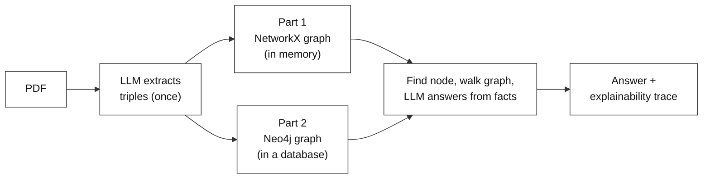
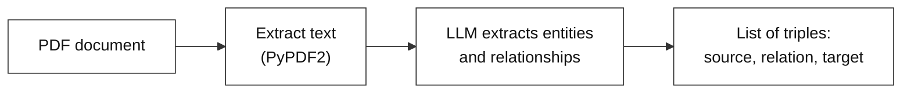
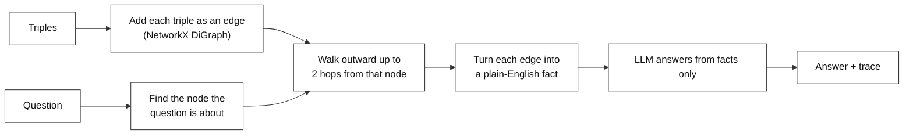
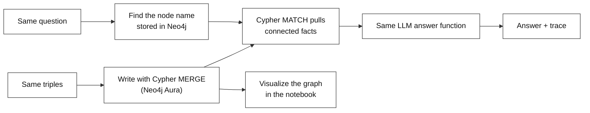
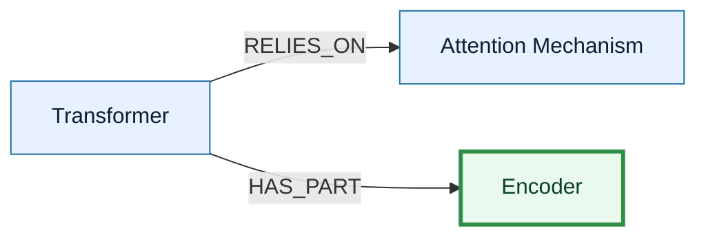
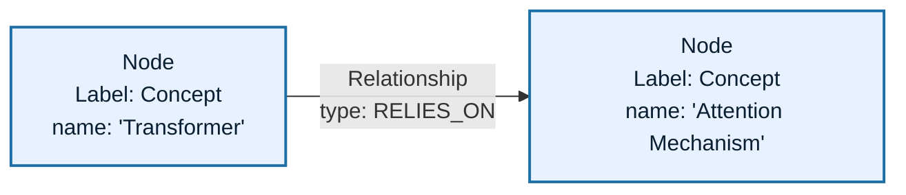
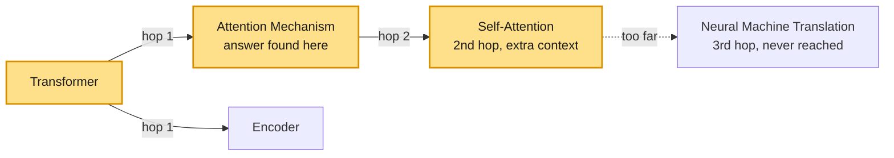

# End-to-End Graph RAG — From NetworkX to Neo4j

**Difficulty: Intermediate**

---

# Problem Statement / Use Case Overview

A normal RAG pipeline finds chunks of text that are *similar* to a question and hands them to an LLM. But similar is not the same as *connected*. When the answer depends on following a link between two facts ("the Transformer **relies on** attention"), a pile of similar-looking chunks can miss it.

This lab stores the document's facts as a **knowledge graph** instead: a network where each thing (an *entity*, such as "Transformer") is a dot, and each link between two things (a *relationship*, such as `RELIES_ON`) is an arrow. To answer a question, the pipeline finds the right dot, walks along its arrows to collect the connected facts, and only then asks the LLM to answer from those facts, with a written trail of how it got there.

You build it in two stages, on the same document and the same question:

1. **Part 1 — in memory.** Ask the LLM to pull entities and relationships out of a PDF *once*, build the graph with **NetworkX** (a Python graph library), and answer a question by walking it.
2. **Part 2 — in a database.** Write the *same* extracted facts into **Neo4j** (a database built for graphs), read them back with **Cypher** (Neo4j's query language), answer the *same* question, and look at the graph visually. The graph now survives after the notebook stops.

This is useful for:
- Questions that depend on *connections* between facts, not just matching words.
- Answers you must be able to check: every answer ships with the exact facts it used.
- Graphs that must persist, be shared, or be browsed visually.

### Which part teaches what

| Part | Steps | New idea | You will see |
|------|-------|----------|--------------|
| Setup | 1-3 | Turn a PDF into a list of `source -> relation -> target` facts, **once** | A printed list of extracted triples |
| Part 1 | 4-7 | Build an in-memory graph (NetworkX) and answer by walking it | An answer plus an explainability trace |
| Part 2 | 8-12 | Store the same graph in Neo4j, query it with Cypher, and view it | The same question answered from the database, plus a picture of the graph |

### How the parts connect



Both parts share the same extracted triples, the same node-finding function, and the same answering function. Only *where the graph lives* and *how it is read* changes.

---

# Input Data

| Item | Detail |
|------|--------|
| **The PDF** | The "Attention Is All You Need" paper, downloaded automatically from arXiv. Only the first 1500 characters of page 1 are used, so the LLM call stays fast. |
| **Your question** | `"What mechanism does the Transformer architecture rely on?"` |
| **OpenRouter API key** | Used to call the LLM. A free-tier model is used, so a full run costs nothing. |
| **Neo4j Aura credentials** | A URI, username, and password for a free Neo4j Aura instance (Part 2 only). |

---

# Processing

### Setup — turn the PDF into triples (done once)



A **triple** is one fact written as three parts, for example `Transformer -- RELIES_ON --> Attention Mechanism`. The LLM is called a single time; both parts reuse its result.

### Part 1 — build and walk a graph in memory



A **hop** is one step across a single arrow. Two hops reach a node's direct neighbours *and* their neighbours.

### Part 2 — the same graph in Neo4j



### How a graph gets built, one fact at a time

The graph is not planned in advance. Each triple adds one arrow, and any dot it mentions that does not exist yet is created on the spot:



Blue is what existed already; green is what the latest triple (`Transformer -- HAS_PART --> Encoder`) just added. After every triple is added, the full graph is ready to be queried.

---

# Output

**Setup** prints the extracted triples (the exact count, relation names, and wording vary from run to run; the LLM may label the link `BASED_ON` rather than `RELIES_ON`):

```
Extracted 30 relationships:
[
  {"source": "Attention Is All You Need", "relation": "AUTHORED_BY", "target": "Ashish Vaswani"},
  ...
]
```

**Part 1** prints the graph size, then the detected entity and a two-section answer:

```
Graph built: 28 nodes, 30 edges
[System Log] Auto-detected focus concept: 'Transformer'

--- FINAL ANSWER ---
The Transformer architecture relies on attention mechanisms.

--- AI TRACING & EXPLAINABILITY ---
The answer is derived from the relationship
Transformer --[BASED_ON]--> attention mechanisms, which states directly that
the architecture is based on attention mechanisms.
```

**Part 2** prints confirmation that the data reached Neo4j, the same two-section answer (now read from the database), and an interactive graph picture.

The explainability section always names the exact relationships used, so you can check the reasoning against the graph itself.

---

# Tech Stack

| Component | Tool |
|---|---|
| **PDF text extraction** | `PyPDF2` |
| **File downloading** | `requests` |
| **LLM (extraction and answering)** | `nvidia/nemotron-3-super-120b-a12b:free` via OpenRouter |
| **In-memory graph (Part 1)** | `NetworkX` (`DiGraph`, a graph whose arrows have a direction) |
| **Graph database (Part 2)** | `Neo4j Aura` (cloud-hosted, free tier) with the `neo4j` Python driver |
| **Query language (Part 2)** | `Cypher` |
| **Graph visualization (Part 2)** | `yfiles_jupyter_graphs_for_neo4j` |

---

# Underlying Concepts (Summarized)

**Knowledge graph.** Facts stored as a network: each entity is a **node** and each relationship is an **edge** (an arrow between two nodes). It lets you follow a chain of connected facts instead of looking facts up one at a time.

**Entity and relationship extraction.** Asking an LLM to read plain text and return the "who/what" (entities) and "how they connect" (relationships) as `source -> relation -> target` triples. The prompt names no fixed entity types, so the same code works on any document.

**Graph traversal.** Starting at one node and following its edges outward. In Part 1 this is a breadth-first walk limited to a number of hops; in Part 2 it is a Cypher pattern.

**Neo4j and the property graph model.** Neo4j stores relationships directly instead of rebuilding them from table joins. Its data has three pieces: **nodes** (optionally with a **label** such as `Concept`), **relationships** (each with a direction and an UPPERCASE type such as `RELIES_ON`), and **properties** (key-value details on either, such as `name: "Transformer"`).



**Cypher.** Neo4j's query language, written to look like the pattern it describes. `MERGE` means "find this if it exists, otherwise create it", which stops the same entity from being duplicated when it appears in many triples. `MATCH` describes a pattern to find and returns what fits.

```cypher
MERGE (s:Concept {name: "Transformer"})
MERGE (t:Concept {name: "Attention Mechanism"})
MERGE (s)-[:RELIES_ON]->(t)
```

**Graph RAG.** Retrieval-Augmented Generation where the retrieved material is *connected facts from a graph*, and the LLM is told to answer using only those facts.

> **Why this matters:** "What mechanism does the Transformer rely on?" is answered by finding the node "Transformer" and following its `RELIES_ON` edge, not by finding the most similar-sounding sentence. Storing the graph in Neo4j means that link survives between sessions and can be shared, inspected, and queried without repeating the extraction.

---

# Pre-requisites

- Basic Python (functions, loops, `import`).
- **An OpenRouter API key.** Sign up at [openrouter.ai](https://openrouter.ai) and create a key under **Keys**.
- **A Neo4j Aura instance** (Part 2). Steps below.
- A high-level idea of what a knowledge graph and RAG are (covered above).

### Getting Neo4j credentials (for Part 2)

1. Go to [neo4j.com/aura](https://neo4j.com/aura), sign up or log in.
2. Click **Create instance** and choose the **free tier**.
3. Aura shows a generated password **once**: download or copy it immediately (if missed, reset it from the instance settings).
4. When provisioning finishes (about a minute), the **Connection URI** is on the instance's overview page. It looks like `neo4j+s://xxxxxxxx.databases.neo4j.io`.
5. The **username** is `neo4j` by default.
6. Save the OpenRouter key and the three Neo4j values in the `.env` file next to this notebook, rather than pasting them into the notebook itself:

   ```bash
   OPENROUTER_API_KEY=<your OpenRouter API key>
   NEO4J_URI=neo4j+s://xxxxxxxx.databases.neo4j.io
   NEO4J_USERNAME=neo4j
   NEO4J_PASSWORD=<your instance password>
   ```

   The cells read them with `load_dotenv(".env")` + `os.getenv(...)`, so nothing sensitive ends up in the shared file.

---

# Environment / Dependencies Setup

| Package | Purpose |
|---------|---------|
| `networkx` | **In-memory graph** (Part 1) |
| `neo4j` | **Database driver** that connects to Aura and runs Cypher (Part 2) |
| `requests` | **File download** and calls to the LLM API |
| `PyPDF2` | **PDF text extraction** |
| `yfiles-jupyter-graphs-for-neo4j` | **Graph visualization** widget (Part 2) |
| `python-dotenv` | Loads the secrets from the `.env` file into the notebook |

> **Note:** Run this cell first. It only needs to run once per session.

```python
!pip install networkx neo4j requests PyPDF2 yfiles-jupyter-graphs-for-neo4j python-dotenv
```

## Import Libraries

```python
import os
import json
import requests
import PyPDF2
import networkx as nx
from dotenv import load_dotenv
from neo4j import GraphDatabase

# Load the secrets (OPENROUTER_API_KEY, NEO4J_*) from the .env file next to this notebook
load_dotenv(".env")
```

| Import | Purpose |
|---|---|
| `os`, `json` | File paths, reading secrets with `os.getenv(...)`, and parsing the LLM's JSON reply |
| `load_dotenv` | Loads the `.env` file into the environment |
| `requests` | Downloads the PDF and calls the LLM API |
| `PyPDF2` | Reads the PDF |
| `networkx` | The in-memory graph (Part 1) |
| `GraphDatabase` | Opens the Neo4j connection (Part 2) |

## Configure the LLM

```python
OPENROUTER_API_KEY = os.getenv("OPENROUTER_API_KEY")

if not OPENROUTER_API_KEY:
    OPENROUTER_API_KEY = input("Enter your OpenRouter API key (get one at https://openrouter.ai): ").strip()
else:
    print("Success: API Key loaded!")

OPENROUTER_URL = "https://openrouter.ai/api/v1/chat/completions"
TEXT_MODEL = "nvidia/nemotron-3-super-120b-a12b:free"


def ask_llm(prompt):
    """Send one prompt to the LLM and return its text reply (used by every step)."""
    payload = {
        "model": TEXT_MODEL,
        "messages": [{"role": "user", "content": prompt}],
        "temperature": 0.0,
        # This model "thinks" before answering; turning that off stops it from
        # using up its whole token budget on hidden reasoning and returning nothing.
        "reasoning": {"enabled": False},
    }
    headers = {"Authorization": f"Bearer {OPENROUTER_API_KEY}"}
    resp = requests.post(OPENROUTER_URL, headers=headers, json=payload)
    resp.raise_for_status()
    # the reply text sits on the usual OpenAI path: choices[0] -> message -> content
    return resp.json()["choices"][0]["message"]["content"].strip()
```

The key is read from the `.env` file (loaded in the imports step), falling back to a prompt if it isn't there. `ask_llm` is written once here and reused for extraction (Step 3) and for answering (Steps 6 and 11). `temperature=0.0` keeps replies consistent, which matters when the reply must parse as exact JSON.

---

# Step-wise Instructions — Development

## Setup — From PDF to Triples

### Step 1 — Download the Target Document

```python
PDF_URL = "https://arxiv.org/pdf/1706.03762.pdf"

os.makedirs("data", exist_ok=True)
PDF_PATH = os.path.join("data", "document.pdf")

try:
    print("Downloading document...")
    response = requests.get(PDF_URL)
    response.raise_for_status()

    with open(PDF_PATH, "wb") as f:
        f.write(response.content)

    print(f"Success! PDF stored at: {PDF_PATH}")
except Exception as e:
    print(f"Error downloading PDF: {e}")
```

By the end of this step the PDF exists at `data/document.pdf`. Nothing has been read from it yet.

---

### Step 2 — Extract Text via PyPDF2

Only the first 1500 characters of page 1 are kept, so the text sent to the LLM stays short.

```python
with open(PDF_PATH, "rb") as file:
    reader = PyPDF2.PdfReader(file)
    sample_text = reader.pages[0].extract_text()

sample_text = sample_text[:1500].strip()
print(f"Success! Extracted {len(sample_text)} characters.")
```

`sample_text` now holds a short block of plain text, ready for the LLM.

---

### Step 3 — Extract Triples with the LLM (done once)

The prompt names no entity types, so it works the same on any document. It lives in a variable so the function stays short.

```python
EXTRACT_PROMPT = """
You are an expert knowledge graph builder. Read the text below and extract all key entities and their relationships.

Text:
{text}

CRITICAL INSTRUCTIONS:
Output ONLY a valid JSON list of objects with keys "source", "relation", and "target".
Example format:
[
  {{"source": "Entity_A", "relation": "RELATES_TO", "target": "Entity_B"}},
  {{"source": "Entity_C", "relation": "CAUSES", "target": "Entity_D"}}
]
Do not add any Markdown code blocks, explanations, or introductory text. Return ONLY pure JSON.
"""


def extract_graph_elements(text):
    """Use the LLM to turn raw text into a list of source/relation/target triples."""
    try:
        raw_json = ask_llm(EXTRACT_PROMPT.format(text=text))

        # Some models wrap the JSON in a ``` fence; strip it if present.
        if raw_json.startswith("```"):
            raw_json = raw_json.split("\n", 1)[1].rsplit("```", 1)[0].strip()

        return json.loads(raw_json)
    except Exception as e:
        print(f"Extraction Error: {e}")
        return []
```

Run it **once** and inspect the result:

```python
extracted_relationships = extract_graph_elements(sample_text)
print(f"Extracted {len(extracted_relationships)} relationships:\n")
print(json.dumps(extracted_relationships, indent=2))
```

`extracted_relationships` is a plain Python list of triples. Part 1 and Part 2 both use this same list, so the LLM is never asked to extract twice.

**What you should see:** a count and a JSON list of `source` / `relation` / `target` objects.

---

## Part 1 — A Graph in Memory (NetworkX)

New idea: store the triples as a graph in Python and answer a question by walking it.

### Step 4 — Build the Knowledge Graph

Each triple becomes one directed edge: the entity that acts points to the entity it acts on, labelled with the relationship.

```python
G = nx.DiGraph()

for rel in extracted_relationships:
    src = rel["source"].strip()
    tgt = rel["target"].strip()
    relation_type = rel["relation"].strip()

    G.add_edge(src, tgt, relation=relation_type)

print(f"Graph built: {G.number_of_nodes()} nodes, {G.number_of_edges()} edges")
```

`add_edge` creates any node that does not exist yet, so the graph simply accumulates. `G` is now the knowledge base the next steps search.

**What you should see:** a node count and an edge count (the edge count can be slightly lower than the triple count if the LLM repeated a fact).

---

### Step 5 — Find the Starting Node and Walk the Graph

Two small functions: one finds which entity a question is about, the other walks outward from it to collect connected facts.

```python
def find_node_in_question(question, node_names):
    """Return the known entity whose name appears in the question (longest match wins)."""
    matches = [n for n in node_names if n.lower() in question.lower()]
    return max(matches, key=len) if matches else None
```

It takes a plain list of names, so Part 2 can reuse it with names read from Neo4j.

```python
def traverse_subgraph(graph, start_node, radius=2):
    """Collect every relationship within `radius` hops of a node, as readable facts."""
    # Breadth-first walk: every node reachable from start_node in <= radius hops
    reachable = nx.single_source_shortest_path_length(graph, start_node, cutoff=radius).keys()
    subgraph = graph.subgraph(reachable)

    facts = []
    for u, v, data in subgraph.edges(data=True):
        facts.append(f"{u} --[{data.get('relation', 'CONNECTED_TO')}]--> {v}")
    return facts
```

`nx.single_source_shortest_path_length(..., cutoff=radius)` is the walk: it follows arrows out from the start node and stops after `radius` hops. Each edge among the reached nodes becomes a sentence-like fact such as `Transformer --[RELIES_ON]--> Attention Mechanism`.



*(Illustrative sketch of a radius-2 walk. The real graph depends on what the LLM extracted.)*

**What you should see:** nothing printed yet; these are building blocks for Step 6.

---

### Step 6 — Answer From the Facts

One shared answering function takes any list of facts and the question, and returns an answer plus an explainability trace. Part 2 reuses it unchanged.

```python
QA_TEMPLATE = """
You are an expert AI research assistant using a Knowledge Graph.
Answer the question using ONLY the connected relationship paths provided below.

Graph Relationships:
{facts_block}

Question: {question}

CRITICAL INSTRUCTIONS:
Output your response in EXACTLY two sections as shown below.

--- FINAL ANSWER ---
[Provide a direct, simple, 1-sentence answer.]

--- AI TRACING & EXPLAINABILITY ---
[Explain step-by-step how the answer was derived from the graph. Use an objective, third-person perspective. Do NOT use first-person pronouns like "I" or "my".]
"""


def answer_from_facts(question, facts):
    """Ask the LLM to answer using only the given facts, with a reasoning trace."""
    facts_block = "\n".join(f"- {f}" for f in facts)
    try:
        return ask_llm(QA_TEMPLATE.format(facts_block=facts_block, question=question))
    except Exception as e:
        return f"Error executing Graph RAG: {e}"
```

The in-memory pipeline is then three lines of logic: find the node, walk the graph, answer.

```python
def execute_graph_rag(question):
    """Part 1 pipeline: find the node, walk the NetworkX graph, answer."""
    target_entity = find_node_in_question(question, G.nodes)
    if not target_entity:
        return f"Could not find any known concepts in your question. Known concepts: {list(G.nodes)[:5]}..."

    print(f"[System Log] Auto-detected focus concept: '{target_entity}'")
    facts = traverse_subgraph(G, target_entity, radius=2)
    if not facts:
        return f"Found the concept '{target_entity}', but no relationships are connected to it."

    return answer_from_facts(question, facts)
```

If no entity matches, the function stops and lists some known ones instead of guessing.

---

### Step 7 — Test Part 1

```python
QUESTION = "What mechanism does the Transformer architecture rely on?"
print(execute_graph_rag(QUESTION))
```

**What you should see:** the detected concept (`Transformer`), a one-sentence `--- FINAL ANSWER ---` naming the attention mechanism, and a third-person `--- AI TRACING & EXPLAINABILITY ---` section listing the edges followed.

Limits of Part 1: the graph lives only in this notebook's memory. When the session ends, it is gone, and nothing outside Python can browse or query it. Part 2 fixes that.

---

## Part 2 — The Same Graph in a Database (Neo4j)

New idea: write the *same* `extracted_relationships` into Neo4j and read them back with Cypher. No extraction is repeated.

### Step 8 — Connect to Neo4j

```python
# Values come from the .env file loaded in the imports step
NEO4J_URI = os.getenv("NEO4J_URI")
NEO4J_USER = os.getenv("NEO4J_USERNAME")
NEO4J_PASSWORD = os.getenv("NEO4J_PASSWORD")

driver = GraphDatabase.driver(NEO4J_URI, auth=(NEO4J_USER, NEO4J_PASSWORD))
driver.verify_connectivity()
print("Success: Connected to Neo4j Database!")
```

> **Note:** `NEO4J_URI`, `NEO4J_USERNAME` and `NEO4J_PASSWORD` are read from the `.env` file — make sure they match the Aura instance from the credentials section above. `verify_connectivity()` checks the URI, username, and password immediately, so a connection problem shows up here and not several steps later.

---

### Step 9 — Write the Triples into Neo4j

Each triple becomes two `Concept` nodes and one relationship, written with `MERGE` so repeated entities are never duplicated.

```python
def insert_into_neo4j(tx, relationships):
    for rel in relationships:
        source = rel["source"].strip()
        target = rel["target"].strip()

        # Neo4j relationship types are UPPERCASE_WITH_UNDERSCORES (e.g. HAS_AUTHOR)
        relation_type = rel["relation"].strip().replace(" ", "_").replace("-", "_").upper()

        query = f"""
        MERGE (s:Concept {{name: $source}})
        MERGE (t:Concept {{name: $target}})
        MERGE (s)-[:{relation_type}]->(t)
        """
        tx.run(query, source=source, target=target)


with driver.session() as session:
    session.run("MATCH (n) DETACH DELETE n")  # start from an empty database
    print("Database cleared for fresh ingestion.")

    session.execute_write(insert_into_neo4j, extracted_relationships)
    print("Success: Knowledge Graph loaded into Neo4j!")
```

`$source` and `$target` are **query parameters**: Neo4j fills them in safely from the Python values. A relationship *type* cannot be a parameter, which is why it is placed into the query text after being cleaned up. `execute_write` runs the whole loop in one transaction (all-or-nothing).

Check that the data really arrived by counting what is stored:

```python
with driver.session() as session:
    # .single() returns the one row; ["c"] reads the column aliased AS c
    n_nodes = session.run("MATCH (n:Concept) RETURN count(n) AS c").single()["c"]
    n_edges = session.run("MATCH ()-[r]->() RETURN count(r) AS c").single()["c"]
print(f"Neo4j now holds {n_nodes} nodes and {n_edges} relationships.")
```

**What you should see:** the two confirmation lines, then counts that match the NetworkX graph from Step 4 (relationship types are normalised, so tiny differences are possible).

---

### Step 10 — Query the Graph with Cypher

Same two jobs as Step 5, now done by the database: list the stored names so the question can be matched, then pull the connected facts.

```python
def fetch_node_names():
    """Read every Concept name stored in Neo4j."""
    with driver.session() as session:
        return [record["name"] for record in session.run("MATCH (c:Concept) RETURN c.name AS name")]


def fetch_graph_context(entity_name, hops=2):
    """Pull every relationship within `hops` steps of a node, as readable facts."""
    # Cypher cannot take the path length as a parameter, so it is placed in the text
    # (int() makes sure only a number can ever get in).
    query = f"""
    MATCH p = (n:Concept {{name: $name}})-[*1..{int(hops)}]-(m:Concept)
    UNWIND relationships(p) AS r
    RETURN DISTINCT startNode(r).name AS source, type(r) AS relation, endNode(r).name AS target
    """
    with driver.session() as session:
        result = session.run(query, name=entity_name)
        return [f"{rec['source']} --[{rec['relation']}]--> {rec['target']}" for rec in result]
```

`[*1..2]` means "a path of one to two relationships, in either direction", the Cypher version of Part 1's radius-2 walk. `UNWIND relationships(p)` splits each path into its individual relationships, and `DISTINCT` removes repeats. Matching the question to a node reuses `find_node_in_question` from Step 5.

```python
focus = find_node_in_question(QUESTION, fetch_node_names())
print(f"Focus node: {focus}")
for fact in fetch_graph_context(focus, hops=1):
    print(" ", fact)
```

**What you should see:** the focus node (`Transformer`) and its direct (1-hop) facts as `A --[TYPE]--> B` lines.

---

### Step 11 — Answer the Same Question from Neo4j

Only the retrieval changes. The answering function from Step 6 is reused as is.

```python
def execute_neo4j_rag(question):
    """Part 2 pipeline: find the node in Neo4j, fetch its facts with Cypher, answer."""
    target_entity = find_node_in_question(question, fetch_node_names())
    if not target_entity:
        return "Could not find any known concepts from the database in your question."

    print(f"[System Log] Auto-detected focus concept: '{target_entity}'")
    facts = fetch_graph_context(target_entity, hops=2)
    if not facts:
        return f"Found '{target_entity}' in Neo4j, but no relationships were connected to it."

    return answer_from_facts(question, facts)


print(execute_neo4j_rag(QUESTION))
```

**What you should see:** the same kind of answer as Step 7 (the Transformer relies on attention), now produced from facts read out of the database. The wording differs slightly between runs, but the cited relationship should match.

---

### Step 12 — Visualize the Graph

Because the graph lives in Neo4j, it can be drawn inside the notebook using the connection from Step 8.

```python
from yfiles_jupyter_graphs_for_neo4j import Neo4jGraphWidget

widget = Neo4jGraphWidget(driver)
widget.show_cypher("MATCH (n)-[r]->(m) RETURN n, r, m")
```

`show_cypher` sends a Cypher query to Neo4j and draws the result as a zoomable, clickable graph. The same query (or `MATCH (n) RETURN n`) can be pasted into the Neo4j Aura browser, since the data lives in the database and not in this notebook.

**What you should see:** an interactive picture of the nodes and labelled arrows (it renders in Jupyter, not in a plain-text terminal).

Finally, close the connection when you are done:

```python
driver.close()
```

---

# What We Learnt

A PDF became a knowledge graph through one LLM extraction, and that single list of triples was used twice: first as an in-memory NetworkX graph walked with a breadth-first search, then as a persistent Neo4j graph read with Cypher. The same question was answered both ways, each time with a written trail of the relationships followed.

**Key takeaways:**
- **Graphs capture connections that similarity search can miss.** Following an actual relationship path answers questions that word or meaning matching would struggle with.
- **Extraction is domain-agnostic and done once.** The LLM decides what counts as an entity or relationship; downstream parts reuse its output.
- **Radius (or `[*1..N]` in Cypher) controls reach.** Two hops pick up connections-of-connections, not just direct neighbours.
- **Neo4j makes the graph persistent.** It survives after the notebook ends and can be queried, shared, and visualized independently of the code that built it.
- **`MERGE` keeps ingestion safe.** The same entity can appear in many triples without creating duplicate nodes.
- **Only retrieval changes between parts.** Node finding and answering are shared, so swapping the graph store did not touch the answering logic.
- **Answers come with a reasoning trail.** Every answer names the graph relationships it used, so it can be checked.
