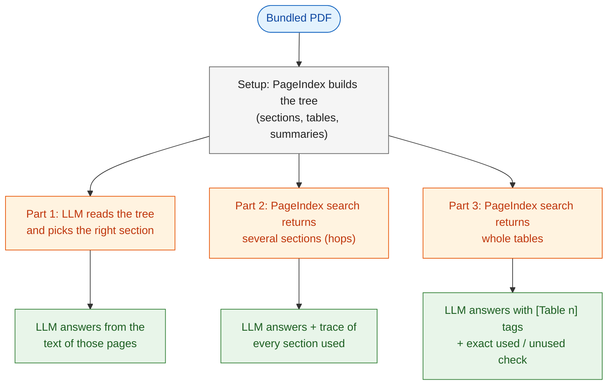
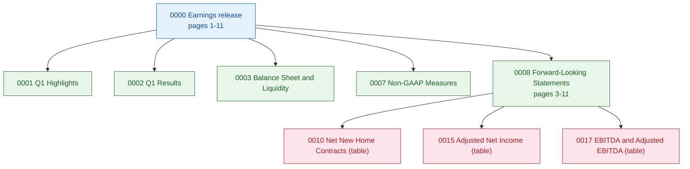
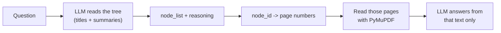
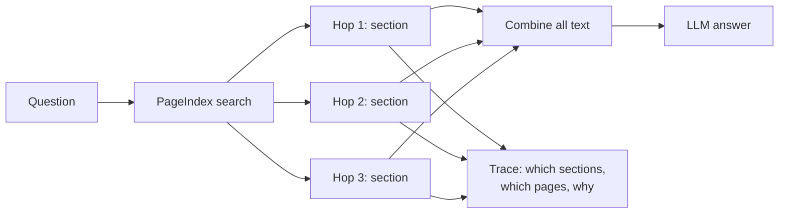
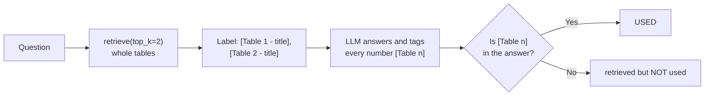

# Vectorless RAG

---

# Problem Statement / Use Case Overview

You have a company's earnings report as a PDF and a few questions. "How much cash did the company have at the end of the quarter?" lives in one paragraph. "Did profit go up or down, and does the adjusted number tell a different story?" needs numbers from two different places. "What was total revenue?" lives inside a table, and if that table gets chopped in half, the number loses its column header and the answer turns into a guess.

Normal RAG handles this by cutting the document into small chunks, turning each chunk into a vector (a list of numbers that captures meaning), and searching those vectors for the closest match. That works, but it needs an embedding model and a vector database, and chunking is exactly what slices tables apart.

**Vectorless RAG** skips all of that. A tool called **PageIndex** reads the PDF once and builds a **tree** of it: sections, sub-sections and whole tables, each with a short summary. Then retrieval is done by *reading and reasoning* instead of by vector search. This lab builds that idea in three parts, on one document and one running set of questions:

1. **Reasoning retrieval** — an LLM reads the tree's titles and summaries and picks the right section, like a person scanning a table of contents.
2. **Multi-hop retrieval** — for a question that needs facts from several places, collect text from several sections ("hops") and record where each piece came from.
3. **Table retrieval** — tables come back whole, every number in the answer carries a `[Table n]` tag, and the lab checks which tables were actually used.

This is useful for:
- **Earnings reports and financial filings**, where numbers sit in tables and must be traceable.
- **Contracts, policies and manuals**, where one section changes the meaning of another.
- **Any structured PDF** where you want answers without running a vector database.

### Which part teaches what

| Part | New idea | What you build |
|------|----------|----------------|
| Setup | Index the PDF once | `tree` (the document's outline), `call_llm` |
| Part 1 | Retrieve by reasoning over the tree | `pick_sections`, `reasoning_rag` |
| Part 2 | Multi-hop: gather from several sections, with a trace | `retrieve`, `multi_hop_rag`, `explain` |
| Part 3 | Whole tables, `[Table n]` citations, exact used/unused check | `table_rag` |

---

# Input Data

| Item | Detail |
|------|--------|
| **The PDF** | Century Communities' Q1 2025 earnings release (public SEC Form 8-K, Exhibit 99.1), bundled in `data/CCS-Q1-2025-Earnings-Release.pdf` — 11 pages, nothing to download. The same file is used in all three parts. |
| **Your questions** | One per part: a single-section question, a two-section question, and a table lookup. |
| **PageIndex API key** | Used to read the PDF into a tree and to search it. Sign up at [pageindex.ai](https://pageindex.ai). |
| **OpenRouter API key** | Used to call the LLM (a free-tier model, so a full run costs nothing). |

---

# Processing

### How the Parts Connect

The PDF is indexed **once** in Setup. Every part reuses the same tree and the same `call_llm` helper.



### What PageIndex Builds (the Tree)

PageIndex looks for a table of contents (or, if there is none, has an LLM infer where sections start), splits big sections into smaller ones, keeps each table as one unit, and writes a short summary per node. Each **node** has a `node_id`, a `title`, a page range (`start_index` to `end_index`), a `summary`, and optionally child `nodes`. For this PDF the tree looks roughly like this (PageIndex uses an LLM, so the exact nodes can differ a little from run to run):



Notice that the financial tables are their own nodes where PageIndex splits them out — they are not cut apart.

---

# Output

For each part, a plain-language answer plus the evidence behind it. For example, Part 3 ends with something like:

> _"$903.2 million [Table 1]"_

followed by a short report saying which tables were retrieved, which page each came from, whether the answer actually cited it, and why it mattered.

---

# Tech Stack

| Component | Tool |
|---|---|
| **Document tree + search** | PageIndex API — builds the tree and runs the section/table search |
| **Page text** | PyMuPDF — pulls raw text from the PDF pages |
| **LLM** | `nvidia/nemotron-3-super-120b-a12b:free` via OpenRouter — picks sections, writes answers, explains sources |
| **LLM client** | LangChain (`langchain-openai`, `langchain-core`) — `ChatOpenAI` pointed at OpenRouter |
| **Keys** | Environment variables read with `os.getenv`, with an `input()` fallback |

---

# Underlying Concepts (Summarized)

**Vectorless RAG** replaces three things from normal RAG: the embedding model (no vectors), the vector store (no similarity search), and fixed-size chunking (no cutting by word count). What replaces them is a **document tree** and an LLM that reasons over it.

**Reasoning retrieval (Part 1).** The LLM is shown only titles and short summaries, never the full text. It answers "which sections probably contain the answer?" with a list of `node_id`s and a short reason. We then read the real text of those pages and let the LLM answer from it. Because the reason is written in words, you can check it — a similarity score can't be read that way.

**Multi-hop retrieval (Part 2).** A **hop** is one section visited on the way to an answer. Some questions need more than one hop: GAAP net income sits in one place and adjusted net income in another. We collect text from several sections, then answer. To keep it honest, every hop remembers its title, `node_id` and page numbers, so the answer comes with a trail.

**Table retrieval (Part 3).** Fixed-size chunking can cut a table so that numbers lose their column headers. PageIndex keeps each table whole. We label each retrieved table `[Table 1]`, `[Table 2]`, and tell the LLM to tag every number with its table. A table counts as "used" only if its tag appears in the answer — an exact check, not a guess.

> **Honesty note:** the "why this section mattered" text is written by the LLM from the retrieved content. PageIndex does not expose its internal scores, so this is a grounded explanation, not an official relevance score.

---

# Pre-requisites

- Basic Python (functions, loops, `import`).
- A **PageIndex API key** — sign up at [pageindex.ai](https://pageindex.ai).
- An **OpenRouter API key** — sign up at [openrouter.ai](https://openrouter.ai) and create one under **Keys**. The lab uses a free model, so no credits are needed.
- A rough idea of what an LLM is and what "RAG" means (Lab 1 covers it).

---

# Environment / Dependencies Setup

| Package | Purpose |
|---------|---------|
| `pageindex` | Builds the document tree and runs the search |
| `pymupdf` | Extracts raw text from PDF pages |
| `langchain-openai` | `ChatOpenAI`, an OpenAI-compatible client we point at OpenRouter |
| `langchain-core` | The `HumanMessage` type |

```python
!pip install -q pageindex pymupdf langchain-core langchain-openai
```

## Import Libraries

```python
import json
import os
import re
import time

import pymupdf
from langchain_core.messages import HumanMessage
from langchain_openai import ChatOpenAI
from pageindex import PageIndexClient, utils
```

## Add Your Keys

Each cell reads the key from an environment variable if it exists and otherwise asks you to paste it.

```python
OPENROUTER_API_KEY = os.getenv("OPENROUTER_API_KEY")
if not OPENROUTER_API_KEY:
    OPENROUTER_API_KEY = input("Enter your OpenRouter API key (get one at https://openrouter.ai): ").strip()

PAGEINDEX_API_KEY = os.getenv("PAGEINDEX_API_KEY")
if not PAGEINDEX_API_KEY:
    PAGEINDEX_API_KEY = input("Enter your PageIndex API key (get one at https://pageindex.ai): ").strip()
os.environ["PAGEINDEX_API_KEY"] = PAGEINDEX_API_KEY

pi_client = PageIndexClient(api_key=PAGEINDEX_API_KEY)
print("Keys loaded.")
```

**What you should see:** `Keys loaded.`

## Set Up the LLM

`call_llm(prompt)` sends one prompt and returns the reply text. It is used in every part. `temperature=0` keeps answers repeatable. The model is a *reasoning* model, so `extra_body={"reasoning": {"enabled": False}}` turns its hidden thinking off; without it, it can spend the whole `max_tokens` budget thinking and return an empty answer.

```python
llm = ChatOpenAI(
    model="nvidia/nemotron-3-super-120b-a12b:free",
    openai_api_key=OPENROUTER_API_KEY,
    openai_api_base="https://openrouter.ai/api/v1",
    temperature=0,
    max_tokens=512,
    extra_body={"reasoning": {"enabled": False}},
)

def call_llm(prompt):
    return llm.invoke([HumanMessage(content=prompt)]).content.strip()
```

---

# Step-wise Instructions — Development

---

### Setup — Index the PDF Once

The PDF is bundled in `data/`. We send it to PageIndex, wait until the tree is ready, and fetch it. This is the slow step (it can take a minute or two), so it happens **once**; Parts 1, 2 and 3 all reuse `doc_id` and `tree`.

```python
PDF_PATH = os.path.join("data", "CCS-Q1-2025-Earnings-Release.pdf")
if not os.path.exists(PDF_PATH):
    raise FileNotFoundError(f"Could not find '{PDF_PATH}'. Run the notebook from the lab folder.")

doc_id = pi_client.submit_document(PDF_PATH)["doc_id"]
print(f"Submitted: {doc_id}")

elapsed = 0
while not pi_client.is_retrieval_ready(doc_id):
    if elapsed >= 600:
        raise TimeoutError("PageIndex timeout")
    time.sleep(5)
    elapsed += 5
print(f"Tree ready after about {elapsed}s.")

tree = pi_client.get_tree(doc_id, node_summary=True)["result"]
utils.print_tree(tree)
```

**What you should see:** a tree with one root (`0000`, pages 1-11) and children such as `First Quarter 2025 Highlights`, `Balance Sheet and Liquidity`, `Non-GAAP Financial Measures` and `Forward-Looking Statements`, which in many runs has sub-nodes for the report's tables (`Net New Home Contracts`, `Home Deliveries`, `Adjusted Net Income ...`, `EBITDA and Adjusted EBITDA`, and so on). Each node has a summary. The exact tree can vary slightly between runs.

---

### Part 1 — Reasoning Retrieval: Let the LLM Pick the Section

**The idea:** give the LLM the tree (titles and summaries only) and ask which sections hold the answer. Then read the text of those pages and answer from it. No vectors anywhere.



First, the search step. The prompt demands JSON, and `parse_json` has a fallback for when the LLM wraps the JSON in extra words:

```python
def parse_json(reply):
    try:
        return json.loads(reply)
    except json.JSONDecodeError:
        match = re.search(r"\{.*\}", reply, re.DOTALL)
        return json.loads(match.group()) if match else {"thinking": "", "node_list": []}

def pick_sections(query):
    prompt = f"""You MUST respond with valid JSON only. No other text.

You are given a question and a document tree. Each node has: node_id, title, summary.
Pick the most specific nodes likely to contain the answer.

Question: {query}

Document tree:
{json.dumps(tree, indent=1)}

Respond with ONLY this JSON:
{{"thinking": "<your reasoning>", "node_list": ["node_id_1", "node_id_2"]}}"""
    return parse_json(call_llm(prompt))
```

Next, turn the chosen `node_id`s into page text. `node_map` looks up each node's page range; `page_texts` holds the raw text of every page. We read at most 3 pages per node so one huge node cannot flood the prompt.

```python
node_map = utils.create_node_mapping(tree, include_page_ranges=True)

doc = pymupdf.open(PDF_PATH)
page_texts = {i + 1: doc.load_page(i).get_text() for i in range(len(doc))}
doc.close()

def build_context(node_ids, max_pages=3):
    pages = []
    for nid in node_ids:
        if nid in node_map:
            info = node_map[nid]
            span = range(info["start_index"], info["end_index"] + 1)
            pages += [p for p in list(span)[:max_pages] if p not in pages]
    context = "\n\n".join(f"--- Page {p} ---\n{page_texts[p]}" for p in pages)
    return context, pages
```

Finally, the whole of Part 1 in one function, then run it:

```python
def reasoning_rag(query):
    picked = pick_sections(query)
    print("Reasoning:", picked.get("thinking", "")[:300])
    for nid in picked.get("node_list", []):
        title = node_map[nid]["node"]["title"] if nid in node_map else "not in tree"
        print(f"  picked {nid} | {title}")
    context, pages = build_context(picked.get("node_list", []))
    if not context:
        return "No relevant section found.", pages
    answer = call_llm(f"""Answer using only the context. If the answer is not there, say so. Be concise.

Context:
{context}

Question: {query}""")
    return answer, pages

QUERY_1 = "How much cash and total liquidity did the company have at the end of the first quarter?"
print("Question:", QUERY_1, "\n")
answer_1, pages_1 = reasoning_rag(QUERY_1)
print("\nPages read:", pages_1)
print("Answer:", answer_1)
```

**What you should see:** the LLM's reasoning, a pick such as `0003 | Balance Sheet and Liquidity` (page 2), and a short answer quoting the cash and liquidity figures from the document. You can read *why* it picked that node.

---

### Part 2 — Multi-Hop Retrieval: Collect From Several Sections

**The idea:** some questions need facts from more than one place. Instead of stopping at one section, we ask PageIndex's search for the top several matching sections and visit them one after another (each is a **hop**). For every hop we keep its title, `node_id`, pages and text, so we can show a trail afterward.



`retrieve` submits the question, waits for the search to finish (retrying on temporary hiccups such as rate limits), and turns each returned node into a small record. PageIndex puts the page inside a string like `"<physical_index_6>"`, so a tiny regex pulls out the number. Parts 2 and 3 both use this function.

```python
def retrieve(query, top_k=5):
    retrieval_id = pi_client.submit_query(doc_id=doc_id, query=query).get("retrieval_id")
    if not retrieval_id:
        return []

    nodes = []
    for _ in range(60):
        try:
            result = pi_client.get_retrieval(retrieval_id)
            if result.get("status") == "completed":
                nodes = result.get("retrieved_nodes", [])
                break
            if result.get("status") == "failed":
                return []
        except Exception as e:
            print(f"Temporary problem while polling, retrying... ({e})")
        time.sleep(3)

    items = []
    for i, node in enumerate(nodes[:top_k]):
        texts, pages = [], []
        for group in node.get("relevant_contents", []):
            for piece in group:
                if piece.get("relevant_content"):
                    texts.append(piece["relevant_content"])
                match = re.search(r"(\d+)", str(piece.get("physical_index", "")))
                if match and int(match.group(1)) not in pages:
                    pages.append(int(match.group(1)))
        items.append({"number": i + 1, "section": node.get("title") or f"Section {i + 1}",
                      "node_id": node.get("id", "unknown"), "pages": pages, "text": "\n".join(texts)})
    return items
```

`explain` prints the trail for any list of retrieved items: where each came from, whether the answer used it, and a short LLM-written reason. The `is_used` argument is a function so each part can plug in its own check.

```python
def explain(query, items, is_used, kind="Hop"):
    print("\n--- EXPLAINABILITY ---")
    for it in items:
        pages = ", ".join(map(str, it["pages"])) or "unknown"
        status = "USED in answer" if is_used(it) else "retrieved but NOT clearly used"
        print(f'\n{kind} {it["number"]}: "{it["section"]}"')
        print(f'node_id: {it["node_id"]} | page(s): {pages} | {status}')
        why = call_llm(f"""In 3-4 short lines, explain why the section below is relevant to the question.
Mention the actual numbers or facts in it. Do not repeat the question.

Question: {query}

Section title: {it["section"]}
Section content: {it["text"]}""")
        print("Why:", why)
```

Now the multi-hop pipeline. The "was it used" check here is a rough heuristic: does the section's title appear in the answer? It is only a guide; Part 3 replaces it with an exact check.

```python
def multi_hop_rag(query, top_k=5):
    hops = retrieve(query, top_k)
    if not hops:
        return "No relevant context found.", []
    context = "\n\n".join(h["text"] for h in hops)
    answer = call_llm(f"""You are a financial analyst. Answer using only the context below, in plain language,
the way you would explain it in a meeting. Be concise.

Context:
{context}

Question: {query}""")
    return answer, hops

QUERY_2 = ("How much did GAAP net income grow or shrink from Q1 2024 to Q1 2025? "
           "Separately, what was adjusted net income (not adjusted EBITDA) for both periods, "
           "and does it tell a different story?")
print("Question:", QUERY_2, "\n")
answer_2, hops = multi_hop_rag(QUERY_2)

print("--- SECTIONS SEARCHED ---")
for h in hops:
    print(f"Hop {h['number']}: {h['section']}")
print("\n--- ANSWER ---")
print(answer_2)

explain(QUERY_2, hops, is_used=lambda h: h["section"] in answer_2, kind="Hop")
```

**What you should see:** up to five hops (for example the results text, the highlights, and a larger section holding the adjusted-net-income table), an answer giving GAAP net income for both quarters (about $64.3 million down to $39.4 million) and adjusted net income for both (about $71.4 million down to $42.2 million), and the conclusion that both tell the same story. Below it, a trail with one entry per hop. Some hops may say they lack the numbers, and because the title-in-answer check is crude, even the hop that supplied the numbers can be marked `retrieved but NOT clearly used`. That is the honest trail of a search that cast a wide net, and it is exactly why Part 3 adds exact citations.

---

### Part 3 — Table Retrieval: Whole Tables With `[Table n]` Citations

**The idea:** a table lookup needs the table intact — headers, rows and footnotes together. PageIndex keeps tables as whole nodes, so `retrieve` already hands them back whole. What is new here is **proof**: we label each table `[Table 1]`, `[Table 2]` in the context and instruct the LLM to tag every number with its table. Then "was this table used?" is an exact check — is the tag in the answer?



The citation rule lives in its own prompt so you can read it on its own:

```python
table_prompt = """You are a financial data analyst. Answer ONLY from the text and tables below.
Pay strict attention to table rows, columns and footnotes. Do not round numbers unless asked.

CRITICAL RULES:
- Tag every number you use with its table, like this: [Table 1]
- If you use numbers from more than one table, tag each one separately.
- If the data is not in the text, say "Not found in document."

Context:
{context}

Question: {query}"""

def table_rag(query, top_k=2):
    tables = retrieve(query, top_k)
    if not tables:
        return "No relevant context found.", []
    context = "\n\n".join(f"[Table {t['number']} - {t['section']}]\n{t['text']}" for t in tables)
    return call_llm(table_prompt.format(context=context, query=query)), tables

QUERY_3 = "What was the total revenue for the three months ended March 31, 2025?"
print("Question:", QUERY_3, "\n")
answer_3, tables = table_rag(QUERY_3)

print("--- TABLES SEARCHED ---")
for t in tables:
    print(f"Table {t['number']}: {t['section']}")
print("\n--- ANSWER ---")
print(answer_3)

explain(QUERY_3, tables, is_used=lambda t: f"[Table {t['number']}]" in answer_3, kind="Table")
```

**What you should see:** two retrieved nodes (the search may return a whole results section or a table node, depending on the question), an answer of about `$903.2 million [Table 1]`, and a trail where the cited table is marked `USED in answer` and any uncited one is marked `retrieved but NOT clearly used`.

---

### Variations Worth Trying

Change one thing at a time and re-run the relevant part.

- **Part 1:** ask for a number that lives in a table (for example "How many homes were delivered?") and see whether the LLM picks a table node. Then swap the model in `llm` for another free OpenRouter model and compare which nodes it picks.
- **Part 2:** change `top_k` from 5 to 2, then to 8. Fewer hops can miss half the answer; more hops add noise.
- **Part 3:** ask "What was adjusted EBITDA for Q1 2025 and Q1 2024?" and check that the EBITDA table is retrieved whole and cited.

---

# What We Learnt

You built three kinds of retrieval on one PDF without a vector database, an embedding model or chunking.

**Key takeaways:**
- **PageIndex builds a tree** of sections and whole tables with summaries; it is indexed once and reused.
- **Reasoning retrieval** — an LLM reads titles and summaries, picks `node_id`s, and gives a readable reason.
- **Multi-hop** — questions that need several sections are answered by visiting several nodes and keeping a trail (title, `node_id`, pages).
- **Whole tables** — nothing is cut by word count, so numbers stay with their headers.
- **`[Table n]` citations** make "which table was used" an exact check instead of a guess.
- **Explanations are grounded, not official** — the "why" is written by the LLM from the retrieved text.
