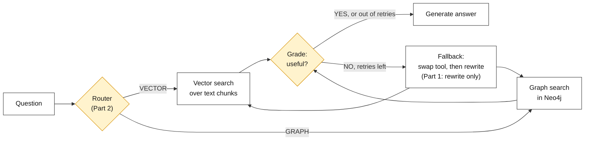
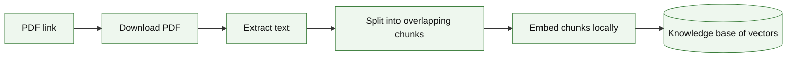
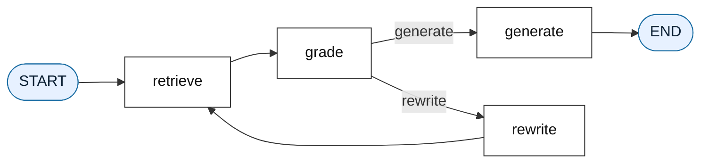
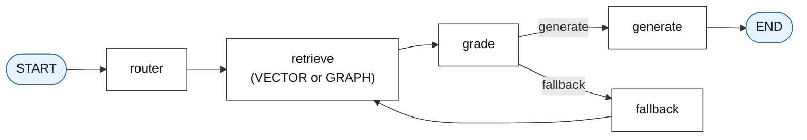

# Agentic RAG

---

# Problem Statement / Use Case Overview

A standard RAG pipeline follows one fixed path: retrieve some chunks, hand them to the LLM, get an answer. It never stops to check whether the chunks it found are any good. If retrieval pulls back weak or unrelated text, the LLM still has to answer with whatever it was given. And if the question is really about *connections* ("what is X built on?") but the only tool is a similarity search over text, the pipeline keeps using the wrong tool for the job.

### How This Lab Solves It

This lab turns the plain pipeline into an **agent** in two steps. An agent is a pipeline that checks its own progress and decides what to do next, instead of always running straight from start to finish.

- **Part 1 — Self-correction.** After retrieving, the pipeline asks the LLM: "Do these chunks actually help answer the question?" If not, the question is rewritten into a clearer one and retrieval is tried again, up to a fixed number of times.
- **Part 2 — Dynamic routing.** The agent gets a second tool (a knowledge graph in Neo4j, a graph database) next to the first (vector search over text). A **router** step reads each question and picks the tool that fits. If the chosen tool gives weak results, the agent first swaps to the other tool, and only rewrites the question if that also fails.

Both parts are built with **LangGraph**, a library for wiring steps into a graph where the path can branch and loop depending on what happens, instead of every step running once in order.

### Which Part Teaches What

| Part | New idea | What you add | What you should see |
|------|----------|--------------|---------------------|
| **Setup** | A shared document and models | Download the paper, split it into chunks, embed them | Chunks ready to search |
| **Part 1** | Grade, rewrite, retry | `grade`, `rewrite`, `generate` nodes and a retry limit around vector search | A good question answers on the first try; a bad one loops, then still answers |
| **Part 2** | Pick the tool, swap on failure | A Neo4j graph tool, a `router` node, a `fallback` node (swap first, rewrite second) | Meaning questions go to VECTOR, connection questions go to GRAPH |

This is useful for:
- **Vague or awkward questions** — the rewrite step gives retrieval a second chance with better wording.
- **Mixed question types in one pipeline** — "what is X?" and "what is X connected to?" need different tools, and the agent chooses automatically.
- **Recovering from a wrong tool choice, not just a bad question** — swapping tools first means a good question isn't needlessly rewritten.

---

# Input Data

| Item | Detail |
|------|--------|
| **The PDF** | The "Attention Is All You Need" paper, downloaded automatically from a link (only its first 1,500 characters are used, to keep the lab fast) |
| **Your questions** | Natural-language questions — some about meaning, some about connections |
| **LLM API key** | An OpenRouter key, used to grade, rewrite, route, extract the graph, and answer |
| **Neo4j Aura credentials** | A URI, username and password for a running (free) Neo4j Aura instance — needed from Part 2 |
| **Embedding model** | Runs locally — no key needed, downloaded automatically the first time it is used |

---

# Processing

### The Whole Lab at a Glance



Part 1 is this picture without the router and the graph tool: retrieve, grade, rewrite, repeat. Part 2 adds the router in front and the graph tool beside the vector tool. The grade, the rewrite and the answer steps are written once in Part 1 and reused unchanged in Part 2.

### Setup — One Document, Reused Everywhere



The PDF is downloaded once. Its text is cut into small overlapping chunks and each chunk is turned into a vector (a list of numbers that captures meaning). Both parts search this same document.

### Part 1 — The Self-Correcting Loop

LangGraph turns each step into a **node** and each arrow into an **edge**. Most edges are fixed, but the one leaving `grade` is a **conditional edge**: a small function looks at the state and chooses the next node.



A **retry counter** in the state goes up by one on every rewrite. When it reaches 2, the agent stops looping and answers with the best chunks it has, so it can never run forever.

### Part 2 — Router, Two Tools, Fallback



The `fallback` node replaces `rewrite` as the loop-back step. On the first failure it swaps the tool (a bad result is sometimes a sign the wrong tool was picked, not that the question was bad). On the second failure it rewrites the question with the very same `rewrite_node` from Part 1.

---

# Output

**Setup** prints the document and chunk sizes:

```
LLM and embedding model configured successfully!
Downloading PDF from https://arxiv.org/pdf/1706.03762.pdf...
PDF downloaded to data/downloaded_paper.pdf!
Extracted 1500 characters of text.
Knowledge base ready with 6 chunks.
Embedded 6 chunks (384 numbers each).
```

**Part 1** runs the loop twice. A good question is answered on the first pass; an off-topic question fails the grade, is rewritten, fails again, and still ends in an answer once the retry limit is reached:

```
Self-correcting agent compiled successfully!

Retrieving for: 'How does the Transformer work?'
Grade: YES
Retries used: 0
--- FINAL ANSWER ---
The Transformer works by using only attention mechanisms to connect the
encoder and decoder, without recurrence or convolutions.

--- EXPLAINABILITY ---
The text states: "We propose a new simple network architecture, the
Transformer, based solely on attention mechanisms, dispensing with
recurrence and convolutions" ...

Retrieving for: 'What is the boiling point of liquid nitrogen?'
Grade: NO
Rewritten question: What is the boiling point of liquid nitrogen in degrees Celsius?
Retrieving for: 'What is the boiling point of liquid nitrogen in degrees Celsius?'
Grade: NO
Rewritten question: What is the boiling point of liquid nitrogen in Celsius?
Retrieving for: 'What is the boiling point of liquid nitrogen in Celsius?'
Grade: NO
Retries used: 2
--- FINAL ANSWER ---
The document does not cover it.
```

**Part 2** builds the graph, then runs three questions through the router:

```
Connected to Neo4j successfully!
Cleared existing Neo4j database.
LLM extracted 13 nodes and 17 relationships.
Graph written into Neo4j.
Neo4j now holds 13 concepts, 9 relationships, and a vector index.
Routed agent compiled successfully!

ROUTER DECISION: Using VECTOR tool.
Retrieving for: 'What is the Transformer?' via VECTOR tool
Grade: YES
Tool at the end: VECTOR | Retries used: 0
--- FINAL ANSWER ---
The Transformer is a new simple network architecture based solely on
attention mechanisms, dispensing with recurrence and convolutions.

ROUTER DECISION: Using GRAPH tool.
Retrieving for: 'What models or mechanisms are sequence transduction models based on or connected to?' via GRAPH tool
Grade: YES
Tool at the end: GRAPH | Retries used: 0

ROUTER DECISION: Using VECTOR tool.
Retrieving for: 'What is the boiling point of liquid nitrogen?' via VECTOR tool
Grade: NO
Fallback: swapping tool from VECTOR to GRAPH
Retrieving for: 'What is the boiling point of liquid nitrogen?' via GRAPH tool
Grade: NO
Rewritten question: What is the boiling point of liquid nitrogen in degrees Celsius?
Retrieving for: '...in degrees Celsius?' via GRAPH tool
Grade: NO
Tool at the end: GRAPH | Retries used: 2
--- FINAL ANSWER ---
The document does not cover it.
```

---

# Tech Stack

| Component | Tool |
|---|---|
| **PDF Text Extraction** | `pypdf` — pulls raw text out of the PDF |
| **File Downloading** | `requests` — grabs the PDF from a link |
| **Text Chunking** | `langchain-text-splitters` (`RecursiveCharacterTextSplitter`) — overlapping chunks |
| **Embedding Model** | `sentence-transformers` / `all-MiniLM-L6-v2`, via `langchain-huggingface` — runs locally, 384-dimension vectors |
| **Similarity Search** | `scikit-learn` (`cosine_similarity`) — compares the question vector to every chunk vector |
| **Graph Database** | `neo4j` (Aura Free) — stores concepts and relationships, and a vector index over them |
| **LLM (grade, rewrite, route, extract, answer)** | `nvidia/nemotron-3-super-120b-a12b:free` through OpenRouter, using `langchain-openai`'s `ChatOpenAI` |
| **Agent Orchestration** | `langgraph` — wires the steps into a loopable graph |
| **Graph Visualization** | `yfiles-jupyter-graphs` — draws the Neo4j graph in the notebook |

---

# Underlying Concepts (Summarized)

**Agent** — a pipeline that checks its own progress partway through and decides what to do next. Deciding to loop back and try again, rather than moving forward blindly, is what separates an agent from a plain script.

**State** — the information the agent carries between steps: the current question, the facts retrieved so far, the latest grade, the retry count, and the final answer. Every node reads the state, updates part of it, and passes it on.

**LangGraph, node, edge, conditional edge** — LangGraph builds the agent as a graph of **nodes** (steps) joined by **edges** (arrows). A **conditional edge** picks its destination at run time from the state.

**Self-correction** — checking a result and going back to improve it if the check fails, instead of accepting the first attempt.

**Retry limit** — a cap on how many times the loop may repeat, so a question that never grades well still ends in an answer.

**Cosine similarity** — a way to measure how close two vectors are in meaning, regardless of their length. Retrieval uses it to rank chunks against the question.

**Knowledge graph** — concepts stored as **nodes** and the links between them as **relationships** (for example `Transformer --BASED_ON--> attention`). Following links is called **graph traversal**, and it suits questions about how things connect.

**Router** — a step that reads the question and picks which tool to use: VECTOR (meaning-based search over text) or GRAPH (relationship-based search in Neo4j).

**Fallback** — what the agent does after a bad grade: swap to the other tool first, rewrite the question second.

> **Why this matters:** A plain RAG pipeline cannot notice that its own retrieval failed, and it has only one way to search. Here the grade catches weak retrieval before it reaches the answer, the rewrite gives a bad question another chance, and the router and fallback make sure the question is searched with the right tool.

---

# Pre-requisites

- **Basic Python** (functions, loops, dictionaries).
- **A general sense of RAG and embeddings** — retrieving relevant text by vector similarity before asking an LLM to answer.
- **An OpenRouter API key** — used for every LLM call.
- **A Neo4j Aura Free instance** — only needed from Part 2.

## Getting an OpenRouter API Key

1. Go to [openrouter.ai](https://openrouter.ai) and sign up or log in.
2. Open the **Keys** section of the dashboard.
3. Click **Create Key**, name it, and confirm.
4. **Copy the key immediately** — it is shown in full only once.
5. Store it as an environment variable (`OPENROUTER_API_KEY`) rather than pasting it into the notebook. If it isn't set, the lab asks for it when you run it.

## Getting Neo4j Aura Credentials (for Part 2)

1. Go to [console.neo4j.io](https://console.neo4j.io) and create a free **AuraDB Free** instance.
2. Download or copy the connection details shown once at creation: the **URI** (starts with `neo4j+s://`), the **username** and the **password**.
3. Paste them into the credentials cell in Part 2 (`NEO4J_URI`, `NEO4J_USERNAME`, `NEO4J_PASSWORD`), or keep them in a `.env` file next to the notebook.

---

# Environment / Dependencies Setup

The cell below installs every package the lab needs:

| Package | Purpose |
|---------|---------|
| `langgraph` | **Agent orchestration** — builds the graph of nodes and edges |
| `langchain-openai` | Wraps the LLM in LangChain's `ChatOpenAI` interface |
| `langchain-huggingface` | Wraps the local embedding model |
| `langchain-text-splitters` | Splits the document into overlapping chunks |
| `pypdf` | PDF text extraction |
| `requests` | Downloads the PDF |
| `scikit-learn` | Provides `cosine_similarity` |
| `neo4j` | Python driver for the Neo4j database (Part 2) |
| `yfiles-jupyter-graphs` | Draws the Neo4j graph inside the notebook (Part 2) |

> **Note:** Run this cell first — it only needs to be run once per session.

```python
!pip install -qU langgraph langchain-openai langchain-huggingface langchain-text-splitters pypdf requests scikit-learn neo4j yfiles-jupyter-graphs
```

---

# Step-wise Instructions — Development

---

## Setup — Load the Document Once

### Step 1 — Imports

```python
import os
import json
import requests
from typing import TypedDict, List
from pypdf import PdfReader
from neo4j import GraphDatabase
from langchain_text_splitters import RecursiveCharacterTextSplitter
from langchain_openai import ChatOpenAI
from langchain_huggingface import HuggingFaceEmbeddings
from sklearn.metrics.pairwise import cosine_similarity
from langgraph.graph import StateGraph, START, END
from IPython.display import Image, display
```

All the imports for both parts sit here, so later steps only contain the new ideas.

---

### Step 2 — Configure the LLM and the Embedding Model

```python
OPENROUTER_API_KEY = os.getenv("OPENROUTER_API_KEY")

if not OPENROUTER_API_KEY:
    OPENROUTER_API_KEY = input("Enter your OpenRouter API key (get one at https://openrouter.ai): ").strip()

llm = ChatOpenAI(
    openai_api_key=OPENROUTER_API_KEY,
    openai_api_base="https://openrouter.ai/api/v1",
    model_name="nvidia/nemotron-3-super-120b-a12b:free",
    temperature=0.0,
    extra_body={"reasoning": {"enabled": False}},
)

embeddings = HuggingFaceEmbeddings(model_name="all-MiniLM-L6-v2")
print("LLM and embedding model configured successfully!")
```

One LLM connection serves every thinking step in both parts (grade, rewrite, route, answer). `temperature=0.0` keeps the YES/NO grade and the router's choice consistent. This model is a "reasoning" model that normally spends its token budget thinking before it answers, so `extra_body={"reasoning": {"enabled": False}}` switches that off and gets a direct reply. `all-MiniLM-L6-v2` is a small embedding model that runs on your machine.

---

### Step 3 — Download the PDF and Extract Text

```python
os.makedirs("data", exist_ok=True)

PDF_URL = "https://arxiv.org/pdf/1706.03762.pdf"
PDF_FILENAME = "data/downloaded_paper.pdf"

print(f"Downloading PDF from {PDF_URL}...")
response = requests.get(PDF_URL)
response.raise_for_status()

with open(PDF_FILENAME, "wb") as f:
    f.write(response.content)
print(f"PDF downloaded to {PDF_FILENAME}!")

reader = PdfReader(PDF_FILENAME)
document_text = ""
for page in reader.pages:
    document_text += page.extract_text() + "\n"
    if len(document_text) >= 1500:
        document_text = document_text[:1500]
        break

print(f"Extracted {len(document_text)} characters of text.")
```

`os.makedirs("data", exist_ok=True)` creates the `data` folder if it does not exist yet. By the end, `document_text` holds a short block of plain text — the one document both parts will use.

---

### Step 4 — Split into Chunks and Embed Them

```python
text_splitter = RecursiveCharacterTextSplitter(
    chunk_size=300,
    chunk_overlap=50,
    separators=["\n\n", "\n", ".", " ", ""]
)
knowledge_base = text_splitter.split_text(document_text)
print(f"Knowledge base ready with {len(knowledge_base)} chunks.")

knowledge_vectors = embeddings.embed_documents(knowledge_base)
print(f"Embedded {len(knowledge_vectors)} chunks ({len(knowledge_vectors[0])} numbers each).")
```

The splitter breaks on paragraph breaks first, then line breaks, then sentence endings, and only cuts mid-sentence as a last resort. `chunk_overlap=50` makes neighbouring chunks share a little text so a sentence at a boundary is not lost. `knowledge_vectors` holds one vector per chunk, in the same order as `knowledge_base`.

**What you should see:** a handful of chunks (about 6), each embedded as a 384-number vector.

---

## Part 1 — The Self-Correcting Loop

### Step 5 — Define the Agent's State

```python
class AgentState(TypedDict):
    question: str               # the current question (may get rewritten)
    retrieved_facts: List[str]  # chunks found so far
    grade: str                  # "YES" or "NO" from the grading step
    retry_count: int            # how many times we have tried again
    final_answer: str           # filled in only at the end


def new_state(question: str, **extra) -> dict:
    """A fresh starting state for one question."""
    return {"question": question, "retrieved_facts": [], "grade": "",
            "retry_count": 0, "final_answer": "", **extra}
```

The state is the shared notebook every node writes into. `new_state` builds a fresh one so each run starts clean.

---

### Step 6 — Retrieve Node (Vector Search)

```python
def vector_search(question: str, top_k: int = 2) -> List[str]:
    """Return the top_k chunks whose meaning is closest to the question."""
    question_vector = embeddings.embed_query(question)
    scores = cosine_similarity([question_vector], knowledge_vectors)[0]
    top_indices = scores.argsort()[-top_k:][::-1]   # best match first
    return [knowledge_base[i] for i in top_indices]


def retrieve_node(state: AgentState) -> AgentState:
    print(f"Retrieving for: '{state['question']}'")
    state["retrieved_facts"] = vector_search(state["question"])
    return state
```

`vector_search` is the first **tool**: embed the question the same way the chunks were embedded, score every chunk with cosine similarity, and keep the best two. The node reads `state["question"]` rather than a fixed value, so a rewritten question is picked up automatically on the next loop.

---

### Step 7 — Grade Node

```python
def grade_node(state: AgentState) -> AgentState:
    facts_text = "\n".join(state["retrieved_facts"])

    prompt = f"""
    You are a grading assistant evaluating search results.

    Question: {state['question']}
    Retrieved facts:
    {facts_text}

    Do these facts contain ANY relevant hints, keywords, or partial information that could help answer the question?
    Reply with ONLY one word: YES or NO.
    """

    raw_grade = llm.invoke(prompt).content.strip().upper()
    state["grade"] = "YES" if "YES" in raw_grade else "NO"
    print(f"Grade: {state['grade']}")
    return state
```

The prompt asks for *any* helpful hint, not a perfect answer, so partly useful chunks are not rejected. Checking `"YES" in raw_grade` instead of an exact match is a safety net for models that add punctuation or extra words around a one-word reply.

---

### Step 8 — Rewrite Node

```python
def rewrite_node(state: AgentState) -> AgentState:
    prompt = f"""
    This question did not return good search results: "{state['question']}"
    Rewrite it to be clearer and easier to search for. Reply with only the new question.
    """

    state["question"] = llm.invoke(prompt).content.strip()
    state["retry_count"] += 1
    print(f"Rewritten question: {state['question']}")
    return state
```

This node only runs after a `NO` grade. It replaces the question with the LLM's rewrite and adds one to `retry_count`, so the next retrieval searches with fresh wording and the loop knows how many attempts have happened.

---

### Step 9 — Generate Node

```python
def generate_node(state: AgentState) -> AgentState:
    facts_text = "\n".join(state["retrieved_facts"])

    prompt = f"""
    Answer the question using ONLY these facts. If the facts do not contain the answer, say that the document does not cover it.
    {facts_text}

    Question: {state['question']}

    Output your response in EXACTLY two sections:
    --- FINAL ANSWER ---
    [Give a short, direct answer.]

    --- EXPLAINABILITY ---
    [Briefly summarize the specific facts or paths provided above that you used to construct this answer.]
    """

    state["final_answer"] = llm.invoke(prompt).content.strip()
    return state
```

The only node that writes the answer. It is reached either on a `YES` grade or when the retry limit is hit; either way it answers from whatever is in `state["retrieved_facts"]`. The second section, `EXPLAINABILITY`, makes the answer checkable.

---

### Step 10 — Routing Function and Graph

```python
def route_after_grading(state: AgentState) -> str:
    if state["grade"] == "YES" or state["retry_count"] >= 2:
        return "generate"
    return "rewrite"


builder = StateGraph(AgentState)
builder.add_node("retrieve", retrieve_node)
builder.add_node("grade", grade_node)
builder.add_node("rewrite", rewrite_node)
builder.add_node("generate", generate_node)

builder.add_edge(START, "retrieve")
builder.add_edge("retrieve", "grade")
builder.add_conditional_edges("grade", route_after_grading, {
    "generate": "generate",
    "rewrite": "rewrite",
})
builder.add_edge("rewrite", "retrieve")
builder.add_edge("generate", END)

agent = builder.compile()
print("Self-correcting agent compiled successfully!")

try:
    display(Image(agent.get_graph().draw_mermaid_png()))
except Exception:
    print(agent.get_graph().draw_mermaid())
```

`route_after_grading` is not a node — it does not change the state. It just returns the name of the next node. `retry_count >= 2` is the retry limit. `add_conditional_edges` connects `grade` to that function with two possible destinations, and `compile()` turns everything into one runnable `agent`. The last lines draw the graph so you can confirm the wiring matches the Part 1 diagram.

---

### Step 11 — Run the Agent

```python
result = agent.invoke(new_state("How does the Transformer work?"))

print(f"Retries used: {result['retry_count']}")
print(result["final_answer"])
```

`agent.invoke` starts at `START` with a fresh state and runs node by node, looping through `rewrite` as needed, until it reaches `END`.

**What you should see:** `Grade: YES` on the first attempt, `Retries used: 0`, and a two-section answer about the Transformer being built on attention instead of recurrence.

---

### Step 12 — Force a Retry

```python
result = agent.invoke(new_state("What is the boiling point of liquid nitrogen?"))

print(f"Retries used: {result['retry_count']}")
print(result["final_answer"])
```

The paper says nothing about liquid nitrogen, so the chunks cannot help. The grade comes back `NO`, the question is rewritten, retrieval runs again, and after two rewrites the retry limit forces the agent to answer with what it has instead of looping forever.

**What you should see:** `Grade: NO` followed by `Rewritten question: ...` (up to twice), then `Retries used: 2` and an answer saying the document does not cover it.

---

## Part 2 — Add a Graph Tool, a Router and a Fallback

### Step 13 — Connect to Neo4j

```python
NEO4J_URI = "YOUR-NEO4J_URI"
NEO4J_USERNAME = "YOUR-NEO4J_USER"
NEO4J_PASSWORD = "YOUR-NEO4J_PASSWORD"

driver = GraphDatabase.driver(NEO4J_URI, auth=(NEO4J_USERNAME, NEO4J_PASSWORD))
driver.verify_connectivity()
print("Connected to Neo4j successfully!")
```

Replace the three placeholders with the values from your Aura instance. `verify_connectivity()` fails right here if they are wrong, instead of later in the middle of the agent.

---

### Step 14 — Build the Knowledge Graph

First clear any old data, then ask the LLM to turn the same `document_text` into concepts and relationships:

```python
with driver.session() as session:
    session.run("MATCH (n) DETACH DELETE n")
print("Cleared existing Neo4j database.")

extract_prompt = f"""
Extract key concepts and their relationships from this text.
Return ONLY a valid JSON object with format:
{{
  "nodes": ["Concept1", "Concept2"],
  "relationships": [
    {{"source": "Concept1", "target": "Concept2", "type": "RELATIONSHIP_TYPE"}}
  ]
}}

Text:
{document_text}
"""
raw_json = llm.invoke(extract_prompt).content.strip()
raw_json = raw_json[raw_json.find("{"): raw_json.rfind("}") + 1]   # drop any markdown code fences
graph_data = json.loads(raw_json)
print(f"LLM extracted {len(graph_data['nodes'])} nodes and {len(graph_data['relationships'])} relationships.")
```

Slicing from the first `{` to the last `}` removes any markdown code fences some models wrap around JSON. Now write the result into Neo4j:

```python
with driver.session() as session:
    for node in graph_data["nodes"]:
        session.run("MERGE (c:Concept {name: $name})", name=node)

    for rel in graph_data["relationships"]:
        rel_type = rel["type"].replace(" ", "_").upper()
        # backticks let Cypher accept relationship names with unusual characters
        session.run(
            f"MATCH (a:Concept {{name: $source}}), (b:Concept {{name: $target}}) "
            f"MERGE (a)-[r:`{rel_type}`]->(b)",
            source=rel["source"], target=rel["target"],
        )
print("Graph written into Neo4j.")
```

`MERGE` creates each node or relationship only if it does not exist yet. Finally, embed every concept name and build a **vector index** so the graph tool can find the concepts closest in meaning to a question:

```python
with driver.session() as session:
    session.run("""
    CREATE VECTOR INDEX concept_embeddings IF NOT EXISTS
    FOR (c:Concept) ON (c.embedding)
    OPTIONS {indexConfig: {`vector.dimensions`: 384, `vector.similarity_function`: 'cosine'}}
    """)

    names = [record["name"] for record in session.run("MATCH (c:Concept) RETURN c.name AS name")]
    for name in names:
        session.run("MATCH (c:Concept {name: $name}) SET c.embedding = $vector",
                    name=name, vector=embeddings.embed_query(name))

    n_rels = session.run("MATCH ()-[r]->() RETURN count(r) AS n").single()["n"]
print(f"Neo4j now holds {len(names)} concepts, {n_rels} relationships, and a vector index.")
```

**What you should see:** a few dozen concepts and relationships, each concept embedded.

---

### Step 15 — The Graph Tool

```python
CYPHER_GRAPH = """
CALL db.index.vector.queryNodes('concept_embeddings', 2, $vector)
YIELD node AS seed, score
MATCH (seed)-[r]-(neighbor:Concept)
RETURN seed.name + ' --[' + type(r) + ']-> ' + neighbor.name AS path
LIMIT 5
"""


def graph_search(question: str) -> List[str]:
    """Find the 2 concepts closest to the question, then follow their links."""
    question_vector = embeddings.embed_query(question)
    with driver.session() as session:
        paths = [record["path"] for record in session.run(CYPHER_GRAPH, vector=question_vector)]
    return paths or ["No relevant information found in Neo4j."]
```

This is the second **tool**. The vector index finds the two concepts nearest the question (the "seeds"), then `MATCH (seed)-[r]-(neighbor)` walks one step along each link and returns lines like `Transformer --[BASED_ON]-> attention mechanisms`. Where `vector_search` returns text that sounds like the question, `graph_search` returns how concepts connect. If nothing comes back, a placeholder line is returned so the grade step still has something to judge.

---

### Step 16 — Router Node and the Routed State

```python
class RoutedState(AgentState):
    current_tool: str           # "VECTOR" or "GRAPH"


def router_node(state: RoutedState) -> RoutedState:
    prompt = f"""
    You are an intelligent router. Analyze this question: "{state['question']}"

    Which retrieval tool is best suited?
    - VECTOR: Best for general concepts, definitions, or broad semantic meaning.
    - GRAPH: Best for connections, architectural components, relationships, or multi-hop logic.

    Reply with ONLY one word: VECTOR or GRAPH.
    """

    chosen = llm.invoke(prompt).content.strip().upper()
    state["current_tool"] = "GRAPH" if "GRAPH" in chosen else "VECTOR"
    print(f"ROUTER DECISION: Using {state['current_tool']} tool.")
    return state
```

`RoutedState` is Part 1's `AgentState` plus one extra field, so `grade_node`, `rewrite_node` and `generate_node` work on it without any change. The router asks the LLM which tool fits the question and defaults to VECTOR if the reply is unclear.

---

### Step 17 — Routed Retrieve Node and Fallback Node

```python
def routed_retrieve_node(state: RoutedState) -> RoutedState:
    print(f"Retrieving for: '{state['question']}' via {state['current_tool']} tool")
    if state["current_tool"] == "GRAPH":
        state["retrieved_facts"] = graph_search(state["question"])
    else:
        state["retrieved_facts"] = vector_search(state["question"])
    return state


def fallback_node(state: RoutedState) -> RoutedState:
    if state["retry_count"] == 0:
        # First failure: maybe the wrong tool was picked, so swap it
        old_tool = state["current_tool"]
        state["current_tool"] = "VECTOR" if old_tool == "GRAPH" else "GRAPH"
        state["retry_count"] += 1
        print(f"Fallback: swapping tool from {old_tool} to {state['current_tool']}")
    else:
        # Second failure: the question itself is the problem, so reuse Part 1's rewrite
        state = rewrite_node(state)
    return state
```

`routed_retrieve_node` simply calls whichever tool the router chose. `fallback_node` is the two-stage recovery: swap first, rewrite second. It reuses `rewrite_node` from Part 1 instead of writing the rewrite prompt again, and both branches add one to `retry_count`, so the same limit of 2 still applies.

---

### Step 18 — Build the Routed Graph

```python
builder = StateGraph(RoutedState)
builder.add_node("router", router_node)
builder.add_node("retrieve", routed_retrieve_node)
builder.add_node("grade", grade_node)
builder.add_node("fallback", fallback_node)
builder.add_node("generate", generate_node)

builder.add_edge(START, "router")
builder.add_edge("router", "retrieve")
builder.add_edge("retrieve", "grade")
builder.add_conditional_edges("grade", route_after_grading, {
    "generate": "generate",
    "rewrite": "fallback",
})
builder.add_edge("fallback", "retrieve")
builder.add_edge("generate", END)

routed_agent = builder.compile()
print("Routed agent compiled successfully!")

try:
    display(Image(routed_agent.get_graph().draw_mermaid_png()))
except Exception:
    print(routed_agent.get_graph().draw_mermaid())
```

The grading rule is the same `route_after_grading` from Part 1. Its `"rewrite"` answer is simply pointed at the `fallback` node here, so the same decision function drives both agents. `fallback` loops back into `retrieve`, which is what makes a failed grade a retry. Compare the drawn graph with the Part 2 diagram.

---

### Step 19 — Run Three Questions

```python
questions = [
    "What is the Transformer?",
    "What models or mechanisms are sequence transduction models based on or connected to?",
    "What is the boiling point of liquid nitrogen?",
]

for q in questions:
    print("=" * 70)
    result = routed_agent.invoke(new_state(q, current_tool=""))
    print(f"Tool at the end: {result['current_tool']} | Retries used: {result['retry_count']}")
    print(result["final_answer"])
```

The first question is about meaning, so the router should pick VECTOR. The second is about connections ("based on or connected to"), so it should pick GRAPH. The third has no answer in the document, so both tools fail: the agent swaps tools, then rewrites, then answers at the retry limit.

**What you should see:** (answers from the small extracted graph can be terse or imperfect — the point is the routing and fallback behaviour) a `ROUTER DECISION` line per question, `Retries used: 0` for the first two, and `Fallback: swapping tool ...` followed by `Rewritten question: ...` for the third.

---

### Step 20 — Visualize the Graph

```python
from yfiles_jupyter_graphs import GraphWidget

with driver.session() as session:
    graph_result = session.run("MATCH (n)-[r]->(m) RETURN n, r, m")
    # Build the widget while the session is still open: the result is consumed once it closes
    widget = GraphWidget(graph=graph_result.graph())

display(widget)
driver.close()
```

This draws the concepts and relationships the GRAPH tool walks through, so you can see why a connection question suits it. The widget is interactive in a notebook; in other viewers it may show only a placeholder. `driver.close()` releases the database connection.

---

# What We Learnt

By the end of this lab, a plain retrieval pipeline has become an agent that checks its own results, chooses between two search tools, and recovers when its first choice fails.

**Key takeaways:**
- **Grading catches weak retrieval before it reaches the answer** — the pipeline checks first instead of blindly answering with whatever was found.
- **Rewriting gives a bad question a second chance** — a vague question can be rephrased and searched again automatically.
- **A retry limit keeps the loop from running forever** — the agent always reaches an answer, even if no attempt grades well.
- **LangGraph makes branching and looping possible** — conditional edges choose the next step from the current state, which a top-to-bottom script cannot do.
- **A shared state ties the steps together** — a rewritten question or an updated retry count carries into the next loop, and extending the state (`RoutedState`) lets old nodes be reused.
- **Different questions need different tools** — meaning questions suit vector search, connection questions suit graph traversal, and a router picks automatically.
- **Swap the tool before rewriting the question** — a poor result is sometimes the wrong tool, not the wrong wording; the fallback tries the cheaper fix first.
