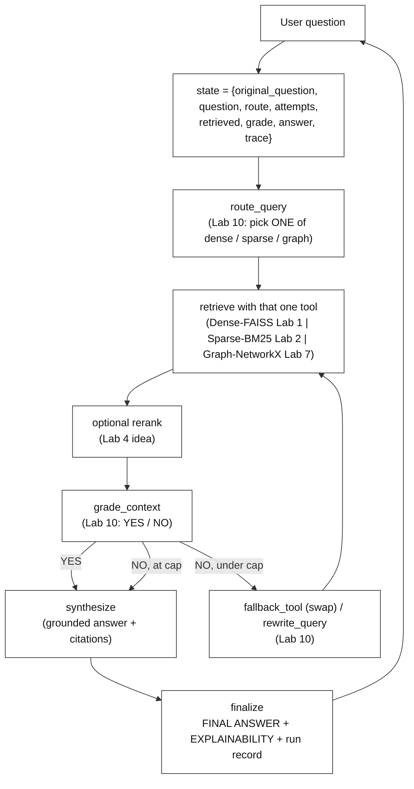
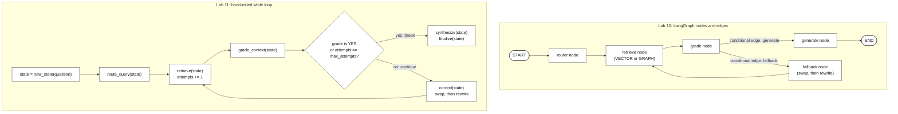
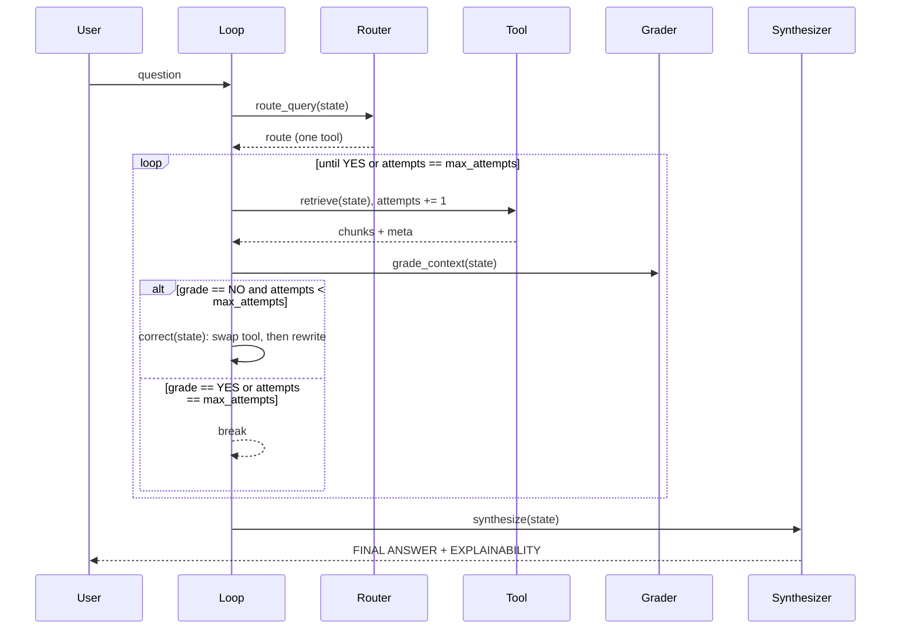
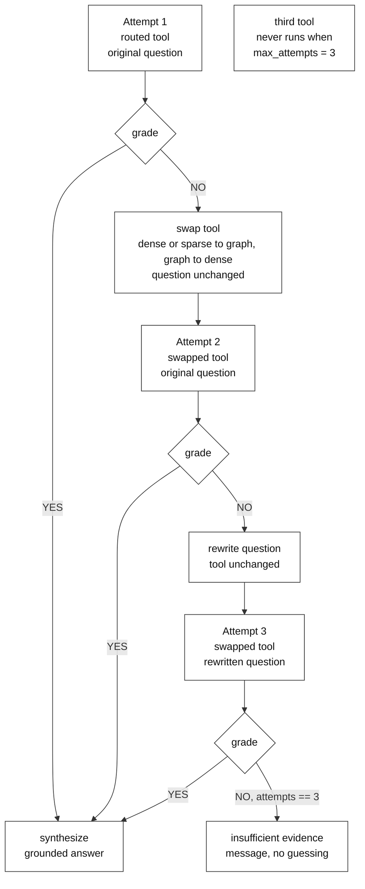

# Capstone: Agentic Research Assistant: A Multi-Tool, Self-Correcting RAG Agent

**Type:** Capstone Project | **Level:** Advanced | **Duration:** 2–3 weeks (30–60 hours of build time)

**Integrates:** Labs 1–10 (complete RAG catalog).

**Execution model:** This folder is a **design and build specification**. It contains
documents only; no runnable code is shipped here. The learner writes the code:
the 30–60 hours is the time to build the agent from this spec in the learner's own
project folder. The Section 10 questions are design and trace exercises answered in
writing against the spec (and, where useful, checked against the learner's own
build). The agent loop is **hand-rolled in plain Python**: a single `state`
dictionary threaded through explicit `route → retrieve → grade → correct`
functions (then `synthesize` and `finalize`) driven by a `while` loop. **No
LangGraph, LangChain agent, or any orchestration framework** — the point of the
capstone is to see the mechanics, not to hide them behind a library. (Lab 10 builds
the same logic with LangGraph; Section 6.1 shows the two side by side.)

**Corpus:** `sample_text_document.pdf`, a short synthetic guide to coastal wetland
restoration. The same file is already in the repo at
`section-1-classical-rag/lab-01-classical-rag/data/` (which also holds a
`sample_text_document.txt` copy) and at
`section-2-retrieval-variations/lab-02-hybrid-rag/data/`. Retrieval and embeddings
run locally; the model calls (router, grader, rewriter, graph extraction, answer)
go to an LLM over the internet through OpenRouter, so a network connection and an
API key are needed.

---

## 1. Problem Statement

Build a single **research assistant** that answers a natural-language question by
choosing among several retrieval strategies, checking whether what it retrieved
is actually good enough, correcting itself when it is not, and producing a final
answer with a per-source explainability trace.

Three requirements separate this from the earlier labs, each of which built one
piece in isolation:

- **One question, many tools.** The assistant has to *decide* whether a question
  is best served by dense semantic search, sparse keyword search, or a knowledge
  graph — and it must be able to switch tools mid-run when its own grading says
  the first choice failed (Labs 7, 10). It uses **one tool per attempt**; a
  failed attempt is followed by a different tool on the next attempt.
- **Self-correction is explicit state, not magic.** Grading, question rewriting,
  retry caps, and fallback are ordinary functions operating on a shared state
  dict; the learner can print the state after every step and watch the decision
  change (Lab 10).
- **Answers are grounded and inspectable.** Every claim cites the tool and chunk
  it came from, and failed routes are reported, not hidden (Labs 1, 5, 9, 10).

The assistant is designed for a single local user, reading one document today,
with a documented path to more documents and more tools. Section 6.1 contrasts
Lab 10's LangGraph version with this capstone's `while` loop.

## 2. Scope

**In scope**

- One hand-rolled agent loop: `route → retrieve → grade → (swap | rewrite) →
  synthesize → finalize`, with a bounded retry cap (Section 7 states the exact
  rule).
- Three local retrieval tools built from earlier labs:
  - **Dense** — `sentence-transformers` embeddings searched with a FAISS
    `IndexFlatIP` (Lab 1). FAISS is a vector-search library; `IndexFlatIP` is its
    exact, brute-force index that scores every chunk by inner product, which equals
    cosine similarity when the vectors have unit length (as `all-MiniLM-L6-v2`'s do).
  - **Sparse** — a hand-rolled BM25 over the same chunks (Lab 2). BM25 is a
    keyword-matching score that rewards chunks sharing rare words with the question.
  - **Graph** — a NetworkX graph built from LLM-extracted **triples** (Lab 7). A
    triple is one fact written as `source / relation / target`, for example
    `Tide gate / BLOCKS / Tidal exchange`. The tool finds the entity matching the
    question and calls `traverse_subgraph(graph, start_node, radius)`, a
    breadth-first walk that collects every relationship within `radius` hops of
    that entity (Lab 7 uses `radius=2`) and returns them as readable facts.
- A **grader** that labels retrieved context `YES`/`NO` and a **rewriter** that
  reformulates the question on `NO` (Lab 10).
- A **router** that picks the tool for the first attempt and a **fallback** that
  swaps the tool before rewriting (Lab 10).
- A **synthesizer** that answers only from retrieved context and emits a
  `--- FINAL ANSWER ---` block plus a `--- EXPLAINABILITY ---` trace.

**Optional extensions (not part of the default loop)**

- **Rerank** — re-sort the chunks one tool returned by a second, finer score before
  grading. The idea comes from Lab 4 (ColBERT-style late interaction: score a chunk
  by matching the question's tokens against the chunk's tokens). Lab 4 itself uses
  this as the retriever over a Qdrant index, not as a reranker, so applying it to
  already-retrieved chunks is a capstone adaptation.
- **Fusion** — merge the ranked lists of *several* tools into one list, for example
  dense plus sparse with reciprocal-rank scoring (Lab 2). The default router runs
  one tool per attempt, so there is nothing to fuse unless a multi-tool attempt is
  added (see Section 7.3).

**Out of scope (documented as future work)**

- Cloud backends: Neo4j (Labs 7, 8, 10), Qdrant (Labs 3–4), PageIndex vectorless
  (Lab 9), OCR ingestion (Lab 5) — each named as an optional tool plug-in. A
  plug-in is wrapped in an **adapter**, a thin function that makes the backend obey
  the **adapter contract**: the single input/output shape the loop expects of any
  tool (here, `retrieve(state)` returns `{chunks, meta}`), so the loop code does not
  change when a backend is swapped in.
- Multi-document / multi-user isolation, a web UI, and deployment.
- Fine-tuning or any model training.

## 3. Integration Map — every lab earns its place

| Lab | Concept | Where it lands in the capstone |
|-----|---------|--------------------------------|
| 1 | Classical pipeline (load, chunk, embed, FAISS, cosine, grounded generate) | The document spine: chunking, embeddings, the dense tool, and the generate step ("answer using only this context") |
| 2 | Hybrid dense + sparse with BM25 | The sparse tool; the optional fusion extension that merges ranked lists |
| 3 | Parent-child / summary multi-vector (small chunks searched, parent returned) | Context assembly: retrieve small, return the surrounding parent chunk |
| 4 | ColBERT late interaction | Idea behind the optional reranker applied to one tool's chunks before grading |
| 5 | OCR + RAG (scanned documents, FAISS chunk index, explainable answer) | Optional ingestion path for scanned inputs (documented plug-in); the explainable-answer pattern |
| 6 | LLM Wiki (index of descriptions, LLM picks files) | Router inspiration: the LLM reads short descriptions and chooses before retrieving |
| 7 | Graph RAG, NetworkX to Neo4j (triples, `traverse_subgraph(radius)`) | The graph tool; Neo4j as an optional persistent backend behind the same adapter contract |
| 8 | Vector + graph hybrid (vector search finds seed nodes, graph expansion follows links) | Reference for the optional multi-tool extension: combined vector and graph evidence |
| 9 | Vectorless RAG (PageIndex tree, multi-hop, tables) | Optional tree/index tool for section-level and table questions; the per-hop trace and citations pattern |
| 10 | Agentic RAG (grade, rewrite, router, swap-then-rewrite fallback; LangGraph) | The `grade_context`, `rewrite_query`, `route_query` and `fallback_tool` logic, rebuilt by hand |

## 4. Target Output

For a question such as *"What is usually the most effective first step in restoring
a wetland, and how does plant life recover afterwards?"* (both parts are answered
in the corpus) the assistant produces:

- A **routing decision** (e.g. `route = dense` for a paraphrase-style question, or
  `sparse` for a keyword-style one) that is visible in the state.
- A **grading verdict** (`YES`/`NO`), and on `NO` either a **tool swap** or a
  **rewritten query** — with the attempt count shown.
- A **grounded answer** in a `--- FINAL ANSWER ---` block.
- An **explainability trace** in a `--- EXPLAINABILITY ---` block: which tool ran
  at each attempt, which chunks/paths were returned, and how many attempts it took.
- A **run record**: a one-line summary of the run (question, final route,
  attempts used, tools used, and whether the answer was downgraded to an
  "insufficient evidence" message), kept so runs can be compared later.

## 5. Tech Stack & Constraints

- **Agent loop:** plain Python — a `state` dict, a `while` loop, and named
  functions. No LangGraph/LangChain agent framework.
- **Retrieval:** `sentence-transformers` (`all-MiniLM-L6-v2`, local), `faiss-cpu`,
  a hand-rolled BM25 (Lab 2 uses the `rank_bm25` library through LlamaIndex; the
  capstone writes the scoring itself), and `networkx`.
- **Model provider:** *model-agnostic* — every model call goes through
  `Provider.chat()`, a thin wrapper class with one method that takes the prompt
  messages and returns the model's reply as a string. Behind it sits an `openai`
  client pointed at OpenRouter with a free-tier model, chosen by a `RAG_MODEL` env
  var, so the backend can change without touching the loop. Labs 1 and 10 use the
  same OpenRouter endpoint and free-tier approach, but through LangChain's
  `ChatOpenAI`; the capstone uses the plain client instead.
- **Parsing:** `pymupdf` for the PDF; `numpy` for scoring.
- **Secrets:** `python-dotenv`, reading `OPENROUTER_API_KEY` from `.env`.
- **Cost:** free-tier model + local embeddings, so a full run costs nothing.
- **Constraint:** every model call goes through `Provider`; every tool returns the
  same `{chunks, meta}` shape so the loop is tool-agnostic.

## 6. Architecture Overview

### 6.1 System diagram

**Lab 10 (LangGraph) versus this capstone (`while` loop).** Both implement the same
decisions. Lab 10 declares them as nodes and edges and lets the library run the
graph; the capstone writes the control flow as ordinary Python so every transition
can be printed.

How the two map: Lab 10's `router`, `retrieve`, `grade`, `fallback` and `generate`
nodes become `route_query`, `retrieve`, `grade_context`, `correct` and
`synthesize`/`finalize`; the conditional edge out of `grade` becomes the `if`
that decides whether to `break`; the edge from `fallback` back to `retrieve` is
simply the next pass of the `while`. Lab 10 has two tools (vector, graph); the
capstone adds a third (sparse).

### 6.2 Component responsibilities

| Component | Function | Contract | Primary labs |
|-----------|----------|----------|--------------|
| State | one dict threaded through the loop | `{original_question, question, route, attempts, retrieved, grade, answer, trace[]}` (fields below) | 9, 10 |
| Router | `route_query(state)` | returns exactly one of `dense` / `sparse` / `graph` (+ rationale) | 6, 10 |
| Tools | `retrieve_dense / _sparse / _graph(state)` | one tool runs per attempt; returns `{chunks, meta}` in a common shape | 1, 2, 7 |
| Fuse/Rerank (optional) | reorder one tool's chunks; fusion only in the multi-tool extension | returns reordered `{chunks, meta}` | 2, 4 |
| Grader | `grade_context(state)` | returns `YES` / `NO` | 10 |
| Rewriter/Fallback | `rewrite_query` / `fallback_tool` | mutates `state` (new `route` on swap, new `question` on rewrite) | 9, 10 |
| Synthesizer | `synthesize(state)` | answer to `original_question` grounded only in `retrieved` | 1, 5, 9 |
| Finalizer | `finalize(state)` | answer block + explainability + run record | 5, 9 |

**State fields.**

| Field | Meaning |
|-------|---------|
| `original_question` | What the user asked. Set once, never changed; `synthesize` answers this question. |
| `question` | The query used for retrieval right now. Starts equal to `original_question`; `rewrite_query` overwrites it with the rewritten question. |
| `route` | The tool for the next retrieval: `dense`, `sparse` or `graph`. The router sets it; a swap overwrites it. |
| `attempts` | Number of retrievals already performed. Starts at 0 and goes up by one right after every `retrieve` call (the first try counts). See Section 7.1. |
| `retrieved` | The `{chunks, meta}` returned by the latest retrieval. Cleared when a correction starts a new attempt. |
| `grade` | `YES`, `NO`, or the empty string before grading. Reset to empty when a correction starts a new attempt. |
| `answer` | The synthesized answer, empty until `synthesize` runs. |
| `trace` | Append-only list; every stage appends one entry `{stage, attempt, detail}` (tool, question used, chunk ids, verdict, action taken). It feeds the `EXPLAINABILITY` block. |

`max_attempts` is configuration, not state.

### 6.3 Data flow (one run)

A run has **four loop stages**: (1) **route** — `route_query` picks the tool; (2)
**retrieve** — the chosen tool runs and `attempts` goes up; (3) **grade** —
`grade_context` returns `YES` or `NO`; (4) **correct** — after a `NO` below the cap,
swap the tool or rewrite the question. Route runs once at the start; retrieve, grade
and correct repeat once per attempt. `synthesize` and `finalize` run once after the
loop and are not counted among the four.

**Worked state evolution.** The table follows one run that starts on `sparse`, gets
`NO`, swaps to `graph`, and gets `YES` (the question and every value are
illustrative, not real output). Section 10, question 1 asks you to produce the same
kind of table for a run of your own build.

| Step | Stage / function | Keys that change | Values after the step (illustrative) |
|------|------------------|------------------|--------------------------------------|
| 0 | start, `new_state(question)` | all keys created | `original_question` = "How are tide gates related to sediment deposition?"; `question` = same text; `route` = ""; `attempts` = 0; `retrieved` = []; `grade` = ""; `answer` = ""; `trace` = [] |
| 1 | route, `route_query` | `route`, `trace` | `route` = `sparse` (question reads as keyword-like); trace has one `route` entry |
| 2 | retrieve, attempt 1 | `retrieved`, `attempts`, `trace` | `retrieved` = chunks c3 and c9 (keyword hits on "tide gates", no sentence linking them to sediment); `attempts` = 1 |
| 3 | grade | `grade`, `trace` | `grade` = `NO`; `question` is unchanged |
| 4 | correct: swap | `route`, `retrieved`, `grade`, `trace` | `route` = `graph`; `retrieved` = []; `grade` = ""; trace records "swap sparse to graph"; `question` and `attempts` unchanged |
| 5 | retrieve, attempt 2 | `retrieved`, `attempts`, `trace` | `retrieved` = facts such as `Tide gate --[BLOCKS]--> Tidal exchange` and `Tidal exchange --[CARRIES]--> Sediment`; `attempts` = 2 |
| 6 | grade | `grade`, `trace` | `grade` = `YES` |
| 7 | synthesize | `answer`, `trace` | `answer` = text grounded in the two graph facts, citing tool `graph` |
| 8 | finalize | none (prints output) | prints the `FINAL ANSWER` and `EXPLAINABILITY` blocks and the run record: route path `sparse` then `graph`, `attempts` = 2, insufficient evidence = no |

## 7. Key Design Decisions

- **The loop is the teacher.** A `while` loop over a dict — not a framework —
  so every state transition is printable and explainable (Lab 10).
- **One tool contract, many tools.** Every retriever returns `{chunks, meta}`,
  which is why a tool can be swapped mid-run without touching the loop.
- **One tool per attempt.** The router picks a single tool; fusion across tools is
  an extension (7.3), not part of the default design.
- **Grade before you retry, retry before you give up.** `NO` first triggers a
  tool swap, then a question rewrite, and a hard `max_attempts` cap guarantees
  termination (Lab 10). The exact rule is in 7.1.
- **Grounded or silent.** `synthesize` answers only from `retrieved`; if the cap
  is hit with no passing grade, it returns an explicit "insufficient evidence"
  message instead of guessing (Labs 1, 9, 10).
- **Explainability is a first-class output.** The trace records route, tool,
  chunks, and verdict per attempt, feeding the final `EXPLAINABILITY` block
  (Labs 5, 9, 10).
- **Local retrieval by default, cloud by plug-in.** Neo4j, Qdrant, PageIndex, and
  OCR are optional backends behind the same contracts — the capstone runs with none
  of them installed (Labs 3, 4, 5, 7, 9).
- **Model-agnostic by interface.** All model calls pass through `Provider.chat()`;
  switching vendors is a config change, not a code change.

### 7.1 Retry rule (the cap, `attempts`, and what a retry does)

- `max_attempts = 3` is the **total number of retrievals in a run, including the
  first try**. It is not "three retries".
- `attempts` is **0-based as a counter**: it starts at 0 and `retrieve` adds one
  right after each retrieval. So after the first retrieval `attempts == 1`, and the
  loop stops when the grade is `YES` or `attempts == max_attempts`.
- The three attempts are fixed by position:
  1. **Attempt 1** — the tool the router chose, with the original question.
  2. **Attempt 2** — after a `NO`, **swap**: a different tool, same question.
  3. **Attempt 3** — after a second `NO`, **rewrite**: the swapped tool again, with
     the rewritten question in `question`.
  After a `NO` on attempt 3 there is no correction; `synthesize` returns the
  "insufficient evidence" message.
- This matches Lab 10, which counts corrections instead (`retry_count` 0, 1, 2,
  stopping at 2): the same three retrievals, one swap and one rewrite. In the
  capstone `attempts` equals Lab 10's `retry_count` plus one once the first
  retrieval is done.

### 7.2 What "swap" means with three tools

A swap changes `route` to the tool named by a fixed table, **not** to "any other
tool":

| Tool that just failed | Swap target |
|-----------------------|-------------|
| `dense` | `graph` |
| `sparse` | `graph` |
| `graph` | `dense` |

The reasoning is Lab 10's: a text-search failure may mean the question is about
connections, and a graph failure may mean it is about meaning. With
`max_attempts = 3` and one swap, **the third tool never runs by default** (for a run
that starts on `dense` or `sparse`, the other text tool is skipped). Trying all
three tools would need `max_attempts = 4` and a second swap rule; that is a tuning
knob for `06-evaluation-and-tuning.md`, not the default.

### 7.3 Optional extension: several tools in one attempt

If you add it, the router returns an ordered list of tools instead of one; all of
them run in the same attempt; their ranked lists are merged by **fusion** (for
example reciprocal-rank scoring: each chunk earns `1 / (k + rank)` from every list
it appears in, and the sums decide the order); an optional **rerank** then reorders
the merged list; and grading sees the merged result once. Swap and rewrite work as
in 7.1, with the tool list replaced by a different list. Nothing in the default
design depends on this.

## 8. Required Documentation Set

Only `00-overview-architecture.md` (this file) exists today. **The other eight files
below are planned and have not been written yet ("to be written")**; this table says
what each is meant to contain.

| File | Status | Contents |
|------|--------|----------|
| `00-overview-architecture.md` | written | this document — problem, scope, integration map, architecture, decisions |
| `01-agent-loop-and-state.md` | to be written | the state schema, the `while` loop, each function's input/output/failure contract, the retry cap |
| `02-retrieval-tools.md` | to be written | dense / sparse / graph tool specs, the common `{chunks, meta}` adapter contract, rerank and the optional fusion extension, optional cloud backends |
| `03-routing-grading-correction.md` | to be written | router heuristics, grader prompt + parsing, rewrite strategy, swap table, termination proof |
| `04-explainability-and-output.md` | to be written | the `FINAL ANSWER` / `EXPLAINABILITY` formats, citations, run record, insufficient-evidence behavior |
| `05-test-plan.md` | to be written | unit tests per function (fake tools/provider), scenario tests (wrong route, forced `NO`, cap reached), pass criteria |
| `06-evaluation-and-tuning.md` | to be written | a small gold question set (questions with a known right passage and right tool), the metrics **hit-rate** (share of gold questions whose right passage is among the chunks that reach `synthesize`), **route-accuracy** (share where the router's first pick equals the gold tool) and retry count (average corrections per question), and a knob sweep (`top_k`, `max_attempts`, rerank on/off) |
| `07-extensions-and-runbook.md` | to be written | adding a tool, plugging in Neo4j/Qdrant/PageIndex, cost/keys, local run walkthrough |
| `lab-capstone-project-assignment.md` | to be written | the post-capstone assignment (Section 10) as a standalone sheet |

## 9. Environment Setup (documentation convention)

This capstone is a design + build spec, so there is nothing to install to *read*
it. To *build* it, the planned runbook (`07-extensions-and-runbook.md`, to be
written) will document the local environment the design targets:

- a Python 3.11 venv built from a `requirements.txt` that you write,
- `OPENROUTER_API_KEY` in `.env`,
- `sample_text_document.pdf` copied from `section-1-classical-rag/lab-01-classical-rag/data/`
  into your project's `data/` folder.

The first code cell of your notebook or script should be a single pinned
`!pip install` line covering the Section 5 stack, in the same way the labs'
"Environment / Dependencies Setup" sections do.

## 10. Post-Capstone Assignment

1. Trace one run that starts on `sparse`, gets `NO`, and recovers on `graph`.
   List the `state` keys that change at each of the four loop stages (route,
   retrieve, grade, correct; defined in 6.3). The worked table in 6.3 shows the
   expected format; produce yours for a question and run of your own.
2. Explain why `synthesize` must read only `retrieved` and never answer from the
   question alone. Which lab first established this rule? *Reference answer:*
   without the retrieved evidence the model answers from its training memory, which
   is exactly the ungrounded guessing RAG exists to prevent, and the answer could no
   longer be checked against sources. Lab 1 first established the rule, by
   instructing the model to answer using only the retrieved context. (`synthesize`
   still reads `original_question`, to know what to answer.)
3. The retry cap is `max_attempts = 3` (first try, one swap, one rewrite; see 7.1).
   Give a question that still ends in the "insufficient evidence" branch, and
   explain which tool and which question text each of the three attempts used.
4. In the default design one tool runs per attempt. Where would you insert a
   reranker (the Lab 4 idea) so it runs *once* per attempt rather than once per
   tool, and why not inside each tool? Then say how the placement changes under the
   multi-tool extension in 7.3.
5. Under the optional multi-tool extension (7.3), the graph tool and the dense tool
   can disagree. Describe how you would combine their results (Lab 8 combines vector
   and graph evidence; Lab 2 shows rank-based fusion) and how the explainability
   trace should report a conflict.
6. Pick one cloud backend (Neo4j, Qdrant, or PageIndex). Describe the single
   adapter contract its adapter must satisfy (defined in Section 2) so the loop code
   does not change.

## 11. Further Reading / Next Steps

- Re-read **Lab 1 (Classical RAG)** for the chunk → embed → retrieve →
  generate spine the capstone reuses.
- **Lab 10 (Agentic RAG)** is the closest
  ancestor: this capstone is that lab's grade/rewrite and router/fallback logic
  rebuilt by hand, made multi-tool, and wrapped in explainability.
- **Labs 7 and 8** define the graph tool (NetworkX to Neo4j) and combined
  vector+graph evidence.
- If a later milestone adds cloud tools, the adapter contracts planned for
  `02-retrieval-tools.md` (to be written) are the seams to keep.

---

*End of overview. The next document, `01-agent-loop-and-state.md`, is to be written.*
