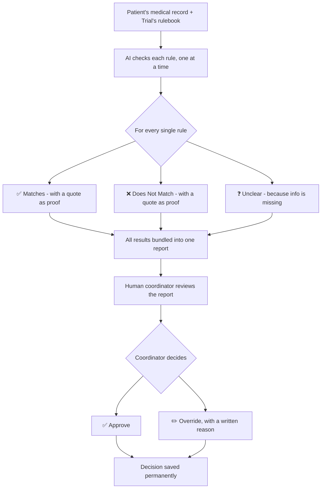
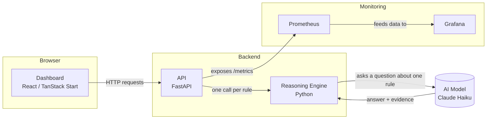

# CareMatch API

**An AI tool that helps hospital staff check if a patient qualifies for a clinical trial — and shows its work, every single time.**

---

## Table of Contents

- [What This Project Does](#what-this-project-does)
- [Why It's Built This Way](#why-its-built-this-way)
- [How It Works](#how-it-works)
- [Architecture](#architecture)
- [Project Structure](#project-structure)
- [Tech Stack](#tech-stack)
- [The API](#the-api)
- [Running It Yourself](#running-it-yourself)
- [Environment Variables](#environment-variables)
- [Testing](#testing)
- [Key Decisions (and Why)](#key-decisions-and-why)
- [Real Problems We Found and Fixed](#real-problems-we-found-and-fixed)
- [How Well Does It Actually Work?](#how-well-does-it-actually-work)
- [What's Not Built](#whats-not-built)

---

## What This Project Does

Hospitals run clinical trials — tests of new medicines or treatments. Before a patient can join one, someone has to check if they qualify against a list of rules (called a **protocol**). Today, a hospital staff member called a **research coordinator** does this by hand — reading through a patient's whole medical file and checking it line by line. It's slow, and it's easy to miss something.

**CareMatch reads the patient's file and the trial's rules, and hands the coordinator a clear report** — not a decision. It never says "yes, this patient qualifies" on its own. Instead, it checks every single rule one at a time and says: *this one clearly matches, this one clearly doesn't, and this one we can't tell from the record.* Then a real human decides.

## Why It's Built This Way

Two things usually break AI tools in hospitals:

1. **It's too expensive to plug in.** Big AI systems often need $250,000+ just to connect to a hospital's existing computer systems.
2. **Nobody trusts a black box.** If an AI just says "excluded" with no explanation, no doctor is going to act on that — and legally, they probably shouldn't.

CareMatch is built to avoid both. It's a small, simple tool that plugs into anything with a basic web connection, and it **never gives an answer without showing exactly how it got there.**

---

## How It Works



**The one rule that never changes:** the AI's answer is always a *suggestion*. Even if every single rule looks like a clean match, a human still has to click "Approve" before it counts as anything real. There is no way to skip this step — it's built into the code itself, not just a policy someone has to remember.

---

## Architecture



**In plain words:**
- **Dashboard** — the webpage a coordinator actually looks at
- **API** — the doorway other systems (like the dashboard) use to send data in and get answers back
- **Reasoning Engine** — the actual "brain." It goes through a trial's rules one at a time
- **AI Model** — the underlying language model that reads the patient text and judges each rule
- **Prometheus & Grafana** — a health dashboard for the *system itself* (is it fast? is it breaking? how many checks has it done?), separate from the coordinator's dashboard

---

## Project Structure

This shows the key files — a few generated/config files (requirements.txt, Dockerfiles, test_data/) are left out to keep this readable.

```
carematch/
├── reasoning_engine/       The AI "brain" — reads one rule + one patient record, gives an answer
│   ├── schema.py             Defines the exact shape of every answer (no shortcuts allowed)
│   ├── protocol.py           Defines what a trial's rulebook looks like
│   ├── llm_client.py         The actual call to the AI model, with retries and safety checks
│   ├── engine.py             Loops through all the rules and combines the results
│   ├── run_real_assessment.py  Script to test real AI reasoning yourself, using your own API key
│   ├── test_engine.py        Automated tests — no API key needed to run these
│   ├── requirements.txt
│   ├── .env.example          Copy this to .env if running this folder's scripts on their own
│   └── test_data/            Sample fake patients used by the automated tests
│
├── api/                    The doorway — turns the reasoning engine into a web service
│   ├── main.py               All the API endpoints (register a trial, run a check, record a decision)
│   ├── test_api.py           Automated tests for the API itself
│   ├── Dockerfile
│   └── requirements.txt
│
├── dashboard/              The webpage the coordinator actually uses
│   └── src/
│       ├── routes/            The 3 pages: New Assessment, Assessment Review, Trial Setup
│       ├── components/        Reusable pieces, like the rule result cards
│       ├── hooks/             Small reusable bits of frontend logic
│       └── lib/api.ts         The code that talks to the real API
│
├── observability/          Retired — an early standalone monitoring test.
│                             Real monitoring now lives directly inside api/main.py instead.
│
├── docs/                   Written explanations of the project
│   └── project_summary.md   The full story: real bugs found, decisions made, evaluation results
│
├── run_evaluation.py       The 12-patient accuracy test script (see project_summary.md for results)
├── docker-compose.yml      Starts everything (API, dashboard, monitoring) with one command
├── prometheus.yml          Tells Prometheus which service to watch
└── README.md               You are here (lives at the project root, not inside docs/)
```

---

## Tech Stack

| Piece | What It's Built With | Why |
|---|---|---|
| Reasoning Engine | Python, Pydantic | Pydantic forces every AI answer to follow our exact required shape — an answer that doesn't fit gets rejected automatically |
| AI Model Access | Anthropic Claude (direct) or OpenRouter | Two ways to reach an AI model, switchable with one setting, no code changes needed |
| API | FastAPI | Lightweight, fast, and automatically generates interactive docs |
| Dashboard | React + TanStack Start + Tailwind CSS | A modern, fast web app framework |
| Monitoring | Prometheus + Grafana | Industry-standard tools for watching a system's health in real time |
| Packaging | Docker + Docker Compose | Lets the whole project start with one command, on any computer |

---

## The API

| Method | Path | What It Does |
|---|---|---|
| GET | `/health` | Simple check — is the API alive? |
| GET | `/metrics` | Raw performance/usage numbers, read by Prometheus |
| POST | `/trials` | Register a new trial's rulebook |
| GET | `/trials` | List every trial that's been registered |
| GET | `/trials/{trial_id}` | Look up one specific trial |
| POST | `/assess` | Run a real eligibility check for one patient against one trial |
| GET | `/assessments/{assessment_id}` | Look up a past assessment |
| POST | `/assessments/{assessment_id}/decision` | Record the coordinator's Approve/Override decision |

**Example — what you get back from `/assess`:**
```json
{
  "assessment_id": "67207011-cda7-4ba9-a2f6-4388d7144fd5",
  "assessment": {
    "patient_id": "P-1001",
    "trial_id": "T-004",
    "suggested_status": "likely_eligible",
    "requires_coordinator_approval": true,
    "rule_results": [
      {
        "rule_id": "INC-01",
        "rule_text": "Patient must be 50 years of age or older",
        "status": "matches",
        "evidence": "60-year-old patient"
      }
    ]
  },
  "decision": null,
  "provider_used": "anthropic",
  "model_used": "claude-haiku-4-5-20251001"
}
```
Notice: no confidence score, no flat "yes." Just a status, a quote, and a note that a human still needs to sign off.

---

## Running It Yourself

**Everything at once, with Docker (recommended):**
```bash
docker compose up -d --build
```
Then open:
- Dashboard: `http://localhost:8080`
- API docs: `http://localhost:8000/docs`
- Prometheus: `http://localhost:9090`
- Grafana: `http://localhost:3000`

Monitoring data persists across restarts: Prometheus and Grafana store their data in named Docker volumes (`carematch_prometheus_data` and `carematch_grafana_data`), so `docker compose down` won't wipe your metrics history or saved dashboards.

**Running pieces separately (for development):**
```bash
# Backend
cd api
pip install -r requirements.txt
uvicorn main:app --reload

# Frontend, in a separate terminal
cd dashboard
npm install
npm run dev
```

---

## Environment Variables

There are two different `.env` files depending on how you're running things — this project doesn't use just one:

| File | When You Need It | Template Available? |
|---|---|---|
| `carematch/.env` (project root) | Running everything via Docker — `docker-compose.yml` reads this one | Yes — copy `carematch/.env.example` |
| `reasoning_engine/.env` | Running the reasoning engine's own scripts directly, without Docker | Yes — copy `reasoning_engine/.env.example` |

Both use the same variable names:

| Variable | What It Does | Example |
|---|---|---|
| `LLM_MODE` | `"real"` actually calls an AI model (costs money). `"fake"` returns a placeholder answer for free — use this to test the app itself without spending anything | `fake` |
| `LLM_PROVIDER` | Which AI service to use | `anthropic` or `openrouter` |
| `ANTHROPIC_API_KEY` | Your key, if using Anthropic directly | *(secret)* |
| `ANTHROPIC_MODEL` | Which Anthropic model | `claude-haiku-4-5-20251001` |
| `OPENROUTER_API_KEY` | Your key, if using OpenRouter instead | *(secret)* |
| `OPENROUTER_MODEL` | Which model via OpenRouter | `openai/gpt-oss-20b:free` |

**Never commit either real `.env` file** — only `reasoning_engine/.env.example` (the template, with no real secrets in it) belongs in version control.

---

## Testing

```bash
# Reasoning engine tests (no API key needed — uses a fake AI for testing)
cd reasoning_engine
pytest test_engine.py -v

# API tests (also free — forces fake mode automatically)
cd api
pytest test_api.py -v
```

Both test suites are fully automated and cost nothing to run, since they never make a real call to an AI model.

---

## Key Decisions (and Why)

| Decision | Why |
|---|---|
| **Never a flat yes/no** | A decision with no explanation can't be trusted or checked. Every answer comes with a direct quote as proof. |
| **No confidence score, anywhere** | We deliberately left this out. A percentage score can feel more certain than it actually is, and it was explicitly ruled out during planning. |
| **Human approval is always required** | Even a clean "everything matches" case still needs a person to click Approve. This is enforced in the code itself — there's no way around it. |
| **Rules are written by hand, not read from a PDF automatically** | Automatically parsing rules out of messy trial documents is a much bigger, riskier problem. For now, a human converts the rulebook into a clean checklist first. |
| **Exclusion rules are phrased as plain statements, not "must not" rules** | Testing showed the AI reasoning got confused by double-negatives. "Patient is taking Warfarin" works much better than "Patient must not be taking Warfarin." |
| **When information is missing, the AI says so — it doesn't guess** | A wrongly excluded patient never gets a second chance. Being cautious costs less than being wrong. |

---

## Real Problems We Found and Fixed

Building this surfaced some genuine bugs — the useful kind, found and fixed before this ever touched anything real:

1. **Confusing rule wording tripped up the AI.** Rules phrased as "must not be taking X" caused wrong answers almost every time. Fixed by rephrasing rules as plain statements instead.
2. **The AI guessed too confidently when information was simply missing.** "No screening on file" was being read as "doesn't have the condition." Fixed by explicitly telling the AI to say "unclear" instead of guessing.
3. **A single bad AI response could crash the whole check.** Now, if the AI's answer doesn't fit the expected format, that one rule safely falls back to "unclear" instead of breaking everything.
4. **A leftover test service was quietly stealing web traffic meant for the real system**, because both were using the same computer port. Fixed by removing the old service entirely and building monitoring directly into the real system instead.

*(Full details of each issue, exactly what caused it and how it was proven fixed, are in `docs/project_summary.md`.)*

---

## How Well Does It Actually Work?

Since we didn't have a real hospital to test with, we ran a stand-in test: **12 made-up patients, each with a known correct answer, run through the real AI.**

**Result: 12 out of 12 correct. Zero patients wrongly excluded.**

This included tricky cases on purpose — patients right at an age cutoff, patients failing multiple rules at once, and irrelevant information mixed in to see if it would cause confusion. All handled correctly.

**Being honest about the limits:** 12 patients is a good sign, not final proof. A real trial usually has more rules than the 3 we tested with, and real patient records are messier than our clean test examples.

---

## What's Not Built

Two things are intentionally left for later, because they need more than code to finish:

- **Legal & security review** — getting the paperwork and security testing done to safely handle real patient data. This needs real lawyers and real security auditors.
- **Turning this into an actual product** — onboarding real hospitals, handling many trials at once, figuring out pricing. This needs a real business, not more engineering.

Everything else — the AI reasoning, the API, the dashboard, monitoring, and testing — is built, working, and verified.