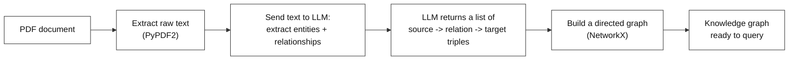
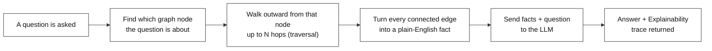
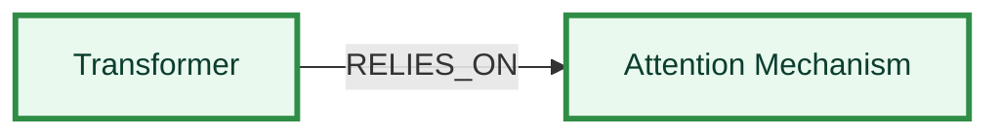
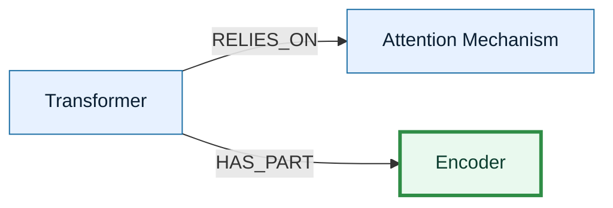
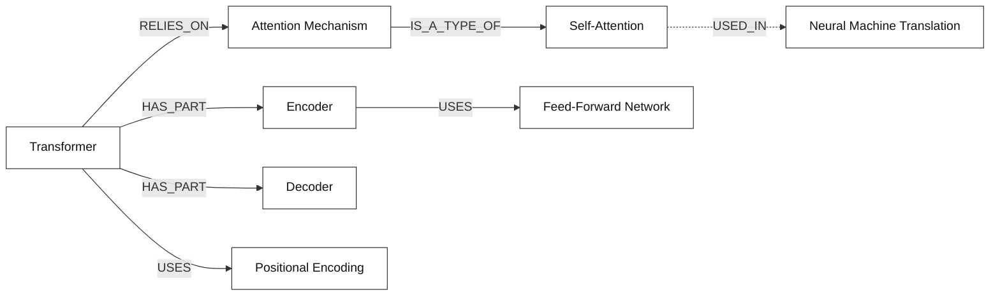
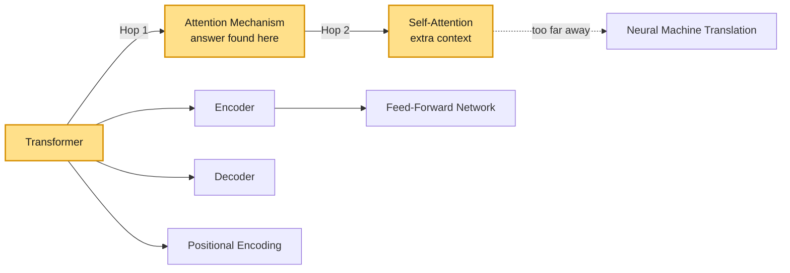
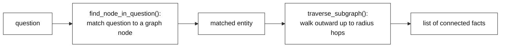

# End-to-End Generalized Graph RAG

---

# Problem Statement / Use Case Overview

A normal RAG pipeline finds chunks of text that are *similar* to a question and hands them to an LLM. But similarity isn't the same as connection — it can miss how one fact actually links to another, especially when the answer depends on following a chain of relationships rather than just matching keywords.

This lab solves that by building a **knowledge graph** instead of a plain list of text chunks. It reads a PDF, asks an LLM to pull out entities and how they relate to each other, and stores those relationships as a graph. When a question comes in, the pipeline finds the right starting point in the graph, walks outward a few steps to gather every connected fact, and only then asks the LLM to answer — along with a clear, step-by-step trace of how it got there.

**This lab has two connected parts:**

1. **Building the knowledge graph** — turning raw PDF text into a graph of entities and relationships.
2. **Querying the graph** — asking a question, walking the graph to find connected facts, and getting a clear, explainable answer back from the LLM.

This is useful for:
- **Questions that depend on connections between facts**, not just keyword or meaning similarity
- **Any case where you want the AI to show its reasoning path** — exactly which facts it followed to reach an answer
- **Documents where entities relate to each other in a chain**, e.g. "A causes B, B relates to C"

---

# Input Data

| Item | Detail |
|------|--------|
| **The PDF** | A document downloaded automatically from a link |
| **Your question** | A natural-language question about an entity mentioned in the document |
| **LLM API Key** | Entered manually when prompted — used to call the LLM |

---

# Processing

### Part A — Building the Knowledge Graph



This diagram shows the full graph-building pipeline: the PDF's text is extracted, that text is sent to the LLM which pulls out entities and how they relate to each other, those relationships are returned as simple triples, and the triples are used to build a directed graph — producing a knowledge graph ready to be searched.

### Part B — Querying the Graph



This diagram shows the full querying pipeline: the incoming question is matched to a node already in the graph, the graph is walked outward from that node to collect every connected relationship within a set number of hops, those relationships are turned into plain facts, that context plus the question is sent to the LLM, and the LLM returns both the answer and its explainability trace.

### How the Graph Gets Built, One Relationship at a Time

Before any question can be asked, the graph has to exist. `Step 4`'s loop doesn't create the whole graph in one shot — it adds one relationship at a time, and the graph grows a little with each one:

**Loop 1 — first relationship added:**



**Loop 2 — next relationship adds on top of the first:**



**...and so on, until the loop finishes — the complete graph:**



Each pass through the loop takes one `{source, relation, target}` triple the LLM extracted, and calls `G.add_edge(source, target, relation=...)`. If a node mentioned in that triple doesn't exist yet, NetworkX creates it automatically — so the graph isn't planned out in advance, it just accumulates, one relationship at a time, until every extracted triple has been added. By the time the loop ends, this full graph sits in memory, ready to be queried.

---

### A Sample Graph and How a Query Travels Through It

Now that the graph above exists, here's how one real question — **"What mechanism does the Transformer architecture rely on?"** — actually moves through it. The walk starts at Transformer, and hops outward from node to node, even reaching a second hop for extra context when needed:



The question mentions "Transformer," so that's where the walk begins. From there, it takes its first hop straight to Attention Mechanism — and that single hop is already enough to answer the question. But the walk doesn't have to stop there. It's allowed to take one more step for extra context, so it also hops onward a second time, reaching Self-Attention. Along the way, it naturally passes by Transformer's other neighbors too — Encoder, Decoder, and Positional Encoding — picking up whatever is connected nearby. Neural Machine Translation, on the other hand, sits too far away from the starting point, so the walk simply never gets there.

Everything the walk picks up along the way gets turned into a simple, plain-English fact — the kind of sentence a person would say out loud, like "Transformer relies on the Attention Mechanism." All of these facts are then handed to the LLM together with the original question, and it picks out the one that actually answers it: *"The Transformer relies on the Attention Mechanism."*

---

# Output

**Building the graph** prints how many relationships were extracted, followed by the raw JSON, then a node/edge count:

```
Extracted 6 relationships:

[
  {
    "source": "Transformer",
    "relation": "RELIES_ON",
    "target": "Attention Mechanism"
  },
  ...
]

Graph constructed successfully!
Total Nodes: 8
Total Edges: 6
```

**Querying the graph** prints which concept was auto-detected, then a two-section answer — a direct answer, followed by a step-by-step explainability trace:

```
[System Log] Auto-detected focus concept: 'Transformer'

--- FINAL ANSWER ---
The Transformer architecture relies on the attention mechanism.

--- AI TRACING & EXPLAINABILITY ---
The question asked about the Transformer. The graph was traversed starting from
that node, and a direct relationship was found: Transformer --[RELIES_ON]--> Attention
Mechanism. That relationship directly answers the question.
```

The explainability section always describes the exact chain of relationships used, in an objective third-person voice — never a first-person "I found..." — so the reasoning path can be checked against the graph itself.

---

# Tech Stack

| Component | Tool |
|---|---|
| **PDF Text Extraction** | `PyPDF2` — pulls raw text out of the first page of the PDF |
| **File Downloading** | `requests` — grabs the PDF from a link and saves it locally |
| **Entity/Relationship Extraction** | LLM (`openai/gpt-oss-20b:free`) — reads text and returns structured triples |
| **Graph Storage** | `NetworkX` (`DiGraph`) — stores entities as nodes and relationships as directed edges |
| **Graph Visualization** | `matplotlib` — available for optionally drawing the graph |
| **LLM (Answering)** | `openai/gpt-oss-20b:free` — answers using only the retrieved graph facts |
| **Environment** | API key entered manually at runtime via `input()` |

---

# Underlying Concepts (Summarized)

**Knowledge Graph** is a way of storing facts as a network instead of a flat list — each entity is a node, and each relationship between two entities is an edge connecting them. This makes it possible to follow a chain of connected facts, not just look things up one at a time.

**Entity & Relationship Extraction** means asking an LLM to read plain text and identify the "who/what" (entities) and "how they connect" (relationships), turning unstructured text into structured `source -> relation -> target` triples.

**Graph Traversal** is the act of starting at one node and walking outward along its edges to discover everything connected to it, up to a chosen number of hops. A **hop** is one step across a single edge — so a radius of 2 reaches both direct connections and their connections in turn.

**Graph RAG** stands for **Graph-based Retrieval-Augmented Generation** — instead of retrieving similar-looking text chunks, the relevant *connected facts* are retrieved from the graph first, and the LLM is asked to answer using only those facts, with a clear trace of which relationships were followed.

> **Why this matters:** A question like "What mechanism does the Transformer rely on?" isn't answered by finding the most *similar-sounding* sentence — it's answered by finding the entity "Transformer" and following its actual relationship to "Attention Mechanism" in the graph. That's what makes the final answer traceable back to a specific reasoning path, instead of just a best guess.

---

# Pre-requisites

- **Basic familiarity** with Python (functions, loops, `import` statements).
- **An LLM API Key** — entered manually when the notebook prompts for it.
- **High-level understanding** of what a knowledge graph and RAG are (covered above).

---

# Environment / Dependencies Setup

The cell below installs all required Python packages:

| Package | Purpose |
|---------|---------|
| `networkx` | **Graph storage** — builds and traverses the knowledge graph |
| `requests` | **File downloading** and later calls to the LLM API |
| `PyPDF2` | **PDF text extraction** — pulls raw text out of the PDF |
| `matplotlib` | Available for optionally visualizing the graph |

> **Note:** Run this cell first — it only needs to be run once per session.

```python
!pip install networkx requests PyPDF2 matplotlib
```

## Import Libraries

```python
import os
import json
import requests
import PyPDF2
import networkx as nx
import matplotlib.pyplot as plt
```

| Import | Purpose |
|---|---|
| `os` | Used for file paths and folders |
| `json` | Parses the LLM's JSON reply into Python objects |
| `requests` | Downloads the PDF, and later calls the LLM API |
| `PyPDF2` | Extracts raw text from the PDF |
| `networkx` | Builds and traverses the knowledge graph |
| `matplotlib.pyplot` | Available for optionally drawing the graph |

## Configure the LLM API Key

```python
OPENROUTER_API_KEY = os.getenv("OPENROUTER_API_KEY")

if not OPENROUTER_API_KEY:
    OPENROUTER_API_KEY = input("Enter your OpenRouter API key: ").strip()
else:
    print("Success: API Key loaded!")

OPENROUTER_URL = "https://openrouter.ai/api/v1/chat/completions"
TEXT_MODEL = "openai/gpt-oss-20b:free"
```

The key is entered manually when the notebook prompts for it. This key is reused for every LLM call later in the notebook.

---

# Step-wise Instructions — Development

---

### Step 1 — Download the Target Document

The PDF is downloaded directly from a link and saved locally, ready to be opened in the next step.

```python
PDF_URL = "https://arxiv.org/pdf/1706.03762.pdf"

os.makedirs("data", exist_ok=True)
PDF_PATH = os.path.join("data", "document.pdf")

try:
    print("Downloading document...")
    response = requests.get(PDF_URL)
    response.raise_for_status()

    with open(PDF_PATH, "wb") as f:
        f.write(response.content)

    print(f"Success! PDF stored at: {PDF_PATH}")
except Exception as e:
    print(f"Error downloading PDF: {e}")
```

By the end of this step, the raw PDF file exists locally at `data/document.pdf` — nothing has been read out of it yet.

---

### Step 2 — Extract Text via PyPDF2

Only the first page is read here, and only the first 1500 characters of it are kept, so the text sent to the LLM later stays short and fast.

```python
sample_text = ""

try:
    with open(PDF_PATH, "rb") as file:
        reader = PyPDF2.PdfReader(file)
        page = reader.pages[0]
        sample_text = page.extract_text()

    # We take the first 1500 characters to keep our LLM API payload fast
    sample_text = sample_text[:1500].strip()

    print(f"Success! Extracted {len(sample_text)} characters.")
except Exception as e:
    print(f"Error reading PDF file: {e}")
```

By the end of this step, `sample_text` holds a short block of plain text from the document's first page, ready to be handed to the LLM for entity extraction.

---

### Step 3 — Domain-Agnostic Entity Extraction

This step asks the LLM to read the text and return a structured list of relationships, with no fixed list of entity types to look for — it works the same way regardless of what the document is about.

```python
def extract_graph_elements(text):
    """Uses LLM to convert raw text into structured Nodes and Edges."""

    prompt = f"""
    You are an expert knowledge graph builder. Read the text below and extract all key entities and their relationships.

    Text:
    {text}

    CRITICAL INSTRUCTIONS:
    Output ONLY a valid JSON list of objects with keys "source", "relation", and "target".
    Example format:
    [
      {{"source": "Entity_A", "relation": "RELATES_TO", "target": "Entity_B"}},
      {{"source": "Entity_C", "relation": "CAUSES", "target": "Entity_D"}}
    ]
    Do not add any Markdown code blocks, explanations, or introductory text. Return ONLY pure JSON.
    """

    payload = {
        "model": TEXT_MODEL,
        "messages": [{"role": "user", "content": prompt}],
        "temperature": 0.0
    }
    headers = {"Authorization": f"Bearer {OPENROUTER_API_KEY}"}

    try:
        resp = requests.post(OPENROUTER_URL, headers=headers, json=payload)
        resp.raise_for_status()
        raw_json = resp.json()["choices"][0]["message"]["content"].strip()

        # Clean up unexpected markdown
        if raw_json.startswith("```"):
            raw_json = raw_json.split("\n", 1)[1].rsplit("```", 1)[0].strip()

        return json.loads(raw_json)
    except Exception as e:
        print(f"Extraction Error: {e}")
        return []

extracted_relationships = extract_graph_elements(sample_text)
print(f"Extracted {len(extracted_relationships)} relationships:\n")
print(json.dumps(extracted_relationships, indent=2))
```

`temperature=0.0` keeps the LLM's output consistent and predictable, which matters here since the reply needs to be parsed as exact JSON. By the end of this step, `extracted_relationships` holds a plain Python list of `source`/`relation`/`target` triples pulled straight out of the text.

---

### Step 4 — Build the Knowledge Graph

Every extracted triple becomes one directed edge in a graph — the entity doing the action points to the entity it acts on, labeled with the relationship between them.

```python
G = nx.DiGraph()

for rel in extracted_relationships:
    src = rel["source"].strip()
    tgt = rel["target"].strip()
    relation_type = rel["relation"].strip()

    G.add_edge(src, tgt, relation=relation_type)

print(f"Graph constructed successfully!")
print(f"Total Nodes: {G.number_of_nodes()}")
print(f"Total Edges: {G.number_of_edges()}")
```

By the end of this step, `G` is a fully built directed graph — this is the knowledge base the next steps will search and traverse.

---

### Step 5 — Dynamic Traversal & Subgraph Retrieval

This step defines two functions that work together: one finds which entity a question is about, the other walks the graph outward from that entity to gather every connected fact.



**`find_node_in_question` — matches the question to a known entity:**

```python
def find_node_in_question(question, graph):
    """Automatically finds which graph node the user is asking about."""
    for node in graph.nodes():
        if node.lower() in question.lower():
            return node
    return None
```

**`traverse_subgraph` — walks outward to collect connected facts:**

```python
def traverse_subgraph(graph, start_entity, radius=2):
    """Finds all relationships connected to an entity within N hops."""
    matching_nodes = [node for node in graph.nodes if start_entity.lower() in node.lower()]
    if not matching_nodes:
        return []

    target_node = matching_nodes[0]
    # BFS out to `radius` hops to pull in a local neighborhood of the entity
    sub_nodes = nx.single_source_shortest_path_length(graph, target_node, cutoff=radius).keys()
    subgraph = graph.subgraph(sub_nodes)

    facts = []
    for u, v, data in subgraph.edges(data=True):
        fact = f"{u} --[{data.get('relation', 'CONNECTED_TO')}]--> {v}"
        facts.append(fact)

    return facts
```

`find_node_in_question` handles Part B's first step — checking every known entity name against the question's text to see which one is being asked about. `traverse_subgraph` then takes that entity and walks outward up to `radius` hops using NetworkX's shortest-path search, collecting every node reached along the way and turning each connecting edge into a plain, readable fact.

---

### Step 6 — The Generalized RAG Engine

This step ties everything together: find the entity, gather its connected facts, and ask the LLM for a direct answer plus an explainability trace, all in one function.

```python
def execute_graph_rag(question):
    """A fully generalized Graph RAG pipeline."""

    # Step 1: Identify which known graph entity the question refers to
    target_entity = find_node_in_question(question, G)

    if not target_entity:
        return f"Could not find any known concepts in your question. Known concepts: {list(G.nodes)[:5]}..."

    print(f"[System Log] Auto-detected focus concept: '{target_entity}'")

    # Step 2: Retrieve connected facts (subgraph) around the detected entity
    retrieved_facts = traverse_subgraph(G, target_entity, radius=2)
    if not retrieved_facts:
        return f"Found the concept '{target_entity}', but no relationships are connected to it."

    facts_block = "\n".join([f"- {f}" for f in retrieved_facts])

    # Step 3: Build a grounded prompt so the LLM answers only from retrieved graph facts
    prompt = f"""
    You are an expert AI research assistant using a Knowledge Graph.
    Answer the question using ONLY the connected relationship paths provided below.

    Graph Relationships:
    {facts_block}

    Question: {question}

    CRITICAL INSTRUCTIONS:
    Output your response in EXACTLY two sections as shown below.

    --- FINAL ANSWER ---
    [Provide a direct, simple, 1-sentence answer.]

    --- AI TRACING & EXPLAINABILITY ---
    [Explain step-by-step how the answer was derived from the graph. Use an objective, third-person perspective. Do NOT use first-person pronouns like "I" or "my".]
    """

    payload = {
        "model": TEXT_MODEL,
        "messages": [{"role": "user", "content": prompt}],
        "temperature": 0.0
    }
    headers = {"Authorization": f"Bearer {OPENROUTER_API_KEY}"}

    # Step 4: Call the LLM and return its answer
    try:
        resp = requests.post(OPENROUTER_URL, headers=headers, json=payload)
        resp.raise_for_status()
        return resp.json()["choices"][0]["message"]["content"].strip()
    except Exception as e:
        return f"Error executing Graph RAG: {e}"
```

If no matching entity is found at all, the function stops early and lists a few known concepts instead of guessing. Otherwise, the connected facts are formatted into a clean bullet list and handed to the LLM along with strict formatting instructions, so the reply always separates the direct answer from the reasoning trace.

---

### Step 7 — Test the Pipeline

```python
query_1 = "What mechanism does the Transformer architecture rely on?"
print(execute_graph_rag(query_1))
```

This is where everything built in Steps 1–6 gets used end-to-end: the question is matched to a graph entity, the graph is walked outward to gather connected facts, those facts are sent to the LLM, and the printed result shows both the final answer and the reasoning path that produced it.

---

# What We Learnt

By the end of this lab, a PDF has been turned into a fully dynamic knowledge graph — built automatically from LLM-based entity extraction, with no fixed schema or manual data entry. That graph is then queried end-to-end: a question is matched to an entity, connected facts are gathered by walking the graph, and a final answer is produced along with a visible, step-by-step trail of how it was reached.

**Key takeaways:**
- **Graphs capture connections that plain text search can miss** — following an actual relationship path can answer questions that simple keyword or similarity matching would struggle with.
- **Extraction is domain-agnostic** — the LLM decides what counts as an entity or relationship on the fly, so the same code works on any document, not just one specific topic.
- **Radius controls how far the reasoning can reach** — a radius of 2 picks up not just direct connections, but connections-of-connections too.
- **Answers come with a reasoning trail** — every answer includes a step-by-step explanation of which graph relationships were followed to reach it.
- **Building the graph is a one-time cost** — once `G` exists, `execute_graph_rag` can be called with as many different questions as needed.