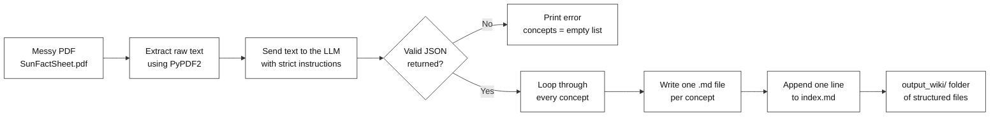
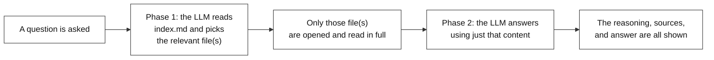
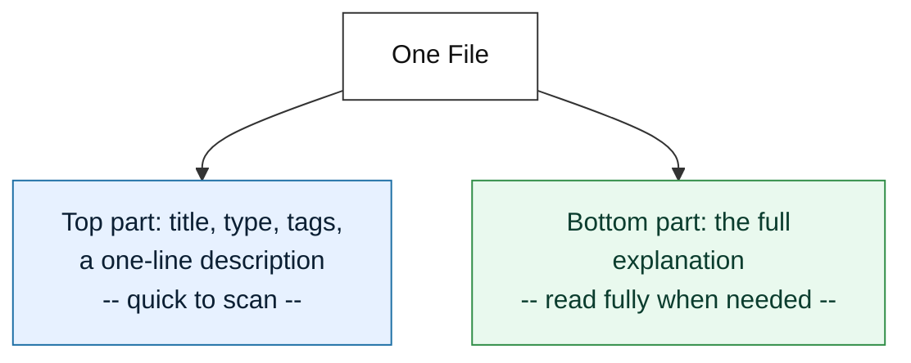
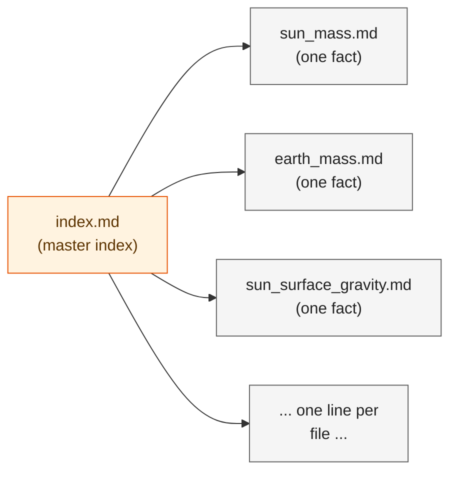
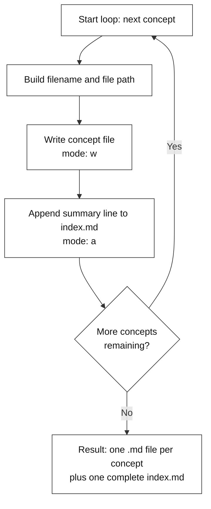
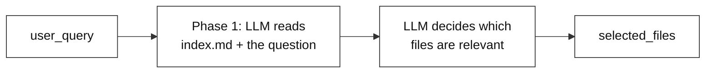
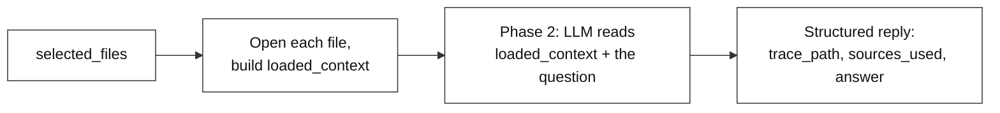

# Automated Ingestion: Building a Structured Knowledge Base (LLM Wiki + OKF)

---

# Problem Statement / Use Case Overview

Most AI tools handle a big document by chopping it into small, randomly-sized pieces, then pulling out a handful of pieces that "look similar" to a question. This has a well-known problem — chopping can separate a fact from the context that explains it, and "looks similar" isn't the same as "actually answers the question." When the pulled-out pieces don't fully cover the answer, the AI tends to fill the gap with a guess, which is what people call **hallucination**.

This lab avoids that by building a small, organized knowledge base instead. It reads a messy PDF and turns it into a folder of clean, self-contained files — one file per fact — plus one master index describing what's in each file. When a question comes in later, the AI doesn't guess from scraps of text. It checks the index, picks the exact file(s) that matter, and reads them in full before answering.

**This lab has two connected parts:**

1. **Building the knowledge base** — turning one unstructured PDF into a folder of clean, consistent files, plus an index.
2. **Querying the knowledge base** — asking a question, letting the AI pick the right file(s) from the index, and getting a clear, traceable answer.

This is useful for:
- **Reference documents** — fact sheets, glossaries, spec sheets, anything made up of many small, distinct facts
- **Any case where you want the AI to show its work** — which files it used, and why
- **Building a small, reusable knowledge base once, then asking it many different questions later**

---

# Input Data

| Item | Detail |
|------|--------|
| **The PDF** | A source document made up of many small facts (used here: NASA's Sun Fact Sheet), downloaded automatically from a link |
| **Your question** | A natural-language question about something in the document |
| **AWS Bedrock Credentials** | Access Key ID, Secret Access Key, Endpoint URL, Region — used to call the LLM |

---

# Processing

### Part A — Building the Knowledge Base



### Part B — Querying the Knowledge Base



### How Each File Is Organized

Every file that gets created follows the same simple layout — a short block of facts about the file, followed by the actual explanation:



These two parts are kept separate on purpose. The top part is meant to be scanned quickly to decide if a file is worth opening. The bottom part is meant to be read in full, but only once the top part has already confirmed it's relevant.

### How the Files and the Index Relate



The index doesn't hold any facts itself — just one short line per file, its filename and a one-sentence description. It works like a table of contents. This means nobody, human or AI, has to open every file just to find the right one — the index gets scanned first, and only the relevant file(s) get opened in full afterward.

---

# Output

**Building the knowledge base** prints one line per fact it saved:

```
Created: sun_mass.md
Created: earth_mass.md
Created: sun_to_earth_mass_ratio.md
...
Created: sun_photosphere_composition.md
```

Alongside this, an `output_wiki/` folder is created, with one file per fact and one `index.md` listing all of them.

**Querying the knowledge base** prints the question, which files were picked, and a full explanation of how the answer was reached:

```
Question: 'What is the magnetic field strength of the Sun's polar field, its sunspots, and its prominences?'

Phase 1: Asking the LLM to review index.md and select relevant files...
Success! The LLM requested 3 file(s):
 - sun_polar_field_magnetic_field_strength.md
 - sun_sunspots_magnetic_field_strength.md
 - sun_prominences_magnetic_field_strength.md

Phase 2: Sending the selected file contents to generate the final answer...

EXPLAINABILITY TRACE

-> To find the polar field's strength, look at sun_polar_field_magnetic_field_strength.md: 1-2 Gauss.
-> To find the sunspots' strength, look at sun_sunspots_magnetic_field_strength.md: 3000 Gauss.
-> To find the prominences' strength, look at sun_prominences_magnetic_field_strength.md: 10-100 Gauss.

SOURCES CITED
- sun_polar_field_magnetic_field_strength.md
- sun_sunspots_magnetic_field_strength.md
- sun_prominences_magnetic_field_strength.md

FINAL ANSWER
The magnetic field strength of the Sun's polar field is 1-2 Gauss, its sunspots is 3000 Gauss, and its prominences is 10-100 Gauss.
```

Notice that only the three files actually relevant to the question were picked — nothing more, nothing less — and the final answer can be traced straight back to those same three files.

---

# Tech Stack

| Component | Tool |
|---|---|
| **PDF Reading** | PyPDF2 — pulls the raw text out of the PDF |
| **File Downloading** | `requests` — grabs the PDF from a link and saves it locally |
| **LLM** | Amazon Nova Lite v1 (via AWS Bedrock + LangChain) — extracts facts, picks relevant files, and answers questions |
| **LLM Framework** | LangChain (`langchain-aws`) — `ChatBedrockConverse` wraps the Bedrock Converse API |
| **File Format** | Plain markdown files — one per fact, plus one index file |
| **Environment** | Environment variables — AWS credentials set directly in the notebook |

---

# Underlying Concepts (Summarized)

**LLM** stands for **Large Language Model** — an AI that's good at reading and writing natural language. It can read a document and reorganize what's inside it.

Think of a **wiki** the way you'd think of Wikipedia — lots of short, focused pages, each explaining one thing, with an index that helps you find the right page fast. This lab builds exactly that, automatically: instead of a person writing each page by hand, the AI reads the source material and writes the pages itself. Instead of a person browsing to find the right page, the AI checks the index and opens only the page it actually needs.

Every one of these pages follows the same simple layout, so the AI (or a person) can rely on it being consistent every time:
- **A short block of facts about the page** — title, type, tags, and a one-line description, meant to be scanned quickly
- **The full explanation** — meant to be read only once the short block above has already confirmed it's relevant

Sitting alongside all the individual fact pages is one extra file — the **master index**. It holds one short line per fact page: just the filename and a one-sentence description. It works like a table of contents for the whole knowledge base, so nothing has to be opened unless it's actually needed.

> **Why this matters:** Instead of guessing from disconnected fragments of text, the AI checks the index first, opens only what's relevant, and reads it in full. That's what makes the final answer traceable back to something real, instead of just appearing on its own.

---

# Pre-requisites

- **Basic familiarity** with Python (functions, `import` statements).
- **AWS Bedrock Credentials** — Access Key ID, Secret Access Key, Endpoint URL, and Region (from the lab platform key icon).
- **High-level understanding** of what an LLM is and what a "context window" means.

---

# Environment / Dependencies Setup

The cell below installs all required Python packages:

| Package | Purpose |
|---------|---------|
| `PyPDF2` | **PDF reading** — opens the PDF and extracts its plain text |
| `python-dotenv` | Loads values from a `.env` file, if you choose to keep credentials there |
| `langchain-aws` | **Bedrock integration** — `ChatBedrockConverse` wraps the Bedrock Converse API |
| `boto3` | **AWS SDK** — used internally by `langchain-aws` for authentication |
| `requests` | **File downloading** — grabs the PDF from its source link |

> **Note:** Run this cell first — it only needs to be run once per session.

```python
!pip install PyPDF2 python-dotenv langchain-aws boto3 requests
```

## Import Libraries

```python
import os
import json
import PyPDF2
from dotenv import load_dotenv
from langchain_aws import ChatBedrockConverse
import requests
```

| Import | Purpose |
|---|---|
| `os` | Working with file paths and folders |
| `json` | Converting JSON-formatted text into a Python dictionary/list |
| `PyPDF2` | Opening the PDF and reading its pages |
| `load_dotenv` | Available for loading values from a `.env` file |
| `ChatBedrockConverse` | Connects to the LLM through AWS Bedrock |
| `requests` | Downloads the PDF from a link |

## Configure AWS Bedrock Credentials and the LLM

```python
# --- Configure AWS Bedrock credentials ---
os.environ["AWS_ACCESS_KEY_ID"]     = "YOUR_ACCESS_KEY_ID"
os.environ["AWS_SECRET_ACCESS_KEY"] = "YOUR_SECRET_ACCESS_KEY"
os.environ["AWS_ENDPOINT_URL"]      = "https://api.enterprisesi.co/api/v1/aws-genai/bedrock-runtime"
os.environ["AWS_REGION"]            = "ap-south-1"

print("AWS Bedrock credentials configured.")

# Initialize the ChatBedrockConverse model
llm = ChatBedrockConverse(
    model="global.amazon.nova-2-lite-v1:0",
    temperature=0.0,
    max_tokens=8000
)
```

This one LLM connection is reused for everything later in the notebook — extracting facts, picking relevant files, and answering the question.

> 📝 **Note on Credentials:** To use the credentials, click the key icon on the top right corner of the platform. Copy the API Key and Endpoint URL (also copy the Secret Key if using the Claude model).

---

# Step-wise Instructions — Development

---

### Step 1 — Download and Read the Document

The PDF is downloaded directly from a link and saved locally, then every page's text is pulled out into one block.

```python
# The URL for the NASA Sun Fact Sheet
pdf_url = "https://radiojove.gsfc.nasa.gov/education/educationalcd/Posters&Fliers/FactSheets/SunFactSheet.pdf"

# Save it one level up in your root directory
local_pdf_path = "data/SunFactSheet.pdf"

print("Downloading PDF...")
response = requests.get(pdf_url)

# Write the binary content to the file
with open(local_pdf_path, "wb") as f:
    f.write(response.content)

print(f"Success! PDF saved locally at: {local_pdf_path}")

# Extract text
reader = PyPDF2.PdfReader(local_pdf_path)
raw_text = ""
for page in reader.pages:
    raw_text += page.extract_text() + "\n"

print("Text extraction complete! Ready for AI processing.")
```

By the end of this step, the whole PDF exists as one plain block of text, `raw_text` — nothing has been summarized yet, it's just been pulled out of the PDF.

---

### Step 2 — Extract Facts with the LLM

This is the heart of the knowledge-base-building half of the lab. It's easiest to think of it in three parts:

- **The instructions** — the notebook writes out strict instructions telling the AI to pull out every fact from the text, keep the original wording, and reply with pure JSON — nothing else.
- **The request** — it sends the PDF text along with those instructions to the LLM, asking it to stay factual and consistent rather than creative, with enough room in the reply to list out a large number of facts.
- **Reading the reply** — the AI's answer is converted from plain text into a usable list of facts, `concepts`. If the reply comes back broken or incomplete, this step catches the problem instead of crashing, and just continues with an empty list.

```python
system_prompt = """
You are a data extraction assistant. Read the text below and extract every distinct technical fact or value present in the source.
Do not limit yourself to a fixed number of facts — extract all of them, no matter how many there are.
Use the same wording as the source text for each fact — do not paraphrase or rename values.
Each fact must have its own separate concept entry, even if two facts are about a related topic.
Keep each "content" field short — 1 to 2 sentences maximum, stating only the fact and its value.
Respond in JSON only, matching this format:
{
  "concepts": [
    {
      "filename": "concept_name.md",
      "type": "concept",
      "title": "Human Readable Title",
      "tags": ["tag1", "tag2"],
      "description": "A single sentence summary",
      "content": "The full detailed explanation in markdown format."
    }
  ]
}
Output ONLY the JSON. No extra text, no markdown formatting blocks.
"""

print("Sending document to AWS Bedrock for extraction...")

prompt = f"{system_prompt}\n\nDocument Text:\n{raw_text}"
response = llm.invoke(prompt)

raw_json = response.content.strip()

# Clean up potential markdown formatting wrapping the JSON
if raw_json.startswith("```"):
    raw_json = raw_json.split("```")[1]
    if raw_json.startswith("json"):
        raw_json = raw_json[4:]
    raw_json = raw_json.strip()

try:
    structured_data = json.loads(raw_json)
    concepts = structured_data.get("concepts", [])
    print(f"Success! AI identified {len(concepts)} distinct concepts.")
except json.JSONDecodeError:
    print("Error: The model's JSON response was cut off or malformed.")
    print("Try reducing the amount of source text, or check the raw output below:")
    print(raw_json[-500:])
    concepts = []
```

By the end of this step, every fact the AI found exists as its own small entry, ready to be turned into files.

---

### Step 3 — Build the Files and the Index

This step happens in two parts: first the output folder and index file are prepared, then the files are actually written.



**Part 1 — Preparing the output folder and index file:**

```python
# Prepare the output directory
output_dir = "output_wiki"
os.makedirs(output_dir, exist_ok=True)

index_path = os.path.join(output_dir, "index.md")

# Create master index if it doesn't exist
if not os.path.exists(index_path):
    with open(index_path, "w", encoding="utf-8") as f:
        f.write("# Master Index\n\n")

print(f"Output directory ready at: {output_dir}")
```

This makes sure the `output_wiki` folder exists, and starts the master index file if one doesn't already exist — without overwriting one from a previous run.

**Part 2 — Writing the files:**

```python
# Loop through the extracted data and create the markdown files
for concept in concepts:
    filename = concept['filename'].replace(" ", "_").lower()
    if not filename.endswith('.md'):
        filename += '.md'

    file_path = os.path.join(output_dir, filename)

    # Format the OKF content (Metadata Layer + Content Layer)
    okf_content = f"""type: {concept['type']}
title: {concept['title']}
tags: {concept['tags']}
description: {concept['description']}
---
# {concept['title']}

{concept['content']}
"""

    # Write the individual concept file
    with open(file_path, "w", encoding="utf-8") as f:
        f.write(okf_content)

    print(f"Created: {filename}")

    # Safely append to the Master Index
    with open(index_path, "a", encoding="utf-8") as f:
        f.write(f"- **{filename}**: {concept['description']}\n")
```

This loop runs once for every fact. For each one, it cleans up the filename, writes the file with its short description block on top and the full explanation below, then adds one line about it to the master index. Once the loop finishes, `output_wiki/` holds one file per fact, plus a complete index listing all of them — this is the knowledge base the next steps will query.

---

### Step 4 — Define the Question

```python
# Set the question you want to ask based on the PDF data
user_query = "What is the magnetic field strength of the Sun's polar field, its sunspots, and its prominences?"

print(f"Question: '{user_query}'")
```

This is the question that every step from here onward uses to show how the knowledge base can actually be queried and answered.

---

### Step 5 — Ask the LLM Which Files Are Relevant

This step doesn't try to answer the question yet — it's just figuring out where to look.



```python
index_path = "output_wiki/index.md"
with open(index_path, "r", encoding="utf-8") as f:
    index_content = f.read()

index_system_prompt = """
You are a retrieval assistant. Read the provided Table of Contents and select the files needed to answer the user's question.
You MUST respond in strict JSON format matching this schema:
{
  "files_to_read": ["filename1.md", "filename2.md"]
}
Output ONLY the JSON. No extra text, no markdown code block formatting.
"""

print("Phase 1: Asking the LLM to review index.md and select relevant files...")

prompt_1 = f"""{index_system_prompt}

Table of Contents:
{index_content}

User Question: {user_query}
"""

response_1 = llm.invoke(prompt_1)
raw_content_1 = response_1.content.strip()

if raw_content_1.startswith("```"):
    raw_content_1 = raw_content_1.split("```")[1]
    if raw_content_1.startswith("json"):
        raw_content_1 = raw_content_1[4:]
    raw_content_1 = raw_content_1.strip()

retrieval_data = json.loads(raw_content_1)
selected_files = retrieval_data.get("files_to_read", [])

print(f"Success! The LLM requested {len(selected_files)} file(s):")
for file in selected_files:
    print(f" - {file}")
```

The index built in Step 3 is loaded, along with the question. The AI is given one narrow job — act like a librarian, look at the table of contents, and point out which specific file(s) actually cover the topic being asked about. It replies with a short, clean list of just the filenames it thinks are relevant — nothing has been opened or read in full yet.

---

### Step 6 — Read the Selected Files and Generate the Answer

Now that the relevant file(s) have been picked, this step opens them for real and gets an actual answer.



```python
# Load only the selected files and get the answer
output_dir = "output_wiki"
loaded_context = ""

# Load only the files the LLM asked for
for filename in selected_files:
    file_path = os.path.join(output_dir, filename)
    if os.path.exists(file_path):
        with open(file_path, "r", encoding="utf-8") as f:
            loaded_context += f"--- START OF {filename} ---\n{f.read()}\n--- END OF {filename} ---\n\n"
    else:
        print(f"Warning: {filename} not found on disk.")

qa_system_prompt = """
You are an explainable AI system answering user questions using ONLY the provided text from the markdown files.

You MUST respond in strict JSON format with these exact keys:
1. "trace_path": A list of natural language sentences explaining your step-by-step logical thinking process.
2. "sources_used": A list of the specific filenames you used to get the answer.
3. "answer": The direct, clear, and concise answer to the user's question.

Output ONLY valid JSON.
"""

print("\nPhase 2: Sending the selected file contents to generate the final answer...")

prompt_2 = f"""{qa_system_prompt}

Provided Context:
{loaded_context}

User Question: {user_query}
"""

response_2 = llm.invoke(prompt_2)
raw_content_2 = response_2.content.strip()

if raw_content_2.startswith("```"):
    raw_content_2 = raw_content_2.split("```")[1]
    if raw_content_2.startswith("json"):
        raw_content_2 = raw_content_2[4:]
    raw_content_2 = raw_content_2.strip()

print("Done")
```

Only the files chosen in Step 5 are opened, and their full content is collected together, clearly labeled by filename. That content is sent to the AI along with the original question, but with a different instruction this time: don't just give an answer, show the reasoning behind it too. The AI is asked to return three things together — the reasoning it followed, the exact files it relied on, and the final answer — which is what makes the result explainable instead of just a plain, unverifiable reply.

---

### Step 7 — View the Explainability Trace

```python
# Extract and display the final explainable answer
final_result = json.loads(raw_content_2)

print("\nEXPLAINABILITY TRACE\n")
for step in final_result.get("trace_path", []):
    print(f"-> {step}")

print("\nSOURCES CITED\n")
for source in final_result.get("sources_used", []):
    print(f"- {source}")

print("\nFINAL ANSWER\n")
print(final_result.get("answer"))
```

This last step doesn't generate anything new — it just displays what was produced in Step 6 in a clean, readable way:
- The reasoning behind the answer is printed first, step by step.
- The exact files used as sources are listed next, so the answer can be traced back to something real.
- The final answer is printed last, now backed by a visible trail of how it was reached instead of just appearing on its own.

---

# What We Learnt

By the end of this lab, an unstructured PDF has been turned into a folder of clean, consistently formatted files, along with a master index describing all of them — built automatically. That same knowledge base is then queried end-to-end: a question is routed to the right file(s), those files are read in full, and a final answer is produced along with a visible trail of how it was reached.

**Key takeaways:**
- **One fact, one file** — instead of chopping text into random chunks, each fact gets saved as its own clean, complete file.
- **The index comes first** — the AI checks a short table of contents before opening anything, so it only reads what's actually relevant.
- **Answers come with proof** — every answer includes the reasoning behind it and the exact files it was built from.
- **Two clear phases** — first the AI decides where to look, then it reads only those files to answer.
- **Building the knowledge base is a one-time cost** — once it exists, it can be queried with many different questions.