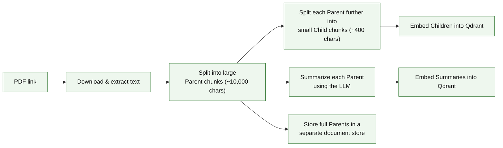
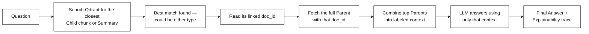
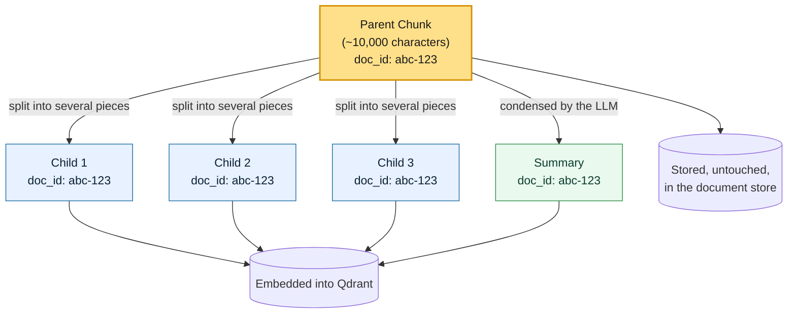
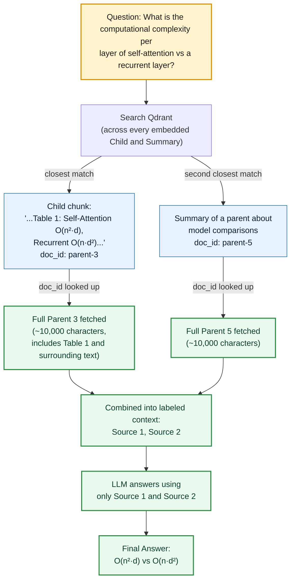

# Parent-Child & Summary-Based Multi-Vector RAG

---

# Problem Statement / Use Case Overview

A standard RAG pipeline embeds the exact same piece of text it later hands to the LLM. That creates a tug-of-war between two goals that both want a different chunk size. Small chunks embed precisely and match a question well, but they don't give the LLM enough surrounding context to answer fully. Large chunks give the LLM plenty of context, but they embed poorly, since a big block of mixed topics rarely matches a specific question closely.

This document covers a way around that trade-off: stop using the same chunk for both jobs. A document is split into large **parent** chunks, which hold all the context the LLM will eventually need. Each parent is then split further into small **child** chunks, and also condensed into a short **summary** — both of which are built specifically to be easy to search. The children and summaries are the only things actually embedded and searched; the parents are stored separately and never touched during search. When a question comes in, the search step finds the closest-matching child or summary, and a retriever swaps it out for its full parent document before that goes to the LLM — meaning the piece that wins the search is never the piece the LLM actually reads.

**This pipeline has four connected parts:**

1. **Splitting** — break the document into large parent chunks, then split each parent further into small child chunks.
2. **Summarizing** — condense every parent into a short summary using the LLM.
3. **Indexing** — embed only the children and summaries into a vector store, while storing the full parents separately, linked by a shared ID.
4. **Retrieving and answering** — search the vectors, swap each match for its linked parent, and generate an answer with a full reasoning trace.

This is useful for:
- **Long, information-dense documents** — where a single paragraph often isn't enough context, but the whole document is too much to embed usefully.
- **Improving search precision without losing context** — small children and summaries search well; full parents still get read by the LLM.
- **Multiple ways to be found** — a parent can be matched either through one of its child chunks or through its own summary, giving it two chances to be the right result.

---

# Input Data

| Item | Detail |
|------|--------|
| **The PDF** | A document downloaded automatically from a link |
| **Your question** | A natural-language question about the document |
| **LLM API Key** | Used to generate summaries and the final answer |
| **Embedding model** | Runs locally — no API key needed, downloaded automatically the first time it's used |
| **Qdrant Cloud cluster (URL + API key)** | Hosts the vector store that holds the child and summary embeddings |

---

# Processing

### Part A — Building the Two-Layer Index



Every parent chunk feeds three separate things: its own storage in the document store, a set of child chunks, and a summary. Only the children and summaries end up as vectors in Qdrant — the parents themselves are never embedded, since their job is to hold context, not to be found through search.

### Part B — How a Question Finds Its Answer



The piece that actually wins the vector search — a child chunk or a summary — is never what reaches the LLM. As soon as a match is found, its `doc_id` is used to look up the complete parent it came from, and that full parent is what gets added to the context. This is the core trick of multi-vector retrieval: search on the small, precise version, but answer from the large, complete version.

### How One Parent Becomes Two Searchable Entry Points

Here's what happens to a single parent chunk, concretely, as it moves through the pipeline. Say a parent chunk holds several paragraphs about self-attention and computational complexity:



Every one of those four searchable pieces — the three children and the summary — carries the exact same `doc_id` as the parent they came from. That shared ID is the only link between them; a question can match any one of the four and still be routed back to the same full parent. This is also why a single parent can be "found" through more than one path: its summary might match a broad question about the topic overall, while one of its children might match a very specific detail — but either way, the same parent ends up in the LLM's context.

### Walking Through a Sample Retrieval

Now here's the reverse direction — a real question coming in and actually finding its way to an answer, using the question from this document's own sample run:



`search_kwargs={"k": 2}` means two matches come back, not just one — here, the closest match happens to be a *child* chunk (since the exact numbers from Table 1 sit in a small, precise fragment), while the second-closest happens to be a *summary* (since it's a broader match on the surrounding topic). Both matches immediately hand off to their full parents rather than being used as-is, so the LLM ends up reading two complete ~10,000-character sections, not two small fragments — which is exactly why its explainability trace was able to reference "Table 1" by name, something a lone 400-character child could easily have cut off mid-sentence.

---

# Qdrant Overview

**What is Qdrant?**

Qdrant is an open-source vector database — a database built specifically for storing embeddings (the numeric vectors that represent text) and for finding the ones closest to a query vector. Instead of matching exact text, it measures how semantically similar vectors are, so a question phrased differently from the stored text can still find the right content. In this lab, Qdrant is the search layer: it stores the small child chunks and the summaries as vectors, so a question can quickly retrieve the best matches before the retriever swaps them for their full parent documents.

The connection is made in Step 3, where `QdrantVectorStore.from_texts(...)` takes three pieces of information:

- `url` — the address of your Qdrant Cloud cluster, i.e. where the vectors live.
- `api_key` — the secret key that authorizes your code to read from and write to that cluster.
- `collection_name` — the name of the "collection" (a Qdrant collection is roughly a table of vectors) that stores the children and summaries.

---

# Output

**Extracting the document** prints the total character count:

```
Extracted 39611 characters.
```

**Splitting into parent chunks** prints how many were created:

```
Created 5 Parent Documents.
```

**Splitting parents into child chunks** prints the total count across all parents:

```
Created 117 Child Documents.
```

**Summarizing every parent** confirms how many summaries were generated:

```
Generated 5 Summaries.
```

**Building the multi-vector index** confirms both the children and summaries were embedded, and the parents were linked in:

```
Multi-vector search index ready.
```

**Running the pipeline** on the question *"What is the computational complexity per layer of a self-attention mechanism compared to a recurrent layer?"* returns a two-part answer:

```
### Final Answer
A self-attention layer has a per-layer computational complexity of **O(n² · d)**, whereas a recurrent layer has a complexity of **O(n · d²)**. Thus, self-attention scales quadratically with sequence length but linearly with representation dimension, while recurrent layers scale linearly with sequence length but quadratically with representation dimension.

### AI Tracing & Explainability
I extracted the complexity figures from Table 1 in the provided context. The table lists:
- **Self-Attention**: complexity per layer = **O(n² · d)**.
- **Recurrent**: complexity per layer = **O(n · d²)**.

These entries directly answer the question by comparing the two mechanisms. No additional text was copied; I simply referenced the table's values and explained the scaling relationship.
```

Notice the explainability trace references a specific table from the source document — something only visible because the full parent chunk (not just a small child fragment) was passed to the LLM as context.

---

# Tech Stack

| Component | Tool |
|---|---|
| **PDF Text Extraction** | `pypdf` — pulls raw text out of every page of the PDF |
| **File Downloading** | `requests` — grabs the PDF from a link |
| **Text Splitting** | `langchain-text-splitters` (`RecursiveCharacterTextSplitter`) — used twice, once for large parent chunks and once for small child chunks |
| **Summarization** | LLM (`openai/gpt-oss-20b:free`), via an LCEL chain built with `langchain-core` |
| **Embedding Model** | `sentence-transformers` / `all-MiniLM-L6-v2`, via `langchain-huggingface` — runs locally |
| **Vector Store** | `Qdrant` Cloud, via `langchain-qdrant` — a hosted vector database holding only the children and summaries, accessed with a cluster `url` and `api_key` |
| **Document Store** | `InMemoryByteStore` — holds the full parent documents, keyed by ID |
| **Retrieval Logic** | `MultiVectorRetriever`, from `langchain-classic` — searches the vector store, then swaps each match for its linked parent |
| **Prompt & Chain Orchestration** | `langchain-core` — `ChatPromptTemplate`, `RunnablePassthrough`, `RunnableParallel`, and `StrOutputParser`, chained together with the `\|` operator |
| **Notebook Display** | `IPython.display` (`Markdown`, `display`) — renders the LLM's markdown answer with formatting in the notebook |

---

# Underlying Concepts (Summarized)

**Multi-Vector Retrieval** is the general idea behind this pipeline: instead of embedding and searching the exact text that gets shown to the LLM, one or more *searchable* representations are embedded instead, and each is linked back to the *real* content that should actually be used once a match is found.

**Parent Chunk** is a large piece of the document, sized to give the LLM enough surrounding context to answer well. Parents are never embedded directly — they're only ever retrieved by way of something smaller that points to them.

**Child Chunk** is a small piece cut out of a parent, sized to embed precisely enough to match a specific, narrow question. Every child carries the same ID as its parent, so a match on the child can be traded for the full parent afterward.

**Summary** is a short, LLM-generated condensation of a parent's content. Because it's phrased more like a general description of the topic, it tends to match broader questions that a narrow child chunk might miss.

**`doc_id`** is the shared identifier that ties a parent to all of its children and its summary. It's the only thing connecting the searchable vectors to the real documents sitting in the separate document store.

**LCEL (LangChain Expression Language)** is the `|`-based syntax used to chain steps together — for example, `prompt | llm | StrOutputParser()` means "fill in the prompt, send it to the model, then turn the reply into a plain string." It keeps a multi-step process readable as a single expression.

> **Why this matters:** Searching a full 10,000-character parent chunk directly would blur together many different ideas into one vector, making it hard to match against a specific question. Searching a 400-character child instead finds a precise, narrow match — but the LLM still needs the surrounding paragraphs to answer completely, which is exactly what gets pulled back in once the matching child's `doc_id` points to its parent.

---

# Pre-requisites

- **Basic familiarity** with Python (functions, loops, `import` statements).
- **A general sense of what RAG and embeddings are** — retrieving relevant text using vector similarity before asking an LLM to answer.
- **An LLM API Key** — used for summarization and for generating the final answer.
- **A Qdrant Cloud cluster** — you'll need its URL and API key to host the vector store (see "Getting Qdrant Credentials" below).

---

# Getting Qdrant Credentials

1. Go to [cloud.qdrant.io](https://cloud.qdrant.io) and sign up, or log in if you already have an account.
2. Click **Create Cluster** to set up a new cluster. A free tier is available for testing and is enough for this lab.
3. Choose a cloud provider and region, give the cluster a name, and confirm. Creating it takes a minute or two while the cluster provisions.
4. Once the cluster is ready, open its **Overview** page and copy the **Cluster URL** — it looks like `https://<cluster-id>.cloud.qdrant.io:6333`. This value replaces the `"your-endpoint"` placeholder in Step 3.
5. Open the cluster's **Access Control** (or **API Keys**) tab. Copy the existing API key, or create a new one. This value replaces the `"your-api-key"` placeholder in Step 3.

> **Tip:** Keep the key out of the notebook itself by loading it from an environment variable, e.g. `api_key=os.getenv("QDRANT_API_KEY")`, so it isn't exposed if the file is shared.

---

# Environment / Dependencies Setup

The cell below installs all required Python packages:

| Package | Purpose |
|---------|---------|
| `langchain`, `langchain-classic`, `langchain-community` | Core LangChain components, including `MultiVectorRetriever` |
| `langchain-openai` | Wraps the LLM in LangChain's `ChatOpenAI` interface |
| `langchain-huggingface` | Wraps the local embedding model |
| `langchain-qdrant`, `qdrant-client` | Connects to and manages the Qdrant vector store |
| `pypdf` | **PDF text extraction** |
| `tiktoken` | Token counting, used internally by some LangChain components |
| `flask`, `numpy`, `scipy`, `scikit-learn` | Supporting libraries used by the retrieval and embedding stack |
| `sentence-transformers` | Backs the local embedding model |
| `ipython` | Provides `IPython.display` (`Markdown`, `display`) for rendering answers in the notebook |

> **Note:** Run this cell first — it only needs to be run once per session.

```python
!pip install -qU langchain langchain-classic langchain-community langchain-openai langchain-huggingface langchain-qdrant qdrant-client pypdf tiktoken flask numpy scipy scikit-learn sentence-transformers ipython
```

---

# Step-wise Instructions — Development

---

### Step 1 — Imports

```python
import uuid
import requests
from pypdf import PdfReader
from langchain_openai import ChatOpenAI
from langchain_huggingface import HuggingFaceEmbeddings
from langchain_text_splitters import RecursiveCharacterTextSplitter

# Retrieval and Storage
from langchain_classic.retrievers.multi_vector import MultiVectorRetriever
from langchain_core.stores import InMemoryByteStore

# Vector Store
from langchain_qdrant import QdrantVectorStore

# Core Components
from langchain_core.documents import Document
from langchain_core.prompts import ChatPromptTemplate
from langchain_core.output_parsers import StrOutputParser
from langchain_core.runnables import RunnablePassthrough
from langchain_core.runnables import RunnableParallel

# Display
from IPython.display import Markdown, display
```

| Import | Purpose |
|---|---|
| `uuid` | Generates a unique ID linking each parent to its children and summary |
| `requests` | Downloads the PDF |
| `PdfReader` | Extracts raw text from the PDF |
| `ChatOpenAI` | LangChain's wrapper for calling the LLM |
| `HuggingFaceEmbeddings` | Loads the local embedding model |
| `RecursiveCharacterTextSplitter` | Splits text into chunks, used for both parents and children |
| `MultiVectorRetriever` | Searches the vector store, then swaps each match for its linked parent |
| `InMemoryByteStore` | Holds the full parent documents |
| `QdrantVectorStore` | The vector store holding children and summaries |
| `Document` | LangChain's standard wrapper for a piece of text plus its metadata |
| `ChatPromptTemplate` | Builds a reusable prompt with fillable variables |
| `StrOutputParser` | Converts the LLM's reply into a plain string |
| `RunnablePassthrough`, `RunnableParallel` | Building blocks for chaining steps together with LCEL |
| `Markdown`, `display` | Renders the LLM's markdown answer with proper formatting in the notebook |

---

### Step 2 — Configure Models

```python
# Initialize Chat Model
llm = ChatOpenAI(
    openai_api_key="your-api-key",
    openai_api_base="https://openrouter.ai/api/v1",
    model_name="openai/gpt-oss-20b:free",
    temperature=0.0
)

# Initialize Dense Embedding Model
embeddings = HuggingFaceEmbeddings(model_name="all-MiniLM-L6-v2")
```

> **Note:** Replace `"your-api-key"` with the actual key from OpenRouter, or load it with `os.getenv("OPENROUTER_API_KEY")` after setting it as an environment variable, which keeps the actual key out of the file itself. `temperature=0.0` keeps the summaries and final answers consistent. This one LLM connection is reused for both summarizing parents and generating the final answer.

---

### Step 3 — Initialize Storage Architecture

```python
# Qdrant Cloud holds the child & summary VECTORS (the semantic search index)
vectorstore = QdrantVectorStore.from_texts(
    texts=["Initialize"], 
    embedding=embeddings, 
    url="your-endpoint",
    api_key="your-api-key",
    collection_name="multi_vector_collection"
)

# Will hold the full parent documents, keyed by doc_id, once the retriever wraps it
store = InMemoryByteStore()
id_key = "doc_id"
```

This cell connects the pipeline to Qdrant Cloud and sets up the storage that backs the multi-vector retriever. `QdrantVectorStore.from_texts(...)` opens — or creates, if it doesn't already exist — a Qdrant collection named `multi_vector_collection` on the cluster at the given `url`, authenticating with the cluster's `api_key`. The `texts=["Initialize"]` argument seeds the collection with one throwaway vector, purely so the collection is created before the real documents are added later. The `embedding=embeddings` argument tells Qdrant which embedding model produced the vectors being stored. `store` is an `InMemoryByteStore` that will hold the full parent documents, and `id_key = "doc_id"` names the metadata field that will link every vector back to its parent.

---

### Step 4 — Download & Extract Document

```python
# Attention is All You Need paper (source document for this lab)
PDF_URL = "https://arxiv.org/pdf/1706.03762.pdf"
PDF_FILENAME = "attention_paper.pdf"

# Download the PDF and save it locally; raise an error on HTTP failure
response = requests.get(PDF_URL)
response.raise_for_status()

with open(PDF_FILENAME, "wb") as f:
    f.write(response.content)
```

```python
# Extract text from every page and join pages with newlines into one string
reader = PdfReader(PDF_FILENAME)
raw_text = "\n".join([page.extract_text() for page in reader.pages if page.extract_text()])

print(f"Extracted {len(raw_text)} characters.")
```

Unlike the shorter previews used in some other pipelines, this step reads every page in the PDF rather than stopping after a small character limit, since the full multi-vector setup is meant to handle a complete, long document. By the end of this step, `raw_text` holds the entire extracted document as one string.

---

### Step 5 — Generate Parent Documents

```python
# Parent chunks are LARGE (~10k chars) so the LLM has full context to answer from
parent_splitter = RecursiveCharacterTextSplitter(chunk_size=10000, chunk_overlap=200)
parent_chunks = parent_splitter.split_text(raw_text)

# Wrap each chunk in a Document (parents are stored, not embedded directly)
parent_docs = [Document(page_content=chunk) for chunk in parent_chunks]

print(f"Created {len(parent_docs)} Parent Documents.")
```

A `chunk_size` of 10,000 characters is large enough to hold several paragraphs of surrounding context, which is exactly what the LLM will eventually need to answer fully. By the end of this step, `parent_docs` holds a list of `Document` objects — the exact pieces that will later be stored, untouched, and handed to the LLM once one of their children or summaries is matched.

---

### Step 6 — Generate Child Documents

```python
# Child chunks are SMALL (~400 chars) so they embed precisely for semantic search
child_splitter = RecursiveCharacterTextSplitter(chunk_size=400, chunk_overlap=50)
child_docs = []

for doc in parent_docs:
    # Give each parent a unique ID, then tag every child with that same ID
    _id = str(uuid.uuid4())
    doc.metadata["doc_id"] = _id
    
    child_splits = child_splitter.split_documents([doc])
    for child in child_splits:
        child.metadata["doc_id"] = _id
    
    child_docs.extend(child_splits)

print(f"Created {len(child_docs)} Child Documents.")
```

This is where the link between parents and children is actually created: a fresh `uuid` is generated for each parent, stamped onto the parent itself, and then copied onto every child cut out of it. By the end of this step, every parent has a unique `doc_id`, and every one of its children carries that exact same ID in its metadata.

---

### Step 7 — Define and Execute Summarization Pipeline

```python
# Prompt: compress a parent chunk into a short summary while keeping key terms
summary_prompt = ChatPromptTemplate.from_template(
    "Summarize the following core concepts concisely. Do not lose technical keywords.\n\nText: {context}"
)

# LCEL chain: pass text through unchanged → prompt → LLM → plain string output
summary_chain = (
    {"context": RunnablePassthrough()} 
    | summary_prompt 
    | llm 
    | StrOutputParser()
)
```

```python
summary_docs = []

# Summarize each parent and carry its doc_id so the summary maps back to it
for doc in parent_docs:
    summary_text = summary_chain.invoke(doc.page_content)
    
    summary_doc = Document(
        page_content=summary_text,
        metadata={"doc_id": doc.metadata["doc_id"]}
    )
    summary_docs.append(summary_doc)

print(f"Generated {len(summary_docs)} Summaries.")
```

`RunnablePassthrough()` simply lets the raw parent text flow into the prompt unchanged, and the chain then sends that filled-in prompt to the LLM and converts the reply into a plain string. Each resulting summary is wrapped in its own `Document`, carrying the same `doc_id` as the parent it was built from — the same linking pattern used for the children in the step before.

---

### Step 8 — Configure Multi-Vector Retriever

```python
retriever = MultiVectorRetriever(
    vectorstore=vectorstore,   # searches child/summary embeddings
    byte_store=store,          # returns the linked parent documents
    id_key=id_key,             # the metadata field linking vectors to parents
    search_kwargs={"k": 2}    # return top-2 matches per query
)

# Store the full parent Documents in the docstore (auto-serialized into the ByteStore)
retriever.docstore.mset([(doc.metadata[id_key], doc) for doc in parent_docs])

# Embed the children and summaries into Qdrant; all point to a parent via doc_id
retriever.vectorstore.add_documents(child_docs)
retriever.vectorstore.add_documents(summary_docs)

print("Multi-vector search index ready.")
```

This is where the two storage systems set up in Step 3 are wired together into one retriever. `retriever.docstore.mset(...)` saves every parent, keyed by its `doc_id`, into the byte store. `add_documents` then embeds the children and summaries into Qdrant, each still carrying the `doc_id` that connects it back to its parent. `search_kwargs={"k": 2}` means every query returns the top 2 closest matches, whether those happen to be children, summaries, or a mix of both.

---

### Step 9 — Define the RAG Execution Function with Explainability

```python
# Prompt instructing the LLM to answer AND explain its own reasoning/source usage
qa_template = """
You are a technical assistant. Answer the question using ONLY the provided context.

Context:
{context}

Question: {question}

Respond in exactly this format:

### Final Answer
<a clear, direct answer to the question>

### AI Tracing & Explainability
<Explain step by step how you arrived at the answer. Refer to the sources you used by their label (e.g. "Source 1"), state what each one contributed, and why it was relevant. Do not copy large blocks of text from the context — explain in your own words. Use as many lines as you need.>
"""

qa_prompt = ChatPromptTemplate.from_template(qa_template)

def format_docs(docs):
    """Label each source so the LLM can reference it by number in its tracing."""
    formatted = []
    for i, doc in enumerate(docs):
        parent_id = doc.metadata.get('doc_id', 'N/A')
        formatted.append(f"[Source {i+1}] (Parent ID: {parent_id})\n{doc.page_content}")
    return "\n\n".join(formatted)

# Run retrieval and capture the raw query in parallel
retrieval_chain = RunnableParallel(
    {"context": retriever, "question": RunnablePassthrough()}
)

# Format the retrieved parents → prompt → LLM → answer text
generation_chain = (
    RunnablePassthrough.assign(context=(lambda x: format_docs(x["context"])))
    | qa_prompt
    | llm
    | StrOutputParser()
)

# Full pipeline: retrieval first, then generation on top of the retrieved context
rag_chain = retrieval_chain.assign(answer=generation_chain)
```

`format_docs` numbers each retrieved parent as "Source 1," "Source 2," and so on, which is what lets the LLM refer back to specific sources by name in its explainability trace, instead of describing them vaguely. `RunnableParallel` runs the retriever and simply carries the raw question forward at the same time, so both are available to the next step. `generation_chain` then formats whatever parents came back, fills in the prompt, and asks the LLM to answer strictly in the two-section format defined above. `rag_chain` ties both halves together into a single object that can be run with one call.

---

### Step 10 — Execute Query

```python
def run_rag_pipeline(query: str):
    """
    Executes the RAG pipeline and displays the LLM's own answer + reasoning.
    """
    response = rag_chain.invoke(query)
    display(Markdown(response["answer"]))
    return response
```

```python
query = "What is the computational complexity per layer of a self-attention mechanism compared to a recurrent layer?"
response = run_rag_pipeline(query)
```

`rag_chain.invoke(query)` runs the entire pipeline end-to-end: the question is embedded, the closest children and summaries are found, their parents are pulled in, and the LLM answers using that full context. `display(Markdown(...))` renders the answer with its headings and bold text formatted properly inside the notebook, rather than as plain unformatted text.

---

# What We Learnt

By the end of this document, a single document has been indexed twice over — once as small, precise children and summaries for searching, and once as large, complete parents for answering — with a retriever in between that automatically swaps one for the other.

**Key takeaways:**
- **Search precision and answer context don't have to come from the same chunk** — small children and summaries are what get searched, while their much larger parents are what actually get read by the LLM.
- **A shared ID is what makes the swap possible** — every child and summary carries the exact same `doc_id` as its parent, which is how a match on one instantly resolves to the other.
- **A parent can be found more than one way** — through any of its child chunks, or through its own summary, giving broad and narrow questions both a fair chance of finding it.
- **Two separate storage systems play different roles** — a vector store holds only what needs to be searched, while a plain document store holds the full content that needs to be preserved exactly as written.
- **LCEL chains keep multi-step logic readable** — formatting, prompting, calling the LLM, and parsing the reply are expressed as one chained pipeline rather than several separate function calls.
- **Explainability still works, even with retrieved parents rather than tiny fragments** — labeling each source lets the LLM reference exactly which parent contributed which part of the answer.