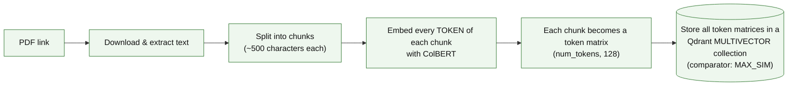
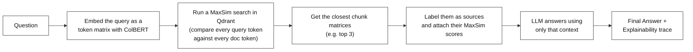
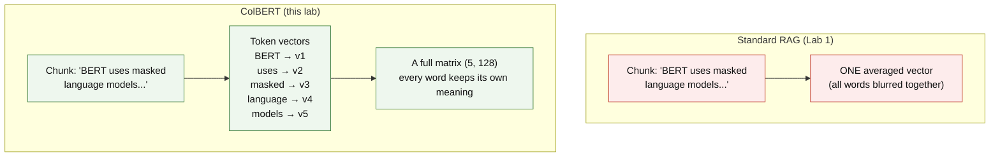
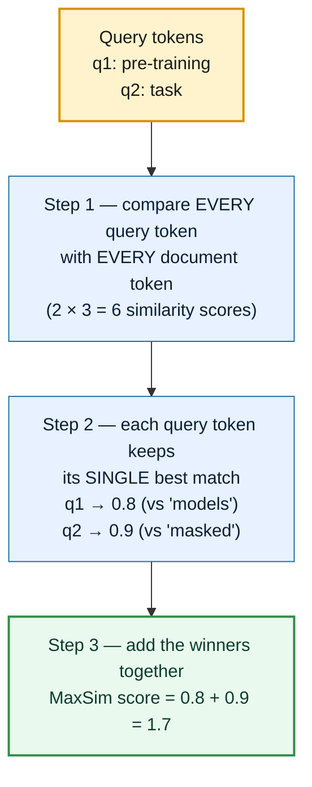
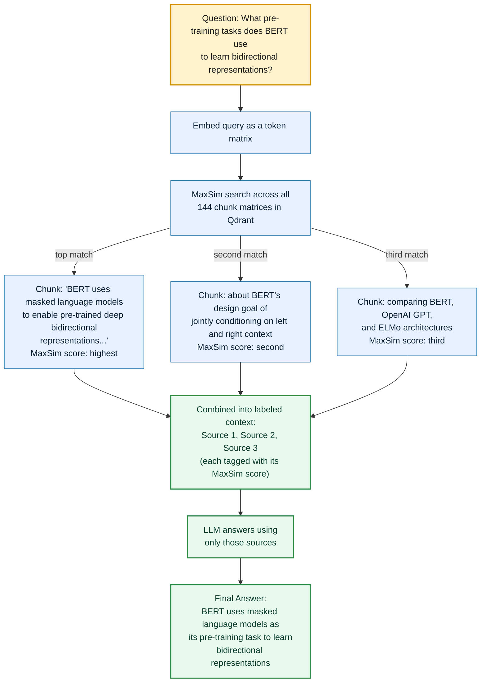

# ColBERT & Late Interaction RAG

---

# Problem Statement / Use Case Overview

In standard RAG, every text chunk is squeezed into a single dense vector. That works fine for small, focused chunks, but it fails when a chunk covers many topics. A long chunk gets compressed into one averaged number, so the meaning of individual words gets blurred together. If your question matches only one small detail inside that chunk, the search may not find it, because the detail is lost inside the averaged vector.

ColBERT takes a completely different approach. Instead of keeping **one vector per chunk**, it keeps **one vector per TOKEN**. This means every single word in the chunk gets its own separate vector, so the fine-grained meaning of every word is preserved. Nothing gets averaged out.

But keeping a vector per token creates a new problem: how do you compare two sets of vectors? This is solved with **MaxSim** — short for **Max**imum **Sim**ilarity — the "late interaction" method ColBERT uses. MaxSim is just one three-step rule:

1. Compare **every** query token against **every** document token.
2. For each query token, keep only its single **maximum** (best) score — the one document token it matched most strongly.
3. **Add** those maxima together to get one final score for the chunk.

A chunk scores well when a few of its tokens match the query's tokens very precisely, even if the rest of the chunk is unrelated. Whenever you see "MaxSim" later in this document, it always means this same three-step rule.

**This pipeline has four connected parts:**

1. **Embedding** — embed every token of every chunk with ColBERT, producing a matrix per chunk instead of a single vector.
2. **Indexing** — store these token matrices in a Qdrant **multivector** collection, which Qdrant compares with MaxSim instead of plain cosine similarity.
3. **Retrieving** — embed the query as a token matrix and run a MaxSim (late interaction) search to find the closest chunks.
4. **Answering** — label the retrieved chunks as sources, hand them to an LLM, and generate a final answer with a full reasoning trace.

This is useful for:
- **Exact-detail questions** — where a single precise token inside a large chunk is the only thing that matters.
- **Long, information-dense documents** — where many fine-grained details coexist inside one chunk.
- **Precise matching** — the token-level search finds chunks that standard single-vector search would miss.

---

# Input Data

| Item | Detail |
|------|--------|
| **The PDF** | A document downloaded automatically from a link |
| **Your question** | A natural-language question about the document |
| **LLM API Key** | Used to generate the final answer |
| **ColBERT model** | Runs locally — no API key needed, downloaded automatically the first time it's used |
| **Qdrant Cloud cluster (URL + API key)** | Hosts the multivector store that holds the token-level embeddings |

---

# Processing

### Part A — Building the Token-Level Index



The big difference from Lab 1 is what gets stored. In Lab 1, each chunk became one vector. Here, each chunk becomes a whole **matrix** of vectors — one 128-dimensional vector for every token in the chunk. A chunk with 93 tokens produces a `(93, 128)` matrix. The whole collection is created with the `MAX_SIM` comparator, which tells Qdrant to score matches the ColBERT way instead of the normal cosine way.

### Part B — How a Question Finds Its Answer



The question itself is embedded the same way as the documents — as a token matrix. Qdrant then compares every query token against every document token, takes the best match per query token, and sums those best matches. The top-scoring chunks are formatted with labels and scores, and only then does the LLM produce the answer.

### One Chunk vs One Token Matrix

Here is the core difference between this lab and Lab 1, side by side:



In standard RAG, a chunk with many ideas gets flattened into one averaged number, so a detail like "masked" gets diluted. In ColBERT, each token keeps its own vector, so the detail survives intact and can be matched directly.

### How MaxSim Scoring Works

In plain words, MaxSim = **Max**imum **Sim**ilarity, and it answers one question: *"How strongly do my question's words match the best words in this chunk?"* It runs in three steps:

1. **Score every pair** — each query token is compared with each document token, producing one similarity score for every combination.
2. **Pick each query token's best** — for every query token, keep only the single highest score.
3. **Sum the best scores** — add those winners together. The total is the chunk's MaxSim score.

**Analogy:** the query is a list of clues, and the chunk is a shelf of words. Each clue finds the single word on the shelf it matches best and reports the strength of that match. The chunk's score is the sum of all the clues' best matches.

Here is the whole process in one picture — just three steps in a row, no crossing arrows:



**The same numbers as a table.** Step 1 fills in this grid — rows are query tokens, columns are document tokens, each cell is the similarity of that one pair:

| Query token ↓ / Doc token → | d1: masked | d2: language | d3: models | Best match (kept) |
|---|---|---|---|---|
| **q1: pre-training** | 0.1 | 0.2 | **0.8** | **0.8** |
| **q2: task** | **0.9** | 0.3 | 0.1 | **0.9** |

Step 2 reads the grid row by row: for q1 the best cell is 0.8 (vs *models*); for q2 the best cell is 0.9 (vs *masked*). Every other cell is discarded. Step 3 adds the two winners: **0.8 + 0.9 = 1.7**, and that single number is the chunk's MaxSim score.

**Why this beats one averaged vector:** with a single vector per chunk, a score like 1.7 could never be computed — all those words would already be blurred into one number. With MaxSim, the chunk scores high because *pre-training* matched *models* strongly and *task* matched *masked* strongly, even though every other word in the chunk is irrelevant to the question. That is exactly why ColBERT can find a chunk that shares only a couple of precise words with the question.

### Walking Through a Sample Retrieval

Here is a real question going through the pipeline, using the question from this document's own sample run:



`top_k=3` means three chunk matrices come back. The top match contains the exact phrase "masked language models", which is the precise answer. The second and third matches are related but do not name the specific pre-training task. Only Source 1 really answers the question, and the LLM's explainability trace says exactly that — showing how token-level search can surface one very specific chunk out of 144.

---

# Qdrant Overview

**What is Qdrant?**

Qdrant is an open-source vector database — a database built specifically for storing embeddings (the numeric vectors that represent text) and for finding the ones closest to a query vector. Instead of matching exact text, it measures how semantically similar vectors are. In this lab, Qdrant is the search layer: it stores ColBERT's token matrices so a question can quickly find the closest chunks.

The connection is made in Step 3, where `QdrantClient(...)` takes two pieces of information:

- `url` — the address of your Qdrant Cloud cluster, i.e. where the token matrices live.
- `api_key` — the secret key that authorizes your code to read from and write to that cluster.

**What is a multivector collection?**

Normally a Qdrant collection stores one vector per point. This lab needs more, because each chunk holds many token vectors. So the collection is created with `models.MultiVectorConfig`, which tells Qdrant to treat every point as a matrix. Three settings matter:

- `size=128` — every token vector has 128 dimensions (the size ColBERT produces).
- `distance=models.Distance.COSINE` — single-token similarity is measured with cosine similarity.
- `comparator=models.MultiVectorComparator.MAX_SIM` — whole-chunk scoring is done with MaxSim, the ColBERT late-interaction method.

This is the special part of the whole lab: the comparator is what makes Qdrant behave like ColBERT — it ranks every point with the same three-step MaxSim rule described in *How MaxSim Scoring Works* above.

---

# Output

**Extracting the document** prints the total character count:

```
Extracted 64139 characters.
```

**Splitting into chunks** prints how many were created:

```
Created 144 chunks.
```

**Generating ColBERT embeddings** prints the shape of the first chunk's matrix — a sanity check that each chunk became a token matrix, not a single vector:

```
First chunk embedding shape: (93, 128)
```

**Ingesting into Qdrant** confirms how many points were uploaded:

```
Uploaded 144 ColBERT points.
```

**Running the pipeline** on the question *"What pre-training tasks does BERT use to learn bidirectional representations?"* returns a two-part answer:

```
### Final Answer
BERT uses masked language models as its pre-training task to learn bidirectional representations.

### AI Tracing & Explainability
- **Source 1** explicitly states: "BERT uses masked language models to enable pre-trained deep bidirectional representations." This directly answers the question by naming the pre-training task (masked language models) and linking it to bidirectional representation learning.
- **Source 2** describes BERT's design goal (pre-training deep bidirectional representations by jointly conditioning on left and right context) but does not name the specific pre-training task.
- **Source 3** compares model architectures (BERT, OpenAI GPT, ELMo) and notes that only BERT is jointly conditioned on both left and right context in all layers, but it does not specify the pre-training task used.

Only Source 1 provides the name of the pre-training task, so the answer is based solely on that information.
```

Notice the trace says only Source 1 really answered the question. That is exactly the kind of precise, token-level hit ColBERT is designed to find.

---

# Tech Stack

| Component | Tool |
|---|---|
| **PDF Text Extraction** | `pypdf` — pulls raw text out of every page of the PDF |
| **File Downloading** | `requests` — grabs the PDF from a link |
| **Text Splitting** | `langchain-text-splitters` (`RecursiveCharacterTextSplitter`) — splits the document into 500-character chunks |
| **Embedding Model** | `fastembed` (`LateInteractionTextEmbedding`, model `colbert-ir/colbertv2.0`) — embeds every token locally |
| **Vector Store** | `qdrant-client` — a multivector collection on Qdrant Cloud that stores the token matrices and compares them with MaxSim |
| **LLM** | `langchain-openai` (`ChatOpenAI`) — generates the final answer |
| **Prompt & Chain Orchestration** | `langchain-core` — `ChatPromptTemplate` and `StrOutputParser`, chained together with the `\|` operator |
| **Stable IDs** | Python's `uuid` — `uuid5` hashes chunk text into a deterministic ID |
| **Notebook Display** | `IPython.display` (`Markdown`, `display`) — renders the LLM's markdown answer with formatting in the notebook |

---

# Underlying Concepts (Summarized)

**Token-level embedding** is the idea behind ColBERT: instead of compressing a whole chunk into one vector, every token (roughly every word) gets its own vector. A chunk becomes a matrix with one row per token. This keeps the meaning of each individual word intact, so a single precise detail can still be matched.

**Late interaction** is the matching strategy that goes with token-level embeddings. The query and the document are embedded separately (that's the "late" part — they never meet during embedding). They are only compared afterward, token by token, at search time.

**MaxSim** is the specific late-interaction scoring rule. Each query token is compared against every document token, and for each query token we keep only its best (maximum) match. Those maxima are then summed into one score. A chunk scores well if a few of its tokens match the query's tokens very strongly, even if most of its other tokens are unrelated.

**Multivector collection** is Qdrant's feature for storing more than one vector per point. It allows each chunk to be stored as its full token matrix. The `MAX_SIM` comparator makes Qdrant rank points the ColBERT way rather than with plain cosine similarity.

**Deterministic chunk ID** is an ID derived from the chunk's own text using `uuid.uuid5`. The same chunk always produces the same ID, even if the notebook is rerun. This keeps Qdrant consistent and prevents duplicate or orphaned points.

**LCEL (LangChain Expression Language)** is the `|`-based syntax used to chain steps together — for example, `qa_prompt | llm | StrOutputParser()` means "fill in the prompt, send it to the model, then turn the reply into a plain string." It keeps a multi-step process readable as a single expression.

> **Why this matters:** A single dense vector per chunk blurs many topics into one averaged number, so a specific detail inside a long chunk is hard to match. Token-level embedding keeps every word separate, and MaxSim lets one strongly-matching token decide the winner — so a chunk can be found because of a few precise words, not just because it is broadly similar.

---

# Pre-requisites

- **Basic familiarity** with Python (functions, loops, `import` statements).
- **A general sense of what RAG and embeddings are** — retrieving relevant text using vector similarity before asking an LLM to answer.
- **An LLM API Key** — used for generating the final answer.
- **A Qdrant Cloud cluster** — you'll need its URL and API key to host the multivector store (see "Getting Qdrant Credentials" below).

---

# Getting Qdrant Credentials

1. Go to [cloud.qdrant.io](https://cloud.qdrant.io) and sign up, or log in if you already have an account.
2. Click **Create Cluster** to set up a new cluster. A free tier is available for testing and is enough for this lab.
3. Choose a cloud provider and region, give the cluster a name, and confirm. Creating it takes a minute or two while the cluster provisions.
4. Once the cluster is ready, open its **Overview** page and copy the **Cluster URL** — it looks like `https://<cluster-id>.cloud.qdrant.io`. This value replaces the `"your-endpoint"` placeholder in Step 3.
5. Open the cluster's **Access Control** (or **API Keys**) tab. Copy the existing API key, or create a new one. This value replaces the `"your-api-key"` placeholder in Step 3.

> **Tip:** Keep the key out of the notebook itself by loading it from an environment variable, e.g. `api_key=os.getenv("QDRANT_API_KEY")`, so it isn't exposed if the file is shared.

---

# Environment / Dependencies Setup

The cell below installs all required Python packages:

| Package | Purpose |
|---------|---------|
| `qdrant-client` | Connects to and manages the Qdrant vector store, including multivector collections |
| `fastembed` | Runs the ColBERT `LateInteractionTextEmbedding` model locally |
| `langchain-openai` | Wraps the LLM in LangChain's `ChatOpenAI` interface |
| `langchain-text-splitters` | Splits the document into chunks with `RecursiveCharacterTextSplitter` |
| `pypdf` | **PDF text extraction** |
| `requests` | **Downloads the PDF** |
| `ipython` | Provides `IPython.display` (`Markdown`, `display`) for rendering answers in the notebook |

> **Note:** Run this cell first — it only needs to be run once per session.

```python
!pip install -qU qdrant-client fastembed langchain-openai langchain-text-splitters pypdf requests ipython
```

---

# Step-wise Instructions — Development

---

### Step 1 — Imports

```python
import uuid
import hashlib
import requests
from pypdf import PdfReader

# Vector Store
from qdrant_client import QdrantClient
from qdrant_client import models

# Embedding Model
from fastembed import LateInteractionTextEmbedding

# LLM & Text Processing
from langchain_openai import ChatOpenAI
from langchain_text_splitters import RecursiveCharacterTextSplitter

# Core Components
from langchain_core.prompts import ChatPromptTemplate
from langchain_core.output_parsers import StrOutputParser

# Display
from IPython.display import Markdown, display
```

| Import | Purpose |
|---|---|
| `uuid` | Generates deterministic chunk IDs with `uuid5` |
| `hashlib` | Hashing helpers for stable IDs |
| `requests` | Downloads the PDF |
| `PdfReader` | Extracts raw text from the PDF |
| `QdrantClient` | Connects to the Qdrant vector store |
| `models` | Qdrant's data types — used for `VectorParams` and `MultiVectorConfig` |
| `LateInteractionTextEmbedding` | Loads ColBERT for token-level embedding |
| `ChatOpenAI` | LangChain's wrapper for calling the LLM |
| `RecursiveCharacterTextSplitter` | Splits text into chunks |
| `ChatPromptTemplate` | Builds a reusable prompt with fillable variables |
| `StrOutputParser` | Converts the LLM's reply into a plain string |
| `Markdown`, `display` | Renders the LLM's markdown answer with proper formatting in the notebook |

---

### Step 2 — Configure Models

```python
# Initialize Chat Model
llm = ChatOpenAI(
    openai_api_key="your-api-key",
    openai_api_base="https://openrouter.ai/api/v1",
    model_name="nvidia/nemotron-3-ultra-550b-a55b:free",
    temperature=0.0
)
```

```python
# ColBERT embeds every TOKEN, so the output is a (num_tokens, 128) matrix — not a single vector
colbert = LateInteractionTextEmbedding("colbert-ir/colbertv2.0")
```

> **Note:** Replace `"your-api-key"` with the actual key from OpenRouter, or load it with `os.getenv("OPENROUTER_API_KEY")` after setting it as an environment variable, which keeps the actual key out of the file itself. `temperature=0.0` keeps the final answers consistent. `LateInteractionTextEmbedding` downloads the `colbert-ir/colbertv2.0` model locally the first time it runs — no API key is needed for it.

---

### Step 3 — Initialize Qdrant with Multivector Support or Use Existing Collection if Already Made

```python
client = QdrantClient(
    url="your-endpoint", 
    api_key="your-api-key",
    timeout=300,
)
COLLECTION_NAME = "colbert_late_interaction"

# FIRST TIME RUN: creates a fresh collection (wipes & rebuilds it), then data is uploaded in Step 8
# ColBERT stores token MATRICES, so Qdrant needs a MULTIVECTOR collection
# compared with MaxSim instead of plain cosine similarity
client.recreate_collection(
    collection_name=COLLECTION_NAME,
    vectors_config=models.VectorParams(
        size=128,
        distance=models.Distance.COSINE,
        multivector_config=models.MultiVectorConfig(
            comparator=models.MultiVectorComparator.MAX_SIM
        )
    )
)
```

```python
# ALREADY RAN THIS NOTEBOOK? Uncomment this cell if you have already
# made the DB (collection) / uploaded data, then run it instead of Cell A
# (Cell A wipes and recreates the collection, so only use it the first time).
# client = QdrantClient(
#     url="your-endpoint", 
#     api_key="your-api-key",
#     timeout=300,
# )
# COLLECTION_NAME = "colbert_late_interaction"
# No recreate_collection here — the collection already exists.
```

This is where the special multivector collection is born. `QdrantClient(...)` connects to your Qdrant Cloud cluster using the `url` and `api_key`. Then `recreate_collection` builds a collection called `colbert_late_interaction`. The key part is `multivector_config`: because ColBERT produces one vector per token, Qdrant must allow each point to hold a whole matrix. `size=128` matches ColBERT's vector size, `COSINE` is the per-token similarity measure, and `comparator=MAX_SIM` tells Qdrant to score whole chunks using MaxSim. `recreate_collection` wipes any old data with the same name and builds it fresh, so it is only meant for the first run.

The second cell is for when the collection **already exists in the cloud** — for example, from a previous run. It connects to the same cluster and collection name, but never wipes or recreates anything, so your data is preserved. This cell is **commented out by default**; only use it if you already ran the notebook before, in which case you comment out the cell above and uncomment this one.

---

### Step 4 — Download & Extract Document

```python
# BERT paper (source document for this lab)
PDF_URL = "https://arxiv.org/pdf/1810.04805.pdf"
PDF_FILENAME = "bert_paper.pdf"

# Download the PDF and save it locally; raise an error on HTTP failure
response = requests.get(PDF_URL)
response.raise_for_status()

with open(PDF_FILENAME, "wb") as f:
    f.write(response.content)
```

```python
# Extract text from every page and join pages with newlines into one string
reader = PdfReader(PDF_FILENAME)
raw_text = "\n".join([page.extract_text() for page in reader.pages if page.extract_text()])

print(f"Extracted {len(raw_text)} characters.")
```

This step downloads the BERT paper ("Attention Is All You Need"'s famous successor) from arXiv and saves it locally as `bert_paper.pdf`. Then every page is read and its text extracted, with pages joined by newlines into one big string called `raw_text`. `raise_for_status()` stops the code with an error if the download fails, instead of silently continuing.

---

### Step 5 — Chunk the Document

```python
# Smaller chunks than Lab 1: ColBERT embeds every token, so big chunks would mean huge matrices
chunk_splitter = RecursiveCharacterTextSplitter(chunk_size=500, chunk_overlap=50)
chunks = chunk_splitter.split_text(raw_text)

print(f"Created {len(chunks)} chunks.")
```

Chunks here are much smaller than in Lab 1 (500 characters instead of 10,000). Why? Because ColBERT embeds every single token. A big chunk would produce a huge matrix, which is slow to embed and slow to store. Smaller chunks keep each matrix small while still holding enough context. By the end of this step, `chunks` holds a list of 500-character text pieces.

---

### Step 6 — Generate Stable Chunk IDs

```python
import uuid

# Deterministic ID from the chunk's own text, so the same chunk always gets the same ID across reruns
def stable_id(text):
    """Deterministic ID derived from the chunk text, so the same chunk always gets the same ID across runs."""
    # Use a fixed namespace (e.g., NAMESPACE_URL) to ensure stability
    return str(uuid.uuid5(uuid.NAMESPACE_URL, text))

# Same reasoning as Lab 1's Step 6 fix: stable payload IDs keep Qdrant consistent if this notebook is rerun
chunk_ids = [stable_id(chunk) for chunk in chunks]
```

Every chunk needs an ID so Qdrant can identify it. A random ID would change every time the notebook runs, which would create duplicate points on reruns. Instead, `stable_id` derives the ID from the chunk's own text using `uuid5`, so the same chunk text always produces the same ID — no matter how many times the notebook runs.

---

### Step 7 — Generate ColBERT Multi-Vector Embeddings

```python
# Each chunk becomes a token matrix of shape (num_tokens, 128), not a single vector
chunk_embeddings = list(colbert.embed(chunks))

# Teaching sanity check: expect (num_tokens, 128)
print(f"First chunk embedding shape: {chunk_embeddings[0].shape}")
```

This is the heart of ColBERT. `colbert.embed(chunks)` processes every chunk and, for each one, produces a matrix where every row is the 128-dimensional vector of one token. The printed shape `(93, 128)` confirms the first chunk had 93 tokens — a whole matrix, not a single vector. This is the sanity check that tells you the pipeline is working the way ColBERT is supposed to.

---

### Step 8 — Ingest Matrices into Qdrant

```python
points = [
    models.PointStruct(
        id=stable_id(chunk),
        vector=embedding.tolist(),
        payload={"text": chunk},
    )
    for chunk, embedding in zip(chunks, chunk_embeddings)
]

# Upload in small batches (multivector points are big; large batches time out on free tier)
client.upload_points(collection_name=COLLECTION_NAME, points=points, batch_size=10)

print(f"Uploaded {len(points)} ColBERT points.")
```

Each chunk is wrapped in a `PointStruct`: its stable ID, its full token matrix as the vector, and the original chunk text as the payload (so it can be read back after retrieval). `batch_size=10` keeps uploads small, because multivector points are large and free-tier clusters time out on big batches. By the end of this step, all 144 chunk matrices live in Qdrant.

---

### Step 9 — Define the Late Interaction Query Function

```python
def retrieve(query, top_k=3):
    """Embed the query as a token matrix and run a MaxSim (late interaction) search."""
    query_matrix = list(colbert.query_embed(query))[0]
    hits = client.query_points(
        collection_name=COLLECTION_NAME,
        query=query_matrix.tolist(),
        limit=top_k,
    ).points
    return hits
```

This function does retrieval the ColBERT way. The question is embedded with `colbert.query_embed`, which produces a token matrix just like the documents. That matrix is passed to `query_points`, and because the collection was created with `comparator=MAX_SIM`, Qdrant automatically scores the stored matrices with MaxSim. The `limit=top_k` (default 3) controls how many results come back.

---

### Step 10 — Define the RAG Generation Chain

```python
qa_template = """
You are a technical assistant. Answer the question using ONLY the provided context.

Context:
{context}

Question: {question}

Respond in exactly this format:

### Final Answer
<a clear, direct answer to the question>

### AI Tracing & Explainability
<Explain step by step how you arrived at the answer. Refer to the sources you used by their label (e.g. "Source 1"), state what each one contributed, and why it was relevant. Do not copy large blocks of text from the context — explain in your own words. Use as many lines as you need.>
"""

qa_prompt = ChatPromptTemplate.from_template(qa_template)

def format_hits(hits):
    """Label each retrieved chunk with its MaxSim score and payload text."""
    formatted = []
    for i, hit in enumerate(hits):
        formatted.append(f"[Source {i+1}] (MaxSim score: {hit.score})\n{hit.payload['text']}")
    return "\n\n".join(formatted)

# Prompt → LLM → plain string output
generation_chain = qa_prompt | llm | StrOutputParser()
```

`format_hits` numbers each retrieved chunk as "Source 1," "Source 2," and so on, and attaches its MaxSim score — which is what lets the LLM refer back to specific sources by name in its explainability trace. `generation_chain` is a small LCEL chain: fill in the prompt, send it to the LLM, then convert the reply into a plain string. The prompt asks for a strict two-section answer: a direct Final Answer plus an AI Tracing section that explains which sources were used and why.

---

### Step 11 — Full Pipeline

```python
def run_colbert_rag(query, top_k=3):
    """
    Runs the full pipeline: late-interaction retrieval, formatting, LLM generation.
    Displays the answer and returns both the hits and the answer.
    """
    hits = retrieve(query, top_k=top_k)
    context = format_hits(hits)
    answer = generation_chain.invoke({"context": context, "question": query})
    display(Markdown(answer))
    return hits, answer
```

`run_colbert_rag` ties everything together in one call: retrieve the top chunk matrices with MaxSim, format them as labeled sources, ask the LLM to answer using only that context, and render the answer as formatted markdown. It returns both the raw hits and the answer, so you can inspect what was retrieved and what the LLM produced.

---

### Step 12 — Execute Query

```python
query = "What pre-training tasks does BERT use to learn bidirectional representations?"
hits, answer = run_colbert_rag(query)
```

`run_colbert_rag(query)` runs the entire pipeline end-to-end on your question: the question becomes a token matrix, MaxSim finds the closest chunks, those chunks are labeled and passed to the LLM, and the final answer is rendered. The returned `hits` let you check the MaxSim scores, and `answer` holds the LLM's full two-part response.

---

# What We Learnt

By the end of this document, a document has been indexed at the finest possible level — one vector per token — and searched with a matching rule that rewards precise, word-level hits.

**Key takeaways:**
- **ColBERT keeps every word separate** — instead of one averaged vector per chunk, every token gets its own vector, so a single precise detail inside a long chunk survives intact.
- **Late interaction means matching happens after embedding** — query and documents never meet during embedding; they are only compared token-by-token at search time.
- **MaxSim rewards precise hits** — for each query token, only its best matching document token counts, and those maxima are summed. One strong word match can win the whole search.
- **Qdrant multivector collections make this practical** — the `MAX_SIM` comparator lets a normal vector database store whole matrices and rank them the ColBERT way.
- **Smaller chunks fit token-level embedding** — 500-character chunks keep the token matrices small enough to embed and upload quickly.
- **Deterministic IDs keep reruns clean** — `uuid5` IDs derived from chunk text prevent duplicates if the notebook is run again.
- **Explainability still works, down to the source level** — labeling each retrieved chunk lets the LLM say exactly which source answered the question and which ones merely helped.
