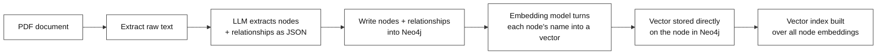
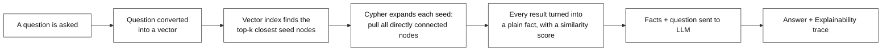
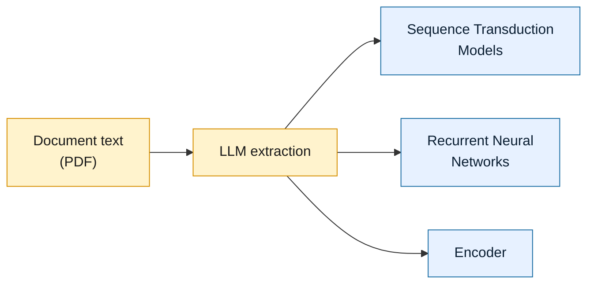
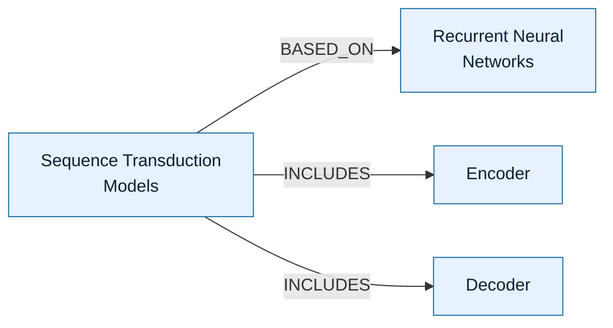
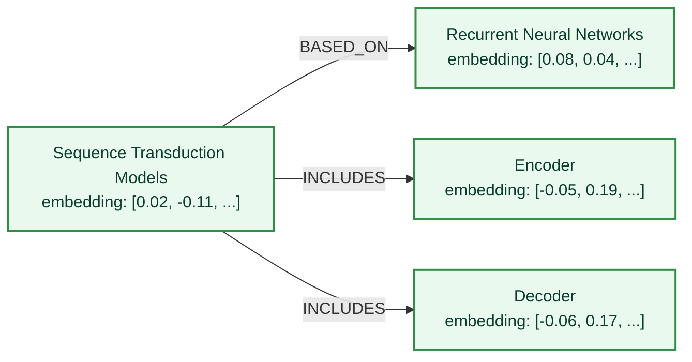
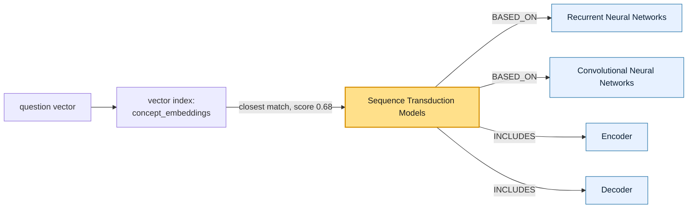
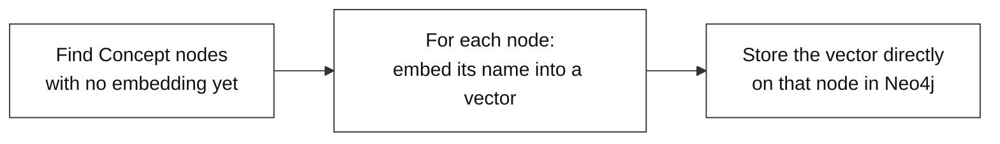

# Hybrid RAG: Vector Search + Graph Traversal on Neo4j

---

# Problem Statement / Use Case Overview

Pure vector search finds nodes that are *semantically close* to a question — great for figuring out roughly what a question is about, but it has no idea how that node connects to anything else. Pure graph traversal is the opposite: once you're standing on the right node, it's excellent at following relationships outward, but it has no way to figure out where to start unless the exact name is already known.

This document covers a pipeline that combines both. A knowledge graph is built inside Neo4j the same way as before, but this time every node also gets a **vector embedding** stored alongside it. When a question comes in, it's converted into a vector too, and Neo4j's **vector index** is used to instantly find the nodes closest in meaning to the question — these become "seed nodes." From each seed, a single Cypher query then expands outward to pull in every directly connected relationship. The result is a short list of graph facts that are both *semantically relevant* and *structurally connected*, which are handed to the LLM to produce the final answer.

**This pipeline has three connected parts:**

1. **Building the knowledge graph** — extracting entities and relationships from a PDF and writing them into Neo4j.
2. **Vectorizing the graph** — generating an embedding for every node and storing it directly on that node, then building a vector index over them.
3. **Hybrid retrieval** — turning a question into a vector, finding the closest seed nodes via the vector index, expanding each seed with a graph query, and answering using the combined context.

This is useful for:
- **Questions where the right starting node isn't named explicitly** — vector search finds the closest match by meaning, not exact wording.
- **Answers that need more than one connected fact** — once a seed is found, its neighboring relationships are pulled in automatically.
- **Combining two retrieval strengths in one query** — semantic relevance from the vector index, plus structural context from the graph, in a single round trip to the database.

> A knowledge graph stored in Neo4j — nodes, relationships, and Cypher — was covered in the earlier walkthrough. This one builds directly on top of that same graph, so only what's new here is explained in detail.

---

# Input Data

| Item | Detail |
|------|--------|
| **The PDF** | A document downloaded automatically from a link |
| **Your question** | A natural-language question — it doesn't need to name a node exactly |
| **LLM API Key** | Used to call the LLM that extracts entities/relationships and answers questions |
| **Neo4j Aura credentials** | A URI, username, and password for a running Neo4j Aura instance |
| **Embedding model** | Runs locally — no API key needed, downloaded automatically the first time it's used |

---

# Processing

### Part A — Building and Vectorizing the Graph



This diagram shows how the graph is prepared before any question is asked: text is extracted from the PDF, the LLM identifies nodes and relationships, they're written into Neo4j, and then every node is passed through an embedding model so that a vector representing its meaning is stored on the node itself. A vector index is then built over all of those stored vectors, which is what makes fast similarity search possible later.

### Part B — Hybrid Retrieval and Answering



This diagram shows what happens at question time: the question itself is embedded into a vector, that vector is compared against every node's stored vector using the vector index to find the closest matches, each of those matches is expanded outward with a Cypher pattern to bring in its neighbors, and the combined set of facts — each carrying a similarity score — is sent to the LLM to produce the final answer.

### Building a Sample Graph, With Embeddings

Before any question can be asked, the document has to actually turn into a graph with vectors sitting on it. Here's what that looks like for a few facts pulled from the Transformer paper:

**Step 1 — the document goes in, and the LLM pulls out nodes and relationships:**



**Step 2 — those nodes and relationships are written into Neo4j, forming the graph:**



**Step 3 — the embedding model runs over every node, and a vector gets attached to each one:**



The graph itself doesn't change shape in this last step — no new nodes or relationships are added. What changes is that each existing node now carries an extra property, its `embedding`, holding the list of 384 numbers produced by the embedding model. Once every node has one, the vector index built on top of them is what makes it possible to search this graph by meaning, not just by exact name — which is exactly what the next step relies on.

### How One Hybrid Query Finds Its Answer

The real strength of this approach is that vector search and graph traversal happen inside a **single Cypher query**, not two separate steps. Here's what that looks like for the question *"What models or mechanisms are discussed in the document?"*



The vector index doesn't return an exact keyword match — it returns the node whose stored vector is *closest in meaning* to the question, along with a similarity score between 0 and 1. In this case, "Sequence Transduction Models" scores 0.68 as the closest seed. The same Cypher query then immediately expands outward from that seed to whatever it's directly connected to, so the final result isn't just one node — it's the seed plus its relationships, all pulled back together in one pass.

---

# Output

**Extracting the graph structure** prints how many nodes and relationships the LLM found:

```
Asking LLM to extract graph nodes and edges...
Extracted 18 nodes and 23 relationships!
```

**Saving to Neo4j** confirms both writes:

```
Nodes saved to Neo4j!
Relationships saved to Neo4j!
```

**Generating embeddings** prints progress and a final confirmation:

```
Generating vectors for 18 nodes...
Success: All graph concepts vectorized!
```

**Running a hybrid query** prints every retrieved path along with its similarity score, followed by the two-part answer:

```
User Question: 'What models or mechanisms are discussed in the document?'

RETRIEVED HYBRID PATHS:
------------------------------------------------------------
(Similarity: 0.68) Sequence Transduction Models --[BASED_ON]--> Recurrent Neural Networks
(Similarity: 0.68) Sequence Transduction Models --[BASED_ON]--> Convolutional Neural Networks
(Similarity: 0.68) Sequence Transduction Models --[INCLUDES]--> Encoder
(Similarity: 0.68) Sequence Transduction Models --[INCLUDES]--> Decoder
(Similarity: 0.65) Google Research --[AUTHORS_AFFILIATED_WITH]--> Attention Is All You Need

--- FINAL ANSWER ---
The document discusses Sequence Transduction Models (including Encoder and
Decoder components), Recurrent Neural Networks, Convolutional Neural
Networks, and the Attention Is All You Need mechanism.

--- AI TRACING & EXPLAINABILITY ---
Step 1: Identify the central document node from the graph - "Attention Is
All You Need" is connected to "Google Research" via the
AUTHORS_AFFILIATED_WITH relationship.
Step 2: Find all model/mechanism nodes connected to the document context -
"Sequence Transduction Models" is the primary model discussed, with
BASED_ON relationships to "Recurrent Neural Networks" and "Convolutional
Neural Networks" (foundational models), and INCLUDES relationships to
"Encoder" and "Decoder" (architectural components).
Step 3: Compile all unique model/mechanism entities discussed in the text.
```

Notice that two different seed nodes were picked up in the same query — one scoring 0.68 and one 0.65 — because the top-k setting asks the vector index for more than one closest match at a time, not just the single best one.

---

# Tech Stack

| Component | Tool |
|---|---|
| **PDF Text Extraction** | `pypdf` — pulls raw text out of the PDF |
| **File Downloading** | `requests` — grabs the PDF from a link |
| **Entity/Relationship Extraction & Answering** | LLM (`nvidia/nemotron-3-ultra-550b-a55b:free`), accessed through `langchain-openai`'s `ChatOpenAI` wrapper |
| **Prompt Orchestration** | `langchain-core` — `PromptTemplate` and the `\|` pipe operator chain the prompt and the LLM together |
| **Graph Storage** | `Neo4j Aura` (cloud-hosted Neo4j) |
| **Database Driver** | `neo4j` Python driver |
| **Query Language** | `Cypher`, including `apoc.create.relationship` for dynamically named relationship types, and a native **vector index** for similarity search |
| **Embedding Model** | `sentence-transformers` / `all-MiniLM-L6-v2`, via `langchain-huggingface` — runs locally, produces 384-dimension vectors |
| **Graph Visualization** | `yfiles_jupyter_graphs_for_neo4j` |

---

# Underlying Concepts (Summarized)

**Embedding** is a way of turning a piece of text into a list of numbers — a vector — such that pieces of text with similar meaning end up with vectors that are close together. Here, every node's name is converted into a vector using the `all-MiniLM-L6-v2` model, which always produces vectors of exactly 384 numbers.

**Vector Index** is a structure Neo4j builds over a set of stored vectors so that, given a new vector, it can instantly find the closest matches without comparing it against every node one by one. It's created once with `CREATE VECTOR INDEX`, specifying the vector size (384) and the similarity function (`cosine`, which measures how close two vectors point in the same direction).

**Seed Node** is the term used here for a node found via vector similarity search — the starting point for graph expansion. Because it's found by meaning rather than exact text matching, the question never has to name a node exactly.

**Hybrid Retrieval** means combining two retrieval methods in one step: using vector similarity to decide *where* to start looking in the graph, then using Cypher traversal to decide *what else* is relevant once there. Vector search alone would miss connected context; graph traversal alone would need to already know where to begin. Together, one query does both.

**LangChain Prompt Pipelines** are a way of chaining steps together with the `|` operator — for example, `prompt | llm` means "fill in this prompt template, then immediately send the result to the LLM." It keeps the prompt-building and the model call as one readable, reusable expression.

> **Why this matters:** Asking "What models or mechanisms are discussed?" doesn't name a specific node, so a plain Cypher `MATCH` with an exact name would fail to find anything. The vector index instead locates the node whose *meaning* is closest to the question, and the graph traversal that follows fills in everything connected to it — combining the flexibility of natural language search with the precision of a graph.

---

# Pre-requisites

- **Basic familiarity** with Python (functions, loops, `import` statements).
- **Familiarity with a Neo4j knowledge graph built with Cypher** — nodes, relationships, and `MERGE`/`MATCH` queries — as covered in the earlier walkthrough.
- **An LLM API Key** — used to call the LLM for extraction and answering.
- **A Neo4j Aura instance** with the **APOC plugin enabled** — required for the dynamic relationship-naming step (Aura free instances have APOC available by default).

---

# Getting Neo4j Credentials

The pipeline needs three values to connect to Neo4j: a **URI**, a **username**, and a **password**. Here's how to get all three from a free Neo4j Aura instance:

1. Go to [neo4j.com/aura](https://neo4j.com/aura) and sign up, or log in if an account already exists.
2. From the Aura console, click **Create instance** and choose the **free tier**.
3. Give the instance a name and confirm creation. Aura will generate the database and show a screen with the connection details.
4. On that screen, **download or copy the generated password immediately** — Aura shows it only once. If it's missed, the password has to be reset from the instance's settings page.
5. Once the instance finishes provisioning (usually under a minute), open it from the console. The **Connection URI** is shown on the instance's overview page, and typically looks like:
   ```
   neo4j+s://xxxxxxxx.databases.neo4j.io
   ```
6. The **username** is `neo4j` by default unless it was changed during setup.
7. Store all three values — URI, username, password — as environment variables (`NEO4J_URI`, `NEO4J_USER`, `NEO4J_PASSWORD`) rather than pasting them directly into the notebook, so they aren't exposed if the file is shared.

Once these three values are set, the driver connection shown in the next section will pick them up automatically.

---

# Environment / Dependencies Setup

The cell below installs all required Python packages:

| Package | Purpose |
|---------|---------|
| `pypdf` | **PDF text extraction** |
| `neo4j` | **Database driver** — connects to Neo4j Aura and runs Cypher queries |
| `sentence-transformers` | Backs the local embedding model |
| `langchain-huggingface` | Wraps the embedding model in a simple `embed_query()` interface |
| `langchain-openai` | Wraps the LLM in LangChain's `ChatOpenAI` interface |
| `yfiles-jupyter-graphs-for-neo4j` | Renders the Neo4j graph as an interactive widget in the notebook |

> **Note:** Run this cell first — it only needs to be run once per session.

```python
!pip install -qU pypdf neo4j sentence-transformers langchain-huggingface langchain-openai yfiles-jupyter-graphs-for-neo4j
```

## Import Libraries

```python
import os
import json
import requests
from pypdf import PdfReader
from neo4j import GraphDatabase
from langchain_openai import ChatOpenAI
from langchain_huggingface import HuggingFaceEmbeddings
from langchain_core.prompts import PromptTemplate
```

| Import | Purpose |
|---|---|
| `os` | Used for file paths and folders |
| `json` | Parses the LLM's JSON reply into Python objects |
| `requests` | Downloads the PDF |
| `PdfReader` | Extracts raw text from the PDF |
| `GraphDatabase` | The Neo4j driver's entry point for opening a connection |
| `ChatOpenAI` | LangChain's wrapper for calling the LLM |
| `HuggingFaceEmbeddings` | Loads the local embedding model |
| `PromptTemplate` | Builds a reusable prompt with fillable variables |

## Connect to Neo4j

```python
# --- Neo4j Aura Configuration ---
NEO4J_URI = "YOUR-NEO4J_URI"
NEO4J_USER = "YOUR-NEO4J_USER"
NEO4J_PASSWORD = "YOUR-NEO4J_PASSWORD"

# Open a persistent connection to the database
driver = GraphDatabase.driver(NEO4J_URI, auth=(NEO4J_USER, NEO4J_PASSWORD))
driver.verify_connectivity()
print("Success: Connected to Neo4j Database!")
```

> **Note:** Replace `"YOUR-NEO4J_URI"`, `"YOUR-NEO4J_USER"`, and `"YOUR-NEO4J_PASSWORD"` with the actual values from the Neo4j Aura instance created above. To avoid pasting these directly into the notebook, they can instead be loaded with `os.getenv("VARIABLE_NAME")` after setting them as environment variables — for example, `NEO4J_URI = os.getenv("NEO4J_URI")` — which keeps the actual credentials out of the file itself. `verify_connectivity()` immediately checks that the connection details are correct.

## Configure the LLM

```python
llm = ChatOpenAI(
    openai_api_key="your-api-key",
    openai_api_base="https://openrouter.ai/api/v1",
    model_name="nvidia/nemotron-3-ultra-550b-a55b:free",
    temperature=0.0
)
print("LangChain LLM configured successfully!")
```

> **Note:** Replace `"your-api-key"` with the actual LLM provider key, or load it the same way with `os.getenv("OPENROUTER_API_KEY")`. `temperature=0.0` keeps answers consistent and factual, which matters when the reply needs to be parsed as JSON later.

---

# Step-wise Instructions — Development

---

### Step 1 — Download PDF from Link & Extract Text

```python
os.makedirs("data", exist_ok=True)

PDF_URL = "https://arxiv.org/pdf/1706.03762.pdf"
PDF_FILENAME = "data/downloaded_paper.pdf"

print(f"Downloading PDF from link: {PDF_URL}...")
response = requests.get(PDF_URL)
response.raise_for_status()

with open(PDF_FILENAME, "wb") as f:
    f.write(response.content)
print(f"PDF downloaded successfully to {PDF_FILENAME}!")

print("Extracting text from PDF...")
reader = PdfReader(PDF_FILENAME)
document_text = ""

for page in reader.pages:
    document_text += page.extract_text() + "\n"
    # Stop after 1500 characters, so the demo runs fast
    if len(document_text) >= 1500:
        document_text = document_text[:1500]
        break

print(f"Extracted {len(document_text)} characters of text.")
```

By the end of this step, `document_text` holds a short block of plain text pulled from the PDF, ready to be handed to the LLM for entity extraction.

---

### Step 2 — Extract Graph Structure

```python
print("Asking LLM to extract graph nodes and edges...")

prompt = f"""
You are a data extraction AI. Read the text and extract a knowledge graph.
Identify key concepts and the relationships between them.

TEXT:
{document_text}

CRITICAL INSTRUCTION: Reply ONLY with valid JSON.
Format exactly like this:
{{
  "nodes": [ {{"name": "Concept 1"}}, {{"name": "Concept 2"}} ],
  "relationships": [ {{"source": "Concept 1", "target": "Concept 2", "type": "RELATES_TO"}} ]
}}
"""

response = llm.invoke(prompt)

raw_output = response.content.strip()
# The AI sometimes adds ```json marks around its answer. We remove them here.
if raw_output.startswith("```json"):
    raw_output = raw_output[7:-3].strip()
elif raw_output.startswith("```"):
    raw_output = raw_output[3:-3].strip()

graph_data = json.loads(raw_output)
print(f"Extracted {len(graph_data.get('nodes', []))} nodes and {len(graph_data.get('relationships', []))} relationships!")
```

Unlike the source-relation-target triples used elsewhere, this prompt asks the LLM for `nodes` and `relationships` as two separate lists — a format that maps cleanly onto the two Cypher writes that come next.

---

### Step 3 — Save Graph to Neo4j (Raw Cypher)

Nodes are written first, then relationships, since a relationship can only be created between nodes that already exist.

```python
# Save nodes to Neo4j
node_query = """
UNWIND $nodes AS node
MERGE (c:Concept {name: node.name})
"""

with driver.session() as session:
    session.run(node_query, nodes=graph_data.get("nodes", []))

print("Nodes saved to Neo4j!")
```

```python
# Save relationships to Neo4j
rel_query = """
UNWIND $relationships AS rel
MATCH (source:Concept {name: rel.source})
MATCH (target:Concept {name: rel.target})
CALL apoc.create.relationship(source, replace(toUpper(rel.type), ' ', '_'), {}, target) YIELD rel AS r
RETURN count(r)
"""
# This special command lets us name the relationship using a variable (like "BASED_ON").
# Normal Cypher code cannot do this.

with driver.session() as session:
    if graph_data.get("relationships"):
        session.run(rel_query, relationships=graph_data.get("relationships", []))

print("Relationships saved to Neo4j!")
```

`UNWIND` turns a list of items (all the nodes, or all the relationships) into individual rows so the same query can be run once per item. Normal Cypher requires a relationship's type to be written directly into the query text — it can't be filled in from a variable. `apoc.create.relationship` works around that limit, letting the relationship type come from `rel.type` instead of being hardcoded, which is exactly what's needed since the LLM decides those types dynamically.

---

### Step 4 — Initialize Embedding Model & Create Vector Index

```python
embeddings = HuggingFaceEmbeddings(model_name="all-MiniLM-L6-v2")

# This model always makes vectors of size 384. The number below must match.
index_query = """
CREATE VECTOR INDEX `concept_embeddings` IF NOT EXISTS 
FOR (c:Concept) ON (c.embedding) 
OPTIONS {
    indexConfig: { 
        `vector.dimensions`: 384, 
        `vector.similarity_function`: 'cosine' 
    }
}
"""
```

`all-MiniLM-L6-v2` is a small, fast embedding model that runs locally rather than through an API call, and it always outputs a vector of exactly 384 numbers — which is why the index is configured with `vector.dimensions: 384` to match. `cosine` similarity measures how closely two vectors point in the same direction, regardless of their length, which is the standard way to compare text embeddings.

---

### Step 5 — Generate and Store Vector Embeddings



```python
with driver.session() as session:
    # Only get nodes that do not have a vector yet, so we don't do the work twice
    result = session.run("MATCH (c:Concept) WHERE c.embedding IS NULL RETURN elementId(c) as node_id, c.name AS text")
    records = [record for record in result]
    
    if not records:
        print("All nodes already have embeddings.")
    else:
        print(f"Generating vectors for {len(records)} nodes...")
        for record in records:
            vector = embeddings.embed_query(record["text"])
            session.run(
                "MATCH (c) WHERE elementId(c) = $node_id SET c.embedding = $vector", 
                node_id=record["node_id"], 
                vector=vector
            )
        print("Success: All graph concepts vectorized!")
```

This step checks each node to see if it already has a vector stored on it. If it doesn't, the node's name is turned into a vector and saved back onto that same node. Since already-vectorized nodes are skipped, this step can be run again later without repeating work or creating duplicates. By the end of it, every node in the graph has its own vector attached, ready to be searched.

---

### Step 6 — Define the Hybrid Retrieval Function

```python
def execute_hybrid_retrieval(driver, question, top_k=3):
    print(f"User Question: '{question}'\n")

    # Turn the question into a vector, using the same method used for the graph nodes
    question_vector = embeddings.embed_query(question)

    # First find the nodes closest in meaning to the question.
    # Then look at what each of those nodes is connected to.
    hybrid_query = """
    CALL db.index.vector.queryNodes('concept_embeddings', $top_k, $question_vector)
    YIELD node AS seed, score
    MATCH (seed)-[r]-(neighbor:Concept)
    RETURN seed.name AS Seed_Node, score AS Semantic_Score, type(r) AS Relationship, neighbor.name AS Connected_Node
    """

    retrieved_facts = []
    with driver.session() as session:
        result = session.run(hybrid_query, top_k=top_k, question_vector=question_vector)

        print("RETRIEVED HYBRID PATHS:")
        print("-" * 60)
        for record in result:
            # Turn each result into one easy-to-read line of text
            fact = f"(Similarity: {record['Semantic_Score']:.2f}) {record['Seed_Node']} --[{record['Relationship']}]--> {record['Connected_Node']}"
            retrieved_facts.append(fact)
            print(fact)

    return retrieved_facts
```

This function does two things in a row, inside one query to the database. First, it turns the question into a vector using the same method used for the graph's nodes, so both sides can be compared fairly. Then it asks the vector index for the closest matching nodes, along with a score showing how close each match is. Right after that, it looks at what each of those matching nodes is connected to, and returns the whole thing as a simple list of readable facts.

---

### Step 7 — Generate Answer using LangChain Prompt Pipelines

```python
def generate_hybrid_answer(question, retrieved_facts):
    if not retrieved_facts:
        return "No relevant context found in the database."
        
    facts_block = "\n".join([f"- {f}" for f in retrieved_facts])
    
    template = """
    You are an expert AI research assistant using a Neo4j Knowledge Graph.
    Answer the question using ONLY the connected relationship paths provided below.

    Graph Relationships:
    {facts_block}

    Question: {question}

    Output your response in EXACTLY two sections:
    --- FINAL ANSWER ---
    [Provide a direct, simple, 1-sentence answer.]

    --- AI TRACING & EXPLAINABILITY ---
    [Explain step-by-step how the answer was derived from the Neo4j graph context.]
    """
    
    prompt = PromptTemplate(template=template, input_variables=["facts_block", "question"])
    # The | joins the steps together: first fill in the prompt, then send it to the AI
    chain = prompt | llm
    
    response = chain.invoke({"facts_block": facts_block, "question": question})
    return response.content
```

This function builds the final prompt using a reusable template with two blank spots — one for the retrieved facts, one for the question — and then chains that template directly to the LLM, so filling in the blanks and getting an answer happens in one step. If no facts were retrieved at all, it skips calling the LLM and returns a simple message instead.

---

### Step 8 — Querying

```python
query = "What models or mechanisms are discussed in the document?"

facts = execute_hybrid_retrieval(driver, query, top_k=3)

print(generate_hybrid_answer(query, facts))
```

This is where everything from Steps 1–7 runs end-to-end: the question is embedded and matched against the vector index, the matching seeds are expanded into connected facts, and those facts are passed to the LLM to produce the final answer plus its reasoning trace. Notice `top_k=3` — this is why more than one seed node (with different similarity scores) can show up in a single answer.

---

### Step 9 — Visualize the Graph Inside the Notebook

```python
from yfiles_jupyter_graphs_for_neo4j import Neo4jGraphWidget

widget = Neo4jGraphWidget(driver)
widget.show_cypher("MATCH (n:Concept)-[r]-(m:Concept) RETURN n, r, m")
```

This renders the full graph — including every embedded vector sitting invisibly on each node — as an interactive, zoomable widget inside the notebook, using the same connection opened earlier.

---

# What We Learnt

By the end of this walkthrough, a Neo4j knowledge graph has been extended with vector embeddings, and a single Cypher query has been used to combine semantic search with graph traversal — using meaning to decide where to start, and relationships to decide what else matters.

**Key takeaways:**
- **Vector search and graph traversal solve different problems** — one finds a relevant starting point by meaning, the other expands outward from it using structure. Combining them covers the gap either one leaves on its own.
- **Embeddings can live directly on graph nodes** — no separate vector database is needed; Neo4j's own vector index searches the same nodes the graph traversal runs on.
- **A single database query can do both retrieval steps at once** — finding the closest matching nodes and pulling in what they're connected to, in one round trip.
- **Asking for more than one match broadens the answer** — grounding it in multiple relevant starting points instead of just the single closest one.
- **Relationship types can be decided at run time** — useful when the kind of relationship between two concepts is chosen by the LLM on the fly, rather than fixed in advance.
- **The similarity score is part of the evidence** — each retrieved fact carries a number showing how closely it matched the question, giving a transparent sense of how confident the retrieval step was.